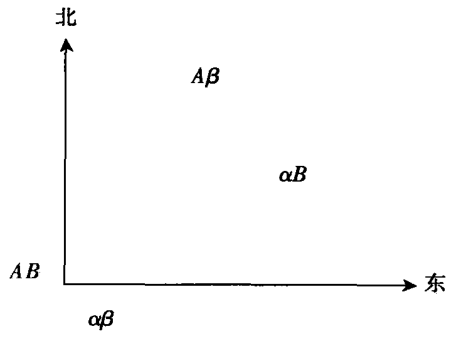
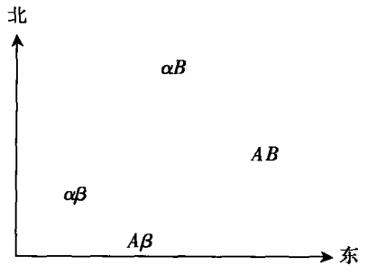
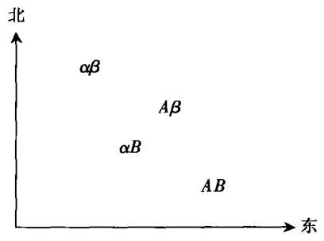
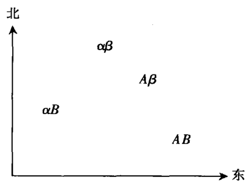
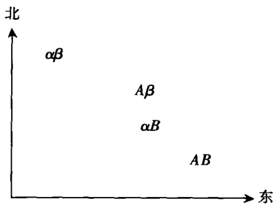
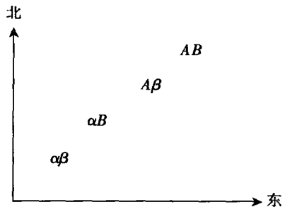

# 第2章 论谈判

  本章主要讨论有关谈判过程中的战术技巧问题。谈判既包括谈判主
体之间的唇枪舌剑，也包括二者之间无声无息的心理斗争。后者
中，谈判主体都明白，自己的一举一动都将对对方产生影响，从而试图
通过各种具体行为来达到自己预期的目标。经济学意义上的谈判包括劳
资谈判、关税谈判、少数竞争者间的庭外调解、房产商与顾客之间的谈
判等。经济学之外的谈判含义十分广泛，从大规模报复行动到出租车司
机的通行权等问题。

  我们这里所指的谈判不是调整谈判主体间经济利益分配的谈判。后
者涉及谈判的功效性（efficiency）问题。例如，保险公司是否可以通过
向投保人提供现金，而非修理被损坏的汽车来达到既节省成本又令投保
人高兴的目的？雇主是否可以通过向愿意以实物顶替薪水的雇员提前增
加薪水来达到节省成本的目的？相反，我们关注的是谈判的分配（dis-
triutional）效用问题，即：在什么条件下，谈判对主体一方更有利。当
交易完成，商品从商家手中转移到购买者手中后，价格还有什么意义
呢？当两辆卡车相向而驶，但是道路仅可通过一辆卡车时，哪辆卡车会
让路呢？

  上述情景最终都涉及到完全谈判。在完全谈判中，谈判主体双方很
大程度上都会受到自己对彼此行为预期判断的影响。然而，由于谈判主
体每一方都受到自我对对方行为预期判断的影响，并且知道对方亦然，
因此双方对彼此行为的预期就会发生交叉影响。当一方最后一次做出充
分的让步时，一场谈判也就宣告结束。那么，他为什么要首先让步呢？
原因在于他认为对方将不会让步。“我必须让步，因为对方不让步。对
方不让步，因为他认为我一定会让步。他认为我会让步，因为他认为我
认为他是这么认为的。”看起来双方之间似乎存在很大的选择余地，并
会产生不同结果。但是无论产生何种结果，总比双方之间没有达成任何
共识要好。这是“完全谈判”成立的核心条件，因为总有一方愿意率先
妥协让步，双方从而达成某种共识。如果双方都知道达成妥协的临界
点，那么任何一种结果都是至少一方愿意妥协接受的结果，对此对方也
会心领神会。如果这样的话，也就不存在任何谈判僵局的问题。

  因此，实际谈判一定能够达成某种结果。这种情况下，我们也许在
逻辑上找不到答案，但是我们可能在运用的策略上找到想要的答案。本
章的目的也是为了介绍一组重要的谈判策略，而且特别适用于不确定的
情况。本质上讲，这组策略是建立在谈判主体自愿原则的基础上，而且
要求主体牺牲自我的自由选择权。这意味着遏制对手的权力就是限制自
已的权力。在谈判中，优势也是弱势，自由也许只是让步的自由，破釜
沉舟也许意味着给对方更多的机会。

## 谈判实力：自我约束的实力

  “谈判能力”、“谈判优势”、“谈判技巧”都似乎暗含，谈判的优
势属于拥有实力、优势和技巧的谈判主体。如果把谈判的胜利局限于获
胜的一方，上述观点无疑是正确的。但是，如果认为谈判中拥有更多智
慧和技巧的一方，或谈判中拥有更强大的经济、物质基础、军事力量以
及打击承受能力的一方占有优势，上述的观点就失去了积极意义。因
此，对谈判主体而言，这些条件绝不是在任何谈判中都是有利的，有些
时候往往适得其反。

  一个经验丰富的谈判家也许会发现，要成为一名真正立场坚定的判
断者十分困难。如果有人上门威胁主人说，要是不给10美元，就会捅
他一刀。主人如果看到来人满脸杀气腾腾，也许真会妥协。鉴于此，当
对手过于狡猬，能够识别威慑时；或者对方过于软弱，根本无力保护自
我时，那就完全没有必要使用威慑。一个无力保证收支平衡、税收、运
用暴力机器保卫自己国家的政府也许会得到国际社会的援助，但是援助
国如果无法控制该国的资源，也会拒绝提供援助。这里引用一个大家比
较熟悉的经济学术语“价格领先”（price leadership）。在供不应求的市
场中，“价格领先”意味着小企业无利可图而逃之夭夭和大企业的“欺
行霸市”。

  讨价谈判的实力也可被看做是欺骗（bluff)、愚弄（fool）的实力，
“这种能力也指自己制定最有利的价格，并骗取对方相信这是自己所能
承受的最终价格”。[^2-1]虽然欺骗和愚弄不离其中，但是欺骗分为两种：一
种是隐瞒事实。如顾客故意隐瞒自己的收入和家庭成员：另一种是策略
性的。假设商家和顾客对彼此十分了解，一方如何欺骗另一方呢？尽管
买方能够承担20美元并知道卖方也知道自己的情况，但是他还是可能
会说自己最多能够出16美元。如果卖方让步，难道我们可以说卖方被
欺骗了？难道卖方不知道真实情况吗？如果买方的骗术被卖方识破，难
道买方不知道下一步怎么做吗？假设买方感到（feels）自己非常坚决，
并以卖方一定会让步作为其理由。一旦卖方妥协让步，事后买方也许会
认为卖方并没有被“愚弄”。无论怎么说，欺骗和愚弄观念在此都不完
全适用。

[^2-1]: (J.N.Morgan) ,Bilateral Monopoly and the Competitive Output,Quarterly Journal of Economics: 63:376n6 (August 1949) .

  如才能让一个人相信一件事昵呢？答案很大程度上取决于现实条
件。“正确吗？”事实表明，向一个人证明一件事正确比向其证明一件
事错误要容易得多。要证明自己健康，我们只需要找来一位合格的医生
作证。要证明自己的成本和收入情况，我们只需要让一个人查查经过国
家税务局或一个信誉良好的会计公司审计过的账本。但是，要说服一个
人相信一件事是错误的，我们可能很难找到令人信服的证据。当一个人
试图说服另一个人，他只能支付16000美元去买一栋价值2万美元的
房子时，他该如何利用真话比假话更令人可信的优势呢？答案是：努力
让它听起来更像是真话。那么，买方又是如何做到这一点的呢？如果房子
的位置靠近买方的工作场所，他会闭口不谈自己的工作，并努力说服卖方，
房子对他来说现在只值16000美元，这已是自己能够承担的最高价钱
了。如果他付出高价买了这栋房子，还不如到别处另寻更好的居所呢。

  现在我们假设：买方已经与第三方达成了不能反悔的协议，并且已
经生效。根据双方协议，买方的支付不会超过16000美元，否则买方
将输掉5000美元。如果这样的话，卖方就输了，因为买方需要做的只
是将事实告诉卖方而已。除非卖方懊恼逞凶，恶意占有房子不愿出让，
否则形势对他十分不利。“客观”形势——买方的真实意图——已经主
动、明确、完全地发生逆转。卖方要么继续保留房子，要么低价卖掉。
这个案例揭示，如果买方能接受一个不可变更的契约，卖方也知道这一
事实，买方就可以把谈判的空间缩小到对自己最有利的状态。此外，这
个案例还说明，由于策略本身的欺骗性，策略可能存在，也可能不存
在。买方能否找到一个能够使自己履行契约的有效方式，很大程度上取
决于买卖双方的身份、居所，以及众多法律保障的机制安排（包括在本
假设案例中，买方与第三者达成的协议是否具有法律效力）。

  如果谈判主体共同生活在一个“真话”（cross my heart）被普遍认
为具有法律效力的文化氛围内，买方需要做的是坚持自己的支付能力不
能超过16000美元，并发誓如有隐瞒，将受到严厉的惩罚。这样，买
方就赢了，至少卖方不会用大喊大叫“19000美元，我发誓”来要挟买
方。假设买方是受董事会委托只能以16000美元价格购买该房的代理
人，而且董事们根据公司章程又不能在几个月内再次开会，买方也不能
私自越权加价，同时，卖方也熟悉这一情况，那么，只要出现下列情况
之一，买方就是“赢家”：卖方没有将自己的要价锁死在19000美元；
或者买方坚持自己只能支付16000美元，并且不愿因多支付一美分而
失去个人良好声望和谈判信誉，因为他多支付的事实可能会被别人得知
或卖主一时高兴把消息捅了出去，以迫使买方履行承诺。当然，除非卖
方对情况了解得十分清楚，否则这种方式无须牺牲灵活性。

  契约式承诺有时并非如第一印象那样有效。在前面那个带有自罚性
质的案例中，卖方完全可以找出第三者，提出一个适中的报价，并威胁
他：如果不能免除买方的违约责任，他将以16000美元出售房子。如
此，买方与第三方所达成的协议——与大多数契约式承诺样——转换
了谈判中涉及的房子与主体的关系，旨在避免第三方涉入谈判或做出让
步。换句话说，契约式承诺通常涉及假设的暂时“转移成本”（transfer
cost）问题，但并非“真实成本”（real cost）以及当事方是否愿意卷入
无休止的谈判之中。假如第三方以巨大的“转移成本”出现，承诺通常
也会被履行。（假设该协议涉及多人，鉴于高昂的“真实成本”，他们
也许不愿意卷入谈判。）[^2-2]

[^2-2]: 也许解决双边垄断问题的最佳方式是，一方转移其边际成本曲线，从而使共同利润回到其最大值的最初起点零。一方可能通过不可更改的售后回租合同实现这一目的，即向第三方出卖特许权合同以套取大量现金，而特许权与其产出相关联，共同成本大于其他产出的共同税费。现在，他在任何价格下都无法生产，除非这一价格或生产能够保证最初的共同利润属于其本人。另一方看到这一合同，也会表示同意，并接受其真实的最小利润。真正的“赢者”通过出卖特许权而获得全部原始利润，利润并不影响他的动机，因为这与他的生产无关。第三方支付大量现金（除去回扣），因为他知道第二方一定会让步，自己会最终赢得暂时的特许权费。问题在于，获得特许权的一方并非“长期一员”，否则后者会威胁与他终止特许关系，并拒绝任何协调，回到最初的边际成本状况。但是，我们可以假设机制的完善能够使特许专业化，从而最终的胜利依赖于从不食言、具有良好声誉的一方，并且不被卷入任何谈判之中。

  我们的话题中最有趣的一部分，涉及是否履行以及如何履行承诺。
首先，我们有必要假设一个没有现实缺陷的完美状态。在这个完美状态
中，完全承诺可以自由存在。我们还得考虑一种“说真话”被普遍接受
具有绝对效力的文化环境。在这种文化环境中，谈判一方提出的报价都
是最终报价，并将被另一方接受。如果一方知道另一方的真实价格，目
标就是第一报价必须是实盘（firm offer)，后果的全部责任则属于接受或
拒绝报价的另一方。这时，整个谈判过程宣告结束，最初的承诺方取
胜。

  在此，我们有必要提出沟通方面的一些注意事项。谈判双方一定要
通过信件进行沟通。虽然当一方签字时，承诺就已经生效，但是另一方
这时并不知道，因为他还没有收到信件。现在的情况是，一方还在起草
信稿时或第一封信到达之前，另一方或许已经提出了条件，结果，却被
告知没有现货。可以说，双方处于信息极不对称的位置。任何一方都必
须做好心理准备，准备面对僵局或对方已经另有意向的局面。

  尽管如此，信息的不对称性或许对尚未收到信函的一方十分有利，
因为他不需要承担接受对方提出的条件后又反悔的责任。（换句话说，
如果一方无法进行有效沟通，就可以为自己的不作为开脱责任。另一方
也可以以自己对对方条件不详为由，而拒绝提出条件。）如果承诺不仅
可以体现在语言上，也可体现在某种形式或行为上，那么在一方的不作
为能被充分理解的情况下，其对承诺的不作为绝对是一个有利条件，因
为另一方明白只有自己做出让步才能避免僵局出现。

  假设整个国民中，只有一部分人群“说真话”具有（或被认为具
有）效力，那么，其中对他人情况了如指掌（或应该知道）的那部分人
就占有绝对的优势，因为他们可以轻松地做出决定，而其他人却不能。
如果他说“16000美元，我向上帝发誓，这绝对是真实的价格”，他的
报价也就是最终价格。如果他说“19000美元”，那他只是（或应该是）
在“讨价还价”。

  在普通的讨价还价过程中，如果一方不知道另一方的真实价格，双
方之间也许存在一个互相探询对方底线的过程。但是，这一过程会很快
发展为相互发盘与还盘的过程。由于各种实际原因，双方的讨价还价总
会影响“真实”的价格底线。假设一方相信某种履行承诺的方式，而另
一方则没有，那么后者往往追求诸如“公开”其底线价格等“一般”谈
判技巧，而前者将继续坚持自己的立场。

  前面的探讨旨在向读者揭示自我承诺（self-commitment）的可行性
和合理性。尽管许多案例涉及了相关的谈判策略与技巧，但是一些研究
人员很少能自信地区分相关策略的合理（logical）运用、本能（intuitive)
运用和无意识（inadvertent）运用之间的异同之处。例如，工会领导者通
常不会在劳资谈判期间或之前为工会成员的利益而兴奋不已、坚定立
场。如果工会希望得到2美元，并期望管理部门还价是1.6美元，那么
工会有必要说服工人相信，管理部门能够支持2美元，一旦无法达到这
个目标，那就是谈判人员的无能。工会这么做的目的——我们研究得到
的可行性结论——也是为了让管理部门明白；即使谈判人员能够接受低
于2美元的条件，他们也只能坚持2美元的立场，因为他们无法控制工
人的决定；或者如果让步，他们就难咎其职了。换句话说，工会谈判人
员人为地缩小了自己的权限，并以工会无法阻止罢工威胁管理部门，看
起来这似乎是工会主动放弃阻止罢工的权力。

  上述的情景似乎也存在于美国与其他国家的政府间谈判，如前者向
后者提供援助或削弱关税谈判。如果行政部门拥有充分的权限决定自己
的谈判活动，谈判就不会导致任何所谓的罢工活动，而以存有争议的妥
协立场结束。因为谈判对手知道，美国政府宁愿妥协结束谈判也不愿无
疾而终。但是，如果行政部门在司法部门的监督下进行自己的谈判活
动，并将受到法律的约束，而国会不可能在必要的谈判期间修订法律来
满足行政部门谈判的需要，那么，行政部门的强硬立场就会让谈判对手
清晰可见。

  代表国家利益参加各种国际谈判的谈判代表通常都知道，国际谈判
存在着很大的谈判空间，谈判主体的讨价还价也会产生不同的结果。在
谈判正式开始之前，谈判人员总是设法发表各种声明制造气氛，强调自
已的坚定立场，从而激起民意，为自己在谈判中创造有利条件。一旦这
种造势活动成功并将某种信息传达给谈判对手，那么，最初的谈判立场
似乎看起来更像是终极结果。

  这些案例都呈现一些相同的特点。第一，谈判一方并不急于得到最
终的结果，他们更重视与谈判对手的沟通。第二，做出最终决定对双方
而言显然是一件非常困难的事情，更不用说谈判主体了解对方的真实意
图和立场。第三，谈判正式开始之前，谈判双方可能都在进行同样的准
备活动。第四，尽管谈判双方都有提出条件的机会，但是机会对双方而
言并非均等。由于民主政府受到民意的限制，提出条件的能力显然无法
与集权政府相比。最后，由于谈判双方提出的强硬条件有可能超过对方
的接受能力，因而双方都存在可能导致谈判出现僵局或谈判失败的风险。

## 谈判机制及其结构特点

  谈判本身特有的一些机制和结构特点可能造成提出条件的策略和技
巧对一方有利，而对另一方相对不利的局面，甚至造成谈判双方同时提
出条件或谈判出现僵局。

  **巧用谈判代表** 谈判代表至少以两种方式影响双方提出条件的权威
性。一方面，谈判代表通常会接受难以更改或根本无法更改的指示，而
且这些指示（或者说谈判人员的非灵活性）易于暴露给谈判对手。这一
原则适用于行政部门与司法部门或管理层与董事会之间，特别是使节出
席的谈判场合，即在时间紧迫的谈判过程中，虽然主要谈判人员与使节
之间存在较大分歧，但在谈判结束之前，双方无法进行有效沟通。

  另一方面，接受委托的“代理人”必须能够在其权限内自由决定谈
判事项，即使其与被代理人在谈判期间就谈判的原则立场存在分歧。汽
车保险问题就属于这一类情况。参加庭外和解的投保人如果以上诉威胁
保险公司，其威胁显然无法对后者产生很大的效果，因为为了维护保险
公司以后的声誉和形象，后者会不惜一切代价进行还击。[^2-3]

[^2-3]: 交通案例中的通行权问题的解决方法是，胜者是第一个为汽车投全险的司机，因为他不必惧怕任何交通事故，而另一方必须妥协、退让。（后者没有还价的余地，因为前者已经投了全险，现在没有保险公司愿意为其投保。）更严重的情况是，工会罢工基金的减少，降低了每个工会阻止工的动力。双边垄断的解决方式反映了对第三者存在转移利益的问题，并影响一方动机结构的变化。

  **保密与公开** 提出条件的一个有效方式——有时可能是惟一方
式——是假借维护谈判主体的声誉和尊严。如果代表国家利益的谈判代
表有权做出较小的让步并与其个人奖惩密切联系，他们就会千方百计将
让步控制在自己允许的范围内。如果工会在与企业主的谈判中做出极大
的让步，其威望和声誉将受到严重的挑战，并失去进一步要协的余地。
（同样的道理适应于普遍公开化的国防事务。“如果你这么做了，我就
必须以同样的方式对待别人。”）但是，有时谈判也需要适度地对外公
开，如谈判的最初条件和最终结果。一旦保密事项涉及谈判核心问题或
谈判结果一时无法预见，这个方法就失去了作用。如果谈判一方具备对
外公开的条件，而另一方不具备这样的条件，后者就会竭尽全力避免相
关的对外公开事宜以扭转自己的不利处境。如果双方都担心彼此同时使
用这种方法将造成谈判出现僵局，那么他们会努力就相关的保密事项达
成某种共识。

  **交叉谈判** 如果工会有能力（即使是暂时性地）同时参与几个谈
判，并敢于以自己的谈判声誉冒险，而管理部门却不具备这样的条件，
那么，率先主动转移到其他谈判问题的一方就掌握了谈判的主动权，即
使该方在这些谈判中做出妥协让步，其强硬立场也将超过对方的承受能
力。[与谈判双方在谈判最初阶段重视的立场坚定性相比，谈判主体的
“名誉价值”（reputation value）与谈判结果的关系相对松散。]双方之
间策略与反策略或技巧与反技巧并存，例如谈判双方都有可能人为地对
对方立场产生误解，或努力达成一个与最初的立场不同的结果。如果谈
判中，谈判的内容被扩大化，例如劳资谈判成了额外福利谈判，这就背
离了原来的谈判初裹，那么只好请首先提出另外议题的一方“出局”
(out)，而“出局”则削弱了该方的谈判地位并对其产生不利影响。

  **持续谈判** 国际谈判中有时存在这么一个特殊场景：谈判双方在就
一个问题进行谈判的同时或者在不久的将来，还就多个问题进行谈判。
这一谈判场景的逻辑结构十分微妙。为了说服谈判对手相信自己已经退
到了谈判的底线，一方可以巧妙地说：“如果我方在这个问题上做出让
步，你方就会在其他问题上得寸进尺。为了尊严和荣誉，我方必须坚定
自己的立场。”这样的话，谈判对手现在同时成了维护其谈判尊严的
“第三方”。当然，通常只有在地区性谈判中才会出现这一情况。实施威
胁的谈判一方不仅达到了自己的目的，并且就提高未来威慑效果的长期
性（而非暂时得到的利益）而言，也加强了威慑的效果。

  **限制性议程** 当谈判涉及两个主题时，双方是否决定同时，或同时
不同地，或在不同时间进行相关问题的谈判与谈判结果没有丝毫联系，
特别是在合法的普通谈判中，某种潜在敲竹杠式的威胁存在时。对抗威
胁的方式多种多样，包括拒绝对方的条件、谈判中不作为，甚至终止谈
判。但是，如果威胁的对象涉及其他谈判问题的议程，潜在威胁就会变
得更加有效。

  关税谈判就是一个典型案例。如果谈判的焦点是干酪和汽车关税，
谈判一方也许会以提高其他商品的关税威胁对方以达成对自方有利的结
果。但是如果被威胁一方仅仅被授权进行前两个问题的谈判；或者在谈
判之前双方已经达成相关协议，即在双方尚未就前面两个问题达成共识
前，不得进行其他问题的谈判，那么，威胁主体的伎俩只好另待良机。
如果威胁的方式不容许对外公开，那么，来自公开化的压力也会妨碍其
发挥应有的作用。

  **补偿的可能性** 费勒（Fellner）曾经指出，谈判主体能否达成共识
很大程度上取决于成本和利益的再分配方式。[^2-4]例如，在双边垄断的市
场环境中，双边寡头分割市场的原则是实现共同利益的最大化，其中最
初阶段的利润增长点最为关键；其他市场划分方式要求其中一个公司必
须给子另一方适当的经济补偿。但是，一旦补偿行为成为非法共谋的证
据，或补偿的动机被股东误解，或双方对彼此存有疑心，那么，双方对
公平占有最初利润增长点的要求势必会对双方共有利益产生不利影响。

  如果一定要分配属于某人的东西时，则分配的成本取决于补偿的程
度。在这种情况下，谈判的“议程”（agenda）就变得尤其重要，因为
补偿的主要方式是一方在其他问题上的妥协让步。如果两个同时进行的
谈判密切了双方的关系，二者就有可能达成某种补偿结果；反之，每一
方只能继续独占自己的所属物。

[^2-4]: (W.Feller) ,Competition Among the Feu (New York, 1949), Pp34-35, 191~197, 231-232, 234.

  在某种情况下，也许就不同的问题分别进行谈判对谈判一方有利，
而另一方则希望同时进行两个问题的谈判。例如，现在有两份都价值3
美元的物品需要分配。A得到的部分价值2美元，而B得到的部分价值
4美元：在具体分配过程中，分配后的物品成为持有者的“个体”
(one-man）财产。如果补偿在机制上无法实现，只要两件物品被分别保
管，那么B将被迫承担全部分配成本。B无法以无作为威胁A，因为哪
部分A都不想单独占有。但是如果B将双方的占有物放在一起，提出
自己占有一部分，而A占有剩余的部分，并有效地威胁A必须其中二
选一，否则自己也不会占有。现在A面临惟一的选择，占有价值4美
元的那部分并同时承担3美元的分配成本。无论A占有哪部分，B都将
自己分摊的分配成本减少一半。

  作为谈判的典型，经济学问题也存在一个重要缺陷，它们总是试图
将不可分配的东西与补偿行为联系起来。例如，在一家房屋后面挖一条
排水沟对其附近的两家都有好处。一家需要支付1000美元，另一家则
需要支付800美元，但是两家谁也不愿支付自己的那部分。现在我们不
妨假设两家走到一起，把这一工程看做一个价值1600美元需要双方共
同努力的项目。又如，童子军团长（scout master）一职需要占用一个人
一周的10个小时，而每个人都认为自己只需要8个小时参加童子团，
但是必须有个人负责全部的工作，那么，我们很难想像两个邻居之间
会达成这样一个协议：一方花费10个小时用于工作，而另一个人愿意
为其支付现金或为其放哨5个小时。两辆汽车狭路相逢时，双方都缺乏
主动让路的精神而加剧堵车。当议会中互投赞成票不适用时，往往也会
出现僵局。要求一致同意的措施往往只有几个人团结起来才有可能被实
施。[^2-5]

[^2-5]: 相关的内容有“巴黎和约”中有关萨尔地区的条款。该条款规定结束德国对萨尔地区的占领。完全符合此处以及前文所提到的这一原则。

  **谈判技巧** 尽管谈判具有许多值得研究的特点，但是我们尚无法完
全发掘。传递错误的信息应该受到惩罚吗？假设发盘一方在对方接受后
反悔是欺骗行为，那么，是否应该惩罚这种欺骗行为？是否应该惩罚雇
用他人充当“托儿”来探寻对方情况的一方？是否能够承认所有相关的
当事人？谈判应该有限制时间吗？谈判应该采取哪种方式，拍卖式、自
动落价拍卖式、封闭的招标式，还是其他形式？缺席谈判的一方是否能
够赢得优势？谈判出现僵局时，双方是否可以恢复谈判？谈判出现僵局
的后果是什么？能否监督双方对协议的实施？一般而言，谈判双方运用
何种沟通方式可能造成信息失误？如果谈判双方存在多个谈判问题，他
们能否同时进行相关谈判，能否分开逐个进行谈判，或能否同时不同地
以不同规则进行谈判？

  如果我们认真研究议员们常用的政治技巧和策略，上述结构性问题
的重要性就不言自明。诸如总统只能完全否决一个拨款议案，或要求在
整个草案表决之前，必须对修正条款进行逐个表决，以及优先制度必须
根据不同的动因实施等规定都极大地影响了每项动案背后的动机。有人
可能被迫选择第二种方式，但鉴于这是他为了消除某种可能性而自愿提
前采取的表决行为，多少会令其感到欣慰。但是，他更倾向于剩下的第
一和第三选择项，所以，不会产生任何外来威胁。

  **原则和先例** 为了增强立场的可信度，通常要求谈判主体提出的条
件高质量而非多数量，并且应该具有一定合理性。例如，很难想像一家
公司的报价是2.07 1/2美元，为什么不是2.02 1/4美元呢？这样的数
字很容易让人产生怀疑，除非是像2.00美元这样的数字。尽管如此，
诸如“分红”（profit sharing)、“生活成本增加”（cost-of-living in-
creases）等理由也许能使人相信可以得到2.07 1/2这样的数字。此外，
谈判主体也可能提出将一些有利原则和先例置于危险境地的条件。过
去，一方可能成功运用了某些原则，诸如否认武力夺取政权的合法性。
现在，他还想继续将此原则运用于谈判之中，但适得其反，不仅削弱了
自己的立场，而且还使对方开始怀疑这一原则的有效性。但是为了维护
其有效性，他仍可能坚持说服对方，宁愿谈判出现僵局也不妥协。

  **诡辩** 如果谈判一方认为谈判到了必须要妥协的地步，那他必须牢
记妥协造成的两个后果：1.妥协将促使自己的立场更接近对方的立场。
2.妥协将导致对方怀疑自己立场的坚定性。让步不仅被对方释义为软
弱，还将导致对方怀疑此前所有条件的真实性，而且进一步怀疑新条件
的真实性。因此，谈判主体应该寻找一个“合理”的理由来说服对方，
最好能对自己此前的立场进行理性化重释。

  更有趣的是，谈判主体一方可能有意（或无意）运用诡辩为对方开
脱责任。如果一方向对方表明后者可以不履行承诺或自己提出的条件值
得商榷，某种程度上，这是他在帮助对方开脱责任。当然，谈判一方也
有可能混淆对方的立场条件，从而导致自己的委托人或谈判代表或公
众，也无法准确理解某些立场条件——“生产力”（productivity）也许太
含糊不清，而“按比例捐献”（proportionate contributions）又存在歧
义——总之，他在诋毁或削弱承诺的有效性。当然，在这种情况下，如
果有人成功驳倒这些结论，也会令谈判另一方处于不利境地。但是，当
对方决定做出适度让步时，另一方可以通过某种方式协助对方背定其适
度妥协的“必要性”，从而促使谈判达成对自己有利的结果。如果即便
为对方开脱责任也无法说服人们相信对方妥协的合理性，那么，对方将
继续坚持以前的立场。换句话说，谈判一方必须学会寻求一种合理化解
释才能说服别人，否则将打击对方妥协让步的积极性，即便对方勉强做
出某些让步，自己也不可能从中获益。[^2-6]

[^2-6]: 许多课本中提到了相关问题，如公司双边垄断问题，认为谈判是一种零和博弈，一方之所失即另一方之所得，强调一方微乎其微的作用和立场不如根本不强调。但是，除了某种消费和销售情况外，很多限制条件会影响双方可以接受的谈判结果，即使达成对一方最不利但却可以接受的谈判结果，也比无果而终要好得多。在这种情况下，一方的首要目标是预防对方的阴谋诡计。如果真象比假象更容易识别，则有必要在一开始就采取比较保守的立场，否则一旦让步就会对以后的立场产生不利影响。事实上，尽管没有人愿意为自己画地为牢，但如能巧妙地向对方展示自我惩罚的姿态，往往会产生积极的效果。如果一方试图向别人证明自己的成本或收益情况，可能会通过展示自己的个人所得税情况，而且这时如能适当地出现一场自我惩罚的假戏的话，效果会更好。甚至在某种程度上，假设谈判人员是其委托人或公司职员，而且其收益标准是达成协议，而非达成协议的效用性，那么，“完全”双边垄断问题就更符合这一标准。

## 威胁

  人们受到对手的打击威胁或受到竞争者的降价威胁时，通常都会奋
不顾身地进行报复，这等于主动暴露自己的真实意图，迫使对方自食其
恶果。但是更奇妙的是，这种威慑行为一旦成功，往往对双方都有利。

  如果一方只进行口头上的自杀式报复威胁而没有实际行动，这就不
仅仅是沟通问题了。例如，一方也许会以大规模行动报复对方微弱的侵
犯举动。类似的情况还有撞坏汽车也得不到通行权；即使举行规模宏大
的罢工活动，也不一定增加几美分薪水。这些威胁行为最显著的特征
是：威胁主体从未有付诸行动的决心和意志。当然，如果宣传上的威
胁就能达到预期目的，也就不存在实施的必要性了。威胁偶然实施的
可能性越大，真正实施的可能性就越小。但是，一旦威胁的效果取决
于对方是否容易轻信，那么威胁方必须重新组合或调整自己的威动
机，向对方显示自己实施威胁的决心。否则，威胁也会丧失其自身价
值。[^2-7]

  现在，让我们再回到最初的承诺问题。谁愿意为了威慑对手，把自
已过早地束缚于一个自己毫无实施意愿的威胁承诺？当然，一方可以以
欺骗手段说服别人相信，自己的威胁行为对对方的消极影响或损失微小
或根本就没有，而这样就降低了威胁的必要性。更有趣的是，威胁主体
可能会假装自己之所以会错误地做出威慑承诺，完全是因为自己错误估
计了实施威的后果：或许，他应该着重强调实施威胁是为了保护自
已。但是在别人看来，这些理由可能已经成为报复行动的真实依据，那
么，他必须再为自己的行为寻找其他充分理由。

  一方或许敢于冒险做出威胁承诺，即使冒着丧失尊严和荣誉的风
险，也要令对方受到震慑。如果没有认识到实施威胁所付出的代价，他
甚至会采取两败俱伤的威胁行为，只要他认为这一切能给对方以沉痛教
训。此外，他还可以通过合法途径将实施威胁的任务转移给实施威胁的
“代理商”来完成。[^2-8]尽管后者会为此付出一定的代价，但是前者最终还
是要承担主要的责任。

[^2-7]: 偶然的是，威胁行为具有很多有趣的特点，这些特点反映了回报与惩罚之间的不对称性。例如，威胁方的收益也许小于被威胁方。这如同以一辆新车撞一辆旧车，或为了微小的损失而兴师动众地进行价格战。因此，如果威胁的成本过高，就没有实施的必要性。当然，以宰牛刀杀鸡也许有些荒谬，但具有合理性，只要被威胁方认为威胁难以抵抗而主动放弃。

[^2-8]: 如果以这种方式理解，弱国与强国之间的防务条约并不是强国为了保证弱国的安全或掠
夺弱国的补偿，而是弱国牺性自由权的一种妥协方式。

  法律术语“最后的机会”（last clear chance）或许能够充分说明承
诺问题，“最后的机会”是指在交通事故发生之前，对肇事双方而言，
存在一个可能避免事故发生的临界点，这是他们阻止事故发生的最后机
会。谈判中，一方过早地做出最后承诺也许是放弃了与对方达成共识的
最后机会。这也意味着他放弃了任何要协、让步的机会，将过早地僵化
自己的立场，但是对方也可能必须做出对其有利的选择。例如，一个司
机已经加速行驶并且无法刹车，另一位司机认识到了这一点，也只好妥
协让步。立法议员也许在会议最后阶段给总统一次最后悔过机会批准某
个法案，而后者只能接受，因为无论其接受与否，该法案都将生效。这
一原则有助于我们理解在一些情况下，为什么一定意义上的弱势（优
势）能够转化为另一个意义上的优势（弱势）。当一个人或国家失去自
助能力或失去避免与敌人同归于尽的能力时，另一方必须为此承担全部
成本和责任。“强制不足”（oercive deficiency）是奥瑟·史密西斯
（Authur Smithies）用来形容一个国家为了造成资金紧缺的局面，而人为
地将年度预算提前消耗掉的一种策略。[^2-9]

[^2-9]: A.Smithies,The Budgetary Process in the United States (New York,1955) -pp.40,56.他认为,一种有效方法是缩短分配的过程。请参阅 T.C.Schelling，“American Foreign Assistance” World Politics,7:607~625（July1955），同样涉及对外援助的分配原则问题。

  类似的策略还有如何将谈判引入到只有某种过分行为才能迫使一方
让步的环境（status quo），因为谈判双方一旦进入这一阶段就没有任何
后路可言，任何过分的行为都只会加快两败俱伤的情况发生。如果一个
人身上带有易燃炸药，并且不可避免地造成自己与任何侵犯者同归于
尽，那么只要存在一线控制身上炸药的希望，他就只会以同归于尽相威
胁，而不会引爆身上的炸药。同样，即使一方派出的只是象征性的武装
力量，但只要存在无法收回的可能性，也会激起对方的抵触情绪。沃尔
特·李普曼（Walter Lippmann）曾把它比作保护珠宝店的平板玻璃：只
要任何人都可能打碎它，就无论如何避免不了引起混乱。

  被威胁方同样也可能使用类似的策略和技巧化解威胁。被威胁方的
防务力量当然是在威胁到来之前作好准备，因为只有这样，才能化解威
胁方报复的意图和意志。如果他无法实现最短时间内的防御准备，就只
能奋力一搏。当被威胁方决定孤注一时，威胁方也就不能放弃威慑承
诺而只能继续行动，即便两败俱伤。[^2-10]一旦被威胁方也可在威胁到来之
前，将威胁的风险转嫁给第三方（如前面提到的以投保方式解决通路权
问题），即可降低自己受威胁的程度，迫使威胁方转移威胁的对象；或
者以其他方式重释自己的立场，并对外造成一种错觉：即使对方真正实
施威胁，自己也会取得最终的胜利（或许他自己这么认为）。鉴于威胁
的高昂代价以及无果而终的可能性，威胁方也许会知难而退。同样，如
果一方无法代表自己的利益。或无法正确解读威胁方的真实意图或动
机，或坚持对对方视而不见，这也可能避免对方的威胁。当然，最好的
对策是表现出“真正”（genuine）无知、固执已见或轻信，因为这样更
容易迷惑潜在威胁方。这个方法只能成功，不能失败，因为一旦失败，
双方俱损。最后，威胁和威胁承诺必须让双方知道。要是被威胁方信息
渠道不畅通，或故意破坏沟通渠道，正如其出发点是为了避免威胁，他
确实能阻止威胁产生。[^2-11]被威胁方必须时刻牢记：向对方展示自己的坚
定立场或对对方的蔑视必须在威胁到来之前；否则，一切都于事无补。

[^2-10]: 对管理官员来说，通过在与司机交涉之前或在其威胁发生之前记下他的车牌号，为警察
提供一定量的通行权和免责权的制度是可行的。有些卡车写着“司机无法控制警报系统”，这
与银行里的定时锁以及强制实施无记名选举具有同样的效果，这如同以小股军事力量进行侵
犯行为，即使军事力规模小到无法达到预期目标。企业也是一样，妥协往往与“脸面”有
很大联系：强势一方往往不会担心任何威胁。在很多大学里，为了保护职工的利益，禁止导
师修改已经记录在案的分数。

[^2-11]: 敲诈者也许因为主人不在家，而失去敲诈的机会。绑架犯也是样的情况，如果无法与被绑架者的家人或朋友联系，也达不到目的。因此，法律禁止被绑架者家人或朋友与绑架者联系，以达到打击绑架者的规定也许没有实际意义，同样的道理，监督人员或警备人员轮流值班，或随机组合值班人员不仅能够防止他们受贿犯罪，也能防止他们受到威胁。

  在许多威胁情况下，如常见的谈判、威胁承诺含糊不清；双方往往
都不能准确地判断威胁给双方造成的损失和影响：如果威胁承诺是一个
持续的过程，那么承诺的坚定性必须体现在一系列行动上。这时，双方
的沟通既不是完全没有可能，也不是完全可靠，因为一方的某些意图能
够被直接传达给对方，有些则只能通过报纸或其他间接方式，或者直接
通过行为本身传递。一旦出现这种情况，双方都极有可能做出令双方不
开心的举动，如同时实施威胁与反威胁。而且，一旦双方都认识到了这
一点，就会设法阻止双方同时采取实际行动。[^2-12]

[^2-12]： 就这里我们所讨论的承诺而言，在人与人之间或国与国之间实施方式多种多样，并不惟一。但是，大多数情况是非常模糊的，偶尔能够发挥作用。在前面提到的崇尚“真话”的社会里，谈判理论仅仅属于博弈战略和沟通机制。然而，在当今世界，谈判主要指拥有实力保证并被对方所认可的经验性的机制过程。

  一旦威胁承诺已经做出且无法撤回，威慑主体在威胁行为付诸实施
之前，还存在最后一个避免两败俱伤的机会，即不作为（undoing）。这
时，威胁的初衷已经消失，威慑的收益也转变为零，只有此前做出的威
胁承诺尚在，并成为实施威胁的惟一动力。这类似于在普通谈判中，因
谈判双方无法协调立场或一方提出超过对方承受能力的条件而出现的僵
局。如果存在不作为的可能性，双方都会努力寻求共识。但是，不作为
往往涉及双方之间利益的分配，因为不同方式的不作为将导致不同的结
果。而且，“不作为”并不意味着抛弃尊严和荣誉而拒绝履行承诺；相
反，如果实际存在名誉承诺（the commitment of reputation），不作为意
味着将名誉与威胁（也许是与对方本身）相脱离。因此，对双方而言，
这一阶段既微妙，又复杂。尽管不作为对双方都有利，双方还是有可能
无法达成共识、实现合作。

  不管是威胁还是反威胁，在定义“威胁”时，我们需要格外小心。
困难来自于前面已经提到的一个现实，即在威胁方已经下定决心实施威
胁的时候，被威胁一方却消失了。相对于被威胁方而言，未付诸实施之
前的威胁是否具有效力，很大程度上决于威胁方在失败的情况下如何
释义威胁承诺的合理性。如果威胁方的每一个枪孔都在对方的眼中历历
在目，那无疑会大大削弱威胁的可信度。

  为了保证威胁的可信性，威慑方必须竭尽全力隐藏自己发动威慑的
真实目的和意图。但是如果一方决意要惩罚某种令人难以接受的行为，
界限并非十分明显、客观的话，那么，威胁方在决定是否实施威慑的时
刻，也许能够认识到自己与对方存在某个利益共同点，即双方都想避免
造成彼此不愉快的行为。

  为了使威慑更加准确有效，能够清楚地被对方或任何意在帮助
对方的第三者所认识，威慑方有必要引入一些仲裁机制。威慑的要
点在于其显著的效用性，而非显示其主体的真实意图，因此威慑与
可见的行为，而非隐藏性的行为密切关联，包括主体的一些毫无意
义的假动作。例如，严惩武器的携带是为了防止武器的使用；或严
惩可疑行为是为了防患于未然；或惩罚非犯罪行为则是为了防止犯
罪行为的发生。最后，惩罚的效果和影响必须具有显著的隐蔽
性。[^2-13]

  此外，为了在实施威慑过程中维护自己的信誉和尊严，威慑方应该
注意前后事件或行为的连贯性，因为后续行为能够增强前期行为的威慑
效果。如果整个威慑过程可分为若干阶段，那么这为威慑方提供了一个
通过前期努力、向对方证明其威慑将继续存在的绝好机会。鉴于对方前
期已经得到了一个“教训”，前期努力的效果也将愈加明显。

  这一原则更多涉及威慑的程度问题。以对外援助为例，突然结束援
助项目对双方来说都是一个痛苦的现实，这如同受援方不珍惜援助一
样。如果接受方浪费援助的程度和提供方减少援助的速度一样（反之，
接受方可能陷人孤立无援的境地并要求断交），那么，提供新援助的意
愿会更加可信；否则，也仅仅留下一些教训，而不会遭受大的损失。[^2-14]

  当然，威慑方也不一定非要把整个威慑过程分为若干阶段（如果需
要防范的行为和惩罚可分阶段实施）。但是这一原则至少给我们一个提
示，任何超越某个界限的侵犯行为都无法令人接受。只有当被威慑的行
为是具有重大影响的一系列行为的一部分时，不断增强的威胁才能比到
某关键时刻完全或不完全实施的威胁发挥更有效的作用。我们甚至无法
准确定义－个简单易懂、可信的“关键点”（critical point）。

  为了化解对方的反威慑努力，威慑主体需要不断完善自己的威慑。有
些无法分步实施的威慑行为需要剔除；尽管没有重大的实际意义，但是威
慑一方可以允许一些辅助性的次要行为存在，因为它们或许将有助于威慑
目标的实现。例如，威摄实施前的一些准备工作本身也许并没有重大意
义，但却可以打破对方的准备计划，分散对方的注意力，从而有助于主
体工作的有效开展。还有一个案例，一个踢打家犬的人应该为其第一个
暴力动作负责，受到相应的惩罚，尽管平时很少有人会像他那样做。

[^2-13]: 在20世纪50年代，美国经济合作部门对外宣称，凡是认真贯彻马歌尔计划的国家都将受到援助，而那些拒绝执行该计划的国家将受到严厉的制裁。尽管援助与制裁的区别只是援助程度问题，但是由于没有奖惩的基本标准，只能依赖个人的主观评价而非客观公式，其后果是无法看到是否存在真实的奖惩以及这一计划的可行性。

[^2-14]: 贷款期间，规定贷款只能分期支付而不是一次性支付也反映了这一原则。同样的道理，对学生的一门课程要多次考察，而非一次性考。

  同样的道理，整体威慑行为阶段化只是惩罚性威胁的开始。随着时
间的流逝，这一威慑行为的效果会愈加明显和严厉。如果要一个人的命
不会对其产生威慑的话，那就停止向其提供食物，因为后一种方式此时
比前一种方式更有效。出于对道德或公共舆论的考虑，这种方法也是留
给对方一次“最后的机会”（last clear chance）。如果对方还是顽固不
化，那么“最后的机会”一旦失败，被威胁方将受到公众的批评和指
责。但是通常情况往往是，威慑方在其威慑行为还处于初级阶段或刚刚
发挥作用时，就选择了不适宜的举动，从而无法清楚地看到最能阻止其
威行动的拦路虎。当然，如果被威胁方一开始就知道自己正一步一步
走向灭亡，那么“最后的机会”或许会真正发挥作用；如果是这种情
况，威慑方或许会为对方的灭亡而非痛苦的挣扎感到自责不安。因此，
这一方法能够将一次性的毁灭威转化为破坏性相对较小的持续威胁。
同样的道理，要赶走一个房客，最好的办法不是强行将其赶走，而是给
其断电断水，逼迫其主动离开。[^2-15]

[^2-15]: 这看起来与前文提到的避免引爆身上炸药和1945年戴高乐的部队对意大利南部省份人们所使用的策略有异曲同工之妙。1945年戴高乐的部队占领意大利南部省份后，警告当地人们接受纳粹援助将被看做是对盟国的敌对行为，并强行空该地区。参阅：Harry S Truman, Yea of Decisions (New York, 1955) , Pp.239~242; 以 及 Winston S.Churchill, Triumph and Tragedy,vol.VI of The Second World War (Boston, 1953), Pp.566-568.

  作为被威胁方。另一方也可采取化整为零的方法化解威胁风险。如
果他一时无法做好全部的防御工作，也可以首先完成对其反威胁计划具
有全局性意义的事项。如果威胁方的报复行动可能导致巨大损害，或被
威胁方的抵抗行为也可以化解为若干阶段，那么采取化整为零的方法，
也能有效化解来自被威胁方的可引起自我反应的反威胁行为。

## 允诺

  前面已经提到了公司的众多合法权利中的两个：诉讼权与被诉讼
“权”。谁愿意被别人告上法庭呢？但是，我们必须承认被诉讼权是做出
允诺的权力之一，如公司借贷、签订合同以及与一个可能的商业伙伴进
行商务往来。尽管官司真正到来时，被诉讼权看起来又像是一个包袱，
但是风平浪静时，被诉讼权却是商务往来不可或缺的前提条件。

  简而言之，被诉讼权也是接受承约的权力。这里的承约是指，商业
对手（也可以说是“伙伴”，但是我们更乐于将其称为“对手”）没有权
力私自悔约。事实上，承约在第三方看来或是真实或是虚假。在谈判
中，允诺则是向谈判对手提出的条件，这也是其中一方做出最后选择或
双方谈判失控时所必需的。此外，当谈判双方达成的协议存在可能导致
欺骗行为产生的漏洞时，允诺也是必要的。[^2-16]

  人们对允诺的需求并非纯属偶然，因为允诺本身其有十分重要的机
制意义。人们通常很难做出一个具有说服力的、自我约束的允诺，其中
包括意欲释放人质的绑架犯，甚至是人质本身也无法找到一种方式保证
自己逃脱后不泄露前者的秘密。当然，如果受害人的某种行为可能受到
报复或勒索，他或许会做出允诺：否则，受害人或许仅仅向绑架者保
证，自己已被释放后将保持沉默。尽管如此，这一可能性表明了做出允诺
的困难性及其自身的重要性。如果法律不能保证价格协约的有效性；或
工会无法履行自己做出的避免工人罢工的允诺；或当合约一方被起诉后
没有足够的资产用于赔付时，法律不能有效保护债权人的合法权益；或
没有公众关心谈判各方是否在维护各自的尊严，那么，这种谈判（至少
是类似谈判）的存在也就失去了任何积极意义。

  谈判不仅涉及谈判双方的“动机”结构，而且还涉及各自的收益分
配，如市场垄断者也许会游说政府制定所谓的“公平交易”法或者进行
相关的股票交易。如果双方试图达成协议，互不进入对方控制的市场，
那么他们就必须调整各自的产品结构，避免与对方的产品结构发生冲
突。同样的道理，两个国家如果都不希望对方控制某个岛屿，那么最好
的办法就是想方设法破坏该岛屿的使用价值。「在现实生活中，如果
“第二方承约”（second-party commitment）无法生效，人们往往采用
“第三方承约”的形式。」[^2-17]

[^2-16]: 如果威慑一方的尊严或荣誉与对方紧密联系，威慑行为也可能成为一种允诺；但是，一
旦对方单方面化解威慑行为，这种威慑就不是允诺行为了，因为他无法肯定地将对方对自己的未来预期与对方的行为脱离关系。

[^2-17]: 在早期，人们通常互相交换人质以示诚意。

  尽管某些承约的履行有时不容易被公众察觉，但是如果承约发生在
下面场景中，如人们在无记名投票中出卖自己的投票权、政府允诺企业
向议会建议某项立法、雇员保证不从仓库中私拿产品、老师保证在教室
外保留自己的政治观点，以及一个国家许诺努力促进出口，人们或许能
够采取某种有效的监督方式或衡量尺度。明确的谈判结果往往受到许多
因素的制约，但是其中只有一个因素能够真正反映谈判双方所达成的协
议。因此，谈判必须以人们能够监督的方式进行，尽管这并非谈判所刻
意企求的。例如，一位候选人在选举中脱颖而出，那么，他就必须回报
接受其贿赂的投票人，不管后者采用何种方式；或者给企业家的佣金通
常以业绩为标准，而非其工艺和努力程度；或者奖赏警务人员的标准是
犯罪率而非其敬业精神；或者因一个职员的过错而惩罚所有职员。当衡
量业绩的标准涉及程度问题时，谈判双方必须制定相关的衡量标准以定
义作为和不作为，如仓库中丢失某件物品就是偷窃行为存在的证据；某
项出口的增长就是“充分”（adequate）努力的成果。由此可见，局部成
绩完全可以说明整体成绩的存在。[^2-18]

  化整归零的阶段化方法不仅适用于威慑，同样也适用于允诺。只有
当谈判当事人认识到，双方由于缺乏互信或因为一方的收益大于谈判得
到的暂时利益而忽视了达成共识的机会时，多种协议方式才能发挥效
用。双方必须坚信，谈判对手不会以牺牲未来的机遇来破坏双方在谈判
开始阶段营造的互信气氛。然而在通常情况下，谈判选手很难建立这种
互信。此外，将谈判过程阶段化也是为了创造良好的互信气氛，因为在
整个谈判过程中，谈判双方在任何关键问题上都不会轻易相信对方的审
慎行为。但是，如果谈判过程可以被划分为若干阶段，那么双方就会愿
意以较小的风险营造互信的气氛，目的是为了向对方展示建立互信的诚
意，并希望对方也能展示其应有的合作诚意。因此，在就关键问题进行
谈判之前，谈判双方可以先就一些次要问题进行“练习”(practice),
以便建立互信的诚意和培养长期合作的精神。

[^2-18]: 无法做出有效的允诺或履行相关的责任，都有可能保护当事人免遭外来威胁。强制性的无记名投票对那些乐于出卖自己投票权的人也许不起作用，但可以保护当事人免遭恐吓。

  尽管历史不会重演，我们仍然可以通过将谈判过程阶段化，实现谈
判的连贯“等效性”（equivalence)。例如，双方都以对方为前提条件，
同意各向红十字组织捐献100万美元。假设一方先捐献了，那么另一方
就有可能不履行自己的义务；与此同时，双方对彼此的互不信任也将阻
碍双方履行各自的允诺。但是，如果双方同意分阶段履行自己的款承
诺，那么一方就会通过观察对方的每次履约情况来评价其信誉。而且，
鉴于一方会时刻监督另一方的第一次履约情况，则没有人愿意以一时的
欺诈行为而丧失长久的信誉。最终，这一动机结构的调整大大降低了谈
判初期阶段的风险性，也让谈判主体清楚认识到了诚信的重要价值和作
用。

  除此之外，谈判选手就次要问题进行先期谈判还有另外一个好处。
一般情况下，只有当至少一方谈判主体提出谈判动议时，双方才有可能
进行谈判。但是，如果一方表现出过高的谈判意愿也许会阻碍谈判动议
的提出；而且，谈判双方总是期望另一方主动迎合自己的立场，因为先
前成功的谈判经验告诉他要避免表现出过分的谈判意愿。

## 博弈游戏

  虽然谈判涉及多种因素，但无一例外地涉及到谈判条件、威胁、允
诺和信息沟通的问题。在下面这个博弈游戏中存在多个变量，可以有效
地帮助我们理解前面的问题。游戏中，游戏选手双方都有两个可供选择
的变量：上北方向的A或B和右东方向的α或β。一个方向上的变量与
另一方向上的变量组合不同，产生的结果也将不同，即：AB，Aβ，αβ
和αB。这意味着双方在北和东两个方向上都会有所得，亦有所失；而
且一个方向上的所得不能弥补另一方向上的所失。一般而言，一个选手
的选择很大程度上取决于另一选手的选择。

  该游戏被量化为垂直方向为北、水平方向为东的二维图表，四个选
择组合分别表示为AB，Aβ，αβ和αB。这个游戏看似简单，实际上游
戏中存在多个变量，并受到多个因素的影响，如四个选择组合的相对位
置、选手的游戏规则、沟通的可能性、条件的提出方式、允诺的有效
性，以及如果选手时参与两个以上游戏，游戏是否可以合二或合多为
一。根据选手对对方赋予每个变量的“值”（values）的预期判断，异向
变量可以自由组合。为了易于操作，这里我们以一个简单方式将8个
“值”分别向大家展示。此外，我们还排除了补偿因素和博弈游戏之外
的各种威胁行为因素。下面是一些博弈游戏的案例分析。

  图2-1表示的是一个大家比较熟悉的“普通”谈判情景。在此情景
中，我们可以假设在开始游戏之前，选手双方已经达成了某种共识。
Aβ和αB可被看做是二者能够达成共识的选择性结果。起点处的AB和
αβ被双方赋予零“值”，并被看做是谈判中的“无货”（No Sale）状
态。我们规定，第一个做出选择、提出条件的选手则为获胜方。如果北
首先选择了A，他将得到Aβ，留给东的选择项是Aβ和AB。但是，这
里我们需要提醒大家注意的是，Aβ显然是东的最佳选择。如果东首先
选择了B，则北将被迫从αB或退出游戏（即αB或AB）中做出选择，
最终也只好选择αB。实际上，这里的第一选择权相当于游戏中进行
“第一步”（the first move）的权利。在选手数量相同、交替选择的类似
游戏中，选择“第一步”的选手往往掌握游戏的主动权。如果双方同时
都做出了错误的选择，即北选择A，东选择B，那么游戏将会出现僵持
局面。

  图2-2表示在威胁存在情况下的博弈情景。我们将AB看做是现
状，北现在计划向α移动（目标为αB）；与此同时，如果东愿意的话，
他也可选择向β移动（目标αβ），对北形成威胁。如果北率先采取行
动，东将被迫向β移动；同样的道理，北可以在东采取威胁行动之前向
α移动。但是，如果东能够有效地威胁到二者都不感兴趣的αβ，那么北
只好被迫从αβ和Aβ中选择Aβ，除此之外，北别无选择。请大家注
意，这里东没有必要像在图2-1中那样率先做出选择；东在此只需要根
据北的选择A或α，做出自己相应的选择B或β。如果东首先选择，他
惟一的优势在于获得选择“第一步”的权利。但是在这里，只要双方交
替选择，无论谁先走“第一步”，北都将赢得αB。（若东选择B而
非β，将迫使北选择AB或αB中的αB，而非αβ或Aβ。若北首先选择，
北将选择α而非A，从而迫使东选择αβ或αB中的αB，而非AB或
Aβ。)

  图2-3表现的是一个允诺场景。无论双方谁先选择第一步或是否
同时选择第一步，αB都将作为“极小极大”点存在。虽然双方都有机
会到达该点，但谁也不能以相对不利的条件威胁另一方。Aβ与αB相
比，双方都希望得到前者；但是要实现这个目标，双方之间需要建立互
信或相互达成有效的允诺。但是无论谁选择第一步，另一方都会有实施
欺骗行为的动机。如果北选择了A，东将得到AB；反之，如果东选择
了β，北将得到αβ。如果双方同时做出选择，任何一方不仅自己希望采
取欺骗手段，而且还会假设对方也会采取某种欺骗手段。无论是出于故
意，还是为了保护自己免于对方的欺骗，只要有一方采取了欺骗手段，
双方选择的结果都将是α或B。而且，至少有一方必须弃权，而另一方
则获得“第一步”的权利。如果双方同时做出选择，那么二者必须达成
某种有效的允诺。

  图2-4与图2-3基本相同，除了前者中 αB的位置向左偏移。此
外，在缺乏沟通的情况下，无论双方谁先选择或是同时选择，北都将赢
得αβ。但是，如果东能够与北进行有条件的沟通，他将迫使北选择A
并得到Aβ。但是这一条件很大程度上不仅仅是允诺或威胁的问题，或
许允诺和威胁二者兼而有之。如果北选择α，东将以αB威胁北；或者
假如北选择A，东将允诺不占领AB。但是，如果东仅仅对北进行强制
威胁，还无法达到强迫北放弃选择α的目的，因为对于AB而言，αB
对北更具有吸力。如果东能够自由选择B，那么北将选择A，并得到
AB。为了得到A或α，东必须做出选择；否则，只能从AB中退出或在
αB处被消灭。

  如果对图2-5和2-6所表示的博弈游戏分别进行分析，我们将得不
到任何有价值的结论。但是，如果将二者放在一起进行综合考患，我们
会得到一个敲竹杠式的威胁场景。在图2-5 中，αB处存在一个极小极
大的解决方案，双方都可能得到αB；但是，他们都无法取得更好的收
益，并且不需要任何形式的合作和威胁。在图2-6中，尽管双方间的利
益分布不同，但同样不需要任何合作和威胁。无论沟通或行动指令存在
与否，双方的收益都是AB。

  现在，我们假设两个博弈场景被同时列入综合考虑的范围，游戏选
手依然是原来的两个选手，假设双方都可以通过威胁对方来改善自己的
处境。例如在图2-6中，东可以威胁选择β而非B，除非北在图2-5中
选择A而非α；反之，北在图2-6中可以威胁选择α，除非东在图2-5
中选择β。假设在图2-6中，双方之间存在充足的思考时间，威胁也发
挥了极大效果，那么威胁方在图2-5中将取得最终胜利，在图2-6中也
不需要付出任何成本，因为其威胁承诺已经达到了预期效果，无须再付
诸实施。因此，威胁方在图2-5中取得胜利后，又在2-6中如愿以偿地
得到AB。换句话说，图2-6表示的博弈场景中出现了此前被我们排除
在外的某些因素——某种存在于游戏以外的威胁行为。以图2-5所表达
的语境来看，图2-6完全是多此一举，因为东完全可以威胁北，如果后
者不选择图2-5中的A，就将北的房子化为灰烬。但是事实上，类似的
敲竹杠式威胁很少发生，因为这些威胁行为大多需要一定的场合、目标
及方式，而且经常被认为非法、不道德和顽固不化等。当一个完全无理
的威胁行为无法奏效时，选手若选择以同一个议程对两个问题进行通盘
考虑，也许会成功。

  如果北无法采取必要的威慑行为，就只得努力避免受到东的威胁，
这时沟通不畅对其非常有利。即使沟通畅通，只要两个谈判尚未以同一
个议程进行，形势对北还是十分有利的；或者即使北无法避免与东就一
个问题进行沟通，只要他将不同问题分别按照不同的议程进行下去，并
且要求是否给予补偿则要根据谈判的结果对其是否有利来决定，那么，
形势对北也是比较安全的。如果北能够迫使对方先进行图2-6中的游
戏，并避免对威胁做出反应，他同样可以保护自己免于来自东的威胁。
此外，在图2-5中，只要北能够在威胁来临之前做出自己的选择，就也
可以避免受到威胁的伤害。但是，如果北在图2-5中做出了自己的选
择，而且图2-6先于图2-5开始进行，并且东仍然能够威胁北，那么，
除非北首先选择图2-5中的A，否则仍将被迫选择图2-6中的β。在这
种情况下，北的优先选择权将转化为不利条件，因为该选择权迫使北在
图2-6开始之前，首先进入图2-5中。

  巧合的是，如果将图2-2中的AB位置在垂直方向置于αβ之下，
那么我们将得到一个非常重要的原则，即：以对北“不利的”方式移动
某个点，实际上却可以产生对北有利的结果。在图2-2中，阻碍北取胜
的威胁因素很大程度上来自于AB相对于αβ对北的吸引力；如果AB相
对于αβ对北不利，那么他就可能化解威胁；如果没有威胁存在，北将
一定赢得αB。有关这一原则的抽象案例有力地证明，谈判中的劣势完
全可以转化为优势。

