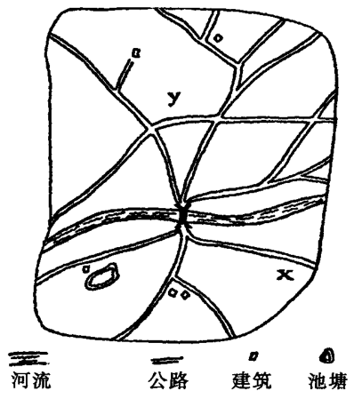

# 第3章 淡判，沟通与有限战争

  有限战争要求具备某些有限条件。如果战争要具有稳定性，那么战
略行为也将如此。但是，有限条件要求战争双方之间至少存在某
种程度的共识或默契。然而，这种共识或默契通常很难达到，原因不仅
仅在于现实中存在很多不确定因素和双方利益的尖锐冲突，更重要的是
在战争期间，甚至在战争爆发之前，双方已很难进行有效的谈判活动；
或者由于战争的存在，战争双方无法进行有效的沟通。而且，有时战
争一方为了增加战争对另一方的威慑力，往往不愿意主动就有限条件进
行相关谈判：甚至一方或双方都担心自己的主动谈判意愿有可能被对方
释义为妥协。

  因此，对默式谈判（tacit bargaining）——谈判双方信息沟通不完全
和无效情况下的谈判模式——的研究具有非常重要的意义。默式谈判涉
及的问题往往非常广泛，诸如有限战争或与此有关的问题，或有限竞争
问题、司法管辖权的问题、交通堵车时的博弈情景，甚至包括如何与一
个从未打过招呼的邻居相处等等。问题在于当一方或双方无法或不愿进
行显式谈判（explicit bargaining），或双方都无法相信会与对方达成任何
明确协议时，谈判双方如何实现暂时的妥协。在第3章中，我们将检验
默式谈判所涉及的一些基本概念和原则，并努力得出一些有关有限战争
或类似情况的说明性结论。同时，本章将努力得出这样一个结论：默式
谈判具有的原则同样有助于我们理解信息沟通完全畅通和有效的显式谈
判，尽管二者存在逻辑上的不同。

  最有趣也是最重要的场景是，双方之间存在利益上的冲突。为了满
足研究的需要，我们有必要从简单的场景开始，即在无法进行有效沟通
的情况下，双方或多方之间存在共同利益，并且面临的问题不是如何调
解利益关系，而是如何为实现共同利益来协调彼此行为。这一特例将向
我们揭示解决利益冲突的默式“讨价还价”所必需的一些原则。

## 默契 (利益共同）

  假设一对夫妇在拥挤的百货商场失散，事先也没有约定见面的地
点，但是他们还是有可能找到对方。也许一方一直认为，对方也希望在
一个双方都认为比较醒目的地点与自己会合，因为夫妻双方都认为该地
点比较醒目，易于发现对方或被对方发现。而且，一方不会轻易判断对
方首先要去的地方，因为在上述情况下，对方首选的地方可能也是其所
希望的。换言之，无论发生什么情况，一方所到之处都将是对方所期望
的地方。我们可以如此不断推理下去，一方所想的问题不是“如果我是
他，我该去什么地方呢？”而是“如果我也像他一样在思考同样的问题
‘如果我是他，我该去什么地方呢？’我该怎么做呢？”类似的情景需要
双方间的相互默契，对同一场景提供的信息进行同样解读，并努力促使
双方对彼此的行为进行相同的预期判断。双方必须认同（mutually recog-
nize）某种能够协调彼此对对方行为预期判断的暗示符号。当然，我们
既无法背定他们一定会重逢，也不能背定双方一定会对同一暗示符号进
行相同的解读。但是，夫妇双方如以这种方式寻找对方，成功的几率一
定比他们盲目地在商场里瞎转要高得多。

  读者可以尝试着解决下面图示（图3-1）所出现的问题。两个空降
兵意外地降落到了图中所示的地区。双方都随身携带了一张地图，并知
道对方随身也有一张地图，但不清楚对方降落的具体地点，也无法与对
方进行联络，双方只有尽快地找到对方才能获救。那么，他们是否会研
究随身携带的地图，并协调彼此的行动呢？他们是否会不约而同地想到
并在地图中标示的某个地点会面呢？

  作者认真研究了这个问题以及一份缺乏科学性的调查问卷中出现的
一些类似问题，得到的答案是肯定的：人们通常会协调被此的行为。下
面所列的抽象难题也属于大多数人试图解决的问题范畴。当然，问题答
案的评判标准是，只要每个人认为自己的答案具有合理性，那就是“正
确”的答案。读者可以先回答下面的问题，然后参照脚注测试一下自己
的能力[^3-1]。

[^3-1]: 作者进行的一份调查间卷结果显示，问题1中，36人选择了“heads”，只有6人选择了“tails”。问题2中，41人中的37人选择了前3项，7略微领先于100，13位于第3位。问题3中，41人中的24人选择了左上角的空格。剩下的17人中，有14人分布在同一对角线上。问题4中，大多数人选择到中央车站（服务台）会合，实际上，他们都在中午12点实现会面。问题6中出现了不同的答案，40%的人选择数字1。问题7中，41人中的12人选择1000000美元，只有3人选择10美元，其中2人是64美元，不要小看这个数字，这相当于今天的64000美元。问题8没有什么问题，41人中的36人的选择各占一半。问题9中，22人中的20选择了RoBinson。在另一个公式中，Jones 和 RoBinson 以 28 票位于第一。作者这么做是为了验证不分胜负的情况下，要取得一致如此困难。但是，被调查者都克服了这个问题，18人中的16人选择了Jones（主要原因是Jones所在的位置有利），虽然解决了主要问问题，但也忽视了相关的次要问题。在图3-1中，8人中的7人选择在桥上重逢。

1. 请在“heads”和“tails”二者中选一个，如果你和同伴的选择相
同，你们都将获胜。

2. 请选择下列数字中的一个，如果你们的选择相同，你们都将获
胜。
        7   100    261     99       555

3. 请选择下面的方框，如果你和同伴的选择相同，你们都将获胜。

            □   □   □
            □   □   □
            □   □   □

4. 你将在纽约与某个人会面，但没有人告诉你会面的地点。你与对
方也没有事先约定会面的地点，而且无法与对方进行联络。你和对方只
能自己寻找会面的地点。你将怎么做？

5. 在问题4中，你只知道会面的日期，但不知道会面的具体时间。
你和对方必须设法约定时间在问题4中的地点会面。你将怎么做？

6. 写下你认为吉祥的数字，如果你和同伴写的数字相，你们都将
获胜。

7. 请写下一笔金额。如果你和同伴写的金额相同，你们都将获胜。

8. 你被要求将100美元分成两部分，分别标为A和B。你的同伴也
会像你那样做。如果你们的结果相同，你们每人都将得到100美元；反
之，你们将无所获。

9. 在第一个投票中，候选人的票数如下：

        Smith...........19      Robinson............29
        Jones...........28      White................9
        Brown...........15

随后将进行第二次投票。除非你期望自己的候选人获得了多数票，
并为此得到回报，否则你绝不会关心投票的结果。同样，所有的投票人
都希望自己所选的候选人获得多数票，而且大家都知道这是每个投票人
的心愿。第二次投票时，你将把票投给谁呢？

  虽然上面的问题都是人为设计的，但是这些问题向我们揭示了一个
道理：人们通常只有在得知别人将做出和自己同样的行为时，才会与他
人产生共鸣，达成某种共识。大多数情况下——对那些参与此类游戏的
人来说，也许每一种情况都是——都会出现某些合作的契机，如某个
“关键点”（focal point）使双方成功地对彼此预期做出判断，从而达到
某种默契。能否找到问题的最佳解决方法或是任意一种解决方法——只
要是双方认同这种方法是他们所要寻求的答案（key）——很大程度上
取决于双方的直觉而非逻辑思维推理，或许依靠来自双方对相似事物之
间的类比经验、先例、偶然巧遇、对称性、审美观或几何原理、诡辩推
理，以及当事人的自身条件和对彼此情况的了解。奇思妙想也许会帮助
一对夫妇“分而重逢”；理性的逻辑推理也可能会使一方回忆或期望另一
方回想起来他们以前处理类似紧急情况的方式方法。我们不敢保证他们一
定能找到问题的答案，但是他们这样做的可能性远远大于抽象的随机率。

  解决这一问题的众多“解决方法”具有一个非常显著的共同特点，
即这些线索或关键点都具有某种显著特征，易于发现。但是，这些显著
特征随着时间、地点以及当事人的变化而变化。大多数普通人在一个环
绕的圆形区域走散后，通常都会“自然而然”（naturally）想到在圆形地
带的中心区域与对方会合。但是，如果是在一个非常规形区域失散，那
就只能依靠个人的方位感在该区域的重心地带与对方会面。作者曾经以
多个地图进行实验，结果证明：如果一个地图标有多个住宅和一个十字
路口，人们大多会本能地趋于十字路口；反之，如果一个地图标有一个
住宅和多个十字路口，人们大多会本能地趋于住宅。这充分说明，惟一
性能够产生独特性，从而吸引人们的注意力。但通常情况是，惟一性在
避免似是而非上具有更重要意义。在地图上，或许住宅相对于其他标
识，更容易引起人们的注意，但是若地图上同时存在三个住宅，并且具
有相似的标识，那么人们在某个住宅会合的可能性或许只有三分之一。
认识这一现实有助于我们避免在解决问题时，将住宅看做一个显著的
“线索”。[^3-2]

[^3-2]: 正如作者的地图试验所证明的，这是“正确”的逻辑推理过程。在标有多个十字路口和一个住宅的地图中，选择住宅的11人胜利实现会合，但是选择不同十字路口的4个人没有一个人实现目标。

  在最后的分析部分，我们讨论了想像力问题和逻辑推理问题。就其
本质而言，逻辑推理真有很强的诡辩性。在上面的游戏中，诗人可能会
比逻辑学家做得更好，因为与其说这样的游戏是国际象棋，还不如说是
充满字谜的文字游戏。逻辑有时也会发挥积极的作用——例如在问题6
中，大多数人趋向于数字1都是基于逻辑推理。但是在大多数情况下，
主体在进行逻辑推理之前，必须依靠想像力从当前环境提供的众多具体
细节中发现主要线索。

## 默式谈判 (利益冲突）

  假设空降兵双方都不喜欢走路，那么我们在解答问题的时候，就必
须考虑双方利益的冲突因素。如果双方能够进行有效的沟通（当然这里
是不允许的)，那么双方可以就会面的地点进行商讨；而且每一方都会
根据自己的喜好，选择一个靠近己方的地点或是会合场所。而在缺乏有
效沟通的情况下，双方则会抛开利益的分歧，努力在彼此间寻求共识。
如果某个“醒目”的地点引起他们共同的关注，而这个地点更接近于其
中一方的期望，那么他就是这场博弈的胜者。即使这一结果对另外一方
多么不利，后者也无法提出任何异议，而只能接受这一现实。地图本身
提供的谈判“动案”（proposal）——假如事实上，确实发挥了作
用——显然是惟一可行的发盘（offer），因为在缺乏有效沟通的环境中，
双方之间根本不存在讨价还价的空间。在协调沟通压倒一切的情况下，
作为一个副产品，一场冲突就可能被避免——我们也可以认为被双方忽
视了。

  鉴于双方都失去了在有效沟通条件下应该得到的东西，用“赢”和
“输”来形容游戏双方似乎并不太准确。如果双方降落的实际地点相距
很近并远离住宅，那么他们就没有必要长途跋涉到住宅会合。他们只需
要辨明自己所处的位置，到位于二者中间的某个地点会合；或者一方
“获胜”，另一方的所失大于前者的所得，如双方降落于住宅的同一侧，
虽然二者经过长距离跋涉——距离远远大于理想路径——终于实现了会
合，但是与双方商讨后得到的结果相比，距离住宅较近的一方仍然赢得
优势。

  最后一个案例表明，对谈判某一方而言，缺乏有效沟通也许并不是
什么坏事。如果一方能够准确判断自己的优势，并对自己能够预见的谈
判结果充满信心，那么他就可以设法破坏沟通渠道或拒绝提前为相关问
题与对方进行任何有效的协商。作者设计的问卷中有一种情况，A知道
B的位置，但是B不知道A的位置（除此之外，双方掌握等量的信息）。
处于B情景的大多数答卷人表露出毫不在乎、镇静自如，并乐于接受无
知的状态。而处于A情景的答卷人则几乎异口同声地表示自己将别无
选择地前往B所在地。这表明在一定条件下，能够发出信息却无法接受
信息，对一方而言将是一个优势。例如，一方将自己所处的位置告诉另
一方，并声称自己的发报机只能发送信息，不能接通信息，即自己只能
原地待命，等待对方到来。结果可想而知，另一方别无选择，只能接受
对方的条件，因为他无法与对方进行有效的沟通，对方收不到任何信
息。[^3-3]

[^3-3]: 第2章对类似看似矛盾的案例进行了详细的论述，即在谈判中，一般意义上的劣势也可能转化为优势。

  作者进行了大量有关利益冲突博弈问题的问卷调查。尽管有些问卷
甚至涉及不公平的博弈场景，但总体而言，问卷得出的结论基本上与完
全合作博弈场景中的结论相符。这些博弈场景均要求答卷者进行有效的
协作，并提供了可能导致双方利益不同组合的选择项。在提供的众多选
择项中，一些选项似乎是双方达成共识的必要条件，而且处境相对不利
的一方往往也并不在意，因为他知道对方期望自己采取这样的行为。由
此可见，在缺乏有效沟通的情况下，双方之间一定能够达成某种共识。
这些博弈情景的共同之处在于，任何一方都无法通过雕虫小技赢得对
方。只有当一方完全按照对方的条件做出选择时，他才可能被认为是输
者。双方既是二者间达成共识的受害人，也是其受益人。无论如何，一
方都不能拒绝对方提出的条件。因为达成共识的迫切性远远大于利益的
分歧，双方只有同对方合作，才能取得双赢，否则只能两败俱伤。其中
有些问题只是在前面问题的基础上略作修改，正如我们针对地图问题所
假设的：长途跋涉是徒劳无功的。

1. A和B在无法沟通的条件下，必须在“heads”和“tails”之间做
出选择。如果二者都选择“heads”，A将得到3美元，B则得到2美元。
反之，如果二者都选择“tails”，A将得到2美元，B则得到3美元。如
果两人的选择不同，二者将一无所获。假设你是A（或 B），你将如何
选择？（注意：双方的选择具有随机性，输赢几率参半，并且只能得到
1.25美元。）

2. 你和另外两名同伴（或对手）分别从A、B和C中任选一个。每
个人以任何顺序写下这三个字母。如果三个人的排序顺序相同，三个人
将共获6美元，具体分配方法为：第一个完成排序的人将得到3美元，
第二个人将得到2美元，下的1美元归最后一个人。如果三个人的
排序不同，都将一无所获。假设你是A（或B，或C)，请写下你的排
序：___  ____  ____

3. 你和你的同伴（对手）中的一人将得到一张空白纸。另外一人将
得到一张写有学母X的纸。每个人都有两个选择：持写有字母X的纸
的一方可以不必理会X或将其抹掉：另外一人保持纸张空白或在纸上
写上字母X。你们在没有沟通的情况下做出选择，如果你们之间仅存在
一个X，那么持有X的一方将得到3美元，另外一方将得到2美元；如
果存在两个X或两张白纸。双方将一无所获。现在，你得到写有学母X
的纸，你将如何处理？(反之呢？)

4. 你和你的同伴（对手）现在拥有100美元，要求双方在缺乏沟通
的情况下决定分配的方法，每人将自己希望得到的金额写在一张纸上。
如果两人的期望金额加起来不超过100元，每人将得到自己所写的金
额；反之，双方将一无所获。你希望得到 ____ 。

5. 你和你的同伴从下面的字母中任选其一。如果选择了相同的字
母，你们都将获得奖金：反之。双方将一无所获。所获奖金金额大小取
决于你们选择的字母，双方所得的奖金金额不等，而且金额最大的字母
不一定给你带来最高奖金。你们的奖金如下：

        K........4美元            L....2美元
        G........3美元            R....5美元
        W........1美元

  你不知道对方的想法。你首先向对方建议对自己最有利的字母R。
在对方做出选择之前，裁判将警告双方以下时间不得进行沟通，否则双
方出局。你必须迅速选择自己的字母，同时希望对方选择同样的宇母。
那么，你会选择哪个字母？（第2种情况是，5个字母代表的金额分别
为：K-3美元，G-1美元，W-4美元，L-5美元，R-2美元。在裁判发
出警告之前，你的同伴首先向你建议选择字母R。)

6. 两支敌对军队分别位于X点和Y点，标示二者方位的地图类似
于图3一1。现在，两军的指挥官要求自己的部队尽可能多地抢占土地，
并知道对方将采取同样的行为。但是，双方都竭力避免接触交火，而且
深知对方也真有同样的意图。双方命令自己的部队在预定范围内行动，
如果遇到抵抗将进行反击。但是一旦双方部队开始行动，形势很大程度
上将依赖于双方的指挥官划分的界线。倘若二者划定的界线重合，双方
部队必将发生冲突。若在双方占领的重叠区域存在尚未被占领的有利地
形，这时形势将更加不稳定，一场冲突在所难免，除非二者占领的区域
不存在重合现象，且在双方之间存在一定的空地。只有这样，双方才能
真正将抢占的领域据为已有。就占领的土地和设施而言，谁具有相对价
值优势，谁将赢得主动权。现在，你所统领的军队的位置为X（或Y)，
请在地图上标出你希望占领的土地范围。

7. A和B的年收入分别为100美元和150美元。双方都知道对方的
收入情况，并被告知以后将交纳个人所得税共25美元。如果双方能够
达成分配二者共同年收入的协议，他们将以达成的方案分摊双方的个人
所得税，前提是双方不得进行任何沟通。现在双方将自己希望分摊的税
费比例写在纸上，如果双方希望分摊的税费加在一起等于或大于25美
元，双方将以自己希望的比例交纳税费；反之，如果双方希望分摊的税
费加在一起小于25美元，每人将交纳25美元。如果你是A（或B），
你希望分摊 _____ 。

8. A和B同时合租一个房子。B捡到了A丢掉的一部分钱。根据房
东契约，除非A向对方给予一定报酬，否则A不能索要B捡到的钱；
反之，除非A同意，否则B也不能将捡到的钱据为已有。如果双方无
法达成协议，B捡到的钱将归房东所有。B捡到的钱数为16美元，A
提出给B 2美元作为条件。但是B拒绝A提出的条件，并提出分摊所捡
钱数的一半，即8美元。双方为此争吵不休，并引起房东的干涉。房东
提出建议，A和B一次性地将其所希望得到的金额写在纸上，并不得进
行沟通。如果双方希望的金额加起来等于16美元，每人将得到自己所
希望的金额；反之，如果双方的金额大于16美元，该笔钱将归房东所
有。现在，双方坐下来冷静考虑自己希望得到的金额。这时，一位知名
的、受人尊敬的调解人出现，并提出自己的建议。他表示，自己不会涉
入谈判之中，只会提出一个“公平”的建议。他走向A，并对其说：
“在现有条件下。最好的分配方法是二一开，即失主得到全部金额的三
分之二，拾到者得到剩下的三分之一。我同样也会向B提出同样的建
议。”后来，他果真履行了自己的诺言，将其对A所说的话对B重复了
一遍。如果你是A（或B)，你希望自己得到多少？

  作者的调查结果如脚注所示。[^3-4]在那些包含“你”和“他”或“A”
和“B”之间存在不对称性的问题中，A的模式和B的模式在分配收入
的问题上相辅相成。正如脚注[^3-4]所表明的，最终的结论是：在上面的大
部分情景中，当事人都能够达成某种共识，妥善解决彼此间的问题。在
允许任意选择存在的情况下，双方理性的选择结果总是优于盲目选择的
结果。甚至是最不公平问题中的弱势一方，也不得不接受问题中有关合
作协议的约束。

[^3-4]: 问题1中，A组的22人中有 16人和B组的22人中的15人选择了heads。如果知道A的结果，heads将是B的最佳选择；同样，如果知道B的结果，heads将是A的最佳选择。综合考虑，双方理性选择显然优于盲目选择。当然，如果双方都希望得到3美元，那么二者都将一无所获。
问题2除了结构上比较紧凑，逻辑上与问题1基本相同。A组的12人中有9人，B组的12人中的10人以及C组的16人中的14人成功地选择ABC（剩下7人中的5人失败)。
问题3的结构基本上与问题1相同。A组的22人中的18人与B组中19人中的14人达成共
识，A得到3美元。
问题4中，40人中有36人选择50美元。（剩下2人分别选择49美元和
49.99美元）。
问题5中，首先提出条件的8人中的5人选择和另一方的9人中的8人选择R。
问题6中，X组的22人中的14人和Y组的23人中的14人选择沿着河边划定界线。应该引起
注意的是，另外跨过河界的15人出现了14条不同的界线。结果，出现8×7种结果，其中只有
1种结果成功。这强调了这个解决方案的“正确性”。
问题7中，选择年收入为150的6人中
有5人和另一组的10人中的7人达成税费分配方案为15:10。
问题8中，丢钱的8人和拾到钱
的7人同意调解人的建议，接受5美元的报酬。

  当然，上面每个问题的答案“线索”也各有不司。尽管传统俗约没
有如此强的约束力，但是根据传统习惯，头显然应该排在尾巴的前面，
类似的情况还有A、B、C字母排序。很显然，最初的X一方之所以能
够战胜白纸一方，主要因为双方认为“现状”显然不会发生很大变化；
字母R能够取胜的原因在于其与第一方提出的条件相吻合。原则上讲，
道路和小河能够发挥同样的作用，它们之间的差异也能允许随机条件的
存在。更准确地说，标有多条道路的地图并没有指出哪个路径最好，因
此只能放弃小路而选择具有惟一性的显著性标志物——小河。（也许在
同一地形相对对称的地图中，得到的结果可能与分钱问题的答案相
同——5-5方案。但是，地图的非常规性排除了几何方法。）

  税费问题揭示了在分钱问题上咨询建议的强大威力，这个问题与如
何分配100美元的问题在逻辑结构上基本相似。事实上，这个问题应该
这么表述：每方每年交纳25美元税，而且根据双方达成的分配协议，
二者可以分配返还给双方的25美元。这样一来，该问题在逻辑上与问
题7相同，与问题4也仅仅在于数字上的不同：这里是25美元，而在
问题4中是100美元。通过突出收入金额在问题中的相关性和重要作
用，收入金额的变化改变了分配方案的关键点，使最终的分配方案为
10-15而非12.5-12.5。如果收入在这个问题中发挥了重大的作用，那
么，当分度税率的条件存在时，为什么完全比例税如此明显？答案一定
是，在缺乏沟通的情况下，毫无疑问，没有哪个分度税率分配方案如此
清晰易懂。如果双方无法进行沟通，在默认条件下，双方只能采取简单
易懂的比例分配方案了。首先，收入的存在排除了对半分配的可能性。
其次，在双方无法有效沟通的情沉下，简单易懂的10-5比例分配方案
是惟一具有可行性的方案。问题7中，通过安排诸如家庭规模、消费习
惯等辅助因素，向我们验证一个相同的原则。这里，收入比例分配的
作用显然已经被削弱了。高收入者和低收入者此前就纳税问题达成的优
势方案现在变成了简单的5-5分成。修改后的收入比例分配标识遭到了
大家的一片晞嘘，被选择的竟然是粗制滥造的平等分配标识。

  最后，问题8与问题4具有相同的逻辑结构。在问题8中，如果双
方所希望的金额总数不超过16美元，他们就能得到各自希望的金额。
但是，在机制安排上存在歧视性和不公正。无论从法律的角度还是从道
德的角度，捡到钱的人和丢钱的人之间的关系都极不平等，所以双方不
可能达成“5-5”分配方案。调节人的建议只能说明存在其他分配方式
的可能性，其作用也只是表现在圆滑地提出11-5的分配方案，这也是
大家能够普遍接受的方案。

  在上面的案例问题中，仲裁因素在某种程度上，无不对各个问题的
结果产生了不同程度的影响。无论是从旁观者的角度还是从当事者的角
度。这些结果也许并非完美无瑕、公正无疑。即使是“5-5”分成的分
配方式，也许只是纯粹数学意义上的公平。即便如此，这种分配方式也
并非如我们想像中的那样绝对公平，因为我们无法以绝对精确的数据和
尺度衡量其公正性，如资金的来源、对方申诉人提出的相关要求或是其
他法律或道德上的索赔依据。尽管争论勒索和绑架之间的区别本身就不
公平，但是这在问题4中却具有数学上的意义。

  如果我们要问是什么因素决定了上述问题的答案，回答还是协作因
素。每一个问题都需要当事人为了实现共同利益，寻求被此间的共识，
尽管在达成共识的过程中会遇到很多阻力。但是，在众多可能的选择机
会中，通常只有一项或少数几项能够帮助当事人实现协作。请注意问题
5中当事人提出的第一个条件，尽管对R十分有利，双方之间的激烈争
吵也只是修辞问题。“如果不是R，是什么？”尽管当事方都希望在提出
第一个条件后竭力回避字母R，但是回答这个问题远不如多给几个盲目
选择的机会那样容易。为了强调这一点的重要性，我们可以假设，裁判
人员考虑到第一个条件已经破坏了整个游戏规则，决定有必要向选手宣
布完全改变整个奖励规则。A将得到B在问题5中的奖项，反之亦然。
那么，第一个提出条件R的选手是否有理由改变选择？或者假设裁判
宣布，无论他们选择哪个字母，只要双方选择的字母相同，则奖项保持
不变。如果情况如此，他们仍然会对字母R趋之若鹜，因为这是他们
有可能实现合作的惟一途径。如果我们回到游戏的开始，假设当事人还
没有做出选择R的决定，我们可以想像墙上有个标识似乎在提醒他们：
“在犹豫不决的时候，一定要选择R。每个选手都能够看到这个标识，
它仍是实现协作的一种方式。”这里，我们再回到那对夫妇在百货商场
走失的场景。假设夫妇二人都能看到一个醒目的标识，并想像其在对自
已说：“管理人员建议，请走失的顾客到位于一楼角落的服务台等
候。”如果这样的话，问题早就解决了。很显然，就他们的醒自符号源
以及与其他双方惟一希望具有醒目性的标识而言，乞丐绝不可能是选择
的主体。

  在问题5中，如果对手知道你的奖品组合，而你却不知道他的（例
如在一些问卷出现的类似问题5这样的情况），那么一场荒诞不经的表
演也就宣告结束了。鉴于你没有足够的条件预测对方可能做出的选择，
甚至没有机会向对方献媚或主动选择一个“公平”的折中方案，所以，
双方实现协作的基础只能是你充分地解读自己所掌握的信息。也许你喜
欢的字母也正是对方所喜欢的。似乎很难解释为什么选择这个字母，而
不选择另外一个字母，因为你没有任何充足的理由可以说服自己：除了
字母R以外，还有哪个字母对他更有利。对方对你的了解、你对对方
的无知以及缺乏协作的替代条件，都会轻易地迫使对方做出对你有利的
选择。（实际上，在小规模问卷调查所得到的众多结论中，这是一个非
常重要的结论。）诸如一个空降兵知道对方的位置，而对方不知道自己
的位置等类似案例也属于这种情况。[^3-5]

[^3-5]: 在前面，还有一个脚注案例证明，谈判中的弱势有时可转化为优势。

## 显式谈判

  在这里，为默式谈判定义的“协作”概念似乎还不能被直接应用于
显式谈判。在谈判主体能够进行有效沟通的情况下，尚不需要他们出自
本能的协作行为。提示符号的偶然出现，不仅能够帮助主体进行协作，
而且能够影响在缺乏有效沟通条件下取得的谈判结果，还可以还原附带
的各种具体因素的原有特征。

  甚至在显式谈判中，有许多相关案例可以有效证明这一影响的存
在。例如，在讨价还价过程中，人们更倾向于使用简单的数学表达形
式。一个细节之处是人们往往喜欢使用整位数学（round nurnbers）表达
结果。例如，如果汽车销售商能够将其产品的最低价格2507.63美元中
的7.63美元去掉，则会吸引更多消费者的眼球。“折中（split the
difference）的建议通常能够促使谈判取得成功也证明这一点。当然，妥
协的部分大多是一些细枝末节、微乎其微的次要部分。更加能够引起人
们注意的是，诸如复杂的量化规则，特别是成本、利润分配等问题的旷
日持久的谈判，往往最终都以一些简单的解决方式结束，如简单地平均
分配，或参照国民生产总值、人口、外汇逆差等常量按比例分配，或按
照双方在以前谈判中达成的比例，尽管有时可能在逻辑上毫无联系。[^3-6]

  先例所产生的影响也许远远大于逻辑的重要性和法律效力。一个成
功解决罢工事件或国际债务问题的先验往往会在以后的谈判中被谈判人
员不假思索地原本引用。当然，有些时候也需要制定统一的标准或类似
情况得到类似结果，但是更多时候是，在一些引入关注的重大先例的阴
影笼罩下，谈判情景中频繁出现冷酷无情的场面。[^3-7]同样的道理，调解
人通常拥有决定是否达成协议或决定协议内容的权力。他们的解决方案
之所以能够被人们所接受，很大程度上不是因为方案多么公正合理，而
是由于当事人的接受和认可。“实地调查”（fact-finding）报告也许能
够通过提出可行性方案消除不确定因素的存在，从而将人们的视线集中
到问题的焦点。但是即使如此，实地调查报告内容本身并非事实，它只
是调查人提出的可能产生某种影响的具体建议而已。

[^3-6]: 在向联合国善后救济总署提交的众多建议案中，只有国民生产总值的1%这一方案被接纳，其主要原因是计算公式间接，易于操作。可以肯定地说，美国代表在谈判中也倾向于这一方案。但是这个事实对本案例的积极作用和消极作用不分上下。

[^3-7]: 二战后，中东国家有关石油开采权的分配广泛采取五五分成的方案。这一案例有力地证明了本文的相关论述。

  同样，人们总是乐于安守现状或接受自然形成的界线，以至于一条
条纬线最近也向人们展示了其作为实现协作关键点的强大生命力。不管
怎么说，人们之所以将小河作为他们双方部队停火的分界线或仍然使用
原有的分界线，自然有其合理的依据，无论他们现在能够发挥多大的作
用。但是，与双方当事人达成明确协议的权力相比，地理条件就其自身
的实际意义来说要逊色许多。

  如果这些研究发现只是为了证明，谈判可以以某种简单有效的条件
结束或使当事人之间寥寥无几的数美分或数公里路差距可以被轻易忽
视，那么它们的价值可谓微乎其微。但是令我们感到欣慰的是，这些研
究发现的作用不仅如此。这些研究发现揭示，谈判结果不仅反映了谈判
主体间的权力平衡问题，而且将谈判的主动权从一方手中转移到另一方
手中。愤世嫉俗者似乎能够根据双方争论的一些“焦点”问题，准确地
预测出谈判的最终结果和现实形势所提供的条件，甚至根本不用考虑谈
判中的有利条件，更不用说双方即将开始的争论和谈判中的压抑气氛。
尽管没有现成可供借鉴的其他规律，但双方能够妥协的“显著”位置依
然有规可循。如果谈判的“自然”结果反映了谈判双方的谈判技巧，那
么，有必要把当事人的这种谈判技巧看做是他们向人们展示对自己有利
的某种潜在结果的能力。谈判结果的公平性和公正性，也许并非像谈判
双方之间的实力对比那样简单明了。

  如果谈判形势已经决定了谈判的最终结果或达成妥协的关键点非常
明显，这一结论也许看起来缩小了谈判技巧的生存空间。但是，它毕竟
对谈判技巧发挥作用的时机产生了影响。在很大程度上，“明确”的谈
判结果取决于谈判问题的自身特点或谈判双方对类似或相关谈判先例的
理解，或谈判双方对谈判所涉及的相关信息的掌握程度。倘若委员会决
定就成本的分担问题进行谈判，那么，影响谈判结果的因素将是多方面
的。例如，是否分摊应付款和税费问题、后勤保障委员会是否充分准备
所需要的有关国民收入和收支平衡的相关资料、谈判人员是否准备了此
前亲身经历的谈判先例、将两个不同的问题按照同一议程进行谈判是否
会产生重大影响并涉及两个问题之间的某些共同特征。当正式谈判开
始，双方开始了一系列斗智斗勇行为。[^3-8]

[^3-8]: 或许这一普遍方法隐含技巧的重要作用。如果一方无法将问题模式化，从而将问题的答案无限接近自己的立场，那么他可以继续将问题模糊化，寻找术语的多种解释并为模式化的信号增加“噪音”。这一策略也可能失败，但是在我们上面提到的所得税问题中绝对适用。

  这些结论如果正如作者所认为的那样正确，我们对默式谈判进行的
相关分析都有助于读者理解无时不在发挥作用的各种影响因素。也许默
式谈判自身的逻辑性也能增强其说服力和可信度。默式谈判的根本问题
是协作问题。在以后的篇章里，我们还将进一步探讨影响显式谈判主体
进行协作的因素。答案可能是，显式谈判要求谈判主体为了实现最终合
作，必须具有某种协作的意愿。详细论述如下。

  在大多数显式谈判中，只要谈判主体希望通过双方的妥协让步达成
某种共识，谈判就可能存在多种结果。在这种情况下，至少有一种结果
是一方或者双方希望通过妥协让步实现的，而且另外一方对此也十分清
楚。同样，至少也存在一种潜在结果是一方希望按照自己的立场达成，
即使他也没有充足的理由说服自己。因为对方能够肯定或者预测双方宁
肯妥协让步，也不愿空手而归。谈判双方都是根据自己对对方立场和意
图的预期判断，来确定自己的立场和谈判策略。谈判双方心里都清楚，
对方也会有与自己一样的行为，最终的谈判结果也体现了一方对另一方
的让步底线。谈判主体预期的主要构成是，一方对另一方预测自己对其
预测的预测。因为除此之外，在这种复杂多变的谈判形势下，谈判方似
乎别无选择，双方只能以这种方式做出自己的决定。这一无限循环的推
理模式最终都将回到一点，即一方预测对方已经退到了让步的底线。

  这时，在我们的脑海中出现一个疑问：是什么因素导致双方的这种
无限循环推理模式和整个谈判过程的结束？我们推测，可能是双方的某
种直觉偏好在发挥作用，特别是对明朗、独特、简单、先验的偏好，或
者某种能够促使谈判主体将谈判结果与其他可能性相区分的潜在规律。
我们不禁反问，既然双方预期目标与实际达成的谈判结果只是程度上的
不同，为什么谈判双方还要想方设法向对方展示自己信誓旦旦、宁死不
屈的坚定姿态？答案可能是，双方必须为各自的坚定立场寻求充分依
据，并且在类似的立场观点中找到它们之间的不同“规律”。这一规律
也许并没有客观存在的“关键点”那样令人可信、坚不可摧，但至少在
谈判中能为各自辩护：“不是这个结果，还能是什么结果？”

  但是这些因素还不足以促使谈判双方达成共识。如果一方打算妥协
让步，那么他必须控制对方对自己的预期判断，知道自己妥协让步的底
线。如果一方不希望自己的妥协行为变成自己软弱的表现，他必须在谈
判过程中一个非常醒目的点上停止让步。这个点可能来自于调节人的提
示或任何新旧条件的连接点。如果一方的要求就是60%，但是能够接受
的条件是50%，那么一旦他接受49%这一条件，对方就可能认为他已
经到了崩溃的边缘，进而将提出更高的条件。

  现在，让我们再次回到前面的两军抢地案例。如果一方撤退到小河
的沿岸，这一行为可能会被对方看做是防守待攻、立场坚定的信号。但
是，倘若该部队继续退让到小河的背后，这时另一方就可能把这一行为
当做对方已经溃不成军、立场动摇的信号。同样，进攻的一方如能不战
而屈人之兵，将对方逼迫到小河沿岸，他就能迫使对方接受自己苛刻的
条件，双方可能在小河沿岸或其他什么地方保持对恃。

  在作者看来，从直觉的角度讲，这一假设能够解释任何条件下关键
点的合理性问题。但是，如果这一假设不能对默式谈判进行具体的逻辑
解释，在旁观者看来还是含糊不清、难以理解。对默式谈判的逻辑解释
不仅能够提供逻辑推理依据，而且还能揭示各种相关心理现象——如双
方为实现预期目标的心理协作——存在的可能性，甚至在一些教科书中
具有非常大的说服力。在缺乏沟通的情况下，双方的心理协作如同行为
的协作一样重要。事实上，二者都或多或少地涉及双方对对方进行本能
的预期判断。因此，一些有关默式谈判博弈的结论和协作产生共识的逻
辑作用经过实证检验后证实：双方能够通过协作达成共识，以及当协作
共识成为必要条件时，形势的客观条件能够产生绝对性影响。在缺乏沟
通的情况下，双方能够产生“某种”共同需求。毫无疑问，尽管在沟通
成为可能时，这种需求非常微弱，但一定存在，因为沟通的存在并没有
削弱5-5分配方案的对称性、小河的独特性和ABC的自然排序规则。

  也许我们探讨的所有问题的根源来自于默式谈判的自身逻辑。与心
理因素在显式谈判中的突出作用一样，默式谈判的逻辑也许是最广泛的
推理问题。同样，倘若我们希望归纳结论来自于对实际谈判中种种可行
性结果的研究分析，我们也许不愿意承认偶然因素的作用。但是，有关
默式谈判和显式谈判的案例已经强有力地证明，在二者之间完全有可能
存在某种共同性或者相似性。

  为了说明这一点，我们这里回到前面提到的平分100美元的案例
中。现在看来，对100美元五五分成似乎具有可行性，但是产生这种可
行性的原因是多方面的。也许这种方式非常“公平”；或许体现了权力
平衡；或许正如这上面所论述的，这种方式能够向双方传递这么一个信
息，即：双方都乐于接受这种方式。我们对默式谈判的研究分析为后一
种观点提供了依据。这个依据是，如果双方在缺乏沟通的条件下分配
100美元，他们得到的分配结果可能是50-50。这并非出于直觉。我们
认为在略有不同的语境中——默式谈判语境——我们的结论客观上具有
解释力。

  两个指挥官的案例再次说明了这一点。该案例中，如果双方的生存
一定程度上取决于他们设定的脱离接触线和有效沟通的缺乏，他们可能
会把小河当做他们之间默式谈判的关键点。这验证了双方指挥官为什么
承诺小河为双方的停火线或没有承认小河为停火线。所以，默式类比方
法至少能够证明，“协调预期判断”（coordinating expectations）的思想
具有积极意义，而非神秘莫测（mystical）。

  也许我们能够进一步阐述这一观点。倘若双方都乐于接受这一标准
衡量，那么，谈判结果的惟一显著特点就是非常“公平”(fairness)。我
们可以认为，双方关注的“公平”结果增强了公平的道德约束力，如果
这能够填补不确定因素留下的空白的话；同样，我们认为公众舆论要求
谈判双方达成的结果必须“公平”或“合理”。我们或许夸大了公众舆
论的作用或至少误解了公众舆论对主体施压的方式，除非我们相信公众
舆论能够协调谈判双方的预测判断。换句话说，暗示（suggestion）以我
们这里提到的方式促使公众舆论、先例或道德标准产生有效影响。为了
再次证明这一结论，我们只能认为谈判主体必须在缺乏沟通的条件下达
成最终结果，并且将舆论和某种道德规范约束看做是类似于前面案例中
的暗示。问题7中的调解人也发挥了类似的作用。总之，尽管促使公众
舆论影响谈判双方行为的因素看起来可能是道德的责任性和敏感性而非
某种暗示，但是我们仍然有必要关注公众舆论背后的动机。作者认为，
对简单有效的基本规律的渴求反映了我们这里讨论的机制问题。

  但是，如果我们的推理主线有效，任何对显式谈判的研究分析必须
关注我们提到的谈判沟通问题，以及谈判双方如何释义现实条件提供的
各种枯燥无味的细节。这意味着默式谈判和显式谈判并不是毫无联系的
两个概念，而是从默式谈判的部分、错误和有限沟通逐渐过渡到显式谈
判中谈判双方视情况而定的完全沟通。因此，二者在某种程度上都表
明，谈判双方均受到某个预期目标的影响。

  这一观点并不期望，明确可见的谈判结果限制缺乏沟通的谈判主体
的行为。除了我们为了研究分析的需要而人为设计的案例，沟通存在时
的谈判关键点与缺乏沟通时的谈判关键点绝对不同。尽管如此，默式谈
判的某些重要原则显然至少也是显式谈判的重要原则之一。甚至众多所
谓的“显式”谈判通常也包含许多非显式因素，如谈判双方的动机、间
接沟通、立场的隐瞒、故作高深、被众多参与者和冲突利益所迷惑、对
默契和暗示的需要等等。这些因素无不对双方是否能够产生默契具有极
大的影响。

  或许，许多社会稳定和利益集团形成的问题也同样受到地域或环境
因素的影响。例如，寥寥数人的政治集会可能会发展成为规模庞大的盛
会；当出现政治真空或无政府状态时，宪法的有效性则需要主体公众的
支持：一个犯罪集团元老的权力可以影响整个黑社会，因为服从是建立
在服从者惩罚违抗者这一简单的逻辑基础之上。我们通常所指的社会
“号召力”也反映了同样的道理。价格领先、各种非价格竞争或价格稳
定等经济现象无不证实默式沟通的重要性，及其依赖于谈判主体对现实
情况的准确解读。不谋而合的反叛行为告诉我们：当领导者不堪一击
时，人们通常需要一种默契行动的暗示。这种暗示使他们相信，如果自
己起来造反，对其他人也会做出同样行为，这样就形成了不谋而合的反
叛行动。（这种暗示也可能来自外部甚至是反叛主体，因为具有领导潜
质的反叛者本身也具有某种号召力。）

## 默式谈判和有限战争

  我们进行的研究活动是否能够帮助我们解决实际中遇到的默式谈判
问题，特别是战略行为或有限战争问题？可以肯定的是，即使没有显式
谈判，我们也一定能够找到产生有限战争——真实战争、争夺管辖权的
战争等等——的有限条件。但是，我们也知道其可能性非常之渺茫。朝
鲜战争是一场有限战争，第二次世界大战中也没有出现毒气战。与前面
我们讨论过的案例相比，这两个历史事件足以证明有限战争的可能性。
假设研究分析能够得出有效的结论，那么这个结论一定是关于如何有效
地寻找谈判的成功条件，而非探索默式协作成功的可能性。

  如果一定要得出研究结论的话，这些结论无疑是：（1）无论是默
式谈判结果还是通过不公平或艰难谈判取得的结果，都需要比其他淘汰
结果具有质的优越性，而不仅仅是程度的问题。（2）如果非要在沟通
匮乏的条件下实现结果，谈判双方应该具有足够的宽容心，允许现实条
件影响谈判结果；只要是双方的共识，允许谈判结果对一方不利或者没
有任何意义。

  二战没有出现毒气战。这一协作也许并不是战争双方战前的约定，
而很大程度上是战争双方的默契行为。因为很难想像，战争双方在无法
（或能够）进行有效沟通的条件下，还能就有关毒气使用达成类似共识？
当“有些”毒气的使用涉及的不是是否使用而是使用程度的问题时，
“禁止使用毒气”是一种最简单、最有效的方式。尽管诸如毒气使用对
象仅限于作战人员、禁止将毒气应用于进攻行为、使用可测毒气前必须
通知对方等规定中的某些规定确实能够限制战争双方的行为，但是“禁
止使用毒气”可以简单地使其成为双方惟一合作点，因为任何一方都无
法找到其中的漏洞，对方也不用为此担心。

  朝鲜半岛独特的地理特征有助于分析战争的有限性和地缘的局限条
件。朝鲜半岛三面环海，北面边界鸭绿江清晰可见。三八线似乎毫无疑
问地成为双方对恃的界线。三八线成为战争双方的最优选择，其原因并
不是朝鲜半岛的这个“腰”战线较短、易于防守，而是据守该点不容易
被对方认为是进攻（退让）举动。

  台湾海峡的天然屏障使中国大陆共产党政权和台湾国民党政权之间
的僵持对立成为可能。这并不仅仅因为台湾海峡增加了跨海作战的难
度，而是因为台湾岛是一个统一整体，四周的水域成为其天然屏障。如
果牺牲台湾岛的任何一片区域，都会造成当前台海局势出现不稳定因
素。对中国大陆而言，情况亦如此。双方在台海两岸的任何举动都是
一个程度问题。而如果有一方决定跨海作战，那就宣告这种“默契”
的结束。

  在朝鲜战争中，核武器与常规武器的差异限制了武器的使用。很难
想像，如果美国使用原子弹对朝鲜进行选择式目标打击，战争双方还能
达成类似的默契。[^3-9]没有任何涉及规模和目标的定义像“零规模，零目
标”这样清晰易懂、不言自明。美国对深陷印度支那战争的法国提供援
助也仅仅局限于物资援助，而非人员援助。当然，法国希望美国能够给
予空中支援，哪怕是有限的空中支援。但是，殊不知射出去的箭难以收
回。一旦美国答应了法国的请求，给予有限的空中支援或地面支援，那
将意味着更大规模的干预。一方只有采取全部撤军行动才能表明其真正
的撤军意图，很难保证采取部分行动或将规模控制在有限范围之内。

  战争双方对涉及有限条件的沟通或协作的需要，极大地影响了报复
战略。地区性侵略局限于一个区域。如果幸运地拥有一个天然屏障作为
边界，这也许将迫使对方默认其地缘劣势和进攻目标的局限性。一方和
双方也许会乐于接受部分失败，而不敢冒天下之大不韪首先破坏双方达
成的默契以导致对方采取相同的举动。这一默契能够得到双方的尊重，
而且一旦被打破，谁也无法保证能够达成新的默契，并就遏制冲突扩大
及时达成共识。但是，如果报复方能够掌握报复的方式和地点，那么受
害者将很难得到报复者提出的有限条件，结果造成自己不得不在其反报
复行动中接受对方提出的条件。事实上，一方首先发动报复行动，就如
同某种独立宣言，告诉对方自己不会与其达成任何共识。因此，如果侵
犯者自身行为隐含的寓意巨大而无法让人接受的话，那么，双方就战争
有限性条件达成共识就变得异常困难。

  综上所述，有限战争问题并非涉及主动权在双方之间周而复始的转
移。这是一个错综复杂、纷乱不堪的世界。这个世界更承认质而非量的
差异，不仅存在众多选择机会，而且迫使双方接受各种因素的制约。作
者认为，凡是具备上述条件的有限竞争都属于这一类情况。

[^3-9]: 有关问题在附录A有详细论述。

## 前期准备

  尽管本文论述的默式谈判不仅具有可行性，而且经受了系统分析的
检验，但是我们还是无法保证默契在任何条件下都能发挥作用。或者即
便如此，我们也无法保证默式谈判产生的结果优于完全沟通条件下所产
生的结果。当然，谁也无法保证下一次战争爆发时(如果可能的话)，战
争各方能够及时找到有限战争要求的有限性或者及时找到一种有效的自
我保护方式，除非显式谈判能够出现。鉴于此，我们有必要考虑在默式
谈判开始之前进行必要的准备活动，以增大谈判成功的几率。

  很显然，保持沟通渠道的畅通具有很重要的意义（至少应该允许投
降信息的互动传递）。这一原则的技术层面涉及发收信息的主体、相关
的部门机构、传递的中质（如果存在的话）、传递的备用方案（假设中
质和设施被人为破坏）等因素。作为防止核战争的努力，战争双方只
有一次机会判断有限战争是否已经发展到了极限和一场全面战争已经
开始，因为在24小时内还无法沟通就可能丧失最后一次保持战争有限
性的机会。

  有人认为，有必要发挥中间人或调节人的积极作用。一个能够发挥
重要作用的调节人必须事前得到战争双方的首肯，至少存在一个友好的
先例、传统或迹象。甚至即使我们排除了为类似紧急事态所做的相关准
备工作，战争双方如果有调解的意愿或者哪怕做出微弱的努力，都有助
于我们在形势极度恶化的紧急事态中，建构一个最有价值的调解机制。

  但是如果敌对双方缺乏和解的诚意，准备阶段的各种努力都将付诸
东流。如一方拒绝做出任何友好的姿态或者身入潜在战争的一方甚至希
望在一场两败俱伤的战争中赢得战术上的利益。你也许会问，为什么会
这样？原因很简单，威胁、欺骗和威慑战略在从中作梗。国家领导人对
有限战争的极度乐观加速了战争的爆发，或可能导致战争的种种举动，
不管其最初动机是出于侵略还是出于报复。具体来说，美国是否决定以
核进攻报复地区性的侵犯行为，很大程度上取决于——苏联人知道这一
条件——我们对报复行动自身有限性的预期判断。换句话说，当双方迫
切需要确定有限战争的必要条件时（假设双方愿意输掉这场有限战争），
这取决于我们如何预期判断，美国人和苏联人能否找到有限战争的必要
条件并达成默契。假设苏联人不愿意采取任何可能导致有限战争的举
动，我们将放弃实施打击报复。但是，他们也许会为化解我们打击报复
的威胁敢于突破这些有限条件。这里，我们再次回到前面提到的两个空
降兵的案例。其中一个空降兵明白，如果对方在跳伞之前知道他们会合
后会得救，那么，对方也就不会关心飞机的安全问题。因此，只要一方
拒绝就紧急情况与对方进行沟通，则对方就会像热锅上的蚂蚁，担心自
已将不得不在陌生的地形中苦苦探索，寻求自救。

  尽管对方的这种考虑或对重要谈判不利的种种消极因素削弱了双方
前期协调的可能性，但是前面的博弈游戏给了我们一个启发，即以协调
预期判断为目标的谈判或沟通不一定需要双方的参与：单方面的谈判也
可以实现双方的协作，从而实现自救，即使一方人为地制造信息沟通的
障碍。你是否还记得其中一个案例中，那个建议对方选择字母R的一
方？只要对方明白——他当然明白——字母R是惟一没有风险的建议，
很显然双方一定会达成共识。（即使对方拒绝接受字母R的建议，只
要没有歧义的反对意见出现，这就只能说明对方意识到了这一点，并不
能否定该建议的积极作用。）同样的道理，如果在空降兵怎么也没有想
到飞机会失事的情况下，有一个空降兵调侃：“如果我跳下去一定会遇
到敌人，我就首先跳到能看到的第一个山头上。”当飞机果真失事时，
另一个空降兵也许会回味前面那个人的话，而且也会那么做，尽管他此
前差一点嘲笑前面那个人“真愚蠢”或“我绝不那么做，攀援会弄伤我
的腿”。假设双方迫切需要某种达成共识的暗示并且发现了这个暗示，
那么，不管该暗示多么微弱或不公正，一方在另一方缺席的情况下一定
会接受这个暗示。因为一旦发生波及双方利益的突发事件，二者将为了
迅速地达成某种共识而暂时搁置双方的利益冲突。

