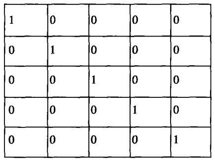
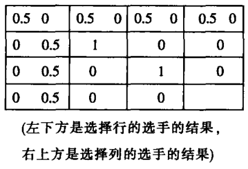

        第二部分 博弈论的重新定位

        第4章 趋向互动决策理论
        第5章 实施、沟通与战略行为
        第6章 博弈论与实验研究

# 第4章 趋向互动决策理论

  在完全冲突的战略（零和博弈）研究领域，博弈理论表现出了其独
特的洞察力，并取得了丰富的研究成果，从而为该领域的发展做
出了巨大贡献。但是与此形成鲜明对比的是，在冲突与共同利益并存的
行为战略（非零和博弈）研究方面——诸如战争及战争威胁、罢工、谈
判、预防犯罪、阶级矛盾、种族冲突、价格战和黑邮件；官场中的钩心
斗角或交通堵塞中的你争我抢；以及对孩子的管教——传统博弈理论的
表现相对而言要逊色许多。在这些“博弈游戏”中，尽管冲突涉及许多
重大利益，互动却是逻辑结构不可或缺的一部分，并且要求冲突双方某
种程度上的合作和互谅——不言而喻的默契——即便只是为了避免两败
俱伤。在一些博弈游戏中，尽管保密工作可能发挥着战略性的作用。但
是有时也需要谈判博弈双方进行必要的交流和沟通。最后，在这些博弈
中，博弈双方都能够采取有效行为以避免两败俱伤的局面发生。鉴于
此，拥有主动权、人才优势和自由选择权的一方在实际博弈中并不总是
处于有利的地位。

  就大多数情况而言，传统博弈理论通常将完全冲突的战略研究证实
了的方法和概念应用于互动博弈场景（非零和博弈）。在本章和下一章
中，作者通过把“零和博弈”看做是具有有限性的场景(limiting case)
而非一个分切点（departure point）而拓展了博弈理论的范畴空间。作者
对博弈理论的假设部分伴随两条主线：一条是旨在研究构成博弈双方预
期判断的直觉因素和启发性因素；另一条（在下一章中将详细论述）是
研究实际战略博弈中存在的基本行为和促使这些行为产生的结构性因
素。后者将涉及一条基本概念，如“威胁”、“实施”和沟通能力或破
坏沟通能力。

  发展中的博弈理论及其两条主线反映了二者对“零和博弈”的偏
好。在已经被人们广泛接受的“零和博弈”理论中，建议与干预、威胁
与允诺都无法产生积极的结果。其中主要原因在于它们都主张，博弈双
方之间的关系要么完全友好，要么极端不平衡。这就可能导致不利一方
采取最小最大战略破坏这种不平衡关系。如果可能的话，这种行为甚至
建立在随机化机制的基础之上。因此，博弈双方在非敌即友的完全冲突
场景中追求的“理性战略”不可能实现双方间的互谅或为一方利益而存
在的互动。

  假设“零和博弈”是一个具有有限性的完全冲突场景，那么与之相
对应的另一个极端又是什么呢？答案一定是“完全合作”（pure collabo-
ration）博弈。在后一种博弈场景中，双方的利害关系相互依存，二者之
间存在达成某种共识的基础。不管各自是否赢得双方共同利益中应得的
那部分还是额外的一部分，他们都必须按照自己的利益需求，排列出所
有可能的结果。（或者为了在开始就取得共识，双方应该清楚他们的利
益必须一致，因此双方之间的信息沟通中不存在利益的冲突。）

  那么，完全合作场景与博弈理论或谈判之间存在什么必然联系昵？
一个略显偏颇的答案——只是为了在此强调博弈场景一无是处——认为
完全合作博弈存在非零和博弈中经常涉及的沟通和认知问题。无论沟通
结构何时难以允许双方根据预定计划分配他们之间的任务，双方在博弈
游戏中都很难协调彼此的行为。为了协调彼此行为，双方需要了解对方
的情况，研究对方的行为模式；为了建立共同的行为模式和信息释义系
统，双方还需要反复不断地沟通协调，沟通的方式也许是某种暗示或默
契行为。诸如努力避免相撞的两辆汽车、共跳陌生舞曲的一对舞伴，以
及战斗中失散的游击队员都需要类似的默契，这类似于音乐大厅的听众
不约而同地鼓掌致谢。

  如果国际象棋是标准的零和博弈游戏，那么，看手势猜字谜的游戏
就是典型的完全合作博弈；如果追击现象形象地描述了零和博弈，那
么，集合现象则对合作博弈具有同样的意义。

  O.K 穆尔(O.K Moore)和 M.I.伯科维兹（M.I.Berkowitz）做的一个实
验证明了两个有限博弈场景存在的可能性。[^4-1]这个实验属于零和博弈实
验，共有6个人参加，每组3人。这3个人具有相同的价值观，但是由
于实验的特殊性，每组不是一个整体。实验的特殊性在于，每组成员必
须被此分开，只能通过6部电话沟通。而且6部电话共享一条电话线，
每个人既能听到自己同伴的讲话，也能听到对方成员的讲话。但是，同
组成员之间不准事先约定任何暗号。这样，在两个小组之间就出现了完
全冲突博弈场景；每个小组的成员则出现了完全合作博弈场景。

  假设在这个充满技巧和机会的博弈试验中，我们压制“对方小组”，
并使该小组成员在缺乏沟通的情况下试图合作制定一个取得胜利的战
略，那么，我们就使该小组成员之间形成了完全合作博弈关系。研究人
员研究分析了实验或现实中许多类似的“博弈游戏”。事实证明，非零
和博弈与组织论或信息论存在很大共性。[^4-2]

[^4-1]: O.K Moore and M.I.Berkowitz,Game Theory and Social Interaction,Office of Naval Research Technical Report, Contract No.SAR/NONR-609 (16) (New Haven, November, 1956) .

[^4-2]: 对协作问题的相关深入研究，请参阅 Jacob Marschak “Elements for a Theory of Teamg”，and "Toward an Economic Theory of Organization and Information" , (Cowles Foundation Discussion Papers) ,Nos.94 and 95, (New Series)。 相关的文章还有 Jacob Marschak and Roy Radner) ，"Structural and Operational Communication Problems in Teams" ,Cowles Foundation Discussion Papers,Nos.2076.Alex Bavelas, *Communication Patterns of Task-oriented Groups," D.Cartwright.

  第3章中的实验表明，即使在缺乏有效沟通的情况下，谈判双方完
全可以通过协商做出共同的快择。而且，这些实验还表明，在默式谈判
中，谈判双方之间的共同利益完全可以克服二者之间的利益分歧。在这
些情况下，完全合作博弈体现了与非零和博弈的根本不同之处。

  在这个以谈判双方相互沟通为基础、旨在研究协作解决问题的实验
中，我们发现一个充分反映非零和博弈特征的现象，而且与“零和博
弈”存在几乎相同的关系。虽然都是冲突合作博弈，但是一个轻视合
作，另一个是轻视冲突；一个重视保密，一个重视沟通。

  需要强调的是，从严格的技术意义上讲，完全合作博弈是一种战略
博弈。这种行为模式强调，一方的最优行为选择取决于其对对方的行为
预期判断，反之亦然。这种互动行为预期判断将战略博弈与机会博弈和
技巧性博弈区分开。在完全合作博弈中，谈判双方利益共存；而在完全
冲突博弈中，谈判双方利益冲突。但是无论是哪一种情况。如果谈判双
方之间不存在互动依存的关系，那么二者都将不可能做出正确的行为选
择。[^4-3]

[^4-3]: 关于这一点，参见 Carl Kaysen 给 Von Neumann 和 Morgenstern 的文章“Theory of Games and Economic Behaviors”，他在评论中写道：“战略博弈理论仅仅涉及几个人的互动行为。该理论认为，一般情况下，根本不可能量化博弈双方之间的行为互动。实际上，这个理论根本不存在所谓的量化。”R.Duncan 和Howard Raiffa在其著作 Garnes and Decisions 中作了相关论述：“表面上看，利益冲突问题对双方而言是风险与动荡并存的条件下的个人决策问题。不稳定性和动荡来自于一方对另一方行为的无知。”（第14页）从上面的论述，我们可以看出他们的观点更倾向于冲突，合作因素在他们看来微不足道（第59、88页），他们往往把每个参加者看做独立个体 (第13页)。

  现在我们回到福尔摩斯（Holmes）和莫日娅蒂（Mariarty）的经典案
例中。二者分别乘坐不同的火车，并且无法进行沟通，但是两人必须决
定下一站是否下车。现在我们可以考虑三种不同的结果。第一种情况是
双方在不同的车站下车，那么福尔摩斯将得到奖金；反之，莫日娅蒂将
得到奖金。这是一种零和博弈，双方的利益完全冲突。第二种情况是双
方在同一个车站下车，不论双方在哪个车站下车，只要二者在同一个
车站下车，那么两人将同时得到奖金。这是一种完全合作博弈，双方的
利益互存，一方之所得取决于另一方的合作。第三种情况是只有在同一
个车站下车，双方才能获得奖金。但与第二种情况不同的是，如果两人
在某一个特定的车站同时下车，那么福尔摩斯得到的奖金多于莫日娅
蒂：而如果两人在另一个特定的车站同时下车，那么莫日娅蒂得到的奖
金多于福尔摩斯。如果同时在不同的车站下车，两人都将一无所获。这
是典型的非零和博弈，或者说“非极同选择”（Imperfect-correlation-
preferences）博弈。在这种博弈场景中，博弈双方的冲突与共同利益并
存。为了强调沟通和信息系统对双方的重要性，我们可以将实验进一步
细分成使1或3个变量对一方更有利。

  上面游戏中的三种情况揭示了战略论的基本要素：双方的对应选择
取决于二者之间的互动预期判断。两人需要不断地对对方的意图进行预
测，并不断协调双方的行为，从而实现双方的利益最大化。

## 博弈再分类

  在进行深入讨论之前，我们有必要对相关的博弈场景进行再分类。
人们通常将博弈简单地分为零和博弈和非零和博弈两种情形。但是，这
种分法缺少我们需要的对称性，并无法将有限博弈与零和博弈有机地区
分开。我们的分类要点是，一个二维图表完全能够解释双人博弈。对双
方而言，每一种博弈结果的收益可以由图表中某个点的两个坐标值表
示。完全冲突博弈可能得到的所有结果由图表中一条斜线上的部分或全
部点表示。在混合博弈或谈判中，至少存在两个点构成一条线代表完全
合作博弈。[^4-4]

[^4-4]: 如果博弈的本质就是为了帮助选手使用随机手段做出战略抉择，或借用机会机制通过谈判达成有效的协议，那么将存在通过合作达成协议的空间，甚至不是最好的结果。那样的话，代表完全冲突博弈的坐标一定会与水平线相交，其中两个轴点将代表博弈论中的选手“效用”。这一限制条件同样适应于共同利益博弈中。在共同利益博弈中，选手双方的选择排序相同，利益完全按照五五分成原则。完全冲突博弈和共同利益博弈要求博弈双方要么完全冲突要么完全利益共存，与此同时，二者表明所有相关战略的预期价值。代表其价值的两条坐标线的两轴分别代表选手的效用。这也验证了，代表结果的点必须处于水平线上。
同时，完全博弈不允许“单方面的补偿”。假设博弈双方间能够进行有效的沟通，一方以破坏将要达成的结果威胁另一方，要求其支付相关费用，这就出现了双方利益的冲突。实际上，代表贿赂款的坐标点总是或高于或低于文中提到的某个线，重新建构混合博弈的分配结构。如果完全冲突博弈的一方以破坏相威胁或以补偿相引诱对方妥协让步，那么就可能出现谈判的可能。二者之间的关系也不再是简单的完全冲突关系，代表受到破坏的损失或补偿价值的坐标点将脱离下斜线。换句话说，博弈应该允许产生一切可能的结果。（两个同时进行的完全冲突博弈即使受到水平线的限制，它们也为谈判留下了空间，除非两条斜线重合。）

  这里，我们可以使用惯用的博弈术语，可以称完全博弈为定量
(fixed-sum）或定比例（fixed-proportions）博弈；对于有限情况以外的博
弈，我们可以称其为变量博弈或非定比例（variable-sum-variable-pro
portions）博弈。鉴于博弈结果与双方的共同合作存在很大关系，我们也
可称其为极负关系（perfect-negative-correlation）博弈和极正博弈（per-
fect-positive-correlation）博弈,其他范围更广的混合博弈则可称为“非极
关系”（Imperfect-correlation）博弈。

  要为冲突与互存同在的混合博弈取个恰当的名字并非易事。更有趣
的是，我们找不到一个准确的词来形容博弈双方之间的关系：在合作博
弈中，我们倾向于称双方为“伙伴”；在完全冲突博弈中，我们称二者
为“对手”或“敌人”；但是在涉及战争、罢工、谈判等行为的混合博
弈中，我们又找不到一个完美的词来概括其广泛的内容。[^4-5]在本书以后
章节中，我将称混合博弈为“讨价还价博弈”（bargaining game）或“混合
合动机博弈”（mixed-motive game），因为这两个词似乎准确地表达了混
合博弈的精髓。当然，混合博弈并不是指博弈双方选择的混合性，而是
形容双方之间关系的复杂、难以琢磨——互存关系与冲突关系或伙伴关
系与竞争关系的混合。非零和博弈包括混合博弈和完全合作博弈。协作
博弈似乎更能恰当地形容利益的完美结合，更准确地描述相关问题和行
为。

[^4-5]: 有必要强调，无论是在冲突论还是在伙伴论中，非零和博弈都能被恰当分类。为了更好地说明有限战争等问题，最好能使用准确表达双方共同利益或军事行动所涉及的谈判问题的相关词语，正如第9章将要谈到的，突袭问题本质上也是伙伴原则问题，假如博弈论过多地注重冲突问题，那么诸如互动决策将成为一个中性词，即包含两个有限博弈和混合博弈问题。

## 协作博弈

  虽然本书大部分内容都涉及混合博弈问题，我们还是有必要在此探
讨完全协作博弈问题。这不仅有助于我们理解完全协作博弈的重要价
值，而且将帮助我们辨析完全协作在有限条件下所表现出的某些混合博
弈特征。

第3章中提到的各种完全协作博弈场景都不同角度地涉及协同决
策的某些焦点，实现合作的暗示条件以及实现双方共同预期的些规
律。有人认为，同样的合作暗示条件不仅存在于完全协作博弈中，而且
也存在于内含冲突的混合博弈场景中。事实上，有关实验证明，在缺乏
有效沟通的条件下，上面的结论一定成立。但是许多案例表明，完全协
作博弈——寻找伙伴和实现协作的默契过程——本身是一个重要的现
象。不约而同或一呼百应的反叛起义行为充分说明了这一点。

  出现不约而同的反叛起义的前提条件是，希望参加反叛起义的潜在
成员不仅一定要知道集合的地点和时间，而且还要知道统一行动的具体
时间。当然，这个问题只有起义领袖能解决。但是起义领袖往往是当局
为了镇压起义而仇视和消灭的首要对象。为了解决这个问题，在领袖不
在的情况下，反叛人员往往寻找致行为的共同标志或暗示，从而使每
个参加起义的人相信如果自己这么做就不会孤立。某个偶然事件往往成
为协调起义行为的标志，并充当领袖的化身，发挥着沟通中质的作用。
假设没有偶然事件，起义人员往往很难实现步调一致的统一行为，因为
起义的敏感性迫使每个人必须知道共同行动的时间。同样的道理，在一
个缺乏“醒目”中心地点和标志性建筑的城市，起义很难在短时间内聚
集起来。因为没有一个地点如此“醒目”，从而使每个起义人员都知道
别人也会到这里。领袖大选或其他选举活动中的乐队花车一定程度上也
得依靠相互认识的标识，尤其当人们希望加入游行队伍或至少观看游行
活动时。[^4-6]

  对默契合作和行为的依赖或许会产生我们不愿意看到的过分偏激行
为。当白人和黑人都认为某个区域必然为黑人所占有时，这里的“必然
性”就是双方预期判断的共同点。[^4-7]让人首先感到必然的不是最终结果
而是这种预期判断；反过来，这种必然性的预期判断也导致最终结果的
必然性。大家都希望别人也期望别人能够预期判断出最终结果，没有人
能够抗拒这种行为。除非是处于两个极端，否则没有一个点永久不变。
因此，没有人能够预期将在某个点达成协作，如10%、30%、60%；也
没有哪个百分点刻意要求达成协作或提供一个集合地点。如果通常惯例
是100%，那么，只有明确的共识才能打破这个惯例。如果双方必须通
过某种默契才能实现合作，那么，妥协让步就无法实现。人们往往受到
不完全沟通条件的制约，可能很容易“同意”（默契地）变动，却很难
“同意”（默契地）稳于一处。住宅小区或学校发展规划等方面的配额制
度可以被看做是，以具有沟通条件的有效显式博弈取代要求默式“解决
方法”的默式博弈的努力。

[^4-6]: 有个非常相近的例子：一个学生为了躲避背诵课文试图逃进游行队伍，结果却被一帮家
伙抓起或“选举”到一个大家都不愿意做的差事。

[^4-7]: 参见 M.Grodzins 的 Metropolitan Segregation,Scientific American,197:33-41 (Octomber,1957) 该文深入探讨了这个现象。在具有选举意味的默契沟通基础上达成的协同预期，如同引起人群狂笑的窃笑。第四共和国或巴蒂斯塔王国的覆灭就是一个典型。

  协作博弈也可能隐藏于制度和传统的稳定现象或者领袖现象的后
面。在一大堆规则中或许就存在制约冲突的因素；传统则是每个人期望
别人作为潜在候选人保持清醒的特定规则。当默许无法发挥作用时，传
统因素通常可能产生重大的影响。社会礼节和习俗——包括（标点符号
的使用）被权威和相关因素侵占的部分——的作用也取决于它们成为协
作博弈的现成答案；每个人都期望别人遵守法律习俗，从而违背者将受
到应有的惩罚。时装潮流和摩托车爱好者也反映了一个博弈游戏。在这
些博弈游戏中。任何人都不甘落伍于形成中的潮流以及盲目地阻止这种
潮流形成。社会学的“角色”（role）概念——自己对别人的行为预期判
断或别人对自己的行为预期判断——一定程度上可能被释义为“共同预
期”的稳定性表现，或是协作博弈中的同一类型。一个人总是陷入自己
的角色或是别人的角色之中，因为这是默认条件下的惟一角色。

  现实生活中存在很多这方面的例子，如军队或舰队的团体精神
（Esprit de corps）、某个大学或社团的价值观等。虽然社会中很多有机体
在不断演变，但是它们还是不同程度地保持某种特有的稳定性，而且新
成员的加入并不足以削弱这种特质。单位成员的个性似乎很大程度上涉
及共同预期判断一每个人对别人的预期判断——对新成员的价值观念
的塑造有助于对以后成员价值观的塑造。这具有“社会契约”的味道，
每一个新成员也会认识到并接受这一“契约”。有人告诉我，社会实体
传统的连贯性是人为地保留某个军队编制或番号的主要依据，尽管该部
队可能已经到了被淘汰的边缘。这个案例表明：与组织共存的价值观是
该组织未来发展不可或缺的必要条件，应该受到保护和尊重。同样的道
理，在一些国家能够实施个人所得税政策，而在另外些国家却无法实
现。原因很简单：假设国民之间存在某种预期价值判断，那么，尽管每
个人都打算在不触犯社会共识的情况下逃税，但结果是每个人可能出于
对彼此负责或对法律惩罚的惧怕而去缴税。因而，大家都能够验证自己
的预期判断。

[^4-8]: 同样的情景还有，以人类能够接收的波段接收外星人的信息。“我们应该使用什么波段？长波搜集一个未知频率的微弱信号非常困难。但是，在最利于电波传播的地区存在一个惟一客观的频率标准，应该尽快将这一标准通知整个宇宙的每一位天文观察者：最佳波段为中氢1420兆。”［吉斯普·科科尼和菲利普·奠里森，自然，（Gueseppe Cocconi and Philip Morrison,Nature）,sept.19,1959,pp.844~846] 约翰·利尔应用了这一理论：“地球上每一位天文学家都会说，为什么，因为1420兆是最佳中氢波段。氢是地球外层最丰富的气体。我们的邻居中甚至是最菜鸟的天文学家也能观察到。”『“寻找天外生命”（"The Search for Intelligent Life on Other Planets”，）Saturday Review,JAn.2,1960,pp.39~43］寻找什么信号？科科尼和莫里森建议为一组脉波或简单的数字。
这表明了实验的另一个趋势。在一系列随机的红灯和绿灯后，实验客体需要猜测下一个出现的是红灯还是绿灯。他们一定会以以前的认知进行猜測，即“非理性”行为模式。正如赫伯特·西蒙（Herbert Simon）所言“人类这种动物不仅仅具备学习能力，还具有求知行为模式并建构概念。”(Herbert Simon,“Theories of Decision-Making in Economics and Behavioral Sci-ence"，AmericanEconomic Review,44:272）为什么不在实验中增加合作模式的因素，产生随机性和限制性信号，从而让实验客体有机会建立合作认知模式，而非仅仅的随机性呢。假设为了更好发掘实验客体的潜力，我们可以增加一个实验客体，他的收益取决于其能够截取并修改信息的合作伙伴，这样我们就可以得到与穆尔相似的结果。增加了实验中的因素后，我们可以更好地验证客体的行为模式建构，这有助于解决相关的心理学、美学领域的一些复杂问题。西蒙在上面的文章中指出（第426页），计算机程序可以“通过图像或模拟”证明几何原理。这具有非常重要的现实意义。（这促使我们相信零和博弈的“人性恶”这一假想并不适应于数学创新。自然的各种现象向人类揭开其神秘的面纱，避免人类艰难地探索。）

  **协作意识的本质** 在此我们有必要强调，协作过程并不是简单地对
“普通人”(average man）的行为预测。在默式协作情况下，协作也不是
仅仅对别人客观情景中的行为预测，而是别人试图预测自己如何预测对
方的行为过程，反之亦然。（在报纸个人专栏中“遇见”某个人就是一
个典型情况。[^4-8]）除非客观现实能够提供某种共同选择的暗示条件，否
则这一推理逻辑可能逐渐与客观现实相脱离。例如，一个人投票选举某
个候选人，并不是因为他想主动接近大家的立场，而是当大家都这么做
时，他别无选择。大家心里都知道——这不是预测瑞恩高德(Rheingold)
小姐当选，而是如同投资存在增长潜力的绩优股或房地产——每个人都
希望别人也期望别人去投资。投资珠宝也是同样的情况。不过，最典型
的例子是黄金的货币作用，这一现象只能被看做是协作博弈的解决方
案。（最常见的家庭版协作博弈是当电话突然断掉时，如果双方随后同
时打给对方，就会占线。）

  现在，我们回到选择“正数”的游戏。第3章中的实验表明，大多
数人都会选择3、7、13、100或1这样的数字。但是，当要求他们选择
与对方都感兴趣的相同数字，或当他们也知道别人在做同样的事情时，
每个人的出发点都会不同。其中，最有可能的答案是1。最好的逻辑
是：不存在大家都喜欢的数字。大家的选择多种多样，可能是3，也可
能是7，或者是别的数字，没有好办法选择一个最受欢迎或最醒目的数
字。这时，如果每个人都问，这些数字中哪个最醒目独特或者怎么才能
选择到大家都喜欢的正数，他也许会猛然醒悟，最有可能的数字就是
“第一个”或“最小”的那个正数。[^4-9]

[^4-9]: 这里我们可以引用英国经济学家凯恩斯（Keynes）经常引用的案例。这个案例证明，它不仅能够解决书中出现的问题，对“解决方案”的解释往往并不惟一：专业投资如同报纸竞争。在后者，竞争者们必须从数百张丽人照片中选择六张。谁选择的照片能够赢得其他竞争者的普遍赞许，谁就获胜。这样，每个竞争者都会以其他参赛者的审美标准，而非自己的审美标准选择照片。结果选出的照片不是选择者自己最喜欢的，却是其他参赛者最喜欢的。现在，我们达到第三级别，在这个级别上我们得到了普通人对其他普通人的观点。我相信，一定会有人达到第四、第五甚至是更高的等级（Keynes，The General Theories of Employment, InterestandMoney， NewYork, 1936)。这类博弈游戏表明，参数行为与大数字的一般关系不适用于存在众多平衡参数的默式博弈。如果要求其他行为具有参变性则要求这些行为必须具有可观性，而非猜测。不管存在多少对手，默式博弈的非参变特性保持不变。

  **协作问题的博弈默式** 图4-1表示完全协作问题的结果。一方只能
选择一行，另一方只能选择一列。

  双方的收益取决于他们选择的数学。如果一方的选择与另一方的惟
一选择相同，二者都将得到奖赏。我们将所有的收益分布于一条斜线
上，并且将数字1定位于这条斜线上的空格内，其余空格为零。（每个
空格代表一个数字完全不影响我们对双方收益的实验分析。

  实验过程中，我们必须排除其他相关理论原则的干扰，即「以卢斯
(Luce）与雷弗（Raiffa）的话说」，对行列进行标注或选手双方得到相同
的收益。[^4-10]因为从某种程度上，这样做的结果是战略被人为地做出标
识——即能够超越博弈数学结构的一些符号或暗示——从而导致双方选
手可能充分利用偶然机会“赢得”游戏。由于同样的原因，这些博弈游
戏本身具有趣味性和重要意义。

[^4-10]: 在卢斯和雷弗的案例中以及纳什（Nash）的对称性假设中都排除了对方标符的使用。参阅 Nash, "The Bargaining Problem," Econometrica,18:155-162 [1950] and "Two Person Cooperative Games”,Econometrica,21:128~140 [1953]。一般形式的博弈实验都排除了对默式或显式非零和博弈的战略标符因素。上面的收益矩阵出现的是他们的抽象化。（收益矩阵仅仅是一种分析方法，而非博弈实验的一部分，因此不存在实际战略的左右、上下等排序问题。）前面提到的打电话问题突出表现了该问题，即谁打回电话，谁等候电话。

  甚至在图8-1中，博弈游戏的行列也可能真有一丝的暗示作用。如
果正如收益矩阵所示，尽管双方选手努力避免过分依赖偶然因素，这个
矩阵博弈游戏似乎也非常容易“取胜”。（如果将矩阵分为无限个行和
列，那么双方选手将更容易而非更困难取胜。如果这样，这个游戏更接
近于前面的选择“正数”游戏，只是二者所作的标识不同而已。正因如
此，才不会有少数人选择3、7、13等数字。）鉴于矩阵更多地关注“第
一个”、“中间”、“最后一个”等数字[^4-11]，所以仅仅建立这样一个矩阵
对双方选择并非完全公平。如果各种策略方法无法以数字或学母等排
序，而分别被随机冠以一个特别的名学，那么，这些名字一定能够协调
双方的选择。

  这样，我们逐渐清楚，完全冲突策略或协作战略的选择方式多种多
样并不惟一。至少当一方承认零和博弈中随机性的“最大最小”解决方
案时，情况是这样。在完全合作博弈中，双方的目标是希望通过某种直
觉或双方间共存的某种暗示实现沟通。然而，在完全冲突博弈中——随
机选择的典型——双方的惟一目标就是避免与对方存在共识，甚至是偶
然形成的某种共识。[^4-12]

[^4-11]: 这一观点是作者早期发表的实验结果之一，在默式博弈中，有关“依赖于独立选择”的假设毫无意义；同样，这一假设也不能适应于显式谈判博弈。潜在的结果取决于双方能否做出共同的选择，尽管情况有可能并非如此。有关探讨请参阅本书127页的卢斯和雷夫的案例。

[^4-12]: 随机化战略也可能无法实现选票在候选人之间的合理分配。假设100名选民中，55%的选民出席，并知道这一事实；或者假设6名候选人中的两人选票非常接近；或者三名得票最多的候选人将成为董事会的董事，那么就可能出现大部分选票将集中到第一个（或第二个）最集中的选择，并使另外两个得票较少的获胜候选人分别得到22票。但是，如果多数派中的每个人都以掷币决定将选票投向自己党派的候选人，其中候选人只有1/6的概率得到至少22票。如果少数派没有明确方式实现合作或者依靠一个随机机制，那么多数派取胜的概率将非常大。
一个部分随机化战略也可以被用来减少冲突领域。假设分别坐在牌桌的北侧和东的两个人打算坐到附近的另一张桌子上，而且必须在缺乏沟通的条件下选择位置。在这种情况下，如果他们成功地找到了自己的位置，二人分别得到1美元奖励。这是一个简单的协作问题。尽管如此，我们为了扰乱双方选择动机，决定当双方成功地坐到一起时，位于右边的女士们将额外得到2美元奖励。现在，这个博弈场景失去了平衡点，双方缺乏利益共同点。在这种情况下，任何座位安排都无法使二者产生换位的意愿。（尽管双方都期望自己坐在对方的左侧，但是却无法实现。）一个随机战略使双方各自得到1美元。但是，如果一方决定在利益完全共同的博弈场景中选择自己的位置，并选择掷币决定自己的位置，并保证双方都不能不同选择同一个位置或者坐在自己的对面，那么双方将得到同样的奖励。这是一对平衡的（混合）战略选择，双方应该分别得到2美元奖励。

  为了进一步说明这个问题，我下面再举一个例子。假设我从一副
52张的扑克牌中抽出一张，现在让你猜测我选了哪一张。传统博弈论关
心的是，我如何抽牌你才不能猜测到。我可以任意抽出一张，那样你除
了盲目地瞎猜外别无选择。而现在我们讨论的博弈论关心的是，我非常
希望你能猜出我抽的是哪张牌。而且，你也知道我会配合你猜出是哪张
牌，那么，这种随机抽牌的方式显然无法帮助我们达到目的，即无法实
现我们之间默契合作。福尔摩斯也许会通过掷币来决定在哪个车站下车
以削弱特定车站的标识作用，因为大多数情况下对方只有50%的猜对机
会。但是在利益共存的情况下，他们需要使用车站的标识而非纯粹的侥
幸。而如何做到这一点则更多地依靠想像力而非逻辑推理，更多地依赖
诗情画意或幽默感而非数学推理。需要值得注意的是，传统博弈论并没
有给予这一博弈场景应有的“评价”。传统博弈论认为，示例分析方
法——或许系统分析能够做到——根本无法回答人们如何以这种方式达
到共识。换句话说，这种博弈观点从根本上依赖于经验证据。[^4-13]

[^4-13] 在这种情况下，我们需要考虑的不仅仅是两方一定信息共享的代价，还要考虑什么信息模式产生合作，以及在马塞克（Marschak）的小组理论（theory of teams）中为自己找到证据。
这里有一个类似博弈论中的“囚徒困境”的情景。两个同伙在实施犯罪之前被逮捕，并被警方分开审讯。双方必须口实一致，否则都将被判刑。但是警方给他们提出一个条件，坦白从宽，抗拒从严。这样每个岁徒都面临最大最小选择，不仅要考虑符号这一条件的犯罪事实，而且还要考虑同伙的口供是否与自己的一致。这样他们之间展开了一场博弈游戏。具体结果如下： 

  读者需要注意的是，强调“标识”（博弈游戏中具有象征性和启发
性的细节）的作用和该理论对经验实证的依赖并不涉及博弈论是否是先
证性的标准化理论问题——涉及实际决策的广义性（generalization）或
正确决策的策略问题。之所以如此强调并不是说，人们简单地受到符号
标识的影响，而是他们为了正确参加游戏必须受到符号标识的影响。更
重要的是，一个标准化理论必须有利于策略的制定或至少产生其他积极
效果，即使人们没有借用这一理论。标准化理论不能否认或排除对博弈
双方有利或双方共同利益必需的游戏细节。争夺舞池的两对夫妇或争夺
停火线的两支军队，在决策过程中都会受到现实条件的限制，从而给双
方造成不必要的伤害或损失。

  只要我们承认理性博弈选手达成预期共识的逻辑方式，“标准”
(normal，数学抽象形式）的博弈游戏与“广义”（extensive，具体形式)
的博弈游戏在逻辑上存在差异这一事实完全可以证明这一普遍规律。正
如第3章中所指出的，显式谈判也存在相同的条件因素。描述这些条件
因素的传统术语“非合作性”根本无法准确表达默式博弈的含义。它以
自身独特的方式发挥合作的作用，而且即使在我们增加冲突和默式混合
博弈等因素后仍能发挥其原有的作用。（附录C中，有人认为博弈中的
一些相关解决方法可以按照协作思想被重新释义。

## 混合博弈中的暗示与互动认知

  合作博弈理论之所以能够引起人们的关注，不仅在于其自身独特的
魅力，更在于合作博弈理论揭示了混合博弈的本质。尽管在完全默式博
弈中，博弈双方无法进行有效的沟通和交流，但是完全默式博弈中还是
存在许多合作因素。为了便于大家理解，我们这里向大家介绍一个与第
62页的第六个问题基本相同的博弈游戏。

  一个选手“位于”辛辛那提，另外一个选手位于旧金山。两人手中
都有一张相同的美国地图，并打算划分美国各州。每个选手都按照自己
的意图划分，分界线可是一条笔直的线，也可以是一条曲线，划分过程
中不必考虑地理或行政因素。如果划分的结果不同，两人都将一无所
获；如果两人划分的结果相同，二者将得到各自范围内的财富，即各自
所拥有的城市。现在我们还不能将奖品具体化，他们的标准可能是领
土，或人口，或工业财富与农业资源等等，二人也有可能得到不同的奖
品。换句话说，即使整个领土都具有巨大的价值，也并不意味国家的每
一部分都有价值。总之，根本不存在统一的价值标准。（结果，二者之
间根本不存在实现价值对称的划分方式。

  在这个博弈游戏中，一个最关键的问题是双方必须实现合作。一方
只有按照对方的期望行为，并知道对方也将按照自己的期望行为，他自
已才有可能取胜。他们必须一起找到一个实现双方利益共享的分界线。
任何一方都不能轻易地“故作聪明”，自欺欺人地欺骗对方。

  第3章中的实验表明，选手双方面临这种博弈游戏时并不是孤立无
援的。游戏也并非像无限划线那样“无限”困难，因此游戏的各种参数
变量并非难以控制。但是，一个成功的结果取决于完全合作博弈的众多
关键因素。实际上，双方选手在收益相同而非利益冲突的条件下，将主
动协调二者的立场和条件，从而在类似的博弈游戏中取胜。关键在于他
们能否在游戏中一起找到某种符号或暗示或理性化条件，并且自愿接受
这些因素的约束和制约，即使这些条件对其中的一方并不是十分有利。
他们必须努力找到这些暗示条件。（例如，虽然地图有很多地方可以作
为双方的暗示标识，但对双方而言，很难找到一个满意的暗示标识。这
时，他们需要一个中间人或调解人划出一条界线。无论公正与否，他们
都必须接受调节人的意见。）

  但是，在某种条件下，特别是在没有冲突的条件下，协作因素与沟
通问题存在密切的联系。如果博弈双方一帆风顺、坦坦荡荡地达成共识
并实现合作，那么，完全合作博弈不仅增加了其自身魅力，也提高了其
作为博弈理论的价值。现在我们不禁要问，在众多显式谈判存在的环境
中，协作因素在混合博弈中究竟占有多么重要的地位？

对协作原则的深入研究来源于两个重要方面的考虑。一个是在第3
章中讨论过的。默式谈判为我们提供了一个分析问题的方法——或许是
一种类比，或许是实际心理思维活动的一种反映——在完全谈判过程
中，通过一个“理性”过程寻求博弈双方的协作。因为双方都认识到，
即使达成一个略具偏颇的结果总比没有任何结果要好得多。默式谈判所
具有的并发挥巨大作用的心理现象“互动认知”，在分析显式谈判时也
具有重要的作用；预期协同（Coordination of expectations）就发挥着同样
的作用。

  其次，我们所要分析的大部分谈判过程或博弈场景，都或多或少地
存在默式谈判的因素。在一些场景中，如前面提到的交通堵车案例，双
方根本无法进行有效的沟通；而在另外一些场景中，如发展邻里间友好
关系的案例中，双方有时出于保护隐私的需要，根本不愿意进行沟通。
在非法谈判或外交谈判中，窃听对方的信息对双方而言都是一件令人尴
尬的事情，更不用说你来我往、飞鸽传书了。假设博弈游戏涉及多方选
手，如以种族界线（racial border）划分住宅区和工作区所进行的谈判，
也许就没有现成的机制规定适合于显式谈判。这种情况下，虽然沟通是
谈判重要的组成部分，但实际行为也不可或缺。因为与其说是一场对话
游戏，还不如说是一场“行为”游戏。

  而且，如果双方之间存在“活动”的空间，那么双方就会抓住这个
有利条件在谈判期间进行必要的活动，特别是一些互动行为的其体作用
需要经过一段时间方能见效。当然，这不是要求谈判双方开始就一定
要进行相关的活动和互动行为。如果那样的话，再加之双方之间必要的
对话和沟通，谈判的进程无疑会加快。如果这些互动行为仅仅具有某种
暗示作用或提示作用，我们就可以将其划入沟通过程中的对话范畴。但
是通常情况下，即使类似具有暗示作用的互动行为也发挥着重要的作
用，会对谈判进程产生重大影响，甚至他们的暗示作用远远胜过沟通过
程的纯对话。有人会说，不见棺材不落泪，你不打枪怎么知道枪的威
力；也许有人说，他发现了一块具有战略意义的地皮，但是只有投资、
冒一定的风险保护这块地才能证明其战略意义。互动行为可以揭示双方
的价值观或其选择的空间；当对话无法发挥应有作用时，互动行为却可
以促使谈判双方采取必要的行为。此外，双方不必拘泥于在谈判会议上
的某种形式，单方面的努力也可促进互动进程。

  换句话说，双方之间的谈判博弈是一个动态的互谅过程，而并非某
个协议化规定的完全沟通过程。在有限战争中，战争双方斗智斗勇寻
求战争有限条件的案例充分说明了这一点。为了进步说明这个问题，
我们下面将向大家介绍一个案例。

  **默式博弈游戏**[^4-14] 假设我们的两个选手各有一张相同的美国地图，
在此之前，每人得到100个硬币，并被告知游戏规则。现在每走一步，
双方都要从自己的100个硬币中拿出5个放在地图的州标识上面。如果
双方各将1个硬币放在同一个州，那么这2个硬币都将被裁判拿走。如
果一方将1个硬币，另一方将3个放在同一个州，那么双方都将被拿
走放在该州的1个硬币，留下3个中的2个。下一步骤同样。如果A
将2个硬币放在B放过1个硬币的州，那么A、B的将被拿走1个硬
币，留下A的另一个硬币作为其占领该州的标志。依此类推，直到双
方用光持有的硬币为止。接下来，一方可以从自己占领的州上凑足5
个硬币分布到其他州。如果二者放在同一个州，重复上面的原则。这
样，直到双方通知裁判二者愿意结束游戏。

  现在，游戏双方将根据比赛的结果得到自己的奖品。双方每在地
图上留下1个硬币，将得到1美元。此外，还要参考其占领的州数，
包括放有硬币的州及其包围的空州。

  之所以在奖励选手时考虑州数，主要是为了强调48个州的货币价
值，也可以说是它们的“经济价值”或其他类似的说法。没有人能预
测到双方得到的最终价值相同，甚至是非常接近。对于一方来说，也
许人口是州价值的重要组成部分；而对另位选手来说，人口可能就
并非如此重要。双方都不知道对方的价值观或者说略知一点而已，例如
一样东西在对方看来具有多大价值。双方只能通过互动行为认识各自的
价值观

[^4-14]: 第6章将证明这样的案例不仅可以作为具有说服力的论据，而且具有重要的研究价值。在非零和博弈游戏一开始涉及如何激励选手的问题挝就应该引起注意。在和博弈中，胜利涉及一方近期的对方，智慧挑战和双方的促使选手找到正确（惟一）胜利方式的竞争激励机制。但是在非零和博弈中，胜利并不意味着一方的完全胜利，胜利的目标也不是将对方完全打败。除非双方得到真实的奖励，否则在游戏中通常涉及第三方，游戏的结果也是相对优势而非绝对优势的一方(这也是为什么没有二人的非零和室内游戏的原因)。

  这里我们向大家介绍的是，一个以互谅为基础的混合博弈，游戏的
进程取决于双方的互谅程度。如果双方无法达成互谅或者互谅意识薄
弱，那么双方将同时受到一定的损失；如果双方都无法预测对方本次将
把硬币放在哪个州，那么他们就不会为了拔城夺寨而蒙受损失；如果一
方想夺取对方的，就必须为之付出至少一个硬币；如果对方决定重新
夺回推动的州，他就必须为先前的行为付出更大的代价。双方不仅要失
去被裁判拿走的硬币，而且还要为被占领的州占用一部分硬币。当游戏
结束时，他们如果没有足够的硬币进行游戏，那么地图上一定会留下为
数不少的未占州。

  现在，双方如何在游戏中进行“谈判”呢？可能是一种方式，也可
能是其他方式，实际上，双方都会不断提出条件与反条件。他们或接受
对方的条件，或拒绝，或报复，甚至寻求威胁或允诺。[^4-15]假设我们剥夺
他们进行言语沟通的权利，那么他们为了传递信息只能付诸于某种互动
行为。一方必须注意观察对方的行为举止，而且必须想尽办法准确地向
对方传递自己所要表达的信息。如果一方发现一个谈判的某个阶段对其
具有十分重大的价值，他可能会在此处排迥不前，与对方纠缠不放，甚
至不惜损失几枚硬币与对方两败俱伤，直到对方放弃为止。因此，双方
最好在发生误解之前能准确地了解对方的迫切需要和利益战略点。如果
一方决定妥协让步，以国家的一大块土地换取自己迫切需要的部分，那
么，他不仅会主动放弃一部分城池拱手让给对方，而且会以自己的疆土
格局划出一条界线。

  但是，这条疆土格局是如何形成的呢？他们双方并非十分了解这个
游戏的数字结构，况且我们人为地制造了许多障碍。如双方都对彼被此的
价值观缺乏了解，根本无法实现所谓的对称性或公平性或巨大帮助。假
设他们在游戏之前知道自己已在某些领域的疆土格局，如他们价值观中已
经形成的自然边界、熟悉的政治环境、每个州的经济特点以及在游戏过
程中建构的完形心理学（Gestalt Psycology）、陈俗陋规。[^4-16]

[^4-15]: 前面的游戏中也涉及了相关问题。

[^4-16]: 如果邻居的果树伸到了我的后院，我把墙这边的果实全部摘了，那么邻居就会知道我可能提出的“条件”。如果对方默认的话，那么双方就会继续接受这一分配方式。相反，如果我摘了果实总数的一半或按照自己家人口摘了，那么邻居可能无法知道我是怎么想的。（或许假设我只随意摘了墙这边的一部分，那么邻居可能会更倾向于报复或抵制行为。）

  **显式沟通** 现在我们改变一下规则，允许选手畅所欲言，随意进行
对话沟通。那么这将对游戏产生什么影响呢？这在某种程度上有利于双
方进行沟通，提高游戏的效率；促使他们达成某些共识，特别是在默式
条件下无法实现的交易；或许他们可以避免就一些州进行争执，从而避
免两败俱伤。当然，我们无法保证双方没有你争我抢，夺城掠地，碰得
头破血流的情况。特别是在双方能够进行对话的有利条件下，首先发盘
的一方更不会放弃这一绝佳良机。除了双方各自的游戏方式，没有其他
方式能够说服对方。（我们现在让双方告诉对方自己对每个州的评价，
而且允许他们说一些无伤大雅的谎言，但是我们同时也不会为双方留下
任何有关他们个人价值观的一纸凭证。）

  由此可见，对话沟通因素的引入并没有给这个游戏的属性产生巨大
影响，只是一定程度上影响了游戏的某个具体结果。和此前一样，他们
仍然需要彼此间就双方观点立场进行交流和沟通，同时需要某种程度上
的互动行为以及就相关规则和条件的默契配合。

  这个游戏的最显著之处在于其与零博弈和零和博弈涉及的最大最小
解决模式形成了强大反差。根据最大最小方式解决问题，最终将导致零
和博弈归咎于一方行为。一方不仅没有必要与对方进行沟通，甚至不需
要知道对方是谁或是否存在。随机化战略更对沟通恨之入骨，处心积虑
地排除双方进行沟通的一切可能性。随机化战略除了博弈结果的数学结
构外，也不允许一切博弈细节存在，更不用说博弈双方之间的沟通因素。
在国际象棋中，棋手双方不在乎局中的棋子是否看起来像马、象或
者其他东西；或者这个游戏本身是否叫做“象棋”、“内战”还是“实
业”等；或者棋格被扭曲像个行政区或地理区域。棋手双方是否认识对
方、讲同样的语言，或拥有同样的文化背景都不重要，更不用说棋手的
名字以及谁给起的名字。（如果这些因素都重要的话，一方完全可能人
为地破坏这些细节的影响。如果需要的话，任意一种随机的最大最小战
略也会消除这些影响。）

  但是，如果我们改变象棋的收益矩阵，使之成为一个非零和博弈，
最终的胜利不仅取决于双方消灭对方的棋子数，还要参考双方留下的棋
子数以及他占领的棋格。通过这种方式，棋手双方都不会轻易地吃掉对
方的棋子，因为这也可能给自己造成损失。同样，这种方式也便棋手双
方都不知道对方的价值点，即哪个棋子和哪个棋格对对方具有重要价
值。由于时间的限制，双方都不可能故意与对方搭讪以拖延时间。

  而现在，假设以下任何一个因素的出现都将对双方产生重大影响：
我们是否称其为“战争”和“黄金潮”；棋子看起来是否像马、战士、
探险者，还是像寻找复活节彩蛋的孩子；棋盘的背景是地图还是图画以
及棋格被扭曲成什么形状；或者在棋局开盘前介绍双方的背景故事。

  这里我们再次修改游戏规则，要求双方必须以他们自己的方式达成
共识，无论采取哪种沟通方式（言语和/或行为）；无论以何种方式（默式
和/或显式），双方必须自定游戏规则，进行有效沟通，并努力达成某种
共识和避免双方利益的共损。其中，一些“偶然因素”也许有利于双方
尽快找到彼此的行为模式或游戏中的一些隐含条件，而且双方制定的规
则必须有助于区分各自的收益。双方必须这么做，因为这有助于而非阻
碍双方选手发掘彼此稳定清晰的互动行为模式。虽然最根本的思维过程
和心理反应都是对传统的创新，但是传统创新的必要因素和发掘传统潜
在优势的素材与游戏的数理内容并非总是相符。[^4-17]

[^4-17]: 一个典型问题就是如何划清原子武器与其他类型武器的界线。根据现在的研究成果，如果仅仅以威力作为判断的标准，那么很难将二者区分开。但是，如果人们认为存在一个界线的话，他们也会这么做。这个结果完全是人们的一种假想：十年来，人们一直认为二者之间存在界线，而且大家都这么认为，甚至持不间意见的人也只能将头紧紧地缩回去，也许只有当另一场大战爆发时，人们才会醒悟。这完全是一种传统的思维方式，如同将罪犯关进监狱并非是“残暴”的惩罚或十多年来一直将议会里的大学代表看做是英国民主的表现。和大多数传统一样，随着时间的流逝，人们对于原子武器的这一法也许会改变。（在录A中将就相关问题进行详细论述。)

  游戏结果取决于双方对彼此行为的预期判断，而且彼此也知道双方
的预期存在互动性。选手双方必须通力合作，形成默契，找到双方的共
识和决定游戏结局的比赛方式。他们必须制定共同的游戏规则，并接受
由此产生的游戏结果。

  最典型的沟通问题是，当博弈一方突破另一方认为的“界线”时，
后者如何克服意欲对前者实施的报复行为。假设双方之间缺乏有效的沟
通，那么一方的报复能力不仅取决于形成“界线”的语境，还取决于另
一方对这一报复模式的认知能力。如果他见到过类似先例的话。历史和
文学先例、司法和道德案例、数学和美学以及熟悉的生活常识都影响到
一方的报复模式或对别人意图的认知。即使双方能够进行有效沟通，这
一状况也不会有很大的变化。事实胜于雄辩。

  游戏中的暗示性细节对结果的影响、选手对暗示条件的依赖以及游
戏的提示性标识，都不仅仅涉及对非零和博弈选手行为的研究。虽然问
题的焦点不是选手应该根据游戏的数理特征做出反应，但是他们必须考
虑这些因素。因此甚至是标准性理论——博弈战略论——也必须承诺，
理性选手可以共享这些有利条件：即使认识到这些条件分布相对的不合
理性，双方也必须理性地接受这一现实——对方也会理性地期望另一方
接受游戏中各种细节的暗示。为了避免两败俱伤，后者也会这么做，给
予对方充分的合作。[^4-18]

  **模拟实验** 为了深入说明作者的观点，下面我们引入一个模拟实
验。（希望类似的实验能够付诸实践。）该实验类似于概念类比，对谈判
双方的心理现象进行实验检验。

[^4-18]: 此外，应该强调的是心理学家进行的相关实验，证明了在谈判过程中或完全合作博弈中的关键点问题和内禀磁矩问题。例如，即使有些人存在一定视力缺陷（并非完全失明），他看到的仍然是一个完全的世界。但是，其中有些图像是他们简单地“完成”的；而有些图像却是因为熟悉而“完成”的。而图像的产生却并非这么简单。科夫卡（Koffka）指出：“我们的周围并非都是长方体，但是我们看到的却都是长方体，因为纯长方体比一个模糊的长方体要好。”观察静止过程的最大最小属性后，科夫卡认为心理过程也应该具有这些属性：“因为至少我们可以选择简单条件下的心理组织进行研究，从而断送它们一定具有规律性、对称性和简单性。”这一结论是建立在类质同象原则基础之上的。根据这一原则，心理过程的特征也是认知过程的反映。这样，我们可以得到一个普遍的规律指导我们对心理组织的研究，尽管有些模糊。这一原则可以被定义为：“心理组织和现在的条件一样“有利’。这里原“有利’并没有特指，或许是我们在争论中常说的规律性、对称性或简单性。”
如果个人认知与各种形式的组织都受到这一条件的限制，那么，涉及预期协同的互动认知或互动形式组织一定受到类似条件的限制。鉴于非零和博弈要求最终的共同形式组织，因此可以说标准战略论（不仅仅是描述心理学）一定也受到相关条件的限制。

  在实验的第一阶段，我们必须发明一种类似于测谎仪的仪器用于记
录和测量实验客体的“认知程度，也可称之为关注程度、警觉程度或
兴奋程度。我们还需要一台仪器用于测量，在实验客体浏览一组有序的
可能性结果过程中，什么样的结果能够起他的注意以及其在实际谈判
过程中表现出来的兴奋程度。

  现在，我们具备这样一台仪器，并开始我们的谈判实验。为了方便
操作，我们允许双方通过达成某种共识实现部分收益。同时，我们为博
弈双方提供足够的“讨论话题”，为双方提供充分的争论、辩论和选择的
空间。总而言之，我们的游戏不仅仅是一个具有明显中分点的数学模型。
现在，我们将实验双方与测量仪器连接起来，并保证双方能够看到
彼此的仪表数据。换句话说，双方都能够知道彼此对某个结果的反应。
我们开始运转这台仪器，将一组可能的结果数据以有序或无序方式不断
地向双方展示，每个结果停顿片刻，并亮起提示信号。同时，我们保证
双方在浏览数据的同时，能够看到被此的仪表，甚至可以看到对方的表
情，如果他们愿意的话。

  最后，我们完成了整个实验过程。但是，实验过程存在众多偶然
性。实验有可能排除了显式谈判，而仅仅是数据的反复浏览。我们需要
观察双方的心理反应数据最终是否会集中到某个结果，即双方在浏览数
据的过程中，对某个特定结果所表现出来的非自愿性相同反应。（为了
实验的需要，我们在实验过程中也许会让一个选手回避，另一位选手单
独浏览数据，从而得到双方不同的反应。）如果双方能够产生某种共识，
我们将得到两个非常重要的相同现象，无论我们能否称其为双方的心理
谈判进程。我们得到的结论是：（A）双方确实受到谈判条件的影响。
(B）双方的反应取决于二者之间的互动，即一方能够通过仪器显示的数
据看到对方的反应，并知道对方能够通过仪器数据看到自己的心理反
应。「作者认为，和洛特（Lot）的妻子一样，双方选手往往也无法避
免自己对某个结果的关注，甚至是对自己不利的结果。[^4-19]有意识地回避
“关键点”通常反而更能增强关键点的“关键”作用。

[^4-19]: 尽管科夫卡引用的例子令人难以置信，但却切中要害。“一个专家注意到，足球守门员往往能够拦截住对方偶然的进球，尽管对方考虑到守门员可能会将球拦住。守门员往往在空中形成了一个转移对方进攻球员的注意力的关键点。如果对方快速运球的时候仅仅盯住守门员，那么他的球很可能落在守门员的附近。但是当进攻球员重新组织进攻，改变守门员的重心而转移到另外一个点，那么他还会重犯刚才的毛病。”

  另一种情况是，我们可以让双方选手浏览数据的同时进行公开谈
判，并保证仪器在谈判过程中继续对双方的心理反应进行跟踪记录。
（我们允许双方选手，如果他们愿意将其作为一种战术的话，可以引用
仪器对双方心理反应的记录数据。例如，一方完全以可以以对方的血压
数据为依据，对另一位选手说：“你的条件完全不是60美元，因为你
的血压数据告诉我，你能接受的条件是40美元。）

  这一实验可以得到三个结论。首先，我们可以通过某种方式，知道
一个选手在决策过程中表现出来的对选择条件的自然反应，并且不同的
选择条件能够产生不同的效果。其次，如果一方知道自己的反应对对方
暴露无遗时，这些反应数据都可作为谈判的暗示条件。某种程度上，双
方之间清晰可见的心理互动可以被看做是双方在实际“谈判过程”中的
互动。最后，实验得到的可测性现象，也可以说是我们设计的谈判过
程，一定程度上是或涉及我们通常所指的谈判过程，至少与其存在一定
的联系。（类似的实验如果涉及多人博弈，将会更奇妙。）

  这个实验并没有经过实践的检验，因此不能作为引证的论据。可以
说，这个实验是作者意欲建构的理论系统的模型。作者希望借此证明自
己理论体系的合理性；谈判不仅涉及双方的预期协同，而且谈判过程最
终形成的这种协同可能依赖于谈判过程自身的动态因素，而非仅仅是谈
判的初始条件。

  **焦点式方案的动态特征** 焦点式方案本身具有的特点，不仅将其在本
质上区别于其他相关选择方案，而且呈现出许多动态特征。例如，与其他
方案相比，焦点式方案更不容易让博弈双方做出较小的让步。从另一个角
度看，这意味着该方案产生的结果十分明确，毫不含糊，从而更具有说服
力。假设谈判一方坚持的条件是50%，即使失败了，他也不会接受对方
47%的条件，因为一个微小的让步意味着彻底的失败。此外，双方在原则
性问题上通常很难妥协，而焦点式方案往往关注双方的原则性问题。我们
不能指望以领土上的让步来满足侵略者的侵略欲望，因为对方知道双方
都期望我们让步，直到我到一条“合理”的、其有说服力的新国界。

  事实上，协议的关键点往往取决于其协议自身的特点，即不允许要
协的存在，即使是非常无关紧要的让步，因为一小步的让步可能导致一
大步的损失。一方也许会在某个边界划一条线或将自己的立场建立在不
断重复的原则上，“如果不是条件，还会有其他条件！”一方立场越强
烈，妥协的可能性就越小，焦点的说服力就越大。这与我们在戒烟或戒
酒过程中经常与自己进行斗争具有同样的道理，当我们想喝酒或吸烟
时，总会对自己说“仅仅一点而已”。这无疑是一个小小的让步。尽管
如此，这种情况毕竟是少数，大多数人还是宁愿戒掉烟或酒而不想做出
让步，因为一旦有了第一次，就会有第二次、第三次甚至更多，结果戒
烟或戒酒的努力功亏一篑。所以，一旦人们认识到了这一点，戒烟或戒
酒就会相对容易些。

  有时，焦点本身也并不稳定。如果那样的话，它所发挥的作用不是
代表一个结果，而是提示双方结果的位置。议会中的试投票或者选手双
方在继续进行的游戏中的互相探底都是同样的道理。就本质而言，焦点
的确定对双方也是一个挑战或大胆的举动或拒绝行为，即要么迫使对方
做出必要的让步或者自己做出必要的让步。这只是代表博弈游戏本身的
博弈游戏的一部分，即帮助双方建立预期模式。有时，博弈双方将其作
为一种战术人为地加以利用；而在其他情况下，这只是提示双方避免要
协的客观符号而已。

  这样的例子还有很多，诸如对红色中国的外交承认、美国大学里的
宣誓行为、重要行业罢工的解决、将鸡尾酒酒会的场地让给一个不速之
客以及政治大会上就某个问题的投票等。有时，一个问题的解决能够为
其他问题的解决提供了思路，如议会里就某个问题进行的民意投票能够
说明该问题的影响。但是情况往往是，一个问题并不能代表所有的问
题，其他的问题可能需要的是某种暗示，如默认。只有这样才能证明，
哪一方从双方的预期互动受损，或哪一方受益。

  在协作博弈中，这一现象往往被看做是实际暗示符号。在一个缺乏
有效组织的同盟体系中，其成员往往能看到同盟成员共同行动的可能
性，但不能背定同盟成员一定能够采取共同行动。每个成员都想知道别
人将要采取什么行为，以及他是否采取自己所预期的行为。议会中的民
意投票（test vote）或组织的某个集体行动，如大规模抗议，都证明某
种形式的同盟的存在，并表明大家都期望共同行动。但是，甚至在二人
博弈中，双方心理优势或心理让步最终都将反映于最终结果中。

  实验心理学研究表明，双方在博弈游戏中进行的各种互动行为具有
符号意义，并能够为双方实现预期协同创造条件。这一发现无疑是对博
奔论的重大贡献。

  **数理方法的实际应用** 我们必须注意到，研究分析人员得到的结论
与博弈选手的实际结果或许并不完全相同：或者说，对实验人员具有重
要价值的线索，对选手而言可能却毫无价值。特别是复杂的数学方案具
有的博弈特点（除非一种简单的其他方式也能得到同样的结果）不一定
能产生焦点式预期判断或影响博弈的结果。纳什等人的结论只是来自于
他们的经验释义。与美学属性、历史属性、司法和道德属性、文化属性
以及其他属性一样，博弈的数学属性有助于某些博弈选手预期判断某些
结果。如果选手双方本身就是数学博弈的理论家，他们可能都会认识到
这一点，并受到具有数学属性的潜在解决方案的影响。双方都会努力排
除偶然因素的干扰，并明白对方也会这么做：而其他非数学家的博弈选
手往往过分地关注这些影响双方预期判断和结果的偶然因素。

  （在大多数情况下，数学通常具有惟一性和对称性；而后者则不一
定具有数学的精确度和要求；或者与双方通常以理性的非数学方式得到
的、具有本质属性的结果相吻合。）

  尽管数学方法只是能够影响双方预期判断的博弈方法之一，但是它
们和其他方法一样也涉及同样的心理机制——影响双方实现预期协同。
前面出现了了相同道理的案例，如在百货商场失散的夫妇能够默契、自觉
地到服务台等候对方，因为双方都认为这是彼此心自中“醒目”的地
点；同样的道理，博弈双方都是数学家选手——双方都知道对方是数学
家——就会努力以数学方法解决问题，而非依靠言语的沟通。

  这并不是说，双方在博弈论的规则下一定要具备足够的数学知识。我
们这里关注的是，选手双方相互之间的理解，互谅以及双方在游戏过程中
对各种提示性条件的释义，而不是双方在必要时达成和局的条件。假设双
方谈判达成协议的过程仅仅是一个心理沟通的历程——实现预期判断的共
鸣——那么，我们可以认为数学博弈论并非实现共识的必要条件。因此，
我们可以做出这样的结论：至今为止，尚未有任何充分证据表明，数学
方法是实现共识的主要方式（附录B将对这一问题进行深入探讨）。

  或许有人不同意对谈判者预期判断形成方式的假设，不论是在谈判
过程中或是在谈判之前，还是受到谈判本身或其他因素的影响。但是，
我们必须看到，一些预期协同现象直接、迅速、准确地预见了谈判的结
果。不管是以公开方式表示同意（或反对）还是默认某个结论，他都必
须（如果他有自知之明的话）承认自己做不到这一点以及别人也将报以
同样的想法。博弈双方通过协作达到共同的目标，这一事实足以验证预
期协同的作用。

  **心理沟通** 混合博弈对双方在互谅博弈中的行为互动的重视进一步
提高了其自身地位，并与零和博弈形成了鲜明对比。在零和博弈中，博
弈双方之间是完全的零和关系，一方不可能谁确地知道另一方的价值
观；而在混合博弈中，互动行为意味着双方间的心理沟通。

  迄今为止，我们还无法建构一个放之四海而皆准的谈判游戏。在这
个谈判游戏中，双方能够完全了解对方的心理活动。假设双方知道对方
的选择矩阵，如同猜测博弈游戏的机制结构。原因在于除了在特定的条
件下，一些谈判主体根本不知道谈判过程中的某些因素。我们怎么才能
知道，苏联人如此厌恶的一场两败俱伤的毁灭性全面战争？我们做不
到。原因不仅仅是苏联人不愿意我们知道；相反，在某种情况下，苏联
人迫切希望我们了解他们的情况。问题是，他们如何才能让我们知道
呢？如果中国人决心不惜一切代价统一台湾，他们如何才能让我们相
信，任何制裁措施都无法阻止他们的决心，以及我们的任何威胁都将使
我们卷入这场战争？[^4-20]

[^4-20]: 缺乏有效的验证手段往往使理论处于非常尴尬的境地。在这样的博弈场景中，一方总是为对方着想。例如，一对夫妇商量是否去看电影，不管一方怎么选择，对方都会接受，双方都期望对方与自己做出同样的选择。这也是一个博弈论研究领域。这个领域比较关注双方的关系，因双方的关系和共识影响双方的价值观。我认为，邻居不喜欢我，将令我非常不舒服，反之亦然。但是，如果我们将事情公开说明白，那将令我们更加尴尬。戈夫曼指出：“社会礼节警告男士不要过早地在新年除夕约会女孩，因为过早将会给女孩留下过多寻找拒绝理由的时间。” 选 自 Psychiatry:Journal for the Study of Intermational Process,18:224 (1955)。

  在某些特殊情况下，博弈双方之间能够进行信息交流。在一个人为
设计的博弈游戏中，纸牌或硬币代表了博弈双方的“价值观”（value
system），双方可以简单地将纸牌或硬币掀起来得到结果（如果游戏规则
允许或双方能够合伙骗过裁判。但是，如果这样的行为发生在一个崇
尚权力的社会，将受到严厉的惩罚，因为该社会的每个成员都坚信“要
么讲真话，要么进地狱”，这一定规足以保证每个人都讲真话。然而，
在某些特殊情况下，如果非要我们规定一个“范例”（general case)，那
么在这个范例中，双方至少了解对方的价值观或战略选择，除非双方的
价值观或战略选择不可知或不能传达。

  范·纽曼（Von Neumann）和摩根斯顿（Morgenstern）通过一个案例
说明了他们解决非零和博弈的“方法”思路。案例主体A希望以高于
10美元的价格出售自己的房子。买主B，C能承担的价格分别为15美
元和25美元[^4-21]（数字为作者虚构）。现在C打算贿赂B，只要B退出这
场交易，C就可以低于15美元的价格买到房子。他们认为——他们的
概念本身存在缺陷——B最多能从C得到15-10=5美元。这个解决方式
的条件中，有趣的部分不是B可能对自己的价格15美元做手脚，而是
在实现过程中B根本无法进行有效沟通，即使B希望这么做。这个解
决方式不仅——尽管考虑了所有的可能性——排除了旁观者的因素（除
非他们真的希望旁观者在游戏中发挥作用），而且还假设C能够发现或
B自愿暴露其真实意图。但是，这一意图连旁观者D和E（被B空手套
白狼的商业艺术所吸引的人）也无法重复。

[^4-21]: J.Von Neumann and O.Morgenstern, Theory of Games and Economic Behawvior, (Princeton, 1953), pp.564ff.

  毫无疑问，一定也存在博弈双方共同或相似价值观的博弈场景。在
这种情况下，双方可以通过简单的对称原理，轻而易举地预测对方的价
值观。但是在大多数情况下，双方之间是敌对关系，一方不同于另一
方。即使人质小孩的父亲是绑架者，他也无法猜出自己的赎金底线。当
然，倘若对方是矛矛党人（Mau Mau）或阿尔及利亚恐怖分子甚至是英
国和法国的官员，也很难知道如何惩罚他。一个男孩也很难猜出心爱的
女孩核对自己的评价；或者饭店的顾客也很难猜出服务员如何厌恶某种气
味。

  这也是为什么言语无法代替行为的重要原因。通过向双方展示某种
行为的代价或风险，互动行为可以某种程度上改变游戏的进程与结局。
互动行为具有言语无法相比的优势，如信息的传达、暗示方式以及不同
的属性。当互动行为发挥重要作用的时候，言语往往显得异常苍白。
（除非言语是一种威胁、允诺、承诺等等；而对言语的研究必须以互动
行为为前提条件，而非言语沟通。）如果结果日趋明朗，互谅最终要求
双方的利益分配必须根据各自的相对优势。一方的所失应该小于其所
得；一方的所得应该根据某种事实依据，并非通过欺骗手段。而且双方
的行为应该符合各自的价值观，能够被对方所认识。当然，这些行为应
该体现言语所不具有的特征。

  通常假设存在于双方价值观中的不确定因素，也削弱了作为标准原
则的数学对称性方法的有效性。如果一方知道必要信息量的一半，那么
数学的对称性方法就无法发挥作用；一旦对称性有助于双方进行互动行
为的沟通，那么对称性将发挥质的飞跃。这时的对称性依赖于具体环
境，而非抽象的价值观。

