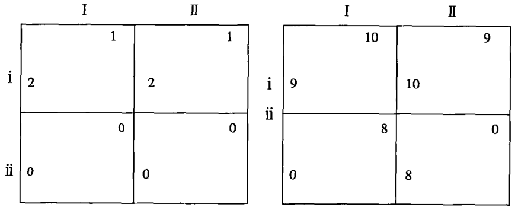
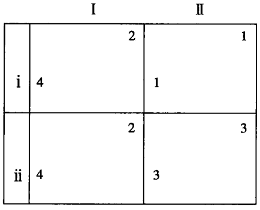
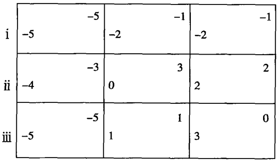
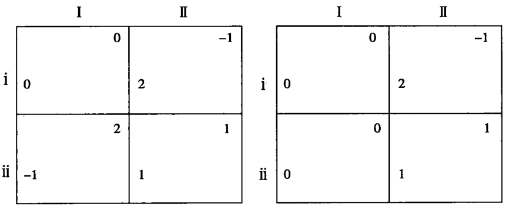
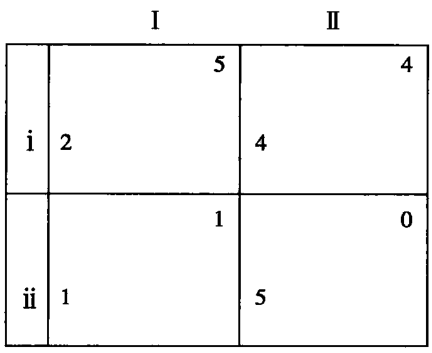
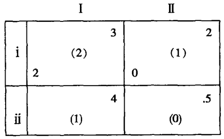
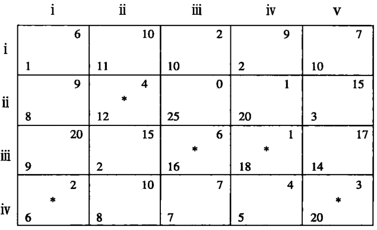
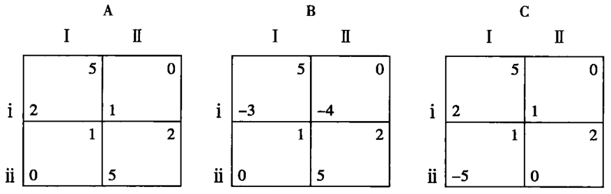
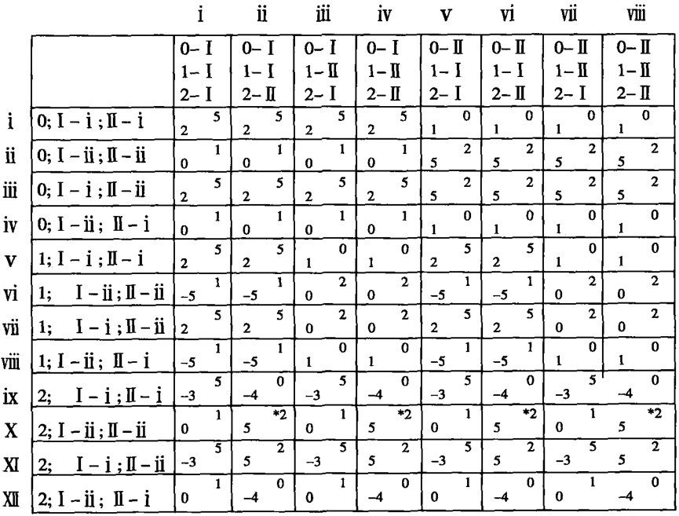
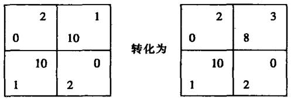

# 第5章 实施、沟通与战略行为

  我们已经深受博弈论的影响，通常不由自主地将博弈论应用于实践
中，如平时所说的威慑、核讹诈、恐怖平衡或旨在减少突袭的开
放天空政策；或者我们平时形容美国驻欧洲的部队为铁丝网或厚玻璃板
窗，以及认为应该让威胁体面地退出；或者我们发现威胁如此无效，以
致威胁方都不愿意实施威胁。而且，我们注意到出租车司机往往拥有更
大的停车位，因为人们害怕他们不在乎撞车追尾。正统的博弈理论很难
解释这些行为。作者认为，非零和博弈过分强调抽象的理论研究，而忽
视了这一重要的研究领域。博弈理论家通常关注从沟通和实施系统中提
取理论精华，或将博弈选手的对称性看做是一个范例而非特例，从而导
致博弈论忽视了一个最有可能取得丰富成果的层面，并失去了发现典型
非零和博弈关键要素的宝贵机会。由于受传统非零和博弈方法的影响，
博弈论以前忽视了某些典型的博弈场景或博弈模式，以及一些特殊的非
零和博弈战略行为。

  例如，什么“行为”能够体现有关大规模报复的争议？一个有效的
威胁需要哪些要素？博弈论如何解释大家比较熟悉的“Have a bear by
the tail”的故事？以及我们如何解释这个故事所暗含的收益矩阵、沟通
体系和实施体系？行人如何恐吓汽车司机或小国如何对大国产生威慑？
以及我们该如何使用博弈论术语表述这一行为？是什么信息或沟通结
构，或者说是动机集合导致威胁对狗、傻子、小孩、狂热者和殉教者失
去作用。

  某种程度上，二战后的中美苏之间动荡的冷战战略和核对峙，都可
以被比作一场博弈。例如，分别处于峡谷两岸的一对敌人都在对方的毒
箭有效射程之内，而且毒箭的毒性足以令对方进行二次攻击；[^5-1]一个牧
羊人将一只狼追赶到一个死角，狼只有奋力一搏，而牧羊人也不想放过
狼。虽然后者随身携带了一颗手榴弹，但是由于双方距离过近而无法使
用；两个邻居互相在对方的地下室埋下炸药，试图通过控制电钮或雷管
来确保彼此安全。[^5-2]如果能够分析这些博弈场景的结构或发现一些有效
模式的话，我们就可以将我们的理论应用于解决现实问题。

[^5-1]: 请参阅 : C.W.Sherwin， “ Securing Peace Through Military Technology,* Bulletin of the Atomic Scientists, 12: 159~164 (May 1956).

[^5-2]: 请参阅: (Herman Kahn and Erwin Mann， “Game Theory", The RAND Corporation, paper P-1166（Santa Monica，1957），pp.55ff.）两位作者在书中详细论述了本书中提到的炸药、威慑等方面的案例。

  为了进一步说明这个问题，我们这里引用一个20名警察围堵一名
持枪歹徒的案例。本案例中，这名持枪歹徒持有一支6发子弹的枪，可
以击中6个人。如果警方愿意付出6个人性命的代价的话，他们就可以
制服歹徒。或者如果他们能够说服歹徒相信，对方主动缴械将免于死
罪，那么他们也有可能毫发不伤地制服歹徒。当然，歹徒也有多种反抗
的方式：他可以不顾警方的警告，肆意开枪或者做出某种举动显示其对
警方的不信任。假设双方无法进行有效的沟通——歹徒可能使用另一种
语言——他们就无法说服对方缴械。当然，警方如果不能达成共识，当
然也不可能对歹徒实施威胁；或者歹徒威胁警方谁交头接耳，就打死
谁，那么他就可以阻止警方达成共识。如果警方无法找到化解风险的方
法，那就没有人愿意主动执行实施威胁的任务，因为他们无法令自己的
威胁具有威力；反之，如果歹徒宣称，谁动就打死谁，那么他就可能
威慑警方，除非警方有20人一起行动，没有“第一人”之说。假设警
方中有14人的权力大于剩余的6个人，前者可以命令后者行动，那么
他们就能向歹徒证明自己能够将其制服。这样的话，他们的威胁就取得
了成功，歹徒只能缴投降。即便如此，他们是冒着生命危险。我们还
可以假设另外一种场景。警方将歹徒逼入了死路，歹徒除了缴械别无选
择，那么警方免除惩罚对方的允诺就可能发挥作用。但是，他们不能保
证以后不对歹徒进行审讯。在这种情况下，歹徒最好挟持一名人质。对
警方而言，他们需要彼此间达成拯救人质的默契。一旦我们能够分析得
到这类博弈游戏的关键因素，我们就可以更好地理解一个暴君或少数人
暴政的权力基础，或者成功暴动的必要条件。

  本章将讨论博弈论涉及的几种重要行为模式和结构要素。这些行为
包括“威胁”、“允诺”、“沟通破坏”、“授权”等等。此外，结构要
素主要涉及沟通和实施条件等。

## 行为

  最典型的“行为”模式要数第3章中详细讨论过的承诺。如果制度
环境规定，潜在买方只能进行一次发盘（相当于承诺），否则将受到相
应的惩罚，那么，卖方只有惟一次选择的机会：接受或者拒绝买方的
发盘。承诺的存在将动态的谈判过程转变为具有两个极端的博弈：一方
只有一次机会提出条件，而另一方只有一次选择机会。这样的话，博弈
结果将更加明确。[^5-3]

[^5-3]: 在前面提到的卖房案例中，如果B找到某种方式以20美元购买房子并保留或摧毁房子，那么，他可以向C提出索要的标准，除非得到大部分，即20-P（P为C能够支付的最高价）。实际上，B改变了自己的最高价格和向C提出的要求。D和E也决定纷纷效仿。率先做出承诺的一方将获胜。如果D客观地愿意付出22美元，他的价格将是房子的真实价格，D的真实性甚至大于B。

  第3章中详细论述过的“行为”在这里将作为一个典型的行为模
式。正如第3章所论证的，这种行为的存在和有效性取决于博弈的沟通
结构，以及博弈双方是否能够找到做出承诺的有效方式及其履行承诺的
能力。此外，我们假设博弈具有非对称性，“胜利属于能够做出承诺
或者率先做出承诺的一方。（我们可以考虑博弈双方特殊的关系，但是
我们没有通过假设对称性的存在把双方的关系过于结论化。）

  虽然为了更容易找到博弈的方法，我们可以将博弈结果明确化，但
是一旦我们确定博弈双方中谁第一个做出承诺，那么这场博弈就演化
为战略博弈。尽管第一个做出承诺的一方获胜，但是这并不意味博弈
如同赛跑，谁跑得快谁就赢。根据博弈规则，二者区别在于，做出承
诺的一方并不意味着就一定是赢家，不管是从实际还是从法律角度，
结果依赖于与第一方没有隶属关系的第二方的选择。承诺就是诱使对
方采取对自己有利的战略行为，通过影响对方的预期判断而限制对方
的选择。

  在这样的博弈游戏中，采取承诺就如同采取了第一个“行为”。如
果机制没有为双方提供禁止更改承诺的司法和契约氛围，那么博弈双
方可以通过限制自己的选择自由而实现行为的不可更改。这样，鉴于
一方已经做出了承诺选择，则另一方也就不可能再做出其他选择；如
果他违背了这一原则，那就等于自寻麻烦。卢斯和雷夫约定，双方可
以采取同样的策略应付对方，如果彼被此愿意的话。例如，双方参加同
一个会议这并不意味着彼此信任。“他表明了自己的立场，并保证自
已不会打破会议进程，结果他丧失了其他选择权力以及届时根据自己
的爱好做出行为选择的权力”。[^5-4]同样的道理，当一个人希望在整个
野外旅行过程中远离香烟时，他只能采取实际行动而非仅仅口头上
的誓言。

[^5-4]: 参阅 : Games and Decisions, pl75.

## 威胁

  威胁最显著的特征是威胁方对外声称，如果被威胁方采取（或不采
取）某个行为，他将采取某种威胁行为。如同承诺，一旦博弈一方做出
威胁承诺，就意味着他失去做出其他选择的权力。如果威胁战术失败，
威胁方面临的境遇可能会比以前更糟糕。威胁和承诺产生的共同原因在
于，一方期望通过这种方式迫使理性的对方产生一种错觉，即自己可能
已经改变了动机结构。和普通的承诺一样，只有当一方将威胁的信息或
至少某些威胁的迹象传达给对方后，威胁才能发挥预期作用。例如，我
威胁你把窗户关上，否则我就打你。你知道除非我以百分之百的决心履
行自己的威胁承诺，否则我是不会这么做的。[^5-4b]

[^5-4b]: 简单地说，威胁就是当一方无法按照对方的意愿采取某种行为时，后者仅仅警告或提醒前者将对其实施报复。很清楚，一方存在实施威胁的意图。同样的场景还有当某人闯进一个人家里时，后者威胁报警，而威胁用枪将其打死则不属于我们讨论的威胁。我认为最好换一个词，如“警告”能更准确地描述这些场景。因为威胁要么显得有些花哨，不能使人想到行为；要么就是传递真实的意图或与信息结构或沟通结构相联系。在后一种情况下，威胁成为两全其美的好事，只要对方能够理解威胁的真实意图。区别警告和威胁相似性的关键在于二者是否能够准确地将信息传达给对方或让对方知道威胁的某种迹象或意图。实际上，如果威胁本质上是双方在沟通过程中出现的承诺行为，那么假设承诺出现在威胁之前，那么威胁行为的第一个行为改变了真实动机结构，而第二个起到了警告的作用。

  威胁与承诺的不同之处在于，威胁是以对方的某种行为为前提条
件，承诺则是一方做出的单方面行为，而威胁是一方对另一方行为的行
为反应；承诺是当承诺能够创造有利条件时，一方采取的“第一个行
为”（the first move），而威胁则是第二个战略行为（second move）。
因此，只有当一方对另一方实施了第一个行为后，或对方实施了第
一个行为后，威胁才能发挥应有的作用。当然，如果条件允许的话，假
设一方必须实施第一个行为或与对方同时做出选择，他将拥有在提出威
胁的同时要求对方采取“第一个行为”的“合法”权力。博弈游戏也可
能存在沟通和实施的行为结构，从而为允诺提供可能性并阻止对方提前
实施破坏行为。假设拦劫行人的强盗遇到了一个身无分文的行人，除非
他能以人质要挟对方回去取钱，否则他将一无所获。但是这种方法必须
存在一个前提条件，即罪犯为了得到钱必须在保证人质的人身安全的同
时，要求回去取钱者不得报警。

  实际上，类似的承诺行为或至少存在承诺特征的行为必须依赖于
威胁，并要求一方能够与博弈游戏中的、与自己不同立场观念的另一
方进行沟通。这一观点的核心就是，威胁必须具有必要性和可行性，
而且保证被威胁者的行为对威胁客体本身的损害远远大于实施威胁的
一方。卢斯和雷夫也持有同样的观点，他们以一句话形容了威胁：
“伤你伤得比我深。”这充分表明，威胁取决于博弈双方的联系密切程
度。如果谈判双方都试图实施有效的威胁，那么这将使扑朔迷离的谈
判结果更加依赖于双方的“谈判风格”（Bargaining personality）。“在
没有对对手的心理和经济状况进行全面分析的情况下，就妄下论断将
是多么愚蠢。”[^5-5]

[^5-5]: pp.110~111，119~120，143~144.将博弈论应用到国际关系领域的莫顿·A.开普兰（Morton A.Kaplan）认为：“任何注重双方间威胁的标准都涉及二者的效用比。”（参见 System and Process in International Politics ［New ork，1957])。卢斯和雷夫决定他们二人之中只能有一方拥有威胁权，双方的选择矩阵为2x2。实际上，双方不可能在这样的矩阵中做出威胁。威胁是有条件的第二次行为承诺。只有当一方希望对方做出一个选择或产生更好的效果时才能使用威胁。（如果第二个行为非常有效，那么就没有必要进行威胁，只需继续按照战略进行谈判，不必做出条件性选择。）而且在矩阵2x2中，条件只有对一方有利。事实上，二者进行的谈判表明选手2根本不存在可行性的威胁选择。原因不在于选手2的得失大于选手1，而在于选手2根本没有必要进行威胁。无论谁先选择，选择2一定会赢。惟一的可能性就是他要遏制对方的威胁行为，为此，他只需承诺无条件贯彻自己的战略——这也是在对方采取威慑之前的“正当防卫”。纳什将这一威胁用于谈判博弈中，并取得巨大成果，当然，他所指的威胁含义不同于这里的威胁。为了避免两败俱伤，一方不需要某个特定的结果，只需要某些有效的结果。纳什的威胁是为了取得某个特定的结果；而这时的威胁属于不对称情景。游戏规则当然允许双方改变自己的承诺，否则第一个承诺就成为最终结果了。双方可以采取合法的不作为，与对方公开谈判达成任何结果，从而逃避自己的承诺，因为只有可更改的承诺才能影响谈判过程。卢斯和雷夫的案例中非对称性是特定法律体系的一个特征。实际上，如果出现毁约的现象，毁约一方将受到社会的谴责，受到应有惩罚。不仅要对协议当事人的损失负责，而且还要对其社会损失负责。
  
  但是，这个问题如以下面方式表述，将变得更加简单易懂。在图5-1
中，左边矩阵的列（选择列的一方，以下简称列）将实施“第一个行为”。
在没有威胁存在的情况下，列很容易取得胜利。他选择了战略I，从而
迫使行（选择行的一方，以下简称行）从1或0中做出选择。行选择了
战略i，列将得到结果2。现在我们假设行威胁列，除非列选择II，否
行将选择ii。也就是说，行迫使列在ii和I或i和II中做出选择。当然，
如果列首先选择I，那么行无疑将选择i，双方都知道这一结果。假设
列相信自己选择I后，行必须选择ii，那么这一战术就达到了预期目的。

  当然，列对此可能相信也可能不相信。如果他相信这一点，威胁对
其将没有任何效果，他将继续做出自己的最佳选择I。如果他相信行一
定会选择i、II或I、i，那么列更倾向于结果1而选择II。如果换成
其他数字，只要矩阵结构能够反映双方的选择倾向，这一原则同样适
应，包括图5-1中的右边矩阵。

  相对于左边的矩阵而言，右边的矩阵则更反映了威胁的显著特征，
因为列对行非理性选择的惩罚更严重。但是，如果行掌握了充足的信息
并做出正确的选择，行就不需要担心来自列的惩罚。列的意图非常明
确，只需要行迫使自己从ii和I或II和i做出选择。毫无疑问，列将按
照自己的意图做出选择。假设我威胁你说，如果你不把最后一块面包片
给我，我就打破脑袋将脑浆洒到你新衣服上。那么你只能选择把面包片
给我，不管你认为我是否会这么做或仅仅将鸡蛋扔到你身上。[^5-6]

[^5-6]: 爱德华·班菲尔德（Edward Banfield）援引印度西部某个地方的现象向我说明这问题，他称该地区的人为吟游诗人。“在那里，人们雇用大批的保镖押运金条，即使如此，也不能保证一定安全。为此，他们与队伍的首领甚至的当地政府都达成协议。”他们的权力来自于个人魅力和坚强意志。如果是一个携带金条的人，他只需要做出某种承诺，即可受到保护。如果对方违约，他可以实施同样的威胁。如果没有被重视，他可能用匕首刺伤自己胸部。如果这种方式也不能达到目标，他就会刺伤自己的心脏，或者首先将自己孩子的头扭掉。不同的协议可能导致一方首先被自己的同伴欲头。对这一过程的恐惧和担心死人的血溅到头上可以使人们保持理性。由于不忠将要受到如此严厉的惩罚，所以他们都不惜一切代价去履行自己的承诺。”(Mountstuart Elphinstone History of India [ed.7:London：1839]）

  问题在于我们是否承认博弈具有各种行为，即博弈双方是否可以在
博弈过程中实施某种行为，从而改变博弈进程——改变结果的选择方
式、选择的顺序、博弈的信息结构。假设除了双方达成共识或拒绝对方
的条件外，博弈本身不允许任何其他行为的存在，那么博弈的结果很大
程度上取决于博弈双方的“个性”因素，即他们在一个没有行为的博弈
过程中只能通过心理沟通达到相同的预测判断。如果威胁不是一方对另
一方的强制警告，我们可以理直气壮地质问，什么是真正意义上的威
胁。但是可以肯定的一点是，威胁一定涉及某种承诺因素——不管是真
还是假。

  这里的承诺一词含义十分广泛，既包括迫使对方必须做出选择的行
为（如一方司机以加速行驶威胁另一方退缩）；也包括改变一方此前出
于经济原因而做出的最终选择（当政府故意惩罚虐待狂；或投保人改变
自己的要求和向保险公司做出的允诺。）；还包括为避免履行诺言造成的
损失而毁约的紧急自损行为（如一方承诺如果自己不能履行协约将当众
出丑；或一方在自己的商店前安装厚玻璃以警告女顾客和小孩。）在日
常生活中，我们也能看到类似的例子，如欧文·戈夫曼（Erving Goff-
man）为我们提供的“商人”案例。戈夫曼指出：“商人，特别是街边
的小贩都非常清楚，排起队伍卖东西往往缺乏信誉感，从而赶跑顾客，
除非一些顾客为了卖方的面子而勉为其难地上当购买，但这也掩盖了通
常发生的一幕。”[^5-7]

[^5-7]： 戈夫曼的论文对博弈论与博弈者之间的关系进行了细致分析，发展了对标准博弈行为结构的研究，如礼仪、骑土精神、外交惯例和法律。

  然而，有时对威胁承诺的界定并非如此严格。博弈一方可能认识到
“实”（firm）承诺意味着必须履行，否则将受到严重的惩罚。换句话
说，一方一旦做出了这样的承诺，就必须不惜一切代价去履行。这种无
限（至少是严厉）惩罚是他的自愿选择，并且不可反悔，具有可衡量
性、可操作性。在整个博弈过程中，做出承诺的一方必须以实际行动履
行自己的承诺。当然，条条大路通罗马。如果把惩罚的力度适当降低以
适应于其他情况，也可能达到同样的效果。在图5-2中，如果列首先行
动，那么他将获得胜利，除非行承诺选择i（承诺为行赢得“第一个行
为”权）。但是如果承诺意味着对选择ii一方的有限惩罚（如图所示，
我们从行的选择ii中各减去1以示惩罚），那么只有当惩罚大于2时，
这时承诺才有效。对于列而言，如果他选择II，那么行只能选择ii并放
弃这一承诺权。因为，在这种情况下，承诺对行来说只是个负担，因此
行竭力避免做出任何承诺。

[^5-8]: 例如，如果选手列不能按照规定迫使选手行首先选择，那么列可以“合法地”威胁行允诺选择ii，自己选择I。分析过程中，我们应该注意对允诺和威胁承诺的惩罚力度。尽管对允诺的人为或机制（对第二方而言）本质上不同于单方面允诺（第二方不能自主解除）。一般而言，对违背允诺和威胁承诺的惩罚不同，这与对双方的惩罚是同样的道理。图2-4的结果就必要惩罚条件必须大于或等于1，无论是列还是行做出允诺。请注意，如果威胁以允诺为条件，那么双方存在违约的情况，则实施威胁的一方将获得优势，而被威胁一方将处于不利地位。

  与上面的情况不同的是，如果图5-3没有威胁的存在，不管游戏规
则要求谁首先行动或是否同时行动，游戏的结果都将为iii和II。只要一
方拥有“第二个行为”权并向对方施加威胁，他一定是赢方。[^5-8]列可以
威胁I－iii；行可以威胁i一II。但是如果惩罚保证了威胁有效实施，那
么列期望的较轻惩罚结果是4：当行选择iii时，列只有选择II才能得到
他希望更轻的惩罚。如果行不履行承诺，那么他可能得到的最轻惩罚将
是3。假设惩罚程度具有惟一性，不能低于3，那么结果一定是iii和II。
如果惩罚大于4，那么率先做出威胁承诺的一方将获胜。当收益大于3
小于4时，惩罚仅对赢方行有效。在后一种情况中，当威胁失败时，损
失最大的一方就是不能实施威胁的一方——但是他不能进行严厉的自我
惩罚。

  这里需要注意的是，“更大损失”（hurt more）并不是指行的威胁
造成双方谁的损失更大，而是指行完全履行威胁承诺时是否会比列遭受
更大的损失。这里不是行实施威胁行为，而是列。实际上，如收益矩阵
所示，只有当履行威胁承诺遭受的损失比列大时，行的威胁才能取得成
功；反之，只有当履行威胁遭受的损失比行小时，列的威胁才是成功的
威胁。

[^5-9]: 第7章和第9章将对这一问题进行深入探讨。

  此外，扩大威胁含义的另一种方式是将我们的假设理性化。假设R
为Pr，C为Pc，而且双方有可能做出错误、非理性的行为，或者由于
对另一方选择结果的误解而盲目地决策。[^5-9]现在我们得到一个不同的博
弈游戏。在这个游戏中，双方履行威胁的得失涉及到一方威胁的完全履
行是否引起对方的注意。如果一方因实施威胁而遭受的潜在损失大于对
方，那么这个博弈游戏就具有对称性——双方拥有平等的权力，可能遭
受同样的结果。在这个博弈环境中，一方可能发现威胁对自己有利，对
对方不利；而对方可能持有不同的观点，坚持威胁的错误性。（同样的
道理，如果双方拥有实施威胁的同样机会或双方能够同时实施威胁，而
后一种情况往往是由于一方没有认识到对方的承诺，而无法及时停止实
施威胁。）对威胁概念的发展——在理性条件下——很大程度上是以
“更大损失”为标准。总而言之，博弈论往往强调，如果博弈一方实施
威胁而非仅仅局限于口头宣言，那么，其收益必须大于对方，其损失必
须小于对方。这无疑是对谈判战略理论的巨大贡献。除非排除相对“效
用优势”（utility-comparison）标准，否则我们根本无法认识和分析
如战争威胁、价格战威胁，文明社会对犯罪行为和行为不端进行惩罚威
胁以及勒索，敲诈和威慑。博弈双方之间的威胁不对称性还需要我们进
行深入的研究和探讨。但是非对称性仅是就某些方面而言，如沟通系
统、威胁和允诺的可行性、做出承诺的时间、预期反应的理性化程度以
及相对损失标准。

## 允诺

  我们不能把强制性的允诺认为是理所当然的事。一份有效的协议必
须以强制性术语表达，并涉及协议当事人的强制性行为。强制性取决于
至少两个因素——拥有相当权力的权威部门能够判决是否实施惩罚和拥
有相当权力的权威部门能对双方的不当行为进行必要的惩罚。战后不计
其数的裁军谈判和核查计划已经表明这一问题何等艰巨，即使谈判双方
应该达成一个强制性的协议或有效的强制实施方案。如果谈判双方没有
互信或根本不相信对方有任何履行协议诚意，这一问题将变得更加复
杂。如果存在有效的方式迫使双方做出强制性允诺，或世界各国都能毫
无保留地承诺某种世界权威，那么武器核查的技术问题就会消失殆尽。
但是由于没有有效的监督手段，甚至有效的惩罚机制也无法迫使各国做
出强制性允诺。当然，有效惩罚机制的匮乏无疑加剧了这一问题的严重
性，除非公平谴责最初协议的第三方愿意出面执行这一惩罚。此外，我
们必须排除掉一些看似重要却不具有操作性的协议。通常只有内容客观
公正、拥有必要监督机制的协约才具有可操作性。

  允诺必须是对等的双边（契约式）承诺，双方的允诺互为条件。当
然，在某种情况下，为了促使对方能够从双赢的角度做出选择，一方可
能单方面做出允诺。图5-4就说明了这一点。在左边的矩阵中，如果双
方同时做出选择，那么只有一次允诺是有效的；在右边的矩阵中，如果
列一定选择II，从而出现双赢的局面，那么，行的允诺将为其赢得收
益。（如果在左边的矩阵中，双方轮番做出选择，那么，第二个选择的
一方将拥有做出允诺的权力。如果双方约定选择的先后顺序以及其中一
人将做出允诺，那么，他们可以决定另一方首先做出选择。与右边的矩
阵中单方面无条件允诺不同的是，这些允诺必须以第二人的选择为前提
条件。）在前种情况中，如果一方能够将对方消灭掉而不被觉察，那
么，他就会破坏这一允诺[^5-10]。如果一个国家即将拥有完全的突袭能力，
那么，它可能率先单方面做出允诺——如果可能的话——从而避免来自
敌国先发制人的袭击，因为对后者而言，这是惟一的机会。

[^5-10]: 约翰·科利尔的《多雨的星期六》反映了这一思想。最近还被艾尔弗雷德·希区柯克制作成电视片。一个人无意间目睹了一场谋杀案。凶手为了堵住他的嘴，迫使他在尸体上留下手印和其他犯罪证据。这样一旦事情露，他也将受到法律的严惩。实际上，他应该制造假证据，与真正的凶手一起承担罪责。（摘选自短篇小说 New Yorker［London，1951]，pp171~178)。

  允诺的真正含义——例如威胁——非常模糊。允诺似乎是第二方非
常欢迎的允诺（有条件或无条件）。在图5-4的两个博弈游戏中，允诺
都是双赢的选择。但是在图5-5中，行必须在选择威胁的同时选择允
诺。行不仅要威胁ii－I，而且还要在对方选择II时允诺选择i。行的
这一选择将使列的收益是4而非0；如果后者选择II，这是非常有利的
收益。如果行无法做出允诺，那么列将赢得5。因为没有允诺，威胁无
法发挥应有的作用，甚至根本不会出现威胁。行的威胁ii一I对其一点
好处都没有，这一选择无法迫使列选择II，因为如果列做出了这个选
择，他只能得到ii一II，即0而非1。只有行做出允诺，他的威胁才能
产生威力，允诺的使命就是为威胁服务，迫使列得到4而非5，为自己
赢得5而非2。一方显然不能仅仅通过不遗余力地追捕而迫使间谋、阴
谋者和病毒携带者自报门户。当然也不能豁免自投罗网的人。[^5-11]

[^5-11]: 某些自首者可以从轻处理。

  一种更好的解释或许是，允诺是第二方可以控制的承诺。换句话
说，第二方可以自主地选择履行与否，但是必须在有效的时间内。只有
一方完全做出威胁承诺后，允诺才能生效。但是，如果允诺的对方
（列）事先做出拒绝声明，那么行知道自己选择II后，对方会选择0，
则威胁将被化解。如果威胁允许不可分割或带有不能撤回的行为，那么
这个定义将变得十分模糊。（事实上，一旦某种不可更改的行为而非法
律承诺可以取代允诺，这种定义将无法成立。）

  实际上，只要存在两个以上的选择，威胁和允诺就成为一方对另一
方的互动反应模式。鉴于此，尽管威胁和允诺都属于选择性和条件性的
自我承诺，我们最好将二者看做同一战略的两个不同方面。有些案例已
经表明，这种承诺很大程度上考虑了对方的利益。

  **实施方案** 如果不存在权威的监督或有效的监督方式，那么协议根
本没有强制力。实际上，协议通常涉及的问题主要是协议的形式和协议
内容的协商。因为一种有效的方式和明确的内容能够阻止令双方不愉快
的事情发生，如一方采取欺诈行为，则保证协议的有效实施。在强调双
方之间互信重要性的同时，我们还不能过分依赖这种互信，因为甚至是
博弈论对互信的定论本身就值得商榷。互信通常依赖于双方之间关系的
稳定和双方对长远利益与短期利益的权衡。如果对方认为，长期利益重
于短期利益，那么，他就不会为了短期利益而采取欺诈行为；反之亦
然。当然，如果双方间的互信发展到一定程度而发生质的变化，那么，
在旁观者看来，互信好像是某个特定阶段的产物。

  在以下几种情况下，人们往往能够达成有效的、具有强制力的协
议。协议的成立以双方的合作与某种补偿为条件，如两个人就吃饭的地
点发生分歧：两个罪犯就犯罪证据发生分歧；公司员工就报价或足球队
员就战术问题出现分歧等。在这些场景中，争议双方存在某种共同利益
高于二者之间的分歧。为了实现终极目标，双方需要克服分歧，达成共
识。协议一旦成立，就成为双方行为的标准，为以后合作提供依据。协
议当事人除了按照协议履行自己的责任，别无选择。如果双方自己无法
以有效的方式监督协议的履行，他们可以寻求其他监督机制的帮助或者
引入第三者监督人，后者的使命就是严厉惩罚违约一方。在生活中，我
们可以看到这方面的案例，如将藏宝图一分为二或将枪支的使用权交给
一方，而将子弹交由另一方持有。

  古代的人质交换机制也值得博弈理论家好好研究，类似的例子还有
典型的同饮一杯水以防对方下毒，或在大庭广众之下会面以防对方埋
伏，以及在毒品交易中使用吸毒人员作为中间人或代理人。这些例子都
是单方面人质行为的典型例子。

  如果两个敌对国家想避免两败俱伤，它们可以交换人质以示诚意或
达成一个共识将两个国家的管理部门迁移到某个孤岛，由两个国家轮番
管理。在此前提到的双方价值观问题中，都没有涉及对互换人质和采取
理性行为的重要障碍问题。一个国王将自己的女儿送到敌国作为人质，
但是这样并不代表对方一定相信他的诚意，因为对方或许还认为这个国
王根本不喜欢这个女儿而这么做的。我们或许可以通过开展“海外儿童
年”活动（junior year abroad）来消除前苏联人对来自美国突袭的担心。
具体做法是：将每一个5岁的儿童都送到前苏联学习一年——反之亦
然。这么做纯粹是为了发挥人质的作用，而非文化交流——每一届的新
生都在毕业生离开之前到达，那么，美国就没有任何机会对前苏联实施
核偷袭。当然，我们无法肯定前苏联人和我们有相同的想法；我们也无
法肯定，这样的双边计划是否能对前苏联人发挥同样的作用。不幸的
是，即使这个双边计划对前苏联人发挥了同样的效果，但是我们也没有
充分的理论说服自己相信。尽管如此，在许多突袭情况下，单方面的允
诺总比没有要好得多。交换人质的做法值得考虑，即使不是对称性的交
换。[^5-12]

实际上，交换人质思想与认为大国进行裁军谈判更有效（或许涉及
更多技术问题）的观点具有同样的逻辑，如果后者涉及国防军备及其结
构的话。本质上讲，一个国家没有国防就意味着将自己的国民作为人
质，区别在于并没有将他们置身于对方国界内而已。如果这样的话，前
苏联人将他们的孩子交给我们，我们就可以对他们进行虐待，并置之不
理，任其生灭；反之亦然。这样就现出了我们通常所说的“恐怖平衡”
（Balance of terror）——实际中确实存在这样的情况——这如同人质大
交换。（这一类比要求平衡比较稳定，双方都不能偷袭对方，打击其反
击能力，与此同时，双方只能进行前面提到的行为。）[^5-13]

[^5-12]: 要谁确地定义人质确实比较困难，如同定义允诺和威胁一样。如驻欧美军可以被看做是人质，尽管他们的使命是为了表明美国可以插手欧洲冲突事件。如果他们不能发挥人质的作用，那么他们的孩子和妻子可以做到。一般而言，侵略国总是避免在被人侵国的旅游旺季入侵，因为这样可以避免不必要的人质问题。

[^5-13]: 第10章将对这一问题进行深入探讨。

  **违约行为** 允诺的有效性还与第三方的影响联系密切，例如后者可
以故意破坏双方间有效的协议，增加双方的困难。这意味着，禁止非法
行为将是对协议双方的放纵。如果这样的话，合同也就没有权威性和有
效性了。不能履行赌博、贸易制裁或在禁酒令期间走私酒品等契约，都
是人们抵制这类行为的表现。当然，有些时候这类禁令可以成为某些人
保证双方履行协约或允诺的权力。[^5-14]在禁酒令期闻，不保护专利酒品意
味着只有大的非法组织才能生产高质量的酒品，禁酒令无疑是在帮助他
们垄断市场。同样的道理，保护专利权和商标的法律可被看做是促进非
契约贸易的手段。

## 主动权的放弃

  是什么造成威胁和普通的承诺成为难以实施的策略？一个有趣的研
究课题是，找到履行承诺和惩罚违约行为的有效方式。限制或放弃一方
选择权的相关策略多种多样，数不胜数。这些策略只有一个目的，摆脱
令人尴尬的主动权，从而使结果取决于另一方的选择。

  这就是国务卿杜勒斯希望在下面的文章中寻找的策略。

  在不久的将来，我们很有可能摆脱对大规模报复威慑的依赖……因
此，与20世纪50年代不同的是，在20世纪60年代，那些以中国和前
苏联为核心的国家能够具备有效的国防力量阻止全面的常规进攻。面临
敌国入侵时，他们也有权力在投降和使用核武器与敌人同归于尽之间做
出抉择。从这个意义上，我们可以说格局将发生变化，问题不是被侵略
国是否具备核打击能力保护自己以及侵略者不应该具有常规进攻能力，
而是他们如何权衡核战争的后果。[^5-15]

[^5-14]: 有人认为敲诈者的作用在于保障非法契约的履行。根据R.L.达弗斯（R.L.Duffus）的观点，芝加哥服装贸易在降价行为可能遭到爆炸的报复——定价组织指使。参见R.L.Duffus The Function of the Racketeer", Neu Republic (March 27, 1929), pp.166~168).

[^5-15]： J.F.Dulles, "Challenge and Response in U.S. Policy," Foreign Afairs (October, 1957) 迪安·艾奇逊在其著作 Power and Diplomacy[Cambridge，Mass，1958］，Pp.87~88）中用同样的语言论述了其对美在欧驻军的立场：“我们应该让对方相信，任何大规模进攻都将导致大规模报复，因为‘他将为我们决策……我们在欧洲驻军为了更有效地进攻’。”

  杜勒斯认为20世纪50年代的威慑与20世纪60年代的威慑不同之
处在于，谁是最终的决策者。这一差异非常重要，因为美国还没有找到
一种令自己信服的有效承诺方式以大规模报复行动对付某种进攻行为。

  在第一颗原子弹成功付诸实践以后的一段时间内，有人怀疑地球的
大气层对核裂变的承受能力是有限的。这一担心来自于核爆炸的连锁反
应将严重破坏地球的大气层。有人认为，如果这一怀疑成立，那么，我
们可以准确地测定地球大气层的承受能力，从而可以将核弹的使用控制
在极限范围内，即n-1个核弹。

  美国空军中校（后降为少校）史蒂文森·坎农成功演绎了围魏救赵
的战术。在他的条幅式侦察照片中，坎农驾驶自己的飞机保护一艘即将
被解放军地面部队捕获的国民党舰艇。在没有敌意和攻击命令的情况
下，尽管知道没有必要实施威胁，他还是驾驶飞机将一个燃烧的汽油桶
投向地面部队，从而迫使解放军退让。他不需要向敌船投掷汽油桶，
也不需要实施威胁，由此他放弃了主动权。

  同样的战术还有将“消极抵抗”称为“积极不抵抗”。根据《纽约
时》（The New York Times）的报道：“今天，日本罢工的铁路工人
在300多个火车站的轨道上示威，造成48人滞留，144个班次取消。”[^5-16]

  《纽约时报》还报道了一个类似的日本新闻。本周日本进行了一次
公开辩论。辩论的主题是，是否允许自杀式静坐抗议船驶向复活岛
（Christmas Island）周围的禁区水域，英国计划在该岛进行氢弹实验
这次远征的首要目标就是阻止英国的核实验。[^5-17]

[^5-16]: "Rail Strikers Sit in Tracks," The New York Times (May 13, 1957) .Pp14 Lf.) "火车司机将火车缓缓行驶，故意从司机座位上跳下火车，穿过车站后又跳回驶过来的火车。他的立场弱点是火车在工人离开轨道之前即能停止，特别是罢工工人故意集中阻止火车。他们可以通过占领轨道并将司机的钥匙丢掉来阻止司机，如果他们能在司机离开火车之前警告他的话。”

[^5-17]: "Japan Debating Atomic ' Suicide,*" The Neuw York Times (March 5, 1957), p. 16) .

## 定位

  任何博弈游戏都涉及一个重要问题：博弈双方对彼此的价值观究竟
知道多少。还有一个问题涉及双方完全定位的问题。如果一个欲打劫银
行的银行职员找到一个非银行内部人员作为同谋者，他也许会付诸行
动；但是，如果他只能找一个银行内部人员为同谋者，那么，他可能并
不付诸实施。因为二者同为银行职员，谁也不难确认对方是否真得敢于
打劫。谁也不会将自己的真实意图告诉一个可能没有共利益的人，否
则一旦事情败露将受到严厉的惩罚。类似的情况，一个男孩不敢邀请自
己心爱的女孩约会，惟一的原因是他害怕对方拒绝自己。同样，一个绑
架者如果不能将穷人和富人区别开，他也不能实现自己的目标。美国南
部反对种族隔离的少数人，可能永远不知道对肆意散布反动言论的惩罚
力度。

  和沟通一样，定位也不一定是互动行为，一方有时可以随意地改变
对自己的定位。一旦确定自己利益实体，谈判主体可能在谈判开始之前
就已经对相关问题进行了准确定位。莎士比亚的《针锋相对》（Mea-
sure for Mearsure）充分体现了这一原则。主人公安吉洛（Angelo）是一
位公爵，他关押了一名罪犯，并希望将其处死。当然，他也可以让其生
不如死，但是他没有这样做。罪犯的姐姐前来为弟弟求情，希望公爵饶
其一命。公爵看到罪犯的姐姐颇有姿色，顿生非分之念，并提出过分条
件，但是被后者断然拒绝。公爵就威胁罪犯的姐姐，如果她不答应条
件，就折磨其弟弟。现在由于双方自身的定位和沟通的实现，一场博弈
场景在他们之间展开。很显然，安吉洛的真实意图并非要折磨罪犯，这
只是他的一个要挟条件。如果有一个人出来接受这个条件，显然安吉洛
的这一条件将为其带来收益——而不是折磨罪犯本身。现在，罪犯的姐
姐处于不利境地，不仅确定了自己的身份，而且收到了对方的要挟条
件，那么，她现在必须承受她不应该承受的痛苦。因为她在不暴露自己
的身份或在对方提出条件之前逃走的话，就可以避免这一遭遇。

  几年前在纽约郊区发生了一件博弈案例。几个摩托车飞车族身上带
有会员证，以向警方证明自己是某个摩托俱乐部的成员。如果他们被警
方逮住，则可以向警方证明自己是俱乐部成员，并向警方贿赂。这些会
员证的作用就是向警方证明自己的身份，并且提示警察（如果后者接受
贿赂的话）保持沉默。它也证实骑摩托者的允诺是有效的，但是只能在
他们被警方逮住之后。假设警察认识他们，而且仅仅是惩罚驾车的摩托
车手，并威胁他们交罚款，那么，现在这些会员证能否发挥作用则取决
于摩托车手是否使用它们。萨瑟兰（Sutherland）描述了一个类似的场
景：“大多数警察都会或多或少地公平处理各种犯罪案件，因为他们拿
的就是这份钱。但是，他们有时也在接受贿赂后对自己的罪犯网开一
面，尤其是一些非惯犯。因为他们知道这样做非常安全，上级不会知
道，特别是对非惯犯。”[^5-18]

[^5-18]: E.H.Sutherland, the Professional Thief, Chicago, 1954, p.126.

  定位还与一个重要的经济现象关系密切，而传统生产与交换经济学
往往忽视了这一现象，即可能存在大量的破坏因素并与其产生的威胁有
关。例如，据作者粗略估计，一个智力略低于一般水乎的普通大学毕业
生一年辛辛苦苦创造的价值也许只有3000美元或4000美元；但是如果
他愿意的话，可以破坏掉比这一数字大百倍的价值。如果存在一种机
制，小伙子能够从其破坏的价值中获益匪浅，那么，他很有可能选择放
弃技工或办事员的职业，而成为勒索者，专门从事破坏活动。令人欣慰
的是，敲诈很大程度依赖于自我定位和勒索犯的自我沟通。

  通过安排犯罪嫌疑人与受害者接触，可以有效地增强罪犯的自我定
位。同样的道理，如果证人受到某种威胁时，为了保证在罪犯被捕之前
不泄露目击证人的身份，通常在大陪审团面前进行秘密宣誓。（博弈可
以被广泛应用于法律政策和法律的实施以及刑事威慑领域。）

## 授权

博弈一方有时将自己决策的部分主动权以及全部或部分利益授权给
可能成为（或已经是）对手的委托人。实际上，这一“行为”时常发
生。由于保险计划允许利益共享，因为保险公司通常都准备不同的方
案，从而能够更好地威慑投保人或应付投票人的不轨行为。同样，出于
互相制约的需要，有时我们需要不同部门的签署批准。雇用催债公司替
自己讨债就是为了实现与债务人的单方面接触，从而有效地避免来自债
务人的威胁或借口。向韩国军队提供军火或允许他们接受战俘营是摆脱
令人进退两难的权力的一个策略。之所以令人进退两难主要指要么自己
不得不卷入强制性或威慑性威胁，要么迫使自己从自己的威胁中让步，
这无疑削弱了威胁效果。

  美国与台湾的《共同防御条约》可以被看做是向意志坚决的一方移
交权力的一种形式。近来有关允许欧洲国家拥有核武器的建议引起了很
大争议。有人认为，将一种显性权力交给在某种情况下比美国意志薄弱
的国家，将增大威慑存在的可能性。

  雇用暴徒和虐待狂收取保护费或充当罪犯保镖，或是将权力移交给
一个军事指挥官都可以被看做是金蝉脱壳策略的应用。因为一旦威胁失
败，幕后决策者可以轻松地推脱责任。（这正如一个理性博弈选手理性
地装疯卖傻一样，从而避免外界威胁或推脱实施威胁的责任。同样，一
个理性的博弈选手也可以选择一个非理性的同伴或委托人。）

  图5-6中（忽略括号内的数字），如果行是第二个选择的一方，那
么他将失去右角的收益，列得到有利的收益。作为一个副产品（括号内
的结果），如巢存在一个没有决策权的第三者，只要行将其选择权移交
给第三者，那么行就能取胜；后者也将得到左上角的收益，而非前面行
得到的收益。尽管行不得不将自己的一部分利益分配给第三者，但是他
还是有必要支持第三者。对行来说，这是利大于弊，因为这样的话，他
将得到左上角的3而非右下角的1。

## 调停

  调停者的作用也是博弈论研究的一个重要课题。无论是博弈游戏规
则的自身安排，还是选手为了尽快达成共识而自我约定，调解人可以被
看做沟通机制的重要因素或能够影响沟通，并取得其自身利益的第三
者。但是，调解人的作用不仅仅在于影响双方的沟通——规定双方的递
盘规则等等——他还可以制定自己的规则，并提出积极的建议。也就是
说，在双方选手无法沟通的条件下，调解人可以按照自己的意图来影响
双方的预期判断。一个行人也可能临时指挥交通，疏缓堵车，这是因为
堵车的司机为了尽快摆脱堵车而愿意将指挥权交给他。虽然指挥权只是
建议性的，但是协作需要堵车司机共同承认这种建议权。还有一种情
况，或许每一对舞伴都愿意跳自己喜欢的曲子，但是只要主持人拥有一
个麦克风，就能迫使他们接受自己的曲子跳舞，不他们喜欢与否。通
常情况下，路中间的白线就是一个调停人，只要它能公平地对待马路两
边的行人，并赢得他们的承认。有关夏令时的争议也说明这一问题。如
果大部分人希望早一个小时工作，那么他们必须能够控制时钟。当然，
即使他们这样做了，那些持反对意见、组织良好的一小部分人，往往不
会改变自己的作息时间来适应这一调整。

  调停人也可以帮助博弈双方保留某些积极条件。一个调停人可以发
挥某种沟通的作用，也可以阻止某些信息的传递。（从这个意义上讲，
调停人可以是一台计算仪器。）例如，调停人可以通过比较双方的发盘，
然后指出双方存在的差距，但是不用暴露实际的发盘。他也可以是一部
扫描仪，将一部分信息压缩其中。但是，调停人只能做出某些博弈双方
无法实现的有限比较，因为没有选手专心致志于忘记什么事。

  还有一个问题就是，如何解决左手得到右手需要的信息的问题。例
如，政府的一些部门需要准确的收入资料用于数据统计分析；但是，政
府的另一些部门可能需要这些数据用于增加税收或审查偷税漏税。于
是，为了得到第一手资料，有关政府部门就有必要寻找一种方式保证这
些资料不被落入有关税务部门手里。类似的情况，一些公司调停人通常
只有在某种条件下才能将公司的商业秘密交给统计部门，如税务部门必
须保证资料的用途有利于公司并保证使用完后将资料销毁；咨询调查机
构必须保证以集体的方式发布信息，不能直接涉及个人隐私。当大宗货
物的顾客认为如果物品所有者不知道谁是真实的买主，其即可支付便宜
的价格时，调停人就发挥阻止双方身份定位的作用。

  如果博弈双方决定将不可更改的权力交给调停人，那么调停人将发
挥仲裁者的作用。但是只有当选手双方遭受损失时，允许仲裁者惩罚或
给予其某种补偿的时候，仲裁协议才能发挥作用。当然，博弈双方必须
相信仲裁者，并对其做出强制允诺。但是，如果仲裁者拥有强制双方履
行允诺的全部手段，那么一旦双方不信任对方，他们可以找到双方都信
任的第三者保管其利益。[^5-19]

[^5-19]: 有人告诉我在没有强烈商业诚信传统的国家里，为了公正和公平，交易双方往往邀请具有诚信文化背景的商业伙伴或董事作为监督人。因为在后者看来，诚信与公平是他们的共性，具有崇商的价值。

## 沟通及其破坏性

  许多有趣的博弈游戏和博弈场景都依赖于沟通结构，特别是沟通的
非对称性和一方对初期沟通的单方面选择破坏。如果双方无法进行有
效的沟通，那么，即使是威慑也无法产生预期效果。勒索场景更是如
此。如果勒索人不给对方选择的机会，那他根本无法达到目的。更有趣
的是，假设你对哭着的孩子说“不要哭，我就给你好东西”，但是孩子
哭得非常凶，因为哭声掩过你的声音而没有听到你的话，那你还能达到
目标吗？（有时孩子对此心知肚明）如果一个目击证人因受到监护无法
与外界沟通，那么他就不可能出于对恐吓的担心而作假证，即使他可能
已经推断自己不可能受到威胁。

  如果博弈结果取决于双方的合作，那么一方如果能及时破坏沟通可
能也不失为一个制胜良策。假设一对夫妇为吃饭的地方而在电话中发生
争执，这时，如果妻子简单地告诉对方自己要去的地方，然后把电话挂
断，那她就是赢者。同样的道理，如果一个人不想就选择的问题与对方
争执，他可以简单地将助听器摘掉。

  正如本章前面所讨论的，暴乱行为的成败往往取决于沟通是否顺
畅。如果沟通不畅，那么当局就可能通过切断暴乱分子的沟通渠道，从
而防止暴乱的出现；反之，如果暴乱分子能够有效地沟通，并建立统一
的识别系统，那么，他们就可以令当局闻风丧胆。假设暴民熟悉警方或
平时双方就是邻居，那么，暴民进行暴力活动等潜在威胁就可能被警方
知道。那样的话，适当借用外力可以有效地化解暴民对当局造成的威
胁，一部分原因是他们削弱了威胁的发生，主要另一部分原因是切断了
暴民之间的沟通渠道。联邦部队之所以成功地在小石城平息威胁活动，
很大程度上是因为与当地的警方相比，他们与当地民众之间没有过多的
沟通和共同的价值体系。州部队之所以能够平息1943年底特律种族骚
乱事件，而当地警察没有有效地发挥作用，也是同样的原因。使用摩尔
人和印度锡克教徒以及其他语言的部队成功镇压当地的起义，很大程度
上取决于他们与暴民没有共同语言，无法进行沟通，从而无法得知对方
或受害人可能传达的允诺或威胁。甚至将军官与士兵分开也是为了避免
军官收到或觉察到威胁，从而不能有效地抵制和化解威胁。

  当然，对威胁方而言，是否知道对方收到了自己发出的威胁也具
有重要的意义。如果他主观认为什么能够传达给对方，但实际情况却
没有，那么即使他发出威胁信息，也无法达到目标，结果可能不得不
进行一次毫无意义、两败俱伤的威胁行动。因此，镇压暴动的士兵必
须来自外地并不断地转移，以避免与当地民众“熟悉”而且还要保证
他们免受镇压对象的影响。例如，避免引起镇压对象的某些注意：避
免因为对方的讥笑而害羞；避免认识镇压对象，即使有人故意鹤立鸡
群。在实际运用中，防暴士兵最好面戴头盔，身穿制服，消除他们与
暴民沟通的可能性。

  **事实传递** 沟通不仅仅指讯息的传递，也指一些事实的传递。假设
一方想对对方进行威胁，那么，必须将威胁承诺传递给对方，允诺亦
然。而承诺的传递不仅仅是言语上的传递，还涉及有关承诺的各种事实
（evidence）。换句话说，一方若想将威胁传递给对方，他就必须让对方
亲眼看到某些相关的事实或找到一种能够辨明是非的仪器。如一方可以
通过邮寄将一张签字支票传递给对方，但是他却无法通过电话向对方证
明自己经签字，因为对方在没有看到真实支票之前是不会相信他的。
同样，一个人可以向别人说自己的枪已经子弹上膛，但是如果他没有实
际行动，那就没有人相信他所说的话。从博弈论的角度讲，上面的区别
就如同巴黎传递信件与普通电报系统的区别；电视与收音机的差异。
（中间人的作用之一就是判断一方向另一方所说之言的真实性。）例如，
密码系统使人们通过电话使周转现金成为可能，来自银行密码系统的证
实使收款一方确认交易成功。艾森豪威尔的“开放天空”（open-skies）
政策验证了事实传递的重要性和困难度。类似的情况还有一些旨在消除
双方对偷袭的担心的一些机制。利奥·西拉德（Leo Szilard）指出了一个
看似自相矛盾的现象：一方希望将豁免用于敌方的间谍而非对其进行折
磨，因为只有间谍能够说服对方相信[^5-20]自己没有任何偷袭的意图。

  有趣的是，政治民主本身依赖于事实沟通匮乏这一博弈结构。无记
名投票难道不是为了剥夺投票人出卖选票的权力？这不仅仅是简单的保
密问题，而且是强制保密，是无记名投票机制运行的前提条件，投票人
必须放弃其他投票方式。投票人失去的不是可以出卖的财产，而是受恐
吓的权力。现在，他再也不能收到恐吓信了。假设投票人可以任意出售
自己的投票权，那么很难想像有多少人对他实施威胁；除非他出售自己
的投票权，否则没有人会罢休。但是，现在投票人无法向别人证实自己
是否服从威胁，那么他和威胁他的人都知道任何报复都与他的实际投票
方式无关。这样的话，任何威胁都将是徒劳无功、白费工夫。

  摩托手与交警的故事也是有关默式、非对称性沟通问题的典型案
例。一个摩托手在十字路口遇上了正在指挥交通的交警。假设前者真看
到了交通警察的指挥信号，但故意视而不见，那么，交通警察就会给他
一张罚单。假设前者假装没有看到交通警察的指挥信号，并违反交通规
则，那么，交通警察可能仅仅认为他的行为是非故意的，而不会对其实
施处罚。假设将摩托手换成汽车司机，如果后者知道交通法律，但故意
违反交通规则，那么，是否处罚则掌握在交通警察手里。交通警察可
能会放其一马。也可能出于警察的威严而对其实施处罚。小孩通常对
此谙熟于心，经常利用这一规则逃避父母的惩罚。孩子经常故意回避
父母警告的眼神，因为他们知道一旦做错了事如果看到了父母的眼神，
就可能受到父母的惩罚。与孩子相比，大人并不逊色。他们也会利用
这一规则避免向上级提出可能不被批准的要求，因为他们知道先斩后
奏更有效。[^5-21]

[^5-20]: L.Szilard, Disarmament and the Problem of Peace, Bulletin of the Atomic Scientists, 2:297~307 (0ctober,1955) .

[^5-21]: 戈夫曼（Goffman）赋予沟通以“法律地位"：“具体操作上，交易双方通常通过言语暗示影射、模棱两可、适当的停顿和幽默的语言实现商务合作。这种非正规沟通技巧要求双方完全不能故装正襟严言。但是，对方却有权力装疯卖傻，故装不知。可以说，暗示沟通是可以被拒绝的沟通。”他也谈到了“非法”窃听的问题。“一方可以从其他人那里了解有关情况。他知道他们是否知道这一事情以及他们什么时候揭露自己。”他还指出，即使窃听的人知道他们对其悔辱的言论是否进行还击则取决于他的窃听行为是否“合法”。

  沟通结构的有效性取决于博弈双方的理性程度。“Have a Bear By
the tail”的故事充分说明了这一观点。双方达成结果的最低要求是，熊
必须有能力做出有效的允诺并拿出具有说服力的保证，如一旦违约，熊
将受到严厉的惩罚或自残（如拔掉自己的牙或熊掌）。但是如果熊能够
保持足够的理智而做出理性、冷静的选择，尽管不能解决问题——即无
法确定对方的选择——那么沟通体系必须保证熊能够收到对方的讯息。
对方也会向熊提出条件并保证其能够收到，因为只有这样，熊才能接受
允诺（现在他看到了解决方法），对方才能给确认。

## 博弈矩阵中的行为组合

  假设博弈游戏中存在诸如威胁、承诺和允诺等潜在行为，那么，我
们定能够在前面提到的类似收益矩阵中，以战略选择的传统形式表示
这些行为。但是前提条件是，这个收益矩阵必须能够包含各种行为选择
方式。

  首先，我们必须注意承诺、允诺和威胁通常具有一个共同特点：做
出一个行为选择后，一方选择性地缩小了（明显或非明显）自己在收益
矩阵中的收益范围。这也是行为的精髓所在。[^5-22]

  我们也可以说，一方提前公开其战略选择，作为对对方选择的回
应。但是这不是简单的战略选择问题，一方必须对其战略选择负责。一
旦失败，他必须承担相应的惩罚，即从自己的非相关收益中减去相应的
数值。[^5-23]

[^5-22]: 丹尼尔·埃尔斯博格的一些有关战略的著作中（第1章有所涉及）谈到了他对威胁或承诺形式的看法，即在收益矩阵中选择性地缩小自己的结果范围。

[^5-23]: 前提已经详细论述了威胁、允诺和无条件承诺。这里我们将讨论“互动功能”（reaction function）。假设行拥有足够的罚金用于自己的选择，他将留给列一个最大化问题，即列必须选择其第三战略，那么行将得到所有有利的结果。特别是，行赢得最有利的结果，即迫使列选择不低于最小的最大结果。这也是战术的规律化，双向或三项选择都可以被看做是承诺、威胁、允诺或他们的组合（第7章中将对这一问题进行深入探讨)。 
  
  特别是在图5-7的A中，行选择ii并从自己的结果中减去相应的
数值5，从而使ii成为其主要战略选择。这意味着，不论对方如何选
择，行必须坚持自己的这一战略。结果如图5-7的B所示（如行选择
i并接受惩罚 5，我们将得到图5-7的 C)。现在我们是否能够建立一
个包含更多选择的矩阵，不仅包括前面提到的行和列的所有选择，如图
5-7中的A；也包括承诺、威胁和允诺战略等？毫无疑问，我们能够做
到，只要我们规定双方的行为选择和双方选择的先后顺序。行有权提前
做出自己的选择，而列拥有最初游戏的首先选择，即在行选择最终行之
前选择自己的列。

  在最初的游戏中，行是第二个做出选择的，现在拥有4个选择权，
即：任意选择i；任意选择ii；选择i段的I和ii段的II；选择ii段的
I和i段的II。现在行可以做出自己的第一个选择，在选择的同时，他
还可以采用上面提到的4个战略之一，即承诺ii时，任意选择ii；承诺
ii时，任意选择i；承诺ii时，选择i段的I和ii段的II；承诺ii时，
选择ii段的I和i段的II；行总共可以进行2个战略组合。

  与行相比，列拥有最多8个战略组合：即第一次选择机会可能遇到
三种情况。选择机会I和II时，三种情况分别为行承诺i、行承诺ii、
行没有承诺。

  如果我们将这些战略矩阵化就会得到图5-8。图5-8中12×8代表
了双方在最初默式（non cooperative）博弈中的决策选择。例如，列的 8
个选择可以被看做是他给委托人的8个完全不同的指示。列如何选择取
决于行是否或如何做出承诺。双方在最初游戏中的战术同样适应于新矩
阵，因为新的矩阵完全按照同样的原理设计。双方的战略选择可称为
"互动调整战略”(strategies of response and adaptation)。

  如前面的游戏规则一样，现在我们将列在最初游戏中的选择分别标
为I和II；行的选择标为i和ii。此外，“2”表示行的承诺为行ii；
“1”表示行的承诺为行i；“0”表示行没有做出承诺。在新游戏中，
列的“战略”分别表示为0-I、1一II、2-I。它们的意义分别为：选
择列I，但是没有做出承诺；选择列II，做出承诺行1；选择列I，做
出承诺行2。对于行而言，每个战略包括0、1、2三个决策点，另外还
有一对符号表示他针对列做出的选择。例如，1；I－i；II－i表示行的承
诺为行i，以后无论列如何选择，行必须选择行i。知道图5-7中的A
的结果后，双方也知道新图中的结果。现在，我们假设行和列分别指挥
自己的委托人在新图中对抗（提供一个特定战略）。在发出指令之前，
行和列分别对图5-8进行研究分析。实际上，他们进行的是默式博弈，
他们的委托人作为信使。

  这个新默式博弈的结局如何？我们能否确定这个博弈游戏的结局？
如果能的话，那么结局是怎样掩藏于矩阵中的？对理性的选手而言，最
初的游戏都有一个结局。（A）如果行承诺选择行i并接受违约惩罚5，
那么列可以看到无论自己怎么选择，对方都会选择行i。假设列选择对
自己最有利的左上格i－I，那么行选择行i将得到左上格的2。（B）
相反，如果行承诺选择行ii（从其行i中减去5），列就会选择II而非
I，那么行将得到5。（C）如果行没有做出承诺，列知道行将在其选
择的列中选择最高分数。如果列选择I，行将选择i，列将得到5；如
果列选择II：行选择ii，列将得到2；如果列倾向于I，那么行将得到
2。综上所述，行的最佳选择是行ii。这是最明显的解决方法，得到的
结果为[5 2]，符合行的战略2；I一ii；II一i以及列的包含2-II的全部
4个战略。（如果行第一个选择，那么列将一无所有。）这些是图5-8
中的行X的关键格。（实际上，行的第一个选择涉及如何选择图5-7中
的 A、B、C。)

  那么，我们该如何给图5-8中代表解决方法的矩格或战略组合定性
呢？它们代表一种可以被称作“最模糊意义的解决方法”（a solution in
the complete weak sense）的解决方法。[^5-23b]如在图5-8中，博弈双方可以
通过放弃“主导”（dominated）行或战略来实现这一目标。如果每行的
结果对选手行来说，至少与主导行的每一个结果同样有利或者至少与一
个结果比较有利，那么，一行可以受到另一行的制约。根据这一原则，
我们可以确定第一行受第三行的制约。（有人认为，行完全可以放弃第
一行的战略，因为第三行在大多数情况下或至少在某些情况下比较有
利。）第二个和第四个是同样的道理，以及除第十个以外的其余部分。
第三个和第十个都不能控制其他行，我们暂时将其留下。与列相比，没
有一列可以控制其他列，我们还可以留下第三行和第十行。（有人认为
行可以二者都不选）选手列通过比较分析，最终选择第三列和第十列。
现在很显然，第二列控制第一列、第三列、第五列和第七列。除去被剩
下的行控制的列后，我们现在看看行iii和行x。在最初的游戏中，这两
个行谁也无法控制谁。剔除第三行后，我们剩下第十行，与四个列相
交。四个交叉点的结果相同，这说明只要行选择第十行，列选择的四个
战略就不合逻辑。（现在，行再次选择图5-7中A的第二行，这也是
列所希望的。无论列怎么决策，这都会产生同样的效果。）[^5-24]

[^5-23b]: 请参阅卢斯和雷夫，Pp.106~109。

[^5-24]: 我们淘汰列和行的顺序丝毫不会影响最终的“解决方式”。按照文中的程序，我们只留下第三行和第十行。随后，我们淘汰列I、III、V、VII。由于第三行处于控制位置，所以我们淘汰第三行。留下的第十行与四个列同时交叉。此时，我们注意到仍有两列需要淘汰，即列VI、VIII，因为二者对列不利。我们应该淘汰第三行和列VI、VIII，但是由于规则限制，我们只能先汰第三行，后海汰列。从这个意义上可以说，我们解决方式取决于规则的强制性。不管我们得到两个相同的结果，还是四个相同的结果，都依赖于强制性的规则。在这一阶段，列明白自己没有必要理论，因为行的选择非常明确，即，无论列怎么选择都将得到一个不合逻辑的结果。当列发现这一点时，他会留下哪个列一定程度上取决于他在决策过程中的选择空间。（如果列的选择存在沟通成本，那么列可能仅选择战略2-II，从而存在多种选择应付行的战略0或1。假设情况相反，如果行的战略被错误地记录或沟通，或者非明智地选择，那么列只有选择0一I才能化解风险。在后一种情况下，他考虑了第三行因素，尽管存在第十行。我们进一步假设，他怀疑裁判倾向于行选择行V，尽管行选择了其他行。列可以进一步将自己的选择缩小到0-I、1-I、2-II，最终的解决方法就是第十行和列II的交叉点。因为这是最好的选择。一般而言，由于各种错误的可能性和不同的战略选择成本也不同，所以会出现很多问题，并可能得到不同的结论。第7章和第9章探讨的问题涉及许多随机行为、错误或信息误差因素。

  这也是最初的连续行为博弈（sequential move game）的解决方法在
静态博弈（“无行为”或同时默式博弈）中的体现。这一解决方法要旨
在于，主导因素必须反映每一阶段选择的战略和淘汰被控制的次要战
略。当连续行为博弈具有明确结果时，这看起来更像是发展后的默式博
弈的普遍解决方法。筛选行和列可以被看做是一个逆向思考过程。首
先。思考做出理性的最后选择来确定一个宏观方向。其次，考虑最后一
个选择是以前一个选择为基础。最后，思考倒数第二个最佳选择，从而
做出博弈的第一个最佳选择。

  将威胁、承诺和允诺融合贯通的同时，我们必须强调我们仅仅通过研究
一般形式的博弈还无法完全认识到这些策略。我们的研究对象是以沟通
和强制体系为基础的策略和行为选择的时间，但是这些因素在一般博弈
场景中都不存在。我们需要建构的理论必须能够将对行为结构博弈一般
要素的研究系统化，而一个过分抽象的博弈模式不具备这些因素。[^5-25]

  表示连续行为博弈的矩阵不仅仅有助于强调博弈的标准定向性，因
为即使是默式行为也不能削弱战略博弈的普遍牲。一次威胁行动之所以
成功并决定结果，其惟一原因是威胁迫使对方做出对威胁方有利的选
择。对方可以保留自己最初的选择权，而这种选择权很大程度上依赖于
威胁方的最终选择；而威胁方的第一选择——即是否做出威胁承诺——
取决于他对对方对自己行为的预期判断，这样就保留了博弈本身具有的
预期互动特征。和无条件承诺或众多行为选择存在时的广义上的“互动
功能”一样，威胁只有当威胁方调整自己的动机结构以影响对方的预期
判断时才能发挥效果。

[^5-25]: 以特定的选择矩阵来表示某个博弈场景通常不是一个可行的分析方法。众多行和列已经成为一个天文数字，即使简单的博弈场景。为了更好地说明问题，我们现在考虑一个3x3矩阵。列首先选择，行有权无条件地选择一个部分或完全具体的战略。最后，为了研究如何化解威胁，列仍然有权首先选择，即列有权无条件地首先选择，随后，行有条件地随意做出选择。最终，列选择一个列后，行选择一个行。为了保持游戏的简单性，我们不必限制惩罚的力度或引入不确定因素或非完全沟通体系。这样一个在扩展形式下并不难于分析的简单博弈，却会出现无限多的列（10的100次方）。

## 矛盾的战略优势

  当然，根据推论原则，假设收益矩阵一开始就告诉双方选手的一
方，其为取胜所要付出的分数，那么，他不费吹灰之力即可取胜。（第
2章最后一段论述了这一观点，即谈判中的劣势也可转化为优势。）显
然，一个博弈论原则不可能将整个混合博弈概括为：对一方而言，部分
或全部潜在不利结果的恶化可能转化为一种优势。这也解释了为什么严
厉惩罚答应黑邮件的人是对其人身安全的保护；为什么面对强敌，背水
一战往往能转败为胜；以及为什么年轻女孩总为寻找心中的白马王子而
拒绝别人。[^5-26]

  据非官方消息报道，朝鲜战争期间，财政部冻结中国在美国的资产
的同时，也冻结了一些非中国的资产，并将其作为防止美国华人的中国
家属受到不必要威胁的手段。对旅居美国的华人而言，禁止他们向中国
转移资金增强了他们抵制来自中国的威胁。人为地增加资产非法转移的
困难度、建议严厉惩罚非法转移个人资金，或冻结那些所谓的社会主义
同情者的资产等措施有效地保护了潜在的受害人，预防了强式威胁的发
生。

[^5-26]: 这也解释了为什么有时好心没好报。一个可以使一方安全地做出某个选择的允诺，让我们相信他一定会这么做。这样，我们就会以这个允诺为基础做出对其不利的选择。如果可能的话，我们可以将价值加到别人的结果中，那么这将对其十分不利。在下面的矩阵中，假设行首先选择，他可以赢得列和7分。如果行向列单方面承诺，一旦出现i－II，他将从自己的分数中减少相应分数补偿列。如果他承诺补偿2分，他将得到8，列得到3。否则，行不能选择i，结果将是ii一I，双方分别得到1和10。列当然希望行还要承诺。（如果勒索者也无法令他降低自己的要求，即使加上勒索的罚金，也小于他威胁后受到的损失。他也许会为被威胁方支付罚金。因此，这就保证了被威胁方对威胁的反应。这样，威胁成功，而且对被威胁方不利。） 

  《旧金山对日和约》中的第26条也体现了这一原则。该条款规定，
日本在向第三国做出领土让步之前，必须征得美国政府的同意。1956
年，当有报道称日本人迫于前苏联人的压力将做出领土让步时，美国国
务卿杜勒斯在新闻发布会上援引该条，并表示他已经“提醒日本政府遵
守这一条款”。[^5-27]很显然，杜勒斯这是通过新闻发布会向前苏联人发出了
警告。杜勒斯还向日本人说了一句大家都比较熟悉的谈判辞令“如果我
为你这么做了，我必须以同样方式对待别人”。在前面我们也提到了这
一谈判辞令。任何欺骗美国的行为都将受到严厉惩罚，这有力地保证了
该“承诺”的有效性。（矛盾之处在于，美国不会让日本人得到利益，
除非这一策略失败时，美国愿意发挥这一条款的作用。）[^5-28]

## “战略行为”

  虽然博弈双方之间的互动决策和行为互动是战略博弈的精华所在，
但是我们还是有必要给“战略行为”定性。战略行为是指，博弈一方以
对自己有利的方式影响对方对自我行为的预期判断，从而达到影响对方
决策的行为模式。战略行为意味着一方在限制对方行为之前必须首先限
制自己的行为。其目标是为自我建立一个行为模式，并将这个行为模式
推销给对方（包括对对方的有条件反应）。这行为模式给对方留下一
个最大化问题，并迫使对方做出对自我有利的选择，同时也破坏了对方
采取同样行为的能力。

  混合博弈与完全冲突（零和）博弈相比，惟一的区别在于前者强调
博弈选手制定战略并将其传达给对方的重要性。而零和博弈的要点在于
博弈双方不能进行沟通以及一方的决策不能被另一方察觉。[^5-29]只有混合
博弈强调战略行为的重要性，并建立双方互动行为模式的优势。

[^5-27]: 美国国务卿杜勒斯在新闻发布会上的讲话。TheNewYork Times（August29，1956），p4。

[^5-28]: 一方恶意提案通过的反安乐死法将削弱对方的立场。 “对那些病人膏育、想人非非的老人来说，安乐死无疑是一个了此一生的好方式。”（参见Jorn Beavan，“The Patient’s Right of Live and Die", The New York Times Magazine , August 9, 1959, Pp.14, 21-22).

[^5-29]: 范·纽曼和摩根斯特恩说（p.147)：“我们将一方能够破解对方的战略这一危险现象作为考虑的重点。”

  当然，在零和博弈中，博弈一方如能促使对方相信某种博弈模式的
存在，这对其自身也是一个有利条件。在混合博弈中，一方如能按照规
则约束自己的行为，并能预测自己会成功时，他就非常乐于将这一信息
传达给对方。

  在混合博弈中还存在一个看似矛盾的现象；一方的装疯卖傻、故意
回避如能赢得对方的承认和信任，那么，这对他来说也是一个优势。这
个看似矛盾的现象通常出现于合作或化解威胁的过程中，而不会出现在
零和博弈中。同样，在零和博弈中，由于理性的博弈双方掌握完全资
迅，即使拥有第一选择权的一方也并非一定具有优势【范·纽曼（Von
Neumann）和摩根斯特恩（Morgenstern）的“少数人的博弈”】。但是在
混合博弈中，情况恰恰相反。

