        第四部分 突袭：一种互不信任的分析

        第9章  双方对突袭的担心
        第10章 突袭与裁军

# 第9章 双方对突袭的担心

  假设某天晚上，我听到楼下好像有什么动静，就拿起枪下楼看看发
生了什么事。结果，我和一个正在作案的小偷正面相遇，而且对
方手里也有一支枪。现在我们面临一个双方都不愿意看到的场面。尽管
对方希望安静地走开，这也是我所希望看到的，但是我们之间还是存在
一个危险：对方可能认为我会开枪而首先开枪。更严重的情况是对方可
能认为我认为对方可能开枪，或者对方可能认为我认为对方认为我想开
枪。当双方都希望在自卫中免遭枪击时，“自卫”将变得愈加模糊不定。
这是一个有关突袭的问题。如果突然袭击能够带来某种优势，那
么，人们往往选择先发制人，采取突袭行动。由于担心我们的突然袭
击，对方可能率先发动袭击；相反，我们也可能出于同样的担心，而率
先发动突袭。但是，如果突袭成功带来的收益远远小于战争成本，那么
双方就不存在发动突然袭击的“根本”动机。尽管如此，似乎还是存在
某种特殊诱惑促使双方先发制人，对对方进行突袭——尽管突袭的动机
如此之小——这种诱惑可能演化为一个复杂的混合过程，即包括双方的
预期互动和一个特别的循环逻辑引起的袭击动机“他认为我们认为他认
为我们认为……他认为我们认为他会进攻，因此他认为我们会进攻，因
此，他会进攻；因此，我们必须进攻”。

  有趣的是，尽管这一问题通常出现在我们平时所指的冲突场景中，
如前苏联人和我们之间的冲突或小偷和我之间的冲突，但是，这一问题
更像两个或多个搭档之间缺乏信任的问题。如果每个人都想从共同财产
中取自己不应该得到的部分，那么，每个人都会怀疑其他人也在谋划
同样的事情。如果大家都知道别人也存有疑心，那么，他就会怀疑自己
是对方的怀疑对象。我们现在设计了个能够代表突袭问题的收益矩
阵。如果焦点是暴民中的某几个人，那么，剩下的暴民可能将这几个人
驱逐出去以防止他们率先揭发，而身处危险的人则可能出于自卫率先揭
发。因此“预防性自卫”（preclusive self-defense）的博弈结构与“伙
伴互信”（partnership confidence）的博弈结构相同。

  有人认为，敌对双方间的不信任可能增加了突袭产生的几率——并
可能产生多重效果——这也正是我在本章所要探讨的问题。具体说，我
希望分析对这一可能性的理性思考或理性战略选择能否导致这一现象出
现，如果双方选手充分认识了二者之间的困境的话。上述观点——或许
我对其产生误解——可能是客观存在的现象或动机行为。人们可能模糊
地认识到这一形势的敏感性，并可能人为地将其激化。但是我想得到的
结论是，这一“混合预期”（compound expectations）现象能否被看做
是一个理性的决策过程。我们能否建构一个明确的困境模型？在这个模
型中，两名理性选手都将是各自预期判断的受害者。[^9-1]

[^9-1]: 博弈理论家将这一问题看做是零和博弈的对立面非零和博弈，即“二人博弈”。在这里，非零和博弈关注的是能否开枪，而非何时开枪。

## 概率的无限排序

  我们首先以下列步骤设计这个问题：假设一方选手控制一组概率，
并可能存在无限排序。排序的第一项是预期目标P1，这也是对方“希
望”袭击的目标——即使他自己不担心受到袭击，对方也要对其发动袭
击；第二项为预期目标P2，这是对方认为我所“希望”袭击的目标；
即使我不担心自己会受到袭击，也要对其发动袭击。第三个预期目标是
P3，这是对方认为我认为他“希望”袭击的目标；第四个预期目标是
P4，这是他认为我认为他认为我“希望”袭击的目标。第五个、第六个
等等依次排序。每个排序中都包含“他认为”和“我认为”两个量。结
果，我们得到的对方可能发动袭击的总概率为：

```
    1-(1-P1)(1-P2)(1-P3).....
```

  这个公式的缺陷在于没有产生级数（series）。每一个目标都是特定
的假设，并反映了有关特殊场景中具体信息结构的数据。但是，我们无
法仅仅以几个级数数据为基础推断此后数据的无限性，或者不管能推理
到什么程度，以几个数据数理决定整个排序。排序的项数最多表示一个
选手拥有充分时间进行预期判断，或者需要记住的最根本因素，因为他
必须独立建造排序的每一项。我们也能够建构一些博弈游戏，并使其信
息结构具有产生排序的功能——例如，转轮的一系列旋转能够决定另一
方选手是否知道我的“真正”价值观；或者我是否知道他是否知道，或
者他是否知道我已经知道他已经知道等——但是这些游戏也可能仅仅是
特例，因而无法说明我们希望得到有关普遍现象的分析结论。我们需要
的是问题的明确表达，能够允许我们随意使用变量，这些变量可能代表
排序的首项或“目标”（objective）项。在某种情况下，这些变量可以
自动赋予“他认为我认为”这一无限循环可能产生的每一项的值。我们
必须建构一个博弈场景，在该场景中双方的预期判断为对方服务。

## 具有“明确答案”的非合作博弈

  作为第一步，我们给每个选手赋予一个初始变量，表示他可能发动
袭击，即使是在不应该的情况下。双方完全知道这些变量的值。我这里
所指的“不应该的情况”存在于下面对双方行为的假设中。

  行为假设的第一部分是，如果双方能够意识到互不进攻政策是对双
方最有利的结果，那么，他们就会承认这一解决方案”并主动放弃进
攻。例如，假设图9-1表示了这个收益矩阵，选手双方都相信对方会做
出对双方最有利的战略选择。对于选手理智的这一要求似乎并不高。[^9-2]
（我认为，这是一个值得商榷的问题，主要原因是双方同时做出不进攻
努力的可能性远远小于单方面突袭。正因如此，双方选手很难相信对方
不会突袭。一方可能出于自卫或者担心对方的突袭而先发制人，从而破
坏了这一原则。这一可能性存在于行为假设的第二部分。）

[^9-2]: 按照卢斯和雷夫的观点，如果非合作博弈具有“严格意义上的解”，那么，这个“解”能够具有普遍性，见《博弈论与决策》，第107页。实际上，这一条件在这里占有很大优势，因为选手双方都倾向于这个解，不选择其他所有备选项，而不仅仅是平衡点。

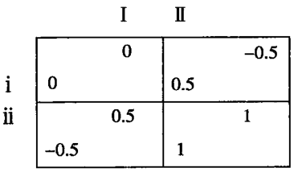

  在假设的第二部分中，选手R可能袭击目标Pr，选手C可能袭击
目标Pc。当二者能够（应该）选择非进攻战略时，他们可能进攻这些
目标，即他们的决策违背了我们的第一个假设。这正验证了选手可能在
他“不应该”的时候发动进攻。正如这一变量代表的：选手出现非理性
的可能性；或收益矩阵自身出现缺陷的可能性：或选手选择单方面突袭
的可能性；或选手出现决策失误，意外调兵遣将发起进攻。在我们的决
策模型中，选手的变量参数都来自于外界：外界因素产生的数据，而不
是两名选手自身创造的。

  假设选手双方对Pr和Pc两个变量十分清楚，在他们之间不存在什
么秘密或猜测，那么，这一假设似乎有助于我们解决问题，但是事实并
非如此。这两个外界因素导致的袭击行为，表明了双方在现实中可能进
攻的目标。问题在于经验，即存在不确定因素的情况下，双方的预期互
动是否会产生新的袭击动机。因此，我们至少应该在游戏中设置预期判
断和猜测可能需要的变量参数。将随机导入因素控制在最低水平内的惟
一方式，是促使双方选手意识到这两个变量的存在；否则，我们必须把
他们对两个变量的猜测表述清楚，如一方将猜测对方对两个变量的猜
测，或一方猜测对方如何猜测自己对两个变量的猜测等。我们必须再次
得出特殊情况的无限排序，即概率分布的格局这一难题。划清界线或划
分双方对突袭担心的惟一方式是，使基本的不确定因素成为双方记录的
问题。我们希望得到的结论是，不确定因素的“客观”源是否是双方主
观恐惧的“上层建筑”（superstructure）。

  现在，我们面临的情况看起来似乎产生了我们所说的自卫情景。第
一个选手必须考虑对方袭击的可能性，以及对方是否也像自己一样担心
袭击。甚至是完全没有进攻意图的一方，也必须考虑到对方可能非理性
地或出于过分担心遭受袭击而先发制人，首先发动进攻，看起来我们似
乎得到了一个动机综合体。

  但是，实际情况并非如此。我们并没有得到期望的任何常规乘数效
应。双方发动袭击的可能性并没有增加袭击产生的几率，除非他们坚持
一定发动袭击。尽管博弈源于双方对彼此发动袭击的无限可能性，但是
博弈的结果是，双方对袭击的担心并没有增加袭击出现的可能性，出现
同时进攻或者彻底消除突袭的可能性，即双方同时决策或者没有任何可
能性。

  在解决问题的过程中，我们借用了两个变量表示非理性袭击出现的
概率，用于检验上面的矩阵结果。矩阵中的左上格数字仍然不变，右下
格的收益被重新验算，作为4个格的平均值。结果，如果双方都选择不
突袭，那么，最后的可能性结果是（1-Pc）（1-Pr），即没有袭击出现；
如果结果是Pr（1-Pc），那么，R可能发动进攻，而C不会；如果结果
是Pc（1-Pr），那么，C可能发动进攻，而R不会；如果结果为 PrPc，
那么双方都有可能发动进攻。同样，左下格的结果是左列结果的平均
值，因为如果C选择进攻，他一定会发动进攻；然而，如果R选择不
进攻，那么当结果是Pr时，他可能选择进攻；但是当结果是（1-Pr）
时，他也可能不进攻。那么，既然双方的非理性袭击系数均为0.2，我
们上面的矩形将得到一个新矩阵，如图9-2所示。[^9-2b]如果C的非理性袭
击系数为0.8，R的袭击系数为0.2，那么我们将得到矩阵图9-3。如果
双方的非理性袭击系数为0.8，那么我们将得到图9-4。

[^9-2b]: 实际上，我们认为选手是在“完全战略”和含有自变量的“混合战略”中做出选择——根据博弈的说法。（当然，他们可以进一步将完全战略和混合战略结合在一起，但是这里他们没有理由这么做。）

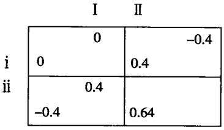

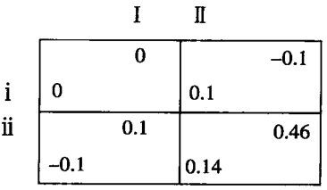

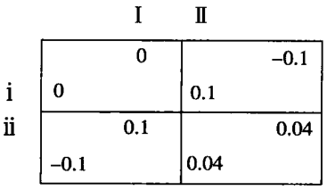

  在第一个矩阵图中，双方出现非理性袭击的可能性——即双方的袭
击系数均为0.2——是无伤大雅的，至少就战略选择而言如此。它们产
生了一个新的收益矩阵，在该矩阵右下格存在一个“明确的解决方案”。
鉴于无法回避这两种情况，所以，双方在游戏中的收益将得到相应的减
少。但是，两个因素的存在也阻止了双方采取进攻行为。深入考虑这两
个因素的选手都意识到，通过前面假设情形中选择的那个战略，在二者
之间仍然存在和平的可能性。

  最后一个新矩阵中，每一方的进攻系数均为0.8。尽管双方行为存
在对称性，但是这并不妨碍双方间存在不稳定因素。每一方都有可能发
起对对方的进攻，而不是主动避免战争。双方都知道对方也会这么做。
如同博弈论中“囚徒困境”现象一样，这是一个普遍存在的现象。如果
强制性协议在机制上具有可行性，以及游戏允许双方利用最后的机会达
成一个类似的强制性协议，[^9-3]那么，这个强制性协议将是双方避免战争
的惟一有效方式。（尽管如此，双方在游戏中的收益都将减少0.04）。

  在第二个新矩阵中，尽管双方之间不存在对称性与否的问题，但是
双方间还是存在不稳定因素。C的非理性可能导致R出于自卫而先发制
人，首先进攻。C也可能出于相同的想法而采取同样的行动。[^9-4]

[^9-3]: 博弈论中的“囚徒困境”主要涉及影响选手双方战略选择的结果格局——在缺乏强制协约的情况下。这个术语来源于两名被分别审讯的囚徒问题。这两个因徒要么取得一致口径，争取得到较轻的惩罚；要么一方率先招供，争取宽大处理被释放，而另一方则被从严处理。详情请参阅卢斯和雷夫案例，Pp.94f。

[^9-4]: 如果我们假设Pr的值为0.2，Pc的值为0.6，那么，我们得到一个略微不同，但十分有趣的场景。修改后的矩阵（仅供R参考）如下所示：
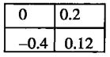 
R依然掌握进攻“战略的主动权”，即不管C采取何种行为，主动进攻为R最有利。但是与图9-1场景不同的是，这里如果双方都不选择进攻战略，那么R将处于不利境地。C知道R的战略主动权可能导致双方得到0。代表C的“非理性”的Pc使R出于自卫不得不选择进攻，而且其中一自卫动机“不纯”——也会促使R发动突袭，从而赢得主动权，避免坐以待。假设R在无法对C发动突袭的情况下强行进行突袭，那么，他在原有矩阵右上格的结果为0，面不是0.5，表示R的收益矩阵修改后如下所示：
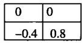
尽管右列的两个结果对R都不利，但是相对而言，上面的结果略优于下面的结果。如果情况如此，那么R将取消进攻C的动机，C也知道这一情况，则双方的结果将是和平共处。不仅非理性选手的无法进攻对选手双方有利，而且“受害者”的无法“自卫”也有利于双方。这一情景能够以变量表示为下面的公式：
1-h < Pc < 1/(1+h)
这一结论可以被广泛地应用到其他场景。假设h表示赢得战争得到的回报，且h大于1。假设情况如此，而且进攻总是制胜战略，那么，当对方无法进攻时，双方的首要战略选择均为“主动进攻”。当双方为了得到更大的收益而采取逃避现实的策略时，双方的收益均为0。现在，我们假设Q表示突袭并取胜的可能性，那么，单方面突所得到的预期收益只能为Qh。如果Qh小于1，那么，我们得到的矩阵是双方的最佳选择——和平共处。如果存在“非理性”进攻的可能性，那么当 Pc小于（1-Qch）以及 Pr小于（1-Qrh）时，博弈场景最稳定。假设Pc和Qc满足其中第一个条件，则满足第二条件对R和C都有利。如果Pr不在考虑范围之内，那么，R则希望Qr（代表R突袭C的能力）不小于（1-Pr）/h。只有这样，R和C的收益才能大于0。如果R能够为对方升级预警系统提供资助或者以显著方式削弱自己的进攻能力，从而使Qr的值控制在范围之内，R也能够达到上面的目的。这一原则同样适用于被此不信任的二人选手——双方将各自的伽锁扣在对方的头上。如果一方无法提供枷锁，那么，对方将主动提供自己的枷锁。只有这样，双方才能实现双赢。
下面是一个表示非对称性博弈场景的更普遍公式。公式中的R11、R12、R2和R2分别代表R在行1列1和行1列2中的结果，依此类推。公式的分子表示在错误的时机发动进攻所付出的代价；而分母则表示错失进攻良机所付出的代价。二者的标准相同，或许表现为P和（1-P）为肯定概率而非二者偏离概率，而且符合“理性”行为标准。
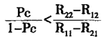


  由于Pr和Pc的取值超过一定限度，将导致双方之间存在不稳定因
素，并引发战争，因此二者的取值极限必须为：

```
        Pc<1-hr
        Pr<1-hc
```

  假设h表示选手一方单方面获得的收益；-h表示遭受袭击而没有
采取反击的一方选手的损失；当双方同时发起进攻时，二者的收益均为
0；当双方能够避免战争时，二者的收效均为1。)

  图9-5表明了选手双方在游戏中的收益分配和每个战略选择具有的
价值，即P在0～1.0之间移动。假设Pr的取值为0.2，那么游戏形势将
对C不利（与图9-1相比）。在这种情况下，C和R的收效如图所示。
当Pc 的取值为0.5时，双方的关系将十分紧张，二者收益均为零。

  当Pc和Pr的取值不等时，我们完全可以忽略取值较小的变量。但
这并不表明，游戏完全不符合“混合概率”（compounded probability）
这一宗旨。如果二者都低于关键点，那么，它们的取值将没有任何意
义；反之，如果二者之一的取值高于关键点，另一个取值是0或1.0也
同样没有意义。当超出某个极限时，它们仍然有效，意味着双方可能引
发一场战争。因为，二者导致选手双方的战略选择从和平战略转向了进
攻战略。导致战争爆发的因素则可能来自于外界，也可能是选手的主观
因素。

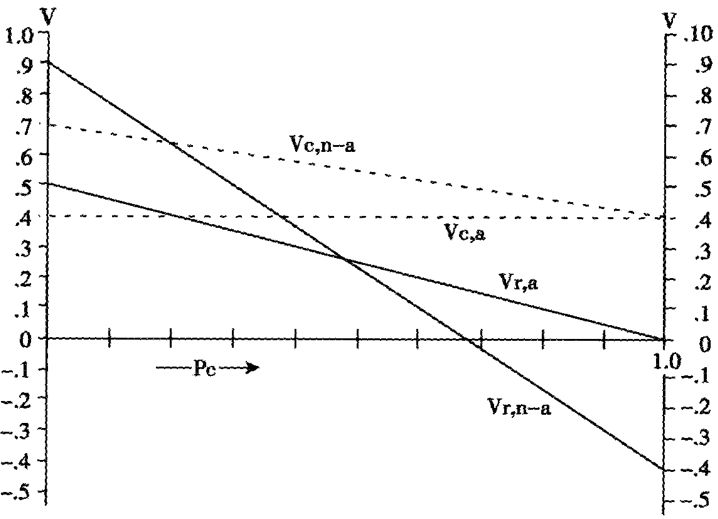

  Pc的取值决定了 R 和 C 在游戏中的收益：Pr=0.2。Vr，n-a ［=0.9～1.3Pc]：双
方维持和平时，R在游戏中的收益；Vr，a [=0.5～0.5Pc]：C选择不进攻，R进攻所
得的收益；Vc，n-a [=0.7~0.3Pc]；双方维持和平时，C在游戏中的收益；Vc，a
=0.4]；R选择不进攻时，C进攻所得的收益。

  如果我们假设选手轮番选择，这并不影响我们得到同样的结论。假
设R拥有选择进攻和不进攻的自由，而C则必须坐以待毙，那么，只
有当有机会做出选择并付诸实施，却没有发动进攻时，C才能采取进
攻行为。现在，我们进一步假设在R做出选择之前，C拥有首先选择
权。在C选择之后，R做出选择，最后是C做出选择。然后，我们再给
R-个优先选择权。当然，R也可以首先选择，然后C做出选择，接着
R做出选择，最后是C做出选择。（依此类推，直到有一方采取进攻行
为为止。)

  那么博弈结果如何呢？如果是在图9一1中，在做出最后次选择
时，C将不会选择进攻；但是，如果C在此选择了进攻，那么他可能得
到变量Pc。在做出最后一次选择时，R知道C会选择进攻，所以，事
先针对Pc制定了相对对策。在做出上一次选择时，C知道R将做出什
么选择，所以，针对Pr做出了自己的对策。以此之前，R预测到了C
在未来的两个选择中可能选择进攻，所以针对1-(1-Pc)^2事先做好了
准备。依此类推，如果双方都有无穷次选择的机会，分别有Pc或Pr个
概率对对方进行非理性攻击，结果将取决于 Pc=1-(1-Pc)^n 和 Pr=1-
(1-Pr)^(n-1)是否满足前面推理的条件。如果情况果真如此，选手双方都
知道对方下一步不会选择进攻，那么，自己也不会主动进攻。但是如果
P的取值大于某一方可以承受的程度，那么，他可能倾向于发起进攻，
对方也会知道这一点。结果，无论谁首先做出选择，都会首先选择立即
进攻。

  换句话说，虽然我们将双方的预期判断进行了综合组合，但是我们
取得了最大最小效果。而且，我们在组合过程中也没有要求双方选手必
须将各自的非理性变量结合起来，因为两个或至少一个变量的取值和游
戏的时间已经足以满足第一个选手发动进攻，或者双方保持和平共处。
如果我们假设所有非理性变量不受轮次的影响，而且以1-(1-P)^(1/n)表
示每轮的变量，那么，这些组合变量将为Pr和Pc，游戏的结果则不受
轮次的影响。如果我们将这个游戏看做是“他认为我认为”情景，每一
轮选择都代表每一轮的怀疑过程，那么，我们将得到一个新模型。在这
个模型中，双方依旧持续不断地相互怀疑，或者为各自选择进攻提供
“客观”条件，或者双方都放弃进攻。

## 重温旧题

  现在，我们发现前面提到的小偷案例具有同样的道理。如果小偷能
按照我们上面的假设采取理智行为，那么，他一能够意识到我可能优
先选择向他开枪；同时，他也一定能够意识到，我可能认为他会优先选
择向我开枪而首先向他开枪。但是，假设我们事先知道这两个基本（外
在）“可能”将是什么行为，那么，我们就不需要采取过激行为。这两
个“可能”中的任何一个都足以令双方或至少是一方先发制人，导致双
方都选择进攻，从而任何更多担心都显得多此一举；或者二者都不足以
令我们中的一方为了自卫而首先开枪，我们知道这一点。因而除了这
两个“可能”之外，我们没有必要担心其他因素。如果我们都意识到，
对彼此首先开枪的担心并不足以令双方首先开枪，那么，我们就能意
识到双方都没有必要担心对方的自卫举动，也不需要担心对方会担心，
等等。[^9-5]

  但是，如果我是出于紧张走火而非故意开枪，则情形将大不一样。
假设我的紧张程度取决于我害怕的程度，而我的害怕程度取决于我担心
对方会首先开枪：假设对方这是同样情况，那么，当我想到对方会优先
选择向我开枪时，我就会发紧张，结果我越有可能向对方开枪，尽管
这不是我的本意。对方看到我的紧张，他也会变得紧张；对方的紧张反
之又令我更加紧张，我更有可能向对方开枪。对方看到我更加紧张，他
自己也会更加紧张；他的紧张又反过来加剧了我的紧张程度，结果我愈
加可能向对方开枪。现在，我们可以把一方的紧张看做是对方紧张的结
果，而且得到了两个同时进行的微分方程。这两个微分方程产生了一个
特殊现象，而这正是我们所要分析的。[^9-6]

[^9-5]: 例如，双方能够进行沟通并不断地交换意见，他们就会达成非正式的共识，选择不开枪，那么也就不存在欺骗的动机——假设双方知道被此的基本参数。

[^9-6]: 在这里描述的问题当中存在一个重要的非对称现象。我们允许双方在不应该的时候首先开枪，双方也知道这一规则——在“恐惧”状态中；但与此同时，我们不允许选手错失开枪的良机，双方同样知道这一规则。（当然，也可能存在小偷的弹药进水或忘记上膛的可能性。或许我仅知道这只是个意外，对方也可能知道我知道这一点，等等。）这一可能性很显然能够促使双方保持冷静，减少双方开枪的可能性以及意外走火或非理性开枪的可能性。

  之所以会出现这种情况，主要原因是我们设计的模型没有涉及决策
的标准问题，即没有涉及一个能够告诉我们双方战略选择的行为假设。
相反，我们的“紧张模型”（nervousness model）表明，当人们担心自
己可能遭受进攻时，通常以先发制人达到自卫。我们能否仅以这种方
式，即通过研究选手的决策概率而非决策规则——并非在选手可以完全
选择并制定自己战略的模型中——得到我在本章开始时描述的现象。

  现在，这是否意味着决策果断的理性选手不能演绎我们的假设场景
呢？鉴于一个理性人也可能出现紧张，我们能否预测到选手采取史无前
例的行为应对复杂变化的环境或新信息？在这种情况下，我们的理论将
涉及心理因素而非智力因素。但是，我们能否假设一个理性博弈选手看
到前面提到的小偷时，将调整其转轮的设置？[^9-7]

  当然，个体决策与集体决策在这方面存在很大差异。尽管不同的成
员具有不同的价值观，对来自外界的突袭采取不同的反应，但是我们可
以通过选举实现集体决策。由此可见，赞成进攻的投票数取决于未来受
到攻击的几率。假设投票数还依赖于一些偶然因素，如：选举当日的缺
席人数；倾向于进攻的有关当局日益受到对方发动进攻的概率的影响，
反过来，前者的集体决策也逐渐增加对后者的影响。因此，如果我们假
设存在一个具有选举机制和不同价值观的集体选手，那么，我们就能创
造一个理性选手参与的博弈场景。

  此外，我们还可以以另一种方式调整这一模型，使之适用于一个决
策果断的理性选手。就伙伴问题和突袭问题而言，这一模型可能具有相
当普遍的代表性，而且涉及了实际军事突袭问题最核心的部分，即决策
对不完全预警系统的依赖以及在决策过程中出现“1类”和“2类”错
误的概率。

## 不完全预警系统产生的随机行为

  尽管预警体系的应用可以有效地降低遭受袭击的危险，但是预警系
统也可能出现差错：预期警方系统可能使我们误把敌人的战机当做海
鸥，从而错失防御良机；或者，预期警方系统可能使我们把海鸥当做敌
人的战机，促使我们对敌人发动意外攻击。当然，如果我们肯投入巨额
资金和精力用于改进预警系统，那么，我们或许能够避免出现上面两个
失误。但是，就固定有限的预算资金而言，决策的标准往往是一方面的
投入增加必须以牺牲另一方面的投入为基础，结果导致一个失误消失，
另一个失误却愈演愈烈。在采取报复之前要求减少有关对方发动进攻的
证据，无异于要求把对方的战机当做海鸥而撤回自己的战机。

[^9-7]: 诸注意混合战略的一般规律—一理性地调整某一方的决策转轮一与这里讨论的场景没
有关系。

  但是，我们现在为理性决策者建构了一个模型。在这个模型中，理
性决策者不必做出明确的决策，采取某种具体行动或放弃反击以应对对
手的潜在进攻，而是通过调整自己发动错误进攻的可能性事应对。提高
预警系统的决策标准，降低决策失误的概率无疑有助于加强应对潜在进
攻的防御能力，但是也提高了导致报复行动的假警报的概率。如果双方
都以提高自己的意外进攻能力来应对日益严重的突袭，那么，一方发动
进攻的可能性则来自于对方发动突袭的可能性。[^9-8]这样一个预警系统无
疑将是小偷场景的理性、机械翻版。

[^9-8]: 正如以后所涉及的，并不一定需要出现这样的现象。假使受到爱击的危险性不断增加与对方突袭能力的减弱有关，则一方完全可以按照本文描述的相反原则做出反应。

  在这个对称性模型中（为了易于操作，我们建立的模型具有对称
性），我们假设h代表赢得战争的收益，-h表示输掉战争的损失，0代
表双方同时进攻时的预期收益（赢输概率均为50%），1.0表示维护和
平的收益。［这里，我们允许h的值大于1，只要（1-R）h在收益矩
阵中的值小于1。但是，如果胜利者付出极大代价而获得胜利，那么h
的值将相应减少。]我们假设突袭成功的一方赢得最终胜利的可能性非
常大——突袭成功意味着在对方没有进攻时，一方发动突然袭击；或
者突袭没有被对方的预警系统发现。R代表双方预警系统的性能，即
能够准确预期判断对方的进攻，并以先发制人的方法进行防御。收益
矩阵如图9-6所示：

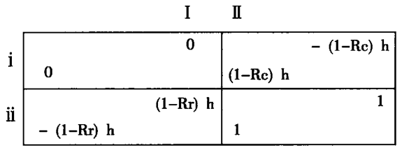

  即使理性思维反对发动进攻，选手也可能发动袭击，即存在在不应
该的时刻发动袭击的可能性。这种可能性包括两个部分：一部分以A
表示，非理性进攻来自外界因素的可能性，并排除了假警报引起进攻
的可能性；假警报可能引起的进攻以B表示。因此预警系统可能导致
的两个错误分别以B和（1-R）表示；模型的主要特点为B=f（R），f'
（R）> 0。这样一来，我们在降低了（1-R）的错误概率的同时，反而提
高了B的错误概率，反之亦然。

  B和R的值影响了双方的战略选择，因为前者能够将后者的损失最
小化，即将其收益最大化。假设Vr代表R在游戏中的预期收益，R的
预警系统问题在于必须按照B=f（R）选择B和R的值，最大值为：[^9-9]

[^9-9]: 之所以如此假设，是为了易于说明假警报导致的意外袭击与有预谋的人为进攻没有区别，同样能够达到突袭的效果。尽管我们忽略了可能被想当然地认为是单位时间内出现假警报的概率的时间因素B，但是（1-R）依然可以表示进攻的错误概率，A或许也存在相关因素。鉴于此，我们在这里假设了时间因素的存在。

```
    Vr=(1-Pc)(1-Pr)+Pr(1-Pc)h(1-Pc)
        -Pc(1-Pr)h(1-Pr)
      =(1-Ac)(1-Bc)(1-Ar)(1-Br)
        +(Ar+Br-ArBr)(1-Ac)(1-Bc)h(1-Rc)
        -(Ac+Bc-AcBc)(1-Ar)(1-Br)h(1-Rr)
```

  除此之外，根据前面的矩阵分析，R应该检验调整后的收益矩阵，
以证实和平共处是否仍是双方的最佳选择，因为这一矩阵来源于Rr和
Br 的“最佳”值以及Rc 和Bc的预期最佳值（观察到的值）。实现和平
共处和改进预警系统的条件是：
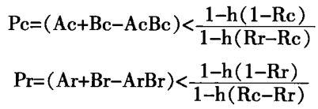
由于对称性的原因，右边的分母趋向1。

  实际上，正如下面所要看到的，第二次复审根本没有必要。在某些
行为假设中，R和B的“最佳”变化（取任何小于R=1的值）都要求
必须满足保持修改后的矩阵稳定的条件。

  我们需要进一步详细说明选手的实际行为。广而言之，针对“参变
行为”（parametric behavior）、“默式博弈”和“谈判博弈”的区别，
我们可以进行3个假设。

## 参变行为

  首先，我们假设双方都将遭受对方进攻的可能性看做是一个参数，
而非表示损失的变量，同样也将对方的预警系统看做是一个参数。这意
味着一方可以直观地看到自己的R和B的值，并主动为R和B选择最
佳值以最大限度减少自己可能遭受的损失。这一假设可能会使双方的选
择B成为对方进攻几率的上升函数。（这一假设只存在“可能”，而非
一定，因为另一个选择R也可能增加动机函数，从而抵消B的作用。
下面将会涉及这一问题。）如果我们假设两个选手一直根据遭受袭击的
参数不断地变化自己的B和R的值，并密切关注对方的B和R的值的
变化，但是双方都没有将对方的行为参数作为自己的函数。那么，我们
就得到了一个动态“乘数”系统——保持稳定还是变化剧增取决于参数
的取值和？函数的状态。我们可以取双方的B的最佳值作为对方的函
数，从而通过解下面的两个等式推导出平衡状态的稳定条件。我们同时
计算与双方的B和R的变化有关的“乘数”在f 函数的范围内移动或在
A参数的范围内变换。

  简单地说，为了使选手R找到一个适合的“参变行为”函数，我
们使Vr 随 Rr而最大化，同时 Br=f（Rr），Bc 和 Rc保持不变。Vr的公
式表达为：
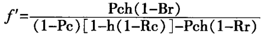
同时，h（1-Rc）< 1 > h（1-Rr)，f">0。

  由于我们假设f'为正数，分母也必须为正数。如果R<1，Vr可以得
到最大值：但是条件是Pc必须满足分母为正数的这一条件，只有这样
R才会优先考虑和平共处。如果R<1时，双方都能做出最佳调整，调
整后的B和R值必须满足和平共处的条件。

  在这个行为假设中，Br和Bc的关系——产生R的B最佳值的结果
函数的斜率——可以通过调整上面等式两边的项得到：

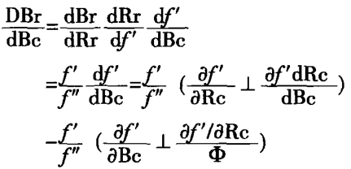

  Bc=Φ（Rc）表示选手C的相应函数。

  鉴于af'/aRc是负数，取值更小的Φ可能使选手R的dBr/dBc为负
数。但是，提高意外袭击的代价足以抵消遭受进攻的可能性。换句话
说，Br 并非仅仅是Bc 的函数，也是Φ（Bc）的函数；Br 可能随着Bc
的增大而增大，随着Rc 的增大而减小，而且随着Rc和Bc 的增大会逐
渐脱离 Bc 轴。

  一个稳定的平衡状态要求，选手R的dBr/dBc和选手C的dBc/dBr
得到的值必须小于1，即以垂直线上的Br和水平线上的Bc为两点，C
的抛物线应该与R的抛物线的下端部分相交。将B和R的变化与函数
的变化联系起来（或与A的值的变化）的整体“乘数”表达式包括1
减去分母中的结果。

  正如前面提到的，表达式f'的分母消失了，结果Rr和Br以及f'的
值迅速增大，h的值逐渐满足矩阵不稳定的条件。（实际上，矩阵博弈
的稳定与参变行为平衡状态的稳定不同。前者与参变行为假设存在联
系；预期矩阵收益和预期判断对方行为则是为了说明对方的行为，而不
是为了关注或想方设法适应后者。）

  我们必须注意到选手R有可能在其考虑过程中忽视Ar。Ar跨出公
式是为了使Br和Rr取得最佳值，因为Rr或Br的值能够出现差异的条
件是选手R无法进行“非理性”袭击。如果R发起了非理性进攻，B
和R的值将对其没有影响。（然而，Ar确实能对矩阵的稳定性产生影
响，因为 Ar成为 Pr 必须满足的条件。因此，为了说明C的变化，R不
得不考虑Ar的作用。但是，仅仅说明C的变化，而不连续关注Bc和
Rc，将使R的行为非参变化，这将与现有的假设相矛盾。如果R考虑
增加投入用于改善自己的预警系统，那么Ar将对R的决策产生影响，
因为它将导致系统产生其他结果。这一考虑显然已经超出了现有的模型
范畴。)

## 默式博弈

  现在我们进行另一个行为假设，并将产生与前面同样的结论。这
里，我们不假设双方能够看到对方如何变化R和B的值，并做出相当
的选择。现在，我们假设双方都知道对方的技术机会（technological op
portunities）——R与B对另一方的函数关系——但是无法知道对方是
如何变化B和R的值。这意味着双方都知道对方的预警系统的运行机
制，但是无法确定对方的预警系统如何按照其指令处理传入的信息——
即对方的决策规则。这个假设为我们提供了一个非合作博弈场景。一方
必须在知道对方的收益矩阵，而不知道其选择值的情况下，确定B的值
(或R的值)。

  在这种情况下，我们得到一个具有典型“平衡点”的收益矩阵，即
参变行为假设产生的一个稳定平衡状态。[^9-10]换言之，参变行为假设中的
解决方案仍然可以被称为非合作博弈的解决方案。（在两种情况下，平
衡点不具有惟一性。如果不是惟一的话，第一个假设使结果取决于初始
条件和“突袭”；第二个假设则更趋向于将明确解决战略方案的智力问
题复杂化。）

  当然，这一解决方案无法满足选手双方的要求。这是我们前面提
到的“囚徒困境”的典型。双方不断增加B的值无疑增加了互相进攻
的可能性。[^9-11]B显然还存在一个对双方都有利的更小值。假设双方人
为发动突袭的概率相同（双方A的值相同），那么，双方之间就消除
预警系统（消除假报警的可能性）达成一个协议，无疑是二者的上乘
选择，如果他们受到限制必须拥有同样的预警系统的话。[^9-12]

[^9-10]: 博弈论中平衡点是指选手双方做出的一对战略选择，一方的战略选择与另一方对应的战
略选择搭配时才能发挥最大作用。（对方选手双方而言，或许存在数对平衡点。）

[^9-11]: 经济学家们或许从两个生产商那里发现了一个经济现象。这两个生产商合理分配双方有
限的生产资源用于两种产品的生产。一种产品是涉及外在节约因素的“防假警报安全”，一种
是涉及外部不经济的“防突袭安全”。

[^9-12]: 假设A's、B's和 R's的值相等，那么Vr和Vc等于(1-P)^2，其中最大值为B等于0。（如果B的最小值大于0，则取决于A的值。）如果B's和R's相等，但是不等于A’s，那么
```
dVr/dB=-2(1-B)(1-Ac)(1-Ar)+(Ac-Ar)(h/f')
```
可以为正数，其中Ac大于Ar和f'。在这种情况下，选手一方——拥有小A的一方——更倾向于依赖某种预警系统，尽管与没有时相比，双方都倾向于使用预警系统。但是与参变行为棋比，这使B和R的值相对减小。尤其是当上面公式的结果为0以及把f公式与相应的参变行为的结果相比时，这一现象更加明显。

## 谈判博弈

  如果我们考虑到双方能够以谈判消除预警系统的消极因素，为了共
同利益牺牲较小的R来实现B值的减小，而且这样的协议也具有现实
可行性，那么，我们完全可通过谈判框架具体化推导出一个惟一的解决
方案。假设解决方案和博弈场景具有对称性，即双方就共同的问题
R和B的值进行谈判，谈判的结果是B和R均为0，双方之间根本
不会存在所谓的预警系统，因为如果双方的预警系统相同，那么双方进
行突袭的初始可能性将存在重大差别（在Ar和Ac之间）。超过这一点，
一方将为消除预警系统协议付出代价。

  但是，一般而言，这会演变为一个内容广泛的谈判问题，甚至将比
现在的公式涉及的内容更广泛，因为双方可能不仅仅要思考如何变化R
和B的值，而且还可能以直接进攻威胁对方或者通过机制安排决定A
的值。

  尽管双方为了共同利益就降低B和R的值达成协议，但是在具体
执行过程中会遇到很多困难，因为一方可能无法得知对方确定的R值
和B值。他们需要——至少在非常重要的程度上——协调未来决策的标
准，不单单是一个摸得着、看得见的预警系统。他们需要知道，双方在
紧急事态中需要多长时间才能“确定”并能够承担多大程度的风险。假
设模型代表的是一场全面战争而非边界蓝图或一方对另一方的小规模进
犯，那么，一旦协议失败，并导致某种后果，如战争，那么反责和损坏
赔偿诉讼一定会在双方之间发生。

  情况也可能是R=B=0本质上能够被觉察——不存在任何物理形式
的系统。即使有效的强制性系统可能不存在，如果R=0时矩阵不稳定
（当 h>1时），那么，以B形式存在的一些风险因素足以将R置于安全
范围，即h（1-R）小于1。

  对双方而言，达成一个二者都承认A的协议也并非易事，因为承
认对方的A大于0在政治层面很难实现。

  鉴于此，选手双方不得不倾向于此前明显削弱二者突袭能力或者说
改善双方的转换抛物线R为（1-B）的安排。例如，双方达成共识，投
入更多资金用于改善预警系统的性能；或者实力相对较强的一方可能为
对方提供人力和物力的帮助。这样就避免了一方对来自对方的袭击的担
心，以及另一方遭受假警报的困扰。选手双方更有可能就优化双方的兵
种结构达成某种协议，因为这样不仅可以消除潜在的突袭，而且提高了
彼此军事力量的透明度，从而能够有效地防止来自对方的突然袭击。对
双方来说，他们不需要将R和B作为协议的一部分；相反，由于R和
B的隐蔽性影响了函数f和Φ，选手双方必须考虑这些函数都涉及各自
的预警系统以及对方的进攻力量。（但是，我们必须注意到预警系
统——在R值一定的条件下，函数f 和Φ的值随着 B值的减小而波动，
反之亦然——性能的“提升”只是在某些情况下才能保持平衡。R的边
际成本的提高导致B值的增大，双方可能共同意识到提升预警系统性能
的必要性，这如同“发展”了“因徒困境”矩阵，即提高双方的非合作
战略选择的收益。）

  谈判博弈公式化将我们引入了对谈判策略的分析。例如，假设一方采
取参变行为，对方知道后也将考虑这一因素，那么第一方会设置一个
“反应函数”（reaction function）V并引入到对方的公式中，成为对方
试图最大化的函数。一般而言，本书第2、5、7章中所论述的诸如对
“战略行为”的研究与突袭、伙伴原则博弈有着密切联系。

## 多人博弈

  我们上面探讨的博弈场景大多涉及两名选手，即：二人博弈。但
是，当参加博弈的选手不断增加或存在第三方选手作为独立实体被引
博弈场景时，我们的研究对象将出现一个有趣的新变量。某种程度
上，选手双方不仅需要考虑来自于对方的袭击，还必须考虑和预防来
自第三者的进攻。这样一来，双方在二人博弈中消除预警系统的积极
性和信心无疑受到了严重打击。毫无疑问，在一个人数更多，规模更
大的博弈场景中，任何两个选手都会发现共同改进彼此的预警系统，
降低警报失误的概率对自己来说都是利大于弊，因为二者均考虑到了
他们采取参变行为时所忽略的“外部管理失当”（external disec
onomies）因素。例如在下面的场景中，两名全副武装的保卫人员同时
在同一栋建筑内巡逻，二人随时会向自己看到的可疑物体开枪，其中
当然包括对方，那么二者如何才能避免误伤自己人昵？为了避免此类
事情发生，双方最好达成某个强制性协议，规定双方必须弄清可疑物
体后方可开枪，只有这样才能降低误伤发生的几率。（实际上，假设
我们将前面模型中的Pc和Pr分别表示一人在黑暗中遇到小偷的概率，
而非两个巡逻人员，那么，二人巡逻场景将是我们前面提到的模型在
现实中的翻版。为了增加博弈场景的复杂性，我们必须为小偷的行为
引入相关参数——让小偷作为一个理智的第三方出现在场景中，并努
力预测双方的决策选择。[^9-13]

[^9-13]: 澳大利亚国立大学的亚瑟·李·伯恩斯（Arthur Lee Burms）探讨了有关三人或多人博弈场景。当明显的歧义行为被引入到相互猜疑的行为模式中时，由于受到第三方的恶意挑拨，往往在其他两名选手之间发生人为战争。特别是当一方出于技术原因或共同监督，认为预警系统有利于一个或两个核心选手监督另外一方的雷达时，这一分析得到更有价值的结果。详情请参阅伯恩斯的“催化战原理”【“Rationale of Catalytic War”，（Center of International Studies, Resareh Memorandum No.3;Princeton University, 1959) ].


