        附录

        附录A 核武器与有限战争
        附录B 博弈论的非对称性
        附录C 重释“非合作”博弈的决策理念

# 附录A 核武器与有限战争

  随着更小规模和更小杀伤性的核武器不断涌现，并被装备适中的地
面部队应用到有限战争中，以及深水炸弹和适用于空战的核导弹
的发展，衡量核武器的传统标准已经失去了现实意义，例如在有限战争
中将核武器与常规武器区别对待。当然，也有人认为在有限战争中使用
核武器将使我们在政治上置于不利地位，特别是当我们首先使用核武器
时。甚至那些认为核武器造成的人员伤亡如同凝固汽油弹的作用一样具
有道德优势的人，也不得不考虑到全世界反对使用核武器这一政治现实。

  附录A将主要讨论如何区别核武器和其他武器，因为这涉及到我
们在有限战争过程中如何处理同敌人的关系。为了实现战争的有限化或
者更好地理解有限战争的含义，我们有必要认清核武器与其他武器之间
的界限，尽管这并非现实界限而只是心理感知、墨守法规的暗示性界
限。有人仅仅基于对武器性能的分析而非有限过程——即寻求有限战争
的有限条件、影响这些条件稳定的因素、这些条件权威性的根源以及选
手达成这些条件共识的环境和行为模式等——的分析，想当然地认为这
些高度精确的小型核武器是火炮武器的一种，因为完全可以被应用到有
限战争中。认为小型核武器“仅仅是另类武器”的观点依据是，假设衡
量区别核武器和其他武器的标准中没有武器性能一说，那么，就根本不
存在支持上述有限过程的依据。

  现在，我们能否以同样的标准区别武器的合作者呢？前苏联人与中
国人之间的差别如同核武器与常规武器之间的差别。同样的情况还有中
国人和朝鲜人的区别；美国人和台湾人的区别；英国人和约旦人的区别
以及埃及人和阿尔及利亚人的区别。除此之外，前苏联和伊朗间的数百
公里边界线和其以南数百公里的边界线，以及鸭绿江上下游的边界线或
者希腊和南斯拉夫两端并没有很大的区别的边界线。尽管如此，除了偶
尔与此类似的横渡大河或测量高山的实际困难外，这些边界线在有限过
程中还是发挥着巨大作用。

  或许有人会说，这些都是“合法”标准，而且都是现实存在的，而
区别核武器和常规武器的标准却是抽象的。但是问题在于，这些标准实
际中并非真正合法，它们仅仅具有“合法性”，现实中并没有强制法律
机制强制有限战争方承认这些政治“边界”或者国籍。前苏联人绝不会
依法将进入其国界线看做是战争中质的变化——虽然是一个强烈行为。
但没有进入其国界；假设我们故意跨过鸭绿江，那么，中国人绝不会进
行合法报复（不仅仅是抵抗），他们绝不会放弃任何阻止侵犯的合法权
利，偶尔允许别人通过；如果前苏联飞行员参加了针对我们的有限战
争，那么，我们也绝不会依法承认这些前苏联飞行员，或者将近东进攻
我们的地面部队认为是“自愿者”；任何禁止私闯国界的行为或者一个
新国家卷入一场冲突的战略都意味着核武器的引入。敌人反应行为最
重要的一个决定因素是当敌人无法针对我们的间断行为进行有效反应或
者做出增量反应时，他如何释义自己默许的行为。

  假设在前苏联或中国附近发生战争，那么，导致前苏联或中国边界
成为分界线的重要因素通常是没有其他可行性的边界线。西方国家的军
队跨越前苏联边界无疑是挑战——主要是心理上的挑衅——前苏联领土
主权的完整性，以及表明或者至少暗示了进一步前进的意图，除非能够
发现边界内前苏联人能够容忍外人跨越的“显著”界线。这样的话，前
苏联人就知道我们跨越其边界的某个位置时表示我们没有扩大前进的企
图；我们也能够清楚，假使我们跨越了其边界，前苏联人能够容忍的程
度。而且，双方不仅都知道这一界线，而且都清楚没有其他地方可以作
为双方都默认的容忍界线。如果前苏联人允许外人适度地跨越其边界
线，并且没有采取相应的大规模报复行动，那么，这将意味着，前苏联
领土将成为导致战争爆发的诱饵。因此，政治边界通常成为停止前进的
有效界线，但这并非表明边界具有法律强制性。边界成为双方默许的显
著选择，是因为双方都期望寻求某种界线。而边界的独特惟一性使其担
当了这一角色。边界是双方可以在某个区域划分的，并以显著的地理界
线被双方接受的少数界线之一——或许是惟一一条界线，可以肯定的是
边界线至少是这些备选界线之一，因为双方都可以清楚地看到这条界
线。边界线具有明确的强制暗示作用，能够引起双方的共同关注，并否
认了其他任何界线性——在缺少其他可辨认的选择情况下。

  但是，政治边界或者国籍因素依然具有合法性，而且具有现实意
义，我们有必要考虑有限化过程中其他重要的划分标准。在印度支那战
争中，我们提供了大量的武器装备，但没有提供人力支援；在希腊的游
击战争中，我们向希腊政府提供了武器装备，指挥人员和咨询意见，但
是我们依然没有派驻美国军队。有人认为我们应该在印度支那战争中向
法国人和南越政府提供空中支援，这样就避免了派驻地面部队导致中国
人和前苏联人卷入的危险。

  一位经济学家认为——与前面那位认为高精确的小型核武器是一种
火炮的学者具有同样的说服力——军事装备和人力在军事行动中属于可
替代资源，空中干预与地面干预在实际中没有本质差别，军事人才对于
缺乏指挥人员和作战策略的军队而言犹如大腿肌肉一样重要。但是，有
关现代武器的使用功能的再定义以及军事保障的机动方式有效性的争议
表明，空地部队或海地部队的区别仅仅在于传统不同，除此之外没有其
他区别。尽管如此，其中最关键的问题就是传统因素在有限战争中所发
挥的作用。

  实际上，我们对有限战争的分析研究涉及的主要问题就是传统。在
研究过程中，我们主要分析先例、惯例以及暗示效果等因素。此外，我
们的研究还将涉及到习惯法理论——包括避免相互破坏行为需要集体制
裁以及个别制裁将导致规则的破坏，而规则的破坏将可能导致双方间有
限条件失去原有价值甚至荡然无存。更严重的是，这一切的后果将使国
际“权威”受到严重挑战，其他有效规则的权威性受到极大削弱。

  核武器之所以与众不同，是因为强大的传统观念认为核武器具有独
特的作用。我们没有禁止弓箭（尽管它们与核武器一样都能给人类带来
伤害）的原因在于，人们传统上已经习惯于使用弓箭，并共同认为弓箭
方便适用。然而，人们并没有使用核武器的传统。同时，人们传统上不
认同核武器的使用——尽管已经具备了使用核武器的能力，而且使用核
武器对自己有利，人们也一致认为现实中不应该便用它。

  传统和惯例并不是有限战争的简单模拟或其中奇特方面；相反，传
统和先例或惯例是有限性的本质。有限战争中的任何有限条件的根本特
征就是双方共同承认，并被赋予权威性的心理、智力或社会特征。这些
特征的权威性来源于双方相认可的完全认知“默式谈判”。某个有
限条件之所以赢得一定的权威，主要原因是双方都担心否定这个有限条
件后，无法找到其他合适的替代条件。有限条件暗含的基本原理是合法
的并充满诡辩色彩，但缺乏法律、道德和心理支持。这些有限条件或许
反映了合法的和心理的差别或者道德的差别。总之，这些有限条件说
明，一定存在某些因素赋予它们自身的独特性和本质特征，并且为双方
实现预期共识提供了依据。这个权威性存在于预期判断本身，而不存在
于预期判断涉及的客体对象。

  随着核武器的不断发展和改进，定义有限使用而非禁止使用核武器
的有限条件的可能性日益受到人们的质疑。但是不管怎样，人们逐渐认
识到，核武器的使用和效应存在等级性。但是，人们还是认为核武器不
存在使用方式的差别，如运载方式或打击目标等，结果，在外人看来似
乎自然不存在核武器有限使用的可能性。假设我们质问，如果愿意的
话，我们该如何确定核武器的使用规模、运载方式、使用条件以及打击
目标的有效性？答案是——从纯粹的技术角度——我们可以随心所欲地
划定界限。事实上并不存在强制规定某个特定点一定为分界点，其他点
则不能，或许这也正是很难发现分界线背后规律的重要原因；也不存在
所谓的核武器使用程度、规模和范围，这如同其他为双方提供预期关键
点的程度、规模和范围因素一样似是而非。合法的有限条件必须定性和
非持续性的，而非定量和持续性的。问题的焦点不是为了更容易判断违
规行为或强制双方的指挥官遵守协约，而是需要一个稳定的有限界线作
为暗示符号，一旦双方突破了这一有限界线，就很难再找到其他合适的
替代选择。

  有限条件通常出现于默式行为或谈判过程中这一现实，极大地增加
了具有独特性和惟一性的显著条件的必要性。这些条件通常在博弈双方
默不作声的斗争中实现，而不是出现在直率的沟通谈判中。但是，如果
双方必须在缺乏直接沟通的情况下进行“默式”谈判，那么，某个特定
界限必须能够在本质上区别于其他有限条件的连续统一体；否则双方都
无法确定对方能否与自己承认同一个界限。当没有其他自然、可行的
“显著”点或线帮助二者实现预期判断的共识时，只能以具有本质独特
性和惟一性的某个纬线、国际时刻线或北极充当这一角色。

  我们现在以核武器为例，通过下面的小游戏对上述观点进行检验。
这里，我们需要合作争取某个奖赏：首先，我们坐下来，在没有任何事
先约定的情况下，分别在纸上任意写出自己期望的核武器使用限度。这
些限度应该包括我们希望看到的有关参数——如武器的规模、使用方
式、使用者、使用频率、脏弹还是干净核弹、用于防御还是进攻、战术
使用还是战略运用、是否打击城市、是否预先通知对方——这样可以清
楚地看到我们所写的有限条件是否存在一致。如果我们所列的各项有限
条件非常吻合，那么我们都将获得奖励；反之，如果不同，大家都将空
手而归。通过这个合作获奖的小实验，我们可以清楚地看到大家能否在
默式条件下就限制条件达成共识以及一对那些努力协作达成共识的参
与者而言一大家在什么限制条件上存在分歧。我们允许参与者随心所
欲地做出选择，包括核武器的各种有限使用，甚至包括两个极端选择：
无限制地使用核武器和彻底拒绝使用核武器。

  通过上面的实验，我发现某些特定限制条件——简单、间断、定性
的“显著”限制条件——有助于选手做出同样的选择。同时，我推断那
些选择其他限制条件的选手很难找到或者根本找不到志同道合者。（鉴
于我们进行上述实验的初衷是实现合作，我们没有考虑被提议的有限条
件的其他作用。实验中，选手选择某个有限条件的主要依据是为了与其
他人选择同样的条件，并知道其他参与者进行同样的努力，只有这样大
家才能双赢）。

  尽管如此，我无法断言上述实验能够证明什么样的有限条件具有稳
定性和权威性。但是，实验表明有限条件的某些特征——特别是他们的
简单、惟一性、间断性、定性定义的质疑等——具有客观意义，至少说
明有限条件与默式谈判过程存在密切联系，同时，实验还表明某些有限
条件能够被博弈双方所期望的，成为达成共识的必要条件，并被双方承
认与其他选择在本质上存在差异。

  我们可以从上述讨论中得出一系列结论。首先，核武器与常规武器
存在与有限战争过程相关的显著区别。与此同时，我们能够通过一系列
手段强化或弱化、阐明或模糊这一区别。假设我们的言行严格符合传统
要求，那么，我们就能借此强化传统的作用，增强上述区别的符号意
义；反之，我们通过强调“核武器仅是另类武器”的观点以及背定核武
器的使用价值可以弱化这一区别——但是我们并不准备这么做。我们采
取哪一种外交政策完全取决于我们是否将核武器与常规武器的区别看做
是与前苏联人共享资源以及一个能够减少暴行的有效区别或传统——而
非麻烦事、宣传义务、外交障碍和阻碍我们果断行动和代表行使权力的
绊脚石。尽管如此，那些主张使用核武器以赢得优势和满足军事需要的
人必须承认核武器与常规武器存在质的区别。只有这样，我们才能采取
行动暂时消除这一区别。

  问题不在于亚洲的中立国或欧洲盟国是否认识到这一区别，而是我
们美国与前苏联两国如何处理相互间的关系——不管我们承认与否，美
苏之间的确存在某种程度的谅解。而且，问题的关键是前苏联人是否认
为我们与他们就限制使用核武器存在默契。为了实现战争的有限性，我
们期望前苏联人或者中国人不要把我们在区域战争中首先使用核武器，
看做是对限制使用核武器整体思想的挑战以及我们不受任何有关限制条
件的约束；我们应该使他们相信，我们首先使用核武器并非违背有限战
争的原则，以及我们仍然愿意与他们就有限条件的发现和承认存在默
契；此外，我们必须避免别人对我们首先使用核武器产生其他不必要的
释义。因此，如果正如我所分析的那样，假设核武器与常规武器的确存
在差异并与有限战争存在联系以及我们追求使用核武器的最大自由，那
么，我们应该竭尽全力破环或消除这一区别。（例如，在有些国家，特
别是发展中国家，大量掘土计划主张率先广泛地使用“核爆破”无疑有
效地削弱了核武器和常规武器的区别；类似的情况还有帮助发展中国家
为了实现同样目的训练部队，如何使用现有武器在核爆炸中生存。）相
反，假设我们愿意加强与对手的默契互谅，促使双方共同认识到核武器
仅仅是另类武器并制定相关的保留条款，那么，我们就必须达成有关的
暂停核试验条约（至少是对相关条约进行广泛讨论）。[^11-1]

  其次，一旦有限战争一方率先使用核武器，则相关的禁止使用核武
器的规定将荡然无存。我们很难想像，一旦核武器首先应用于战争后，
双方就核武器达成的默契能够再次在另一场有限战争中发挥强大作用。
因此，我们或许无法忽视核武器与常规武器之间的区别，并将核武器应
用到特定战争中，即使这样做对我们有利。如果是这种情况，我们必须
将希望寄于二者之间的区别，以实现双方都放弃使用核武器的念头。如
果我们抛弃传统，创造一个反面先例，那么，一场潜在的有限战争可能
导致此前存在的相关默契消失尽，从此再也无法建立互信互谅的传
统。（或许应该重新检验此前重视的某些限制条件或至圣思想，这样我
们才知道，这些条件或思想是否是假设的禁止核武器条约的副产品，并
将与禁止核武器条约一起消失。例如，我们或许应该重温前面提到的海
军舰艇的作用，一是为了试探对方的反应，另外也是为了避免误解对
方的真实意图，因为如果核武器被应用到战争中，对方可能采取不同
的态度。）

[^11-1]: 有关临时协议象征意义的讨论请参阅基辛格的文章，“Nuclear Testing and the Problem of Peace," Foreign Affair, 37:1~18 (Oct.1958), especially pp.12~13。

  我们得到的第三个结论是，一旦对方在有限战争中首先使用核武
器，我们应该或者至少应该关注自己此前建构的行为模式和先例，以及
我们认为的“核作用”和有限战争的初级目标。例如，假设台湾国民党
政府使用核武器防止中国大陆的进攻，我们则应该更加关注核交流的特
点而非其应用后果，即这一历史先河的建立以及我们和中国大陆在这一
过程中发挥的作用。我们不应该仅仅将这一案例视为核武器应用于有限
战争的特例，而是改变了未来有限核战争的模式。（假设一个学生手持
一把弹簧刀威胁老师，那么，不管最初争议的焦点是什么，老师的第一
反应一定是应该如何处理面对的威胁。）

  最后，我们认识到——至少在核武器在有限战争中出现的第一时
间——双方都同时身处至少两场不同的有限战争中：一场有限战争是为
了实现最初的目标；而另一场则是双方有关核武器作用的默式谈判或博
弈。为了进一步说明这一点，我们可以将核武器的使用与金门问题联系
起来。通常人们总是认为我们会为了保卫金门而不惜使用核武器。但
是，鉴于中国人或者前苏联人也可能使用核武器进行报复，我们或许无
需考虑他们对使用核武器的看法会对进攻金门产生什么影响。因为对他
们而言，更重要的似乎是如何回应我们首先使用核武器的行为本质。如
果他们的核力量无法占有优势，那么，他们努力的目标将是如何与我们
保持核均势而非核劣势。我们的摊牌既可能是为自己赢得完全胜利，也
可能是彻底失败，因此，除非我们做好了充分的心理备，否则我们必
须就相关有限目标——核优势、核应用的传统和先例、未来战争的共同
“规则”等一以及有限战争的其他目标与对方进行“谈判”（通过实
际行动）。

# 附录B 博奕论的对称性

附录第一部分的结论表明，可能根本不存在纳什、卢斯和雷夫等分
析的“无行为”（moveless）谈判博弈；[^11-2]或者即便存在，类似的
谈判博弈也将具有前人始料未及的独特特征。这一论点的出发点在于
“协作”的可行性含义——一个尚未确立的概念。本书第二部分的结论
认为，“理性预期”这一概念并不能支持谈判博弈解决方案涉及的对称
性因素的合理性。正如前面所言，这一论点的出发点是非理性预期在具
体操作过程中的统一。

[^11-2]: 参见 Nash，“The Bargaining Problem,” Econometrica， 18:155~162 （April 1950), "Two-Person cooperative Games,”Econometrica，21:128~140（January 1953);约翰-哈案尼，“Approaches to the Bargaining Problem Before and After the Theory of Games:A Critical Discussion of Zeuthen's, Hichs'and Nash's Theories, " Econometrica, 24:144-157 (April 1956); R.邓肯·卢斯和霍华德·雷夫，《博弈论与决策》（Ganes and Decisions，New York，1957，pp.114ff)。

  收益矩阵并不能定义显式（“合作”）非零和博弈——谈判博弈，因
为博弈选择的操作实施必须具体明确。在一般情况下，达成协议的过程
中的自由沟通或者“约束性协作”思想都反映了这些博弈选择的具体实
施。因此，通常有关选手双方一旦达成相关协议即可分配100美元或者
双方可以就相关事宜进行完全沟通的观点都充分体现了博弈的含义。[^11-3]

  这类博弈场景通常都具有对称性的行为结构，尽管某些情况下的收益
分配具有非对称性。选手双方平等地拥有选择沟通、拒绝对方的条件以及
达成协议的权利。假设选手双方没有就100美元达成分配共识，而是就收
益矩阵范围内的某个值X或Y达成协作，那么，收益函数将具有非对称
性，尽管行为结构是对称的。为了强调这一点，哈桑尼甚至特别明确假定
了对称行为的存在：“谈判双方必须遵守同一（对称的）行为规则。（不
管他们遵守的是同一的理性行为法则或是屈服于同一的心理定律。）”[^11-4]

  我所关心的是在关注谈判过程中的“合法细节”的同时，分析有关
博弈行为结构完全对称性假定的“协作”概念。此外，我们还需要关注
什么是“非协作”。鉴于一个定义明确的博弈必须具有自己的终止规则
因此让我们首先分析博弈的终止规则。[^11-5]

[^11-3]: 实际上，卢斯和雷夫参照收益矩阵和下面的三个假设定义二人博弈：（1）博弈一方的预演信息必须准确无误地传递给对方；（2）博弈选手达成的所有协议均具有强制约束力，并受到博弈规则的保护；（3）博弈一方对博弈结果的评价不受预演谈判的影响。《博弈论和决策》，第144页。

[^11-4]: 约翰·哈桑尼，“博弈论产生前后的谈判方法：有关朱森、希茨和纳什理论的重要研究”Econometrica, 24:149 (April 1956). 

[^11-5]: 虽然这里讨论的博弈场景是人为设计并非现实存在的抽象模型，但是这一模型有助于验证在虚构的抽象模型中，假定行为结构完全对称以及将非对称性看做是特例、对称性普遍存在是否其有积极意义。

  假设我们意在通过贴现的方式人为地避免我们的收益矩阵出现新元
素，那么，我们必须期望博弈场景在利率因素出现之前终止。除了合作
问题本身以外，我们并不想过多地考虑达成合作协议的时间问题。其中
原因并不仅仅是为了易于操作，更重要的是除了在某些特殊情况下，博
弈场景通常并非缺乏“无行为”，除非我们约定博弈为“无行为”活动。
一旦选手的时间选择并不符合持续统一的贴现率标准，博弈将随看时间
的变化而改变，选手也可能在实际中以无法达成合作协议而改变了博
弈。尽管持续统一的贴现率被看做是一个必要条件或许多少有些例外，
但不管怎么说，这并没有在我们实验的博弈模型中产生明确的假定因
素。因此，我们完全可以认为博弈已经一劳永逸地终止了。

  或许终止博弈的最简单方式就是事先约定在某个特定时间敲响警钟。
当然，除此之外，还有很多其他方法，例如让裁判员每数分钟摇一下般子，
不管什么时候，只要裁判员摇到某个矩阵函数，就宣布博弈比赛结束。
（我们也可以假定，双方之间经过数次讨价还价后仍未达成协议时，博弈比
赛结束。但是这一假定存在一定的风险，因为假定选手讨价还价意味着选
手间“现实沟通行为”的存在，从而改变了博弈比赛的特点，使博弈场景
发生了不同的变化。或许这将把我们引入到有关条件穷举的策略研究。）

  简言之，提前假定博弈比赛在某个特定时间终止。为了简易起见，
我们称其为“午夜”，也是为了易于操作。如果选手能够在午夜钟声敲
响时达成协议，那么，他们即可按照协议的规定分配收益；否则，选手
双方都将两手空空。

  下面，我们该如何解释“协作”问题呢？为了方便读者理解，我们
首先假设选手双方都拥有各自暂时的“正式”条件，并被裁判记录。当
警钟敲响时，这些条件必须呈现给裁判；或许双方可以将自己的条件写
在一个对方也能够看到的黑板上；或者双方将各自的条件装人一个密封
的信封内，当钟声响起时交给裁判；或者双方将各自的条件敲入裁判室
内的键盘。当钟声响起时，黑板上的结果被拍成照片，或者信封被递交
给裁判，或者键盘被锁定，这样裁判只需要检查双方在午夜时提出的
“即时”条件以确定二者条件是否一致，以及存在合作的可能性。如果
双方的条件一致，那么，他们即可以以达成的协议分配现有收益；如果
双方提出的总要求大于现有的分配收益，这将意味着双方没有达成协
议，那么，二者的收益均为0。（现在假设双方提出的总要求小于现存
分配收益，我们暂不对双方的选择结果进行要求，不管他们是按照达成
的协议得到自己应有的收益，还是因缺乏共识而一无所获，则选手双方
能否在午夜之前达成完全协议——即双方在午夜之前实现选择一致——
结束博弈将变得不再重要。）

  尽管从协议实现和存档方式的角度，我们能够以多种方式释义“协
作”。但是，如果仅仅从完全对称的行为结构角度，我认为有一个特征
应该引起注意，即博弈选手双方一定拥有某些时间用于选择或更改以前
的选择。（为了易于操作，这里我们假设做出选择和更改选择必须按照
同一程序，这样我们可以假设一直存在一个“既有选择条件”。）对博弈
双方来说，在午夜钟声敲响之前的有限时间内，一定存在某个关键时刻
作为最后的选择机会。在午夜钟声敲响之前的这一时刻消失后，博弈选
手再也没有机会更改自己的选择，重新提出新的条件。根据博弈的规则
和保持理性的基本要求，选手双方都明白这一问题。同样，这一时间的
对称性同时适用于选手双方。

  此外，还有一个重要特征需要引起我们的注意。在一方选手不知道
对方的最后选择时，他做出的最后选择往往是自然、合法的选择；同
时，一方做出的最后选择应该完美无瑕，不要在博弈中给对方留下任何
反驳的机会。在这个重要时刻之前，任何选择都可以更改；而在最后时
刻，双方选手都有更改既有选择条件的权利。在完全不知道彼此选择的
情况下，双方做出的选择都将是终极选择。[^11-6]

  但是，假设一方故意泄露自己的最后选择给对方，从而使对方有时
间进行相应的选择；或者一方知道了对方的最后选择，并进行相应的选
择，那么，双方的最后选择都不是终极选择——双方也知道被此的选择
不是最后选择。[^11-7]现实情况也是如此。

  尽管如此，现在我们还是得到了一个有关行为完全对称的谈判博弈
的重要结论。这一结论是，在某些关键时刻，完全合作博弈有必要让步
于默式（非合作）谈判博弈。博弈选手对此也是心知肚明。

  最能体现博弈场景特点的不是选手双方必须在钟声最后敲响时达
成公开协议或共同放弃收益，而是在某个关键时刻（或者是“特定时
刻”）——钟声最后敲响之前的时刻——达成公开协议，或者在同一博
弈中以默式方式达成协议。

[^11-6]: 巧合的是，只要我们坚持对称行为规则，即当结束的钟声敲响时，双方都可以“平等地改变自己的选择”，那么选手可以随时改变自己的选择完全不影响这一结论的效力。

[^11-7]: 这只是一个机制假设，即在重新选择的过程中，一方可以坚持原有的决定，也可重新选择。但是，如果选手是在午夜前一分钟或半分钟做出的选择是最后的选择，那么，这一情况将变得更加复杂，因为这一选择过程不可能重新开始，除非最后一分钟过后，关键点也随之过去。在后面的论述中，我们还会涉及这一问题。

  选手双方应该知道这一情况，而且如果愿意的话，他们可以主动避
免以公开方式达成协议，而选择以默式手段。因为，如果我们假设（暂
时）默式博弈具有准确明晰的有效答案，那么，选手双方在博弈初期即
可选择完全的最小最大行为战略。双方可以通过人为的回避公开协议来
达到默式结果，直到警钟响起。假使博弈选手都非常理智，那么谁也无
法通过唇枪舌剑从对方得到好处。

  根据上面的观点，合作博弈的解决方案必须与默式博弈的解决方案
相同（假使后者的解决方案明确有效）。事实证明了这一结论的正确性，
因为默式博弈是合作博弈的必然结果。

  从这里我们看到，博弈的合作特点消失得无影无踪。选手不一定非
要等到11:59才出现，实际上他们根本不需要出现。前面为实现强制协
议进行的沟通和努力似乎也已显得多此一举。事实上，根本就不存在与
默式博弈泾渭分明的合作博弈。[^11-8]

  当然，我们也不能保证这一结论一定准确无误。首先，默式博弈或
许没有一个明确有效的解决方案。[^11-9]而且，从显式博弈可能影响默式博
博弈这一角度，合作博弈具有的某些具体条件也能够发挥积极作用。同
样，对选手双方没有任何强制约束力的前期沟通或许也能影响默式博弈
的特征，例如下面的合作博弈的一些变化。

[^11-8]: 纳什在其1959年的文章“二人合作博弈”中引入了一个博弈场景。该博弈场景在其后期呈现出明显的默式特征。这一场景与合作博弈的关系给了我们很大启发，有助于我们发掘在相关的合作博弈场景中影响选手“理性预期判断”（暗示的结果）的各种因素。作者认为，如果对称性行为结构得到严格的遵循，上述的关系就应该是机制问题，而非理智问题。同时，作者还认为严格意义上的对称性很难或者根本不可能准确地定义我们研究的终极课题——相应的非默式博弈。

[^11-9]: 需要强调的是，取决于清晰可见的零点的谈判博弈解决方法（纳什和哈桑尼提出的解决方法）——即选手无法取得共识时得到的惟一结果——无法适用于以选择矩阵为基础的合作博弈场景。根据规则规定，这样的矩阵没有零点（除了对角线外，所有收益均为零）结果，不存在个“标准形式”既包含凸区域，又与零点相联系，除非存在一个完全充分的理论“解决”默式博弈问题（以选手重视的方式操作）。或许有人根据卢斯和雷夫的观点将徒手的“安全底线”（最大最小值）作为零点。但是由于存在仲裁因素和以假设为前提，所以，选手双方的默式博弈只能以这种方式取得成功。假设前提，特别是包含有效的完全战略点的假设（如布雷思韦特理论和后面脚注中涉及的卢斯和雷夫理论），很容易被实证所推翻，因为其前提是理性选手在缺乏沟通的情况下无法协调战略选择，尽管他们在面临选择冲突时可以有所举措。

  与其说选手双方根据双方达成的彻底分配协议分享了一系列成果，
不如说他们某种程度上根据达成的协议分享了一系列成果，即他们仅仅
可能根据双方在警钟敲响时达成的协议分摊现有成果。例如，假设现有
100件物品，要求选手双方必须在警钟敲响时达成分摊其中80件的协
议，如果二者达成了分摊这80件物品的协议，那么，他们可以根据这
个协议得到各自应得的部分，剩下的20件则只好被送回仓库。[^11-10]

[^11-10]: 当选手双方面对一个分配对象时，如货币，那么相应规则将是他们必须根据双方在房子消除“交叠”（overlap）后做出的选择分配。一方的所得和对方的默许让步相同，例如一方在博弈最后阶段要求得到全部的65%，而另一方为55%，那么，第二方让出了35%，第一方让出了45%，这些数额即为争议之外的部分并构戒“协议”部分（下面的脚注中有所体现），零点的潜在不明确是哈维·瓦格纳（HarveyWagner）和约翰·哈桑尼所讨论的问题，“Rejoinder on the Bargaining Problem" Southern Economic Journal, 24:280-482. (April 1958).

  现在，假设在显式谈判（合作）场景中，我们得到的结论是合作博
弈存在有效的解决方案——选手双方必须达成一个完全协议——那么，
我们或许应该认为有关这个问题的重新阐述是不合逻辑的。这一新论述
认为，实际中的谈判应该是谈判双方将各自的要求和条件写在纸上；双
方需要要协和让步的部分应该包含在此前所列的条件中，必要时可以将
这些条件删除。当双方列表中的各项条件没有冲突时，双方也就达成了
完全共识。但是，当我们回头再看看默式博弈时，我们会发现这一阐述
完全改变了默式博弈。改变后的默式博弈其有一个不合法的动机结构。
双方都希望独自占有全部的成果，而不是和对方进行必要的分摊，彼此
都知道对方怀有这一动机。双方谁都不愿放弃自己的要求，因为为争取
剩下成果而付出的成本远远小于各自为息事宁人所付出的代价。这样一
来，惟一一个平衡点也没能给双方带来什么收益。因此，与以前相比，
更改后看似不太符合逻辑的新博弈场景发生了巨大变化。尽管如此，如
果我们没有将博弈后期出现的默式场景看做是主导影响因素，那么，这
一变化也不会如此明显。[^11-11]

  现在让我们看看另一个例子。假设现有100件物品需要分摊，尽管
就价值而言，这些物品可以在双方之间交换，他们还是必须就每件物品
的所有权达成共识。假设博弈规则要求双方必须达成完全的分配协议，
那么，双方在默式博弈中不仅要以合作方式分配物品的价值，而且还要
以同样方式按件分配全部物品。如果情况这样，假设一方要求的一件物
品的价值占全部物品价值的80%，而对方拒绝其要求，那么，前者在默
式博弈中就占有主动权，因为惟一能够分配这100件物品的方案就是满
足前者的要求，使其占有全部物品价值的80%。除此之外，双方协作达
成其他分配方案——无论公平与否——的可能性将非常渺茫，尽管不公
平，双方也将迫于必须达成协议的压力而只能接受前面的分配方案。由
此可见，前期沟通仅仅具有战术意义；一旦博弈进入了默式阶段，沟通
只能影响双方的协作方式。

  根据上面最后一个观点，假设我们现在坚持对称行为规则，那么，
我们得到的结论只能是，一方可能滔滔不绝地向对方解释自己立场的合
理性，不给对方留下任何反驳的机会，而对方则只能目瞪口呆，因为双
方都知道如果二者说出彼此想说的话，那么，就没有人愿意洗耳恭听
了。换言之，完全对称行为这一先验结论似乎阻止了任何行为在沟通阶
段丰富博弈的内涵。

[^11-11]: 这里，我们似乎能从分析中得出其他有利结论，即为了建构“真正的”合作（非默式）博弈和确立协议的规范定义而进行的分析研究将必然扭曲最终的默式博弈，因此，选手双方必须在警钟响起或遭受全面损失之前达成强制性协议。现在，选手为了在钟声响起之前达成协议，必须定义自己的“协议”概念。假设他们的定义与我们先前的定义类似，那么，他们需要做的是尽快将破坏后的合作博弈还原到完好状态，并且需要将新的博弈场最缩短一分多钟，而如果是默式博弈则需要缩短两分多钟。

[^11-12]: 有一个与前面脚注相关的细节或许值得深入探讨。假设一方需要花费一分钟提出条件或修改提出的条件：（与以前的版本相比）记录一个新条件的过程一旦开始就无法停止，除非整个过程结束。按照这一程序，双方在博弈结束前一分钟提出的任何条件都将是终极条件。如果这一终极条件在博弈结束前没有成功地传递给对方，则意味着博弈本质上没有变化。“同时性”现在意味着选手在各自的最后一分钟出于实际考虑，在做出自己选择的同时都无法看到对方提出的最后条件，无论这个条件是在最后一分钟的什么时候提出。但是，如果一方将自己的条件写在一个可见的板上，并掩藏一分钟以供记录在案，那么，对方将能够在最后数秒内看到这一条件，尽管他已经来不及修改自己的条件，除非推迟一分钟。（或者假设一旦各自条件记录在案，选手将无法看到被此的选择。）在这种情况下，如果双方不是在最后一分钟同时提出各自的条件，那么，较晚做出选择的一方无疑完全知道对方的选择，结果较易做出选择的一方只能接受前者的条件，因为这是他获胜的惟一机会，除此之外，别无选择。因此，我们可以说，如果第一个做出选择的选手知道对方在等待自己的结果，那么“第二选择权”显然已经变得毫无意义。我们现在以下面的方式描述一个博弈场景：博弈选手双方已经进行了23小时58分钟，现在只剩下一分钟；而且博弈规则允许选手在最后一分钟的任何时候做出各自的最后选择。在这种情况下，博弈场景提供三个战略供选手选择：（1）假设一方等待另一方做出选择，并要求得到全部收益的99%：（2）假设双方同时做出自己的最后选择，并接受默式博弈产生的结果；（3）双方都在等待对方做出最后的选择。如果是第三种情况，那么，博弈将继续进行。假设双方只能等待有限时间，则我们得到的战略选择是：等待一次，然后要求总数的99%；等待一次，要求默式结果；等待两次，要求99%；等待两次，要求默式结果等。那么，这里的博弈（包含选手在最后一分钟选择的所有战略的“默式超级博弈”）将是我们要求的博弈。如果我们愿意接受的话，那么，这个博弈的“严格意义的解决方式”应该包括似有可能的战略选择（无限期的等待）并以默式博弈的解答要求而结束。

  但是，我们现在已经彻底将完全行为对称博弈远远地抛到了一边。[^11-12]
考虑终结博弈和定义“协议”的方式等因素，我们在以后将对这一博弈
场景进行具体详细分析。尽管如此，我们在这里不禁要问，“不作为”
（moveless）或“行为对称”（move-symmetrical）博弈是否值得研究。
看似公正的行为对称博弈是与“特殊场景”不同的普遍博弈，还是一个
失去合作博弈最有趣部分的特殊的有限博弈场景呢？

  在这里，我们必须强调，对博弈对称性的质疑并不意味着非对称性
（asymmetry）假定一定成立，而是缺乏传统特征的对称性（nonsymme
try），因为后者没有肯定二者为既定结论，允许二者存在的可能性。

  我们下面要分析的这个案例或许对大家有所启发。假设在一条路的
尽头有100美元，两个选手谁先跑到路的尽头谁将得到这100美元。其
实这个技巧性博弈很容易分析：排除意外事件和随机因素外，100美元
无疑归于跑得最快的那个选手。我们能够预测出理性行为（跑）和比赛
的结局（100美元归于跑得最快的选手）。当然，结果也可能由于偶然
因素提前出现，但是通常只能到比赛结束后才能揭晓，并且比赛开始时
双方往往很难看到最终的结果。我们必须另外制定有关结果的规则，但
是这并不影响游戏的结果和我们的分析。

  假设许多人同时参加一个类似的比赛，参赛者都知道每个人都会竭
尽全力跑在最前面，那将出现什么场景呢？尽管每场比赛都有一个结
果，但是其中发挥关键作用是只有有关结果的附加规则。既然每场比赛
的结果已成定局，那么，他们为什么还自寻烦恼参加比赛呢？

  一个典型的行为对称合作博弈就如同一场徒步比赛。在一定情况
下，谈判如同徒步比赛一样徒劳白费。选手事先都知道所有的选择和战
术都将没有优势，因为对方也可能拥有同样的选择和战术。如果行为完
全对称以及双方选手对此的承认由于定义本身而被强加于博弈中，那
么，我们能够注入谈判博弈的有趣因素也将变得平淡无味。

  既然已经放弃了对称性这一假定，那么，我们怎么才能完善与发展
博弈理论呢？虽然在博弈场景中通常存在许多行为选择机会，但是在实
际博弈场景中，机会对选手双方而言总是不均等的。“行为”包括承
诺、威胁、允诺，破坏沟通体系，寻求对允诺、承诺和威胁的惩罚，自
我定位和真实情况的传递，意外因素对预期判断产生的消极影响，特别
是当沟通匮乏的时候。有关这些“行为”的详细论述请参阅本书第二部
分的第5章。

  为了进一步说明这个问题，我们假设前面提到的合作博弈中有一个
十字转门，允许选手离开，但是一经离开不得返回。一旦他走出这个十
字转门，他的选择就将记录在案，直到钟声响起。现在我们有一个方式
可以帮助双方做出“最终”选择或“承诺”：记录一个对自己有利并被
对方知道的选择、先走出十字转门的一方将赢得最终的胜利。当然，双
方都有可能赢得最终胜利。尽管如此，我们最终还是得到一个类似于跑
步比赛的场景，离十字转门最近的那位将赢得胜利。通过分析这战术
和机制或实际安排，我们能够决定谁将赢得优势。

  值得注意的是，我们在上面的博弈场景中引入十字转门并没有将战
略博弈转化为技巧性博弈。实际上，一方只有在取得对方全面合作并阻
让对方做出战略选择的情况下，才可能率先走出十字转门。如果仅仅是
走出十字转门，一方并没有赢得合法的实际胜利，那只是战略意义上的
胜利。他迫使对方做出对自己有利的选择，这只是战略博弈的一个战
术，尽管这一战术的运用依赖于技巧或地理优势。

  现在我们可以在保持博弈完整性的同时，为其引入一定程度的对称
性。当然比赛开始时，我们也可掷币决定谁距离十字转门最近，或者让
选手双方处于类似的位置和速度，但是随机因素将影响谁先走出十字转
门。尽管游戏现在实现了公正性，但是比赛的结果仍具有非对称性，因
为双方都希望率先走出转门，而且保证现有条件对自己有利。[^11-13]

  同时，我们还要考虑其他可能出现的情祝，例如存在两个门，双方
可能同时走出大门。这些意外情况将使“对称性”成为一种可能，而非
定论；而且如果行为和信息结构实际上有可能导致某种结果，但是僵局
和预测结果成为可能。然而，由于我们关注的是缺乏传统特征的对称
性，因此我们不必为某些可能性结果所困扰。

  但是，如果一方能够提出条件并破坏沟通渠道，那么，他就可以通
过提供双方必须接受的条件而赢得后续的默式博弈，因为双方在最后的
默式谈判阶段必须达成共识。为了进一步说明这个问题，我们应该考
当双方都有能力破坏沟通渠道，而且双方都意识到同时破坏沟通条件防
止信息传递的必要性时，博弈将产生什么结果。但是，这种情况通常只
是特例，而非普遍现象。

  总而言之，完全“不作为”或“行为对称性”合作博弈并不是普遍
存在的现象，而只是一个可能演化为普遍的默式博弈的有限情况。只有
当“行为”得到允许时，合作博弈才会丰富多彩，意味深长。一旦双方
之间的完全对称性包含在博弈的定义中，那么，行为的大部分意义将消
失殆尽。如果引人入胜的是博弈行为，而非没有任何行为的博弈场景，
则只有潜在的缺乏传统特征的对称性能使这些行为更加妙趣横生。

[^11-13]: 有人认为博弈的预期价值仍然应该在双方选手间对称分配，从而使分析人员从平均结果判断博弈的对称性。但是实际情况表明，他这么做只能说明其对博弈和博弈方式缺乏深入理解。

  对称性通常不仅表现在博弈的行为结构中，而且还表现在其潜在结
果的特征中或者实现结果的理性行为模式中。和哈桑尼（Harsanyi）的
理论一样，纳什的二人合作博弈也假定对称性为博弈内在因素。对称性
的假定有助于双方找到博弈的解决方案，并将其局限于数学范畴。除了
这一解决方案外，还有其他方案作为解决问题的基础与之相媲美。但是
有关对称性的假定的合理性不在于其产生的积极结果，而在于违背了对
称性就违背了选手双方的理性原则。这也是我希望批判攻击的根源。

  我认为，虽然对称性与选手的理性原则相符，但是这并不意味着理
性的定义包括对称性的同时，非对称性与徒手的理性原则相违背。因
此，我下面要提出的观点对对称性解决方案十分有利。我认为，对称性
是影响潜在结果的因素之一。

  约翰·哈桑尼详细阐述了对称性与非对称性之间的关系。他说：
“至少在一种特殊情况下，谈判博弈具有明确结果，即完全对称的二人
谈判。只有在这种情况下，双方才愿意与对方平分净利，因为双方都不
希望自己的让步大于对方的让步。”[^11-14]在后来的一篇论文中，他把对称定
理看做是“基本定理”，并认为：“这个定理给人的直观印象是，一个
理性的谈判选手绝不会期望理性的谈判对手做出的让步大于自己的让
步。”[^11-15]

  现在，这个以直觉得到的系统阐述涉及两个假定。首先，谈判一方
的让步不会大于谈判对手对自己做出的让步。其次，如果是谈判一方以
对方的立场预期判断自己的让步程度，那么，前提条件是他对双方间对
称性的感知程度。

[^11-14]: 哈桑尼进一步指出：“例如，大家都希望拥有同样的生产成本、企业规模、市场条件、资本和人力等条件的市场双头垄断者能够达成协议，平均分配利润。”

[^11-15]: 在此，我们有必要为大家提供完整的引述（经过作者的允许）：“朱森和纳什的谈判理论主张将理性谈判选手针对对方谈判战略的预期判断具体化，如果双方都知道对方的效用函数的话。其实，朱森和纳什理论的基本设是对称定理的存在。该定理认为，以数据形式表示双方最佳战略选择的函数具有同样的数学形式，当然，除非与双方选手有关的各种变量相互交换。直观地讲，这一假设为我们接受了一个定理，即在同一条件下，一个理性博弈选手不会期望理性的对手单方面做出更大的妥协和让步。”（Harsanyi，“Bargaining in Ignorance of the Opponent' s Utility Function" Cowles Foundation Discussion Paper No.46, December 11, 1957)。

  这个来源于直觉，或者说是认真研究得到的系统阐述，即理性选手
双方通常以理性的对手为参照物做出自己的预期判断的观点完全可以以
心理学术语表述，但是一旦进行科学描述，就出现了问题。作为理性
人，选手双方必须认识到惟一“理性”的预期判断是双方对博弈结果进
行完全相同的预期。

  作为对心理现象的描述，认为谈判一方总是希望对方妥协让步或接
受自己某个条件的说法并不准确。对方让步或妥协的部分往往是对方希
望另一方做出的让步或接受的条件。反过来，这也是第二方希望第一方
希望第二方希望第一方所希望的。依此类推。为了避免在描述过程中出
现“无限性”，我们只能说双方都感到彼此对结果的共同预测。双方之
所以能够产生同样的预期判断，主要因为环境迫使二者必须做出同样的
选择。对双方而言，这一选择具有必然性。实际上，双方都接受同一个
权威——博弈通过影响双方对结果的认知能力来传递结果一双方期望
的是彼此能够感知同样的解决方案。[^11-16]

[^11-16]: 根据这一观点，在完全沟通条件下的谈判博弈中实现“理性预期”的思维过程本质上等同于默式博弈中实现协作选择的思维过程。尽管如此，实际解决方式可以存在不同，因为博弈的场景和具体暗示性条件或许不同。但是，两个解决方式在本质上是一样的，因为二者都取决于选手双方能否默契达成共识。更多事实证明了这一观点的正确性，选手在完全沟通情况下的博弈中取得的明确共识与选手在博弈开始前分别做出的预期判断相同。（假设在理论条件下，选手已经做出了预期判断。）在某种程度上，这类似于默式博弈。假设鉴于选手知道彼此的预期结果，他们都意识到双方会接受提前暗示的结果，则双方都会毫不犹豫地坚持自已的预期选择。
此外，这一观点的成立还需要一个条件支持。在双方充分了解彼此的价值体系后和即将分配同样收益的情况下，或许存在无限同样的解快方式，使选手双方得到同样的收益，但这并不妨碍选手克服分歧取得共识。默式博弈对选手双方提出了更高的合作要求，即选手必须做出相同的选择，即使是就收益的平等分配而言。有关同一区域界限划分的谈判与同时派遣部队抢占有利位置的情景还略有不同。尽管对土地价值的追求是一致的，但是要求或许不同，并有可能引起麻烦。因此，合作问题并非千篇一律。谁也无法保证默式博弈的解决方法（或者是非完全沟通或消息失调条件下的博弈场景）与显式博弈的解决方法一致。

  按照这些术语，哈桑尼假定的第一部分（明确部分）可以这么论
述：在任何谈判中（效用信息完全），一方能够认识到的某个结果也被
对方认为是一个暗示性“解决方案”。该假设的第二部分（隐式部分）
是双方认识到的某个结果取决于数学结构的对称性。我们可以称第一部
分为“理性解决方案”假定；第二部分则为“对称性”假定。

  但是，问题在于对称性是否来自于选手双方的理性——预期判断的
理智性——或者必须来自其他根据。如果是后一种情况，那么，这些根
据是什么呢？其可信度如何？

  首先，我们先来回答第一个问题，对称性是否来自于选手预期判断
的理智性。我们可以将二者的理性放在一起综合考虑，并验证双方共同
预测到的缺乏传统对称性特点的结果是否与理性假定相矛盾。假设双方
都相信自己与对方预期判断到了某个同样结果，并且具有数学意义上非
对称性，我们能否认为他们的预期判断是不理智的，与理性假定相矛盾
呢？尤其是在下面的情况下：假设双方可以根据达成的分配协议分配
100美元，协议规定一方得到80美元，另一方得到20美元，而且我们
和选手双方都知道分配结果在一定程度上与效用成正比，那么，我们能
否认为选手双方的选择是不理智的？

  我们必须时刻小心谨慎以免将对称性赋予理性的定义中，因为这可
能破坏理论内在的实证关系，从而简单地使对称性割裂为一个独立的定
理。我们必须保证得到的理性定义没有对称性和非对称性在谈判过程中
与定义相矛盾的痕迹。为了更好地说明这个问题，我们必须假设选手双
方根据达成的协议将100美元分为80美元和20美元两部分，只有这
样，我们才能确定双方在无法实现对称点的情况下可能出现的任何思维
错误、误导的预期判断或不正当的个人私欲。

  例如，B向A妥协，使后者得到80美元，那么B的让步是否正确
呢？B或许预期认为——或者告诉我们，假设我们能够检验其准确性
（如果利用充分的效用信息，这是一个非常适中的假设）——A会主动
提出“要求”得到80美元；或许B猜测A期望得到80美元；或者B
知道A知道自己会妥协，所以就满足了A的条件，接受20美元的分配
收益。B知道A知道这一点；反之A期望得到80美元，并知道B已经
做好了心理准备，因为B知道A相信B已经准备接受A的条件。反之
亦然。换句话说，双方都知道——他们后来告诉我们——彼此都知道分
配结果一定是A得到80美元，B得到20美元。由此可见，双方对彼此
的预期判断都十分准确，不仅与自己的预期相符，而且也与对方的预期
相符。我们或许为双方得到这样的共识感到迷惑，但是毕竟功绩在受到
肯定的同时也不可避免地受到贬抑。一方面“理性解决方案”得到了完
美展现；另一方面，博弈似乎也实现了双方期望的结局。尽管如此，如
果我们还是无法得到同样的结果，那说明下面四个假设中必定有一个是
错误的：（1）理性解决方案的假定；（2）A或B判断是理性的；（3)
我们自己判断是理性的；（4）我们分析的博弈场景与A和B进行的博
弈场景存在同一性（在所有关键方面）。但是，根据掌握的情况，我们
不能认为第二个假设——A和B的理性选择——是错误的。

  请注意：假设B要求分得50美元或者A要求分得50美元，二者
都声称自己的选择是理智的，并就双方是否预期到同样的结果存在争
议，那么双方可能都出现了“错误”，我们也无法根据掌握的现有情况
判断谁的选择是理智的或者二者都不明智。除非我们将对称性引入理性
定义，我们才有可能确定至少一个选手的选择是不理智的，或者理性解
决方案的假定站不住脚。我们现在只有一个必要条件可以说明二者的非
理性，而没有充分条件或必要条件说明单个选手的理智性。

  如果我们质问他们如何做出预期判断，那么，我们将无法挑剔二者
的错误。每一个符合要求的条件都能够成立，因为双方希望对方接受的
条件都是自己的理智无法接受的。他们或许会为自己的选择寻找各种理
由，如他们可能会说，黑板上的某个暗示告诉他们A应该得到80美
元，B应该得到20美元；或者说布告栏上写着A得到80美元，B得到
20美元。他们相信是这些暗示促使双方不约而同地做出了同样的选
择——也可能是惟一可能的“预期选择”——那样，我们就无法抓住他
们的把柄，证明其选择的非理性。虽然实际上，他们的选择可能是非理
性的，但是我们没有相关证据证实这一点。

  可是，这却成为别人攻击本人观点的把柄，因为我没有对双方的理
性进行实验验证，并得到我上面提到的结果80:20。尽管如此，即使这
一结果存在，也只能说明双方非理性存在的可能性，并不意味着非理性
因素一定存在。然而即便这样，还会有人对此持反对意见，认为不可能
出现这样的结果。争论的焦点是双方能否实现协作，做出同样的选择。
下面将对此问题进行深入探讨。

  假设双方都希望得到同样的结果，并相信这个结果也是对方所期望
的，则他们一定会调动全部智慧寻求某种共同点。如果100美元转化为
9999美分，双方必须就每个美分进行选择，而非100美元，那么，双
方可能同时选择同一个美分，因为这是双方共同的预期选择。既然如
此，双方如何才能每次都做出同样的选择，即双方每一次都产生同样的
预期判断，尽管存在9999个选择机会？答案一定是他们运用了某种技
巧或某个暗示符号或合作约定。双方一定有意识或无意识中经过了一个
筛选的过程，最终才做出同样的选择。一定存在某个关键点，促使双方
将某个选择与其他选择区分开——即使他们没有意识到，至少我们的分
析是这样。

  现在，双方理性选手能够通过某种方式，而非仅仅领先巧合或某种
神力将二者的注意力聚集在同一结果上，并“理智”地相信对方也会以
同一个理由关注这一结果。如果情况如此，那么，双方又是如何做到这
一点的呢？

  答案是肯定的。正如第3章所论述的，他们能够做到这一点。双方
可能充分利用现在的条件：暗示、符号或实现共识的规则。但是，上述
条件中的任何一个都具有数学意义上的对称性。[^11-17]

[^11-17]: 有关理性博弈选手的基本假设似乎是，成功战胜竞合需要某些规则的支持，而且不管是否具有理性因素，最好的规则都将是理性规则。例如，这一假设支持纳什的博弈模型将“非修匀”（unsmoothed）的默式博弈看做是平滑趋向结果0的修匀（smoothed）博弈的极限。尽管非修匀博弈观点并非具有逻辑上的必要性。但是却具有较强的暗示作用并能够引起寻求共同选择的选手的注意，特别是没有其他更好的规律助选手实现共同预期时。这一有限性过程为选手在某个非修匀博弈中选择个明确平衡点提供了暗示条件。当然，这一假设前提同样也支持其他平衡点的选择方法。

  假设在一个没有内容，只有数学结构的博弈场景中，而且这个数学
结构没有偶然因素是双方共同关注欣赏的，那么，我们除了依靠一堆数
字外，别无选择。所有的数字都分为对称性和不对称性两大类。假如只
有一个数字属于非对称性，那么，对称性原则足以有助于双方做出同样
的选择，而且可以建立一个严格定义上的博弈场景，排除个人因素或其
他环境因素，即没有任何明确条件促使二者做出同样的选择，除非博弈
本身具有缺陷。[^11-18]

  换言之，数学意义上的对称性能够实现双方做出同样的选择，因为
这一对称性——承认博弈场景具有的特征，如双方效用体系的全部情
况——为双方提供了实现共同选择的方式。这一方式能否实现将取决于
现有的选择条件。

  除此之外，选手还有很多其他方式寻求相同的预期选择，其中许多
优于对称性概念的方法论在第3章中大量涉及。由此可见，我们完全可
以建构一些博弈场景，其中数学意义上的对称性能够提供共同预期目标
或者博弈其他其他方面也能提供预期的焦点。「这些方面不存在于博弈
的数学结构中，仅仅作为“话题内容”（topical content），即取决于双方
徒手和战略的“标记”，例如第4章中提到的卢斯和雷夫的故事。」

[^11-18]: 根据这一观点，纳什理论（追求最大效用结果的解决方法）表明，即使是在数学王国里也存在众多惟一性和对称性，从而为做出选择提供统一规则。由此可见，对有效标准的需求促使可行性标准（公理）足以产生明确选择。布雷思韦特（Braithwaite）理论可以以同样方式描述。两个解决方式存在冲突说明数学家也无法就哈桑尼假说提供统一和充分的数学支持，即协调预期判断，选择同一结果。（R.B.布雷思韦特，Theory of Games as a Tool for the Moral Philosopher”，［Cambridge，England，1955]；同样，卢斯和雷夫的《博弈论与决策》一书也都涉及布雷思韦特的解决方式，145ff。）布雷思韦特将问题看做是一人仲裁问题，而卢斯和雷夫则为了强调纳什理论的灵魂——智力合作——从仲裁而非战略的角度重释纳什理论（第121～154页）。一个合法性的解决方法要求惟一结果具有某种理性因素；当没有其他选择空间时，完全诡辩或许有所帮助。

  我无法证明数学意义上的对称性，以何种方式或在多大程度上主导
双方的“理性预期判断”。但是，我认为允许影响选手预期判断的不同
因素与对称性因素同时存在，极大地改变了对称性假定的地位。假设我
们相信只能通过收益函数的数学属性实现理性选手预期判断的协同，那
么，对称性毫无疑问将成为无可争辩的定论，特别是当我们能够为对称
性找到一种合适的定义，满足某些引入人胜的定理的要求。但是，如果
承认其他因素——收益函数数学结构的非必要成分——能够取代对称性
的地位，发挥其作用，那么，就没有充分理由假设对称性发挥了99%或
者说1%的作用。对称性的优势也不在其数学特点，而必须重新内省其
优势所在。更多的争论将局限于某些人对作为博弈选手的博弈理论家或
者某些实证研究的特定问题的个人争议。

  因此，作为战略理论的标准博弈理论虽然依赖于选手双方的预期合
作，但是现在它遇到了个依靠经验合作的对手。后者，人们如何协调
他们的预期判断取决于二者制定的策略和身处的具体环境。一个理性选
手必须使自己在某个情况下面临某种经验问题；当双方在博弈中意识到
存在与对方达成某种共识的可能性时，他们或许能够通过默式协作实现
相同的预期判断。双方理性的对称性存在的前提是，一定存在某种思维
过程是理性选手无法胜任的，即双方必须以其他方式达成共识而非数学
意义上的对称性，以及双方对这一点的了解。理性选手的实际行为是否
违背了该理论的某些要求，以及是否应该忽视其中的一些根本原则，仅
仅是个实证问题。[^11-19]

[^11-19]: 有趣的是，在寻求默式博弈的对称性解决方法的过程中，卢斯和雷夫忽视了两个最重要的、最有利的坐标。他们在分析下面的矫形后发现，该矩阵的左上角和右下角存在完全战略平衡点。卢斯和雷夫之所以忽视这两个因素，主要原因是他们认为：“无论I以对称性条件赋予i或ii多大程度的理性因素，选手2将得到同样的理性条件，因此无论怎么样，我们看起来都将必输无疑。（I已经取代了i和ii的暗示地位。）”在此之后，他们又分析了一对最大最小战略选择，但都不满意，因为二者都缺乏平衡点，而且另个最小最大战略效果更不理想。尽管如此，最重要的问题是充满理性和想像力的选手是否如卢斯和雷夫坚持的那样无能，
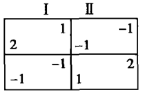
选手能否在缺乏沟通的情况下做出同样的选择？这是一个实证问题：第3章的实验为这个问题提供了明确答案，或者至少说明在某些情况下，答案是肯定的。当然，他们似乎很难做出非对称性的战略选择。但是，更艰难的是承认他们必须这么做，至于以何种方式则是一个具体操作层面的问题。双方必须共同努力，相互默契配合才能找到做出同一选择的暗示条件。当然，对选手而言，上面矩阵的解决方法并非公平。尽管由于完全意外或偶然因素，应该指责一方的收益可能会大于另一方的收益，但是我们必须假设理性选手能够接受这一不公平的现实，如果暗示条件要求这么做的话。只有不公平的平衡点才能帮助双方达成共识；否则，否定不公正性就是否定双方为了寻求胜过任何对称性结果的结果，而寻求并接受隐藏的暗示条件。卢斯和雷夫在分析后总结说：“尽管这个着起来公平的博弈场景具有一定程度的对称性，但是要具体发挥这些对称性因素却异常困难。”尽管如此，这一看起来公平的博弈的真正答案却具有某种程度的非对称性，特别是在某一特定场景中，目标就是如何发挥这些非对称性。详见Pp.298ff。

  在很大程度土依赖于实验研究的内省博弈也说明这一问题。假设代
表博弈潜在结果的所有点分布于两个矩阵坐标的右上部位，那么，不管
我们对对称性假定和纳什解决方案的某个对称性多么偏好，我们首先将
“纳什观点”看做是显式谈判博弈的理性结果。[^11-20]下面，我们将对博弈场
景的各个变量进行分析。

[^11-20]: 在博弈选手对彼此的效用体系（主观价值判断）十分了解的情况下，纳什提出自己的博弈解决方式，即博弈结果必须将选手双方的效用体系收益最大化。假设所有可能的结果都隐含于一个曲线图，而这个曲线图的坐标是标识选手的效用收益，那么，博弈解决方案只能位于收益矩阵右上部分的某个点。（该点之所有具有惟一独特性，主要基于以下原因：假设存在两个点，那么这两个点将被一条直线所连接，而这条直线则表示混合各种随机因素或原来两个结果后可能得到的两个结果；直线上与他们相连的各点能够增加选手的效用收益。换言之，这一区域由于几率混合存在的可能性而凸曲，并具有惟一一个最大效用收益点（纳什点）。
纳什提出的这一“解决方法”最显著的特点在于，该解决方法不受选手双方间效用尺度的兑换率的影响。换句话说，我们对双方各自效用的评价并不影响这一解决方法。同时，这一解决方式还符合其他条件，特别是与形成对称区域的选手效用尺度有关的某对固定评价（或兑换率）的条件，右上方的中间点即为最后的解，也是选手双方间最对称的一个点。（这也是惟一一个满足所有指定条件的解答。纳什表示，任何满足其条件的解都将产生促使选手双方效用收益最大化的结果。）这里为了研究的需要，我们将对称要求看做是博弈解决方案的一般属性，并将其他条件看做是为了实现解决方案的惟一性而对对称概念的改进。详情请参阅本书有关纳什等人的论述。其他相关文章还有罗伯特大主教即将发表的“The Nash Solution of Bilateral MonopolyandDuopoly”，该文对纳什理论进行了诠释和批评。有关纳什点应用到仲裁理论的资料有莱曼 E.艾伦 (Layman E.Allen）的“Games Bargaining:A Proposed Application of the Theory of Games to Collective Bargaining," Yale Lau Journal, 65:660 (April, 1956).
我们有必要顺便强调，纳什理论也需要一种方式能比较选手效用尺度——与选手个人的效用评价无关，并能够独立存在。然而，鉴于纳什理论将效用兑换率作为根本原则，因此纳什理论依附于选手效用的内在不可通约性（incommensurability）。假设选手的效用尺度原则上具有可比性，尽管操作起来比较困难，纳什理论看起来也并不是排除困难比较有效的手段；假设选手效用原则具有可比性，那么，纳什理论以不可通约性原则得到博弈的解决方法并没有多大的意义。现在，虽然人们有关博弈论和经济理论的认识依据与选手间的效用比较并不协调，但这并不妨碍仲裁思想与效用比较的密切联系。经济理论发现效用概念的应用有助于促使效用理论与决策理论的协调，从而得到经济决策理论的副产品“福利经济学”。假设有人放弃这些相关性，那么，就会有人为了仲裁的派生原则而以心理学或生理学方法衡量选手的“效用”或者依法建约某个比较规则——尽管具有偶然性，但是还是符合仲裁的社会价值。

  首先，我们以默式方式完成同样的博弈场景。双方从各自的坐标轴
上选择一个值。如果得到的分数位于边框上或者边框内，我们就得到了
自己选择的坐标的（效用）值。我认为在自己希望的思想框架内——这
使我们在显式谈判博弈中更倾向于接受纳什的观点——我们应该接受纳
什的观点。不要问为什么，让我们继续进入另一种博弈场景。这也是一
个默式博弈场景。不同点在于，除非我们选择的坐标点正好位于坐标轴
上，否则我们将一无所获；或者除非我们取尽所有的值，否则我们什么
也得不到，在这种情况下，谨小慎微也不能帮助我们，一方必须每一次
都与对方做出同样的选择。因此，我认为在自前的思想框架内，我们应
该接受纳什的观点。

  最后，我们考虑另一种博弈场景。我们在分析完一个刚刚完成的博
弈示意图后，意识到我们现在是一对同甘共苦、荣辱与共的博弈搭档。
同时，我们现在的博弈场景是以我们选择的谈判博弈场景为原型，无法
进行沟通，坐标点正好位于坐标轴上。如果我们做到了这一点，那么，
我们将同时获得奖励不管收益如何，我们将得到同样的奖励——否
则，我们将一无所获。鉴于此，我认为在完全合作博弈中，我们或许也
应该（必须）在现有的思想框架内接受纳什的观点。

  或许有人会问为什么。道理很简单，我们需要理性化因素实现一个
惟一性结果。只有在这样的环境中，谈判类比才能满足这样的条件，除
非可能存在一个凸点（即便如此，也将发展为纳什点）；或者当坐标线
是一条直线或曲线时（最终回到纳什点），存在一个中间点；或者是明
显指向某个点的启发性方式。否则，除非博弈场景存在缺陷（如界线上
有一个点），我们才可能回头重新研究对称性的“惟一”定义。与纳什
定义的对称性一样，我认为的对称性同样具有可行性——虽然没有像其
他对称性那样简单（如一个图表的45°线与另外一个类似图表的线相交
形成的对称性），但是至少在其复杂水平上简单易懂。

  如果纳什点在谈判博弈中对我们具有极大的帮助，那么，情况一定
更是这样，因为我们相信纳什点对对方具有同样的吸引力：反之，他们
也相信我们会接受这一观点。在完全合作博弈场景中，纳什点作为一个
独特的点吸引双方的视线，双方都明显地关注着这一点。

  许有人会问，这又能说明或者暗含什么问题呢？我并非想证明纳
什的观点。我们只是认为，纳什点对博弈理论家（作为内省的博弈选
手）的吸引力或许与我刚才得到的结论相矛盾。或许是纳什点在完全合
作博弈中的核心属性——在没有非数理缺陷帮助的情况下，对定义惟一
的对称性的准确运用——对默式和缺乏合作的博弈边线变量产生了决定
性影响。反过来，这一属性又成为对默式要求不高的博弈边线区域变量
的可靠向导，并受到显式谈判博弈选手的青睐，因为他们希望双方的预
期判断在其他任何地方也能产生共同。

  换句话说，通过假设对预期合作的需求，我们似乎为纳什定理找到
了存在的理论依据。纳什理论需要的正是解决方案的存在这一假设。很
显然，只有默式合作才能提供实证根据，（偶尔）理性预期判断也暗含
某个特定（或许有效的）结果。这也不得不使博弈选手认为，在仅仅具
有数学属性的博弈场景中也存在同样的可能性。

  纳什理论正好验证了这一假设的合理性——如果纳什理论能够比其
他数学解决方案更能体现数学的美感。最后的焦点只能是，数学方法的
普遍存在并不意味着博弈论的普遍性。

## 附录 C 重释“非合作”博弈的决策理念

利益完全共同博弈或合作博弈反映了博弈论某些决策理念的合理性，
特别是严格意义上的“非合作”博弈决策方法。通过“研究这些
方法理念背后的各种关系”，我们能够分析为什么理性选手对这些理念
方法如此青睐。[^11-21]

[^11-21]: “非合作”是人们对博弈的传统称呼，它表示在博弈过程中，选手双方没有明显的沟通行为。很不幸的是，“非合作”在某种程度上表明，博弈选手间沟通的匮乏正是博弈合作难以实现的根本原因，这或许不是“非合作”概念的初衷。正如第3章和第4章所述，在许多默式非合作博弈场景中，合作——博弈选手都十分重视的互动行为——无疑是非常关键的因素，甚至可以说是核心因素。

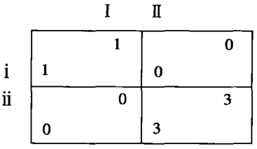

  图附录C-1表示具有严格意义上解决方案的默式博弈。（在图附
录C-2中，解决方案是双方的第二和第三战略选择。）卢斯和雷夫分析
了类似解决方案的定义：“非合作博弈在符合下列条件的情况下其有严
格意义上的解决方案。（1）选手双方的战略选择之间存在平衡；（2）
所有允许的平衡选择必须具有互换性或等价性。”[^11-22]

[^11-22]: 《博弈论和决策》，P.107f。这一特定博弈解决方法看似纳什于1951年提出的观点，但本质上则不同。了解其他几种博弈解决方法的区别，请参阅第5章的卢斯和雷夫的案例以及纳什的"Annals of Mathematics",54:286-295 (1951)。

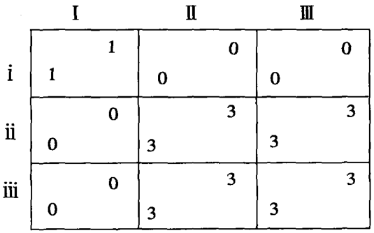

  一对平衡的战略选择是双方的最佳选择（或者至少与其他选择一样
有利），一方的选择应该与对方的选择相匹配；双方允许的一对选择应
该不受其他选择的影响，即该选择得到的收益不逊色于其他矩阵格内的
收益。对选手双方而言，平衡选择是等价的，因为每一方都得到同样的
收益；而且，如果双方依据平衡点做出战略选择，那么，平衡选择也可
互换。（换言之，只有当双方战略选择具有等价性，其产生的收益才具
有互换性和等价性。）因此，图附录C-2中的战略选择（ii，II）
（iii，III）（ii，III）和（iii，II）都具有等价性和互换性，也就是双
方允许的平衡选择。

  在完成这个定义之后，卢斯和雷夫立即进行如下表述：“第二个条
件避免了多种平衡选择之间相互*混淆*。”（楷体字为作者所加)

  简言之，问题的关键是如何避免混淆或歧义现象，这也是第3章涉
及的合作博弈的核心问题。图附录C-3并没有严格意义上的解决方案。
选手双方的第二选择和第三选择不具有互换性和等价性——即在4个组
合中没有一个是等价的。双方的战略选择除了造成一定的混淆外，并没
有影响双方的实际收益。在图附录C一1中，双方知道自己必需的选择：
在图附录C-2中，双方知道自己应该做出的选择；而在图附录C-3中，
双方不知所措，不知道应该如何选择。图附录C3中，双方之间沟通
的匮乏导致二者都一无所获。由于缺乏有效的沟通，选手双方只有50%
的机会赢得3分值，即各自的预期价值均为1.5。

  为什么在图附录C-1中，默认结果是（ii，II），而非（i，I）？
一个简单的答案是，前者优于后者。但是，这只是全部答案的一部分。
我们能够在图附录C-4中找到另一部分答案。图附录C-4基本上与图
附录C-1相同，不同之处在于双方选择偏好程度不同。

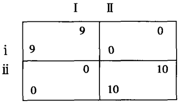

  在图附录C-4中，对双方而言，问题的关键是如何在9或 10和0
之间做出选择，而非10和9之间。简单地说，两对平衡选择很大程度
上具有等价性，但是缺乏互换性。尽管双方某种程度上都关注自己能否
得到9或10，但是他们更关注的是能否得到0。双方的共同利益在于做
出明确的选择，避免出现“混淆”。

  他们需要某种暗示、规则或启发以做出共同的选择。在图附录C-4
所示的抽象的博弈场景中。只有数字能发挥这样的作用。在选择较大值
或较小值之间，前者显然具有更大的吸引力和可行性。我们不禁要问
（ii，II）比（i，I）多的1美元对双方而言有多大价值。实际上
这1美元价值不在于其货币价值，而在于其起到了暗示符号的作用。对
双方而言，是9与10之间的差别促使二者做出了同样的选择。在图附
录C-5中，我们假设选手双方没有找到合作规则，那么，二者的预期
收益分别为5。

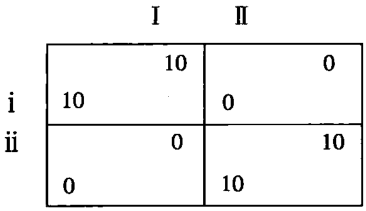

  （事实上，图附录C-5表示的博弈场景以图表形式更容易说明问
题。但是第3章的实证结果表明并没有这样做的必要性，因为一个具体
的矩阵允许左右、上下、前中后存在不同。为了分析的需要，我们必须
假设选手做出的战略选择必须以这种形式，并表明理性选手在智力上无
法实现同样的选择。一个完全简单的没有什么暗示的博弈场景，将缺乏
明确的标识或具有对称收益。巧合的是，拥有众多战略选择的默式博弈
也没有“完全”形式，战略的无限性只能以一个生成公式展现给选手，
因为任何生成公式都为选手提供某种选择战略的方法。）

  假设我们选择（ii，II）作为强调的结果，黑体印刷体指向定结
果，或者有个脚注写着一旦出现混淆现象，管理人员建议选择（ii，
II），那么情况将保持不变。选手需要的是实现战略合作*某种*暗示。如
果他们无法在收益的数学分布图中找到这些暗示，那么，他们只能另寻
高就了。战略或许能以这种方式出现，标签或者暗示为选择或区别这些
战略提供依据，理性选手也会发现大有裨益。[^11-23]

  附录C旨在强调严格意义上的解决方案的重要属性——理性选手选
择某个战略的原因——具有重要的暗示作用，即默式沟通的一种方式；
当沟通的缺乏非常严重时，这有助于理性选手实现默契合作。当然，这
并非类似解决方案的惟一属性，但却是博弈选手选择战略的规律的重要
组成部分。

  在本书涉及的博弈场景中，我们也可以以另一种方式说明这一
点。我们能够以某些沟通成本实现沟通，并分析这些博弈场景以求证
这些成本的价值所在以及产生“解决方案”的沟通渠道。博弈选手可
以充分利用本书提到的各种“暗示条件”，尽管选择什么样的沟通方
式以及如何看待这些沟通方式完全是一个经验问题。正如语言认知和
语法的要求有助于消除由于信息沟通不畅而出现的歧义现象，认知或
句法要求，诡辩论或几何学要求也有助于消除默式合作场景的模棱两
可因素。

  我们可以进一步发展这一观点。在图附录C-6中，我们假设双方
选手由于智力的局限性无法做出其中的战略选择，特别是不能以某个正
方形的形式存在或以数字或字母充当暗示符号，或者——如果带有标识
的话——选手各自拥有自己的标识符号。如果是这种情况，假设所有标
识字母没有任何暗示合作的作用，那么，解决方案将是战略选择（iii，
III），即结果为9。这也是平衡点要求的最小值，而且在其他值存在混
淆的情况下，这个值明确惟一并发挥了暗示合作的作用。仅就收益结构
而言（即没有引入“标识”、预制矩阵或博弈的完全定量结构以外的任
何因素），与图附录C-7相比，这个解决方案仍不失为一个好结果，尽
管后者符合卢斯和雷夫的定义，而前者与之矛盾。[^11-24]

[^11-23]: 博弈对选手理性和智谋上的要求很像猜谜。猜谜在一定程度上要求猜谜者必须找到某种启示或暗示，但是这些暗示或启示必须难易适中。对猜谜者而言，寻找这些暗示条件应该既不至于难于上青天，也不应该易如反掌。（即当这些暗示或启发条件出现时，理性选手应该意识到。）从本质上讲，博弈与猜谜都属于二人问题。猜谜的解决方式取决于另一方隐藏于谜语中难易适中的暗示或启发条件。原则上，这些暗示条件的隐蔽性应该难度适中。猜谜者不能仅仅通过经验得到答案，也不能经过逻辑推理后得不到谜底。“暗示理论”（hint theory）是博弈论的内在经验部分。

[^11-24]: 意在继续探讨这一观点的读者可以得到大量相关博弈场景的实证。

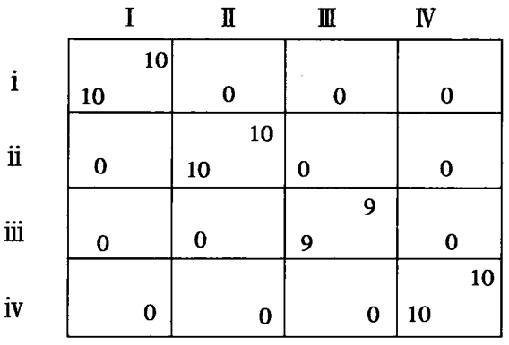

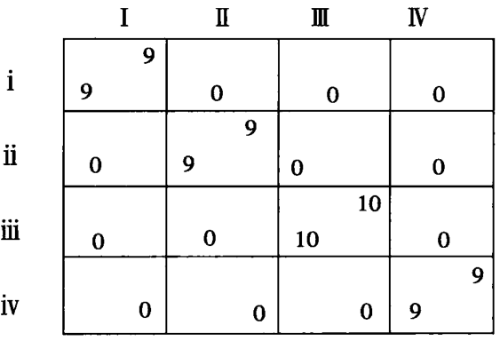

  图附录C-8和图附录C-9均无严格意义上的解决方案，但却说明
了同一个问题。在附录C-9中，选手似乎就是否选择（ii，II）存在
争议。一方认为在不知道选择（i，I）还是（ii，II）的情况下，自
己应该考虑最保守的选择。如果行错选了上面的行，那么，他将一无所
获；反之，如果错选了下面的行，他将得到5。这里的错误选择意味着
一方无法与对方达成共识得到最佳结果10。选择下面行的选手或许会
为自己辩护，自己这么选择至少可以稳得5，而不必冒险选择10。与结
果10相比，自己得到结果5具有同样的意义。尽管这或许就是他按照
自己的“理性”做出的选择，但是下面的推理过程似乎更具有说服力。

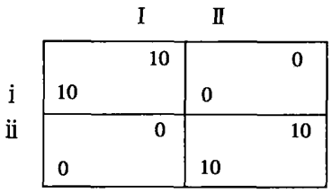

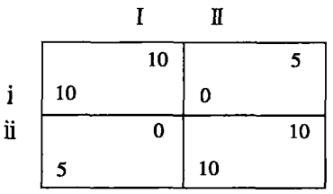

  “在比较（i，I）和（ii，II）之后，我发现与对方无法达成共
识。或许在其他某个地方存在答案，我们必须试试看。其他惟一可能的
地方就是（ii，I）和（i，II）。这是否暗示我们能够共同选择10？
答案是肯定的。它们似乎不约而同地指向（ii，II），并提供了令人信
服的理由使我们相信或者至少有个借口骗使我们相信选择（ii，II）比
选择（i，I）好，因为我们至少需要一个自欺欺人的借口使自己相
信，一对平衡选择比其他选择搭配更有利、更卓著、更显著或者更符合
条件，假如我们没有一个令人信服的理由的话。其中原因可能是，我们
无法找到其他更好的规则或建议或暗示继续遵循，我们或许能够以这个
规则实现共识。”

  在这个博弈场景中，选手不会进行第二次选择，因为第一个选择的
收益虽是5，但是已经足够比一无所获好很多。因此，他们更倾向于选
择5，而且将结果5和0的分布看做是协调双方行为的某种暗示。对双
方选手而言，他们有必要——双方都意识到对方也意识到这一有利价
值——注意5的位置，尽管这只是实现共同预期的第一步。在图附录
C-9中，双方更倾向于共同选择（ii，II）。这如同白纸上的矩阵箭头
指向右下角的选择，而且这个箭头仅仅依靠暗示条件和双方协调彼此预
期，并非依赖于逻辑推理或某种权威。[^11-25]

## 冲突利益

  现在我们开始探讨冲突与合作并存的博弈场景。图附录C-10和图
附录C-11表示的博弈场景均含有博弈允许的平衡点，但是没有严格意
义上的解决方案，因为平衡选择既无等价性亦不可互换。

[^11-25]: 假设一方选手选择了ii或II，那么，我们有必要寻求辨别二者背后不同动机的可行性方法，即使仅仅是为了验证这一概念的可行性。我们或许可以通过以下方式发现两个动机（“保险”动机和“合作暗示”动机）的不同之处。我们可以将选手置于一个类似于图附录C-9的博弈场景。二者不同之处是，后者中的收益5变为0~9的变量，其他收益值不变。然后，我们询问选手愿意为了我们付出多大代价而完全好博弈游戏——即选手愿意为与一个选手竞技和得到真实的现金收益的机会付出多大代价。（换句话说，我们问他愿意为优先选择不同的变量付出什么代价。）如果他的答案对某个正数收益值来说没有任何意义；或者尽管如此，他仍对这个博弈游戏注入极大期望，并为之做了充分准备，诸如随机战略预期值等，那么，我们可以得出肯定的结论：右上和左下格的收益值对于选手来说，将是吸引力最大的暗示符号。例如，假设选手愿意每次付出9.50美元参与图附录C-9的博弈场景（这同时意味着列将有90%的概率选择II）；如果将5改为1，那么，他将每次付出8.65美元；或者将5改为9，那么，他将愿意每次付出9.95美元；或者他愿意以每次5美元参与图附录C-8所示的博弈场景，那么，我们得到的背定结论是：对选手而言，右上和左下格的函数或值具有巨大的合作暗示作用。如果，该选手的预期成本表明，选择I和Ⅱ就右上或左下格的收益值而言没有区别；特别是当他选择以算术平均做出选择，那么，这就证明了其保守的动机（请注意，客观存在的“右上格”和“左下格”只是作者采用的简化形式。对于我们研究的随机（unlabeled）战略而言，这样的简化方式不会对博弈选手产生影响。类似的战略选择没有出现在收益矩阵中，或者仅仅以“i”和“ii”为模糊标识。即使这些战略选择存在标识，它们也应该通过随机过程产生，并且与对方展示的立场或标识选择的随机过程区分开。需要注意的是，行一定不能知道列的收益矩阵是否是像图附录C-9那样，或者将左上格和右下格的值换成较大的收益值）。

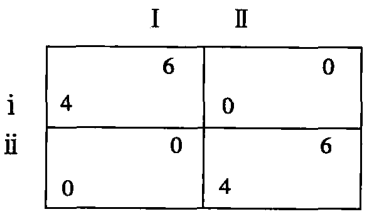

  附录C-11表示的完全以抽象形式存在的合作问题显然“无解”，
因为战略选择没有对应的暗示符号。对双方来说，只能依靠侥幸实现博
弈场景能够允许的（有效）结果。[^11-26]当然，附录C-11或许存在解决的
可能性，因为双方宁愿接受各自的“次优”平衡点，也不愿丧失合作的
机会。二者的共同利益在于一起寻找达成共识的暗示符号。如果情况如
此，那么或许有人会问，他们为什么不接受其他方格中指向（ii，II）
的暗示符号呢？[^11-27]

[^11-26]: 本书前面的脚注提到了另一个类似的收益矩阵，不同之处在于该矩阵没有完全抽象的前提。

[^11-27]: 图附录C-11表示的博弈场景还有一个平衡点，即行的混合策略80:20和列的40:60。在这种情况下，双方的收益分别均为3.6，分别取决于矩阵的左上方和右下方。

  对于其中一方选手来说，这也许并不是最佳选择。但是，如果天上
掉馅饼，乞丐难道还有选择的权利吗？是否还存在什么其他暗示符号
呢？即使这些暗示符号没有积极意义，也会具有反面作用吧？例如，它
们的箭头指向（ii，II）而非（i，I）时，双方完全可以把这个标志
看做是某种信号，而非仅仅是箭头。当然，这或许并不能发挥多大的作
用，实际上也无法促使双方实现合作；而且，如果所有的符号都具有类
似的作用，我们无疑将陷入混淆的迷雾之中。只有在不同特点的暗示符
号能够明确指向某个共同选择时，拒绝不同点才意味着失去找到暗示符
号或在双方倾向冲突的情况下实现有效结果的可能性。[^11-28]

  此外，最符合条件的暗示符号是那些我们排除收益矩阵的数学意义
后承认的符号。假设我们在一条垂直交叉的沙漠之路上驾车相向驶往同
一个十字路口，没有路标指明正确的方向，彼此之间缺乏好感和信任以
及最起码的道德责任感；在这种情况下，一方或许主动减速给对方让
路，从而避免在十字路口突然刹车；对方也可能提前预測到这一点。[^11-29]
尽管传统的优先机制缺乏法律和道德约束力，但是当合作成为必要时，
传统的优先机制仍能发挥积极作用。例如，反对传统优先机制的一方或
许会接受其约束力，并意识到他应该感谢这一机制，尽管知道这一机制
对其不利以及必须遵守对方对这一标志和预期的认同。正如在第3章中
我们所分析的，通过这样的逻辑推理，当博弈场景以某个收益矩阵出现
或者有利的战略选择被标识为“头”或“尾巴”、i、ii、I、II等，
图附录C-10表示的博弈或许能够获解。

## 第三者的影响

  巧合的是，这些要求选手必须合作的博弈场景——无论是选手利益
冲突，还是利益互存——都必须受到调解人的控制和或影响。假设我们
授予第三者向原先两名选手传递信息的权力，那么，这个第三者的出现
对此前的两名选手将非常有利：甚至当第三者的利益与其他两位选手的
战略选择存在利害关系时，他的立场对自己也十分有利。一位慈善的调
解人非常有助于完全共同利益博穿的完成，或者是在类似图附录C-10
的博弈场景中拥有仲裁权力或作为图附录C-10博弈的“第三方选手”
的调解人。[^11-30]在图附录C-10中，括号内的值为调解人（信息垄断者）
的收益，他的意见对其他两个选手仅仅具有建议性而非强制性。

[^11-28]: “心理优势”反映了博弈选手相互认知的暗示符号的作用。前面案例中的卢斯和雷夫就是利用这一方式处理某种博弈场景中的平衡点问题。详见《博弈论与决策》，第109~110页；或者本书之前的脚注对类似博弈场景的论述。

[^11-29]: 第2章中涉及了有关的利益冲突问题，如两辆汽车在一条狭窄的道路上相向而行。结果表明了这一普遍规律。但是，由于篇幅所限，第3章中没有进行详细论述。

[^11-30]: 请参阅本书第3章，该章涉及如何处理不当得利和自愿调解人的问题。

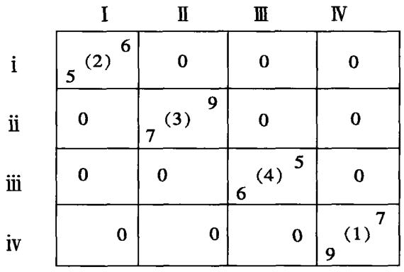

## 释义收益

  最后我们必须指出，这里我们是否将博弈结果看做是客观的可衡量
标准（货币、同类物品或是博弈论意义上的“效用”）对推理思维过程
并没有影响。只要名义上的收益显而易见，选手能否了解对方的真实意
图以及了解的程度如何并不重要。（假设选手知道客观价值或效用价
值，并与双方的选择并非成正比，那么“暗示符号”就失去了其应有的
作用。混淆或歧义问题将变得更加严重。）

## 选手数量

  本书讨论的博弈场景大多为二人博弈，除了少数情况下涉及具有明
确身份的第三者。如果最终的结果取决于选手的共同选择、少数服从多
数、多重选择还是成功的联合选择（如第3章中涉及的问卷程序），我
们讨论的问题将不受到博弈选手数量的限制。如果出现这种情况，歧义
问题将变得更加严重，博弈的合作问题更取决于“解决方法”的规律。
或许在多人博弈中，合作理论的关系最大，并涉及联合方式问题。因
此，对暗示符号的研究和以联合形式出现的沟通渠道将成为联系博弈论
和社会学的强大纽带。

## 结论

  综上所述，合作博弈理论表明，尽管我们就符号属性对某些博弈场
景理解得较为透彻，但是我们还无法完全了解默式非零和博弈“严格意
义上“的解决方法。鉴于博弈的完全数学模型也可能存在多种暗示符号
源，“严格意义上的解决方法”的某些属性也能够成为“理性解决方
案”的决定因素之一。这在一定程度上只是一个经验问题，并非仅仅是
暗示符号推崇的先验推理问题。

# 英中文译名对照及索引

（略）

# 译后记

  《冲突的战略》一书是为了满足理论需要，而非实际外交决策。主
要目的是为了建立一个跨学科领域——该领域曾被人们称之为“讨价还
价理论”、“冲突理论”或“战略理论”。作者想向人们证明，一些横跨
经济学、社会学和政治学，甚至是法学和哲学或者是人类学的基础理
论，不仅对从事理论研究的学者大有裨益，而且也有助于人们解决实际
问题。与此同时，作者最初认为博弈论（the theory of games）在某些领
域应该具有更多实用性。但是现在看来，这也许是一种曲解，因为除了
大家比较熟悉的霍华德·雷夫（Howard Raiffa），马丁·舒里克（Martin
Shurik）和纳杰尔·霍华德（Nigal Howard）等学者外，博弈理论家更多
倾向于将博弈论限制于数学范畴。作者认为，尽管他致力研究的领域可
能不会突飞猛进，甚至还尚未有自己的正式名称，但是作者相信将会有
更多的有志之士投入到这一领域的完善和发展之中。

  感谢在整个翻译过程中对我们的翻译提出过建议、提供了帮助以及
督促我们完成进度的朋友、同学和老师。在此感谢赵华、陈之荣、郑
明、朱玲、田敏、于洁、陈刚、杨静、李小君、胡倩、谢晓霞、曾琼、
曹晓爱、李慧、王俊、赵浩、谢圣哲和谢伦裕对本书翻译工作的帮助，
由于译者水平有限，不当之处在所难免，望广大读者批评指正。谢谢！

