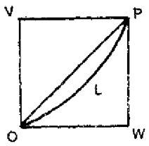
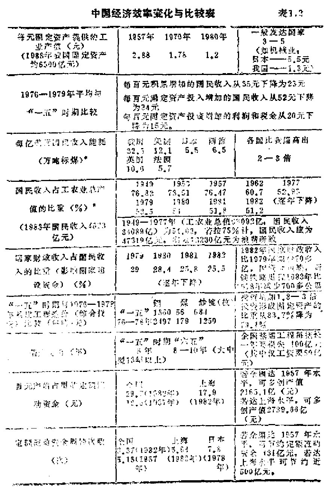
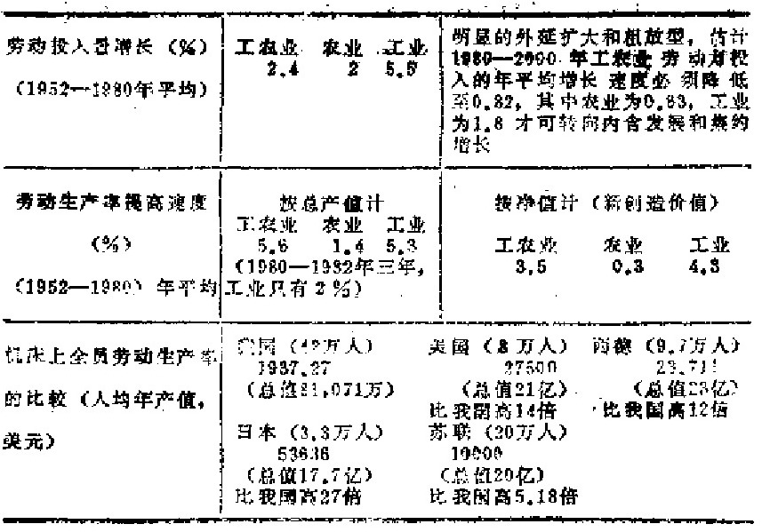

# 第一章 经济大地震

    纵观历史：最难的是把
    国民经济搞上去。中国目前
    最困难的事情就是人均国民
    收入太低。
            ——[美] 杨振宁

## 1.1 理论与事实

  本世纪五六十年代，世界性的军备竞赛愈演愈烈。到
1965年，全世界拥有的核弹头的能量，相当于150～180亿吨
TNT，按世界40亿人算，平均每人头上3.8～4.5吨。目前有
人估计，平均每人已超过20吨！现在，东西方都承认有个
“核冬天”的理论：只要把现有半数的核弹爆炸，地球的气
温就将因乌云挡住太阳而有三四年时间处于零下20-40℃的
状况。后果不堪设想！

  正是从1965年开始，世界一些国家原来由内务部长、外
交部长、国防部长提升上去的总统、元首、总理，一个接一
个地被经济部长、工商部长所代替。虽然军备竞赛并未停
止，但这一元首“出身”的“演化”现象已被敏锐的学者们
察觉，他们把1965年看作是世界中心从军事转向经济的元
年。

  可惜，当时的中国人却在一场政治大地震中走向与世界
潮流相反的另一个极端，到醒悟过来时，已经迟了15年。早
已存在的很大差距，被一种不可遏止的力量进一步拉开，以
至我们不得不承认：不管怎样努力，直到进入下个世纪的时
候，我们与先进工业国家在经济方面的差距，正象科学技术
方面的差距那样，将继续扩大，而不是缩小。

  虽然这样，当代中国真正震撼人心的，是经济体制的改
革。在经济体制改革中的每一重要进展都触及理论科学、思
想意识和方针政策的重新评价。中国人似乎正从一场政治大
地震转入了一场经济大地震之中。人们的前途、命运、利
益、权力，都将在这场大地震之中重新分配。

  30多年来，不管我们在意识形态领城中提出过多么五花
八门的口号，现在终于真正认识到，经济原来是比政治更基
本的东西。

  说实话，中国人省悟到这一点，是很痛苦的。

  前两年，有一篇《经济发展中的自发性和自觉性》[^2-1]的
文章，一开头就说：“社会主义制度开辟了自觉利用经济规律
的新时代”，接着便从一个概念到一个概念地解释自发性的
“积极作用”，并用以说明我们的经济问题，不过是“自觉指
导上的失误”。最后，作者结论说：

[^2-1]: 见《光明日报》1985年6月10日

  “这当然不是无条件地放任一切自发作用，更不是听任
自发势力中某些腐朽的东西自由泛滥，而是自觉地利用某些
自发作用。这是有限的自发性，是清醒的自发性，是自觉控
制下的自发性，也是为进一步实行自觉指导准备条件的自发
性。不断地由自发到自觉，从必然到自由，这是人们掌握经
济规律的辩证过程，……”

  这真是一种奇妙的理论。谈论经济发展的问题，洋洋3000
多字，竟然半个事实也不提及。这种学风，使人深感遗憾。

  作为一种对比，让我们来看看童大林的一个说法。在一
次座谈会上，童大林谈到科学社会主义进入第三个70年时指
出，科学社会生文从《共产党宣言》到十月革命是以思想斗
争为主的第一个70年，从十月革命到现在基本上是以革命和
战争为主的第二个70年。在第二个70年里，除了在建立社会
主义制度上取得的胜利以外，在经济建设上，一方面是这些
社会主义国家都建立了社会主义经济体系，另一方面是“几
乎所有社会主义国家的经济都陷入僵化状态。”[^3-1]作为一个理
论家，童大林提出了自己的理论见解，而他讲的全是事
实。

  世界上最可怕的事情之一就是只讲“理论”，不讲事实。
按世界银行公布的数字，我国目前人均收入只有在我们身旁
的亚洲“四小龙”与日本的1/10到1/30。

  马克思和恩格斯在自己的著作中曾预测商品会在资本主
义之后的社会中消失，因而，与此相关的价值和货币也会消
失。此后，在列宁起草的俄共（布）第八次代表大会党纲草
案中明确地提出要“用有组织有计划的产品分配来代替贸
易”，要“推备消灭货币”。[^3-2]虽然后来列宁发现了自己的错
误，因而提出改变初衷的“新经济政策”，但是社会主义社会
推行“军事共产主义”的实物经济政策却成了定局。与此相
关是，社会主义各国长期奉行斯大林关于存在着“两个世
界平行市场”的教条主义理论。

[^3-1]: 现经济冬游1985年：1月11日。
[^3-2]: 见列宁全集29#，第91一62页。

  在中国，经济理论的情况变得特别恶劣。

  1958年，陈伯达在郑州会议上正式提出全新的“革命口
号”：要“取消商品，取消货币”。[^4-1]到“四人帮”横行的时
候，更冒出一个“权力转化为资本的”的“权力资本论”，马克
思的“货币转化为资本”的理论似乎已经“过时”了。正因
此，少数看到了马克思主义经济学某些理论困境的经济学
家，如在北方提出要重视价值规律的孙冶方，在南方提出要
研究商品经济的卓炯，都落得了个，“全党共诛之”的下场。

  可怕的是：这种情况至今并未完全结束。在目前中国的
经济改革中，你可以提出什么“新月带”理论、“金三角”理
论、特区扩散理论、大西北开发理论、大西南开发理论、大
循环理论……等等，等等，但不能触犯“马列”两个字。

[^4-1]: 见《社会科学评论》1985年第3期，第114页。

  最值人深思的是1985年发生的，轰动一时的，“马丁事
件”。南京大学哲学系的青年教师马丁（笔名）在1985年11月
2日的《工人日报》上发表了《当代我国经济学研究的十大
转变》一文。文章不过是整理了一下国内研究的一些观点，
其要点如下。

1. 从批判经济学转向建设经济学；
2. 从经济政策的理轮阐释转向科学分析；
3. 从对当代西方经济学的排斥、否定，转向分析借鉴；
4. 从生产关系的研究转向生产力以及生产力和生产关系相互作用机制的研究；
5. 从经济关系的一般研究转向经济运行机制的具体研究；
6. 从经济的定性分析转向定量分析；
7. 从理论经济学转向应用经济学；
8. 从微观经济转向宏观经济，从短期规划转向长期战略的研究；
9. 从孤立的单向度的经济学研究转向综合的多学科的社会经济研究；
10. 从线型知识结构转向复合型知识结构。

  从研究者的角度看，虽然其中不无混乱，但却实在是简
单和清楚不过的事情。不幸的是马丁的观点被洋人歪曲了，
成了有犯“马列”之嫌，结果引起轩然大波，被指责为“高
级精神污染”。有人准备大动干戈，组织对马丁进行大规模的
批判；只是由于被最高一级决策人阻止才作罢。可见，中国
社会高度政治化的局面并没有完全解开。我们重提这个事
件，是想说明新旧观念交替之闻的痛苦和艰难。这个事件可
以说映出了整个中国的文化背景。

## 1.2 战时保障经济学

  世界性的社会主义的经济困境，已是无可否认的事实。
对社会主义经济的弱点和毛病，历来有许多尖锐的批评。近
几年，以匈牙利经济学家科尔内在《短缺经济学》一书中所
作的分析批评影响最大。

  其实，从实际情况来说，我们经济理论上的失误，主
要出于战时体制思想。从50年代至70年代，我们的基本发展
战略就是加强集权管理，自力更生，准备打仗。在这种体制
思想下，我们在经济营运上主要的概念就是保障、生产、短
缺、管制、配给、供应、调整、补助、津贴、救急，等等。
这些概念，清楚地带有战时体制意味。基于此，我认为，我
们的经济学不妨名之为战时保障经济学，或称战时供给经济
学。

  经济学上的“保障”概念是毛泽东的创造。

  毛泽东早在1933年8月所作的《必须注意经济工作》一
文中，就提出“为着争取物质上的条件去保障红军的给养和
供给”的问题。到1942年毛泽东提出“发展经济，保障供
给”之后，这口号便成为数十年以来我国财经工作的总方
针。直到现在，这口号还可以在例如郑州那样的大城市马路
旁的墙壁上看到。毛泽东早年提出的“保障”概念，与列宁
在十月革命后提出的“分配”理论都是军事压力下的产物，
是穷底子、穷日子时代不可避免的产物。不同的是：后来列
宁认识到要改变政策了，而我们却死抱“最高指示”不放。
直到现在，商业部还有人认为“保障供给”仍然是我国目前
财经工作的基本出发点，并认为这尽管有供给制和分配制的
意味，但这种“保证人民所应得的基本生活必需品不允许受
任何侵犯”的原则却非常鲜明地标志着我国社会生义制度的
优越性，即使到了2000年仍然要坚持“保障”原则。这大概
是代表“官方”研究者的意见。我不知道这种意见怎样和发
展商品经济，强调价值规律，提倡竞争等政策协调起来。

  “战时保障经济”的实质仍然是自然经济。“自己动手，
丰衣足食”、“自力更生”，“备战、备荒”、“深挖洞，广积
粮”，甚至“以粮为纲”，“钢铁元帅升帐”等，全是这种经济
的必然产物。1958年以来，几度刮起的“体系风”也是保障
经济学的杰作。为要实现煤炭地区自给，扭转“北煤南运”，
在1966年至1977年间，对煤炭储量不到全国2%的江南9省
市投资41亿元搞煤炭，至1978年产量才达8700万吨。占煤
炭储量1/3的山西省，1981年前30年累计煤炭投资才31亿元，
到1978年煤产量已突破1亿吨，每吨煤生产能力的投资只相
当于江南地区的1/2到1/8。[^7-1]在江南轻工业区抑长攻短“大
打煤炭翻身仗”的同时，塞北的重化能源工业区却大闹“轻
工产品大会战”；各种产品一律要求自给。1978年全国只生产
了15万辆汽车，却分散在26个省、市、区的130个厂点中，
其中110多个厂点年生产能力在1000辆以下，17个厂点不足
100辆，个别厂仅几辆，每辆城本二三万元，比第一汽车厂
高一二倍。而外国载重汽车厂一般生产批量均为1万至几万
辆。又如，两湖地区要六七亩甘蔗地才能产1吨糖（广东
1.7亩即可），河南省十几亩甜菜地才产1吨糖（单产只相当
于黑龙江的1/7），却同样要开糖厂搞自给。似乎非要达到各
地区划地为牢，“万事不求人”，才有保障可谈。

  此外，作为“保障经济”的一种必然的做法，就是对许
多经济落后的地区，尤其是对少数民族地区，实行一种“补
贴经济”政策。例如内蒙古，1984年全区财政收入与国家财
政补贴之比为1:2.45。[^7-2]区内大多数建设项目靠国家投资和
补贴安排，经济建设主要靠国家政补贴支撑。这种政策原
意是希望促进发展后进地区的经济，加速消除民族间事实上
的不平等。可惜长期以来，大家习以为常，并无其它积极的
措施相辅，结果国家以乎认定要长期背负这个大包献，而相
应的地区则总是以“等，靠，要”挨日子。这不仅无助于激
发自力更生、奋发图强、积极进取的精神，而且严重地抑制
了自身内在的发展冲动力，延缓了自身发展。长期靠“输
血”维持生命，丧失了肌体本身的“造血”功能，最终是拉
大了与先进地区的差距。这些地区必须从“补贴经济”转到
“自立经济”的轨道上来，才有真正的发展可谈。

[^7-1]: 《中川学刊》1981年，2期，第45页。
[^7-2]: 《民族团结》北京，1985年，8期，第20页。

  现在，让我们来看一下战时保障经济学与科尔内在《短
缺经济学》中提到的某些内容多么相似，或者可说是更有
“中国特色”。

  科尔内系统地分析了集中表现社会主义经济矛盾的短缺
现象，并且指出，“短缺不是经济落后的结果，而是一定的制
度原因造成的”。这里说的制度，从战时保障经济学的角度来
看，就是“分配保障”制，或称“保障供给”制，也是战时
体制的必然产物。

  科尔内把现化经济体制分为需求约束型（如自由竞争的
资本主义商品经济）和资源约束型（如传统的社会主义经
济）两种。后者，他称为“短缺经济”或“吸纳经济”。参考
《短缺经济学》的理论，我可以将这两种经济类型的特性
作下比较：

### 表1.1 两种经济类型主要特性的比较

----------------------    -----------------------
资本主义需求约束型          社会主义资源约束型 
（自由市场体制）          （战时保障供给体制）
----------------------    -----------------------
以市场求制约生产           以国家资源分配制约生产

商品生产                   自然经济式的产品生产

间接生产，间接分記          直接生产，直接分配

政企分离，官商各异；         政企合一，官商不分， 
厂主就是厂主，商人就是商人   办“官工”、“官商”，
                           当“工官”，“官商”

买方市场                   卖方市场

企业为争取买主而进行提高    企业不需要关心销售，而只是为争
产品质量、讲究使用价值、    取资金、物资、劳力和提高自己的权力
降低产品成本、改善服务手段   而进行“竞争”，买者经常陷入购买困难
和服务态度的竞争

有强大技术革新刺激          缺乏技术革新刺激

用制度限制过度发展          用命令或奖励提高工作意愿

收支分立，存贷分立，       统收统支，统存统贷，统购包销，
商品流通，自由经营         统一分配，独家经营

不断产生经济危机，         长期与短缺现象共存，自动创造短
危机周期性爆发             缺（供应短缺，资源分配短缺，企业投
                          入品短缺，生产能力短缺）

货币化经济，货币的收入和    半货币化经济，货币收入和流通等
流通等因素积极地影响企业    因素仅有消极地充当记录企业活动
的决策                     的核算工具的作用

兴奋型通货膨胀             抑制型通货膨胀

市场调节体制               计划生产体制

投资是一种风险活动          投资是国家的赠品

经济垄断症：追求“产品差别”  经济“过热”症：欣赏冒进式的
价值决定，市场控制，抗衡力   高速突进，追求数量冲动，扩
量，刺激消费，商业循环，用   张冲突，投资饥饿和无限制地
以应付市场，推行倾销，提高   增加库存，还有派生的出口冲
利润                       动，用以保障供给，提高自己
                           的威望。

用垄断、吞并办法推行发展    用挖肉补疮办法推行军事性的调
政策，并成为一种加剧的周    整、救急方法（科尔内称此为“延期-
期性的行动                 救火”办法，并成为一个加剧短缺现象
                          的恶性循环）

自觉追求社会生产效率       不自觉地降低社会生产效率

为生活而生产               有生产无生活

高消费的强刺激性            免费或潮水式消费（有分大家分，
                           你买我也买）的不可满足性

企业一切依赖市场的竞争主    企业一切依赖国家父爱主义经济，
义经济，私人自负盈亏，大    国家统负盈亏，小鱼吃大鱼
鱼吃小鱼

预算约束硬化生效（预算同    预算约束软化生效（预算只是形式
时担负计划与控制职能，是    上的一种事后会计关系，投资不可满足）
协调企业一切努力实现预期
收入的重要手段，投资需求
有限）

企业法人化，冒险生存，困    企业归口化，自动生存，困难向国
难自寻出路解决             家转化

企业是价格的接受者，对投    企业是价格的制定者，对投入品价
入品价格的反应敏感，要求    格变动的反应迟钝，要求价格适应生
生产适应价格，产品成本的    产，产品成本的增加可以通过提高产
增加会导致自己的竞争失败    品价格而转嫁给顾客

产品是陈列在时装展览会上    产品有如存于生产资料和消费资料
的展品，参观者完全按照自    的蓄水池中的水，各级管理人员均力图
己的心理进行评选。产品一旦   用自己的水泵从公共蓄水池中吸“水”，
不能适应来往匆匆的参观者    或者吃大锅饭。这成了各种经济冲动的
的一时心理变化，便有遭受    动力，这是短缺的制度条件和行为规律
抛弃的风险                 性表现
----------------------    -----------------------

## 1.3 政治体制改革的等待

  由上述对照比较，我们可以清楚地看到，科尔内的短缺
经济学和吸纳经济学实质上就是我们的战时保障经济学或大
锅饭经济学。其中，科尔内说的“短缺”就是“大锅饭”必
然导致一有机会就“抢吃”造成的。

  一个有趣的问题是，资源约束型经济是否有可能通过一
般的改革来消除短缺现象呢？用我们的话来说就是战时保障
供给制能否通过改革来消除必然要抢吃的大锅饭现象呢？目
前，专家们甚至连科尔内的原意是肯定还是否定都未搞清楚。

  其实，要回答这个问题，最好看一下我们当前所进行的
这场经济体制改革的主内容。

  我国当前经济体制改革的主要内容按《世界经济导
报》1984年6月18日的报导，可以列举为7个方面：

1. 改革单一的全民所有制经挤，建立以国营经济为主导，
多种经济形式合理配置、采取多种经营方式的所有制结构。

2. 改革指令性指标过多，计划统得过死，市场调节受到
排斥的计划管理体制，实行以计划经济为主，市场调节为辅
以及大的管住，小的放开的计划管理体制。

3. 改革中央与地方责任，权限划分不明确，党、政、企
分工不合理，权力过分集中于各级行政部门的决策体系，建
立大权集中、小权分散和党、政、企合理分工的多层次决策
体系。

4. 改革条块分割、城乡分割，部门、地区、行业之间互
相封锁，以按行政系统、行政区划管理经济的管理体系，形
成按行业指导，以城市为主组织经济的条块结合的管理系
统。

5. 改革依靠行政手段管理经济的体制，实行责、权、利
统一，经济办法与行政办法相结合的管理制度。

6. 改革国家对企业统得太多，管得过死，经营成果与经
济利益相脱离的“统收统支”吃“大锅饭”的方法，扩大企
业的自主权，建立中央与地方、国家与企业、集体与个人的
经济权益互相协调的责、权、利分明的分配制度。

7. 还要改革统收统支的财政体制，形式单一的价格体
制，统存统贷的信货体制，统分统配的劳动体制，僵硬的
“八级工资”制等。

  很清楚，我们当前所进行的经济体制改革，以理论构架
来说有四个要点：国营主导，计划管理，大权集中，条块结
合。只要这四点坚持住，原来的社会主义计划经济体制就坚
持住了。其余的一些改革，大多属于“过多”、“过死”之类
的松一点、紧一点的修补问题。

  可以说，如果科尔内的理论是正确的话，只要坚持住上
述四点，短缺现象将仍然是不可避免的，因为基本的构架并
没有变动。如果短缺现象由此得以消除，那么，“短缺”就不
是科尔内所描述的构架所必然发生的现象，“短缺经济学”也
就自然会破产。

  中国当前的经济体制改革，将为科尔内的理论提供一个
最好的实证检验机会。这是非常值得注意的。

  自从1984年秋公布了《中共中央关于经济体制改革的决
定》之后，我国经济学界便苦恼地面对着一连串理论难题。

  为什么社会主义必定存在商品经济呢？有人说是由劳动
分工决定的，有人说是需求的多样化决定的，有人说是不同
的物质利益促成劳动交换决定的，有人说是社会主义劳动具
有既为社会也为个人的两重性决定的，还有人说根本的原因
在于生产力不发达。真是众说纷纭，不知谁对谁不对了。

  与此类似的难题还有一大串，我们有过其正的“全民所
有制”吗？计划性与商品性如何统一？社会主义经济的本质
特征究竟是计划经济、商品经济、公有制还是联合劳动制？
有计划的商品经济就是“有计划的市场经济”吗？即社会主
义社会中除商品市场、技术市场还应当有证券市场、售货市
场和劳动力市场存在吗？为什么现在只提“劳动市场”而不
敢提劳动力市场呢？难道能出卖的是“劳动”而不是“劳动
力”吗？现在说“我国的劳动力不是商品”那么我国的“劳
务出口”、“雇工经营”和外资、合资企业中的工人劳动又是
什么呢？如果社会主义存在着“劳动为市场”，那么劳动人民
的主人翁地位又放在哪里呢？现在说，“我国的土地、资源都
不是商品”，为什么我们又可以把土地、资源当作合资企业的
资本投资呢？企业的所有权与经营权真能分开吗？所有权与
经营权分开后，全民企业的新增生产资科应归谁所有？当新
增生产资料在固定资产总额中所占的比重不断上升时是否会
改变所有制的性质？企业成为独立的经济实体之后，会不会
产生国家对宏观经济的失控？国家应该控制生产能力还是控
制基本建设规模？国家能够控制全社会的投资规模吗？可以
用高消费低储蓄的办法刺激经济而同时能够控制需求膨胀
吗？指令性计划、指导性计划与市场调节三者之间究竟是什
么关系？在计划价格、浮动价格与自由价格之间，我们怎样
选择价格改革的目标？价格形成的基础是均衡价格、生产价
格还是机制价格？工资、奖金是两级分配还是两级按劳分配
或者两者都不是？有办法把财补贴中的“暗补”改成“明
补”吗？工资与物价的挂钩是明挂（工资指数化）好还是
“暗挂”（一定时期调整一次）好？未有一个畅通的物资市场
之前，政企分家是可行的吗？发展商品经济不会导致企业只
追求利润，人们只追求金钱因而与社会主义生产目的相矛盾
吗?“有计划的商品经济”与资本主义在国家干预下实行部分
计划调节的市场经济有什么不同？说计划经济不等于指令性
计划为主，那么应以什么为主？竞争与共产义道德有什么
关系？企业破产与主人翁失业怎样处理？企业能够在竞争中
搞协作吗？竞争不会导致大鱼吃小鱼吗？目前，部分人先富
起来，这都是实行按劳分配的结果吗？现在拉大收入差距是
为了要最终消灭三大差别吗？个体经济发展（1985年全国已
有598万余户，771万余人）的结果不会导致“社会私有化”
的出现吗？目前，个体经济发展的一些情况，已使不少人感
到茫然。从1978年到1984年，个体劳动者人数增加86倍，上
缴税收却仅增6倍，偷漏税在50～80%之间不用说了，朱庆
芳1986年的一个调查指出，雇主（有些已有雇工达千人之
数）剥削量过大、手段过于残酷，使人吃惊，雇主与雇工收
入比在1：5至1：211之间。雇工的大量产生也迫使一些人弃
工、弃教、弃学。温州有个县的企业就招收700多名10～16岁
的童工，且大多为女孩。此外，票子铺路、拉关系起家、投
机发财，更是不少雇主的看家本领，有些人一次后门钢材货
仅价格差收入达97万元之巨。[^14-1]1988年全国人大会议期
间，一些代表认为，可以确认的干万富豪全国至少己有10
个。……所有这些问题，目前还不知道会有怎样的解答。

[^14-1] 《社会学研究》1986年，3期。

  可以认为，我们的经济体制主要的弊端集中在五个方
面：（1）供产销、人财物的高度集中，使企业失去独立性与
自主权，成了行政机构的附属物，不可能有主动性；（2）企
业无相对独立的经济利益，缺乏按价值规律办事的经济动
力，不可能有积极性；（3）用国家行政手段管理经济活动，
导致国家机构庞大、臃肿的病症；（4）作为国家代表的企业
领导人，只对上级国家机关负责，不对企业职工负责，职工
无法行使有效的监督，导致官僚主义；（5）排斥劳动群众同
生产资料的直接结合。或者简单地说，最主要的三大弊病是
过度集中，行政化管理和官僚主义。而一些改革由于缺乏配
套的东西又出现不少新的矛盾。于是发生一个问题，我国经
济体制改革的主题是什么？是计划经济还是产品生产体制或
者是过分集中的体制？

  此外必须指出，我们不仅缺乏实际的经营人才，大部分
经营的管理者和决策人都是从“军队大学”培养出来的，
习惯于军事的组织与指挥方法，而且缺乏理论人才的辅佐。
经济学界的许多人，的确有钻进家《资本论》中出不来的情
况，对许多具体的问题，仍只满足于经验的、定性的、初级
的分析。在他们的经济学词典中，什么使用价值、均衡价
格、边际效率递减原理、弹性原理、攀比效应、服务价值
论、比较成本学说、机会成本学说以及各种定量分析技术，
都是没有地位的。

  当代世界真是怪透了。一直对市场经济深恶痛绝的社会
主义国家现在都在讲市场，讲分散，并且都在向“腐朽没
落”或者“一天天烂下去”的“敌人”学习，而一些资本主
义国家，如法国等又在讲集中，讲指导性计划。有人称这为
“趋同”倾向。值得注意的是经济学家卓炯的一个意见。他
认为，人类社会至今，只有两种生产形式：以实物为特征的
自然经济和以价值为特征的商品经济。“计划”只是生产的一
中特征。例如计划商品经济，自由商品经济。[^15-1]

[^15-1] 《学术研究》1984年，6期，第27页。

  由此，我们或者应当从另一种角度去分析弊端问题，例
如，经济结构的异常偏离——以低效率、低收入方式维持奇
高的制造业产值，而在制造业中与最终消费需求相关的制成
品产值又严重偏低；整个体制不能在工业化过程中促成商品
经济的发展，资源分配格局畸形，市场机制受抑制，分配体
制不公正，流通渠道闭塞；体制内部结构只强调高度组织
化，而缺乏自组织能力。

  我们所面临的种种关于体制改革的难题，不臂理论家们
如何绞尽脑汁，都不可能得到全部具有协调一致性的解决。
当这些改革完全不涉及政治体制的时候，尤其如此。

  1986年7月14日邓小平在北京会见朝鲜党政代团团长
李钟玉时，首次正式提到中国当前的经济体制改革将“涉及
到政治体制的改革”问题。目前，政治机构的双重领导（党
与政府）体制，干部的终身制和选拨制，高度的集权，法制
的不健全，自我封闭性，独断的决策，对人才的压制、埋没和
浪费，不公正、不合理的分配制度，更新与创新能力的被窒息
等都是受批评最多的方面。在这些方面我们还要等待一些新
的改革步骤，尤其是在政治民主与自由方面的实际改革步骤。

  世界各国政治体制改革的一个特点是分权。美国面积936
万平方公里（中国面积原公布为960万平方公里，最近新测
值为1045万平方公里），不足中国的90%，人口更不足中国的
23%，但却分成50个州；瑞士（4.1万平方公里，不足中国
的4%）弹丸之地，1976年人口仅630万，但都分成23个州；
法国（面租55万平方公里，比四川省面积小，人口5400万，
比河北省人口还少）1983年也实行分权，把全国22个大区，
95个大省，350个市镇都作为相对独立发展的地区，各自可
自行作发展决策，并组织执行，国家主要通过法律手段进行
事后控制，并利用计划合同进行积极引导，以保证国家发展
目标的实现。分权对习惯于集权的体制来说，是改革的一大
难关。对于没有权就没有一切的领导人来说，情况更为如
此。现在许多人都看到，中国的改革，历来是一阵狂想之后
便走一步看一步，总是缺乏一个科学的可行的总体方案，目
前的改革情况亦一样。而在政治体制改革末有确定结果之
前，特别是在政治的民主化、公开化、法制化及其监督体系
等方面取得实际的重要进展之前，中国当前改革的总体方案
是无法拿出来的。

  一个特别值得注意的现象是，中国几千年来的体制都是
促使有才能的人去当官掌权。新的改革总体方案应当有利于
出经济人才。而不再是孕育当官的人才，造成人人都知道应
该干什么事，却是站在那里“君子动口不动手”。

## 1.4 定向失调难以控制

  过去我们常说，“中国人讲话是算数的”。这在某些问题上
确实如此。但任何研究中国问题的人都会发现：在中国，理
论和实际，讲的和做的，往往是两回事。

  有人说，世界有四类人：一类人讲了就干，如美国人；
一举干了再讲，如日本人；一类干了也不讲，如德国人；还
有一类讲了不干，不少中国人就属于这一类。可怕的是，不
仅个人是这样，有时国家与社会的整体也出现这种情况，讲
的是一套，做的又是另一套。在前面我们己经提过不少这种
例子。经济方面的情形同样如此。

  30多年来，在经济发展上我们已搞过多次的“冒进——
调整”工作了。这已经成为目前有人在研究的一种“收缩经
济学”的好“素材”。多年来，我们一直叫喊要压缩基建项
目，但不少地方却象压面条一样，越压越长；国家要求集中
资金保证能源、交通等基础设施，保证重点项目的建设，各
地却大上电冰箱、电视机、收录机，洗衣机、电风扇等产
品，小烟厂、小化肥厂、小酒厂等更是一哄而上。能源、交
通建设的进展反而不如开始提出口号的时候（参见表1.2）。
各地争动力、卡原料、抢能源，采取保护落后、抵制竞争的
政策，以小挤大，以落后挤先进。“大厂吃不饱，小厂到处
搞”，劣质产品任由积压，名牌产品供不应求。国家推行重基
建、轻生产，高积累、低效率的政策，往往不惜民力血本去
图一个虚名，全不讲实效。据国家统计局统计，1981年库存
积店产品70多种，价值145亿元。其中涤纶混纺布已超储存10
亿米以上。但第二年，各地还在竞相超产。为生产而生产，
管你是否需要，有产值就成。我们从报刊上、展览会上看到
的是突破、发展、蒸蒸日上、欣欣向荣等宣传，从各地实际
数字看到的却是粮食亏损、林业亏损、外贸亏损、工业企业
亏损，而且亏损数均以亿计。据《经济参考》1985年10月14
日报道：到1985年8月底止，全国亏损企业5176户，比1984
年末增加518户，亏损额达15.8亿元。其中30～40%是由于
经营管理不善造成的。亏损企业中2/3是地、县级小企业。
无锡市对86家电视机组装生产厂（点）进行清理整顿，发现
70多家不合格，被关停。1986年9月13日《经济日报》又
报道，当年1～8月，全国工业累计亏损额比去年同期增
长68.8%，已突破国家年初下达的全年计划亏损控制限度。
到10月，《经济参考》更指出，全国有7000个基层供销社亏
损，占供销社总数1/5。总损额达4.58亿元。1987年《财
经研究资料》（76期）报告，1986年预算内国营工业企业产成
品资金占用比上年增加61亿元（增长21.8%），年底库存积压
有问题商品达58亿元，占库存总额11%，仅处理削价损失就
达6亿元。同年全国国营工业总产值比上年增长6.2%，但
可比产品成本却上升6.6%。其中，管理不善、效益差、浪
费大是重要原因。如钢材利用率只有60%多一点，一些企业
产品废品率高达80～90%，成本大大超过销价，仍照样生
产。同年国营企业每百元资金提供的利税仅为18.39元，低
于1980年的24.8元，比“一五”时期的31.9元低40%还多；
流动资金占用额也比上年增加16.8%，达1742亿元。仅全国
商业系统因资金周转天数增加，一年便多开支利息6亿元。
1987年，全国财政收入2200亿元，补贴亏损支出700多亿
元，占30%。

  大家都看到，亏损的一个重要原因是技术落后，设备落
后。工厂的设备一修再修，即使修理费超过购买费，还是只
修不买。这无异说，你可以花钱买棺材，但不能花钱买药治
病。

  有人分析一个问题：在我国普遍实行低薪制的情况下，
为什么消费品还是不足呢？原来我们的经济失调是成套定向
生产的，每次失调的结构都一样，总是重工业过重，轻工业
过轻，基本建设战线过长，消费资料不足，今天克服了，明
天又会出现。目前我们的经济失调的结构与60年代的情况完
全一样。正因此才有一失再失，一调再调的情况发生。似乎
社会主义国家的经济模式均如此。

  卢建1987年曾对我国经济波动情况作过详细的统计分
，他指出，从1953年到1985年，我国经济发生过七次波
动：1953～1956，1956～1958，1958～1965，1965～1969,
1969～1975，1975～1978，1978～1985。周期平均长度为
4.6年（美国1795～1973年发生17次经济周期波动，平均长
理为8.35年），可见频率相当高。此外，平均振幅达23.1%。
最高（第三次）为66.2%（已接近美国30年代大萧条的波动
幅度：70%），有四次负增长，两次停滞。国民经济每年平均
增长3.9%。但投资每增加1%，经济增长仅为0.3%，投资
每下降1%，经济亦负增长0.3%。政治、经济的“一体化”
与高度集权的行政决策，最易激化计划经济的饥饿症，以层
层加码的投资来保证指标“突出”，从而导致“加速原理”的
周期涨落效应。这是经济波动的主要原因。美国国务院情
报和研究局中国科的负责人托马斯·芬加在1986年就说过，
中国的一项政策如果能够执行五年以上就会使地们感到很惊
奇。这一情况，正跟经济的波动相适应。

  现在有一种理论认为，国民经济的“发展——收缩——
发展”是一种正常现象。不过，它说的表现与条件跟我们
的情况是不同的。值得注意的是，只要我们的定向失调继续
发展，国民经济就可能突然崩溃。60年代初，我国国民经济
萎缩的前一年，整个经济还是上升的，一年之间，重工业发
展速度突然下降40%，轻工业下降30%，几乎有一半的生产
能力突然丧失。那时，我们还有一手：一刀把长线砍下来，
请你们去上山下乡，2000万人的问题就“解决”了。所谓
“天塌下来也不怕”。却不知公鸡的勇敢，不过是在自己的粪
堆上。现在，这一套行不通了，对可能潜在的危机，更需要
注意研究。除了定向的失调以外，我们还需要注意当前经济
改革形势中可能潜伏的其他危机。具体的说，有十大疑难：

1. 总需求的不可遏制的膨胀有可能使得以扩大市场调节
为实质的改革无法推进或诱发猛烈的通货膨胀，从而断送改
革。

2. 过分紧张的经济发展迫使国家加强物质生产和分配的
指令性计划以保证重点项目的完成，从而不自觉地走向改革
的相反方向。

3. 商品物资的紧缺会使企业继续陷入只求数量与产值不
求质量和效益的泥坑

4. 缺乏足够的资金来满足改革所需的后备支持。

5. 我们一方面不仅要抓往绝好时机立即进行改革，而且
要立即推行全面的改革，否则不仅会失去一个改革的绝好时
机，而且会象互相冲突的交通规则那样，必然要导致事故发
生；另一方面又不得不先进行调整而后才能适应改革。于
是，在调整与改革之间有个同步还是异步的难题。如果我们
的选择失误，必然会产生混乱和付出重大的代价。

6. 经济体制中的计划、调节、监督、组织是一个链条结
构，而目前实行的政企分离、简政放权政策是一种同步政革
方案，当我们的干部素质不能适应新模式时，有可能出现宏
观管理的失控和微观管理的“真空”。如果没有适当的对策，
改革有可能陷入混乱之中而不能自拔。

7. 类似“委员会”变成“公司”的“换牌”游戏还可能
在改革中不断发生，一些机构作了合并、降级、下放之后，
形式不同，实质如旧，老把式继续挥鞭献丑，使改革葬送在
形式主义的陷阱之中。

8. 价格体制改革与竞争的同时推行会使一些历史上形成
的政治因素和条件环境产生复杂的反应，而无法承受这种反
应压力的企业便会破产。其结果，又将发生怎样跟我们的政
治体制协调的难题。我们将面如何处理企业债务、财产、
结构性失业和诸如职业介绍所、人才供应中心、临时工、季
节工等事实上的劳动力市场这类棘手问题。

9. 还有一个不易对付的东西就是政策与人心的关系。建
国不过三十几年，基本方针翻天覆地般变了六七次。正象芬
加所说的，政策的稳定期不超过五年。每次政治大冲击之
后，就转过来发狂般搞经济。1957年反右，1958年就搞大跃
进；十年动乱刚结束，不管元气大伤，立即又要“三年大见
成效”。历虫上，很少有一个国家在这么短的时间内，基本方
针会发生如此剧烈的反复变化。现在中国人上下都懂得政策
要稳定，好让大家放心。但实际情况却并非如此。改革自然
有振荡，人心本来就不易安定，不时冒出的小变乱在所难
免，而中国人上下间的关系一直是十分敏感的。于是，思变
的人心会摇动政策，政策的不稳又难以使人放心。不论是企
业集体还是个人，往往因为对政策作了可能变化的猜测而纷
纷采取预防性措施，从而导致政策效力的缩减和经济的振荡。

10. 我国当前经济制改革中最头痛的问题之一就是分
配不公正，机会不均等，差距不合理。

  有一个工人因犯纪律被厂长开除了，不过几个月他成了
万元户，骑上摩托车回厂请支部书记吃饭去了，全厂职工哗
然。在广州，公共汽车司机一般每月收入只有一二百多元，
小车司机却是月收入上千也不奇怪。鼓励、支持个体经济发
展是对的，但“全民不如集体，集体不如个体”这有什么道
理？我们要拉开收入差距，又限制劳动力的流动，就象在马
路上规定准你跑步，不谁他步行一样。这种情况，人们多以
为南方比北方严重。可是1985年8月我在山西发现一个使我
惊异的事例：五台山与恒山相隔不过60公里，实际上不过是
一个谷地的两头。在五台山，每天收入上百元的农户比比皆
是。当时我曾访问过梁氏一家，他一家3口，存款己达12
万，每天还有近百元的收入。

  几个小时之后，我到了恒山脚下，就在从“恒宗”转上
主峰的路上，看到背大木头上山的人，一根木头有200多斤
重，从“恒宗”脚下上主峰徒手要爬近一小时，但运一根
大木头上去，据图1.1那位背木者说，只有2元4角钱的报
酬！

  经济学上，常用基尼（Gini）
系数G来衡量收入分配不
平等的程度。G太大表示不平
等程度高，G太小表示平均主
义严重。目前联合国有关资本
主义国家的资料表明，G最高
为0.6（如巴西），最低为0.2；
台湾1954年为0.5，1981年为
0.28。复旦大学的唐国兴等曾
就上海1979年工资调整前后进
行测算，工调前为0.142，工调
后为0.139，说明工资调整使绝
对平均主义更厉害了。1982
年，杨小凯对湖北的测算结果为0.1332。[^24-1]说明我国平均主
义是普遍的。

  据国家统计局的统计，与1983年比较，1984年工资的提
毫幅度（连奖金、福利合计），金融业职工最高，达23.5%，
商业22%，建筑业20.6%，工业18.9%，机关干部最低，只
有4.2%；文教卫生跟干部差不多。我们不用测算便可知，这
是把表现基尼系数的一条洛伦兹曲线从低收人一头拉直，使
它进一步接近绝对平均主义的直线的政策。此外，据石家庄
对1746个专业户的一个调查，1984年的纯收入，种植业只
有228元，运输业为2683元，后者比前者高11.8倍！在国家
工资方面步步迫向绝对平均主义，而在个别经济的收入分配
上又以难以想象的比率不公正地拉大距离。这又不知是什么
道理。

[^24-1] 见《武汉大学学报》1982年，第6期，第78页。
作者注：以收入不高于某一水平的人数比重（W）和收人比重（V）作横
坐标，和纵坐标当W=V时，得直线OP，表示“绝对平等”，当W > V时所得
的曲线称为洛伦兹曲线（L），曲边形OLP面积与三角形OWP面积之比即为
基尼系数。

## 1.5 诱人的目标，可怕的效益

  近几年来，经济界的注意力曾先
后被拖入五大问题之中：按劳分配理
论、唯生产力论、生产目的性、商品
经济和发展战略。

  最后一个问题，目前还在热
烈地讨论之中。其中谈论得最多的就是“翻番”的战略目标
问题。

  现代的中国，国内的许多重大事情和重大决策人民往往
是跟在外国人后面才知道。最重要的信息常常也跟优质产
品一样，以“出口转内销”为荣。大家竟不得有什么不妥
当，这也可算得当代中国一景。

  关于2000年中国人均国民生产总值“翻两番”达到“小
康生活”水平的战略设想，是邓小平在1979年12月接见日本
前首租大平正芳时提出来的。当时以1979年我国人均国民生
产总值253美元为基数，翻两番就是1000美元。总值是一万
亿美元。随即，论证“2000年每人1000美元必定可以达到”
的文章很快就出来了。后来说加入2000年人口增长的考虑，
变成人均800美元（1万亿美元，应按12.5亿人计，人均为
800美元）。以后，党的十二大正式提出，到本世纪末，要
“在不断提高经济效益的前提下，力争使全国工农业的总产
值翻两番”，使人民的物质文化生活可以达到“小康水平”。现
在有些文章介绍说，这个目标的提出是经过慎重估算的。对
中国人的传统思维方法来说，这也许是够慎重的了。但仅仅
从目标提出的方式及一开始就把人口变量丢在一边的做法，
足以说明估算并不慎重。特别是，随后便发生了关于使用
“翻两番”与“小康水平”提法的混乱情况。因为在宣传报
导中，工农业总产值、国民收入、国民生产总值[^25-1]三种不同
的指标都同时有人使用。1980年，中央书记处作为答复意见
指出，“小康水平”是指“国民生产总值”（人均800美元，国力
1万亿美元），而只谈“翻番”时，则用上述三个指标中的任
何一个都可以。1983年10月20日的《人民日报》有赵紫阳的
一个解释说：“我们讲翻两番是要增加实际创造的财富，但是
现在讲的翻两番是按工农业总产值计算的。总产值这个指
标，是有很大缺陷的。”

[^25-1] 国民收入是社会总产值中工业、农业、建筑业、运检业、商业产值扣除
物质消耗后的净产值；国民生产总值是西方一些国家采用的综合指标，除上述
五大物质生产部门的净产值外，还包括服务业、政府部门的收入，固定资产
折旧费等，但不包括原材料、燃料，动力等转移价值。我国过去从未使用过
这个指标。

  其实，1979年我国的国民收入人均为223美元，按此，翻
两番的总值约为9000亿美元，人均就只有720美元，（按12.5
亿人口算）。十二大政治报告中提出的本世纪末我国工农业总
产值翻两番，达到28000亿元，折合成美元约为18790亿元
（按1980年的1：1.49比率算），人均就约为1503美元了。可
见，国民收入与工农业总产值两种指标的目标值有差距。

  “小康水平”虽然是个很难量化的模糊概念，但是，如
紫同志指出，总产值这个指标有很大缺陷。以人均国民收
入720美元和人均工农业总产值1503美元不加区分地同时当
作2000年的战略目标来宣传，是否妥当值得考虑。

  自从“翻两番”目标提出后，不少地方提出了这样的问
题：“全国翻两香，我们怎么办？”这似乎是很有道理的，不过
使人想起了“大跃进”时期的味道，那时就有过这样的文
章：《农业苗产七千斤，科学家怎么办？》，其结果是放出了亩
产“万斤”的“卫星”来。

  未来学家有一种所谓“规范性预测”：指确定一个目标，
然后研究达到这个目标所需的条件和可能性以及对种种可行
方案作出评价。却没有想到，搞计划的，也有这种“倒过
来”的计划。国家可能是按照自己的总体条件、环境和能力
提出翻两番的目标的，却不应成为各地区、各部门的一个预
设的目标，然后“倒过来”制定发展计划。

  按工农业总产值翻两番的目标计算，只要1980～2000年
间工农业总产值保持年平均增长7.2%就可以达到了。而
1952～1980年我国工农业总产值年平均递增8.2%。此外，
据统计，本世纪50年代以来，至少有苏、罗、保、南、东
德、西德、日本等18个国家在20年内实现了人均国民生产总
值翻两番的目标。这是支持翻两番必定可以达到的两个重要
理由。

  很少有人怀疑，如果仅仅是一个“翻两番”的指标，中
国人要达到目标是不难的。“大跃进”时期，我们的钢产指标
就远胜过“翻两番”。

  真正的困难是在效益上，即各种生产要素的利用效率和
生产满足社会需要的程度上，而不是在翻两番的指标上。这
对于“工农业总产值”这个包含大量转移价值被重复计算的
指标说来，情况更为如此。

  我们的目标是诱人的，但我们的效益又是可怕的。几乎
历来如此。

  现在让我们来看一些实际问题。

  首先，中国经济部门的效率之差，使人瞠目。国内有一
个8900人之众的大电机厂，年产只有120万千瓦，而日本日
立公司电机厂，5500人，年产却达1200万千瓦，相差超过
16倍。1978年我国每个职工平均创造的价值只有0.9万元人
民币，而美国为6.5万美元。相差20多倍。以下是据各种资
料得到的一个表：

  不要忘记，这是我国当前经济改革的一大背景。

### 表1.2 中国经济效率变化与比较

* 李延龄等再1987年总78期《财政研究》上发表的文章指出，中国每亿美
元国民生产总值耗能高达20多万吨标准煤，为日本的9.1倍，美国的2.3倍，能
源综合利用率（25%）比欧洲国家平均值低25%，国民生产总值的物质能耗亦
从1952年的42%，升为1985年的58.2%。

资料来源：

    （1）《青海社会科学》1985年3期第9页
    （2）《经济研究》1982年12期第9页
    （3）《学术研究》1981年1期第51页
    （4）《贵州社科通讯》1985年9期第33页
    （5）《新闻与战线》1985年5期第4页
    （6）中国科技情报所《科技参考资料》737期，1983年8期第8页。

  如果我们不用讲经济效益，大家你追我赶地搞高速“翻
番”，目标完全可以“达到”。不过接着的必然又是一场大起大
落的折腾。如果继续维持现有的技术结构、产品结构和产业
结构，象过去那样不惜一切地拼命加大投入量，也同样有可
能达到“目标”。但结果，我们跟先进工业国的技术差距将会
难以想象地急促扩大，而实际效益却是微乎其微。事实上我
们的资金利税率一直很低，经济效益长期处于低度状态。直
到1987年初，国家计委还承认，70%的流动资金积压在仓
库，亏损加大，补贴增加，基建造价越来越高。

## 1.6 2000年目标系统的20个脆弱点

  只要考虑到效益问题，“翻两番”不仅是一个复杂的概
念，而且是个极其困难的问题。

  下面我们列出一系列的指标，如果这些指标得不到满
足，我们就有可能在2000年达不到在保证经济效益前提下翻
两番的目标。看看这些指标就不难发现，我国2000年的目标
系统在许多方面是十分脆弱的：

1. 政治稳定，没有大的政治运动出现，或者说，搞政治
运动的时间不会超过工作时间的1/12，没有大的战争爆发。

2. 人口控制在12.5亿以内（我们在后面另有专章讨论这
个问题）。

3. 没有重大的天灾，即没有接连出现的严重自然灾害。
粮食要保证平均每年增产160亿斤，到2000年达到9600亿斤
左右（比1980年增加3200亿斤）。而从1953年到1980年我们
年平均粮食增产只有110亿斤；另一方面，我国人均耕地只
有不到1.5亩，仅为世界平均水平的31%，而且从1986年7月
的7号台风使广东损失几十亿元看，特大自然灾害是一个
无法排除的威胁因素（今年全国水早灾严重，损失有待统
计）。

4. 没有重大的决策失误。例如类似过去的“山、散、洞”
建设布局的失误。据某省统计，1958～1977年20年间因战略
决策失误，导致81个较大的建设项目报废，其中厂址不当报
废的41个，建成后因产品已被淘汰而不能投产的4个，长期
达不到生产能力而报废的27个，因设计不配套而报废的9个，
最近几年我们的引进项目，也有这种苗头出现，《长江日报》
1986年1月15日报道，长江“九龙治水，群龙无首”局面并
未打破，按目前规划，南京以下设想2000年建成的深水泊位
已达长江口一昼夜最大限度通航吨位的三倍。

5. 工农业总产值从1981年起的年平均增长率，不低于
7.2%。且速度分布，工业为前十年5.7%，后十年9.5%，农
业的相应数为5%、5.5%。但据美国农业经济学家珀金斯所
著《1368～1968年的中国农业发展》一书的分析，中国农业
生产的平均年增长率从来没有高过2%。例如，14世纪末到
18世纪末，为0.5%，19世纪更低，20世纪上半叶略低于1%，
均大致与人口增长率相等，1949年以来，保持接近2%的水
平。据此，美国经济学家F·登伯格等在1977年发表的《中
国的未来——毛泽东以后的外交政策和经济发展》一书中预
测，中国在1992年之前，农业年平均增长率仍只有2%。另
外，据国内公报的数字计算，1952～1980年我国工农业总产
值年平均递增8.2%，其中农业递增3.4%，工业递增11.1%，
两种计算有很大出入，但要农业达到并保持5%的年增长率
决非易事。一个很本的困难是小生产的潜力己枯竭，而又未
能顺利地转向大生产。

6. 不能再依靠外延扩大和粗放发展模式，即工农业劳动
力的投入量不是1952～1980年的平均年增长2.4%（其中农业
2%，工业5%）而是1981～2000年平均年增长约0.82%
（其中农业0.63%，工业0.18%）的内含发展与集约增长模
式。

7. 不再出现高积累，“高速度”和低效益的严重系统故
障。要保持工业劳动生产率约以年平均5.8%的速度提高
（1952～1980年是5.3%，1980～1982年只有2%），而农业
为4.6%，工农业合计为6.2%，即分别约达27345元/人（工
业），1750元/人（农业）。计算时假定工农业劳动者人数占总
人口和社会劳动者总数的比例保持1980年的36.45%和
85.5%水平，即到2000年按12亿人计时，工农业劳动者达
43,700多万人，若按12.5亿人计时，还要增加1800多万
人。

8. 教育系统能保证提供约2000万（从1983年起算）大专
程度的人才。为此，数育经费要达到国民收入的6～7%，
并且摆脱全国近1/4文盲或半文盲和近1/3人几乎没有文化的
困境。

9. 保证生活质量的相应提高，防止通货膨胀（如果到
2000年物价也翻两番呢）而且要解决公正的分配问题，解决
目前全国约1/5人平均月收入不足20元的问题（见《北京大学
学报》1985年6期P2）。

10. 防止严重公害与大规模破坏环境的行为发生（如果
以严重的公害与大规模破坏为代价换所得的目标，那更是
得不偿失）。

11. 自然资源要节约并合理使用（如果用大大超过应投
入数量的资源去换取所得目标，从长远来说也是得不偿失）。

12. 防止城市急剧膨胀，否则，城市问题的代价将会抵
销既达目标的所得利益。

13. 保证国家的安全和社会秩序的安定。

14. 不要为积累债务所害，不能出现零和局面。否则必会
导致恶性通货膨胀先行发生。

15. 要能够解决严重缺乏资金的问题。建一座100万千瓦装
机的水电站，至少要10亿元；修1000公里铁路要20多亿元；
建一个年产煤2000万吨的大露天煤矿，要30多亿元；据测算，
到2000年仅公路建设的投资就需要资金约1000亿元。按历年
我国平均产值与投资比为1：1计算，到2000年翻番时投入的
资金也是28000亿元，即使届时全国平均能达上海1981年1：
0.6的投入水平，投入资金也需要17000亿元之巨。我们有不
少解决资金问题的方法。例如，能真正发挥经济效益每年可
从加快流动资金的周转中节约出的500亿元，合理地利用部分
折旧基金与城乡居民储蓄的部分增加额（我国固定资产的年
折旧基金总额为200多亿元，若其中1/3用于投资，有60多亿
元。1983年我国城乡居民储蓄增加额是217亿元，若以30%用
于投资，有65亿元，合共125亿元）。以1983年国民收入（4673
亿元）的25%比率提取积累基金，有1168.25亿元。以1953
～1980年平均额计算每创造1亿元国民收入所用积累基金为
0.3亿元，每增加1亿元工农业生产总值所用积累基金为0.18
亿元。为达目标我们需要总积累基金约4.6～5万亿元（平均
每年2400亿元，从1983年起算，而且这个计算并没有认真
考虑到象发展公路就约需上千个亿那样的需要）。为此必须在
克服浪费，提高效益方面有重大突破。

16. 切实解决急需更新设备厂房的2000多亿元和维修学
校危房200多亿元的问题。

17. 必须用增加一培的能源支持增加三倍的总目标。据
说，这才是真正“史无前例”的，任何其他国家的发展都未
表现过这种能力。这便许多日本人大吃一惊，因为这样做所
要求的节能值比目前日本的节能值更高。而实际情况是，目
前日本的能源利用率已达57%，我们却只有30%左右。而
1966～1974年的能源消耗表明，我国每增加1%的国民收入
总值，必须增加1.42%的能源供应。若按此，能源要增加到
568%才能支持翻两番。进入80年代后，每50000吨能源所
创的国民收入，仅约相当于“一五”时期的一半，比1965年
还低20%。每年生产的1亿吨原油，大部分在国内消耗掉
了。目前我国每年能耗居世界第三位，与日本差不多，但实
现的国民生产总值却只有日本的1/4左右。外国人最关注中
国翻两番规划的可算是日本人，但认为中国可以实现目标的
迄今为止还只是某些致力于开展中日友好的知名人士。[^34-1]中
国的能源问题，我们还会另外再作讨论。

18. 恩格尔系数要约为0.4～0.5（我国60、70年代的抽样
调查约为0.7，1984年估计大城市是0.5，目前约为0.7～0.8；
而发达国家一般为0.2～0.3）。

19. 人事、劳动、分配制度必须改变从束缚生产力发展
到破坏生产力的恶性局面，而转向调动人的积极性与创新精
神方面。

  按照我们的体制，能源是危险的一条指标，安全是最
易达到的指标，但也不可以掉以轻心。在我们所列举的18项
指标中，以政治、人口、能源、交通、人才、金融、科技、
管理、经济效益、资源合理利用这十大项为最集要。

[^34-1]: 《日本问题研究》：1983年3期，第28～31页，有详细的介绍。

  即使所有这些条件都得到满足，我们到2000年达到人均
800美元的目标，也只有美国目前人均约1.64万美元的1/20，
要达到美国目前的水平，按年均6%的增长率计还需要大半
个世纪的时间。就是说，在人均国民收入上我们离美国约有
70年的差距，弄不好还会更长。而到2000年时，美国预计的
人均国民生产总值约为2万美元，显然，我们的差距会比现
在更大。

  当前我国经济改革的最大困难在于新旧体制的交替转换
与协调平衡。要发展新产业，又要保证一些必需的传统产品
的供应；要发展市场经济的活力，又不可以把大计划打乱；
要把剩余的劳动力转移出来，又要保证产业体系的相对稳定
和避免就业的压力；要取消过多的控制，又要防止通货膨胀
的爆发；要发展多层次的所有制结构，又要处理难控的结构比
例。这一切，对于一向缺乏经济决策能力的中国人说来，都
不是轻而易举的事。

20. 最后，我们还可能碰到这样一个事实：50年代我们曾
不顾一切地企图用提高一个钢铁指标的方法，去赶超美、
英，现在才知道必须要有一个反映国民经济的综合指标才是
合理的。问题在于，“工农业总产值”在目前虽然是一个“综
合指标”，到2000年却有可能变成一个“单项指标”。因为当前
不少国家的发展目标已从生产的数量增长转向价值观念的多
元化。到时我们可能发现，应该追赶的目际原来在另一个方
向上。

  事实上，目前人均的GNP（国民生产总值），香港亦达6
千美元。而按我们的目标，要20余年后才能达2千美元，却
仍属美国目前经济字家所研究的“发展中国家经济”的范
围。可见，一昧在这个方向上“追赶”，未必是个最佳目标。
相反，日本一些学者现在已认为，“智力指数比国民生产总值
更重要”，西方的一些学者又认为“人类条件改善”（EHC）
的增长，比GNP的增长更重要，并且已经制定出一套“生活
指数的具体质量”（PQL）指标系统。

  下面，我们将述一展开讨论一连串的更为实际的困难问
题。

