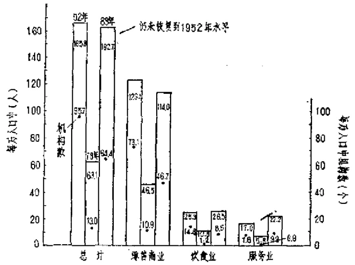
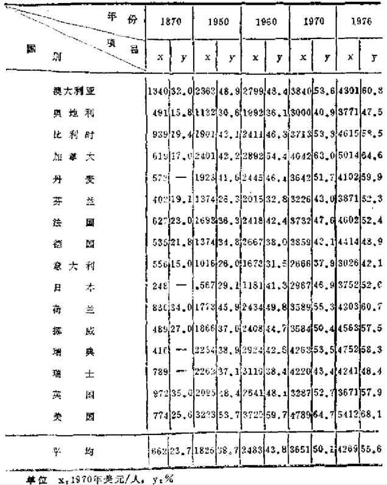
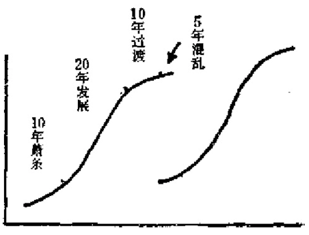

# 第三章 第三业难产

    农不出则乏其食，
    工不出则乏其事,
    商不出则三宝绝，
    虞不出则财匮少。
            ——司马迁

## 3.1 观念冲突的痛苦

  在“进口”的经济学理论中，近年对中国影响最大的要
数“第三产业”的概念。这个概念，一引进来便产生争论。
“第三产业”（Terfidryindustry）最先为新西兰奥塔哥大学
的英国教授阿·格·费雪在1935年的著作《安全与进步的冲
突》中作为与农业、工业区别开来而提出的概念。“industry”
原指工业、制造业等从事物质产品生产的部门，常称为产
业。本应与“事业”概念不同。但有人认为文教、卫生、科
研等事业单位同样创造服务产品，应属“第三产业”。有些人
甚至从“广义服务”概念出发，把政府机关、军队、警察等
政治性机构亦划入“第三产业”范围，因此产生争论。当
然，还有关于第四、第五，第六“产业”划分的意见。不
过，目前已为国际上接受的关于一、二、三类产业是根据对
劳动对象加工顺序来进行划分的。第一产业是指就自然界存
在的劳动对象进行生产的产业，如农业、畜牧业、采矿业
等。第二产业是指对初级产品进行加工的产业，如制造业、
建筑业等。第三产业是指非物质生产，只提供“劳务”的服
务部门，主要是为社会的产品流通，为分配和居民消费，为
科学、文化及治安等提供的劳务。

  不过，“第三产业”概念对现代中国产生的影响不在于这
些争论，而在于这种产业跟大众的生活和整个社会运转效率
关系最密切。当代中国人对此最有感受，而同时，又跟中国
人几十年来的“革命观念”冲突最大。

  这个冲突首先源于对两个重要概念的理解，第一个就是：
“非物质生产”。一、二、三产业是西方理论体系的产物。东
方体系的理论却来源于马克思关于物质生产劳动和再生产理
论，因此把经济部门分成“物质生产”与“非物质生产”两
大部类。这一划分很要命，其后果是马克思当时不曾估计到
的。因为马克思主义的信奉者们极大地强化了“物质第一性”
的思想，自然也把这种哲学概念混到经济概念中来。“非者”，
非也。“非物质生产”因而就一直被当作**从属**的、**次要**的、
**无关宏旨**的、甚至是**可有可无**的东西，这在下面会看得更清楚。

  第二个引起冲突，是来自对“服务”的认识。这是最典型
的非物质生产。最早把“服务”作为一个特定的概念引入经
济理论中的人是英国古典政治经济学创始者威廉·配弟。后
来在萨伊和巴师夏那里，服务成了论证资本主义制度和谐的
主要概念，商品的价值被认为是由工人的劳动、资本家的资
本与地主的土地三种服务共同创造的。工资、利润和地租是
其相应的报酬。到了庸俗经济学者手里，甚至把官吏、嫔妃
和妓女的活动都说成是服务，致使“服务”一词在经济学中
声名狼藉。

  在中国某些“无产阶级革命者”眼里，长期以来，虽然
每天在不停地叫“为人民服务”，但不能说“为顾客服务”。
“服务”就是“义务”，只能有“革命性”，不能有商品性。

  其实，“服务”一般只是指社会成员之间相互提供方便的
一类活动。通常可分为有偿地、直接或间接地提供方便的经
济性劳动服务，以及无偿地、单向或相互提供便利的社会性
服务两种。其中，第一种服务正是马克思在《剩余价值理
论》中批判和研究的对象。马克思甚至提到“对服务的购
买”，“服务的价值”等概念。按照经典的观点，“服务”必须
是“劳动所提供的特殊使用价值”，必须是由经营性活动提供
的、有偿的，必须是可以作为商品来生产和交换的，并且是
为某种活动提供的。按此，能归入第三产业的就是商业、公
共事业（供水、供电、供气、供热）、交通、邮电通讯、城市
建设、卫生、医疗、住房、饮食、修理、文教、科技服务、
信息服务、咨询等有关行业。

  但是，服务的商品性、使用价值和交换价值问题，一直
受到中国正统的马克思主义理论家们的怀疑。“服务”并未被
当作一个特定的经济学范畴来看，而是当作一个资产阶级的
世俗观念对待。他们虽然很难否认理发服务的存在，但却反
对把理发看成是使人的头发在长度和型式上适合顾客生理和
心理特点需要的一种服务。你只要去剪个小平头便可以了，
什么发型？！那是资产阶级腐朽没落的享受思想。至于广告，
时装表演等，更不用提了。说“服务”劳动也创造社会财
富，同样会被认为是错误的理论，文化艺术更成了纯意识形
态领域的一具僵尸，其政治功能被无限制地强化。谁若想提
出个人兴趣、情绪、要求和需要方面的东西，简直是“反
动”了。中国人生活在一个“无欲望”的世界里。有人指
出，《资本论》第三卷第206页（人民出版社1975年版）有句
马克思从社会的角度去考察商品时所说的话：“……欲望之
量如何，便是一个不能不问的问题。在此，我们必须考察社会
欲望的程度，即其分量”，这里德文原文"Bedurtnis"（欲
望）被译成“需要”（德文“需要”为Nachtrage）。[^78-1]按照美国
经济学家萨缪尔森的“快乐”方程式：[^78-2]快乐 = 物质消费 / 欲望，
由于中国人的欲望等于0，所以有“无穷大”的“快乐”。这
到很符合中国人“无欲则刚”、“乐天安命”、“知足常乐”的
传统。只可惜缺少一点现代气息。所以直到1986年，中国服
务业只占总产值的17%，仅相当于典型低收入大国的一半，
而制造业占21%，为一般低收入大国的2倍。

[^78-1]: 《财经问题研究》1985年，第2期，87～88页。
[^78-2]: 我们不会同意这个方程式，因为它的分子缺少精神、生理、环境等因素。
不过，它的分母的表达倒很有意思。

  长期以来，中国维持着一套否定流通过程，以革命口号
代替一切的自然经济体制。商品经济落后，第三产业是不能
不落后的。

  我国的产业结构是东方体系的代表。与西方大体按照产
业出现的历史次序分成第一、二、三产业或加上第四、五、六
产业的体系不同，东方体系就是马克思关于物质生产与非物
质生产两大部类的体系。西方体系还有诸如传统产业与新兴
产业的分法，主要提按产品（产出）新、旧制造业来划分
的。同样，东方体系也有诸如农、轻、重，“三大部类”（物
质，非物质，信息）之类的划分。直到目前，国内流行的有
关教材，主要仍然使用两大部类或农、轻、重的分类方法，
还有农、工、商、建、交、服务六大类分法。也有细分成十
大部门的：物质生产领域包括农、工、建、交、商；非物质
生产领域包括金融、服务、科技、文教、机关团体。其中，
科技部门是1979年全国科学大会后才分出来的。

    中国三次产业的划分
    一、农业——农、林、牧、渔
    二、工业——采掘、制造、水、电、蒸气、热水、煤气、建筑业
    三、流通部门——交运、邮电、商业饮食、物资供销、仓储
        服务部门——
            为生产与生活服务的部门——金融、保险、地质普查、
                            房地产、公用事业、居民服务、
                            旅游、咨询信息与技术服务
            为提高科学文化水平和居民素质服务的部门——教育、
                            文化、广播电视、科研、卫生、
                            体育、社会福利
            为社会公共需要服务的部门——国家机关、政党机关、
                            社会团体、军队、警察

  1982年为适应人口普查要求，并考虑到跟西方体系的可
比性，我国新设计了《国民经济行业分类标准》。但“第三产
业”仍然被看作为一个“资产阶级的用语”而拒绝纳入社会
主义的经济体系中。新的分类“标准”，划出15个大类、62个
中类和222个小类，却只字不提“第三产业”。直到1985年，国
家统计局才明确了我国三次产业划分的必要性，而且表明了
接受克拉特与一些日本学者的理论，以“服务”概念为中心
划分三次产业。其中第三产业称为第一、第二产业以外的
“其他”各业。这个“其他”也充分反映了第三产业划分的
困难。我们作这个回忆，是想说明，接受第三产业的概念，
对中国的许多人来说，是不无痛苦的。新公布的划分如上。
目前中国总算开始强调发展第三产业了，但对许多人来说，
这无疑是非常痛苦的。

## 3.2 严重落后的基础

  中国第三产业的落后，可以从如下的一个比较表（表3.1）
中看到。

### 表3.1 各国就业人口比重变化比较表（%）

--------   --------------   --------------   --------------   ---------------
             第一次产业        第二次产业      第三次产业       第三产业中的商业
--------   --------------   --------------   --------------   ---------------
美国          5.2～1.8         31 ～ 29         68 ～ 70         8.4 ～ 20
                                                            
            (1967～1978)    （1967～1972）    （1975～1982）    （1970～1984）

苏联          23 ～ 21         28 ～ 39         39 ～ 40         
                                           
            （1975～1979）  （1975～1979）    （1975～1979）

西德          5.5                 45              50.5
                                           
            （1979）           （1979）         （1979）

日本           13.9               34              56                25.7
                                                            
             （1975）          （1973）         （1985）          （1976）

中国        81.6～72.5        8.3～15.8           10.29          0.9～13.9
            ～72              ～10.2                            
                                          （1982）          （1978～1983）
            (1965～1979       （“六五”期
            ～1981)           ～1979
                              ～1981）
--------   --------------   --------------   --------------   ---------------

    数据来源：《中国统计年鉴》，《外国科技动态》1982年7期，第58页；《广西
    商业经济》1985年6期，第22页；江苏《国外社会科学情况》1984年12期第22页。

  从上表可以看到，从1965年到1981年，中国第一产业劳
动者占就业人数的比例，16年间只下降9.6%，平均每年只
降0.6%，按此还要117年才能降到美国1978年的水平。

  更清楚的比较可见下表：

### 表3.2 几个大城市糖一、二、三产业所占比重的比较（%）

--------  --------  --------  --------  --------  -----------------------
            年份     第一产业  第二产业   第三产业   其中商业、饮食、服务业
--------  --------  --------  --------  --------  -----------------------
纽约        1982         0.1      16.2      83.7                     46.2

巴黎        1981         0.1      25.4      74.5                     54.1

伦敦        1982         0.1      22.7      77.2                     26.9

东京        1981         0.1      28.7      71.2                     52.8

北京        1982       28.49     41.26     30.25                      9.3

天津        1982        31.22     45.42     23.36                     8.7

上海        1982        25.68     51.04     23.28                     9.1

沈阳        1982        45.99     36.39     17.62                     6.3
--------  --------  --------  --------  --------  -----------------------

（转自内蒙古《经济、社会》1985年5期，第56页）

  按世界银行《1983年世界发展报告》资料，1980年世界
第三产业人口占总就业人口的比重为低收入国家15%，中
等收入国家34%，发达国家56%。世界银行《1984年世界发
展报告》把中国第三产业就业人口所占比重（12%）与肯尼
亚、扎伊尔并列在126个国家的第107位（1981年为倒数第八
位），比老挝、孟加拉、苏丹还要低；第三产业占国民生产总
值的比重更从1952年的28%、1957年的29%、1978年的21%，
降为1983年的18%，1981年世界银行公报各国第三产业占国
民生产总值比例时，中国（20%）占128个国家的倒数第一
位；同年，印度为37%，巴基斯坦为40%，泰国为48%，菲
律宾为40%，新加坡为56%；发达国家平均为60%，美国为
66%。据国家统计局的公报，1986年我国社会总产值为18774
亿。其中，工业11,157亿，占59.5%，农业3947亿，占21
%，其他3670亿，占19.5%，第一、二、三产业产值在社
会总产值中所占比例之比大致为1：3：1。其中第三产业所
占比例，仍远在低收入国家29%的划分线之下，一般发达国
家的相应数在70年代已达60%左右。从农村的情况看，水平
更低。1985年中国乡镇企业总产值2480亿元，占全国社会
总产值的15.3%，占农村社会总产值40%。乡镇企业职工有
6700万（与全民所有制企业职工总数相近），占农村劳动力
18.1%；但其中第二产业职工3900万人，占农村劳动力14%
（1980年为7%），第三产业职工只有2800万人：占农村劳动
力7.7%（1980年仅为3.8%）。[^82-1]

[^82-1]: 《光明日报》1987年1月31日。

  第三产业落后的结果，使中国人在衣、食、住、行各方
面几乎是样样难。衣物品种少，食物粗糙且供应困难。交通
拥挤堵塞，到处叫行路难。住房缺乏，更使人们多年叫苦不
绝。据1984年统计年鉴资料，社会零售商业、饮食业、服务
业机构，1952年有550万个（每千人9.6个）1978年只剩125.5
万个，比1952年减少77.2%，从业人数减少36.2%（每千人只
有1.3个）；1982年有383.2万个（每千人3.8个）1983年有
660.4万个（每千人6.4个），至今未能赶上1952年的人均水平。
又据1982年的统计，全国房管部门直管的房屋每年需要修缮
费11亿元，而实收租金只有4.5亿元，结果全国约有50%的
房屋失修，危房多达3000万平方米。另据统计，建国35年
来全国城镇建成住宅只有11亿多平方米，城市人均住房只有
4.8平方米。到2000年预计城镇人均住房6～8平方米，需
要投资4～5千亿元（按1983年价格计算），平均每年要二三
百亿元。北京的医疗条件在国内是最好的，但每年仍缺急需床
位6万个。据估计全国急重症患者因住不进医院而死在急诊
室的占医院死亡人数的50%左右，全国产科床位10万张，一
年最多可容纳540万人，而每年新生婴儿达1700多万，还有
约500万人要做计划生育手术，全国恶性肿瘤每年发病100多
万例，死亡70余万人，而全国仅有肿瘤病床1.1万张。到1987
年，全国有医师72万人，城市平均每千人只有医师0.7名、
病床2.14张；农村平均每千人只有医师0.5人，国家每年在
卫生事业上投资仅占财政支出的3.25%（先进国家多在10%
以上）。中国城市人口每百人拥有电话机半部，远低于世界平
均百人14部的水平；1981年底，全国城市自动电话只有148
万门，比香港还少；到1986年底，全国市内电话用户也只有
250万户，跟香港差不多。邮政业务1983年比1949年增长38
倍，而机构只增加不到一倍，平均每个机构服务人数达二万
多人（世界平均为三四千人）。中国文化艺术的基础设施之落
后也是有目共睹的。据报道[^85-1]，在建国后的30年间，全国文
化经费只占财政总支出的0.4%，对文化设施的投资只占国
家基建投资的0.2%。80年代以来，除了少数开放地区以外，
这两项经费并无多大增加。直至目前，全国80%以上的剧场
是解放前或50年代修建的砖木简易剧场，且多数长年失修，
已经破败不堪；中国的出版行业更是设备陈旧，污染严重，
至今绝大部分还是手工排字、手工或单机装订，书籍的出版
周期以年计，两三年才能出书的并非罕见。

[^85-1]: 光明日报196年11月16日。

---- page 115 ----

### 表3.3 1983年中国每拥有一个文化生活单位的平均人数

------------    ----------    -----------------------    ------------
项目              人数（人）   项目                        人数（人）
------------    ----------    -----------------------    ------------
电影放映单位          6320     电台                             840万
                             （覆盖率64.5%）

电影放映席位            42     县市有线广播站                    39.1万
                             （覆盖率42%）

剧场                60.7万     出版社                          394.2万

公公图书馆          50.3万      高等学校                       127.3万

群众艺术馆         379.6万      普通高中                         5.4万

文化馆             54.8万       自然科研机构                      11万
                                                         （1980年13,9万）

文化站              2.5万      社会科研机构                    367.4万
                             （教育研究机构只有一个）

博物棺             219.5万      体育场                             3万

文物保管单位          145万     体育馆                            500万

电视台              1971万      游泳池                         476.2万
人口覆盖率59.9%

电话                 202万     疗养院                           16.1万

邮电局所              2万      妇幼保健所、站                    38.7万

信箱信筒             6250      专科防治所、站                    77.3万

邮递员               9091      卫生防疫所、站                    31.3万

城市公共汽车         3020       法律顾问处                       41.5万

城市每公里道路       2941       公证处                           44.4万

农村每公里道路       1266       律师工作人员                      6.5万

县级以上医院         9.8万      公证人员                         14.9万
------------    ----------    -----------------------    ------------

    1983年与1980年相比，妇幼死亡率有所增加，如北京产妇死亡率从1.3‰
    上升为2.0‰，天津婴儿死亡率从10.8‰上升为12.3‰；上海新生儿死亡率从
    6.8‰上升为9.1‰

### 表3.4 1983年中国某些人均费用和活动统计

--------------------    -----------      --------------------    -----------
项目                          数量        项目                          数量 
--------------------    -----------      --------------------    -----------
城市公用事业基建投资          3.8元        观看艺术表演                 0.94次
[^84-1]

市镇维护费                   4.56元        借阅围书                     0.18册

劳动保险费[^84-2]            14.6元        参观博物馆                   0.05次

社会福利费                    8.5元        生活用电                     81.5度

教育费                      12.47元        乘火车                        1次

科研事业费                   6.33元        乘市外汽车                    3.2次

文化广播事业费               1.27元         乘轮船                      0.26次
                          （1982年）

体育事业费                   0.40元         乘飞机                    0.0038次

看电影                         27次
--------------------    -----------      --------------------    -----------

[^84-1]: 全国城市每天因交通事故死亡28.8人，受伤184.7人，因火灾损失55.7万
元，城市自来水普及率88.2%，燃气普及率19.4%。因公路交通事故造成的伤
亡人数此后更急剧增加，到1987年10月，全国每天死亡高达156人（其中城市39
人），受伤518人（城市186人）。参考“交通问题”一章。

[^84-2]: 包括退职退休、丧葬抚恤医疗费，其中医疗卫生费4.88元。

### 表3.6 1983年中国每万人口从事文、教、科、卫工作人数（人）

---------   ------------    -------------------------   ----------
项目          数量（人）     项目                         数量（人）
---------   ------------    -------------------------   ----------
电影               5.25      大学教师                         2.96

艺术               2.46      自然科学[^85-2]                   5.4

出版               2.10       社会科学[^85-3]                0.058

文物               0.20      医师、医士                      13.25

图书馆             0.24      环保技术、业务                   0.15

群众文化           1.04      在校普通大学生                     12

广播电视           2.49 
---------   ------------    -------------------------   ----------

[^85-2]: 其中高级人员0.2

[^85-3]: 指各地社会科学院研究人员。中国社会科学工作者，指高校外绝大部分
集中于此。所以，中国社会科学的研究比自然科学更落后。

    （数据来源，国家统计局社会统计司编《中国社会统计资料》，中国统计
    出版社：1985年版）

（数据来源，问图3.1)

  1985年，国家统计局社会统计司第一次正式公布《中国
社会统计资料》（统计出版社出版），据其中所公布的数据，我
们可以计算和绘制一些图表，从中可以比较全面地看到中国
第三产业落后的基本情况。（见表3.3、表3.4、表3.5、图3.1
及图3.2)

## 3.3 烟业勃起的“奇迹”

  中国第三产业的落后及其导致的严重后果是无可否认
的，无人反对要大力加以发展，问题在于好搞一窝蜂，往往
反而把问题搞坏。现在各地区各部门大叫发展“第三产业”，
一股“工农兵学文，群起办商业”的热浪席卷全国，大有
“全民皆商”之势。过去强调搞“五小”重工业（小钢铁、
小煤炭、小化肥、小水泥、小机械），现在大搞“六小”轻工
业（小烟厂、小酒厂、小棉纱厂、小糖厂、小针织厂、小印
刷厂），乡镇企业与环境污染同时大发展。最奇怪的是，中国
近几年发展最快、不论产量与发展速度均居世界首位的东西
竟是“现代鼠疫”——烟。中国卷烟产量1979年为1,302万
箱（每箱5万支），1986年增为2593万箱，[^88-1]平均每人每年
吸烟1223支（大量的进口烟还未算在内）！烟业现在成了国
家一项重要财政收入来源，在烟叶产地的省份甚至成为主要
财政支柱。有人还在报纸上发文“论证”吸烟的“好处”。却
从来没有人计算因吸烟增加的疾病会使国家增加多少医疗
费，以及究竞损害了多少人的身体。大家一窝蜂发展烟业，
小厂抢大厂的原料和生意，大厂再三投入海外奸商的怀抱，
大笔购烟款被骗的事故一再重演。青年烟民迅速增加，女烟
民亦“不让须眉”，少年候补烟民也已露锋芒，各地电视台却
不断地播放“万宝路世界”的广告，这真成了世界产业发展
的一大奇迹！至于一些油水不多，即间接利益虽大但直接利益
很小的重要的第三产业部门，例如邮电行业（利率只有5%），
却很少人过问，那些价格低，利润小的服务行业更没有得到
投资的保证；目前的财政分级包干体制更助长只重视第二产
业，忽视第三产业的后果。此外，各机关、厂矿建有大量非
商品性、非专业性、非社会化的第三产业项目，包括许多大
礼堂，只供内部使用，自然也损害了第三产业的发展。

[^88-1]: 《光明日报》1987年6月27日。

  中国的计划人员目前正要求一、二、三产业按1:2.4:
2.2的比例发展。[^89-1]但可以想象，这将会困难重重。

  不少人只知第三产业就业人员比例少，产量低，以为只
要提高这两项比例便万事大吉。却不知根本原因在于：中国
长期奉行一种发展基本需求以补短缺的策略，第一、二产业
不发达，流通堵塞，科学技术水平低，市场分散，人口城市
化水平低，消费水平低，可供商品数量少，购买力弱，平均
分配的政策导致消费的雷同结构，使消费具有难以适应的潮
水形式，受传统规念影响大，受人才、设备、管理水平限
制，与第三产业相适应的另一套基础设施太薄弱，资金短
缺，整个产业结构的不协调，对商品生产无经验，往往是
“工业报喜，商业报忧，产品积压，财政虚收”。正是这种种
原因，使得中国的第三产业“难产”。

[^89-1]: 《光明日报》1987年6月21日。

  美菌经济学家查·瑞纳曾根据1964年的技术装备水平整
理的100个国家按每人平均国民生产总值的水平，计算就业
人口在三个产业部门的分配情况：

### 表3.6 人均国民生产总值（美元）

--------  ------  ------  ------  ------  ------  ------  ------  ------  ------
人均国民    50      100      200    300     400     500      800    1000    2000
生产总值
（美元）
--------  ------  ------  ------  ------  ------  ------  ------  ------  ------
总就业人     100     100     100     100     100     100     100     100     100
口（%）

第一产      75.3    68.1    58.7    49.7    43.6    34.8    23.6    23.9     8.3
业（%）

第二产       4.1     9.6    14.8    20.5    23.4    27.6    31.7    33.4    40.1
业（%）

第三产      20.5    22.3    26.5    29.6      33    37.6    39.7    42.7    51.6
业（%）
--------  ------  ------  ------  ------  ------  ------  ------  ------  ------

（转引自《人口学》第165页）

  按此，中国目前第三产业就业人口所占比重应在26.5%
～29.6%之间（近几年实际仅在10～12%之间），到2000年时
应达39.7%，而第一产业应为23.6。这究竟就有多大困难，不
易想象。据劳动人事部1986年的估计，到2000年，中国第三
产业人数约占14～25%，而第一产业人数要从1981年的70%
降为59%。

  我们再看购买力问题。日本从1956年到1979年，商业人
员（不含饮食、服务业）只增加7倍，但工人收入增加11
倍，农民收入增加12倍。社会购买力大增是导致商业人员增
加的主要原因。若按日本的标准计算，中国应有商业人员
1.1亿，需比现有人数增加10倍。但这样一来，由于中国有
支付能力的需求很低，商业人员必会过剩，在农村更为如
此。相反，商业机构中的管理人员现在就应大力精简了。黑
龙江有个市，前几年商业基层单位年盈利57万元，扣除局、
公司、总店等各级管理费后，只剩3万元。[^90-1]中国商业人员
总数1980年比1957年只增加0.65倍，但相应的管理机构人员
却增6.1倍。[^90-2]

[^90-1]: 黑龙江商学院《商业研究》1980年1期，第7页。
[^90-2]: 《社会科学周刊》1983年4期，第56～57页。

  中国人虽然时常为“待业青年”问题而苦恼，却一向不
承认有失业问题。工业先进国家的失业是由需要的不足产生
的，称为凯因斯型失业；发展中国家的失业是由资本不足产
生的，称为李嘉图型失业。中国企图避免这两种失业的方法
就是采取劳动集约型的生产方式。结果，大量劳动力就以
“剩余”的方式，处于“就业中的失业”[^90-3]状态。有人认为，
目前中国工业企业剩余劳动力有1500万人左右，农业剩余劳
动力有约1.45亿人，正好是转向笔三产业的大好条件，这是
倒因为果的想法。剩余、超编，正是效率低下、生产落后的
同义词。在这种情况下，人要想转地转不出来，勉强转出
来了，第三产业也因从业者素质低而发展不起来。事实上，中
国目前农劳动力的转移不仅把农业第一线的一批骨干转走
了，使农业生产受到很大影响，而且已经出现农村工业中劳
动力的增长速度快于固定资产增长速度，致使出现投入产出
减少，百元产值利率下降的棘手问题。以山西阳泉市为例，
1986年每投入1元的产出只有1.8元，而7年前的产出为2.46
元；1986年的百元产值利率只有14.84元，而1983年为16.35
元。[^91-1]

[^90-3]: 在经济学上称这为“隐蔽失业”。
[^91-1]: 《光明日报》1987年6月21日。

## 3.4 没有知识分子就没有第三产业

  按西方体系原来的意义，第三产业主要是指人类社会劳
动第三次分工的产物。发展第三产业的真正含义是如何向社
会提供高质量的服务，特别是渗透到第一、第二产业方面去
的服务和给社会各个方面为产品、资金、信息的流通以及科
学技术、教育管理等提供高效能的服务。尤其是高技术服
务，这是现代发展高技术的一个中心内容之一。高质量的服
务首先是由于高技术的出现才导教的。按美国商业部不久前
列出的十大高技术部门，综合起来只有武器系统、信息服务
系统和化工材料三类。美国农业人口，只占总人口的2%，
但为农业提供的机械、收割技术服务，以及资金借贷、供
销、储藏、加工、运输、保险、市场信息、经营咨询等服务
的人数，却占整个劳动力的10%左右[^92-1]。又如，有人报道，
美国目前约有2700多家咨询机构，人员4万多名，每年咨询
成交额约10亿美元[^92-2]，这恐拍是一个极不完全的统计。美国
在1958年由空军支持的麦特公司是一个非盈利性高科技系统
工程顾问公司，据台湾联合月刊1986年9月号报道，仅
该公司就有5千名员工，其中有3千多名是专业技术人员，
年营业额达4亿美元。1981年美国仅计算机服务业一项的营
业额就超过221亿美元，日本超过8千亿日元，西欧近78亿美
元。比较来说，中国的一般“服务”概念，主要还是指一些
低级的劳务性项目。在中国刊行的《国民经济管理学》（被指
定为党政、经济管理干部培训教材，中国国民经济管理学研
究会编，山东人民出版社，1984年版），第286页讲解“服务部
门”时，说明“大体包括以下四个行业”：（1）洗染织补及
其它消费品的修理服务；（2）对房地产的经营管理及零星
维修；（3）对园林绿化、风景名胜区、环境卫生和污水处
理设施的管理，维护；（4）理发、浴室、旅馆、旅游服务
等。可见主要是指小修小补式的服务业。科学研究被列入与
服务业并列的另一部门。结果科技系统与经济系统脱节，研
究单位对企业的生产技术状况及市场需要，既不了解，也不
关心，更谈不上适应，研究单位与企业间既无共同利益关
系，更无共同命运联系；研究单位偶然提供的技术，往往既
不完善，又缺少生产工艺试验和必要的工程设计，不能直接
应用于生产；研究人员常常乐于只交出思想设想，试样之类的
东西。据一个对目前国内研究单位提供的技术水平的抽样调
表明（见表3.7）：

[^92-1]: 《江苏经济探索》1985年9期，第11页。

[^92-2]: 《丹东经济》1985年2期，第26页。

### 表3.7 中国科技服务水平的一个抽样调查统计（%）

----------------------    --------  --------  --------  --------
科研单位提供的技术水平       一般       不高      较高      有顾虑
----------------------    --------  --------  --------  --------
大企业判断                    77.4      19.6         3      75.9

中小企业判断                    59      28.2      12.8      71.1
----------------------    --------  --------  --------  --------

数据来源，叶丹等《技术成果向生产转移的现状及问题》，《光明日报》
1986年10月3日。

（抽样数：5个行业100家企业）

  国内企业对科技服务的质量充满顾虑。调查还表明，目
前国内大企业所用技术63%是靠本身微薄的力量开发的，直
接从科研单位与高校获得的技术只占6.4%，这甚至比从国外
引进的技术项目（占7.5%）还少。从科研单位与高校转让出
的技术已有75.2%流向中小企业，但中小企业所用技术还有
57%是靠自身开发的，前者提供的技术仅占25.5%。如果考
虑到全国有700多万科学技术大军，属于非独立机构的科技人
员只有15万，以40万个县以上的工业企业计，平均每3个企
业才有1人，以全国工交企业6800万职工计，平均每万名职
工只有22人，中国整个科技系统对工业的服务水平之低，令
人难以置信。更有甚者，这种情况不是搞一下体制改革就可
以改过来的。要求目前中国的科学研究者去注意什么“市场
竞争”、“与企业共担风险”之类的东西简直是不可思议的事
情。这种情况是根深蒂固的。中国要走高技术服务这条路就
必须要有一大批经过规范化、专门化教育的人才，更要建立
各种数据库和专家系统。这种系统，即使现在立即动手，至
少也要用15年时间才能搞起来。根据日本住友电气公司副经
理中原恒雄在日本《技术与经济》1986年8月号上的文章介
绍，要研究一种新技术，首先需要10年，以此技术为基础培
养成一种事业也需要10年，再把这种事培育成公司占有举
足轻重地位的重要部门，又需要10年。中国的技术市场还在
刚开市，而且报道混乱不堪，同一张《光明日报》1986年
12月25日一篇文章报道，1980年只有0.3亿元的成交额，1984
年为7亿元，1985年说有23亿元，1987年4月19日、5月27
日的文章又报道说，1986年有20.6亿元，且还说是比1985年
增加16%。另外同一报道指出，1985年全国地市以上科研机
构通过技术转让、技术服务、开发新产品等取得社会经济收
入只有9亿元，仅占总经费16%。中国人办事，除了搞政治
运劲，实际的动手，都是太慢、太不懂时机的意义。通常光
叫喊，也要五六年，甚至十年、八年。更要命的是一旦动
手，就常常急功近利，好大喜功，却又眼高手低，爱搞假动
作，搞浮夸、虚报的那一套。现在国内各地出现了不少“信
息公司”，“信息中心”，“信息贸易公司”，招牌新、大、醒
目，里面有的甚至只是卖咸鱼饼干、毛巾线衫那一类东西。
这是个典型的例子。如若不信，有心者无妨作一次实地调
查。

  还有一个难题，奈斯比特曾认为，“从农民到工人，从工
人到职员，这就是美国简史”。我们必须认识到，知识分子是
第三产业的真正支柱。关于效益、利润、价值、时间、效率、
市场机制、竞争等观念既是第三产业必需的基本观念，也是
非常需要知识的观念。但是知识分子问题过去积欠太多了，
所以叫了多年，现在所差还多。中国的知识分子待遇低、条
件差、压力大、心情还不舒畅，怨气还是有的。所以，说中
国的第三产业难产，并不过分。

  此外，高质量的服务是以信息化的程度为基础的。如果
中国的信息元年还遥遥无期，电话还打不通，计算机还是十
几万人一部，且还无人会用，教育又总是跟不上发展要求，
再怎么大谈“发展第三产业”也只是一句空话，所发展的只
能是农业时代就出现的街头小摆摊的买卖。这里一个关键问
题是高技术设备的配套配备，目前一些发达国家每个工人占
有的技术设备高达20万美元，我们却在以人均“2万元”（人
民市）计算，要想产生“20万元技术”谈何容易！

  中国的报刊是在1984年9月赵总理的有关讲话之后，才
正式使用“第三产业”这一术语的。据联合国的统计，在世
界128个有较完整统计数字的国家中，中国第三产业一直占倒
数第一到倒数第十几位。“最大限度地满足人民的物质和文化
生活需要”一直只是一句空洞的口号。可以估计，到2000
年，中国的第三产业能够基本上解开经济因果链中不幸地出
现的那个自我服务的死结就算很不错了。托夫勒曾认为，第
三次浪潮到来时，自我服务是会得到大发展的。不过我们必
须说明，先要有一个自我服务的解脱，然后才有自我服务的
发展，中国第三产业发展的第一目标就应是这个解脱。

## 3.5 三大趋势

  我国要发展第三产业必须长期注意研究世界第三产业的
发展趋势和发展战略问题。在这里，笔者认为有必要作一点
强调。

  目前值得注意的第三产业的发展趋势可以归纳为如下三
点：

**1. 三大基本趋势不变**

  第三产业从30年代以来，一直存在三大基本趋势，估计
随着借息技术的广泛发展会一直继续下去，到某个极限才会
停止。这三大基本趋势是：第三产业就业人员比重继续增
加，在国民生产总值中的比重继续增大，发展速度（一般为
5～10%）保持超过国民经济的发展速度（一般发达国家只
有 2～5 %)。

  我们在前面引用过瑞纳的统计表，按该表所示的发展趋
势，估计不会有很大变化。即中国到2000年第三产业就业人
口比重应约达40%。再考虑本章附录的更详细的统计数据，
可以算出各国服务业就业发展的指数回归方程为

    y=1.15x**0.464

  当x=1,000（元）时，y=28（%）。

  这样，我们可以估计2000年我国第三产业就业比重在28
～40%之间。

**2. 新支柱加速发展**

  首先是第三产业原有四大支柱将会继续发展：

  （1）商业向减少环节、多条渠道、加快周转、多级
档次、方便用户的方问发展，特别向高技术等级方向发
展。

  （2）金融继续会成为经济发展灵敏度最高的调节阀。
目前西方体系有两大新动向：几乎所有大企业都向社会发行
股票，一个世界性股票市场正在形成，这会造成进一步依赖
信息技术的局面，把技术转化成资本存入银行投资。

  （3）文教系统向高水平的普及、终身教育、在职教育、
快出人才、出高水平人才、从通才中培养专才的方向发展。
科学技术教育的水平全面提高。

  （4）旅游业的主要选择原则向“方便”发展，而这又
是以高技术水平为基础的。例如现代的交通工具、最灵敏的
通讯工具。一些西方国家职工的旅游费占个人收入已近半。
我国的旅游业如果得不到强大技术力量的支持，其发展必受
严重影响。

  第三产业现在正加快开发两条新支柱：信息业和咨询业。

  信息技术已经越过它最早的两个发展阶段——沿阻力最
小方向的发展与改造旧技术的运用，目前正进入第三个发展
阶段：开发新用途和新的使用方向。特别是在各种检控系统
方向的应用。这会对信息技术的开发形成一股强大的推动
力。例如软件产业。美国1981年的软件产业为27亿美元，
1984年高达100亿美元。估计今后的年均增长率会达30～
40%，到1988年将达300亿美元。目前美国软件公司有3千
家，日本有2千家，西德有4百家。

  咨询业正在世界范围兴起之中。基辛格的公司一次咨询
费就高达30万美元。美国在80年代初就有2,700家咨询公
司。仅一个开始时由空军支持的麦特公司就有5千名职工，
其中有3千多名专业技术人员，年营业额高达4亿美元。但
比较来说，我国的咨询业还非常落后，预测、决策、规
划、发展研究、战略研究等，还远没有什么“产业”可言。
其中，除受认识、政策、社会环境、文化传统等因素影响以
外，一个重要的原因是我们咨询工作的技术工具、手段太
差。尤其是缺乏有效的综合协调技术。

**3. 继续强调创新规念**

  普遍认为，现代发展的一个最大困难是缺乏创新观念。
信息业、咨询业等在某种程度上说也是创新观念的成果。

  对发展第三产业有影响的一些新观念可以举例如下：

  （1）开拓服务概念，发展新产业。原来的服务行业主
要是指为个人生活服务（如零售商业、饮食、洗染、修理、
美容）与公用事业（如交通运输、通讯等）两大领域，这也
是早期所说的第三产业的要内容。后来，开拓了企业性服
务（金融、房产、保险）和保健、教育、管理等都归入“服
务”行业，成了第四、第五产业。这种概念的开拓目前还在
继续之中，新的产业正在形成。例如信息业、知识产业。不
过发展的核心概念在于“服务”的拓展，而不同于具体的技
术本身的发展。

  （2）知识会成为社会发展的重要战略资源，大学——研究
机构——知识部门会成为新的社会中轴。历史上，财产关系、
平等、合理化、商品生产等，都曾经形成为社会发展的中轴
原理，下一个中轴原理会在知识中形成。其中的一个重要原
因在于，知识在现代决策中开始占据主导地位。在这种情况
下，知识阶层的变化动态，特别值得注意。

  有一种理论认为，信息技术产生的一个后果是物质匮
乏，但时间与智慧过剩。于是产生了与时间过剩、智慧过剩
相应的文化和社会。从中派生出的就是一类新的产业——知
识产业。这种产业正在兴起，国内对此已有很多讨论。

  事实上，新近的发展已使“第三产业”的概念变得含
糊。目前没有确切含义的“第三产业”，在美国约占70%，在
日本、西德约占50%以上。因此，日本的堺屋太一提出一种
新的分类法：

### 表3.8 根据对社会做出的再献划分的产业分类

----------    ----------------  -------------------------------------------
货品/领域       生活领域            生产领域
----------    ----------------  -------------------------------------------
①物品产业      农业、制造业      固定资产、生产资料、公共设施建设
➁位置产业     经济、流通、金融   运输、流通、金融、公共事业、军事运输
③时间产业     娱乐、医疗         警卫、服务业、机关事务、警察、公共卫生
➃知识产业     教育、报纸         广告、图案设计、国家信息、军事技术

注：表中仅列代表性产业。各产业按所属领域进行划分。例如制造业中的生
产、经营属①，销售属➁，新产品研制、设计、广告属➃；知识产业
还包括研究开发、印刷发行、摄影、速记、舞台、电影、收录机、电
视机、宣传、电信、信息机器、各种专业服务、商业服务和政府的各
种活动。

  知识产业的兴起是跟知识价值革命联在一起的。虽然，对
后者还有许多争论，但事实上，一些重要的变化确实已经出
现。按照丹·贝尔的说法，现代知识的一个重大变化在1877
年第一次要动员上万专家去编大英百科全书时就开始。
不过，从就业结构的新变化也可以看出来。参阅下表3.9。

  在1976～1985年的10年间，美国就业人口新增1,900万
人，其中第一产业只增加1万人，制造业也仅增10万人，整
个制造业人数还不到总就业人口的20%（1983年），到了美国
建国以来的最低记录。这期间，美国新增就业人口的90%均
属第三产业。但其中，属于商品流通业（包括零售与批发）
和运输业的就业人口增加不多，而大部分新增就业集中在服
务业和广义的信息产业，特别集中于“时间产业”和“知识
产业”之中。美国生产部门的工资一般比服务部门高，但青
年们的职业选择还是倾向服务部门和知识产业部门。这被认
为是他们的美学意识发生了变化，同时也是“知识价值革
命”的一个标志。

### 表3.9 某些国家按人口平均的国内生产总值（x）与服务业在就业结构中的比重（y）的关系

来源: Irving Leveson and jimmy Wiestern Economics in Tranisition
P.46. The Hudson Institute, 1980.

  （3）智力技术正在兴起。方法论的应用发展目前可以
看到三个方向：用于解决复杂系统的管理问题；在各种竞争
中帮助选择战略；变成一种新的智力技术以代替旧的机械技
术。后者就是智力技术新兴的基础。在这里，特别值得注意
的是预测、决策、规划与综合协调技术会成为最重要的智力
技术之一。

  （4）时间与竞争的概念在改变。从面向过去，转而面
向未来不是一件容易的事。因为许多思想方法和原则都会跟
着改变。没有充分准备的人，在这个转变中是可能会碰到危
险的。竞争的情况亦一样。竞争的对手改变了，从自然、人
造自然转向人本身。竞争的问题是同样存在的，但解决的方
法成了问题。竞争不一定是我胜你败了，新的观念要求从整
体性出发。这是信息时代的特点：信息资源是可能共享的，
而且可以在相互转换中共同增值，更重要的是信息环境的整
体性要求：只有保护对方的发展才能发展自己。

## 3.6 七项战略

  我们屡受发展战略失误之苦，今天应该是特别重视发展
战略研究的时候了。

  第二次世界大战之后，英国的战略是保持传统工业品市
场的世界地位，日本的战略是发展高技术产品。结果，导致
两种众所周知的后果。当然，战后两国的情况、条件和环境
不同，但由不同发展战略导致的不同结果，已成了发展战略
研究中的一个重要例证。

  现在，我们可以在许多文章中看到关于第三产业发展战
略的一般研究。例如：

  提高认识，建立“服务”的新价值观；

  调整政策，特别要提高知识密集型产品价格；

  调整产业结构，增大第三产业投资；

  全社会办第三产业，开发第二职业；

  发挥价值规律作用，实行市场调节；

  引导农民向城镇第三产业流动；

  政府设立专门研究机构，实行计划、控制、引导。

  不仿把第三产业发展战略研究的重点归结为以下七个方
面：

  **1. 密切注意技术革命的影响**

  现代发展第三产业的精神是跟技术革命联系在一起的。
关于后者，已有许多论述。对我们探讨过的问题来说，有三个
要点是值得特别注意的。第一是，一场新的技术革命往往会
导致一场新的产业革命，这一点虽然还有疑问，例如原子技
术、宇航技术是否会导致产业革命就有不同意见。不过技术
革命促成产业化革命确已为不少事实所确证，因而是不应忽视
的。第二，近三百年来，几乎每个世纪的七八十年代都发生
一场导致产业革命的技术革命：

  蒸汽机（1780年）——炼矿、纺织（18世纪70年代）

  电气，化学（1872年）[^102-1]——铁路、炼钢（19世纪40年代）

[^102-1]: 1870年合成苯、苯酚、萘等；1872年合成第一个热固性塑料——酚醛树
脂；1873年发现内光电效应，同年麦克斯韦完成经典电磁理论。贝尔选的象征
性年份是1870年。

  电子（微处理器，1971年）——电力、化工、汽车（20世
纪初）

  当然，括号中所注的年代只是象征性的。

  第三，产业革命似乎有个50年的波动周期。周期各阶段
的大致分配如下：15年萧条期，20年大量投资、科技大发展
期，10年过期，5～10年混乱期（见下图3.3）。

  看来，今天我们正进入一轮新产业革命的大量投资期的
开始阶段。高技术的竞争成了全球性赌注。这只要看看最近
关于第五代计算机和超导方面的激烈竞争就知道了。

  **2. 研究需求与消费结构的变化动态**

  通常的研究认为，社会——经济需求有五大特征：（1）个体
需求以社会经济需求为出发点；（2）有历史性；（3）依赖具体条
件；（4）与社会需求有一致性；（5）有大众化习性，特别是与大
众化有利害关系。任何这些特征的变化，都会引起消费结构
的变化，因而要求对这种变化产生的因素、关系和结果进行
分析。

  过去对消费结构的一个权威的解释是恩格尔定律：收入
愈低，食物消费支出比例愈大，现在发现这个定律不够准
确，特别不能解释主要在中产阶级中出现超级消费群的现
象。此外，还有一个问题：信息服务的一个新特点就是大规
模消费化的出现。研究这一个问题是跟下一点相关的。

  **3. 把握信息经济学**

  物质、能源的使用、消耗会导致熵增，但信息的利用却
会导致熵减。这是由信息的特殊性引起的。信息至少有可扩
充、可压缩、可代替、可传输、可扩散可共享等六大特
性。如果再仔细分析，信息还是非连续、非可积、非协调
的。这些东西一旦进入经济学之后会导致什么情况出现呢？
这就要研究信息经济学。例如，信息增值作用的利用，信息
代替制造成为中心所产生的变化，信息技术代替工人的后
果，技术推力如何代替市场拉力，信用信息流代替现金交易
的变革，跨国经济代替一国经济的动态，制度经济重新会胜
于自由市场经济的趋势等等都是值得特别注意的问题。

  **4. 解决资金的等集方法**

  发展第三产业，尤其是发展它的基础设施，需要规模相
当大的长期投资。这就有一个资金筹集问题。

  通常只有三类筹集资金的方法：

  一是从新资源的开发获得意外收入。例如新油田的发现
之类。

  二是借贷。这一条，现在我们也学会了，知道了为求发
展，借贷是必须的，能借到发展资金是一种本领。1986年，
我国内、外债连赤字一起算已达国民生产总值2.2%，比例
跟美国差不多。困难在于自己能忍受多大的借贷风险与利用
贷款的能力。

  三是重新安新开支。这是选择投资方向和比例的策略问
题，对政府部门尤其有意义。按照凯因斯的理论，政府是个
最大的消费者，现在要求政府变成最大的投资者。美国的汤
姆·斯托尼尔在他的《信息财富》一书中对此说得很直爽。
他说，政府的钱是用来支撑衰老的制造工业还是用来扩大高
等教育？庞大的国防费用和建设健康的经济，哪一个更有助
于国家的安全？把钱用来供养失业者、增加监狱费用好，还
是用来训练或重新训练年轻人，然后利用他们来改进运输网
好？这一点，对于我们同样可以提出一大串问题。严重的浪
费、管理不善、官僚主义、重大的决策失误等，都是跟资金
问题联在一起的。

  **5. 加强转向新领域的研究**

  科学技术正在转向一系列的新领域。例如面向天空，开
发海洋，寻找再生能源，发展新材料，开拓生物工程等等。这
些已有众多的论说。问题是要研究相应发生的社会经济的变
化，一个简单的现成例子就是南海油田的开发，其中所需要的
许多服务，国内就准备不足，显得非常缺乏这方面的知识。

  **6. 重新开发第一、第二产业**

  必须认识到，第一、二产业是第三产业发展的基础，为
第一、二产业提供高质量的服务是第三产业发展的一个重
点。我们通常只说，美国农业人口只占总人口的2%，却很
少提到美国为农业提供机械、收割技术服务，以及资金借
贷、供销、储藏、加工、运输、保险、市场信息、经营咨询
等服务的人数要占社会总劳动力的10%左右。

  按照后工业社会的理论，有一个反常现象要出现：象农
业、采矿业等“前工业”的生产活动会重新变得重要。出口
的方向也会从制造业转回初级产品部门与知识工业部门。当
然，技术手段完全改变了。这种情况亦适用于第二产业。目
前汽车工业的改造动态也在显示出这种倾向。

  **7. 发展教育写争夺人才**

  教育本身是第三产业的一个大项目，也是国家、地区发
展的一项关键策略。不少人甚至认为，教育是信息社会成败
的关键。事实上，目前几乎在一切较为全面谈论发展战略的
材料中都提到教育问题。中国人在教育方面，有太多事情要
做了。

  发展教育的一个主要目的之一就是解决人才问题。在这
方面却充满众所周知的激烈争夺，甚至是抢夺。

  美国是人才抢夺最激烈的国家。最典型的例子，可以在
硅谷中找到。硅谷早期最负盛名的仙童公司就是在一场空前
的人才抢夺战中衰落的。硅谷各公司的骨干，大部分是从
“仙童”抢来的。对人才的认识和态度，可以最清楚地反映
出硅谷精神。美国从汽车大王福特到艾森豪威尔时代，对工
业界那些不相信天才，而只愿意依靠普通人的稳健派人物的
偶像或崇拜，在硅谷已经荡然无存。象诺伊斯、豪夫、瓦兹
涅克、乔布斯等都是在硅谷对世界第三产业发展作出非凡贡
献的人。在硅谷，学生打败老师，权威斗不过小鬼，老资格
的企业主不如初生之犊，老练的行家跌落在对办企业全无成
见的年轻人手下。类似这样的例子比比皆是。

  1966年在纽约召开一个电子和电工程师学会会议。主
持人一开始就特别宣布，会议期间不得进行招募工程师的活
动。可是招募活动却在会场外、旅馆里激烈地进行。工程师
们一早醒来，房门口已终挤满招募人员。在硅谷，有些工程
师星期五在这家公司上班，下星期一汽车还是从同一条路开
过去，不过转了个弯便在另一家公司上班了。早期仙童公司
在芝加哥地区的销售战中，发现总输给莫特罗拉公司的一
个见习推销员桑德斯的个人魅力，于是他们把桑德斯抢过
来。以后，桑德斯成了年薪62万2千美元的硅谷风云人物。
在今天，如果人才流动、人才争夺的问题不能得到有效的解
决，任何地区的任何发展战略，最终都会落空。我们在第16
章谈知识分子问题时，还会再详细讨论人才抢夺的实际意
义。

  最后，需要具体指出，我们要发展第三产业，必须下决
心长期稳步发展如下的一些部门：电迅、电子和信息部门；
环境保护、生态整治和国土整治部门；保健和杜会服务、特
别是老年保健服务；文化娱乐、旅游、文物修复、文化财富
的利用；与科学研究、生物工程有关的高技术生产部门，工
业回收，特别是与解脱大城市生态困境相关的部门；山地、
滩涂、草地开发的服务与支援部门；个性化劳动的商品生产
和服务部门。

