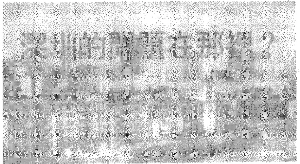

# 第四章 新窗口的纷争

    欲缺鱼者先通水，欲致
    鸟者先树木。水积而鱼聚，
    木茂而鸟集。
        ——《淮南子·说山训》

## 4.1 引进的“补药”治不好消费贫血症

  中国目前开放的主要经济目的之一就是引进。这是30多
年来最得人心的决策之一。

  对中国来说，“引进”远不是新东西。远的不说，建国以
来，我们已有过4次大“引进”的经验。

  50年代，从苏联和东欧国家引进，以著名的“156项”工
程为重点；60年代，从日本、西欧引进技术和设备，合同有
84项，但总成交额只有2.8亿美元；70年代初继续从西方引
进，有个投入43亿美元的所谓“四三”方案（引进43套大型
设备），仍以引进成套设备为主；1976年，我们开始搞第4轮
引进，仅1978年就跟欧、美、日突击签订包括宝钢等22项大
工程的120多个成套设备项目。

  在整个引进中，成套设备所占的比重，50年代为89%，
60年代为91%，1978～1979年为95%。[^109-1]

  从经济效益来说，50年代的引进虽然有后来苏联人撕毁
合同的影响，但仍然是最好的；60年代次之；70年代更次，
而尤以1978年的“洋跃进”为最差。效益似乎一次比一次
差，这已经够人思忖。在打倒“四人帮”之后，国家竟又要
为此遭受重大的经济损失，更可谓咄咄怪事了。

  从1982年起，我们总算懂得了应该以引进技术为主。这
是一个认识上的进步。我们设计了一个引进的经济目标：“高
技术、高效益、高创汇”；“在资金上以外资为主，在投资构
成上以工业为主，在销售市场上以外销为主”即所谓三
高”和“三个为主”的对外开放的经济目标。但实际情况如
何就是另外一回事了。

  中国的文化传统就是这样，常常说得很漂亮，理论上很
正确，没有漏洞，而且很有吸引力。但实际行动却十分差
劲，往往效果不堪设想。然后，又有一套漂亮的新理论出
来，又有一次不力的行动表现。这理论与实际之间的环境、
条件以及种种随机干扰因素，按照中国大综合的文化特色，
是不需要作分析的。

  让我们来看看事实吧。

  据统计，我国从1979年至1984年的6年内，跟国外签订
合同3,605项，共引进外资172亿美元。相当于全国同期基建
投资总额的10.5%。其中，成套设备占80%，单项设备占
17%，而被当作目标之首的真正的技本引进只占3%[^109-2]。

[^109-1]: 《福建论坛》1985年7期，第18页。

[^109-2]: 见《丹东经济》1985年3期，第36页，《福建论坛》1985年7期。

  被引入的172亿美元已用于建设了几十个大企业，改造
了上千个中小企业。说起来是够可观的了，但都是些什么企
业呢？高级宾馆、高级酒吧、高级餐厅、高级消费品、大型
游乐场、高级家用电器。消费、消费、还是消费！

  一位台湾学者曾尖锐地指出：美国舰队敲开锁国200余
年的日本的大门，日本并不认为是耻辱，反而庆幸由于这个
刺激，使日本惊醒。中国则不然，象一个赤身露体而衰老患
病的梦游者，被鸦片战争惊醒后，发现了自己所处的窘境，而
认为惊醒他的人罪该万死。

  这已经是过去的悲剧了。今日中国自己打开了大门，情
况似乎已经走向另一端：被现代物质文明惊醒的中国人，立
即变成拜金主义者，从对一个“红色”世界的迷信，转向对
一个“黄色”世界的迷信，或者说，从对一个精神世界的迷
信转向对一个失去人情味的物质世界的迷信。更可怕的是在
这种大转变中，有些人好像是“存心搞活别人，搞死自己”，
乃至洗衣、洗澡、照像、早点铺，面包生产也争相以引进为
荣。“日本原件组装”现在成了国产货的时髦招牌，却不知这
种免费的洋广告比往日的“出口转内销”更为可笑。还有，
至今仍不断出现的“可乐热”，像什么“春砂可乐”、“崂山可
乐”、“山楂可乐”、“黄山可乐”等不知有多少，最近更出了
个“少林可乐”和“少林口乐”，以崂山、少林之盛名，竟也
自动为“可乐”卖广告，真叫人难以理解。

  说是引进技术，实际是引进消费；说是以引进促进工业
发展，实际是以引进刺激消费水平提高；引进的目标从理论
上的生产方向，一下子指向了实际的消费方向；人人发誓要
“迎头赶上”，个个却一“利”障目，不见泰山，大喊的是“现
代化”的口号，大干的是急功近利的短期行为。我们似乎企
图不顾一切地用引进的大剂量“补药”来医治长期的消费贫血
病。结果是高增长，高投资，高赤字以及人民币的严重贬值。

  不妨看一下广东的情况。这个省引进的外资占全国引进
总数的大半。

  到1984年止，广东引进的收录机生产线57条，年产能力
500多万台；彩电生产线17条，年产185万台，均大大超出市
场需要。此外，广东各地高级宾馆、饭店和旅游、娱乐设施
比比皆是。仅“迪斯尼”[^111-1]式的游乐场就有13个，全部是引
进项目。其中从深圳到广州的路线上竟有7个。还有正
在酝酿、筹建、扩建的，已花外汇近1亿美元。各游乐场的
项目大同小异，对外来客人是“小巫见大巫”，并无多大吸引
力，实际目标完全是对内的。但是，以广州的“东方乐园”
为例，要参加一次全部游乐项目的活动，费用竟高达五六十
元人民币。这不是典型的高级豪华消费吗？目前，不少这类
高级消费活动场所的收入，只能勉强维持职工工资和水电费
开支。更奇怪的是平时冷冷清清的这些游乐场，一到什么节
日，便成千辆汽车，把几万人拉去，仿佛大家一夜之间都成
了钱袋饱满的富豪。细查一下，原来绝大部分是公家解囊相
助。这也堪称“中国特色”：公家从这个口袋向那个口袋掏
钱，大变戏法，然后宣布“形势大好，赚了大钱”。即使在生
产方面，广东的引进也是硬件多，软件少，专利技术更少。
几年来，广东引进的项目95%以上是设备、生产线、流水
线，多为商品加工用。有关资料更残缺不全。既增加引进成
本，又影响吸收消化，效益不高。

[^111-1]: 由美国著名动面片专家沃尔特·迪斯尼设计，以动画片为主题，寓知识于
娱乐中的游乐场。据报道，大型的“迪斯尼”游乐园，到1985年世界上还只有
三座，分别在美国洛杉矶、奥兰多和日本的东京。

  再看福建，这是全国引进的第二大省。1979～1984年福
建以“技术引进”的名义批推引入的有407项。但真正是技
术引进的只有跟汽车小零件（活塞环）、抗菌素和冰箱生产有
关的3项。3项合计金额358.27万美元，仅占引进项资金
总额的1.15%[^112-1]。

  福建这几年引进14条高频罐头空罐生产线，100多台注
塑机，几十台各种针织机，几十台各种冷冻机。终于使福建
工业总产值的增产达到两位数，发展速度名列全国前茅。这
该是大快人心了。可是，且慢快活！

  福建人历来爱拔尖。历史上，从宋代中国人才重心南移
始，由南士出任朝廷宰相的就以福建人为先、为多。这当然
没有什么不好。遗憾的是，福建近年的某些拔尖似带假象。
1977年，全国高考升学“竞赛”，福建搞突击，升学率名列前
茅，一时成为全国榜样。但随后的退学率也是名列“前茅”。
3年前，当全国还在赞赏所谓“深圳模式”时，笔者曾指出
过，深圳式引进存在着隐患，眼前福建的情况与广东一样，
可说是隐患暴露的时候了。

  目前已暴露的一大隐患是：有一大批进企业的产品无
法返销，只靠外汇价差盈利。眼下外汇紧缩，不是赔本维
持，便是停产赔息，或者坐等倒闭。

  让我们引用一位福建研究者夏阳对漳州市6间搞引进的
工厂的一个调查材料：[^112-2]

[^112-1]: 见《福建论坛》1985年7期。

[^112-2]: 参看《福建论坛》1985年9期，第44～45页。

  漳州电冰箱厂、洗衣机厂、酒厂、蜜果厂、无线电一厂
和五厂等6厂引进设备共花163.1万美元。但生产所需的零
部件，从诸如管芯、引线到软包装纸，百分之百要进口，为
此每年要花498万美元。全部产品只能内销。蜜果厂与酒厂
目前靠贷款还债，已欠银行设备贷款130万元，年息9万元，
预计要10年才还清设备费，而目前还要每年花40万美元才
能维持生产。电冰箱厂、洗衣机厂情况亦复如此，以年产5
万台计，每年要花外汇434.32万美元。在这种情况下，自然
外汇流走，并促使地方外汇出现逆差。

  必然要发生逆转的情况是这样出现的：以引进的日本三
菱牌双缸洗衣机为例，按牌价汇率计算1 : 2.83，每台成本
510元（其中需用外汇74.66美元），出厂价570元，有60元纯
利，平均1美元“创利”0.8元。但若用自由调节外汇，每
台的外汇价差162.1元。结果，每台要倒亏102.1元，亏损率
达17.9%，平均1美元要亏损1.36元。象这类引进企业，也
是靠从国家的口袋里掏钱的戏法号称“赚钱”的。

  1985年，上述6厂计划需要外汇498万美元维持生产。
按此，若以自由调节外汇（1 : 5）计算，要亏空466万元。
此项外汇未获批准，结果只能停产，让设备“吃”利息过日
子。

  到1984年10月止，全国已有100多万台收录机压库，微
计算器、电冰箱、洗衣机的市场亦差不多。彩电的情况更
甚。据中国工商银行1984年底的不完全统计，全国41个装机
定点厂引进37条彩电生产线，全部投产后，年产达555万
台，而1985年初，商业部已向国外订购彩电200万台，估计
1985年国内市场至少投入500万台，而需求量约只有300万
台[^114-1]。目前，全国引进的彩电生产线已达10多条。刚冒出
来的黑白机生产线还未站住脚便被自己打垮了。两代机换代
时间之短，成了“世界之最”。然而要知道，以上海为例，
每生产一台彩电需用外汇100多美元，每年维持生产要耗汇5
千万美元。全上海12条彩电生产线，由于外汇不足，1987年
只有7条线在运转。1985年1月25日，香港《文汇报》发表
了赵紫阳在1984年底视察珠江三角洲之后给中央的报告。其
中提到“进口设备、原料、生产‘洋货’内销赚钱不是办法，
不顾一切拿外汇进高档消费品等牟取暴利也好景不常！由
于目前国际上贸易保护主义抬头，竞争激烈，返销产品偿还
外债的办法，前景也不宽广。”问题之严重，可想而知。

  引进的方向问题，远不限于沿海开放地区。最突出的例
子是全国性的汽车大引进。生产性的汽车引进是无可非议
的。但现在，试问哪个机关，哪家企业不以引进小轿车为荣
呢？1987年，一位参加人大会议的汽车工程师，对着北京人
民大会堂前一排排日本丰田车深为感概地说：过去我们都是
驾国产车，自五届人大三次会议以来，我们就一直驾外国
车。1985年进口的外国汽车等于1950～1979年进口汽车的总
数。到1986年，几乎所有的国产车都被更换了，仅江西省，
在1985年9月前的18个月内就进口1,500辆轿车，价值600万
美元。在1985年前后的进口汽车倒卖事件中，都是有大单位
作后台的。

[^114-1]: 参看《经济日报》1985年2月22日、2月5日、4月3日；《信息报》
1985年4月20日、4月24日。

## 4.2 “同床异梦”

  盲目进口的苦果是普遍存在的。问题在于进口任何现代
化设备，只有在技术环境合适时才能跟市场结合在一起。而
我们却过高地估计了自己对引进的消化吸收能力。以为工业
技术的消化吸收是会象人的消化系统一样，只要吞进胃里，
消化吸收便自动进行。却不想，我们是个肠胃病患者。实际
上，我们的技术、组织与管理水平，以及整个社会系统的运
作，是跟我们原来那套陈旧、落后的设备相适应的。我们长
期缺乏质量、效率和大生产的各种严格的要求，缺乏必要的
消化吸收概念，许多先进的设备，一到我们手里就走了
样，再加上能源、交通的困扰及各种配套的社会服务质量
的低下，因此，在许多情况下，我们是注定要自吃苦果
的。

  漳州的蜜果厂和酒厂的引进，原来就有个用4年产品偿
还设备的合同，但后来却因设备运转不正常，加上国际市场
的变化，使产品不能外销而被迫中止合同。唐山陡河、天津
大港，内蒙元宝山3个电厂分别是从日、意、法3国引进
的，相当于70年代的水平，运转正常。但由我们一加管理，
每度电的平均耗煤量就达353.7克（国内的相应数为471克）。
以同类厂计，远比苏联（1979年330克）高，也比意、日、法
等国家高。1980年前，我国引进13套大化肥装置，但到我们
手管理之后，不仅吨氨耗电量远超过国外同类厂，而且我们
的长周期运转只有266天（美国为468天），连印度（超过300
天）都不如[^116-1]。我国从日本引进的30万吨乙烯成套设备，在
同样的装置上，日本的一名操作工每天可生产337吨，我国的
每名操作工只生产144吨。不要忘记我国工人平均技术水平不
到3级的事实，而且按抽样估计约占23%的4～6级工中，
许多是名实不符的，约只有2%的7～8级工大多为文化很
低的老工人。

  武汉轧钢厂设备引进后，动力长期无法解决的例子早已
在全世界传为笑话；四川从日本引进设备建成的维尼龙厂，
投资7～8亿元，但即便把重庆钢厂用的天然气全部移过
去，也不够维持一半的开工用；河南平顶山从日本引进的帘
子布厂投资10亿元，年产13,000吨，产品却至今没有销路。
南京引入外资兴建的金陵饭店长时间无人敢接管，因为即使
把南京全部外国游客、华侨与港澳同胞交由金陵饭店独家接
待，其年床位出租率也达不到50%。上海的宝钢更是举世皆
知的中国引进的一大事故。

  我们的企业管理人员数量大、外行多、扯皮多，管理手
段落后，水平低，职工人数多，技术素质太差，事故多。这
些，对引进吸收都是大障碍。例如，一个年产30万吨合成氨
装置的化肥厂，美国只有职工50多人，我国却有近2千人；
有个引进现代化装置的电厂，职工人数多达1,112人，其中
运行人员只有193人，占总数17%，而行政管理、基建、农场
等有387人，占总数35%。而且先进设备引进后，人员有增无
减。国外以10人一天可处理的同一类装置的同样事故，我们
却要100多人用7天时间才能解决[^116-2]。

[^116-1]: 参看天津经济学会1886年年会《论文选》，第124～128页。

[^116-2]: 同上。

  我们引进用人少、效率高的先进设备，却又要继续推行
低工资、多就业，听任低效率运作的政策。只知引进先进设
备，不知自己的老底是什么，这便使先进的设备与落后的營
理成了一个死结。

  据说外国的许多大企业是以“专业协作”方法来进行组
织管理的。于是我们便引入这种方法进行改革。不料也是
“此路不通”。例如从美国引进设备的大庆化肥厂。原有职工
1520人，按“专业协作”原则改革后，把所有辅助车间、
文化服务单位等划归大庆化工总厂，并进行了许多精简，使
职工减至315人。可搞了一年多，产量下降了，麻烦增加
了，连饭都吃不好了。不少人光分“专业”，不协作。现在又
不得不改回去。有些把维修队交给总公司后的企业，最后不
得不又要成立自己的维修队。

  这种情况反映了中外思想原则、社会结构和传统背景的
重大差别。

  中国人“大而全”的传统思想是从“万事不求人”的原
则中产生的。这种原则的一个必然推论是“万事不管人”。有
时为了自己能够“不求人”甚至不惜去拆人家的台。这种情
况是十分奇特的。西方人强调个性的独立，但很懂得跟别人
合作；中国人缺乏自己的独立性，但却非常不善于跟别人协
作。在西方的一些大学的外国留学生中流传着一种说法：如
果跟一个中国留学生竞争，他们很害怕；如果跟两个在一起
的中国留学生竞争，他们就不那么害怕，如果跟三个在一起
的中国学生竞争，他们就放心得多了。原因很简单，在一起
的中国人多半是要闹矛盾、要互相扯皮的。中西方人性格的
特点，也许是一条关于人性互补原理的表现。中国要获得专
业协作方面的成功，非要改变国民的劣根性不可。

  我们还有一些以往形成的组织管理方面的落后思想，今
天也要自吃苦果。工业化国家的同类企业大多集中在一起
以便于互相竞争、便于专业协作、便于发挥经济效益；我们
的企业分布，首先考虑的却是政治、军事因素，然后象分猪肉
似的见者一份。如同期引进的3大化肥生产装置就是一省
一个分布的，平均主义的狭隘观念得到相当的满足，效益却无
人考虑。此外，我们强调挖潜补旧。于是搞了一个庞大的补旧
维修班子。但工业化国家却强调加速拆旧，主张更新性维修。

  我国的引进管理十分奇怪。科技发展规划由科委制定，
技术引进工作却由经委、计委提出。所谓“管理”，往往只是
项目审批，并无消化、吸收方面的相应管理程序，立法管理
就更谈不上了。大规模的出国技术考察团，多数属于观光与
采购两类。“采购员”可以花大批外汇去购货进门。甚至门
把、螺丝刀、台凳、便盆都可以购进。但东西回来后，属技术
消化、吸收、开发的，再也不给你一分钱，更不会给一个
人，宁愿让它烂了、掉了，再去买一次。

  谁都知道，要有自己的特色，在引进工作中，关键在于
消化、吸收。日本人早期的成功，不在于单纯的“引进”，而
正在于花大本钱搞消化、吸收。许多评论家都指出，老舍深
受希腊悲剧、但丁、康拉德，斯威夫特、狄更斯、肖伯纳、马
克·吐温、果戈里、契词夫等人的影响，老舍之所以成为有
典型民族风格的作者，全在于消化吸收。天天叫喊要有“中
国特色”却不肯在关键的地方下功夫动手创立自己的特色。
这又是中国人“君子动口不动手”的一大特色。

  1985年7月16日的《人民日报》提到，有个部门到1985
年上半年止，出国人次达4000多人。我们甚至还派了一个
“公园门票考察团”去伦教考察公园门票。过去一个唐僧去
印度，取来了真经，也有人写了西游记，现在那么多人去
了全世界，不知道都干了些什么，又取回了多少“真经”！

  出外能当个称职的采购员的就算不错了，可情，往往连
这点也做不到。有人跑到欧洲某地引进了啤酒生产技术，但
当地的人却爱喝青岛啤酒；1985年上海从日本引进生产豆腐
的设备和技术，我们还专门派了一个“豆腐考察团”去法国
考察豆腐，竟不知这是我们的国粹，结果是价贵质异，无人
理睬；西安一家工厂从英国引进的新设备，其中有一种卡尺
上面竟刻明“中国制造”，且正是陕西货，售价不过63元，引
入价却是400元（人民币计）。

  美国的一个著名的战略研究机构曾估计中国利用外资的
安全限额在1000亿美元左右。要到1500亿美元才达“危险
点”，即可能蹈波兰、巴西债务危机的覆辙。但事实上，从
1979年7月颁布《中华人民共和国中外合资经营企业法》到
1985年，外资的实际投资也只有16亿美元，协议投资中直接
投资的只占44%，大部分还是1984～1985年的开放狂风中引
进的，而到1986年，外国投资只有33亿美元，比1985年下降
50%，1987年继续大幅度下降。至今未有回复上升的趋势。
而且大部分外资来自香港。据到1984年6月止的统计，开放
6年所入的370多个企业中，有81.7%是来自香港的。引进
外资的结果远不如南美，更不如亚洲的其他一些地区。到
1987年，在全部合资、合营企业中，约5%为酒店业[^119-1]，其
余多为中小型企业、劳动密集型企业，生产型、知识技术
型、非侨资的大企业少。

[^119-1]: 北京《理论信息报》1987年4月13日；美国《商业日报》1987年6月21
日；《法兰克福汇报》1983年3月29月；香港《明报》1987年6月21日。

  中国这么大一个市场，投资障碍已经拆除，又加上被认
为是慷慨的税收规定，却总引不动外国的大财团。正如西德
人所说，中国人“徒劳地等待着他们所希望的一次投资浪
潮”。这究竟是为什么？必须指出我们在税收方面对外商所作
的一般很宽的规定，实际作用不是很大。目前正式生效的只
有中日、中英税收协定，即只有日、英企业家在某种条件下
可从税收的饶让协定中得到好处，其他国家的企业家在中国
得到的税收减免优惠却要在其居住国补缴。

  根本的困难在于目标和风险。这两个问题。在1985年3
月25日至30日在杭州召开的利用外资问题的国际学术讨论会
上，有非常有有趣的反映。

  中国对外经济贸易部外资管理局副局长初保泰在上述杭
州会议上的发言，一开头就说：“尽可能地多利用一些可以利
用的外资，并且使每一笔外资都获得尽可能好的实际效益，
这是中国企业家和向中国投资的外国企业家的共同愿望”。

初保泰的这个讲法是一个漂亮的大综合。可惜这个“综
合”，把最根本的一个差别掩盖了。这就是，获得效益的那个
“愿望”虽然相同，但获得效益的方法就不是那么“共同”
的了。而且，简直是相悖的，是最清楚不过的“同床异梦”。
外国人想要的是中国的市场，他们是为赚钱而来的，我们却
要他们把技术、管理和资金带进来，帮助中国人创汇。这个
矛盾，是难以调解的。从目前情况看，中国人最终不得不实
行“以市场换技术”的政策。事实上，“外销不如内销盈利”
早已是大部分三资企业（中外合资、合作、外商独资）的“自
动调整”方向，而这却又是非常危险的。不知政府部门研究
了对策没有。

  正如我们在前面说过的那样，在引进的目标方面，不仅
中外相悖，而且国家宏观目标与企业的微观目标也难以协
调。

  在同一个会议上，中国的一位学者说：“在发展中国家
中，非经济性风险在中国是最小的，没有哪个国家能比得
上。”国外学者当场纷纷摇头。

  这性事反映了我国某些学者的一大特点。长期爱讲政治
神话而对专业知识却并不精通。以为开放方针既定，非经济
风险就没有了，这至少是对系统可靠性问题缺乏了解。一个
企业的非经济性的环境风险可能要用上百个指数才能表示。
种种条件往往只要有一个不得满足，种种压力往往只要有一
个不能承受，整个企业系统就可能跨台。

  现实地说，中国的投资环境是相当糟糕的。并且可以预
言，中国的投资环境的因素在相当一段时间内仍将趋向恶
化。原因是，尽管中国会采取措施改善投资环境，但改进的
速度将慢于开放的速度。中国3多年来的经验就是这样，只
要看到一个目标，就拼死拼活地埋头向前走，却不想前面可
能有一条弯路把我们引到最初的出发点之后。

  外国企业家在中国的营运可能会碰到这样的风险：既无
知又骄狂的官僚主义者对经营管理的过多干预，有可能使投
资者失去管理控制权；无法预测象能源、交通、材料、工程
技术力量等第三合作者的变化动态，无法掌握政出多头的，
非市场机制的限制政策；利润汇出的难题仍未知可以用什么
方法解决；决策程序过长可能会使企业失去机会；技术人员
与工人的技术水平低，会降低生产效率、提高生产成本，直
至到企业不能容忍的程度；特别缺乏工程综合和系统协调等
领域的专门技术，缺乏有力的中层管理干部。

  我们应当老实承认，在中国投资的非经济风险可能比北
美、西欧及东南亚的某些地区大。只有认识到这一点才能下
决心改善投资环境。事实上，目前已有一些外资正在考虑撒
回资本的问题。美国1986年6月6日的《华尔街日报》以
美国公司敦促中国改变政策，否则有失去外国投资的危
险》为题，报道了由美国企业管理人员和美国政府主管商业
的官员起草的一份交给中国的文件。其中提到美国人投资的
种种条件、权利和要求，反映了他们的一种强烈的不满态
度。中国人在本世纪所剩时间内的一个困迫的任务，就是学会
如何实事求是地、公平、合理、方便、经济地跟外国人打交道。

## 4.3 莫名其妙

  如果说，我们的引进工作不得力，特别是靠用外汇价差
来大量引进高级消费品是个不可理解事情，那么，我们在出
口政策方面的表现，更加令人莫名其妙。

  以外贸“王牌”广东为例，从1979年起，外贸3年翻了
一番，不可谓成绩不佳。不料，却是“好景不常”。自1981年
起，换汇成本逐年上升，外贸亏损一加再加。1980年换汇成
本低于2.8元，一年之后，升了5.97%，1983年比1980年又
升了32.84%。结果，出口越多，亏损越大。1982年的出口
亏损额比1981年增加9.7倍，1983年比1982年又增加90%，竟
被迫实行出口萎缩政策——从1982年至1984年出口额逐年比
上一年减少2.02%、13.46%、34%[^123-1]。又一个可怕的脉动！
1984年全国出口额仅占全世界出口总额的1.25%[^123-2]实在与泱
泱大国太不相称。萎缩之快与增长之快同样惊人，这在当今
世界性的“奖出限入”外贸政策的潮流中，算得上一件咄咄
怪事了。

  根本的问题，在于产品质次、档低、品种少、升级慢、
售价低、竞争力弱，设备陈旧，技术落后，经营管理差，应
变能力小。统购包销的僵化体制，先是造成生产报喜，外贸
报忧，生产吃外贸锅里饭的怪状；权力下放后，各省市又出
现竞相压价的怪状。仅广东就为此平均降价30～40%。

  管理方面更是“妙着横出”：大量增加亏损商品的出口
（1982年为60.08%，比1979年增加21.8%），减缓资金周转率
（1983年为1.4次，比1981年少0.35次）[^123-3]，中间环节不断增
加、履约率低、商情调研工作无人过问，官僚机构继续膨
胀。一些干部水平之低，责任心之差，官僚架子之大，私心
之重，无以复加。再加上税收方面的压抑性政策（加工越
多，征税越重，亏损越大；出口成品不如半成品，更不如原
料直接出口），实在使人更加莫名其妙。

[^123-1]: 见《暨南学报》1985年1期，第19页。

[^123-2]: 《经济与杜会发展》1985年2期，第7页。

[^123-3]: 见《暨南学报》1985年1期，第19页。

  在中国的外贸出口结构中，农业原料产品和加工产品
（包括纺织品）长期以来占出口总额约2/3，这是影响出口状
况的决定性因素。石油、化工产品、机器、运输设备和其
他产品出口只占出口总额的约1/5，按国外一些预测专家的分
析，中国农业生产相对缓慢的增长和提高国内生活水平的需
要，会在相当长时期内限出口能力的提高。不过中国人做
事情往往不是以种种条件的分析为依据，而是以自己的某种
意愿为依据的。据1985年的一个资料统计，近6年来，我国
外贸总值年平均增长23.5%，其中出口增长率为27%，进口
增长率为21%[^124-1]。这似乎成绩甚佳，其实不然。我国出口商
品中低中档商品、农轻产品、生活消费品、传统商品、一般
商品、小价值商品多，高精技术商品、重工业产品、生产消
费品、创新商品、名牌商品、大价值商品少，这种局面，始
终未能改变。

  让我们来看一个有意义的例子：黑龙江省年产成麻
32,000吨，却只搞一间麻纺厂，每年生产亚麻细布只能“吃”
成麻7,000吨，其余以每吨4,773至4,997元高价收购，却以
1466元、2258元人民币低价出口。这样，出口一吨就要赔
2739～3307元，即每年全省要赔七八千万元；另一方面，国
家亚麻细布不足，不得不以每米8.4美元高价进口。若不出口
成麻，每吨可纺2000米亚麻布，价值可达16800美元，一出一
进之间，价格相差达10倍以上[^124-2]。

[^124-1]: 湘潭师范学院《社会科学学报》1985年1期，第95页。
[^124-2]: 《未来与发展》1986年期12～14页；《学习与探索》1982年1期18页。

  这种情况，虽然人人心中有数，也不断有人提批评，
但不仅没有什么改善，却反而愈演愈刻，就以苎麻为例，世
界产量83%在我国，本是“奇货可居”，但占我国苎麻产量和
出口量40%的湖南，一直在“打内战”。湖南士畜产、纺织
品、工艺品三大进出口公司，竞相抬价抢购、压价出售，不
惜以血本换汇，造成严重亏损，迫使麻价疯涨，自己搞乱了
自己的市场，盲目刺激生产。1987年7月，新华社记者作了
专门调查，1984年以来，湖南苎麻产品收购价，每担苎麻从
119元5角涨为620～650元，质量却严重下降，杂、假、霉、
烂照收无误，收购每米棉麻布已从2.5元涨到8元，纯麻布从
3.23元涨到8.9元，36支苎麻纱从每吨1.9万元涨到4.2万元；
同时，出口棉麻纱每吨由4100至4300美元降为3300美元，并
相互封锁消息；结果，使每出口换汇1美元的成本，从1984
年的2元4角5分，到1986年涨为3元9角5分，到1987年
1～6月更剧涨至7元7角到8元。仅仅6个月，湖南外贸
净亏损1亿7千761万元。其中60%是苎麻出口的亏损。为什
么会如此使人莫名其妙呢？原来，外贸部有规定：换汇任务
的指标是“硬”的，换汇成本指标却是“软”的，即使超过
核定换汇成本，照样补贴。

  有一个事实更为可怕。据新闻界报导：上海1983年进口
20万吨钢坯，每吨211美元；出口20万吨钢材每吨202美
元。计损失进出口差价180万美元，财政补贴3000余万元。除
此以外，还要耗损远道运来的当量等于10万吨标煤的能源，
挤掉港口50万吨的宝贵吞吐量，尚不计水资源的损耗和大
气、河流的污染。为了取得在工业产值上增加1.2亿元的表
面效果，却要国家承受如此巨大的损失！杨纪珂在提到此事
时还指出：“闻1984年上海物资局仍然计划进口20万吨钢坯，
外贸部门更把钢材出口计划增加到25万吨，希望不是事实，
不能设想到本世纪末竟会在这个钢坯来料加工为钢材的项目
上把国家的经济损失随同部门产值和指标一道翻两番”。[^125-1]有
关部门决策人不知对这一令人痛苦的呼声作何感想！

[^125-1]: 《经济与社会发展》1985年3期，第24页。

  由于进口无度，出口不力，外汇储备锐减，结果1985年
的外贸逆差竟达137.8亿美元[^126-1]，相当于出口总额的52.08%。
加上“翻两番”口号的一般号召所掀起的追求超高速增长的
狂热。更给国内原材料、半制成品造成一种压力，这种压力
又进一步刺激进口需求。在1984～1985年我国开放高潮的一
年间，外汇流失了70%[^126-2]。香港学者陈文鸿在最近发表的题
为《中国外贸反映的严重问题》中，分析了大量的事实。他
尖锐地指出，中国进口导引的工业发展战略已变成“进口工
亚化”了[^126-3]。

  这一切，终于导致1986年7月6日中国人民银行行长陈
燕华实然对外宣布人民币对各国货币汇价下调15.8%。希望
以这种人民币大幅度的贬值来刺激出口贸易，遏制外贸逆
差。目前，舍此已无他法。但前景如何，是否会继续出现出
口愈多赔钱愈多的怪现象，还要拭目以待。据外贸部的计
划，到2000年，我国进出口额也要翻两番，达1,600亿美元，
年平均增长率为7.5%。如果赔血本出口“跳楼货”的怪事
不能解决，想起来是使人不寒而栗的。

[^126-1]: 香港《文汇报》，1986年1月22日。
[^126-2]: 《理论信息报》，1987年4月13日。
[^126-3]: 《广角镜》，161期，1986年2月。

  出口问题的困境还跟基地不足，基础设施落后，人才奇
缺有关。我国到1986年，以外贸部门为主，共建33个出口商
品生产综合基地，98个单项出口商品基地，198个出口工业品
专厂或车间。这些基地提供的出口货源，仅占年出口量的
30%左右，保证系数相当低，离70%的要求很远。加上各种
交通工具、电讯以及生活设施的不足写落后，由此导致不能
签约、不能履约、误期、压价、返销事故不断；外贸专家由
于长期没有培养，现在更难以寻找，外贸人才在国际市场上
的分布还谈不上有什么比率，使许多市场未能开拓，更无力
在国外建立跨国公司。

## 4.4 特区问题大论战

  1979年，当中国人第一次听到要设立“特区”时，十分
惊讶。虽然这个概念已经有400多年的历史。

  从意大利西北部热那亚湾的港口来亨（Leghorn）在1547
年定为自由港起，到1980年，世界上的特区以自由贸易区、
自由工业区、自由关税区、自由港、对外贸易区、加工出口
区、促进投资区、科学工业园区、保税仓库区、自由边境
区、过境区等名称，已发展到350多个。中国以“经济特区”
名义作了一个新创造，引起了世界性的反响。

  中国人初办特区，以“新事新办，特事特办，立场不变，
方法全新”为口号，原意十分好。只是不要忘记，3多年
来，我们每有一个口号，原意都是十分好的。可是最后，我
们都受只讲精神、意愿、想象，不讲条件、方法、步骤之
害。作为特区之尊的深圳，基本上还是以过去那套大叫大喊
的抓典型、拔尖兵、不惜血本树样板的方法来搞的，虽然内
容与形式己经不同。深圳的高楼大厦树起之初，神气之极，
时髦之极。深圳效率，深圳速度，特区人，一时盛赞不绝。
全国上下，数以千万计的男女老少，千方百计蜂拥去深圳。
不少昔日带“红宝书”北上大寨朝圣的人，今天又千方百计
弄点港币或兑换券去沙头角染一点洋气。我们不知道世界上
还有哪一个国家肯付这么大的费用，把千万人送去参观一个
穷山沟，或者去看一眼不过两三条街的高楼大厦。

  1984年5月间，深圳市梁湘市长在全国六届人大二次会
议上介绍深圳特区的建设成就。各地报纸以《四年国民经济
总值超过过去三十年的总和》为大标题作了报道。说1983年
深圳工业产值达6.73亿元，为建特区前29年总和的10.7倍。[^128-1]
这相当于说一年等于310年！似乎又创下一个“史无前例”。
那时不少人还在大唱“深圳模式”之歌。如果经济建设是这
么简单的事情，人类就没有那么多痛苦了。

  同年11月在深圳召开的一次全国特区发展战略问题会议
期间。笔者和许多与会人员多次议论了深圳的“样板方式”
潜伏的危机。可惜当时，对深圳“巨大成功”的宣传正在沸
腾之中。按中国人的习惯，在这个时候是不能说半个“不”
字的。说了也等于白说，无人理睬。

  是的，深圳工农业总产值1983年比1978年增长5倍，工
业总产值增长12倍。这种情况，不能用普通的“惊人”两个
字来描述。这是一种特定的时候、特定的环境、特定的条件
得到奇妙结合的狂热发展。其背后的原因，带有神奇的色
彩。那是只有习惯于搞样板的中国人才搞得起来的。几十年
来，每当中国人要搞一个样板时，有谁能说一个“不”而
不受惩罚呢？

  没有想到，事情逆转得那么快。几个月之后，忽然爆发
出一场以“深圳的经验是成功还是失败”为中心的特区问题
大论战。

[^128-1]: 《广州日报》1984年5月19日

  首先发难的是香港大学亚洲研究中心陈文鸿博士的一篇
文章《深圳的问题在哪里？》（下称“陈文”）

（转自《广角镜》189期1988年6月）

  “陈文”搜集了大量数据，说明了一系列问题：（参阅下
表4.1)

  首先深圳的发展速度是靠大量的基建投资才产生的。例
如1983年的工业总产值7.2亿元[^129-1]，其中建筑业的产值占6亿
多元。深圳5年半里建筑业以外的工业产值只有2.3亿元，其
中1983年就占1亿多，成绩并不佳。

[^129-1]: “陈文”数据是有出处的，跟梁湘报告的数据不同。这里引原文数据。

  其次，深圳的社会商品零售总额不断超过工业总产值。
1979年，深圳的社会商品零售总额比工农业总产值只多1百
多万元，相差不足1%，1980至1982年的情况也差不多；但
1983年就多出3.8亿多元，超出近50%，比工业总产值高出
5.3亿多元，达74%；1984年上半年，又超出工业总产值3.1
亿多元，为56%。另外的资料说明，1984年深圳的工业有一
个大发展，但所占国民生产总值的比重仍不及1/4[^130-1]。这与
“以工业为主”之说明显偏离。深圳1983年的人均社会商品
零售总额（按包括流动部分总共30万人口计）高达4170元，
远高于上海（912元）、北京（896元）、广州（504元）。这主要
是每天达一二万人的内地顾客创造的奇迹。深圳表面的繁荣
主要就是依赖这种由特殊政策造成的通过转口贸易大赚国内
人的钱而来的。不过谁都看到，这决非长久之计。

[^130-1]: 香港《广角镜》152期，1985年5月，第58页。

### 表4.1 深圳市的经济统计（1978年至1984年上半年）单位：亿元（人民币）

------------   -------  ------  ------  --------  ------  ------  -------------
                1978     1979    1980    1981      1982    1983     1984上半年
------------   -------  ------  ------  --------  ------  ------  -------------
工农业总产值      1.7    1.4631  1.8924  3.4-3.7     -     8.7041         -

工业总产值        0.6    0.6061  0.8444  2.4283    3.6213   7.201       5.55

农业总产值      0.87009  0.8570  1.048      -      1.35      1.5          -
                                                  /1.41

基本建设投资       -     0.4988  1.2487  2.7089    6.3265  8.8593       6.03

实际投入外资       -      1.2      2.5     5.9      8.8      11.3       5.9
单位亿元港币

地方财政收入      0.2     0.35    0.55    1.18/     1.63    2.95      1.9
                                          1.3

地方外汇收入       -      0.28   0.4747  0.4-0.61  0.5638   0.67      1.05

社会商品        1.17     1.48    2.3      3.5      5.54    12.51      8.61
零售总额
------------   -------  ------  ------  --------  ------  ------  -------------

    出处：
    《人民日报》1981年3月29日，页5，4月4日。页2
    《财政问题研究》1984年2期，页16～18；
    《南方日报》1983年8月14日
    《经济日报》1984年6月27日。页2
    《深圳特区报》1983年1月8日，页1；1984年4月8日，页2；
    1984年5#19日，#1，21984年月8月，#1，1984年8月
    20日，页1，1984年9月13日，页2；1984年10月14日；
    《学术研究》1982年4期，页28～32；1984年4期5～11，12～16，
    《统计与预测》1982年1期
    《中国经济特区年鉴》1983年，页145～149，428，637～656
    《港澳经济》1983年1期，页66。
    （以上转自《广角镜》149，1985.2，第49页）

  再其次，陈文的数据表明，深圳的基建投资，并非以外
资为主，外资所占比重，只有30%或更小，且有逐年下降趋
势。1983年深圳内联企业的产值占全市工业总产值的82%，
远比外资企业的比重高[^131-1]。

  有趣的是，我们一方面为引入外资不够理想苦恼，另
方面日本向我国提供的一笔约1660亿日元的贷款，到1982年
初，我们只动用3亿日元。为此我们要向日方支付8亿日元
（约合40万美元）的延迟使用手续费。

  1983年深圳的出口值5900多万元，只占全市工业总产
值的1/12，且多为食品果菜，工业品很少。即使包括经深圳
向外出口的国内产品的总值也只有1.2亿美元。而深圳的进
口为6.4亿美元，入超达4.84亿美元。“以出口为主”之说显然
更不能成立。

  据另一个报道，从1979年到1983年，深圳的“工业生产”
（有严重偏向）增长了10倍，而同期，香港对中国的出口增
如了9.6倍[^131-2]。这是一个很有意思的对照。

[^131-1]: 香港《文汇报》，1984年1月9日报道，仅中央各部委在深圳的投资已达16
亿元人民币，各省的投资还未计在内。而深圳至1983年底止，全市基建总投资只
有19.6亿元人民币。

[^131-2]: 《现代经济译丛》1985年第3期，第3页。

  如果因为什么原因，关于深圳问题的各种数据有混乱，
那么到1987年，我们便看到较为可靠的公布数字：深圳特区
“六五”期间，基建投资64亿元。其中国家投资约占3%，
各部与各省约占11%，国内贷款约占30%，财政拨款与贷款
约占13%，自筹与内联自筹约占23%，而利用外资仅约占
20%[^132-1]，比“陈文”估计的还要少。这样，每引入1元的外
资，自己实际就要补入4元（“陈文”只估计为2元）的资
金。使人百思不解的是，直至1987年8月，在深圳大学举办
的一个全国性关于发展战略的研讨班上，当地的一位领导致
开幕词时还说：“你们都看到了，中央只给了深圳两个亿，刚
好够搞那条铁丝网，其余都是开放得来的成绩。”这种说法，
使笔者当场大吃一惊！

  更妙的是，深圳的一些产品，如家电、尼龙布、服装、
雨伞等，竟是从内地出口香港，通过奇妙的价格差作用而倒
流回来的。有些上海人跑到深圳买了一把折骨伞，发现竟是
从上海送去香港又转回深圳的。上海人很商兴，说比在上海
买少花了几块钱，深圳人也高兴，说赚了几块钱，香港国货
公司也高兴，同样说赚了几块钱。真不知是谁见鬼了！由香
港流入深圳的资本有相当一部分原就是中国的资本。深圳也
在变自己赚自己的钱那种戏法。

  阿凡提到井里捞月，让绳子钩住摔了一跤，仰头一看，
明月正挂在天上，便自以为是自己捞上来的。深圳不也是有
点阿凡提的味道吗？

  以4倍于外资的代价在一片荒野之中树起来的深圳，得到
一个与原来“三个为主”的目标相左的结果。难道我们能用
这种方式来“开放”整个沿海地带吗？深圳最初几步的成功
与否便成了一个大问题了。

[^132-1]: 《投资与建设》1985年5期。

  “成功”或“失败”是个十分复杂的概念。但对这种问
题，我们不能满足于模棱两可的那种“复杂”的答案，而应
该就具体的条件和情况作出肯定或否定的回答。可惜，特区
成败问题的大论战被学者们引向名个方面。而大多数反对
“失败”说的人都离开了原来讨论的范围，把问题引向社会
效益、杜会成本和试验作用、窗口作用等方面，而置原来的
主要目标于不顾。事实上，象“开放窗口”这样的社会效益
并非一定要用深圳的“模式”和代价才能取得。

## 4.5 欲致鱼者先通水

  最有意思的是，官方也在严肃地回答深圳的“成败”问
题了，并且转向“交学费”理论。

  1985年李灏赴任深圳市长。香港报刊登出大标题：“京官
南下，力保特区”。广州一份杂志的记者直率地请李市长回答
深圳是成功还是失败的问题。李市长的问答值得一提。他
说“既然社会主义国家建立经济特区是一件前人没有做过的
事情，既然深圳经济特区还是一个试验，对全国都具有可资
借鉴的意义。……也可以作为‘交学费’……假如我们的目的
地要走一百米，现在才走了十米，你能说是失败吗？”[^133-1]

  这段话，我们听来是非常耳熟的。只要把这段话中的
“特区”换成“大跃进”、“人民公社”，那就是过去我们听
惯、听够的调子。那些试验，甚至可以包括“文革”，都是
“前人没有做过”的，中间总是叫好，最后的结果也是“交
学费”。

[^133-1]: 见广东《开拓者》1985年11期，第2页。

  深圳明显是靠赚内地人的钱过活的“输血型”的特区。
简单地说，我们取得了必要的经验教训，但所花的代价太大
了，对我们原来设想的目标来说，这一阶段的工作是失败
的。李市长的话不也是等于间接承认前“十步”失败了么？

  我们爱用“失败是成功之母”去教育人，但却不敢承认
自己的失败。其实，说深圳有失败的教训，完全不是指方向
错了，而是方法错了，方案错了，最初的步骤错了，速度的
选择错了。搞大跃进、人民公社运动时，出发点也是好的，
只是搞法太愚昧了，太不讲科学了。其中，最大的失策是从
一开始就不准人评论，甚至明知错了也不准批评。如果你参
加100米赛跑，一起步就斜向着身旁的观众席方向冲刺，那就
肯定是错了，你的起跑就是失败。这难道还有什么不明白的
吗？至于说，“由于取得了经验，即使失败了也是好的”，那更
是另外一问题了。

  有一位曾多次到深圳考察的教授指出，深圳问题的关键
是干部跟不上。有人甚至说，靠“土包子搞洋开发”，不出问
题才怪。

  欲致鱼者先通水。我们在设置特区方面的干部准备很不
充分。跟巨大的开放窗口的任务比起来说，深圳干部与工作
人员的素质是不高的。只要跟深圳人接触几天，自然会看到
许多令你吃惊的事情。一位售货小姐会讲一句“Can I help
you？”（我能帮助你吗？）却不懂什么叫“彼此彼此”；有位总
经理对一位研究生说：“我们不需要现代汉语、现代历史，更
不要哲学”；有一位主管深圳科技发展战略工作的副总工程
师1983年在全省的一次研究会议上说：“我们不愁没有资金，
到渔民村要多少可以借多少。……我们是不会靠深圳大学
的，那要等到什么时候啊！”（顺便说一句，我国一位著名的
大实业家，曾在香港对记者公开说“我们不愁没有资金，要
多少有多少”，结果听众大哗。）

  最有代表性的例子是：1985年4月30日，深圳市委常
委、秘书长邹尔康在接受香港电视访问，谈到不准公开炒卖
外汇时说：“深圳仍然管制外汇，但深圳情况特殊，只要不是
随便在街上拉游客换外汇，或炒卖外币，其他形式的兑换虽
然不合法，仍可以容忍”。[^135-1]香港浸会学院经济系主任邓树雄
教授在谈到这件事时说：“特区秘书长竟公开宣称可容忍违反
国家颁布的外汇管理，可说是荒谬绝伦。”[^135-2]

  搞经济不象打仗，不能硬着头皮去搞，条件和准备工作
都是必须的。未通水便想得鱼，未树木而想鸟集，其有落
空。

  花了近2亿元建成有86公里长，管理人员达7,000多人
的深圳特区第二线，一直不敢启用；多次宣布准备就绪的特
区货币至今未敢面世；1986年深圳欠的债务跟整个工农业总
产值（约50亿元）差不多。这三件事情，深刻地反映了深圳
当前的困难。即明短深圳会有损内地市场，明知深圳货币紊
乱，黑市外汇严重，却不能动手去解决。

[^135-1]: 香港《东方日报》1985年5月1日，第8页。
[^135-2]: 香港《广角镜》152期，1985年5月，第68页。

  深圳目前被某些人称为香港人临时引退和游乐的迪斯尼
乐园。到1987年，深圳对香港一线，仅标在市区地图上韵大
旅游点便近10个，宾馆床位4万余张。各宾馆竞相搞豪华气
派。但港客大多数只是过境或只来热闹一下，宾馆开房率常
只有百分之二三十，很一部分还是国内出差人员所开。那
间由全国集资的50层“国贸大厦”，最下五层为商业楼，开张
3年了，到1987年底笔者去看时，还有一层半连地板、墙壁
都未修好，一直闲置，但在大楼的旁边，又正在建一间超过
50层的大厦。这是想搞什么呢？

  再看一下目前的珠海：一大片大楼空空荡荡，20座高级
饭店、宾馆5千余个床位冷冷清清，加上到处闲置无用的游
乐设备，更给特区投上一层阴影。投资者的热情正在迅速冷
却之中。

  1979年4月，特区创办初期，邓小平说：“中央没有钱，
要你们自己搞，杀出一条血路来”。[^136-1]1982年，胡耀邦又说：
“不能依赖中央，不能依赖兄弟省。”[^136-2]真能照这样搞出成绩
来，当然是天大快事。可借事实不是如此，深圳不仅建房的
最高速度是江西人搞的，最好的马路是辽宁人和治金部的队
伍搞的，最好的企业、工厂是航天工业部、航空工业部、四
机部、兵器工业部办的，而且连解放军工程兵也正式调过去
了。到1985年姚依林答港澳记者问时就说，深圳“需要全国
支援它”。[^136-3]可是，全国各省、各部大量投入深圳的人力、物
力和财力，至少在目前看来，其效益是不高的。研究人员没
有资料、设备；学科互相不配套；教学人员的情况也差不
多，一位生物学讲师面对课后即匆匆离去的大学生，自叹
“悔不该来”，资金的使用更是如此。据香港浸会学院的胡敦
霭先生的计算，投入深圳的资金，按新增国民收入与基建投
资比率及新增国民收入与固定资产比率作指标，深圳的数字
分别比全国平均数值低50%和23%。[^137-1]直到1986年底，海外
还有不少商家认为，深圳的投资环境甚至还比不上广东的东
莞县。

[^136-1]: 《瞭望》1984年6月11日。
[^136-2]: 《深圳特区报》1982年11月22日，第1页
[^136-3]: 香港《文汇报》，1985年3月29日，第2页。

  我们历来奉行的“搞样板”的老方法是行不通的。中国
的特区，已经被拖到一条新的起跑线上。按照经济学“游戏
理论”的规则，中国这场经济开放的最大竞赛几乎要从头开
始。

  按照姚依林在1985年的说法，“几年时间”之内，深圳便
可转为“2/3外向，1/3内向”。[^137-2]如果不是准备用国家的力量
强制性地这样做，大概很少人相信这种说法。希望不是“三
年大见成效”的那种结果。

  特区经济不仅因初期投入过大，而使原来的目标发生重
大嬗变，致使最初几步失败。更值得注意的是，虽然因大量
投入造成了“既成事实”，其中也还有一部分企业技术水平比
国内高，但还会由于后继无力而可能失败。不少发展中国
家，如保加利亚等就碰到过这种情况，初期引进所得的一点
表面的繁荣，因为后来没有能力形成发展这些技术的研究力
量，加上管理落后、业务不精、缺乏配套、没有掌握产销控
制权、市场信息不灵，很快便落后、倒退、失败，而正在此
时，又碰到还债高潮，内外一夹，“肉馅”就出来了。如果考
虑到深圳特区1985年的47万人口中，有24万（超过一半）为
暂往人口，无归属感，对社区与企业建设不利，问题就更值
得注意了。

[^137-1]: 香港《广角镜》152期，1985年5月63页
[^137-2]: 香港《广角镜》152期，1985年5月第55页。

  从至关重要的效益角度看，我们的特区的选择，有一个
战略性的疑点：国家事实上是用高财政基数、高税率和保守
的旧规程把高效益地区的经济活力压下去，而且低财政基
数、减税让利和新开放政策促进低效益地区的经济发展。这
是一个典型的反马太效应的选择，投入产出的循环圈被扭曲
了。其结果，必然是降低社会总体的经济效益。

  在低产区放水养鱼，是否可以弥补在高产区“竭泽而
渔”的损失呢？最显而易现的是广东与上海的例子。广东的
经济效益与上海是不可比的。即使现在也还是如此。1987
年，全国4600余家合资企业，70%在广东。但同年评出的全
国十佳企业，广东只有一家，上海有四家。改革开放后，每
年向中央上缴的财政收入广东（20亿）与上海（200亿）一
直维持1:10的比例。在“六五”期间，广东全省社会固定资
产投入达587.5亿元，而上海只有412.17亿元（比广东约少
30%）。特别值得注意的是，广东的资金有很大一部分是由于
银行贷差（300多亿）、用高补贴换回的外汇转至内地的价差
和进口原材料、产品转至内地的价差（约40多亿元》导致外
省资金大量流入而来的。[^138-1]（顺便说一句，杨林在《特区经
济》1986年2期上的文章中指出，深圳公报的1985年5.74亿
出口外汇收入，实际收到的只是大约半数。相信这种虚假的
创汇情况，在我国决非仅此一例。）

  这样一来，广东自然有活力了，但上海便只能在原地打
转。广东人新染经济狂热病，上海人却得以安心地继续犯他
们的“英国病”。

[^138-1]: 《世界经济导报》1987年2月16日，《上海经济年鉴》1986年，第239页。

  结果怎样呢？整个“六五”期间，全国工业总产值的平
均增长率为10.8%，广东高达16.2%，而本应对此作出最大
贡献的上海，只有7.1%。到1986年进行经济调整时，情况
更为明显：中国五大工业中心除广东外，其余中心的工业总
产值增长率，均降至全国平均水平（8.56%）之下！上海只
有4.85%，江苏为3.94%，辽宁是0.16%，山东为0.68%
（广东达10.03%）。广东地区经济的发展，成了对全国宏观
经济的一个充击波，速度的方向却是下滑的。

  要知道，作为广东中心的广州市，直到1988年，工业企
业技术人仍只占职工总数4.8%，位于全国十大城市的倒
数第一位，投入力量却远在全国之上，而同时，人才济济的
上海市由于70%的财力要上缴，使基础设施老化，投资环境
质量严重下降、高达1/3的工业加工能力放空、经济效益逐
年下降。这是为什么呢？在“六五”期间，广东全社会固定
资产投入的年平均增长高达48.1%！但同期工业总产值的相
应数只有16.2%，只有前者的1/3，出口总值的相应数更只
有13.4%！还不到投入增长速度的28%。[^139-1]这种高投入，低
效益的发展又什么样大意义呢？

  如果只讲成绩，不讲问题，只要人们还在工作，便永远
都有成绩可讲。但要分析投入产出效益，问题就出来了。广
东模式、珠江三角州模式、深圳模式之不可学之对全国无重
大意义，正在于此。

[^139-1]: 参看《广州研究》1988年第3期；《世界经济导报》1985年5月26日；
《广角镜》1987年第5期，第76页。

  唯一可成立的对选择广东作窗口建设的解释是地理因
素。但不可忘记，我们一向是唯地理论的“批判者”。为什么
今天又会不顾一切地用纯地缘经济学来代替传统的政治经济
学呢！如果我们把过去搞大寨那一套称之为纯意识形态经济
学，现在就可以看到，从这一步跳到纯地缘经济学，将会有
多大的痛苦！别的且不说，由于整个“开放经济”的重心，
在于消费工业，真正“高速发展”的也正是消费工业。结
果，全国产业结构的发展主体向消费方向倾斜，发生偏差变
形，高消费迅速普及化，而基础工业和重化工业却发展缓
慢。后果将如何？决策者对此是不能掉以轻心的。

