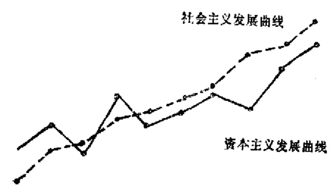
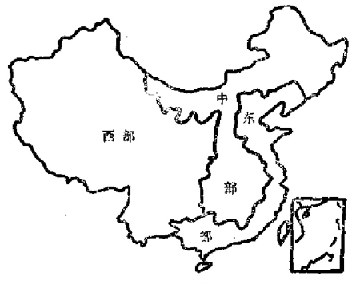
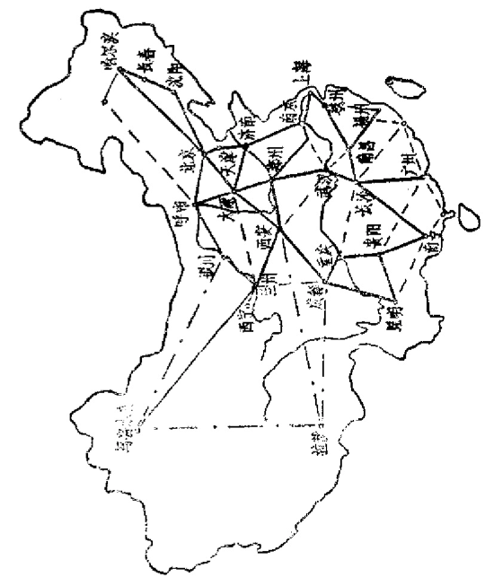
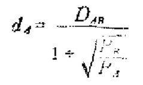

# 第五章 速度与区划战略

      每一个研究人类灾难史
    的人都可以确信，世界大部
    分不幸都来自无知。
        ——[法] C·A·爱尔维修

## 5.1 速度的陷阱

  中国近几十年来在经济上的折腾，始终跟一个速度问题
相关。在对待中国经济发展应有的速度上，我们的政治领袖
和理论界的见解，往往使人百思不解。其中，最有代表性的
是毛泽东的理论。

  早在1949年毛泽东就说过：“中国经济建设的速度将不是
很慢而可能是相当地快的，中国的兴盛是可以计日程功的。
对于中国经济复兴的悲观论点，没有任何的根据”。[^141-1]

[^141-1]: 《毛泽东选集》四卷本，第1323—1324页

  到1956年8月，毛泽东发表了那个有关“球籍”的著名
的演说：“你有那么多人，你有那么一块大地方，资源那么丰
富，又听说搞了社会主义，据说是有优越性，结果你搞了五
六十年还不能超过美国，你象个什么样子呢？那就要从地球
上开除你的球籍！”[^142-1]两年之后我们就开始搞“只争朝夕”的
“大跃进”了。事实立即作了回答：我们一下子便陷入了经
济生活全面紧张的困境。

  1962年毛泽东在《在扩大的中央工作会议上的讲话》中
随即提出另一种说法：“建设强大的社会主义经济，在中国，
五十年不行，会要一百年，或者更多的时间”。

  可惜，只过两年，1964年12月毛泽东在审阅周恩来准备
的《政府工作报告》时就写下“中国将要出现一个大跃进”
的判断，其中提到“我们必须打破常规，尽量采用先进技
术，在一个不太长的历史时期内，把我国建设成为一个社会
主义的现代化的强国。”因此在1970年搞“四五”计划时钢的
指标被定为3500～4000万吨。结果导致职工人数、工资总
和粮食销量“三个突破”的局面。

  毛泽东关于“大跃进”的话，在打倒“四人帮”之后的
1978年成了“三年大见成效”的思想武器而再次广泛宣传，
其中特别提到，这“既不是吹牛皮，也不是放大炮”。让一个
从疯狂的政治深渊刚刚爬起身的人，一个刚刚被可怕地全
身扭曲的人参加100公尺赛跑的冲刺，自然会丑态百出。结
果，在一系列高指标、高速度之后，积压的积压，报废的报
废，损失的损失，又付出了一笔惨重的经济代价。

  由于长期盲目的乐观主义情绪，我们竟然会看不到不正
常的超高速是个真正的祸害。在1984～1985年之间，我们作
了最新的一次冒进尝试，结果又一次跌入超高速的陷阱之
中。

[^142-1]: 《毛泽东选集》第五卷，第269页。

  从1984年第四季度起，国内突然爆发“经济热”。银行系
统立即“紧跟”，当年10月计划1985年信贷规模时，竟然公布
以当年年底数字为下一年的借款基数。于是各专业银行为争
信贷基数而突击放款。加上“多存多贷，差额控制”的办法
加剧了派生存款。结果，国家信贷基金猛增，消费早熟症又
并发起来，财政赤字迅速加大，外贸逆差巨大，财政透支严
重，市场需求压力增大，银行日夜赶印钞票（后来对外宣布
说是多印了80亿元），而我国的货币投放量，1981年只有50.14
亿元，1982年42.78亿元，1983年90.66亿元，1986年全国货
币已增至1,210亿元[^143-1]。按财政部长王丙乾在七届人大上报
告1987年的财政赤字为80.3亿元，1988年度的财政预算赤字
为80亿元。据统计，近10年来，累计的财政赤字已超过1千
亿元。我们开始进入一个以高债务维持高速度的经济发展时
期。这是典型的凯恩斯政策，外国是有成功的例子。问题在
于，我们缺少一个可调控的宏观货币管理体制，更无法控制
由派生存款引起的信用膨胀。这种势头，其实从1982年已开
始。1982一1984年，工业总产值增长的国家计划为4%，
4%、5%，但实际是7.7%、10.5%、14%。1985年的计划
是8%，而头4个月的实绩竟高达23.3%[^143-2]。这比我国历史
上最高水平的“一五”时期（18%）还要高得多。按翻两番
的目标，年平均工业总产值的增长率，前10年不过为5.7%，
后10年为9.5%，我们自己也不知跑到哪里去了。投资膨胀问
题更典型。1982年全国固定资产投资总额上升到845.31亿元，
创解放以来最高纪录。1983年增长势头继续，下半年中央用
严厉措施减压，年末投资总额仍达951.96亿元。1984年，固
定资产总投资又猛增，达11.60亿元，比上年增21.8%，其中
基建投资735亿元，为1983年的123.8%。[^144-1]中央三令五申，
竟是无效。到1985年6月，我们的“经济热”达到顶峰。这
个月，我国固定资产增加了100多亿元，比1984年同期增长
56.6%，工业生产仍增长20%，一意要创造新纪录。但实际
情况怎样呢？项目重复，决策失误，投资效益差，工期愈拖
愈长，工程项目不配套，只见投入不见产出，种种事例层出
不穷。1985年的建设项目投产率（只有50.7%）与固定资产
使用率（只有68.2%）又比1984年（分别为54.1%、71.8%）
下降。1982一1986年基建资金平均每年递增10%，但投入的
资金实际只有1/3能形成固定资产。此外，基本建设投资方
面的狂势发展，使能源、交通、原材料陷入困境。国家只能靠
外汇进口材料支持生产，这使外汇储备又急剧下降到40多亿
的临界点。国家宏观经济再次失控。各地电网超荷运转，电
机组带病作业，紧缺商品的价格轮番上涨，一般产品质量迅
速下降，成本增加，成品库存积压增长超过生产进一步增
长，仅报废的机电产品价值就达153亿元，占当年库存总额
的1/4。而另一方面，群众手里估计还有2300多亿元的购
买力未能实现。结果一声“刹车”，到1986年初，工业生产增
长率就跌至5.6%，半年之间滑下15%！可谓惊人。这是一
种不幸的低效益的超高速增长，在这种情况下，凯恩斯政策
有重大后患，很容易把经济引向整体性的危机的方向。值得
严重注意。

[^143-1]:《经济与社会发展》1985年第2期33页。
[^143-2]: 武汉《经济开发》1985年第1期第15页文说1-6月增长23.1%。
[^144-1]: 黑龙江《学习与探索》1985年第5期，第94页；《财政研究资料》1987年，总76期。

  据国家统计局张一耿在《经济研究》1985年第5期上发
表的文章所说，1984年100元货币的购买力仅约相当于1983
年的97.3元，1978年的85元，1952年的69元（其中城镇居民
还只有58元）。另外，1984年城镇居民拿100元购买食品，只
等于1952年的48元，如购买副食品只等于37元。最近零售物
价指数又升了两个位，这个比值不知会变成怎样了。

  不要忘记，我们的“恩格尔系数”（食物支出在收入中
所占的比重）大概在0.6一0.8之间，甚至更高。即人们收入
中的60一80%是花在食物中的。有些比较注重吃的人，恩格尔
系数几乎接近1，甚至超过1。由此可见，人民币的贬值对
人民的生活影响有多大。

  大话、空话虽然不见了，但“大赶超”、“大跃进”的幽
灵并未消散。我们似乎又一次走到了这种危机的边缘，所有
人都从良好的愿望出发，最后却被引向一个我们不想去的地
方。

  经济事物的发展与其他事物的发展一样，是一个科学问
题，它不仅需要有一个实际可行的严格计划，而且只有跟人
们的心理、感情、素质以及整个社会结构、关系、环境、条
件等取得协调一致时，才可能有一个正常的状态。我国外贸方
面的大起大落，深圳问题的困境，无不与速度的不适当有关。

## 5.2 从神话中蒸发出来的理论

  在经济问题上，我们常常只看到决策人的失误，却把他
们的“高参”放过了。可以肯定，在我们的历次经济冒进
中，尤其是在投资狂热中，曾有不少理论家与参谋人员起过
作用。

  凯恩斯曾说过，执政者的狂热是从经济学者的理论蒸发
出来的。有人补充说，经济学者的政策性理论往往是从神话
中蒸发出来的。

  按照1973年到1983年各国国民生产总值的比较数字，苏
联的经济增长率超过日本，居世界第一。日本的吉田靖彦曾
就此写了一篇文章《苏联经济高速增长的说法是错误的》。[^146-1]

  无独有偶，《中国统计年鉴1983年》第一次公布了中国30
多年来的统计数据。其中30年来的工业生产的年平均增长率
又是超过日本，居世界第一。即使只计算1966一1982年的数
据，不过17年，其中10年为被彻底否定的动乱时期，再加几
年恢复时间，我国工业生产年平均增长仍达9.5%，还是超过
日本（7.4%）在罗马尼亚之后，名列世界第二！中国人真
是享尽了统计上的幸福了。可见，中国统计数字之可疑性，
也因而举世皆知。

[^146-1]: 《日本经济新闻》。1983年7月31日。

  本来，人口越多，生产总值越大是理所当然的。但这个
简单数字的背后，掩盖着许多真实情况，各种经济指标所包
含的假象和真情，统计分析的表面和内幕，以及对未来预测
的启示等，均需特别研究。例如生产总值、价格因素和产品
积压所形成的“水分”就不知应如何“脱水”。按世界银行的
公布，1984年中国的国民生产总值排在世界第8位。但人均
国民收入在世界151个国家和地区中却排在129位（1979年），
只相当于美国的1/38。据统计，1979年与1952年相比，国民
收入增长4.7倍，全民所有制工业企业全员劳动生产率增长
1.8倍，而职工的平均工资只增长58%。国家体改委的杨启
先在1987年更指出，从1953一1978年间，全国固定资产总值
增加40倍（国家财政约40%用于建设），而国民经济总收入只
增长3.5倍（总产值在统计上增加10倍，可见水分有多少），
人民生活水平只提高10%。全国企业有15一20%长期处于亏
损状态，整个生产增长90%以上是靠投入支撑的。如果我们
考虑到固定资产的形成率只有投入资金的1/3，那么，近30
年的时间，资金的投入增长将在一百三四十倍（平均每年约
4.6倍），而人民生活的提高只有那么一个0.1左右。现在我们
才知道，人民的钱哪里去了，也是现在我们才知道，全国城
市平均每人居住面积只有3.6平方（1978年），还低于1952年
的4.5平方水平，是什么原因了。

  这种情况是一直都存在的。可惜我们许多理论家，历来
不肯看一下这些简单的事实，而爱不绝地宣传经济飞速发展
的神话。

  在1978年第1期《中国经济问题》杂志上开头的两篇都
是借批“四人帮”，宣传四个现代化而鼓吹“大跃进”的很有
代表性的文章。下面几段话是从这两篇文章中随便摘出来
的，可以看一下象不象神话：

  “速度问题不光是经济问题，也是一个尖锐的政治问
题。只有高速度，才能战胜资本主义，只有高速度，才能在
新的基础上加强工农联盟，巩固无产阶级专政，不断提高人
民生活水平。”

  “所谓持续的高速度，就是大跃进，就是飞跃！绝不是
通常所说的较快的速度。它不以超过历史最高水平和比外国
有较大增长幅度为满足，而是象神矢飞射，别人用几百年时
间才达到的水平，我们只用几十年时间就赶上和超过它。非
此就是低速度，就是爬行。”

  “毛主席高瞻远瞩，洞察历史的必然性，以无产阶级革
命家的伟大气魄和胆略，断定我国将要出现一个大跃进，
......”

  “毛主席又进一步系统地总结了我国高速发展国民经济
和国民经济持续大跃进的新鲜经验……”

  “中国人民就是用这种帝国主义国家做梦也不敢想象的
发展速度回答了帝国主义者的攻击和嘲笑。”

  “我国工业化的跃进速度从来就是世界资本主义国家包
括最发达的资本主义国家所望尘莫及的。”

  在被十年动乱糟践得生机尽失的土地上，仍有人发出这
种痴人说梦般的营营自乐之声，这已够令人悲哀。更可怕的
是，这并非是个别的一时的现象。

  我们再看几个信手拈来的例子：

  1984年，山东有一篇文章说：“从1950年到1979年，我
的工业生产每年平均增长速度为13.3%。比同期美国快两
倍，比英国快五倍。从1950年到1977年，农业每年平均增长
速度，我国为4.3%，美国为1.9%。”[^148-1]又是一个“世界第
一”的“证明”！

[^148-1]: 《理论研究文库》1984年1月，第59页。

  1985年初，正当我们被超高速弄得手忙脚乱，财政逆
差，赤字迅速膨账的时候，各地理论刊物的一个标准的题目
却是《为什么说争取国家财政经济状况根本好转的任务已经
基本实现？》

  1983年第5期《湖北财经学院学报》上，更以自学辅导
教材形式发表了一个奇妙无比的图（见图5.1），该图没有任何
坐标，全部说明如下：“上述曲线的差异，正是社会主义优越
性之所在”。

  所有这些神话，都绝口不提所有社会主义国家的经济都
陷于僵化、大起大落，一般总值统计数字渗入大量水分，而
人均国民收入大部分排在世界总表之后等事实。高速增长的
理论就此蒸发出来。

  1988年2月15日《世界经济导报》发表陆一《中国民族
最紧要的还是“球籍”问题》一文。这是国内不多见的关于
危机问题的专论之一，引出许多热烈的讨论，值得介绍。

  “球籍”问题的讨论指出，1955年，中国国民生产总值
（GNP）占世界总数4.7%，到1980年下降到2.5%：1960年，
中国的国内生产总值与日本相当，而1980年只及日本的1/4，
到1985年更下降到1/5；1960年，美国的国内生产总值超过中
国4,600亿美元，到1985年，超出额竟高达36,800亿美元！
1980年，中国的人均GNP（300美元），只及西方发达国家（1
万元）的1/30！即使扣除官方汇率的扭偏，也不会超过1/10，
从1980年起，假定发达国家人均GNP年增2%，中国为5%，
以官方汇率计，中国要121年才能赶上发达国家。若发达国家
人均GNP年增为3%（1960～1982年为3.3%），中国为4%，
按官方汇率更要赶363年！

  更有甚的是，陆一引用美国埃思蒂斯教授的计算，在教
育、健康、妇女、国防、经济、人口、地理（包括耕地、灾
害率、灾害程度等）、政治参与、文化多元化、社会福利10个
方面的36个社会经济指标的综合结果中，中国社会发展水平
名次排在124个国家与地区的77位，占倒数第48位，所得总
分（74.4），远在世界平均（100分）之下。其中教育12.1分
（世界最高为25分），经济15.7分（最高27.8分），健康14.2分
（最高24分），文化多元化15.8分（最高20.2分），人口负1.3分
（最高22分），地理负3.3分（最高23分）。这种事实，跟高速
“增长”的神话相去太远，而又跟我们说过的未来目标的快
速移动相接近。

  作为一种新的发展战略设想，我们还必须提到最近王建
提出的参加“国际大循环”的构想问题。这个构想，由于得
到中央首长的肯定而名声大噪。

  按照这个构想，以原料与销售“两头在外”的方法，希
望从亚洲四小龙让出的劳动密集型产业和市场中，把农村约
2亿劳动力转移出来，参加“国际大循环”。特别是，到2000
年出口要达1500亿美元，解决6000万人就业问题。

  目前，“大循环”的构想已经受到许多质疑。细想一下，
“大循环”是出于一种“填补”设想，很有一厢情愿的意
味。

  王建的文章1987年11月1日开始在内刊登出，同月4日
就被肯定。3个月之后，中央政治局第四次全体会议公报
（1988年2月6日）中就说：“最近提出的沿海地区经济发展
战略，不仅将把我国沿海开放地带推到国际市场上去参与国
际交换和竞争，而且从根本上说，必将有力地促进我国中部
和西部地区的经济发展。对于这样一个关系到我国四化建设
全局的重大战略部署，必须坚决组织实施，决不能贻误时
机”。

  一种个人研究的设想，那么快地得到确认，并几乎是立
即写进最高决策中，这在中国是不多见的。可惜，这同时又
是最高决策层缺乏全面的详尽分析的表现。

  首先，对于决不能贻误的“时机”究竟是什么，我们并
不清楚。亚洲四小龙所利用的是40一70年代初期西方资本主
义世界历时最长的持续繁荣时机，他们正好在60年代后打下
了出口工业的基础。但70年代中期以后，尤其是80年代以
来，西方发达国家已进入经济低增长时期，发展中国家的出
口工业竞争空前激烈，世界性的通货膨胀造成市场收缩反
应，贸易保护主义已普遍拾头。可以说，我们已经错过了利
用西方发达国家经济持续增长的时机。

  其次，亚洲四小龙全部人口不过半个亿多一点，即使加
上泰国，也只有1亿人口左右。一个10余亿人口的大国，选
他们作竞争对手已是怪事，要想通过跟他们的竞争，从他们
的“空白”中填入6千万人的就业，这想法不是太过简单了
吗？

  第三，按2:1的出口补贴，要达到1,500亿美元的出口
（比原计划800亿增加近88%），要补入3,000亿元，这正好是
目前全年的投资总数。王建认为，这只需每年追加100个亿
便可以。要知，100个亿接近全年教育经费的一半，仅出口一
项便如此，其他方面的发展如何承受？再说，中国外汇储备
大约只有120亿美元，而1988年初的外债已高达240亿美元。
其中不少是短期贷款，还要以日元来结算。还债的压力几乎
是与必须消耗大量外汇的“利用国外原料”的那一头同时来
到。我们有可能在这里碰到重大的技术性危险。

  第四，国内的投资环境、设备、劳动力素质，尤其是农
村劳动力素质，管理水平，是否能跟得上“大循环”的要求
亦成问题。只要认真观察-一下，近几年我们在经济上的一些
成绩，主要还只是从**自然经济**的积极性与粗加工的劳力转换
中得到的。事实上，在目前一些稍带一点技术要求的劳动密
集型产业的转移竞争中，我们甚至还不是泰国的对手。1985
年，日本对华直接投资127项，4.7亿美元，而1987年只有111
项，2.97亿美元。近年日本大量增长的对外投资，方向却是
转到泰国、马来西亚等地。

  有一位著名的企业家在一次演说中回答“大循环”理论
是否行得通时说：“血液的循环只有在血型相同的条件下才能
顺利进行，否则就会凝固，根本无法循环。”想不到，他的话
博得全场如雷的掌声。他所说的，确实不无道理。

  第五，目前，世界性的主要经济竞争是在质量、效率、
设计、服务、创新、销售方面，而不是在低工资方面。几年
前，美国工人工资在工业部门的总成本中所占的比例为23%，
而现在只占18%。在这方面，我们同样存在一种危机。日本
最近有人说：“5年、10年以后，工业领城的自动化渗透之
后，中国廉价的劳动力这一优点将得不到肯定，中国会被世
界甩在后面。”

  此外，在“大循环”的方案实施中，我们还会碰到诸如
中央的宏观控制力、沿海地区的权力分配，东中西部的差距
进一步拉大等难题。

  “大循环”理论是不是一种新的神话？现在还不清楚。
不过，我们希望，不要由此又蒸发出一种新的“高速”发展
理论来。变换着种种口号式的“理论”去研究实际的经济发
展问题，后果不妙。还是以研究全面发展的战略理论为好。

## 5.3 “三大块”之争

  北京地区的一些研究者，从1981年2月起，每两个月开
一次会研究中国的发展战略问题，至今已有几年时间。其中
的一个大题目就是地区战略问题，这是非常值得称赞的好
事。最近，中央关于“七五”计划的“建议”就把地区经济
发展战略列为三大全局性问题之一。

  地区战略可以分为宏观区域分划、中观结构分布与微观
选择安排三大部分。这是资本主义社会生产力布局早期区位
论或称立地论，而后来称为区位经济学或空间经济学（我国
有人称之为布局经济学）的一种发展。建国以来我们在这三
个方面的一些基本的指导思想出现了多次反复变化，因而导
致不少重大决策的失误。其中，尤以宏观区域分划问题最为
突出。

  我们最早的一个划分就是沿海、内地两大块（在毛泽东
发表《论十大关系》时，这两大块的工业产值比为7:3，现
在是6:4）。1958年，曾经把全国分为七大区，1961年又把
其中的华中、华南，合并为中南，成东北、华北、华东、华
南、西南、西北六大区。但这种划分并不是从经济发展角度
出发的。“一五”、“二五”期间，国家的投资重点是在“内
地”。其中东北是重点的重点，辽宁与黑龙江占第一、二位。
所谓“六大协作区”基本上还是行政区，并没有多大“协作”。
当然，原有各省区的划分将会继续被当作既成事实来研究。

  “三五”、“四五”期间，我们有一个三线建设的理论，
重点忽然转向西南等地为主的大三线。并且发展出一套“靠
山、分散、隐蔽，进洞”的离奇方针。先后投入约2千亿元
资金，建国营企业2.9万个，职工1600万（占国营职工总数约
1/3），工程技术人员16万。对三线的完全从备战角度出发的
大量投入，大大地削弱了对原重点地区继续发展的支持。例
如，曾占国家投资第二位的黑龙江在这个时期，重点项目的
投资下跌倒第17位。[^154-1]工业力量“均衡”分布的目的，是以
经济效益的严重损失为代价的。

[^154-1]: 黑龙江《学习与探索》1985年5期，第95一100页。

  “五五”、“六五”期间，国家的发展重点又转回沿海。
但一直还没有对地区的宏观区域分划战略作过科学的研究。

  我们与其他社会主义国家一样，长期被一个经济体制的
难题困扰着：应该归行政区来管还是归部门管？苏联原来是
按部门管的，后来赫鲁晓夫改成104个经济区和经济委员会，
到勃列日涅夫时又恢复部门管理。事实证明，两种方法总是
互相把对方的联系割裂。所以现在，苏联在探索两者皆不是
的新的综合体制。

  近几年来，我国的研究者也在走这条路。结果，提出了
种种分划理论，形成了一个有价值的研究领域。其内容值得
用一本书来研究，这自然就不是本书的任务了。

  笔者只想就近几年提出的一些主要的地区战略分划理论
谈谈看法。

  第一种是以大城市为中心的六大经济圈划分。例如廖季
立在《经济体制综合改革与经济发展战略》的文章中提到这
样一个经济体制改革设想，要使全国形成六大经济区：以广
州为中心的珠江三角洲经济区，以上海为中心的长江三角洲
经济区，以武汉为中心，包括湖南、湖北以及河南等省一部
分的江汉平原经济区，以重庆为中心的西南部分省的经济
区；以天津为中心的华北经济区；以沈阳、大连为中心的辽
南经济区。甚至有一种更简单的划法：以武汉为中心，以一
千公里为半径划圆，圆内人口为8亿。因此，可建成以武汉
为枢纽的全国统一经济区。此类划分的中心很突出，问题在
于中国的城市密度低，分布不平衡，难以覆盖全国。

  顺便指出，这里说的六大经济区，不仅有4个在南方，
而且有趣的是，过去谈论此类覆盖问题，总是从北往南数，
近年却出现不少从南往北数的文章，似乎是思想重心也有南
移倾向的一种表现。

  第二种是以横向流域、纵向海岸和大城市结合的经济区
划。即沿长江从东到西以上海为中心的长江三角洲加工工业
经济区；以武汉为中心、农业为主的两湖经济区；以重庆、
成都为中心农业为主的成渝经济区，黄河流域从东到西的黄
淮农业区；以银川为中心的河套平原经济区；以西安为中心
的关中平原经济区（均以粮棉为主）；自北而南有哈尔滨、沈
阳为中心，以重工业、石油、化工、农林为主的松辽经济区；
以轻纺、石化、农业为主的勃海经济区，以两淮为主的煤炭
经济区；以江西为中心的赣、黔、滇有色金属、稀有金属经
济区；以广州为中心的珠江三角州经济区与福建经济区等。
其中最主要的是松辽、渤海、山西，黄淮、长江三角洲、两
湖、成渝、粤闽八大基本经济区。[^156-1]

  第三种是三地带划分。这是讨论得最多的一种划分（参
看附表5.2）。按照这种划分，中国经济发展分或东部发达地
带，西部待开发地带和中间过渡地带（亦有人分别你之为成
熟型、增长型和发展型经济区）。

  这种划分虽然已为“七五”规划所接受。但还有许多理
论问题在争论。例如，在地带范围划分问题上，最有意思的
是广西，有人把广西划入大西南，有人划入东部沿海地带，
竟有两级之差。内蒙的情况亦如此。而四川有一部分被划入
中部，研究西南发展战略的人却无例外地将其划入西部。又
如，在空间结构上，有人主张集中在东部进行小尺度调整，
有人主张作东西结合的大尺度调整。再如，在推进战略上有
人主张从东到西的梯度或循序战略，有人主张从西向东的逆
向超越战略，还有人主张两边夹击战略和优先发展中间地带
的“起脊经济体系”战略。[^156-2]

[^156-1]: 胡焕庸等在研究中国人口地图时亦分辽吉黑、黄河下游、长江中下游，东南沿海、晋陕甘宁、川黔滇、蒙新、青藏八大区。

[^156-2]: 参看《中川学刊》1985年6期，第3一10页；中国人民大学《经济理论与
经济管理》1986年1期，第30页；《经济管理》1986年1期，第7一8页；《大经济，
大科学》上海交通大学出版社，1985年，第62一64页。

  梯度论者打许多理由，其中一个有力的根据就是技术等
级的差别。美国学者索洛用生产中有价值的产出与投入之比
作为衡量技术水平的主要指标。按索洛模型，有人算出京、
津、沪、苏、浙、鲁、辽、粤、冀、闽、桂等11省区，皖、
湘、豫、吉、黑、赣、鄂、陕、川、晋等10省和藏、云、
贵、甘、宁、内蒙、青、新等8省区有呈递减的三个技术梯
度的差别如下表：[^157-1]

[^157-1]: 《新疆社会科学》1984年4期，第60页。

表 5.1

-----------------------   -----------------  --------------------------
                            平均技术水平          该区城市技术平均水平
-----------------------   -----------------  --------------------------
东部第一技术梯度                1.4574                  1.6

中部第二技术梯度                1.0208                  1.31

西部第三技术梯度                0.7088                  0.87
-----------------------   -----------------  --------------------------

  反对梯度说者指出，东部沿海并非都比西部发达，按
1983年的统计数，四川的国民收入总值在全国排第3位，远
胜于江苏、山东以外的沿海地带，而福建的人均国民收入
（403元，第18位）排在青海之后，远不如新疆（474元，第
13位），更不用跟中间地带诸省比较了。广西各项主要经济指
标是历年排在贵州、西藏之前的倒数第三名，划入沿海发展
地带更无道理。他们赞成地区等速发展战略或落后地区超越
战略。

  在这方面，表现激烈的是1985年4月在天津召开的“中
国青年经济体制改革讨论会”上出现的一种被称为“西部学
派”的观点。他们建立了一套综合指标体系，算出1983年新
疆在全国应排在第12位，陕西为第15位，而1978一1983年的
社会发展速度与效益，新疆名列第3位，云南第5位，内蒙
第6位。他们还指出，西部工业受政策性亏损所害，而东部
工业又受补贴政策之益，造成西部“低效率”，东部“高效益”
的许多“虚假成分”。他们认为梯度理论是片面的，西部也应
积极开放。有人甚至认为，“梯度”理论会把西部的开发战略
导入恶性循环的途径。

  种种理论的提出是少有的好现象。稍感一点不足的是，
沿海理论家多主张沿海为主，中部理论家主张中部为主，西
部理论家主张西部为主。有些理论带有明显的感情色彩，这
使得各种计算方法所掩盖的重要事实，少有人愿意去具体分
析。例如几乎所有用于比较的指标（绝对总值除外）都对四
川不利，甚至连“西部学派”的综合指标也把四川列入“落
后地区”，而事实上，四川是西部的最强者。

  1986年3月28日《人民日报》刊出“三个经济地带的划
分”的详细资料。广西还是划入东部，内蒙属中部，四川入
西部，构成东部11省区，中部与西部各9个省区。行政区的
结构并未有打乱。按此，区划如下：

  这种划分已反映了目前的决策性意见倾向。但目前中央
是谨慎的，整个原则性意见都是以“建议”形式提出来的。
事实上，任何一种有关发展战略的重大决策都应有连续追踪
性的分析和评价，讨论应允许继续进行。

**表5.2 三个地带基本情况比较表**

------------------------   ---------  ---------  ---------  ---------  ---------
                                东部       中部       西部       全国      注
------------------------   ---------  ---------  ---------  ---------  ---------
总人口（万)                    42500      47530      12465      102405   1983年

人口密度（人/平方公里）           252        231         26         105   1982年

劳动年龄人口占比重（%）          57.3       53.7       51.2        51.9    

其中男性（16~59）                59.5       56.1       52.9        57.1

每10万人口中大学程度人数          770        479        450         599

物质生产领域（含商业）          93.52      95.11       94.79      91.37  1982年

其中工业                       19.95       9.87        7.77      13.87

农业                           64.85      79.96       81.28      73.67

建筑                            3.75       1.56        1.77       2.11

运输                            2.15       1.55        1.37       1.73

商业                            3.78       2.31        2.36       7.97

工业总产值（亿元）            2557.10    1474.05       415.25   5571.48  1982年

其中轻工业                   1698.60      719.07      197.44     2814.87

重工业                       1758.79      754.98       248.81    2762.58

农业总产值（亿元）             1263.4        1014        339.7    2629.15
------------------------   ---------  ---------  ---------  ---------  ---------

数据来源：《中国第三次人口普查资料分析》第313一316页，其中总人口一项据1984年《中国统计年鉴》数据计算。

  上述各种划分理论，虽然使用了种种术语，实质都是强
调东、中、西三部究竟哪一部应作重点先搞的问题。从方法
论的角度来说，对如此粗略划分的三大部分谈论哪一部应
“重点优先”问题是完全不适当的。在1045万平方公里的土
地上研究发展战略这样的大问题，怎么可以只依靠两条线把
她切成三块来讨论呢？现代科学似乎还未有这样大的综合魔
力。我们只根据一些简单的事实来划出曲线，而不管这种划
法有什么方法论的基础，且不知道这种南北一线的剖分怎样
具体地与各种横向经济区与局部经济区联起来。例如怎样与
现在讨论得不少的发展长江流域经济区和黄河流域经济区等
联系起来。

  按“七五”计划的设想，东部要加强企业改造，开拓新兴
产业；中部要加快能源有色金属和建材的开发；西部要大力
发展农林牧和交通。这种划分自然是非常相对的。例如，目
前在东南沿海投资发展交通的效益会比西北好；在重庆投资
开拓新兴产业的效益会比南宁好。这种三地带及其基本任务
的划分很难得到一致性。（上表5.2比较三个地带基本情况，
供参考。）

  比较带有科学方法论基础的一种经济区划方法是于光远
提出来的。

## 5.4 Rd链的扩展战略

  几年前，于光远提出一种不妨称为“东南、西北两大
块”的划分方法：用多年平均400毫米的等降水线把中国划
分为面积几乎相等而人口、产值为96:4的两半个中国。[^160-1]
下面再分区。这种划分的结构如下：

[^160-1]: 参看《贵州社会科学》1985年8期，第12页，《青海社会科学》1984年1期，第98一193页，《兰州学刊》1985年5期，第1一3页。

- 中国
    - 东南
        - 沿海发达地带（约1亿人口，大体为沿海14个港口开放城市及其周围）
        - 东南季风地区中的中等发达程度地区（包括沿海非发达地区和湖南、湖北、江西、安徽、河南、山西、陕西、吉林、黑龙江、辽宁）
        - 东南季节风中待开发地区（云、贵、川为主）
    - 西北
        - 西北干旱区
        - 青藏高寒区

[^161-1]: 关于XD结构，参看《北京大学学报》1985年3期，第41页。

  这种划分跟“东南大发展，西北大开发”的总战略目标
是一致的。

  于光远的这种划分方法，主要是从农业区划角度考虑
的，所以并未作为整体战略划分而被接受。

  作为一种研究，笔者提出一种以几何地理学为基础的区
划方法，可以称之为Rd链方法。

  现代生产力的地理分布理论，应当有一个发展，即不能
仅限于生产力的范围来讨论，而应该与地区的社会经济、科
学技术与教育后备力量协调一致地进行研究。我们可以把某
地区的工、农业与社会、经济、科技，教育和交通线结合在
一起的整体地理结构，称为一个d系。d系是随社会经济核心
区的形成而出现的，并且随中心城镇推动社会经济的发展，
特别随着各种流通范围的扩大而扩大。d系的扩大，正反映
了地区差异与地区关联的矛盾运动。当d系只限于讨论生产
力布局问题时，就是现代化生产力分布理论中通常所说的
XD结构[^161-1]。

  前述各种理论所选出来的经济区，自然都是d系。既有
中心城市型式，又有流域线、铁路或沿海线型式，还有特
殊地区性型式。d系的选择所依据的只是既成事实。

  从纯几何学的角度说，一个平面图形最彻底划分的剖分
是三角剖分，特别是直角三角剖分。这也是编一个紧致网的方
法。在经济地理上我们可以把由三个d系组成的三角区称为d
△系：把两个以上的d△系联接起来的经济区称为Rd链。

  我们很自然会以城市为顶点构建d系。这些d系可以按城
市的人口、规模、经济实力、距离等分成层次等级。据《中
国统计年鉴1984》资料，人口在2百万以上的重点城市有20
个，这样，一级的d△系，按3城市组合计，可以构建1,140个；
人口在1一2百万之间的城市有12个，若以此计，共32个城
市可以构建4,960个d△系：再加人口在0.5一1百万之间的26
个城市，即以61个城市计，各级的d△系可达35,990个。但
由于种种条件的限制，实际上的d△系不多。如果从一级的d
△系看，只要打开一幅中国铁路图就知道，像北京、上海、
郑州那样在其附近已成d△系的很少。广州被列为经济中心
之一，但却列不进一个d△系中。这样，我们能构成的一级
Rd链就是从哈尔滨一沈阳一北京一太原一西安一成都一重庆
一贵阳—长沙—武汉—郑州一南京—上海一杭州这样一条。
而且这条链中的d△系是很不完备的（参看下图5.3）。

  这个结构现在只有4条主轴线（粗实线部分）：

（1）哈一长一沈一京一西安一成都

（2）呼一京一济一南京一沪

（3）哈一沈一京一郑—武一长一广

（4）沪一南京一郑一西安一成都

  显然，虚线是为扩展Rd链接通的例子，而点划线是下
一个战略需要接通的例子。

  按这种理论，国家的发展战略主要就是构建一级d△系
和有效地扩展一级Rd链；地方的发展战略就是用尽可能少
的代价以尽快按通各级Rd链为目标扩建自己的Rd链和构建
自己的d△系。例如，西南地区就有一个由成渝、贵昆、川
黔、成昆4条铁路为骨架，以重庆、成都、贵阳、昆明4大
城市为支点的一个“腹地图”，但其中的d△系与Rd链的构造
不健全，前且向西一面是全封闭的。如果重庆一昆明、重庆
一长沙能直联起来，成都又向西沟联，这西南腹地圈就会
大变样。又如，宁波一福州，武汉一合肥，西安一武汉，昆
明一南宁，广州一湛江等自然是为扩建Rd链急需接通的点。

  这种理论的一些特征与XD结构论是相同的，例如，以
重心区与通道网为骨架而不是一种中心一地域体系骨架；没
有排他性边界，可以互交叉；范围会变动。要知道，现有划
分各种固定区域的各种指标，本质上都只是用于宏观比较的
某种均值，它是无法代表地区的实际情况的。此外，Rd链
理论还有自己的特点。例如它适合主导型、地域圈、网络
形、链式等各种发展策略，只是单通道地带不能单独成区。
从发展战略角度看，这是有利的，因为已有的通路是构建d
△系的最好基础之一。问题在于期何选择d△系的连接点。
这可以利用P·D康维斯的所谓城市界点公式：

  式中：dA一A城引力范围（公里），Dab一两个城市间的距离
（公里），Pb一较少城市人口数（万），Pa一较大城市人口数。
这个公式是用来计算一个城市对另一城市的引力的。只要除
人口、距离外，加入人均国民收入、技术装备、劳动生产率、
经济效益、文化教育水平、居民收入、卫生健康等指标，我
们不难把它稍作推广而应用到计算d△系的构建问题。不过这
已不是本书的任务了。

## 5.5 “孔雀东南飞”

  在近代之前，中国的历史是从西到东、从北到南的历
史。近代中国西东、北南的两极重心被倒转，致有今日提出
战略西移问题。从未来学的角度看，中国整体发展战略的难
点在于下一步的西部开发问题。

  我们在谈农业问题时，提到过贵州赫章等地令人“不忍
一睹”的情况。1984年，费孝通为研究西部开发问题第一次
走访了甘肃中部定西地区的贫苦农户。随后他写下了自己的
深刻印象：“在一间除了炕和空锅别无他物的土屋里，一位中
年农民流着眼泪诉说着他妻子的病况和断炊的困境。据说当
时还有约1/3的农户与他一样不得温饱”。[^165-1]定西“苦甲天
下”。有粮吃，有柴烧，有水喝，这是眼下定西人对温饱的理
解。

[^165-1]: 甘肃《开发研究》1985年1期，第7页。

  王小强等人在《富饶的贫困》（四川人民出版社，1986）
一书中描述了几则“场景”同样令人震惊：甘肃榆中县上庄
地区，年人均口粮只有40一100斤，全区49个队，有48个人
均收入在40元以下！有些队，平均3人一床被、3户一条
毡，2/3的土炕没有铺盖，一个从朝鲜战场上回来的志愿
军战士，全家6口人共盖一床几十年前从朝鲜战场上带回来
的破被子。还有全家3个人睡左两张水泥袋上的！全区7千
多人，有4,371人没有棉衣裤或棉衣裤已破烂不堪。不可忘
记，他们是80年代生活在近3千米高寒阴湿山区的社会主义
新人！贵州的关龄县，1982年就跟全国100多个“先进县”
一起宣布工农业总产值翻一番。但1983年人均口粮也只有
350多斤；有215个队人均口粮276斤，人均收入39元，人均
衣服1.6套，平均3.57人一床被，还有几百户人，每人只有
一衣一裤、五六个人才有一张破被的！因地区海拔1,400米，
大冷天调查者穿两件毛农上山，却看到十四五岁姑娘连裤子
都没有，有些人畜同挤在一棚草堆上。1984年，贵州800余
万人生活在贫困线之下，其中300多万人年均收入在80元以
下。

  新疆塔城、阿勒泰地区，216个队，1981年人均收入在
60元以下。南北疆有3万多户人没有毡房或毡房已破烂不
堪，冬季要在烧热的土上过夜。

  经济学家们有一句名言说：“如果我们懂得生存贫困经济
学，那么，我们就会更多地懂得经济学”。这句话，对中国人
来说，特别有意义。尤其要想到，我们当年的革命斗争，不
就是为了他们么？

  中国西部有多少定西、赫章、榆中、关岭和塔城，阿勒
泰？到处是光山秃岭，飞沙走石，高寒苦旱，水土大量流
失，沙化威胁日益扩大，生态陷入恶性循环，环境恶劣，交
通不便，农牧业生产率低，工业结构不合理。1980年西北部
每百元固定资产实现产值65.17元，仅为全国平均值的56%，
文盲率达27.51%。西北陕甘宁青新5省，面积约307万平方
公里，占全国总面积32%，但1983年的工农业总值只占全国
5.1%，人均收入比全国平均水平低20%[^166-1]。西北的西宁市
与华东的常州市，人口都在40万左右，前者1982年的工农业
总值只有8.45亿元，还不及后者的1/4。而且东西差距一
直在拉大。例如，新疆的人均工农业总值与全国比较，1949
年为96.37元:86.03元；新疆高12.01%，1981年为575.59元:
751.84元，新疆低23.44%[^167-1]。又如宁夏1982年人均工农业
总产值为全国平均水平的69.5%，有人估计，到2000年会
降为66.3%，差距扩大3.2%；要达到2000年的翻番目标，
全国的年均增长率只需7.2%，西北却要8%。西北各省城
市人口比重除甘肃外，均只占人口总数20%左右，1982年人
口2百万以上的7个特大城市（京，津、沪、武、穗、沈、
哈）均远离西北，全国19个1百万人口以上的大城市，西北
也只有西安、兰州两个，且均偏于东南。1983年，2百万人
口以上的城市增加4个，只有西安1个在西北（另三个为重
庆、南京、成都）。

[^166-1]:《西北大学学报》1984年1期，第35-37页。

  由云、贵、川、桂、藏组成的大西南情况亦差不多。西
藏是应该单独计算的。西藏1984年的工农业总值为每平方公
里6分钱，只等于全国平均值的8%[^167-2]，即使不计入西藏，
1984年西南四省人口占全国总人口19.5%，但工业产值只占
9.37%，农业占17.3%，国民收入占13.39%，高校在校学
生占11.69%，社会商品零售总额占13%[^167-3]，均低于人口所
占的比例。现在有一种沿长江主轴划经济区的理论，可惜西
南的许多大三线厂却不在长江边。这对未来西南的d△系的
构建和Rd链的扩展并不利。

[^167-1]:《新疆社会科学》1984年4期，第2页。

[^167-2]: 《经济地理》1936年1期，第23页。

[^167-3]: 《贵州社会科学》1985年6期，第10页。

  以西部内蒙、甘、宁、青、新、陕、云、贵、川、藏、
桂共11个省区与其余18个省市（算东部）再作一个比较。这
时，西部面积占全国64%，耕地（4662.5亿亩）仅占全国
31.6%，粮食产量1963.7亿斤，占全国总产量25.4%。以单
产计，1984年低于全国平均水平的16个省区，西部占10个。
西部每个农业劳动力提供粮食（1972.9斤）只有东部（2852.9
厅）的69%。西北平均亩产（289斤）只及全国（453斤）的
63%，西南地区人均耕地（1.18亩）更在全国水平之下。同
年西部除西藏外的10个省区乡镇企业总收入为156.74亿元，
仅占全国乡镇企业总收入10.2%，只有江苏省乡镇企业总收
入的一半多，略等于山东的水平。该年全国农村固定资产
966.2亿元，其中西部10省区仅有174.7亿元，只占总数
18.1%。东、西部农业人口平均纯收入1982年分别为211.29
元、159.93元；1984年分别为365.03元、229.37元。绝对差
从69.44元，变为163.74元。两年间差距拉大1.2倍！到1985
年，差值更超出170元，工农业的年产值高出1,098元。据估
计，西部约有一亿人至今仍生活在年均不足70元的贫困线之
下。而西部农村人口1984年比1978年增长9.9%（全国为
3.4%，东部为2.1%），压力变得越来越大。

  我国面临一系列开发经济学的难题。

  现在一提开发西部，许多优势便接二接三提出来，而对
困难却估计不足。例如农业，说西北有可耕地资源（人均
2.6亩）比全国人均不足1.5亩高73%的优势，却很少提到土
质与自然条件不可比的情况。

  历史上的黄士高原是以森林和森林草原区为主体的地
区，现在已处于生态恶性循环之中。

  1958年以来，西北黄土离原到处搞穷种。结果越垦越
穿。越穷越垦，搞到燃料、饲料、肥科寄缺，各种资源严重
破坏，“广种薄收”政策已使小麦亩产低到只有15一20公斤的
可怜程度，耕地沙化面积从1961年的282万亩扩大到1983年
的803万亩，平均每年近24万亩！水土流失面积达2.6万平方
公里以上，每平方公里流失量高达5千吨！农业挤草地，流
沙吃农业，结果是农林牧“三败俱伤”，加上人口激增，农业
内部比例失调、植被破坏、牧场缩小，土壤肥力下降。仅仅
一个宁南山区，二三十年间，国家在其中投资的30多亿元已
化为乌有。

  贵州可算资源丰富，环境条件优于许多省，还有以东南
西北“铁十字架”著称的四条铁路干线出口，出口水道也至
少有7条，更集中了三线建设的一批力量，但经济发展却处
于全国水平的谷底。1978年贵州的人均国民收入为全国倒数
第2名，1983年还是倒数第2名。这一年，全国人均国民收
入最低的5个省，正好是西南5省。我们知道西部有许多矿
产，却不知在哪里，知道有许多资源，却不知如何能利用。

  其实，50年代我们便发起过西北热，当时就知道采油、
挖煤、养畜、开发荒漠的基本战略。但30年下来的结果，我
们只能说一个前后比较的成绩，而实际差距反而拉大了。

  从1952年到1982年，国家投入西部地区的建设资金为
2,200多亿元（平均每年约71亿），由此形成的固定资产为
1,317亿元。但固定资产交付使用率低。例如1950一1983年
间的贵州只有65.1%，同期全国的相应值为71.8%。1983年
贵州全民企业每百元固定资产（原值）实现的产值为50.44
元（全国为95.13元），实现的利润仅6.5元（全国为13.44元），
每百元产值占用流动资金43.58元，比全国水平高53.1[^170-1]。

[^170-1]: 《贵州投资研究1985年6期，第3一11页。这里所指的*西部”包括内蒙、川、陕与广西等11个省区。

  从1980一1983年，国家在东部10个省市的投资总额为950
亿元，所得税利为2,765亿元，几近投资的3倍。同期，国
家在西部地区的投资总额为308亿，财政税利为318亿，而同
时国家对西部地区的各种补助达290亿[^171-1]。以每吨钢的综合
生产能力投资计，沿海地区为1,000元，而内地新开发区要
3000元；成昆、襄渝两条铁路，每公里造价三四百万元，
比沿海地区高三四倍到七八倍；据1953年以来20多年累计的
投资产出系数（=计算期内产值净增额/计算期内累计投资
额）计算，沿海地区为0.973，内地为0.414，其中三线地区
为0.256。据1978年对28个省、市、区资料计算（西藏除外），
资金利用率高于30%的6个省、市，绝大部分在东部地区，
利用率在15一30%的12个省、市、区绝大部分在中部地区，
利用率低于15%的10个省、区绝大部分在西部地区[^171-2]。

[^171-1]: 《经济日报1985年10月19日，这里的“西部”同上注。

[^171-2]: 《中州学刊》1981年2期，第42页

  在目前对西部不利的一切因素中，最不利的是人才的缺
乏和大量人才向东流走。占全国面积2/3的中国西部，科技人
员仅占全国10%，而1982一1986年间，仅甘、宁、青、新四
省、区流入东部的科技人员就达2.2万人。当代美国学人云集
西部的史坦福大学，不仅开发出一个举世闻名的被称作“新时
代的佛罗伦萨”的硅谷，而且使这间大学在1984年美国大学
校长联席会议上被评为全美十大名校之首。中国西部大学的
情况怎样呢？近几年来，青、甘、宁、云、贵、广西等地的
高校人才大批被挖走。西北最著名的兰州大学仅1983一1985
年间便向东跑走111名教师。其中60%是有高、中级职称的
人。流走的至今源源不断，补充的又迟迟难以进去。1985年
分配给宁夏大学的4名硕士生，无一人去报到；代培生不仅
每人每年要花约1.3万元，且多半被截留。自愿去支边的更
是凤毛麟角。为什么会这样呢？别的且不说，50年代一些满
环激情、不顾一切，以献身精神自愿去支边的青年学人，今
日当他们历尽艰幸，老眼昏花地回到东部时，等待他们的是
什么呢？找关系落户口，托人情办粮食，心急如焚地找燃
料，低声下气地求孩子入学，蹲在楼梯角里排队等分房子。
拼命东奔西跑，到处碰得焦头烂额，却仍迟迟不得解决。有
如此刺人的活榜样在那里，如何不叫后继者心寒？

  中国西部的人才困难，还跟结购不合理，分布过分集
中，积压严重和使用不合理有关。1985年西北5省7,200万
人，科技人员70万，按人口比例不算少（每万人口有96.56
人，比全国平均74.7人高）。但近35%属中央部属企业。70万
人员中，工程技术人员占43%，教学人员占16.7%，农业技
未人员仅占7.8%，平均155万亩草原才有一名技术人员。新
科技人员36.6%集中在一个乌市；陕西工程技术人员37%
又集中在国防工业。直至1987年初对青、甘两省的一个调查
表明，较能发挥作用的知识分子只占二三成。调查者估计，
西北地区积压人才在20万以上。而全地区乡镇企业中的科技
人才仅占相应企业职工总数的0.5%。更令人不解的是，有些
地区居然硬性规定：区内不能调动，有本领就往区外调走。
非硬要把人逼得远走高飞不可。至有一件怪事不可不提。
1985年，新疆维吾尔自治区建筑公司，从内地的师范院校毕
业生中招入150人。国内师资奇缺，正牌师范院校毕业的合
路教师更少。内地师院毕业生会成批到边远地区的建筑公司
工作，已经够意思（就是待遇会比当教师好），报到之后，学
中文的去管工资，学物理的去当保卫干事，竟有1/3以上的人
被胡乱地挤入一个个学非所用的岗位上。1987年仍继续这样
做，[^173-1]可谓离天下之大奇。

  中国一切有关本世纪末下世纪初战略西移的设想，都要
考虑这样一个身实：“一江春水向东流”或者“孔雀东南飞”
的现象仍然会继续。到2000年，中国东西部的差距会进一步
拉大，这是可以想见的。

  地区经济时代已经开始，这是世界性的现象。

  1981年，我国地方掌握的物资占全国的比例，煤炭为
45%，水泥为70%，木材为41%，钢材为27%；二三类物资大
部分掌握在地方手里，地方掌握的预算外的资金占全国财政
收入的比例，已从“一五”时期的约8%，“二五”时期的
18%，“四五”时期的26%，上升到近年的50%以上[^173-2]。“以钢
为纲”、“以粮为纲”、“遍地开花”的策略早已过时了。中国的地
区经济时代不得不开始，而且可以预言，我们将会在此碰到
一连串的头痛问题。我国近年的宏观经济失控，落入速度发
展的陷阱，主要就是由这种初冒起来的地区经济导致的。

[^173-1]: 参见《经济学周报》1985年6月23日；《科技管理研究》1986年4期
第67项；《光明日报》1986年12月24日，1987年2月18日。

[^173-2]: 《社会科学辑刊》1983年4期，第49页

  中国东部沿海地区，面积只占全国14.2%，人口却占
41%，工农业产值占57.5%，工业产值更占62%，贵州省一
个地区16个县加起来的工农业生产值只有1亿多元，而江苏
有不少乡的产值就有1亿元，珠江三角洲有些一个村的产值
就达1亿元。这已不能用一般意义下的“劳动”概念来解
释。近5年来，广东的佛山地区，花了3.6亿美元搞企业技
术改造，而同期整个西北地区都没有花那么多的钱搞技术改
造。优势、高效益自然集中于东部。在这种情况下，地区经
济时代到来的结果不仅会进一步拉大地区差距，而且会迫使
国家处于两难境地：国家的主要力量是投入东部以进一步拉
大距离来换取效益，还是投入西部以失去效益来换取全国的
平衡发展？目前，事实上国家选择了前者。但同时又准备在
本世纪末到下世纪初，把战路重点转向西部。这个计划，前
半部分是正确的，后半部分有可能陷入又一轮“高速发展”
的狂热之中。从现实差距和世界发展形势来看，在可预见的
未来，中国的战略重心仍应积极发展东部，努力向太平洋圈
推进，以迎接太平洋时代的挑战；中国西部的根本工作，不
是什么战略转移，而应扎扎实实地搞基础工作，用一百年的
时间，学美国人的务实精神，先把财富一点一滴地积累在学
校、道路、通讯、生态环境和其他必要的基础设施上，而不
要让官僚主义把它浪费了。这样，西部的半壁山河估计要有
约一个世纪的时间才有可能谈得上与东部的接近问题。特别
是，从文化背景、传统和种种环境、条件来看，在转移问题
上，中国人不象西方人那么容易。美國经济重心从东北向西
南的转移约经历了一二百年的时间，而且有当时的“金山
梦”支持；苏联目前还在继续中的向东转移战略，亦已经历
了约60年。日本从东海岸向西北扩展的经济更有狭长地带所
迫和交通网发达的原因，其灵活的市场机制与分散的政体结
构也起了重要作用。更何况他们都是从临海的一面转向临海
的另一面，而我们却是从临海的一面转向世界屋脊“临空”
与大沙漠的一面。

  在东部优先开放和继续重点投资的压力下，中国西部面
临严重的开发危机是不可避免的。如果注意到未来的新兴科
学技术可能会用信息知识等新资源代替各种传统资源，即我
们的资源开发速度赶不上世界资源革命的步伐时，我国依赖
西部的“资源大国”地位（最大的优势只是空间）便可能丧
失。而西部的开发问题又可能陷入新的一重国境。开发政策
还需要新探讨。

  当前，中国西部的首要问题是搞好各种体制和组织方面
的改革。这种改革，在西部应当比东部更大胆、更彻底。在
这方面，白益进等人有一个研究（1987年），颇为值得注意。
他们指出，在西部社会经济体制内部，存在着反商品经济的
悖逆因素。封建思想、错误理论、高度的国家独断行为，地
方多元化的一切自主发展的可能性都被窒息了，一切商业活
动的可能性都被窒息了。此外，在社会环境和割断经济活力
传送纽带的行政管理上表现的惰性作用，是一种非理性的控
制和反激活的机制。在一个极端薄弱的经济基础上，建立一
个庞大的管理系统，施行高度的国有化管理。整个西藏只有
1.3亿元工业产值，0.8亿元基建投资，还不到珠江三角洲一
个乡镇之数，但却同样维持着几十个厅、局、委办的省级机
构，平均每1元基建投资的行政管理费为0.63元，确属世
界罕见。这种“机构密集型”经济，永远只能靠“输血”维
持生命，而绝不会有“造血”功能。尤其值得注意的是，在
市场经济激烈竞争条件下，一个国家地区经济的不平衡性一
旦发展到经济成熟时期，为调整所花的代价就会比一开始进
行调整时大得多，意大利在二次大战前，南方的落后经济就
两次被北方挤跨。

  可以说，地区发展问题，是当代中国发展战略中最严肃
的重大问题之一。

  在中国漫长的封建史中，有丰富的史实说明：中央与地
方的关系非常复杂。中央过分集中或中央过分软弱，均会导
致动乱和分裂。上下关系成了影响国家治乱与盛衰兴亡的重
要原因。

  秦始皇虽然立下统一中国的首创大业，但因过分的中央
集权统治，致“二世而亡”。汉承秦制，由于实行有效的地方
行政制，长治久安达4个世纪之久。汉儒董仲舒一向受到重
视的原因之一，就是他有一个“强干弱枝”、“一统乎天子”
的理论。

  中国历史上有两次大分裂。第一次是魏晋南北朝时期，
永嘉之乱，十六国大混战，是中国封建史上最惨痛的一页。
第二次大分裂为唐中期以后至五代十国之乱。李林甫专权，
杨国忠乱政，皇帝纵欲，大臣粉饰太平，中央力量散乱，藩
镇势力鼎盛，致有安史之乱天下，使唐朝元气尽伤，大分裂
竟达200余年。

  此后宋明以来，中国的国家机器基本上就以中央过分集
权的形式运转。但其实，统一是表面的，地方事权长期分
割、互相牵制。这也是中国的一种可怕的传统。目前不便预
言这种传统在未来的地方经济时代会有什么表现。但是，必
须承认，在未来，地方与中央的抗争是必定难免的。事实
上，中央从“放权让利”开始大力推行城市经济改革后，已
经出现许多企业应得的权利为地方政府所截留（如投资权、
物资分配权、定价权、贷款权，减税权等等），地方政府的经
济权力大大强化，因而削弱了市场竞争和统一市场的形成，
乃至为求地方发展，重复建设，造成全国性投资失控，加剧
了通货膨胀等情况。目前，中央、地方、企业三者的财产边
界很不明确，弄不好就将招致地方经济势力膨胀，中央财力
空虚的严重后果。经济学家厉藩先生在与报社记者谈到这个
问题时曾提到：有人戏称现在全国有20多个“独立王国”、
2000多个“诸侯”。在统一与分权两难间，如何做到正确、有
效地制衡，决策者对此不能不予格外的关注。

