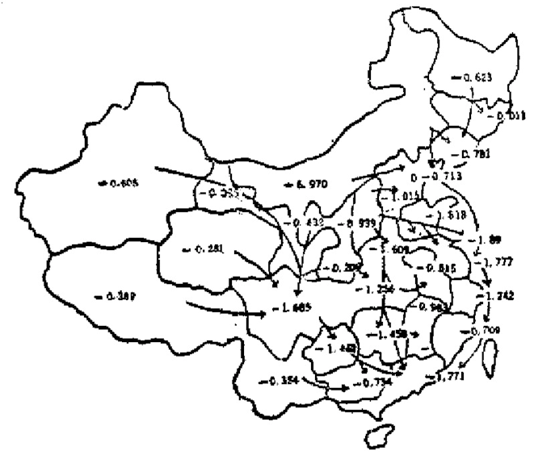

# 第六章 大桶上的两块短板

    我们尚没有用尽能源，
    但是我们正耗尽着廉价
    的石油和天然气，耗尽着
    用来改善能源供应系统的资
    金，耗尽着处理浪费现象所
    应具有的能力，耗尽着为进
    行调整所需要的时间。
                    —— 【美】D.Hayee

## 6.1 水桶定理与五大难关

  在科学哲学中，有个关于常识性的所谓精神水桶理论：
人的精神，起初只是一只空水桶，经过我们的感观积累起来
并得到消化的材料就倒入这个水桶之中。洛克的白板理论、
贝克莱的经验论以及休漠的实证主义都是这种理论。这也是
教育学上的“仓库理论”的哲学基础。

  水桶理论或仓库理论现在受到了严厉的批评。不过，如
果我们不去争论倒入水桶中的材料是从怎样的哲学渠道得来
的话，那么可以得到一条有用的“水桶定理”。

  水桶定理：一个水桶的容量由最短的那一块木板决定
（对于非木桶，就由最近底面的缺口决定）。

  这条定理不需要证明。正如一个人的“精神容量”由这
个人最弱的一个精神特征所决定一样；一个国家的发展限度
是由这个国家最短的限制尺度所决定的。

  中国这个“水桶”是足够大的，可惜其结构极不协调。
“中国水桶”目前最长的一块“木板”是人口，其余的“木
板”跟它比起来都显得太过短少，结果使这块过大的“木板”
成为一个沉重的负担。而这个水桶最短的两块“木板”就是
能源和交通。对我们2000年的目标来说，它是比人口的压
力、资金的缺乏、人才不足、管理落后、水土资源的破坏、
环境的污染等更为紧迫的一个限制因子。

  正如世界性资源分布极不平衡的状况曾经是造成贫困和
战争的根本原因之一那样，本世纪70年代才爆发的第一次能
源大危机成了世界性政治变革的重大推动力：所有的工业国
在政治和经济的混乱之中，最后都选择了优先发展科学技术
的道路，而主要的目标之一就是希望解决能源问题。

  中国在60年代就动手搞能源“重点建设”，但由于技术水
平低，又一再受基建规模过大的影响，结果越搞越缺，到要
压缩基建投资时，开发能源的资金又被压掉了。此外，更由
于我们缺少其他产品可以代替能源出口，本来最不应该出口
的东西又被迫拿出去，从80年代以来，我们每年出口石油约
1000万吨，因油价下跌，每年损失8亿美元，致使能源问题
愈加紧迫。

  我们曾经提过，中国2000年的翻番目标，最困难的任务
是用翻一番的能源支持翻两番的产值。

  在“2000年翻两番”的目标确定之后，1982年11月我国
第一部能源政策纲要——《中国能源政策纲要建议书》由专
家们提出来了。当时，从1980年我国的能源产量折合成标准
煤为不足6.4亿吨、消费总量为6.0亿吨出发，无论怎样计
算，到2000年我国的能源供应只能达到约11-12亿吨标准煤
的水平。[^180-1]但用这一数量的能源支持28000亿元的产值却被
认为是可能的，一种真正史无前例的能源政策就这样被确定
了。历史上还没有过哪一个国家在20来年内用翻一番的能源
达到翻两番的总产值。

  我们的决策者和宣传界常常忘记学者们所提的先决条
件：如果我们各项经济效益指标提到全新的水平，如果我们
的节能措施把能源的经济效益提高一倍，如果我们的能源弹
性系数能从1.42降为0.5，……。在此前提下，参加制定能
源政策的大多数专家们都肯定“这不是不能做到的”。

  是的，“这不是不能做到的”。可惜这只是专家们的理论逻
辑的结论。事实的逻辑又如何呢？可先看表6.1（选用1980
年的情况为便于比较）：

  从表6.1可以看到，我们的能源缺口大，使用效率低，人
均消费水平低，生产耗能量大。此外，能源分布不均，资金
严重短缺，再加能源科技水平低，缺乏人才，管理落后等限
制，我们要推行1982年制定的能源政策，真是难关重重。

  让我们来看一下更具体的情况。

[^180-1]: 以7000大卡热能折合1公行煤计算。参看《经济研究》1982年12期，第4页。

[^180-2]: P=能源消费量年均增长率 / 经济发展年均增产率

  80年代初我国的解源弹性系数[^180-2]为P=1.42，一般先进
工业国为0.8，为实现我国能源政策所确定的目标，应达到
P=0.5，比先进工业国的技术水平还要高出1/3！若以目前每
亿元产值要供应10万吨标准煤计，到2000年前就需要28亿
吨。即使加上种种技术改进和节能措施的考虑也至少要20亿
吨。想拿11-12亿吨当作20一28亿吨用，缺口达40%！显然
是一大难关。

表6.1 中、美、苏、日能源情况比校（1980年）

----------------  --------  --------  --------  --------  ----------------------
国别                中         美        苏         日            注
----------------  --------  --------  --------  --------  ----------------------
煤产量（万吨）       62013     76295     71640      1804    世界总计875100

石油产量（万吨）     10595     48500     80$00              世界总计298370

天然气产量            143       6464      4350               世界总计16220
（亿立方米）

水电装机容量          1605      6000      3150      2380    中国水能利用率
（万吨）                                                        2-5%

能源年产量             6.4       21       19.4       0.4     世界总计93.4
（亿吨标准煤）

发电量                 3.0      22.9      12.8      4.81     中国仅政美国13%
（千亿度）

年消费能量*            6.0      23.7       14.9       52     中国仅及美国的1/4
（亿吨标准煤）

人均年消费能量         0.6      12.8        6.8      4.7       中国仅及世界水平，
(吨标准煤)                                                   （2.0)的36%不及美
                                                               国1/21（4.7%）

一美元国民产值能       2.50      8.92       1.22     0.26     世界0.84，印度0.79
耗（公斤·标准煤）

能源总利用率（%）       30        51                   57      中国1982年只有25
----------------  --------  --------  --------  --------  ----------------------

* 指商品能耗。若计及非商品能耗，中国的值约为0.9，为世界平均商品能
耗水平的45%，美国水平的7%（不足1/14）。

数据来源：《联合国统计月报》1981年6月：《财经研究》1982年6期，第
16一20页；《财经问题研究》1985年1期，第33-39页；《人民日报》1985年7月
18日；《未来与发展》1983年4期第37一38页；《世界人文地理手册》知识出
版社，1984年，第218-219页；《新疆能源》新疆人民出版社1982年第6-46页。

  最奇怪的是，自从翻两番目标提出后，一方面是能源需
求急剧增加，另方面是能源工业内部比例失调继续扩大，生
产增长缓慢，煤炭、石油、天然气产量还有所下降，1981年
的能源生产总量只有6.3亿吨，消费总量只有5.9亿吨（标准
煤）。江苏省报告，1983年缺电力60万千瓦（占负荷20%），缺
电量30亿度（占用电15%），影响工业产值100亿元；辽宁报
告，从1970-1983年全省工业总产值增长1.3倍，而发电量只
增长89.5%，煤炭产量反而下降4.9%，直至1985年全省仍约
有20%的工业生产能力不能发挥。全国最大的华东电网1982
年超计划用电11.45亿度，此后计划用电天天超指标突破，
大群钢铁、建材、化工、造纸、化肥、电解等耗能工业还在
大上，快上。宝钢一期工程，金山二期工程等早已试车投产
了，却不见有新增大机组投入电网运行，旧电网竟是“巍然
不动”。资金缺乏，燃料紧张，管理落后，压力重重。上海规
划到2000年每万元工业产值耗能要从1980年的2.57吨降为
1.40吨。但1985年的相应值，化肥为37吨，水泥、石灰、砖
瓦工业为25吨，玻璃为11吨，造纸为6吨（标煤）。事实与目
标相差太远了。全国经济大户尚且如此，其他可想而知。据
统计，目前全国缺煤2,000万吨，缺油1000万吨，缺电力约
1000万千瓦，缺电量6000—7000亿度，工业生产能力有30%发
挥不出来，许多地方的工厂，开4天停3天，甚至开3天停4
天。电力仍大量转去用于电冰箱、高级宾馆等非战略方向
上。一间中等规模的现代化宾馆年耗电量在一千万度以上，
而按电冰箱的国内销量估算到1990年，年耗电量将达60亿度
以上，在能源奇缺情况下，在宾馆、冰箱上赚得的钱是要以
工业方面的损失作补偿的。仅仅为供应冰箱所需电力的投资
就需几十亿元。从70年代末期以来，全国每年仅因缺电使工
业产值大约损失1,000亿元！[^183-1]相当于当年工农总产值的10
一18%，却还不觉得有什么不妥。而1973年的石油危机不过
使美国国民生产总值损失3.1%，日本损失11.9%，西德损失
4.8%，英国损失4.8%，法国损失2%，整个资本主义世界
已经震翻了天。中国目前这种情况决非三五年可以解决，这
是第二个大难关。

  中国能源利用率太低、浪费太大是造成能源长期紧张的
重要原因。其中不合理的电价是造成能源浪费的一大原因，
直到目前，不少城市的工业用电每度电费仍只收一角，大耗
电单位仅收5分，农业收6分，均低于发电成本。[^183-2]我国单
位国民生产总值能耗世界第一。我国国民总产值每增1美元
的耗能要比日本高7倍！比世界平均水平亦高近3倍（参看
表6.1）。

[^183-1]: 各数据参看：《未来与发展》1985年2期第34页；《财经问题研究》1985
年6期第49页；《理论与学习》1984年5一6期第23页；《财经研究》1983年6
期第53—54页，《经济与社会发展》1985年8期第24页；《中国统计年鉴1984年》
第230—231页：《光明日报》1987年5月29日，1986年12月11日。

[^183-2]: 《光明日报》1987年5月29日。

  我国每亿元国民收入消耗的标准煤，1978年为17.4万
吨，比“一五”计划时期的9.18万吨高89.5%，比1965年的
13.6万吨高27.9%。1980年每亿元国民收入的能耗比1965年
高21.5%，致使能源在低价政策亏损情况下，在工业产品中
的成本仍然占20一70%。我们步步向着耗能大国方向发展，
效率却步步低下，成了一种高投入、高消耗的发展。（参见下
表6.2)

表6.2 中外能源利用效率比较（%）

------------------------------     ---------------    ------------------
                                        中国             一般工业国
------------------------------     ---------------    ------------------
钢铁工业综合热效率                        28                 55-60

氨肥生产的热效率                          25                 50左右

交通运输能源利用率                        6-8                20-25

火力发电效率                              28                 35-40

治金、化工、轻纺用的锅炉热效率             50                76左右
------------------------------     ---------------    ------------------

来源：《阜阳师院学报》1984年2期，第57页。

  从表6.2中可以看到技术落后、设备落后的一个最清楚
表现，决不是想改就可以改，想节约就可以节约的。这是第
三大难关。

  中国已探明的煤炭储量约90%集中在比较荒凉的山西、
陕甘青宁和内蒙等地，华中，华东，华南只有2%；水资源
约70%在遥远的云、贵、川、藏地区。以东部沿海15个省
计，1984年工业产值占全国71.2%，动力资源却不到10%。
这样，中国必须面对要把几千万吨煤和几万兆瓦电输送到几
百公里以外地区的棘手问题（见图6.1）。北煤南运，西煤南
运，西电东送，不可避免。这不仅投资大，技术高，更重要
的是，我们将会看到，中国的交通网现状是非常令人失望的。
这是第四个难关。

  中国能源已探明的后备储量不足。现在大庆许多油井出
的油是用电换来的（每千瓦电的基建投资2,000元）。用电把水
强压下去，而带出来的油往往只占水的10%到20%，有些已
经连压也压不出了。目前全国每年维持一亿吨石油的产量，
要新投入800万到1,000万吨的生产能力。而在陆地上，不仅
“十来个大庆”没有找到，连第二个大庆也未找到。大西北
的南疆找到一个好苗头，离乌鲁木齐却有一个星期的汽车路
程。近海石油的开发也不理想。最有希望的南海石油，现在
的开发速度比几年前设想的慢得多了，不少外资已经撤走。
有人估计，到2000年中国的能源投资仅可达205一288亿元。
即使南海石油到2000年能达原来日产350万桶的设想，相应的
投资要350亿美元。其中以一半为外资计，这份债务也不易对
付。能源的开发程度低，开发资金无着落。这是第五个大难
关。

## 6.2 0.21型文明

  中国的能源正如耕地的情况一样，在宣传中所讲的绝对
数学不算少，但被人口的那块特长的“木板”一比就显得缺
口太大了。从更为有意义的人均能源可采储量来说，中国又
是个“贫下中农”户。

  中国煤炭储量1.44万亿吨，占世界13%，居世界第三
位，但人均可采储量为101吨，仅达世界平均值的40%；中国
水能资源6.8亿千瓦，居世界第一位，但可采量只有3.78亿
千瓦，人均可开发水电量为1,965度，仅达世界水平的81%；中
国天然气和石油资源的人均拥有量更只有世界人均水平的
50%，苏联的1/7，美国的1/10。[^186-1]

[^186-1]: 见《公元2000年的中国》科学技术文献出版社，1984年，第34页。

  中国能源的缺乏，最清楚地反映在农村能源问题上。正
当我国农村经济开始恢复和发展的时候，切不可低估这个问
题的严重性。

  中国如此广大的农村，小火电厂只有171家，而且设备容
量少，管理水平低，经济效益差。目前全国40-50%的生产
队还未通电，生活用能每年主要靠5亿多吨秸秆、1亿多吨
薪柴、900多万吨牛马粪和500多万吨煤支持，却还有一半农
户每年缺烧3一6个月，全国农户每年平均缺煤两个月。由
于民用炉灶的热效率只有约10%，所以在6亿多吨秸秆、柴
中有5亿吨以上是浪费的，可折成3亿吨标准煤，相当于
1981年全国火力发电消耗煤的两倍多。另外据贵州1980
年的一个统计，全省森林年增长量只有900万立方米，仅及该
省农村烧柴量的3/5；甘肃的敦煌县，原有林木39.6万亩，
解放以来，几乎每年烧掉一万亩，现已所剩无几，群众还在
到处铲草皮、搜山樵，继续大面积破坏植被。1980年全国烧
掉木柴1.8亿立方米，1984年我国生产工业用木材5,500方立
方米，而同期生活用木材是它的2.54倍，估计全国1.8亿户
农民每年的生活用能要烧掉17亿吨秸秆（每户每天要4,500大
卡有效热量，约26一27斤秸秆）。[^187-1]这个问题若不能解决，山
封不住，林育不成，水土如何保住？由于秸秆不能还田所造
成的农业生态严重破坏的局面又如何解决？

[^187-1]: 见《江西财经学院学报》1985年第2期，第101页；《贵州社会科学》
1981年6期，第10页；《科学，经济、杜会》1983年2期第37页；《生态学
杂志》1985年4期，第46页。

  按世界84个发展中国家的统计表明，人均能耗要达到每
年1.6吨标准煤（我国1980年为0.6，见表6.1），国民生产总
值才能达到1000美元/人·年。这被认为是现代化生活水平
的最低指标。以下是国外接近现代化最低水平的人均消耗与
我国农村人均能耗的一个比较（表6.3）。

  每一代的文明有每一代的量度方法。1964年苏联的天体
物理学家H·C·卡尔达舍夫提出一个有趣的想法，他把工业
技术能量需求水平当作掌握资源程度的量度，将宇宙的文明
分为三类：以接近目前地球水平（年能量需求约为10^16瓦）
为I型文明，以能掌握自己恒星所辐射的能量（每年约10^28
瓦）为Ⅱ型文明，以能掌握整个星系尺度下的能量（每年约
为10^36瓦）为III型文明。后来，美国的卡尔·萨根进一步把
三型文明各分成10个次型，例如，10^16瓦为0.1型，10^17瓦为
0.2型……等，按此，地球目前的水平仅属0.7型文明。从表
6.3可见，中国的人均年消费能量只有世界平均值的30%。
若以世界人均年消费能量（2吨标准煤）为“地球的I型”
文明，中国就是“地球的0.3型”文明，即宇宙的0.21型文
明！这就是说，人类向现代文明世界走7步，中国人才走出
两步。

表6.3 人年平均能耗抽样调查结果

---------  ------------   ------------    ------------    ------------
项目        我国                            外国
---------  ------------   ------------    ------------    ------------
            折算能量        能量比重         折算能量        能量比重
            (公斤标煤)        (%)            (公斤标煤)        (%)

衣           15              3.0             108              6.7

食           300             60.0            323             20.0

住           100             20.0            323             20.0

行           5               1.0             216             13.3

用*           80              16.0            646             40.0

合计          500             100             1615            100
---------  ------------   ------------    ------------    ------------

* “用”包括文化教育、医疗卫生，体育娱乐等。

来源：《未来与发展》1981年3期，第20页。

  我们曾轻率地决定把烧煤的锅炉改成烧油的锅炉，讲
了许多烧油的优点。刚刚执行完毕，又将烧油的锅炉再改成
烧煤的锅炉，又讲了许多烧油的缺点。这样一个反复，全国
损失几十亿元。[^188-1]中国目前的能源政策表明，未来仍然要以
煤为主，这无疑是合理的选择。但煤的问题也最多。

[^188-1]: 见《经济问题探讨》1984年1期，第9页

  “女儿之山，其上多石涅”这是战国时期的《山海经》
所记，是我国有关煤的最早记载（石涅即煤）。如果从考古上
看，六七千年前的新石器时代，我们就开始利用煤炭了，可
以说是历史上的“老先进”。时至今日，却又落后得令人吃
惊。过去我们也曾批评农民乱开小煤窑，破坏了资源。但上
头一句“有水赶快流”，我们马上又大规模宣传农民办矿的开
放政策如何有利。《人民日报》1985年7月28日有一篇文章报
道《农民挖煤利国利民》，1978年底全国乡镇煤矿矿井数为
17800处，到1985年中发展为61000处，增长2.4倍，但产
量只增长1.2倍。到1984年，农民挖煤已占全国原煤总产量
的27.5%（1978年只占14.5%）。规模越来越小，占总产量的
比例却越来越大。有些省级领导人甚至说：“煤窑就应该给农
民干！”这一句话，不知又将造成多少损失！以宁夏汝箕沟在
国际上有很强竞争力的优质“太西媒”为例[^189-1]。由于提倡
“国营、集体、个人一起上”，又全无资源回收指标，在该矿
区11公里浅煤层线上，小煤窑竟打出200多个井口，1985年，
矿区国营单位产煤63万吨，消耗储量80万吨（回收率达
79%），而小煤窑产煤约80万吨，消耗储量却高达404万吨。
回收率还不到20%！目前该矿区每年浪费223万吨优质煤，
以50%出口换汇率计，损失亦达1亿多美元。该矿区储量不
足2.3亿吨，自1966年以来，已动用储量7千万吨，但实际
采煤仅1500万吨。回收率只有21%。全矿区现只剩1.4亿吨
储量。按此，不足20年就会全部毁损。

[^189-1]: 参看《光明日报》19087年1月12日。

  世界的煤炭工业正向大型化、综合化、自动化方向发
展，大家争相用最先进的科学技术搞能源，我们却继续大规
模“土法上马”。实在与世界发展趋势背道而驰。

  买得便宜柴，烧了夹底锅。地方煤矿占有储量少，勘探
程度低，基建资金不足，技术力量薄弱，管理落后，企业亏
损多，安全状况差，恶性事故不断发生，百万吨死亡率比国
家统配煤矿高，产、供、销脱节。而其中最大的问题是投资
的效益少，资源浪费严重，据一位学者掌握的数据，我国一
般先进的煤矿，资源利用率也只有40一50%，县级矿为20一
30%，县以下为20%，现在颁布了“资源法”可惜内容太简
单，贯彻、执行难。资源的浪费、破坏，仍有增无减。

  我国的能源价格是个最令人头痛的问题之一。煤炭生产
需要补贴是世界性的现象，不过以我们的情况为最特殊。目
前在北京拉一车河沙进城比拉一车煤进城还值钱。我国的煤
价一般只有外国的五、六分之一；用煤换取其他商品计，也
只有三至十分之一。例如据中国煤炭经济研究会1985年提供
的数据，美、英、日、西德等国，一吨煤换0.102一0.222
吨钢，中国只能换0.025吨。一吨煤换其他商品的情况如
下：麦，外国0.378-0.490吨，中国0.064吨：棉，外国
30.176一46.384公斤，中国6.0公斤；糖，外国0.306一0.350
吨，中国0.014吨；食油，英国0.057吨，中国0.009吨；肉，
英、西德42.222一61.875公斤，中国10.37公斤；电，英、美
1037—1629度，中国275度，……

  煤炭产品的价格与价值过分背离情况是从50年代就已有
所知的，而且随即动手想加以解决。从50年代以来，我们对
煤炭产品作了三次价格大调整。但三次提价的结果，却以三
次生产成本的更大增长作报应，致使原煤单位成本从1957年
的10.90元增为1983年的22.33元，翻了一番有多。继1958年，
1965年之后的1979年第三次调整煤价，平均吨煤售价提高
5.00元，但到1982年单位成本又升高5.83元，再次出现全行
业亏损。成本高于售价，连简单再生产也得不到补偿。造成
煤炭生产成本不断上升的原因是矿井的开拓延深和巷道的延
长（据中国煤炭经济研究会的报告全国矿井每年开采深度约
下延10公尺，1964年末的巷道长仅为9194公里，到1983年
增为25324公里），井下劳动力更新快，新井投产标准低，达
产时间长，对地面造成塌陷、破坏农田、毁坏建筑、损害水
源的赔偿费越来越大。据最近对44个矿区的调查，平均每采
1万吨煤塌陷农田0.5一8.2亩。淮南矿务局已有40个生产队
没有耕地，徐州矿区有3个生产队人均耕地不足半亩[^191-1]。加
上近年加重津贴、奖励，补还欠账，全国性价格政策的变
化，特别是材料费涨价，各项政策性支出（工会、教育、旅
差、会议、贷款利率、工资，补贴、补助等费用）的提高等
等。这一切，使能源的价格问题成了当前价格体制改革的一
大难关，而价格体制改革是我们整个经济改革成败的关键。

[^191-1]: 见《光明日报》1988年6月20月。

  一个更能深刻反映中国能源困境的问题，表现在煤矿职
工的生活条件和待遇方面。以“煤铁之乡”闻名天下的山
西，对中国经济建设的贡献甚大。这个地区煤炭的开发利用
至少在1500年前已经开始。现在，山西有5条铁路，6个出
口。据国家统计局测算，山西的煤每运出1000万吨，全国
工业产值可增加170亿元，税利增加42亿元。但山西至今却
仍是一个经济后进地区，1983年的重工业产值还不如广东，
轻工业只及广东的21%，国民收入排在全国第18名。这本身
就够不正常了。

  山西全省职工有1/3从事煤炭生产。这种地下作业，劳
动强度大，工作时间长，劳动环境危险，有害气体对身体的
损害严重。据北京矿务局的调查，一般井下作业人员的工作
年限只有12-13年。但即使这样，煤矿工人及其家属的生活
条件怎样呢？为了解这一情况，笔者在1985年8月间到煤都
大同走访了几个最大的矿区，所见情况，使我惊骇不止。

  穿过西衔雁门，东跨河北，南屏三晋，北临燕云，中插
云天的北岳恒山，就进入大同盆地。这个远古时代的“大同
湖”是目前中国最大的煤炭基地，已探明的储量375.8亿吨。
大同矿务局为我国最大的矿务局，目前有13个生产矿、15对
井口、130个正规采煤队、67个掘进队、60个开拓队，还有两
个工程处、一个机修厂、一个化工厂。全局职工12.4万人，
其中工程技术人员1,587人（仅占职工总数不到1.3%）。矿务
局总部近旁就是煤都最大的姜家湾云岗矿区（离大同市约20
公里，就在著名的云岗石窟以西5公里）。云岗矿区职工上万
人，连家属至少有二三万人，户数当在五六千户以上。但矿区
周围砖砌住宿楼房只有20栋，每栋四层，每层约21户，一共
约只能住上200多户人家。即使再加倍算，也是十未得一！
其余的人全住在周围小山坡或路边破烂不堪的泥房子里（见
图6.2）。

图6.2 中国煤都最大矿区云岗矿总部职工宿合（作者摄于1985年）

  从大同往西，经青磁窑矿，晋华宫矿、吴管屯矿，姜家
湾矿，以及西南一线的忻州窖、煤谷口、同家梁、永家庄、
大丰沟、新白洞、老沟、鸦儿崖、挖金湾、王村等地，除各
矿区总部有少数楼房外，全是一片片低矮、拥挤的泥房子，
有些“泥房子”比1500多年前挖的云岗石窟还不如。30多年
来，一群对中国的经济建设立下特殊功勋的劳动者，现状竟
是如此！实在令人于心不忍。

  中国的太阳能、风能、潮汐能等等，可以说是无限的，
但由于技术上的困难，全不是在本世纪内可以指望的东西。
还有一个希望就是核能。美国目前有核电站85个，发电量已
达6,700百万千瓦；苏联仅1984年在建的核电站发电量就达
2,100百万，连台湾也有六个核电站了。可惜中国的核
电站现在才动手兴建，短期内也不是可以依靠的东西。水能
本应有相对优势，可惜又未抓好。我国水能藏量居世界首位
（6.8亿千瓦），虽然可开发度不高，也有人估计为3.7亿千
瓦，可发电1.9万亿度。而到1985年底，实际开发容量仅为
2641.5万千瓦，年发电量只有923亿度，分别占可开发量的
7.1，4.8%。而世界相应的平均水平是20%，发展中国家的
平均水平为8%，我国水能发电量只占全年总发电量的20%。
水能本来就是投资大，见效慢，必须长期稳步抓紧发展的，
可是我们却把水电与火电奇怪地同列为二次能源，实行“抑
水扬火”政策，水电发展既缺资金，又无独立经营权，更无
统一发展计划，一些重大项目反复搞“上马下马”，人为拖长
建设周期，弄得声誉甚差。这样，能源的困难显然已成为中
国实现2000年总目标的一个重大疑难。

## 6.3 专拖后腿的先行官

  目前，全国铁路货运量的一半，水运货运量的45%都在
运煤。山西的铁路，90%在运煤，但1984年山西积压待运的
煤还达3,000万吨之巨。1986年头三个月全国有1,300万吨煤
积压待运。中国等待装运的煤比许多国家地下储藏的煤还
多，但与此同时，广州市却要用宝贵的外汇从澳大利亚进口
煤。能源产地远偏北锤，消费中心却在东南。国家经委综合
运输研究室曾估计，全国因煤炭运输不力而使工业生产总值
增长速度降低2一3%，而因车辆破损及管理不善所损耗的
煤炭达2,000万吨，等于开滦煤矿全年产量付之东流。仅此
一项每年损失6亿元（水运每年另外损失200多万吨未计入
内）。[^194-1]中国能源问题的困境，是跟交通问题扣在一起的，然
后，又跟整个经济发展和社会活动扣在一起，一环扣一环。
或者说，一块短板挨着另一块短板。没有什么比这更不幸，
更令人头痛的了。想只修补一块板，这个水桶还是装不下应
装的东西。

[^194-1]: 东北财经大学《财经问题研究》1985年5期，第33页；黑龙江《学习与探
索》1985年2期，第77-78页。

  中国人把交通称作先行官，却长期听任先行官拖后腿，
现在已经到了难以容忍的地步。

  在1986年1月20日北京学术界第30次经济社会发展战略
座谈会上，集中讨论了中国的交通运输和邮电通讯问题。学
者们发出的是一片批评、指责之声：中国的交通形势，陷入
使人难以想象的全面紧张的状况之中。（见下表6.4）

表6.4 中国运输网状况统计（1983年）

-----------------------    ---------------------------------------------------
运输网总长138万公里           占世界4.5%，比1949年6.3楷，但客、货运增41.5低，15倍
-----------------------    ---------------------------------------------------
铁路营业里程5.16万公里        占世界4%，比1949年增1.3倍，但客、货运增10.30倍

公路通车里程9.16万公里        比1949年增10倍，但客货运增90.30倍

内河通航里程10.9万公里        运力比1949年增10倍，但运量增26倍

民航航程22.9万公里            民用机场75个每周航班600个。仅及香港启德机场三分之一

年货运周转量3095亿吨公里      

年客运周转量13.795亿人公里    人均年乘火车一次（印度6次，日本70次）
                             不及美国人均乘飞机次数，人均年乘长途汽车
                             3.3次，乘船0.27次，乘飞机0.0038次

每万公里交通线14.3公里         世界平均22公里

铁路密度                      美3.27 苏0.63 印2.04 在109个有铁路国家中
 0.53公里/百平方公里        中国占68位。美13.46 苏5.31 印0.92在109个有
 0.51公里/万人              铁路国家中，中国占102位

轶路机车10360台              74.5%为过时蒸汽机车，其中4000多台服役
                             超过40年

公路密度                      美66.8 中国每万农村人口只有7.9公里
 9.47公里/平方公里         美274.64 中国每万农村人口只有7.9公里
 8.95公里/万人

海吞吐量2.8亿吨/年             人均吞吐量为0.27吨/年，世界平均为1吨/
                                年，日本为10吨/年

港口泊位330个                  不及汉堡或纽约或鹿特丹一个港口泊位数。
                              中国万吨级泊位143个，吞吐力10万吨以上港
                              口58个

汽车每百吨公里耗油8.5升        工业国一般为5升

运输能耗0.4亿吨标煤占能源      美、苏、日相应为25、14、45（亿吨），各占
消费8%                        26%，8.8%，15%

输油管道能力1.09亿吨            管道利用率仅50%

邮路500万公里，邮件309亿         邮件比1950年增30倍：人均电话机0.006部，
件，电话机340万门（1985年）     香港1982年时电话机已有200多万门
-----------------------    ---------------------------------------------------

数据来源：《公元2000年的中国》科学技术文献社1984年，第165一185页；
《中国统计年鉴1984》第277、279、285页；《百科知识》1989年11期，第5页；
《世界经济导报》1985年6月10日，《中国社会统计资料》中国统计出版社
1985年第110一111页，《未来与发展》1986年2期，第15页《浙江学刊》1984年
5期，第9页。

  中国35年来仅建成3万公里铁路，美国曾在1年内就建
造1.92万公里。中国人口占世界总人口数22%，铁路长度却
只占4%，人均密度竟排在倒数第8位（见表6.4）。平方公
里密度只及东德的1/24，美国的1/6，日本的1/12，印度的
约1/4[^196-1]。目前全国许多地段的铁路客车，严重超载，几乎
已无立足之地。人们拼命勉强挤入车厢，便再也不能移动半
步，整个车厢不时爆发阵阵充满仇恨的争吵、吆喝声。当你
耐不住困倦不得不在脏污的地板上坐下时，腿不能伸，腰不
能直，上厕所的同胞们脏湿的鞋底还不时从你面上，身上掠
过……笔者近年两次在浙赣线和京广线半路上车并在车厢里
过夜就有过这种痛苦的亲身体验。据上述会议提供的数据，
目前，全国旅客列车平均超员30一50%，每年有1亿多旅客
是靠超员运输的；待运货物估计有1.5亿吨，铁路运输能力
按各种估计，只占客货运输任务的50-70%左右[^196-2]。1984年
“七大部”联合集中一批专家研究认为，现有铁路即使不跑
货车，全部载客，也无法应付。东北仅玉米一项，每年要求
调出220亿斤，但由于铁路、海港患了“食道癌”，只能运出
60多亿斤，每年要增加100多亿斤玉米的库存，保管费多花
20个亿，而且储存3年便要报废。1983年铁路货运每天装车
数6万多辆，而申请待运数8万多辆，每年积压货物两千多万
吨，贵州是全国铁路投资的重点，有个以贵阳为中心的“铁
十字架”。目前，全国每公里营业铁路担负的货运量为2.25万
吨，货运密度为1,382万吨/公里，贵州只有1.2万吨和757
万吨/公里，但即使这样，除湘黔线以外，其余贵昆、黔
桂、川黔三线已超负使用，常年积压煤矿产品约200万吨。[^197-1]
占全国重工业产值第一位的辽宁，1985年每天平均有3,000
多个车皮发不出去，生产单位的内外声誉大受影响。全国运
网中的“卡脖子”限制口，1965年只有4个，1980年增为9
个，目前发展为20多个。中国的铁路现状如斯，可说已到了
危险的临界点。

[^196-1]: 据毛汉英等《世界人文地理手册》，知识出版社1984年第324页数据计算

[^196-2]: 《未来与发展》1986年2期，第6页。

  我国铁路资产近700亿元，占全国国营企业固定资产的
1/8。但上缴税利仅占国家财政收入的1/50。拥有300万职
工的铁道部每年上交利税还不及一个大庆油田[^197-2]。经济效益
之低，由此可见。此外，铁路技术落后，设备陈阳、电气化
的铁路约只有总长度的1/13（1985年约达4,100公里，估计到
2000年才能达2万公里，即只能达1/4。）而且时速慢，密度
小。目前我国火车时速大多只有70一90公里，预计2000年才
能达到160公里，铁路线日发车量在15一33对之间，而且
76%仍用连印度都早在1971年就停止生产的蒸汽机车，单机
牵引力要到2000年才能发展到5一6千吨之间。外国目前火
车时速多为160公里左右，某些时速达200一300公里的线段
已在试验;日本、西德日发车量为240一275对，有些达300
一350对，发车时隔为5分钟；日美的单机牵引力已达5一8
牛吨之间，且可双机联用、达1万一1.4万吨；苏联已试验
成功33500吨的7公里长列车。我国铁路每百公里需要修理工
175人，而美国只需13人。铁路接近成网的只有东北、山西
少数地区，连华东、中南、华南等重要经济地区，铁路仍远
未成网。我们曾大谈西北，西南的开发战略，可是这些地区
除个别线路外，铁路几近空白。成都到广州900英里的铁路，
货物要一个多月才能运到，在西方两天就够了。所以西部的
物资就是运不出来。笔者曾接触几位云南的地方干部。他们
说，从科学院、大学请专家去研究“发展战略”不知多少次
了，钱花了不少，问题却无法解决。我问：“主要问题是什么
呢？”他们说：“东西运不出来。”没有路，没有网，研究什么
“发展战略”呢？简直成笑话。全国铁路170多条，在昆明、
成都，兰州以西的只有3条。新疆每平方公里只有0.93公尺
铁路。西北地区的交通还是赶着牛羊，驴驮皮毛的类似马帮
队的形式。16世纪初，明朝学者王阳明被贬贵州时曾叹“连
峰际天兮，飞鸟不通。游子怀乡兮，莫知西东”这种景状，
至今在西部地区还到处可见。有人批评过去片面强调支援
“三线”，重点抓了西部和西南的交通建设，忽视了东部地区
的交通发展。这是事实，但若没有这一下子“重点”，今日西
部的交通就更不堪想象了。

[^197-1]: 《蒙古社会科学》1984年2期，第47页：《贵州投资研究》1986年8期，第6页。
[^197-2]: 《世界经济导报》1985年6月10日

图6.4 类似马帮队的运输：矿区的煤正在运入大同市

  我国经济活力不足的情况还可以从人口流动不活的一个
比较中看出来，以1983年人均流动公里数比较：铁路——日
本2696，苏联1327，印度304，中国（1985年）231；空路
——美国1734，苏联649，印度20，全世界（1982）209，中
国（1985年）11。1981年每万平方公里的铁路营业公里数：
西德1145，美国308，印度206，苏联64，中国（1984年）
54；每万人口的铁路营业公里数：美国12.5，苏联5.3，印
度0.9，中国0.5（1984年）。交通落后也是造成我国国际旅
游收入低的重要原因之一。1983年国际旅游人均收入美元数
为：意大利158.94，美国47.71，日本6.92，全世界20.54，
中国（1985年）1.19，印度1.13[^199-1]。

[^199-1]: 《南方人□》1986年3期，14一16页。

  造成这种状况的直接原因是投资不足，投资效益逐年下
降。“一五”时期，全国交通投资占基建投资17.4%，此后
年年下降，到1981年以后降为10%以下。而这期间，多次叫
过要重点发展交通。进入80年代以来，新建铁路干线每平方
公里平均造价，比“一五”时期高3一4倍，近几年更直线上
升，建设工期也比“一五”时期相应长两倍；固定资产交付
使用率也在下降，投资回收期从建国初期的8一10年到“四
五”计划时期已长达20年以上。[^200-1]

  中国的铁路建设，正面临着两难处境。一方面，同蒲、
京广线以东地区，工农业生产总值占全国87%以上，人口占
全国77%，铁路客运量占全国的80%以上，但建国以来在这
个地区新建的铁路仅占全国新建铁路线总数的20%。压力已
经愈来愈大，加上商品经济发展的要求，非要重点投资不
可。另一方面在西部建铁路，虽然投资大，效益低，却又不
能不建，否则东西差距更大，什么“战略转移”说，必成空
话。正是鱼与熊掌皆需，左右两难。

  按照有关的规划，到2000年，中国将要建成以6条南北
直通，6条东西横贯为干线，以东北、焦枝线以东，浙赣线
以北、大秦线以南为中心的铁路运输网。

[^200-1]: 上海《财政研究》1982年6期，第11页。

  正在修建和规划的新线路有：

  东西向的——集宁白城线，大同秦皇岛线，乌海石家庄
线，中卫太原线，临汾济南线，韩城石臼线，平顶山豫皖
线，大冶景德镇线，柳州蒲田线，昆明防城线，三水茂名
线，南京杭州线；南北向——北京九江线，金华广州线，
包头安康线，连云港南通线，还有边陲的南疆线，滇藏线也
在规划中。显然，国家选定的重点仍在东部。

即使按照世界铁路线的平均密度（每万平方公里82.6公
里）要求，我国的铁路线应有约8万公里长，目前只达到这
个要求的62%。据国家经委的计划到2000年才能接近世界平
均水平，与先进工业国的平均水平差距还很大。若按美国目
前每平方公里0.033公里计，我国应有32万公里铁路。现在
却只有约1/6（有人估计，中国铁路要达36一40万公里才会
显现“过饱和”，即要比目前增加七八倍长度。美国在本世纪
初建成的铁路总长近59.2万公里，后因饱和而拆除，目前剩
32万公里）。在这种情况下，西部、南部的开发还很难真正提
到日程上。

  管楚度曾设想[^201-1]，中国要有10条南北向的骨干铁路线，
要打通喜马拉雅山，用铁路沟通我国西部腹地与孟加拉湾的
海港，再辟一条新线，穿过喀喇昆仑山口，在国境线与巴基
斯坦铁路接口，使我国西部货物从卡拉奇进入阿拉伯海。并
认为，这是21世纪40年代可以办得到的事，而新疆与苏联中亚
铁路的接口将会更早实现，往后便可考虑从新疆沿边境从北
向西再向南，直达西藏南部，修一条半圆形国境线，并接着
修建整条国境环形线。这实在是未来学者的铁路畅想曲，可
惜是我们这辈人看不到的事了。

[^201-1]: 《未来的中国铁路》，见《未来与发展》1981年4月。

## 6.4 公路上的“自相”残杀

  中国在1876年由英国商人在上海建成第一条铁路，因怀
疑会“震动祖坟”而随即被豪绅收购拆毁，至今100多年，还
远未过这个铁路关。

  铁路的优点是散、大、远，短途运输却不如公路。美国
汽车远距达500公里，200公里内的运输不用铁路。所以美国
拆去8万公里铁路（比我国铁路总长还多55%），目前每年还
要拆4,000公里；英国人更拆掉了40%。[^202-1]但是，我国铁路
有1/4的运距小于100公里。主要的原因就是公路运输落后。
其情况，不下于铁路。

  目前世界上的发达国家，无一例外是铁路衰落，高速公
路兴起。世界各国运输均以公路为第一，原因是灵活，快
速，中转少，损耗少，投资少，资金周转快。研究者指出，
100公里运杂货、200公里运高档货、1000公里运鲜货，用汽
车比火车合算。一条高速公路年运量达1亿吨，相当于5条
铁路的运量，投资却比修5条铁路省得多。专家估计，只要
日流量超过1万辆车次，修高速公路就合算。美国仅州际
“超高速公路”总长就有42260英里；西德的公路总长度可
绕地球赤道11圈；英国被称作“安在轮子上的国家”，比利时
平均每22平方公里就有1公里高速公路。可是，我们不仅至今
未有一寸高速公路，整个公路运输网竟可说是残旧缺损不堪。

[^202-1]: 张学礼《我国交通运输业的现状和前景预测》，1984年9月提交中国未
来研究会的报告，待出版。

[^202-2]: 《热流》1986年第2期。

  赵瑜在山西公路局晋东南分局写了一篇关于中国公路交
通问题的出色报告——《中国的要害》，[^202-2]其中提到的事实使
人目瞪口呆：晋东南至今还积压着1958年产的一级无烟煤。现
在该地区有5万多辆车来往于一条40多公里的三级旧山路
上，有事故无法排除，有时整整一个星期寸步难行。向东的
石太公路，现在每天车次从4000增至10000，最多达15000
辆，超过三级公路所能承受最大通过量的5倍。1983年11
月，石太线塞车30多次，其中一次在旧关，1万多辆车被阻
在太行山麓两天两夜。

  赵瑜指出，80年代了，我们的路基本上还是50年代的底
子，50年代建成的成鹰、宝成、川黔、渝厦、川藏、福温、
沈丹、滩石等国家干线公路，至今仍是混合使用的骨干公
路，卡车、自行车、小平车、摩托车、拖拉机、小毛驴、恋
爱散步与坦克车、炮车一齐上路，与先进国家约有半个世纪
的差距！1980年，人均国民生产总值印度为230美元，我们
为270美元，但人均旅行公里数印度为678公里，我们仅为232
公里。在长江“金三角”上，从上海到南京，经过苏、锡、
常三市，竟没有一条直通公路。现有的300多公里公路，全属
三、四级的低标准，只能勉强维持通车，平均时速不到30公
里。据有关部门推算，1984年仅因交通阻塞，使生产企业产
值减少约11一15个亿。，

  我国现有公路9.15万公里.（平均每平方公里只有90公
尺）。公路密度只及保加利亚的约四分之一。其中有40%没有
达到国家规定的技术标准；一、二级只占1.6%，三级占
12.4%，四级占45.7%，其余40.2%为等外。铺有黑色路面
的只有17万公里，只及美国本世纪初铁路线总长的28%，在62
万公里的县乡公路中，有92%是雨天无法行车的土路。贵州
曾为交通重点投资区，但据1985年的报道，全省无一级公
路，二级公路也只有5公里。按《中国统计年鉴》公报的数
字，1983年全国主要的公路线总长有69.844公里，只占总
公里数的7.6%。全国的主要公路干线有60%以上超过设计
使用年限。而且有200多处渡口无桥。此外，还有2个县
5000多个乡、26个大队不通公路。有6千多公里断头路，有
5800多座危桥待修。

  我国1953年建成的第一汽车制造厂与日本丰田汽车公司
起步时间差不多。现在“丰田”年产几百万辆，产品花样不
断翻新，已誉满全球。但“一汽”的“解放牌”却坚持“一
贯制”，年产只有6万辆。到1984年止，全国30多年来累计生
产汽车才230多万辆（投资50多亿元，平均38万元工农业产
值才有一辆），主要车型已生产二三十年！前几年全国汽车产
量年均20多万辆，仅及美国通用汽车公司年产量的5%、丰
田的7%。[^204-1]

  汽车的分配政策十分奇怪，只有13%分给专业运输队
伍，其余分给机关、团体，使用率不高。近两年各地大搞汽
车“高速发展”结果又出现严重失控问题。[^204-2]

  我国现有汽车的经济时速一般在50公里以上，但因公路
质量差，实际行车时速只有30公里左右，经济时效损失达
2/5以上！城市交通车辆的时速一般只有12公里左右。据交
通部王展意的分析，只要把三级公路改成二级公路（沙石路
面改成沥青路面），每万公里的年效益为：行车时速可提高15
公里，车辆拖挂能力可提高50%以上，仅此，运输效益便可
提高35一45%。此外，轮胎寿命可延长4万公里以上，油耗
可节省15一30%，发动机大修间隔里程可增加80%。以接天
1千车次计算，每万公里一年可节省轮胎9万多条、柴油11
万多吨，运输成本减少20%。

[^204-1]: 天津财经学院《经济问题探讨》1984年2期，第32一33页，
[^204-2]: 参看《人民日报》1985年7月15日兰详家的文章《发展汽车工业的几个问题》

  交通部李振江等曾介绍，新汽车的利润比老旧车高达2
一5.8倍，百吨公里耗油下降24.2一28.4%。但目前我国约有
6万余辆汽车使用达60万公里以上，许多老旧车正在转卖给
农民，使目前农村的汽车约有1/3是旧车。这种车不淘汰，最
后受坑害的还是国家和人民。

  目前世界年产大型客车约30万辆，每载客在100一200
人之间。而我国年产大客车只有0.12万辆，仅占世界总数的
0.4%，每车载客只有40一60人之间。我国的客车不仅数量
少，质量差，且重型货车的拥有量也太少。美国1974年10
吨以上的重型车总吨位已占汽车总吨位的84.7%，而我国即
使要达到12%，到2000年前每年平均要增加重型汽车达万辆
以上，这是目前我们的生产能力达不到的。

  按中国汽车工业公司的总规划：到1990年，我国年产汽
车要达60万辆，2008年要达120万辆。这实际上就是“全国
翻两番，我们怎公办”的那种计划，这类“倒过来”的简单
数量类比的计划即使成功，一般情况下，也只能维特原先的
落后比例结构状况。

  城市交通问题更是一只十足的拦路虎。据1983年的统
计，我国241个城市的交通与解放前相比，客运量增长59倍
多，线路长度增长67倍，但车辆仅增长15.8倍。以原有的大
城市计，道路只增加1.8倍，车辆却增加33倍。而且路面特
小。1985年，北京的道路面积率为5.37%，上海为5.67%，
沈阳为5.6%，而东京为13.8%，纽约为24.1%，伦敦为
16.6%，莫斯科为10.5%，华盛顿为43%，巴黎为25%。按
陶铜仕在《关于城市公共交通的几点建议》一文中提供的数
据，国外一些城市的车一人比例，一般为1:700一1000，而我
国为1:2000一3000，甚至有每车负担4000到5000人的。国
外一些大城市道路长度在几千到上万公里，平均每平方公里
有12一15公里公路：而北京道路仅有2000公里，天津只有800
公里，平均每平方公里只有4.7公里。广州人从珠江河的一边
要走到不过一二百公尺的另一边，常常要在汽车上挤一个多
小时。我国城市行车时速一般只有5一12公里，职工上下班每
天有三四小时挤在路上，一年便相当于损失上亿个工作日。
简直不可思议！更严重的是，城市的车祸十分惊人。北京每
万辆车每年死亡率44.8人，天津60.4人，上海41.5人，而东
京为1.12人，纽约为1.38人，巴黎为4.9人。[^206-1]

  美国《时代》周刊1988年6月2日一期报道：中国目前
注册的各种公路车有400万辆，而1985年的交通事故有550万
次，比1984年上升20%，因此而死亡12042人，伤残的就不
知其数了。该报道称这为“中国人在公路上相互残杀”，说中
国在很大程度上对于汽车时代的到来毫无准备。过是很有点
道理的。可借这些批评没有能解决问题。据公安部交通管理
局统计，1986年我国公路交通事故剧增，死亡4万多人（每
天100多人！1987年继续增加，仅10月份一个月，全国公路
交通事放24,119起，死亡4,685人（平均每天156人！其中城
市每天死亡39人），伤15,228人（每天508人，其中城市186
人），直接损失财物2,268万多元。近年，铁路交通接连出了
几个大事故，死了300多人，举世为之震惊。而其实，铁路
事故的死亡率，跟公路上的自相“残杀”比起来，不过是小
巫见大巫罢了。

[^206-1]: 《未来与发展》1986年2期，第10页

  公路上的阻塞和公路上的自相“残杀”可以说是当代中
国一大公害。

图6.5 中国公路运输的理想与现实

## 6.5 断江残水恋单思

  中国的河流有5,800多条，共40多万公里长。但通航河
道只有1/4。中国的内河航运里程在60年代还有17万公里，
但到1983年只剩不到11万公里（见表6.4）。主要的原因之
一是，全国通航河流上有闸坝4000多座，未建通航设施的有
2600多座（占65%），致使内河通航里数比1952年减少37%，
总长度约为5万多公里。以贵州为例，1952年的内河航运有
2854公里，1983年底已减为1661公里，减少了42%！[^207-1]一
条条黄金水道，变成了断江残水。目前，南方的水运死气沉
沉，北方的水运已奄奄一息，有些河道已基本停航。

[^207-1]: 《贵州投资研究》1985年8期第15页；江苏《唯实》1982年2期，第14页。

  造成水运这种状况的另一个原因是对铁路运输的“单思
病”。最典型的例子就是花30多亿元去建一条与长江平行的襄
渝铁路，现在还规划建设宁襄、宁通铁路。而国家30多年来
对航道建设的投资只有一条襄渝铁路投资的1/4，或者只等于
美国同期建设内河航道投资的1/40。

  长江，这条我国最重要的黄金水道，至今还是冷冷清
清，除了江水污染以外，基本上还是唐代李白所见“孤帆远
彩碧空尽”的样子。而在欧美，凡是傻大黑粗的几乎全挤在
河里运。水运条件与长江差不多的密西西比河，货运密度等
于相同长度的18条铁路。其货运量和货物周转量等于长江的
1.5倍和3.7倍。长江目前的运力只相当于一条3,0000公里的
铁路线，其利用率只相当于密西西比河的1/7。若长江的货
运密度能达密西西比河的水平，则相当于10万公里铁路（比
全国铁路还多94%！），或者仅干流部分就可相当于14条铁
路线的运力。而每修1公里铁路，国家最少要投资几十万
元[^208-1]。

[^208-1]: 参看江西《争鸣》1985年1期第85页；《青海社会科学》1985年3期第
9页；《百科知识》1985年10期，第7页。

  造成河运落后的另一个重要原因是政策的不合理和管理
的混乱。通常，每吨公里货物的运价，公路要2角钱。铁路
要1角钱，而水运只需要2分钱。奇怪的是我们许多水道运
输竟比铁路运输价格高出2倍多。例如重庆至宜昌段每400
公里运货价以铁路为100计，水路运煤炭为235.2，矿石为
239.6，粮食为222.2，钢铁为193.4。因此，出川的货物几
乎全挤上铁路（1982年经河运出川的货物仅占总数11%）。[^209-1]
更为离奇的是，从重庆运货到上海，到宜昌便被拦住，货物
要搬上岸，再上宜昌的船队，然后让重庆的船空驶回去上缴
利润。而宜昌又可以上缴运输利润。就这样，到上海还不知
要断几次，这种体制造成的怪异现象，实在是天下奇闻。

  近年开放运输业，航运部乘机把大量要淘汰的废船卖给
农民。这些船木质腐烂，水泥脱落，钢筋裸露，船体变形，
完全经不起风浪冲击。仅1985年1一5月间，长江上船破人
翻的事故已近200起[^209-2]。

  中国海运情况亦不佳，其中以港口压船问题最严重。全
国的港口总吞吐量其实只跟一个鹿特丹（每年3亿吨）差不
多。但目前每日平均进港的约380艘外贸船，只有135艘开仓
作业，还不到36%，每一艘船开仓作业就有1.8艘船在空等。
高峰时期，一天进港外贸船达570艘，超过装卸能力3倍！
为此，每年被罚款一亿多美元。另外还要支2亿美元租用外
国远洋船[^209-3]。1985年7月11日大连、青岛、天津，连云港、
上海、黄埔六大港口仅运送钢材的外贸船只便一下子集中了
146艘，为此，国务院口岸领导小组召集铁路部、交通部、
经贸部、总参、总后和海军有关人员开紧急会议，组织突击
抢运。这是一件真正有中国特色的事情。类似的事情在全国
各地不知发生过多少，它既表现了中国国家体制的优点，也
表现了其特点：能够以不惜一切代价的方式去突击完成某项
任务，却一直企图用这种半军事化的应急方式去解决完全不
同性质的经济运转问题，长期置根本解决问题的方式于不
顾。

[^209-1]: 见《上海海运学院学报》1985年2期，第12页。
[^209-2]: 见《人民日报》1985年7月18日，第7版。
[^209-3]: 《未来与发展》1985年2期，第6页；江苏《唯实》1982年2期，第14页。

  作为河运与海运枢纽的河口港建设亦大成问题。上海是
最典型的例子。解放以来，上海工业增长25倍，外贸增97倍，
出口增34倍，港口吞吐量增42倍，但码头长度仅增33%，仓
库场地仅增15%，泊位仅增5个。结果，1979年就超荷1500
万吨。压船以平均每艘每天6000美元计，要赔款4894万美
元；1980年赔款增加41.8%，达6942万美元。此后仍年年
增加。有些外船竟被耽误达3个月之久。[^210-1]出口商品因迟运而
被削价处理、退货、拒付款等造成的损失还难以估计，外贸
信誉大受影响。压船问题除基础设施落后，组织管理与计划
水平低等原因外，港口淤塞长期未能解决也是一大关键。位
于福建闽江河口的马尾港，原泊位水深5一8米，1974年建
港后，泥沙淤积严重，到1981年最小水深已为0.5米。浙江
的南江原天然航道可通3一5千吨级客轮，1959年在宁波上游
建大闸搞“挡潮蓄淡”使甬江严重淤积，1977年建镇海港
时，港池和航道开挖后不到4个月即开始淤积，不久港口全
面淤塞[^210-2]，损失无可挽回。

[^210-1]: 见《人民日报》1985年7月13日；《国际贸易问题》1981年3期35一38页。

[^210-2]: 见《百科知识》1983年11期，第61页。

图6.6 中国运输的又一个理想（转自中国出口商品交易会的广告）

  综观现代中国航运的状况，使人不得不作一点回忆。航
运其实是中国近代最早发展的民族工业之一，应该是比较有
基础的。李鸿章在1873年搞的招商局，就是建轮船公司，要跟
洋人争生意。招商局的第一任会办郑观应是自愿辞去英商太
古轮船公司经理的高薪职务去工作的。他还是个思想家。斯
诺在《西行漫记》中还提到1936年毛泽东曾表示“非常喜
欢”郑观应的《盛世危言》。以后，招商局成了国民党四大家
族的财产。到1950年招商局在香港起义时，还有十几条船，
而包玉刚那时只有两条船。60年代，招商局把原3层的大楼
总部改成13层楼以求发展，前总经理却为此在交通部挨批
斗，罪名是“把钱扔在香港”。那正是鼓吹“宁要社会主义晚
点，不要资本主义正点”的时候。到70年代末期，招商局还
只不过是缩在香港一间13层小房子中的小本生意经营者，面
包玉刚早成了全球闻名的“世界船王”。

  船舶运输的前途，正在产生世界性的争议。有人认为，
未来这种运输还会蓬勃发展，有人认为，已经日落西山。不
过，在今后10年中，船舶的集装箱运输和整件贵重物品的运
输会被空中运输所代替却是较为一致的意见。

  但这种情况至少暂时并不适合我国。

  据统计，1983年，我国共建各种船舶230多艘，共计
517600吨。并且有人预测，到2000年，我国远洋运输船队
将拥有2000一2500艘船，运货量将达3亿吨。为此要在20
个港口建吞吐能力在10万吨以上的深水泊位。建成以天津、
上海、黄埔为重点的国际集装箱运输中心。另外，建成长城
南北两大内河运输网，是我国2000年的重大规划目标之一。
预计到时，目前的大运河要实现运量1亿吨，长江干流运量
为5亿吨。希望这个规划不会落空。（参见图6.6）

  按《中国统计年鉴》的数据，中国民航客运周转量，直
到1970年才恢复到1949年的水平，货运量直到1965年前，有
减无加，这件事情，足够说明很多问题。

  其实，在同样的距离内，航空客机运客所耗的燃料只有
海轮的1/5。目前世界每年的航空客运量已超过1万亿公里，
正有取代客轮与铁路竞争之势。

  1983年我国国内外航线有203条，航线22.9万公里，载
运旅客391万人次。如果贝跟解放前比，自然又是一个“突飞
猛进”。但1982年我国民航客运量仅占全国客运总量的0.1%，
客运周转量仅占2.2%，而后者各国1981年的相应数为美国
13.5%，日本3.9%，苏联18.0%，西德8.9%。我国民航客
运年周转量仅占世界1/24，为美国的1/75，苏联的1/32，英
国的1/10，日本的1/6，甚至不到印度的1/2。1982年我国每
年人均乘机次数为0.004次，而1981年外国的相应数字为，美
国1.2，日本0.35，苏联0.4，西德0.6。1983年，中国民航
飞机有400多架，仅及美、苏的3%。其中只有3架波音747
为较先进的新飞机。同年民用机场有75个，仅为美国的
1.3%，印度的36%，且多为低级机场。

  中国的交通，从创建、发展，到未来划都是平面型
的，尤以铁路单思病为最。今天，“协和”式飞机的时速已达
2,100公里，世界任何两个大城市的距离基本上不超过10小
时的航程。在全球运输网已经建成，“地球村”的概念正在流
传的时候，我们还在遥想自己的“天涯海角”，整个中国民
航，还在播篮之中。

  台湾1979年完成的“十项建设”对台湾的经济发展起了
重大的作用。其中有六项就是交通建设。中国的规划人员不
仅十分清楚交通落后的状况，而且不断叫喊要加速发展交通
事业。“六五”计划期间还把交通与能源一起列为两大战略重
点。可是实际的投资却是减多加少。按历年统计数据，交通
运输投资占全国基建投资比例：“一五”期间为15.3%，“二
五”为13.5%，“三年调整”时期为12.7%，“三五”、“四五”
升为15.4%、18%，“五五”又降为12.9%，“六五”更降为
10%。真是奇怪也。

  交通系统落后的一个恶果就是造成邮电通讯能力的严重
不足。全国主要干线邮运能力缺20一30%，加上邮政处理场
地缺少50%（40万平方米），电话普及率1983年每百人仅0.4
台，1985年为0.6台，只及世界平均水平（12台）的1/20！
只及1982年美国（76台）的不到0.7%，香港（35台）的
1.7%，台湾（21台）的不足2.9%，建国以来，工业增长56
倍，电话机只增7.4倍，后者为前者的13%。即使实现邮电
部门提出的翻三番的目标，到2000年每百人电话也只有2.8
部[^214-1]，仅及目前世界水平的23%。据国外统计，用通讯指挥
调度交运系统，运力可提高50%。美国用48万美元建立了阿
波罗登月计划的专用通讯网，结果每年节省的出差费就达
122万美元。对比之下，中国邮电通讯的神经线不知落后到
什么程度！

  正当国内许多人纷纷指出，能源、交通是经济发展的领
衔产业，是“瓶颈”时，刘峰昌在《经济管理》（1987年7
期）上发表文章提出一个“惊人”意见，说我国国民经济发
展的“瓶颈”问题，不是能源、交通、基础原料等，而是资
金。而积累资金主要靠发展轻工业。因此，他建议：在近期
内暂时压缩能源、交通、基础原材料工业的建设规模，把有
限的资金、外汇和能源、原材料优先安排给轻工业。这种说
法有点奇怪，好像经济发展的链条是按照轻工业一资金一能
源、交通的逻辑关系展开，而不是按照现实关系展开的。正
当全国能源短缺的困境至少已持续17个年头，目前全国工业
能力30%在“停工待电”，发电单位又“停工待运”，每年因之
而损失上千亿元的时候，正当许多城镇晚上都一片黑沉，家
家户户的冰箱因连续停电而“冒汗”、渗出肉臭味的时候，竟
可以“论证”应该“暂时压缩能源、交通”，这跟“可以跨过
能源发展阶段优先发展计算机”的说法差不多。我们有些人
常常把一个实际关系问题，当作一个抽象理论问题来研究，
不分析实际材料，只知作理论推演，这种好心祸国的理论是
很使人遗憾的。

[^214-1]: 《中国社会统计资料》第112页，《未来与发展》1982年2期，第15一16页。

