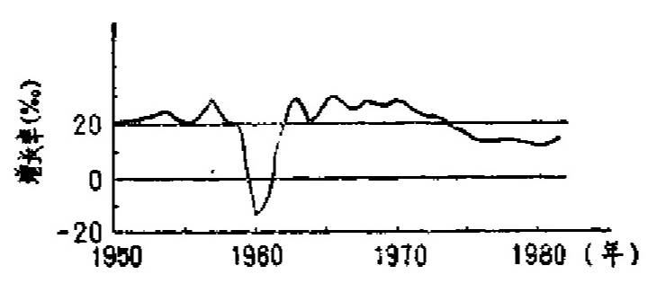
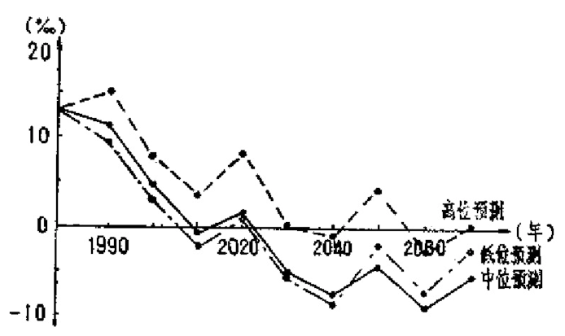
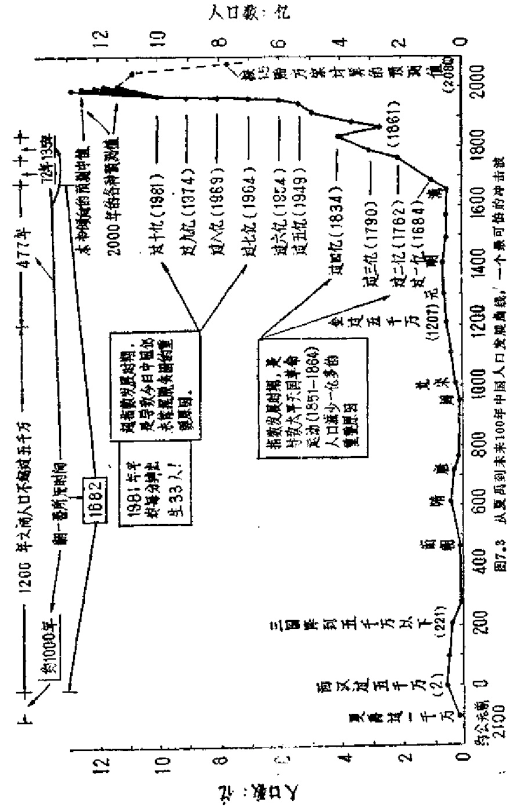
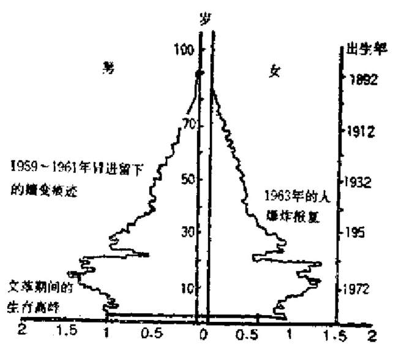
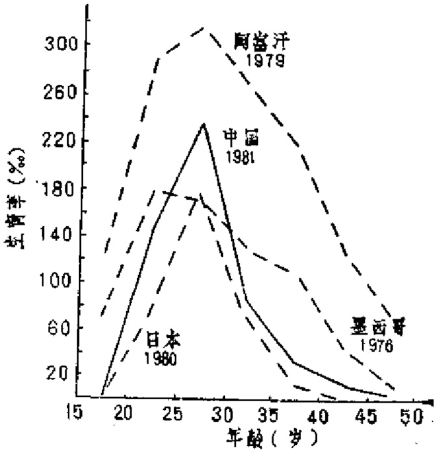
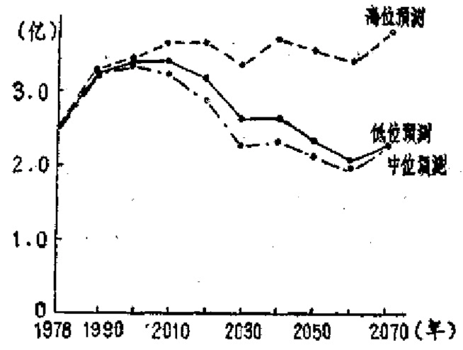
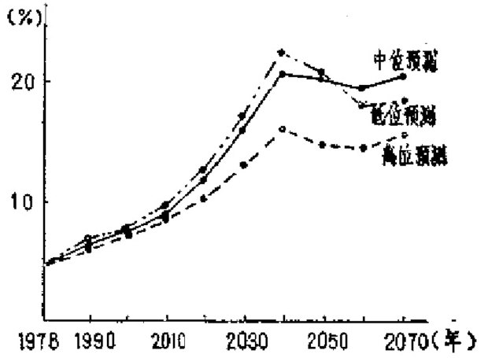
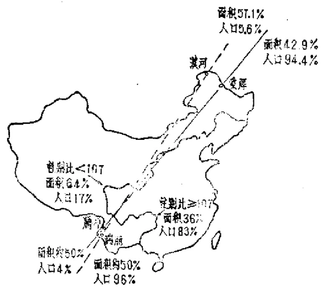
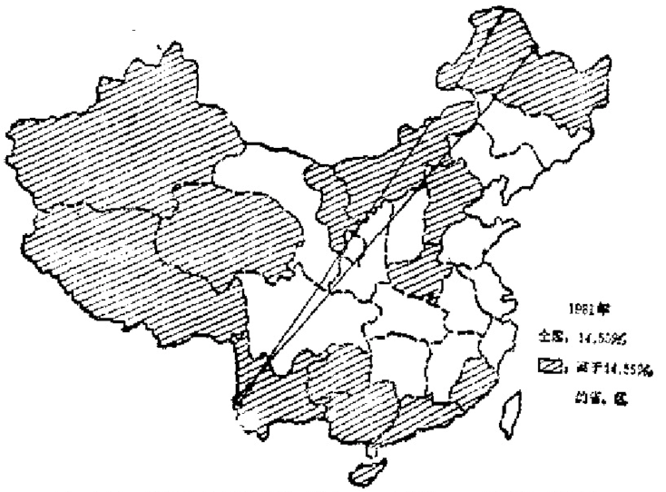
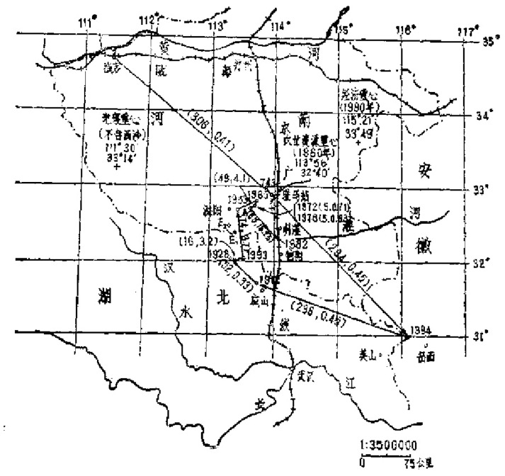

# 第七章 最可怕的一个冲击波

    中国每年新出生的人，
    相当于一个东京都的总人
    数，这种罕见的人口压力如
    不能解决，制定任何美妙的
    经济计划，大概都只能是画
    饼充饥。
        —[日]《读卖新闻》

## 7.1 第一号全球问题

  中国有许多世界之最，而“之最”中的之最就是人口。
中国的人口是世界上最大的一个分母。这个分母把中国发展
的一切都可怕地吃掉了。有人计算过：若把目前全世界50亿
人按50公分一个排列，可以用6个半纵队排到月球去。而其
中，以1987年10月一次1%抽样测算的中国10.7亿人就占这
个纵队的一列半。若把这一列半人改为绕地
球赤道排列，可排出13列还多；若改为从广州到北京，可排
出282列，而且，不出3年，又将增加一列。这样，到2000
年，中国仅仅为了填饱人们的肚子，每年至少得增加9千万
吨粮食，而那时，中国的人均自然资源已经下降了1/6！龙其
在集中了95%农业人口、92%耕地的中国东南部地区，将会
变得毫无发展余地。

  人口有三大问题：数量、结构分布和质量。由此产生的
种种疑难使人陷入深深的困境之中。而这一切都可以从认识
开始讨论。

  美国科普作家、未来学家阿西莫夫在1972年就人口未来
写道：“目前，世界人口正以每日20万或每年7000万人的速
度增长着……完全有理由担心，到公元2000年，全球人口将
超过60亿……"，如果地球人口继续象现在这样每过35年就增
加一倍，那末，到公元2570年人口将增加100000倍……到
公元3550年，人类机体的总质量就会等于地球的质量……到
公元7000年，人类的质量就会等于已知宇街的质量！……看
来很明显，如果目前的趋势持续下去……，将造成不可估量
的恶果”。

  马尔萨斯当年的警告，现在被当作科普常识在全世界宣
传。

  可惜，马尔萨斯这位当年剑桥大学九次数学优等生的获
得者所提出的警告是“太早”了，太尖锐了，面且是太过激
了。政治家、经济学家和杜会伦理道德学家长期不愿意正视
这个问题。他们纷纷提出慷慨激昂的理论来反驳马尔萨斯，
说每多一张吃饭的嘴，同时带来一个聪明的脑袋和一双劳动
的手；说用合理的分配，用正义与平等的宣传教育，总可以
解决由人口灾难引起的冲突和瓦解。

  当年的马尔萨斯为什么要提出他的警告？原因正在于他
看到哥德温用盲目的乐观主义把人引入歧途。哥德温在1795
年的《政治正义的探讨》和1797年的续编《研究者》中宣
称，他对人类向着社会和谐与伦理一致方向前进的能力抱有
完全的信心。因为，自发的道义和个人对社会的责任感，加
上人人可以培养起来的宽容和利他思想，会使无论是现在还
是未来，不再需要对抗。1798年马尔萨斯写《人口原理》，其
中只用人口增长与粮食关系一个论据来反驳哥德温的乌托邦
思想。

  重提这个问题，对中国人来说是有益的。因为马尔萨斯
在中国不仅一度被政治家和理论家们批得“体无完肤”。而且
由此滋生出的一种盲目的乐观主义，种下了最可怕的祸根。

  可以说，马克思主义的经典作者比较低估自然与环境规
律的力量，对社会、对革命、对人的能动性，常常抱着过分
乐观的态度，当种种条件还未清楚的时候，结论就出来了，
因而往往过快地“走在时间前面”，使随后的实践跟随者们一
再碰壁。

  现在，全世界都承认，人口问题是第一号全球问题，当
前，粮食不足，人均资源不足，资金不足，生态平衡破坏等
世界性的困迫问题，全是人口过多的结果。人口压力首先会
产生生态压力和资源匿乏，导致过度的开荒、耕作、捕捞、
放牧和环境的破坏：然后又转化为经济压力：产量低、效率
差、失业、通货膨胀、分配困难：接着又转化为社会压力：
饥饿、拉会福利和保障水平低、教育困难、道德败坏、管理
混乱；最后会转化为政治压力——甚至引起冲突和战争。其
实，最早明确指出人口压力问题的，可能是我国古代的思
想家韩非。他在两千多年前便说：“今人有五子不为多，子又
有五子，大父未死而有二十五孙，是以人民众而货财寡，事
力劳而供养薄”。想不到这个简单的道理，今天会爆出一大堆
似乎是令人束手无策的问题。中国在这一堆全球问题中，负有
重大的责任。显然，在目前国家的超负载运转中，在未来国
家进一步发展的人口困境中，问题将更为严酷。

  在我们继续讨论之前，不能不提一下两个人。一个是马
寅初。1954一1955年，当时这位已过72岁的老人，三次到浙
江实地调查，看到了人口自然增长率已超过20%的严重发展
趋势，并在1957年2月的最高国务会议上发表“新人口论”，
受到了毛泽东的赞赏。同年7月5日的《人民日报》全文发
表马寅初的研究成果。两天之后，毛泽东在上海干部会上作
了《打退资产阶级右派的进攻》的讲话。此后，“人多是好
事”，“对于我国人口多，增殖快的一切悲观论调是没有任何
根据的”，“世间一切事物中，人是第一个可宝贵的”，等等均
成了批判“新人口论”的最有力的武器，马寅初成了“中国
的马尔萨斯”。还有一个人是前中华医学会理事长钟惠澜。
1957年，他通过严格的计算提出一个警告：如果政策不变，
中国人口会在20年内达到10亿。后来他的遭遇与马寅初同样
不幸。而更不幸的是，事实证明了他们的预言。

  中国人下了很大的功夫批判了两个“马尔萨斯”，所付出
的代价也比任何其他一个国家都大得多。在1962年到1975年
的14年间，中国共出生3.5亿个孩子。中国这块土地，从公
元前23世纪夏禹时代传说的1,300万人算起直到1820年清仁
宗嘉庆年间约4000多年时间的人口发展才达到这个数字。
而且如果那14年间出生的3.5亿个孩子将来仍按两胎生育，
在此后的20一30年间又会生出3.5亿人！仅仅这个出生量就
远远超过牛顿时代全世界的人口总量！

  据估计，地球的人口在原始公社时期，约3万年才翻一
番，在1万年前只有约10万人；埃及法老建金字塔时约只有
几百万人，罗马帝国时期（公元5世纪）约有1亿人。此
时，大概每千年增长一倍。1650年全球约有2.5亿人：1750
年约有5亿人；1850年约有10亿人。此时，约60年翻一番。
以后人口爆炸。[^219-1]目前世界人口约33年翻一番。1987年7月
11日联合国宣布，世界第50亿个居民在南斯拉夫克罗地亚共
和国首府萨格勒布市作为“和平的一代人”降生。到2000年
估计世界人口将达62亿人左右[^219-2]。而世界人口的增长要到
2010年，才有停下来的可能。那时，世界的人口总数将为
1950年的4倍，1975年的2.5倍。

  另外，国外有人估计，世界的食物增长只能维持约100
亿人口的需要，加上其他考虑，世界人口以70亿人为限度。
也有人认为地球只能养活80亿人。[^219-3]按此，到2030年前后，
按最乐观的估计地球人口容量已接近极限值。而据一般的预
测，到2040年，世界人口将在160亿一110亿之间。

[^219-1]: 这里“10万”，“几百万”均为特勒在《广岛的遗产》后记中估计的数字。

[^219-2]: 联合国《世界人口展望，按1877年估计》，一书，对2000年世界人口中度
变式的预测数为6254377千人。另外，美国巴尼等人在1980年的预测值为63.5
亿

[^219-3]: 见王翌亭等《环境学导论》，中国环境科学研究院，清华大学，1983年
第37一52页。

[^219-4]: 《中国理想人口目标的定量研究和优化分析》，见（人口地理论文选》
华东师藏大学人口研究室编。

  宋健等对中国的情况也作了相应的预测。结果认为，“如
果在百年左右时间里，我们饮食水平要达到美国和法国目前
水平的话，那么我国理想人口数量应该在6.8亿以下”。[^219-4]按另
一种简单的方法估算，以世界人均耕地5亩计，我国人口以
3亿为合适；以人均粮食应为1,000斤/年计，我国人口应为
6亿；以水资源估计，人口可为7亿。综合起来考虑，我国
总人口以5亿为佳。可惜我们在1963年（总人口6.9亿）就
突破所有估计的界线了。这一年的人口自然增长率为33.33
%。此后10年的自然增长率仍在20.89%至28.38%之间，到
1974年才开始往千分之十几下降。

  我国1979年的人口增长率曾下降到11.61%。但“本世
纪末人口要控制在十二亿以内”的目标提出后，人口增长率
反而上升。1980年为13.02‰，1981年为14.55‰，1982年为
14.4‰。（见图7.1）即使今后能维持在年平均11‰，到1998
年就会突破12亿。而按田雪原的一个预测，我国人口纯增长
率要到2020年至2030年间才有接近○点的可能（见图7.2）。
由于人口政策的失误，仅仅十几年时间内，我们的人口便从
7亿增为10亿，而即使严格执行“只生一个”的政策也需要
90年时间才能从10亿降为7亿。何况，这种政策还可能隐伏
着更大的危机，是我们不可以长期执行的。

来源：《人口研究》1984年第3期24页

来源：田雪原《中国人口控制和发展趋势研究》，经济科学出版社 1984年，第385页

  世界观察研究所所长布朗等曾在1976年出版的《人口问
题的二十二个方面》（《世界观察专题报告》第5号）一书
中，详细地列举了预料未来不会得到较好解决，而会发展得
更糟的难题。内容涉及随着人口增加而出现的文化教育水平
下降，海洋渔业面临崩溃，自然保护区会遭到破坏，污染增
加，环境恶化，通货膨胀更难对付，环境病增加，粮食短
缺，住房紧张，气候变化更烈，植被破坏，高密度群集压抑
加重，人均国民收入下降，城市化的社会问题增加，森林过
伐，政治矛盾加剧，矿物资源枯竭，卫生服务水平降低，水
资源危机，失业增加，物种灭绝可能导致支持人类的那张生
命之网受到破坏，能源紧张加剧，等等，等等。我们必须认
识到，所有这些问题都是全球性的。

## 7.2 从夏禹到未来100年的冲击

  中国目前所背负的最沉重的包袱就是巨大的人口压力。
这个问题与任何其他问题比起来，更具有根本性。今日中国
在人口问题上的困境，是具有深刻的历史原因的。

  长期处于社会动荡、经济停滞的封建统治之下的中国，
人口本来一直陷于萎缩状态。人口的隐患是在18世纪开始港潜
伏下来的。大约可以康熙23年（1684）前后人口基数突破1
亿大关为界（也有人估算到1711年人口才超过1亿）。1712年
康熙实行“滋生人丁，永不加赋”政策，1723年雍正又推行
“摊丁入亩”（又称“地丁合一”）政策，把秦汉以来的人
头税改为田亩税。此后，人口便每年以25%以上的势头急剧
膨胀，乾隆27年（1762）突破2亿，乾隆55年（1790）突破
3亿，至鸦片战争前（1834），又突破4亿大关。这时，被称
作“人所不读，人人咒驾”的马尔萨斯那本《人口原理》的
第三版已经出版30多年。中国近代生态平衡与环境的破坏，
对生产力的压迫，阶级矛盾的激化，似乎立即成了马尔萨斯
那本书的一个注解。马克思和恩格斯也已注意到中国的人口
问题，指出中国过剩人口“早已使它的社会条件成为这个民
族的大多数人的沉重枷锁”。[^222-1]

[^222-1]:《马克思恩格斯全集》第7卷，第264页。

  中国人口突破1亿之后，在1684一1834年之间一直以指
数速度发展，给封建社会造成不可克服的沉重压力和冲突，
终于导致社会崩溃。罗尔纲就曾认为，太平天国革命（1851
一1864）就是由“人口压迫”而引起的。此说虽然有人认为
“无视阶级矛盾”，其实也有见地。洪秀全在西南一隅之崛
起，得天下一呼而应，确实与人口膨胀的激化有关。[^223-1]

  不仅如此，从纯粹人口学的角度看，太平天国革命的悲
剧结果，其实成了中国近代人口困境的一个转机：在整个太
平天国革命期间，清代人口减少了1亿多，几乎达总数的三
分之一。

  可惜，中国刺激人口增长的小农经济体系始终没有动
摇，随着新的政治与生产关系的调整，人口又迅速地与生产
力的发展一起，加倍地膨胀起来。特别是在1949年之后，我
国人口进入超指数发展时期，终于形成一个最大的隐伏危机。

  最近，一些研究者研究我国古代人口资料，所得的结果
是很宝贵的。把有关的资料综合起来，可得下表（表7.1）。

  从1949到1983年的人口数在《中国统计年鉴1984》上有
详细记载，以下仅摘出超过某个亿数的时间数据（见下表
7.2)。

  从表（7.2）看，在1949一1981年间，中国平均每隔6.4
年就增加1亿人！1981年，平均每分钟出生33人（1987年达
到每分钟40人）！且在未来的20年内要增加2亿多人，即近一个
美国或两个日本。

  1979年宋健等对1980一2080年百年间的中国人口作过详
细的预测。[^223-2]其中1985年的预报值如表7.3所示：

[^223-1]: 原文《论清代的人口账》，见《华东师范大学学报》1984年2期。

[^223-2]: 《人口发展过程的预测和控制》，见《系统工程和科学管理》1980年2期。

  按统计年鉴，1983年中国人口10.25亿，以平均每年出
生1700万人口算，1985年的实际人口约为10.50亿。即我们
近几年事实上是按照2.5胎的方案生产人口。若按此，2000
年我国人口将达13.23亿，这是一个可怕的数字。

表7.1 我国历史上的人口统计数（附世界人口数）(万人)

---------------------   ----------------  ------------------   ---------------
年份                      人口数             年份                  人口数
---------------------   ----------------  ------------------   ---------------
约前7000至                 500—1000           263                   443
6000年（世界）

约前2100（夏禹）          1,355（传说）         220-255               767
                                                                 4,000（估计）

约前1115至                 1,371（传说）       280（晋)              1,616
1079（周成王）

前684（周庄王)            1,184（传说）       369（前燕）            999
                         （另说1294）

                                            464（南朝）             552（估计）

前221（秦始皇）           2,000（估计）       世界                  10,000

1（世界）                 2,000—4,000        520（北魏）            3,232

2（西汉）                   5,059             574（北齐）            2,001

57（东汉）                  2,100             580（北周)             3,067
                        4,500（估计）         

75                          3,412           587（陈后主）            200

88                          4,335           581—600（隋)        4,459（估计）

105                         5,825               606                4,602

古代末期                世界人口大减              607                4,601

122                         4,869               609                 4,602

140                         4,915             605-618           4,450（估计）

136-141                     5,386            639(唐)               4,235
                                                                3,307（估计）

126-144                     4,915               726                 4,142

141                         4,973               740                 4,844

145                         4,952               754                 5,292

146                         4,756               765                 5,291

156                         5,006               760                 1,699

157                         5,649           959（周世宗）        1,370（估计）
                                              10世纪            世界人口略增
221 （三国)                   90

242                          240            960（南方各国）       1,150（估计）
---------------------   ----------------  ------------------   ---------------

---------------------   ----------------  ------------------   ---------------
年份                      人口数             年份                  人口数
---------------------   ----------------  ------------------   ---------------
1003（北宋)                2,856               1491                5,328

1021                       3,986               1578               6,069

11世纪（辽金盛期)          650               1650（世界)          47,000—54,500

1063（北宋）               5,287                1651               1,063（估计）
                                             (清顺治)              5,300

1080                      3,330                 1656              1,541

1086                      8,015                 1659              1,900（估计）
                                                                  9,500

1110                      4,673                 

1122                      9,347             1662（清康熙）        7,681

1161 （南宋)              4,840                1684                2,034（估计）
                                                                  10,170
                                                                  始过1亿

1162（金）                 1,850（估计） 

1187                       4,471                1699              2,041

1190（南宋-金）            7,393                 1700              2,041

1193（南宋)                5,569                 1711              2,452（估计）
                                                                  12,310

1207（金）                 5,353                1713               9,849

1223 （南宋）             5,661                 1719               2,502

1195—1223                7,681      
（金一南宋）              5,000以下（估计）    1724（清雍正）        2,611

1274（元）                 887（估计）           1726              2,639

1290                        5,883               1729             13,056（估计）

1291                        6,028               1734              7,735（估计）
                                                                  13,675

14世纪                    （另载5,985）       1741（清乾隆）       14,341
                          世界人口下降

1381（明）                  5,987              1742               15,980

1393                        6,054               1743              16,445
                                                                （另载10,305）

1403                        6,660

15世纪                   世界人口始猛增          1746              17,189
---------------------   ----------------  ------------------   ---------------

---------------------   ----------------  ------------------   ---------------
年份                      人口数             年份                  人口数
---------------------   ----------------  ------------------   ---------------
1760                    62,900—93,140       1839                41,085（不全）
                        （世界）             1840                41,281（不全）

1751                        18,181           1843                42,184

1753                        18,368           1848                42,674

1757                        19,031           1849                41,298

1762                    20,047（过二亿）     1850               112,800-140,200
                                                                    (世界)

1768                        21,083

1774                        22,103          1851（清咸丰）        43,216

1775                        26,155          1861                 26,689

1776                      75,00（世界）       1873                27,113
                           工业革命起，
                            人口剧增

                                            1887（清光绪）        37,464

1777                        27,085            1900              155,000-176,200
                                                                   (世界)

1782                        38,182

1785                        29,119          1910（清宣统）        38,118
                                                                （另载43,842）

1790                    30,149（过三亿）         1911             37,766
                                                                （另载36,815）
                                                                  （或40,818)

1793                      31,0413

1800                   81,300-112,600         1912（民国）        35,572（估计）
                            (世界)                                49,000

1805（清嘉庆）               33,218              1931              43,200

1808                        35,021              1919              42,767（估计）
                                                                  50,600
                                                                 （过五亿）

1819                       30,125

1820                       35,538             1918—1919             45,365

1822（清道光）              37,245               1920              44,715（另载)
                                                                   43,609

1826                        38,028              1921                44,338

1829                        39,051              1922                44,715

1834                    40,101（过四亿）         1929                43,609
---------------------   ----------------  ------------------   ---------------

---------------------   ----------------  ------------------   ---------------
年份                      人口数             年份                  人口数
---------------------   ----------------  ------------------   ---------------
1924                        40,000              1933               47,853
                                                                （另载45,000）

1925                        48,550              1934                43,586
                                                                （另载46,340）

1927                        45,778              1935                46,215
                         51,700（估计）

1928                        45,184              1936                46,136
                        （另载47,478
                            或48,550
                            或44,184)

                                                1937                43,840
                                                                （另载46,600
                                                                 传说45,078
                                                                 估计53,100）

1929                        43,893  

1930                        44,400              1944              46,492
                        （世界过20亿）

                                                1945           220,000（世界）

1931                        43,893              1947                46,100
                                                                （另载下半年为
                                                                   46.279)

1932                        48,830
---------------------   ----------------  ------------------   ---------------

注：表中无说明的数字均摘自史料，无年份无朝代者从前项。“估计”是
指按户口数估计，或对历史数据的估计。

数据来源：谢忠梁《中国历代人口统计表》，《四川大学学报丛刊》1979
年3期第80一86页；梁方仲《中国历代户口、出地、田赋统计》上海人民出版
社，1980年，张敏如《我国历史上人口的发展及其特点》，《人口研究》1983
年6期第38一43页；史实《我国历代人口数变化初探》，《人口研究》1985年
3期第55一62页：唐元《关于我国人口数量历史变化若干问题的探讨》，《湖
南教育学院院刊》1983年1期第80—85页；郭松义《清初人口统计中的一些问
题》，《潜史研究》第二辑。中国人民大学出版社，1982第66一87页；（Pop-ulation
Facts at Hand)1981，毛汉英等《世界人文地理手册》知识出版社1984年第55页。

  还可以引用另一个较近的预测如下（见表7.4）：

  根据上述的各种数据，再考虑外国一些人口学家对我国
未来人口发展所作的预测，[^227-1]我们可以得到如下的一条发展
曲线（见图7.3）：中国面临的一个最可怕的冲击波！

[^227-1]: 见（法）乔治·塔皮诺等《六十亿人——人口的困境和世界对策》上海
译文出版社，1982年，第54一65页，193页。

表7.2 （人口单位亿）

-----------  -----------  -----------  -----------  -----------  -----------
年份          人口数         年份          人口数       年份          人口数
-----------  -----------  -----------  -----------  -----------  -----------
1949          5.1（估计）   1969            8.0         1981         10.0

1950（世界)    25.13       1970（世界）    36.78      1981（世界)      44.92

1954            6.0         1974           9.0       1985（世界)      48.26

1960（世界）   30.27        1975           40.0         1986         10.60

1964            7.0        1980（世界）    44.32      1987（世界）      50.0
-----------  -----------  -----------  -----------  -----------  -----------

表7.3 

---------------------   --------  --------  --------  --------  --------
妇女平均生育胎数            1       1.5        2.0       2.5        3.0
---------------------   --------  --------  --------  --------  --------
人口总整（亿）            10.02     10.09      10.41     10.52     10.69
---------------------   --------  --------  --------  --------  --------

表7.4 中国总人口预测

-----------  -----------  -----------  -----------  -----------  -----------
育龄          1982-2000年    2000年时    人口达到    最大人口数     2080年时
妇女平均      年平均自然     人口总数    最大值的                    人口数
生育胎数       增长率（%）    （亿)       年份         （亿）        （亿）
-----------  -----------  -----------  -----------  -----------  -----------
1.0             0.27        10.5489       2000       10.5484       2.8797

1.5             0.73        11.5056       2021       11.9113       6.7749

1.7             0.91        11.8884       2035       13.0479       9.2204

2.0             1.16        12.4630       2055       15.7038       14.3240

2.3             1.40        13.0318        --           --         21.8369

2.5             1.55        13.4211        --           --          27.5419

3.0             1.82        14.3801        --           --          49.8826

1981年增长率    1.455        13.1792        --          --          41.8568
-----------  -----------  -----------  -----------  -----------  -----------

来源：程玉琴《我国人口的今天与明天》转自《公元2000年中国》，科
技文献出版社1984年第6页）

## 7.3 四大威胁

  我国人口的结构和分布有许多重要的特征。这些特征不
仅是我们制定人口政策的重要依据，而且是我们制定其他政
策以应付人口压力所造成的严重问题的根据。我国人口结构
特征隐含着四大威胁。

  第一个威胁是我们会碰到年轻型的就业难题。

  我国人口结构的特征之一就是年轻型。这可以在表7.5
与图7.4中看清楚。

表7.5 中国历年人口年龄结构变化（%）

--------  ------------  ------------  ------------  ---------------
年份       0-14岁          15-64岁       65岁以上     其中60岁以上
--------  ------------  ------------  ------------  ---------------
1953        36.3            59.3        4.4             7.3
1957        28.8            56.5        4.7             
1964        40.4            56.1        3.5             6.1
1975        36.8            58.4        4.8             7.4
1978        35.8            59.4        4.8             7.5
1980        31.1            63.6        5.3             8.2
1982        33.6            61.5        4.9
--------  ------------  ------------  ------------  ---------------

（据《中国统计年鉴1984》数据计算）

  从上列图表中可以看到，我国14岁以下的人口还占1/3
以上；30岁以下约占2/3。以1982年人口普查的数据计算，
我国人口年龄的中位数为21，平均年龄为27.1岁，（其中有
6亿以上是解放后出生的）比日本1980年的相应数（33.9
岁）年轻6.8岁，是典型的年轻型结构，希望和压力同样巨
大。

  按计算，1982年我国人口对少年儿童的抚养比为54.64
（1980的日本为34.87，瑞典为29.69）；老少比为14.61
（1980年发达国家为47.83，发展中国家为7.3，日本为38.72，
瑞典为89.47）。[^231-1]

[^231-1]: 《人口研究》1984年4期，第2页。

  一个严重的困难问题就是，我国就业人口多，增长快，
年轻型的人口对此造成很大压力。若按世界口径统计（15一
64岁），1982年我国应就业人口超过6亿，占总数61.5%（按
国内15一59岁统计为5.22亿），到1990年会接近7亿（一种估
计为6.73亿），世界平均就业人口占总人口比为59%。从1953
一1964年的11年间，我国人口增长22.4%，劳动适龄人口仅
增加13.9%，但从1964一1982年的18年间，总人口增加
44.5%，劳动适龄人口却增加61.3%。这种增长趋势，直到
2000年还不会改变。据熊郁的测算，从1981年到2000年我国
新增劳动适龄人口将达4.4亿（平均每年2.2千万。这个估计
可能偏低）。其中城镇将达1.1亿。详见以下预浏表（表
7.6) :

表7.6 中国1981—2000年劳动资源人数和预测

---------------  -----------  -----------  -----------  -----------  -----------
项目/年份         1981—1985   1986—1990    1991—1995   1996—2000     总计
---------------  -----------  -----------  -----------  -----------  -----------
进入劳动年龄        13930         13047       9728           6500         44605
人口总数（岁）

预计城镇人口         23           25           27             30          26
占全国比重（%）

城镇进入劳动        8000          3260        2626.6       2550         11436.6
年龄人口（岁）

农村进行劳动年      10320          9787        7101.4       5950        33168.4
龄人口数（岁）

平均每年进入劳动     3666         2609          1945        1700        2230.3*
年龄人口数（岁）

其中城镇            613.2       652.3         625.2         510          524.3

农   村            2052.8       1956.7        1419.8       1190         1646
---------------  -----------  -----------  -----------  -----------  -----------

* 另有人估计，此数约在2,500一3,000之间。

（来源：《人口研究》1984年第1期，第38页。）

  就业的巨大压力问题，还涉及到我国城镇人口分布的弱
点。按1982年的普查资料，我国城镇人口总数为20,650万
人，占总人口20.6%。但因其中有约6,300多万人为农业人
口，所以城镇中的非农业人口只有约14,300万人，仅占全国
总人口的14.3%（离世界城市化水平40%很远）。而且这些非
农业人口中，在百万人以上的特大城市（12个）里有4,205万
人。在50一100万人口的大城市（29个）里有1,993万人。这
41个城市（共6,198万人）所占非农业人口43.3%，其总人
数甚至比现有2,819个建制镇所占的人口数（6,190万人）还
大。这说明城市与城镇的差距太大。中国城乡工作部曾作了
一个计划：到2000年我国将有特大城市27个，大城市32个，
人口20万以上的中等城市73个，人口20万以下的小城市283
个，建制镇3,178个，再把现有5.3万个农村集镇加以发展，
这样，估计可靠建制镇与集镇的发展容纳约1.4亿以上的人
口，即吸收今后15年内新增全部人口的约2/3。[^233-1]这个任
务已显得很艰巨，却只能解决新增人口问题，而全部问题的
关键是农村劳动力的转移，因为仅新增部分的劳动力就有约
3.3亿人之巨！显然，仅靠城镇化方向的发展难以解决这个
问题。

[^233-1]: 李梦白《我国城镇展的展望》，《城乡建设》1982年12月。

  城镇化的计划是根据费孝通教授的建议提出来的。但却
没有考虑到三个重大的疑难。其一是，如果1.4亿新增人口
转入集镇，剩余部分及农村原有剩余劳动力及其所带人口就
有约3.5亿要转入城市。即使要新建百万人口以上的大城市，
也要350个！其二是资金问题。仅以每一城市居民要2千元
非物质生产设施，每一职工要1万元固定资产，而只有1.5
亿人就业，3.5亿人居住计，约需资金二三万亿元。其三是，
正如我们在谈生态问题一章中将提到的，我们目前大量发展
小城镇的实践表明，已经比由大城市来吸收这部分人口多付
出10倍的土地代价。

  此外还要考虑到，我国劳动力的素质低，合同制与企业
破产法广泛实施后，我国的就业不论在结构性、选择性和摩
擦性方面，都会面临重大困难。可见，我国能在2000年前解决
新增人口与农村剩余劳动力转移到城镇的可能性是很小的，
不可以抱一个乐观的计划。特别是如果考虑到在就业困难之
外会加上通货膨胀的威胁，那么我们可能会碰到曾使美国总
统福特和卡特在竞选中败下阵来的那个最差的“痛苦指数”
(misery index)。

  第二个威胁是生育高峰重新出现。

（来源：《人口研究》1984年6期12页）

  我国人口结构的另一个特征是妇女生育率高。这主要还
不是年龄构成问题。据1982年普查数据，1981年我国妇女生
育为83.34%.比经济发达国家高约1/3（美国1979年为
61.5%，日本1980年为51.6%，（见图7.5）。其中25一29岁组
的生育率为283.73%，生第三胎以上的生育率为22.52%，总
和生育率高达2.644。且有回升倾向，这将是使2000年12亿
人的目标难以达到的一个重要的压力点。

  事实上，近几年我国人口出生率已大幅度回升。1986年
人口出生率已从1985年的17.8%上升为20.8%，比计划生育
率约高50%，出生人口又创纪录，年末人口比上年增加1476
万。有些省的第三胎率还上升60%，且还有增加的趋势。人
口专家估计，我国目前育龄妇女只生一胎的约只有10%，一
个生育高峰又突然出现。而粮食从1984年以来又连年减产。
如果经济生活水平与社会教育水平不能得到普遍的真正
提高，中国人“多子多福”的思想就无法改变，人口问题还
会继续恶化，人口系统的嬗变会显得更难控制。在这方面，
育龄妇女是个关键。

  据预测，中国育龄妇女数在1978年到2070年有2亿至3.8
亿之间（见图7.6），最值得注意。

（来源：田雪原《中国人口控制和发展趋势研究》171页）

  第三是性别比偏高会成为新威胁。

  历史上，世界人口的性别比（以女性为100的男性数）
在105±2之间波动。我国却在110一115之间。[^236-1]这是生理，
地理原因，还是重男轻女的原因，还未有很好的研究。不
过，据联合国《世界人口前景》一书的统计，世界自1950年
以来，性别比已接近100，估计到2000年才会增至101.2，我
国1981年人口出生的性别比为108.47，情况变化仍不大。这
是社会学家最为担心的问题之一。

  《青年研究》1984年1期报道，陕西省一个20万人的
县，接近婚期的青年中，男的比女的多5706人。许多女青年还
继续通过招工、远嫁外流。有些女青年的家长乘机把彩礼越哄
越高，不少男青年为找对象而倾家荡产。这已成为新的威胁。

[^236-1]: 《人口研究》1985年2期第50页。

[^236-2]: 见《社会科学评论》1985年6期第64页

  按1982年普查数宇，我国女性人口488741919，而男
性比女性多30391450人，占全部男性人口的5.72%。由于老
年人口中女性多于男性，有人推算，男性人口中约有9.33%
（约4850万人）会找不到配偶。还需指出，我国公布1982
年人口普查数字时是不包含现役军人的，后来由于国际人口
学者的建议，国务院在1985年6月公布，1982年普查时有
423.8万现役军人，其中男性比女性多315.8万人，即男性多
出约5166万人。可以预料，随着“只生一个”政策的推行，
性别比还会提高。以湖北荆州地区13个县市1982年普查为
例，性别比是随出生年龄小而提高的。各年龄的性别比为：
4岁，104.1；3岁，104.6；2岁，105.1；1岁,106.2[^236-2]。
这是值得忧虑的问题。中国的物质缺了，技术缺了可以靠进
口解决。人缺了，却是不能靠进口解决的。5,166万人接近
菲律宾1981年的人口总数，而比丹麦或埃及1981年的人口总
数还多，比1981年的法国也只差约230万人！

  事实上，1986年的统计表明，在我国30一59岁的947.8
万大龄未婚人口中，95%为男性。使这一问题的严重性加深
的另一个现象是，我国女青年早婚的传统，至今仍有保留。
1982年我国有442.4万早婚青年，其中女性为男性的1.5倍。
相应的早育情况亦严重。1983年3月美国《中国季刊》发表
田心源教授的一个调查，说中国妇女有65%在婚后三个月之
内怀孕，一年内怀孕的占85%以上。此外，婚姻状况长期处
于不稳定之中。例如新婚姻法一公布，1981年就促成一次结
婚浪潮；1984年宣布对“只生一个”政策作修补，又促成一
次生育浪潮。这是人口问题的一个结症。

  在我国，早婚、普遍结婚、早育、普遍生育、要男不要
女，都是带有家庭与社会压力的，时常与“命”好不好联系
在一起，同为受封建传统影响所致。从人口学的角度看，除
非能对一些根深蒂固的封建习俗进行冲击，便婚姻过渡到早
婚晚育的实用型，否则我国未来人口控制问题难以解决。

  还有一个问题。1985年6月在意大利的古城弗罗伦萨召
开的国际人口学会第20届大会上，美国的班尼斯特在题为
《对中国1982年人口普查结果的惊奇与确认》一文中对我国
历年出生率与死亡率漏报数进行推算，所得的相应数在最高
年份竟分别达20%多与40%多。并且指出，“如果中国实际的
出生性别比为106.0的话，那么，在1981年出生婴儿中至少
有23万女婴没有报告”。“……如果中国新闻工具描述的杀害
女婴问题在统计上是严重的话，这一点在1982年普查的生命
表中根本没有反映出来。这一点暗示有些家庭没有向普查员
提到被害者的出生和死亡。”[^238-1]

  杀害女婴，这不管出于什么原因，如果我们不能加以制
止，必然会受到世界性的严厉指责。与其容忍某些地区非人
道的溺弃女婴的行为，不如提倡更开化、更灵活的非婚不育
观念。可惜在婚姻和家庭关系问题上，中国的封建传统保留
最牢固，至今仍是不可动的。

  “只生一个”的政策，在性别比问题上受到最大的怀
疑。自然的生命不是机械玩具，历史的包状是跟各方面缚在
一起的，需要历史与时间来卸下，绝对一胎化很难适应我国
农村目前生产力落后的状况。现在北方农村还有不少人贴一
对门联：“门前车马非为贵，家有儿孙不算穷。”这是与生产力
状况适应的中国人独特的观念。自然生育的“最佳策略”虽
然可以人为地按照某条曲线或其它的数量模式来选择，但不
可忘记进行生育的是活生生的人，他（她）们不仅被传统习
俗与种种实际环境及气氛所包围，而且受自身知识、心理与
性格所左右。悲观派没有过错，关于人口问题的悲观预言胜
于乐观想象！1977年的印度政府曾因实行强制主义的人口政
策，悖情，失理，于政治、伦理上不足取而跨台。这在国际
上成了一个教训。目前，我国计划生育的政策已作出一点调
整，这是明智的。不过我们应当看到，只有提高全民族的文
化水平，提高个人的消费能力，才会成为控制人口生育最强
大的刺激力。任何强制性政策总是会留下后患的。

[^238-1]: 斑尼斯特提出问题后，刘铮又据新公布的现役军民数据算出普查时总
人口的性别比由105.15上升为106.27（比班尼斯特推算的还高）。见《人口研
究》1985第6期，第4、9页。

  第四个威胁是老年化的压力迅速迫近。这可能是使未来.
的中国人最头痛的问题之一。

  从图7.7人口金字塔的底部可以看到，我国是靠出生率的
收缩来降低人口总量。这是一个成绩，但随之而来的一个必
然结果就是导致老年人口比例迅速上升。塔底收缩得越快，
塔腰鼓起的一大块就越重。即用人为的方法加速把年轻型人
口推向老年型人口的过程。

  按规定，65岁以上人口占总人口7%以上或60岁以上人
口超过总人口的10%就算进入老年化。世界上最早从年轻型
转入老年型人口的法国用了150年；日本65岁以上的人口所占
比例从1920年的5.3%升至1970年的7.1%，花了50年时间。
但我国按中位预测值，65岁以上人口所占比例从1982年的
4.9%到2000年的18年间就会升至7.2%，正式进入老年国家
行列，老年化速度罕见。这不仅会使未来中国劳动力的素质
下降，更重要的是会使社会与年轻一代不胜负担。

  以男（60岁）、女（55岁）退休老人计，按我国1953年、
1964年，1982年三次人口普查数字计算，我国老人占总人口
比例分别为8.4%、7.8%、9.26%。其中1982年的数字达
92951000人（按总人口1003790450人算）之多。据对北
京市的一个测算，总人口从1956年到2000年要增长1.66倍，
而同期60岁以上老人会增长7.7倍，到2000年60岁以上人口
将占总人口14.65%（不包括机械增长。1985年为8.95%），
人数将达200万。北京市宣武区曾对5个居民区作调查，60岁
以上的老年人（983人）占居民总数9.2%，其中却有27.5%的
老人得病后不能及时去医院诊治，说是“看不起，太麻烦”。[^239-1]

[^239-1]: 《人口研究》1984年1期第39页。

  到1985年底止，上海60岁以上老年人已达1591000多人，
超过全市总人口的10%，按联合国的规定标准，为我国第一
个进入老年化的城市[^240-1]。麻烦亦在上海开始，而南京、苏
州、无锡以及沿海一些城市也同时进入老年化。江苏全省在
1988年进入老年化。

  另外，据1982年9月在维也纳召开的国际人口讨论会上
提供的预测，2000年中国60岁以上老人将达1.3亿（1986年
为8千万），再过一代人之后会变成2.8亿，2025年为3亿（远
超过美国目前的人口总数），2050年达4亿。以65岁以上人口
计，1982年普查时有5千万，到2010年将达1亿（占7.9%），
峰值会在2040年出现，那时会占总人口17.4%，达2.6亿
（1985年的世界相应数为6%，到2025年为9.5%）。若按日
前的人口状况发展下去，到2025年每四，五个中国人就有一
个老人！中国人口老化开始晚，速度快，来势猛，冲击大，
到时会使中国人大伤脑筋。

（来源：同图7.6）

[^240-1]: 见《光明日报》1986年8月25日。

  按图7.7的测算，中国老年人口的峰值将在2040年出现，
其中位预测值也超过总人口的20%。

  我国1985年受国家或集体供养的孤寡老人，城市只有2.1
万人，农村只有17万人。但“五保”在许多地方其实还是未
能保的。另一方面，由于执行干部离退休制度，例如北京1984
年的退休金比1978年增加了6倍，已达劳动力总收入的1/10，
医疗费的大量增加还未算在内。一般地说，养活一个老人的
费用比养活一个青少年的费用多（法国1950年的统计为多
27%）。目前全国职工有13%在领退休金，压力之大可想而
知。未来我们即使在出生率下降，减少抚养费方面得到了好
处，也会在赡养费上作出补偿。生活水平的提高又会成难圆
之梦。

  此外，还要考虑一个中国人从未遇到过的问题：敬老的
传统可能会在新一代中普遍发生变化。北京今年的一项调查
表明，90%的青年人想离开父母单独生活。一些人开始把可
敬的双亲视为包袱。对天津地区农村的一个调查指出，在经
济上有能力实行退休金制的大队，有73%拒绝执行此项制
度。更有甚者，现在可以预料，未来将有15个年龄组的1.5亿
老人，是没有子女照顾的一代人，而整个社会的经济负担将
无可避免要压在30%的人身上。

  中国人虽然穷，但历来健身有术。1985年妇女的平均预
期寿命已达71岁，男性达67岁，平均为68.92岁（由于我国对
婴儿死亡率的统计不准，国外人口学家对此置疑）。生物老化
推迟了，社会老化却在加速——整个社会会变得过早陈腐、
衰退，人际关系会疏远，人们无父母责任又无工作责任的
“自由”时间会加长。结果，种种政治活动，经济分配、社
期福利、家庭关系、生活方式、教育要求，医疗服务、环境
和心理气氛等等，都会发生重大变化。

  跟青年人比较来说，老年人较为古板、保守、消极、内
向、克制和谨慎，并不那么看重成就，更富有宗教倾向，感
情纷乱，行动失调，精神恍像，感到生活单调、孤独的也较
多。

  但这一切，还只是问题的一个方面。而且，当把老年人
分成壮、弱两部分时，那只是后一部分人问题较多罢了。对
大多数壮老年人或“初老年人”来说，他们可能有一个“第
二黄金时代”。据研究，一般老年人在影响自身的经济利益问
题上，并不保守，而跟青年人比较，壮老年人会更加专心致
志于他们所做的工作，且能更好地适应他们的工作和对工作
怀有更大的热诚。对大量学者，科学家、艺术家传说的分析
还表明，创造性的生产力并不一定随着年龄的增加而下
降。[^242-1]

  我们这个世界是十分有趣的：旧日解决问题的好方式，
今日又会成为新问题。老人退休的原意是使劳动者在年老力
衰的晚年能享有温饱幸福的生活。但当未来，70岁的老人不
仅非为“古来稀”，而是满街跑的壮健者时，退休的办法就会
过时了。C·波特在《美好的年景》一书中说：“要求65岁以
上的人继续工作的最重要理由是社会需要他们。社会需要有
数十年生活经验的老人继续为它服务，这是机器人无法代替
的”。

[^242-1]: 见上海《现代外国哲学社会科学文摘》1986年4期，第25页。

  还有一个冷酷的事实，正如经济学家和教育家P·特鲁
克在他的《年龄的间断，对我们这个正在变化着的社会进行
研究的指导路线》一书中所说：“脑力劳动者……不能轻易地
退休，如果他退休了，他可能很快完蛋。”

  未来，如果大批从信息化工作岗位上退下来的健壮老年
人，不愿意坐在电视机前发疯，而提出“再就业”要求时，
我们会有什么对策吗？这是社会应该未雨绸缪，有所筹划
的。

## 7.4 保守的超稳态分布模式

  中国的人口分布问题，同样是一个痛点。目前，人口学
者们主要从5个方面研究我国的人口分布情况：宏观分布，
密度分布，性比例分布，城乡分布和重心转移。所得的一些
研究成果是很有价值的，而且也反映出许多重要问题。

[^243-1]: 见《论中国人口之分布》，华东师范大学出版社，1983年；《人口研究论
文集》，三集，同上，1985年。又据1982年测定的面积，东南占42.9%，西北占
57.1%（见《呼市晚报》1985年8月31日）。

  胡焕庸在1935年发表的《中国人口之分布》一文中提
出：从东北的瑷辉（现称爱辉）到西南的腾冲作一直线，分
全国为两部分，结果发现，西北面积占全国64%，人口仅占
4%；东南的相应数则是36%与96%。后来以1982年的人口
普查数字重算，西北半壁的人口比例仅增为5.6%，东南为
94.4%，变化很少[^243-1]。不久前，费孝通从黑龙江北端的漠河
到云南瑞丽划一根直线，所得结果也是一样。其实，不需划
线，只算内蒙、新、青、藏四省（区）的面积亦约占全国一半，而
人口只占全国3.73%。其中西北半部人口密度每平方公里只
有10.7人，为全国平均密度的10%。另外，西藏每平方公里
只有1.57人，上海却有2,043人，江苏省有605.2人，三者之
比为1 : 1301.3 : 385.7，高低差几百倍到一千多倍！

  谷祖善在《出生性别比的地理分布》中按如下性别比统
计表，以等于与大于107.0为界划出一条曲线，也把中国分
成东、西两半部（上海除外）。

表7.7 各省、市、自治区1981年出生性别比

-----------  -----------  -----------  -----------  -----------
安徽112.5     山西109.3     江苏107.9    湖北107.0     宁夏106.2
-----------  -----------  -----------  -----------  -----------
广西110.7     陕西109.2     汇西107.9   黑龙江106.9    云南106.2
广东110.5     浙江108.8     吉林107.8    贵州106.8     新疆106.1
河南110.3     福建108.6     天津107.7   内蒙古106.8    上海105.4
山东109.9     河北108.2     辽宁107.1    甘肃106.3     西藏101.3
湖南109.5     四川107.9     北京107.4    青海106.2 
-----------  -----------  -----------  -----------  -----------

来源：《人口研究》1981年6期第50页。

  其中东部共19个省市区，人口占全国83%，面积占36%，
西部十省市区（包括上海）人口占17%，面积占64%（参见
下图7.&及图7.9）。

（来源：《中国社会科学》1883年6期124页，图中两条东西分界线为按图7.8所加）

  上述几位研究者的成果可以在图7.8中看清楚。从图中可
见，中国东半壁不仅是人口密集的地区，而且是性别比高度
集中的地区。（不过，自然增长率还不如西半部高，见图7.9）。
一般地说，中国人口密度高、地势低的地区，均为性别比高
的地区（仅上海例外）。这种不平衡性是环境、历史和条件造
成的，一时不可强求解决，只是由此造成的人口压力会进一
步加强，却又不可忽视。特别是，对大城市的压力极大。中
国大城市将因人口膨胀而进一步面临与农业争地，住房不
足，交通拥挤，水源匮乏，能源短缺，服务困难，金融、信
息落后，科教文等智力开发设施缺乏，卫生、体育、托养等
福利缺少，副食品供应紧张，环境污染严重，待业人口增
多，市政建设受阻碍，组织管理跟不上，社会问题复杂化等
一连串困境。

  有一个研究人口分布的重要概念，就是1874年美国耶鲁
大学经济学和历史学教授弗·沃尔克最先提出的人口重心及
其移动轨迹。

  假定每个人均等重地分布在一个平面上，自然便可以找
出一个重心点。

  最近有几位研究者对我国人口重心及其移动轨迹作了研
究。把这些研究综合起来并加以分析，可以得到一个有价值
的情况，如表7.8所示。

表7.8 中国公元2-1982年人口重心及其移动情况

-----------  ---------------------------  -----------------  -------------------
年 份         位 置                         移动距离（公里）    移动主要原因
                / 东经北纬                  与速度（公里/年）
-----------  ---------------------------  -----------------  -------------------
2 （西汉）    111°23'        31°43'         偏东南在黄河中游
              近河南陇海线张茅站

742（唐）      113°5.4'      32°54'         东南移306入淮       东汉末永离之乱，中
              近河南驻马店西南15公里          河 0.41            原大破坏

1393（明）     116°09'       31°00'         东南移291向长      北宋末靖康南渡，南
              近安徽大别山主峰白             江主流靠 0.45      宋建立，明太祖建都
              马尖南14公里                                     南京，明成祖迁都北
                                                               京

1912（民国）   113°40'       24°46'         折西北236返淮
               湖北应山西北18公里            河流域 0.45

1928           113°20'      32°02'         西北移52, 3.8       西部人口增加
               湖北汉丹线唐县镇站
                东21公里

1933           113°34'      32°04'          东折16，3.2
               湖北殷店东南侧

1953           113°21'      29°48'          北偏西74，3.7       革命，经济建设
               河南泌阳东9公里                                   重点区人口增加

1965            113°37'     32°49'          西北偏西49，4.1      经济建设
                河南京广线确山站
                西30公里

1972            113°36'     32°46'            西南5，0.71        三线建设
                河南泌阳东北21公里

1978            113°33'     32°44'          西南5，0.83         三线建设，东部人
                河南泌阳东北18公里                               口自然增长率下降

1980           113°26'     32°23'           西南移46，23       此年含台湾。不含台
               河南正南桐柏附近                                 湾的位置113°11'
                                                              32°32'，西南移42公里

1982            113°54'   32°27'          东南移65，16.25      东南经济发展。此年
                河南京广线明港站                                数据含台、港、澳
                西11公里

1982            113°25'    32°42'           西南移12.3         此项不含台、港、澳
                河南泌阳东15公里
-----------  ---------------------------  -----------------  -------------------

注：移动距商，据1 : 3,500.000地图位置测算。

重心位量数据来源：李仪俊《1953-1982年我国人口重心研究》见《中国
社会科学》1983年6期第114页，李仪俊《我国人口重心及其移动轨迹（1912
1918）》见《人口研究>1989年1期第31页，张普众《我国人口分布重心》见
《地理知识》1985年6期第2页，13页；《上海交通大学学报》1983年4期第57一
58页。

[^246-1]: 各种非人口重心的计算方法详见《上海交通大学学报》1983年4期第47一
68页，但其中仅算出1980年的人口重心值似不确，在图7.10中仅以E1、E2点标出。

  据表7.8，我们可以作出图7.10（并且，以大致类似的方
法可以算出地理重心，经济重心和农业资源重心等一起标在
图上）。[^246-1]从图表中，我们可以看到，在1393年前的近14个世
纪期间，我国人口重心一直以年均约0.43公里速度直线向东
南移动，从1393到1928的535年间，移动速度并无多大变化，
但方向几平是相反的（注意1912一1928年线与742一1393年
线平行）。1933年至1953年，我国人口重心以比原来快7一10
倍的速度向北移动，此后一直放慢速度向西南移动。值得注
意的是，1978一1982年线突然快速折向东南，那是因为1982
年的数据包括台湾和港澳地区人口。可见，台、港、澳地区
今后将对我国各方面产生重大影响，该图还表明1953年后，
我国人口重心始终在1953年重心点的东部，今后更继续向东
南移动，人口分布的不平衡性不仅并无改善，却还有加重。
我们不知道人口重心点什么时候可以向西越过1953年点。李
仪俊曾说明，靠人口机械迁移办法，对人口重心的移动影响
不大，只有人口的自然生长率相应提高，人口重心才会偏
移。[^248-1]从图7.10看，要越过1953年点是可能的，但至少在
2000年前后，在战略西移的前期难以实现。

[^248-1]: 《中国让会科学报》1983年6期，第117一126页

  还值得指出，美国在1880一1970年的90年间，人口重心
年均西移4.8公里，[^249-1]是一种系统的开发性偏移。我国在1912
年之后，人口重心沿西北——东——北偏西——东北——西
南方向打转。从图7.10中可以算出，我国人口量心移动的最
大距离从公元2年至1982年向东为420公里（年均0.21公里），
向南为409.5公里（年均0.21公里）；从1912一1982年向北为
154公里（年均2.2公里），东西偏移12公里（年均0.17公里，
不含台港澳地区）；从1953一1982年（不含台港澳地区），向东
为25公里（年均0.86公里），南北12.5公里，年均只有0.43公
里，比美国差10倍。1953年以来我国人口重心基本上是在一
个面积只有约159平方公里（仅为北京市面积16，807平方公
里的1/106）的直角三角形之内移动！我们似乎继持着一个
超稳态的人口分布模式。

[^249-1]: 见《地理知识》1985年6期，第2页。

  中国人口最大的问题是质量太低。这只要看从1982年普
查所计算的几个重要事实就够了：

  我国有近2.5亿文盲，世界文盲（8亿多）超过1/4在我
国，现在还有增无减；

  我国每万人口有高等文化的约60人，有高中文化的662
人，合计722人仅占总数不到7.22%：各国相应数字比中国高
出的倍数为美国24.9倍（1970年），加拿大20倍（1976年），日
本10.6倍（1970年）；

  在约5.2亿就业人口中，专门技术人员所占比率仅为
5.07%，受过中等专业技术以上教育的仅有1,300多万人，仅
占就业人口总数2.5%连受过普通中等以上教育的人算，也只
有两亿左右，不到人口总数的1/5。

  我国的物质生产水平低，劳动效率低，科技成果的利用
率低，管理水平低，其主要原因就在于：人口质量太低。中
国人口质量问题的症结主要不在体力方面，而在于文化素质
太低，因而导致社会聚合力太弱。

  更成重大疑问的是：原则上，任何强制自然的人为做
法，都会受到自然的无情报复。例如，“只生一个”的政策，
至少有一个优质遗传基因可能大量损失的报应。如果我们普
及优生学的速度赶不上政策执行的速度（目前正是这样），下
一代的中国人会面临遗传性生理素质下降的危险。现在我们
的遗传病有2300多种，光生下来就是白痴的已有360万人，成
了一个严重的社会问题。另一方面，“独生子女问题”已成专
门术语。无可避免的孤独以及父母全心希望、寄托、纵容、
迁就、宠爱于一个孩子的结果，使独生子女变得固执、傲
慢、骄蛮、自以为是、自私、不善交际、不知分享是什么回
事，不知不觉中养成一种败家的性格。这也会变成导致人口
质量下降的重要因素。

  中国人口是不可以不控制的。但要想把几十年，几百年
的错误所造成的恶果，让一代人吞下，其结果，又会为再下
一代人制造恶果。于是，我们在这里又碰到了一个痛苦的两
难选择。

