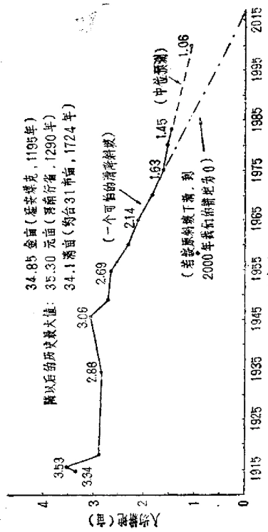
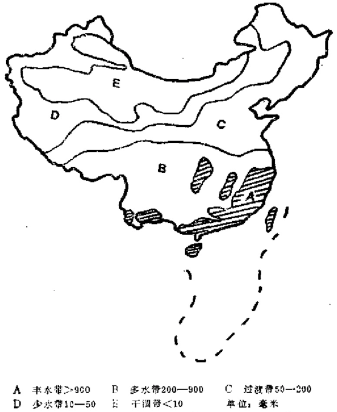
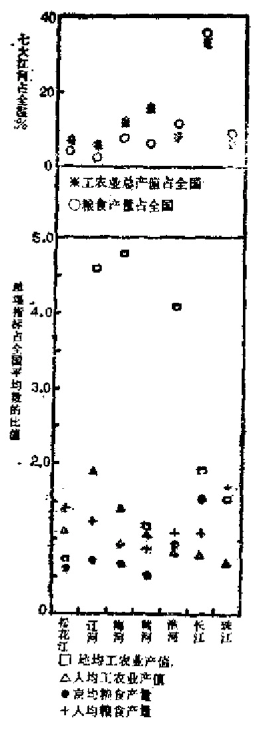
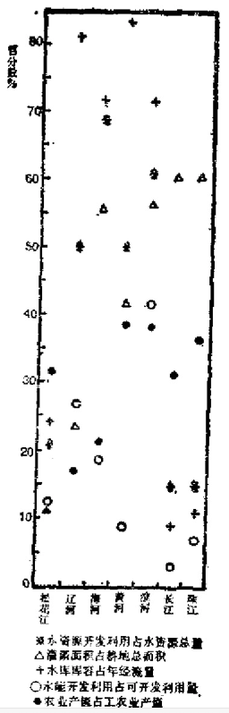

# 第八章 生态危机：留给子孙的遗产

    我哭你呵，我的森林，
    你在哪里，你在何方？
    在这二十世纪的大山，
    我忍痛空设你的灵堂！
            —— 洪三泰

## 8.1 “五斧砍树，十膊争林”  1/7的土地已经沙化

  1984年12月20日，杜润生在全国农村工作会议上作讲
话，最后一句说：“最担心的是生态保护，情况相当严重，这
个问题还没有人讲”。谈论中国严重的生态问题，确实是在
1985年以后才真正解禁的。

  正当我们热烈地讨论大西北的开发战略时，沙漠化的黄
龙，正以惊人的速度掠食大西北。我们对此却似乎束手无策。
历史上，被匈奴贵族赫连勃勃（天王大单于）选作夏国
都城的统万城（现陕北靖边县红墩界公社）不见了；西汉中
叶之后穿过昆仑山北麓和天山南麓的南北两道中外闻名的丝
绸之路不见了；一千多年前丰美无比的鄂尔多斯大草原不见
了……它们一一被迅速扩展的大沙漠所吞噬。

  丝绸之路是历史，但沙漠化不全是历史。在阻止塔克拉
玛干沙漠南移中有重要作用的新疆塔里木河下游3百多公里
的绿色走廊，已经遭受严重破坏。许多胡杨、红柳已经枯
死，公路堆满沙石，沙子已爬上房顶，地下水下降到八九米
深。这一带正在变成不毛之地。这不过是近二三十年来，乱
砍树木，过渡放牧，水资源失保造成的。曾经是中亚地区最
大水域之一的罗布泊湖，在本世纪70年代还是一个大湖，但
到80年代一湖汪汪之水已被可怕的满地鸟尸所代替，难怪彭
加木找不到水！罗布泊满可怜地干涸了，谁叫它躺在我国最
大的沙漠区塔克拉玛干（按当地方言为“进得去出不来”之
意）的边缘呢？

图8.1 考察人员正在罗布泊油底升起篝火；我国第二大咸水湖从此成为历史

（来源：《科学实验》1981年4期，第31页)

  在1987年初召开的新疆科协“三代”会上，博尔塔拉蒙
古自治州代表向大会发出“挽救艾比湖厄运”的紧急呼吁。
这湖史称“绿色迷宫”，位于精河县西北，世界著名风口——
阿拉山口东南部，是准噶尔盆地西南部汇水中心。湖周围有
17万亩耕地，湖水是新疆北部地区人畜用盐的主要来源，13
个民族，上10万人千百年来靠之为生。解放初期湖面1,620
平方公里，现在只剩500平方公里，且继续日趋荒漠化。该
地区扬沙和沙暴日数、浮尘天气日多，30米的防护林带已被
沙龙越过，农田不断被吞噬，附近植物因水位下降成片枯
败、死亡，牧草被盐土淹浸而茬茬夭折，历时11年投资600
万的精河新盐场工程刚刚建成，却因湖水退到生产线以下而
不能投产。目前专家们正担心，该地区可能要遭受黑风暴的
袭击。

  不论古今中外的历史均说明，土地的沙漠化，大多是人
为的，西德汉学家奥斯卡·韦格尔就认为罗布泊湖的消失是
人为造成的。多年来，我们一直向西北移民“开发”，开荒
地，办农场、设干校，过渡放牧，无情地砍伐森林，大举向
北沙窝“进军”。结果，大自然立即把沙线推过来实行报复。

  有人指出，有8.6万平方公里的内蒙鄂尔多斯地区，建
国30多年来，由人为造成的沙漠化面积相当于两千年来沙化
面积的总和。据统计，从1949年至1980年，我国有11个省207
个县的约6.5万平方公里面积变成沙漠。目前我国沙漠，戈壁
及沙漠化土地共149.6万平方公里，占全国总面积15.5%，超
过1/7。这149.6万平方公里范围内的71%的人口、72%的耕
地、68%的草场集中在沙漠化地区。另外，有15.8万平方公
星的土地正在沙漠化。有0.59亿亩农田、0.74亿亩草场、近
2,000公里铁路与公路正在受沙漠化威胁。草原退化速度惊
人地加快。70年代中期，全国退化草原面积约占草原总面积
15%，到80年代中期，已增加到30%以上，超过8亿亩。著
名的鄂尔多斯草原沙化面积解放初期为1000万亩，80年代初
已扩展到6000万亩，占该草原面积超过50%。[^254-1]掠夺性的
经营、水土流失加剧，粗放耕作，无建设性投资是造成草原
大面积退化的主要原因。估计，中国目前的沙漠，约16万平
方公里是人为造成的。目前正以平均每年1,560平方公里的
速度继续扩展！若不能加以控制，到2000年又会有7万平方
公里土地（比宁夏面积还大）沦为不毛之地！我国的原始植
被已基本不复存在，1/5的耕地存在盐碱化和次生盐碱化问
题。还有半湿润地带的风沙化土地约0.97万平方公里未计算
在内。[^254-2]

  如果沙漠化的人为原因还不够清楚，可以再看看森林的
破坏情况。这是造成人为沙化的元凶。大面积森林被砍伐
后，大气中水循环输出量受影响，流程中的反馈回路被砍
断，也改变了碳、磷循环的输出输入量，大部分氮流过程的
正常通路亦被截断，结果是打乱了人类生活和自然资源的持
续供应，也影响到整个自然规律的改变。

[^254-1]: 《中国社会科学》1986年第2期，第69页；《光明日报》1987年1月2日。

[^254-2]: 有关数据见《百科知识》1985年11期，第7页，《北京晚报》1986年3月30
日；《世界经济导报》1986年2月4日；《经济日报》1986年5月5日。

  可惜我们认识到这一点时，已经迟了。中国的山林破坏
有一个漫长的历史过程。浙江可以说是一个较典型例子。
浙江是“七山一水二分田”之地。境内山丘遍布，气侯
温暖湿润，在古代是个茂密的原始森林地带。直到公元10世
纪中叶，南部衢州和金华一带山地中，仍有象群出没。省内
作物原来五谷杂出，且以旱作为主，后来才变成以稻为主，
虽然两晋间有大批北人南迁，但仍未出现对山区产生影响的
情况。在两宋间更大规模的人口南移之后，情况就不同了，
江浙开始出现粮食问题。正在这前后，在太平洋彼岸新大陆
生产着的两种小家伙：玉米和番薯，大约在明代传入我国。
当时谁也不会想到，这两个解决人口增殖困难的小家伙，引
起了一场“土地利用革命”，后来竟会成为破坏山林植被，因
而最终又成为危害人类生存的罪魁祸首。

  陈桥驿曾详细地研究过浙江山地垦殖与山林破坏的历
史[^255-1]。他指出，两个半世纪之前，即康、乾时代以来，随着
玉米和番薯的先后传入，大量人口拥入山区。这种人口的机
械变迁改变了自然增殖，使人口数量猛增。为此，又要扩大
垦殖。这便造成山区植被的彻底破坏和水土的大量流失，形
成人口再生产与生态平衡之间的一个恶性循环。时至今日，
在浙江全省范围内，还在不同程度上为此时期的破坏支付着
代价，很难估计要支付到什么时候。

  在清代，象会稽山地已经“无森林之可言了”，原在深山
的原始植被，后来也成“旷览四郊，有牛山濯濯之叹。”

  康、乾以来，浙江境内所发生的这场暴风骤雨式的山地
垦殖和山林破坏情况，对其他许多省也是同样的，这是一个
历史教训。

  可惜我们并没有接受这一历史教训。我国多年来搞的
“毁林开荒”以及一些地方的“刀耕火种”所造成的恶果，
比历史上任何时期更甚。

[^255-1]: 见《中国社会科学》1983年4期，第207一217页。

  据最近对长白山的调查证明，有“长白林海”之称的我
国最大林区之一的长白山森林资源，出现了严董的采育失
调，森林主体正以每年3.5万公顷，500万立方米的速度消失，
伊春林区年产原木500万立方米，而当地居民一年就烧掉300
万立方米（若用此造纸，每年可得3亿元以上的利润），林海
势将枯竭！黑龙江森工总局所属40个局，有8个局资源已枯
竭，另有22个局只能再维持10年左右。但1985年，全省林木
仍超采499万立方米，比计划多出39%。若无根本改善措施，
任由恶性发展，到2000年，全省将面临天然屏障破坏，森工
经济崩溃，生态危机爆发的局面。

[^256-1]: 见《中国科技报》1985年1月8日第2版。另外，《公元2000年的中国》科
技文献出版社，1984年第82页说，西双版纳的森林覆盖率1949年为69.4%，1980
年降为26%。

  四川是我国主要林区之一。但过量采伐同样严重。据估
计，砍伐与更新之比约为10:1，30多年来，总计砍伐不少于
6000万立方米，群众把省、州、县所属企业和集体、个人
所进行的“剃光头”式滥砍乱伐称之为“五把斧头砍树，十
条路膊争林”。按此，川西森林再过13年就要被砍光。岷江上
游的森林覆盖率已从50年代的30%左右降为80年代的18%。
全省的相应数从20%下降为13%。整个西南横断山区为我国
仅次于东北的第二大森林区，目前都逃不出被过量砍伐的命
运。西双版纳州的森林覆盖率已从解放初期的60%降为目前
的30%左右[^256-1]，结果整个西南地区，气候由风调雨顺变成水
旱频仍，河流由源远流长变为增洪削枯，山坡由水土保持良
好变为表土严重流失；许多河流由清流化为浊流：滑坡和泥石
流频率大增；生物基因库资源迅速丧失。仅在云南就穿过20
多个县的金沙江长谷，几乎到了“万里不见树”的境况。据
统计，当地居民平均每户每年烧去木材3.38立方米。另外，
每熬1斤糖，要烧两公斤木材，烤1斤烟要烧3公斤木材。
1985年，云南省仅烤烟一项就烧去木材200万立方米。

  海南岛是我国一个重要的热带森林区，解放初期天然林
面积占全岛面积35%，到1981年降为10.5%，目前只剩7%。

  森林过量砍伐的情况，直到最近仍未停止。目前，森工
企业下放给地方，其庞大的职工队伍还不得不靠大量采伐来
维持。例如，位于长江上游的甘孜州炉霍林业局，现有职工
2500多人，每年要产7万立方米原木，即要耗源材12万立方
米，才能养活企业。加上地方每年采用3万立方米，该县每
年便要耗林木15万立方米，而全县森林年生长量仅4一5万
立方米。按此，该县现有108万亩森林、2百万立方米积材，
不用20年便会砍光。此外，甘孜州77万人每年烧掉的18亿斤
木材还未计算在内。还要特别提一下，该地主要的木材冷
杉、云杉，要80一120年才能有一个轮伐期。

  非主要林区的情况更为可怕。福建每年生长木材1800万
立方米。但砍伐量达2500万立方米，民间烧掉近1000万立方
米。目前福建用材林已所剩无几，这使各河流输沙量剧增。
1967一1977年间，闽江下游年均输沙量比1951一1966年间高
1.6倍，11年间流失的泥沙约8976万吨，相当于流失64万亩
土地的全部表土[^257-1]。

[^257-1]: 有关森林砍伐数据参看：《光明日报》1984年5月25日：黑龙江《学习与
探索》1982年1期第19页，《瞭望周刊》1986年11期杨纪珂的文章：《中国科技
报》1986年1月8日；《福建农业》1983年4期，第2页；《民族团结》1985年3
期，第24页

  看一下图8.2便清楚，这一切是怎样发生的。1985年6月
25日陕西华阴县华阳乡一个200多人的队伍竟动用十几辆大
车在秦龄南坡大量盗代林木。

图8.2 集岭南坡盗伐林木一景

（来源：《人民日报》1985年7月20日）

  自1970年以来，秦岭，关山等地森林面积已减少15.9%，
天然森林线又普遍后退了一二十里。整个陕西宝鸡地区1954
年以来造林240万亩，实际保存者仅31万亩，保存率只有
12.8%。按此，要250年才能把该地宜林荒山绿化起来。假
报、粗植、无人管理，这是我国人工造林声势大、效果差的
主要原因。

  相反，随意偷窃，哄抢国家资源的现象仍一直未能制
止。湖南邵阳县1987年初发现一处锑矿，附近邵阴、新宁、
东安三县农民自1月下旬起，每天3千多人哄抢，到处点火
放炮，不时崩石伤人，森林遭受严重破坏。就此，河伯林场
在二月初向上级写了报告，反映矿床附近成林有被洗劫一空
的危险，每天上山偷砍林木者不计其数，连树苗亦照砍不
误。有人甚至砍树建棚，就地出售给抢矿者。当地党政机
关，包括公安局只能沿路带广播员喊话，但由于农民来自各
县，喊话无效。直到4月17日《光明日报》还在发出“紧急
呼吁”的文章。民众之落后，政府处理之软弱无力，可见一
斑。

  美国被认为是历史上能够做到在打一场大战的同时，又
提高了生活水平的唯一国家。其中原因之一就与罗斯福的
“新政”有关。战前，罗斯福以“新政”名义搞了工程兴办
处、田纳西河流域管理局、农业电气化管理局等。其中被认
为最重要的是民间资源守护队。1932年，美国森林学家巴·
贝克在详细考察美国森林后，向当时还任州长的罗斯福建
议：派25万名失业青年去植树造林。罗斯福却立即回答说：
“能增加到30万人吗？”后来，在1933年至1939年间至少有三
百万人在守护队工作过。他们为美国人做了几千件大好事，
使美国在30年代后期创造出巨大的经济潜力。

  中国人现在很值得研究一下，是否要施行类似的新政。

  我国森林覆被率为12.5%，只近世界水平（22.0%）的
一半，占世界第102位；森林面积1.22亿公顷，人均不足0.13
公顷，木材蓄积量95亿立方米，人均不到10立方米，远低于
世界人均森林面积1.07公顷，蓄积量83立方米水平。（参看表
8.1）。目前，全国林木的年耗量已达3亿立方米，而年生长
量只有2.3亿立方米，且3/4集中在东北和西南边境，可及率
仅约30%（一般林业先进国家约80%），西北五省覆被率只有
2.5%，华北只有4.5%。且前每年的采伐量已超过生长量的
50%以上。从1949年至1981年，我们毁掉的森林超过10亿
亩。据专家估计，一个国家森林覆盖率若低于20%，不仅木
材不能自给，而且国土也难以保证安全。如果没有类似美国
“新政”的有力措施，森林问题，将会成为我国未来发展的
一大隐患。

表8.1 中国森林覆被率与都分国家比较（%）

------ ------ ----- ----- ----- -----  -----  -----  -----  -----  -----  -----
        世界   中国   朝鲜  芬兰  日本   苏联    美国   南斯   西德   法国   印度
        平均                                          拉夫
------ ------ ----- ----- ----- -----  -----  -----  -----  -----  -----  -----
覆被率   22    12.6   74    69    66      34    33     35     29     26     26
------ ------ ----- ----- ----- -----  -----  -----  -----  -----  -----  -----

来源：《未来与发展》1982年1期18页；
《中华人民共和国地图集》图20说明，1987年，地图出版社。

## 8.2 “主动脉出血”

  中国的事情，往往计划是一回事，事实又是一回事。据
统计，我国因植被破坏，造成严重的水土流失面积已达150
万平方公里，每年流失土壤约50亿吨。目前还有增无减。
1975年8月河南省的大洪水冲垮了板桥及石漫滩水库，给下
游带来毁灭性的灾难；1983年一次黄河泛区受灾人口达1200
多万，至今使人惶然。1984年四川、陕西、黑龙江等地更爆
发起特大洪水来。目前，黄河的河床已高出地面3至10公
尺，成为一条空中悬河，一旦遭到特大洪水的冲击，估计流
量超过22300M3/秒时，随时有决堤危险。黄淮平原的各种
建设有可能因此被毁于一旦，几千万人正在受到严重威胁。
太湖流城面积仅占全国总面积3%，耕地亦占1.3%，工农
总产值却占10%以上（达千亿元），财政收入占全国1/5，人
口3400多万，城镇上百个。但1983年因洪水淹浸农田500多
万亩（占耕地1/5），其中219万亩成灾，损失8亿元以上。有
人估计，若再发生一次1954年的大洪水，40%的农田及各大
小城镇均会被水淹，经济损失将会超过一百亿元。黄河年输
沙量高达16亿吨，（每立方公尺37.7公斤，尼罗河为1公斤），
早被外国学者称之为中国的“主动脉出血”。1957年动工的三
门峡工程更加重水库区泥沙淤积，回水淹浸，危及关中八百
里秦川乃至西安市，成了一次重大的决策失误，至使工程改
向，到1980年还未完全收尾。目前，长江支流湘、资、沅、
酆水系，含沙量大增，年年输入洞庭湖的混沙达1.2亿吨，湖
底年年增高，容积正日渐减少。

  几年前，关于长江是否会变成第二条黄河的争论，现在
似乎有了答案：作为长江上游的金沙江，长度超过长江主流
的1/3。其每立方米江水输沙量，在1941一1976年的35年间只
增加0.2公斤。而在1976一1981年的6年间，也增加0.2公
斤，在1982一1985年的3年间，更增加0.4公斤！目前长江
带入东海的泥沙每年达5亿吨，输沙量已达黄河的1/3，相当
于尼罗河、亚马逊河、密西西比河三条世界大河的输沙总
量。仅在云南就穿过22个县的金沙江河谷，极言之，已到
“万里不见一棵树”[^261-1]的境况了。有人却还在靠乱砍滥伐而
“发财致富”。

[^261-1]: 参看《未来与发展》1982年1期，第16页；《光明日报》1986年8月12日。

  关于人类文明衰落的原因，过去有“气候变化”说，后
来又转向致治腐败、道德败坏、经济失调、种族退化等方
面。但这些，目前还不知是文明衰落的原因，还是文明衰落
的结果。如果翻一下法国18世纪著名的百科全书派代表狄德
罗与达朗贝尔的代表作，其中竟首先以大量篇幅阐述土地垦
殖问题，这从现代学术思想来看，是不可思议的。1979年，
美国的权威刊物《科学》刊出一位学者的重要发现：同希腊
文明一样古老的玛亚文明，从公元前8世纪开始，连续17个
世纪人口剧增，到公元10世纪时突然奔溃。当时位于危地马
拉低地的人口高达500万，而在数十年间人口突然下降到不
足原有的1/10，直接的原因就是土壤受侵蚀，表土被冲走，
耕地生产能力被彻底破坏。

[^262-1]: 参看广东《开放》1985年7期，第23页。

  值得注意的是：古代中华民族的发源地——黄河流域，
主要是因为泥沙淤塞而衰落的，战乱的频频发生和人口的大
量南移都跟此有关。中国近代文明的发源地因此移到长江流
域。如果按目前情况下去，如果长江变成第二条黄河，长江
流域的文明不是也隐伏着衰落的危险么？中国未来的，或者
说是现代化的文明的“发源”是否会移到珠江呢？可借珠江
的情况亦不妙。珠江的东江段已成“黄河”，梅江源流之一的
兴宁宁江合水水库及其上游一带，到处光山濯濯，不少崩溃
的山岗像张开的血盆大口。河流泥沙俱下，水库淤积严重，
枫树坝水库区（东江上游）的水已变成铁红色，周围不要说
合抱大树，连碗口粗的树木也成了稀品。多年的乱砍乱伐，
正如当地一位区委书记所说，不仅吃掉祖宗八代的遗产，连
于孙后代的也吃了。梅江上游五华河、琴江全是黄泥水，北
江上中游的支流武江、滨江、潍江，涟江，滨江世是黄泥淤
积河床，流量大减。其余的缓江、罗定江、新兴江、漠阳
江、鉴江，南渡江、万泉河、昌化江，没有一条是清的[^262-1]。
最近林木市场一开，“靠山吃山”又出新花样。我们已经谈
过，山东水土流失严重的情况。承德地区又报告：在1981年
前，每年水土流失量相当于损失46000亩耕地，流失的农肥相
当于1980年全区所施化肥量的一倍半。1961年建成的庙官水
库，按目前的淤塞速度发展，30年后就会使水利工程全部报
废[^263-1]。当年塞外松涛澎湃的千里林海，如今已成穷山恶水。
昔日美不胜收的清帝“避暑山庄”，大有变成“招暑山庄”之
势。辽宁水土流失面积8600万亩，占全省面积40%，东部9
个县的耕地面积比解放初期减少1/3，主要是水土流失造成
的。最严重的朝阳地区，水土流失面积已占78%，在上一世
纪的100年里，朝阳地区风调雨顺与涝、旱年之比为46:14（其
余为平年），面在1958一1981年的23年中，为5:18，在1980一
1985的6年中更有4年旱期[^263-2]。福建耕地只有2000万亩，人
均只有0.76亩，仅为全国水平的一半，但仍不知珍惜。仅
1979年一1981年，全省基建征地和农村建房就占土地17.6万
亩，其中耕地近9万亩。而目前福建人口平均每年增加43万，
这一减一增，将使土地负担超重，1958年以来又投入大量人
力、物力和资金“向海夺粮”，却不知滩涂养殖业和海洋渔业
惨遭破坏。至目前，全省海洋捕捞量下降2/3！有些近海已
无鱼可捕。[^263-3]近年福建的一个口号是大念“山海经”，希望不
是过去的那种念法。

  香港1986年9月1日《快报》以《江西尽“铁锈”，赣江
变“红河”》为题报道江西水土流失严重。南昌县的一个乡，
1万多亩良田变成沙丘，农民被迁走，南昌城西南赣江两岸
的巨大沙龙连绵15公里，每年还向前推进三四公尺。以致人
们有“兴国县要‘亡国’，兴都县要‘迁都’”的呼声。

[^263-1]: 《河北学刊》1986年2期，第26一31页。
[^263-2]: 东北财经大学《财经问题研究》1985年6期，第49页
[^263-3]: 《福建师大学报》1985年3期，第3页

图8.3 江西兴国严重侵蚀的红壤丘陵

来源：张俊民等《我国的土壤》，商务印书馆，1984年第214页

## 8.3 “杞人”忧地

  我国国士面积约144亿亩。其中农业用地106.5亿亩，占
总面积74%（未包括台湾及约22亿亩大陆架）。但耕地按公布
只有约15亿亩，其中稳产高产田不到1/10，贫瘠、缺水或盐
碱严重的低产田有6亿亩（占40%）；水面约2.5一2.8亿亩；
林、草、山地约80多亿亩。另有7%为城市、交通用地，19%
为沙漠及长年冰封地。

  在谈农业隐患时已提到，1977年前，我们已丢失相当于
两广、四川三省耕地之数的情况，其中包括最重要的太湖流
域商品粮基地面临消失的危险，而近几年的劳力转移又已花
去8000万亩的耕地。我国人口占世界总数23%，超过1/5，耕
地却仅占约1/13（以公布数计）。严重的问题在于，以1981年
为例，我国人口增长1,440万，耕地却减少1534.3万亩，相当
于一年生出4个半新西兰，同时消失了近两个青海省（1981
年耕地面积875.9万亩）。[^265-1]事态环在迅速发展之中。有人估
算，近年我国耕地年均减少约在2500万亩以上（仅建设用
地一项每年平均就耗地850多万亩，农村建房用地每年约50万
亩）。美国在1979年之前，每年减少耕地754万亩，另有1500
万亩转移作非农业用。总耗地跟我们差不多，每年约2200多
方亩。但不可忘记，美国人均耕地为12亩，比我们的不足1.5
亩高7倍。她们的农业人均耕地350亩，比我们的不足1.8亩
高194倍。况且，1979年美国已制定并严格执行保护全国耕
地的计划，制止了“开路机和耕犁之间的战争”。而我们的耕
地，直到今天还在大量耗损之中。按经济学家的测算，一个
国家为达到充分就业所需的人均耕地不能低于9亩（世界只
有人均5亩）。可是目前，我们已经有9个省市人均耕地不到
1亩了。然而，按照各种测算，人口城市化的发展，人均用
地为74m²（236个城市的调查平均数）；山西煤炭规划用地到
2000年还要减少800一1200万亩：农村人口的发展，人均占
有为200一266m²；水利发展用地到2000年还要占1500万亩
（目前已占用5000万亩）；平原防护林再要占6000万亩：退耕
地在2000年前会有2000—4000万亩。[^265-2]

[^265-1]: 《河北社联通讯》1984年6期，第45页。

[^265-2]: 陕西《人文杂志》1985年6期第34页；《光明日报》1986年12月5日；《自然资源》1987年1期，1一6页。

  有一个历史性的难题还值得再提。

  1984年5月24日《人民日报》发表《实事求是摸清土地
家底》一文指出：

  “目前，全国人口这本‘大账’已经查清，但土地资源
长期以来没有准数，至今仍然家底不明。现有耕地面积不
实，草地、水面和各项建设用地缺乏准确统计。不少地方实
有耕地数比上报数大，当地的农业单位面积产量掺了水分，
并不反映真正的生产水平。

  一些上级机关，明知下面的土地面积不准，还层层上
报。

  我们究竟有多少耕地呢？以下是一些重要的历史统计数
据：

  由于历代亩制换算不详，还无法作出一个清楚的变化曲
线。但从1915年后的情况看是清楚的。特别是建国以后，人
均耕地处于几乎是直线下降的危急状态之中！若按1955一
1975年的速度发展，大约在2017年我们的耕地就要趋近零点
了（见下图8.4）。这种可能性绝对没有吗？

  当然，可能性是可以随着认识和行动改变的。

  按表8.2所示，我国目前的耕地不到15亿亩。但何炳棣的
一个重要研究指出，我国历代公布的田地统计数颇为不实。

[^266-1]: 《中国社会科学》1985年8期，第160页，《河北师范大学学报》1981年1期，第 4 页。

  据一些典型调查分析，各地实有耕地面积一般比上报面
积多20%左右；又据近年从遥感照片推算，全国耕地面积可
能高达22一23亿亩。而接近几年调查的资料推算，全国耕地
在20-21亿亩左右，即以此计算，中国的人均耕地亦排在国土
面积大于10万平方公里的76个国家的倒数第8位。即目前全
国耕地面积比统计数至少多出5一9亿亩，多出1/3至1/2。[^266-1]
即实际占世界耕地总数约1/10至1/8。这似乎多少有点可喜。
不过，如果这个情况属实，更进一步说明我国农业生产效率
比统计公布的要低得多。而除了在耕地损耗净尽的计算时间
上会稍有延长之外，并无其他更大好处。

表8.3 中国历代耕地变化情况统计

----------   ------------  ------------  ----------   ------------  ------------
年  份         耕地面积       人均耕地       年 份        耕地面积      人均耕地
                （万亩）        （亩）                   （万亩）        （亩）
  (A)           （B)             (C)         (A)         （B)             (C)
----------   ------------  ------------  ----------   ------------  ------------
2               82700           13.9        1698         59800          29.3
(西汉）        （汉亩a)       （汉亩）

105             73200           13.7        1700          59800         29.3
（东汉）

122             69400           14.3        1711        69300           28.1

144             68900           13.9        1719        72600           29.0
                                          (清雍正）

145             69500           14.0        1724        89000           34.1

146             69300           14.6        1726       另说72363        34.0
                                                        89600

581-600         194000          13.6        1734        89000           32.5
（隋)         （隋亩）     （隋亩，疑误）    

606             194443          42.3        1753        73521           4.00
                                         （清乾隆）

755             143000          27.0        1812        75153           2.37
（唐）         （唐亩）        （唐亩）       

1080            46100           13.8        1821        79153           2.18
（北宋）        （宋亩）        （宋亩）   （清嘉庆）

1195            16904           34.85       1851        75639           1.75
（金）          （金亩）                   （清咸丰）

1290           1066元亩         35.03       1873        75663           2.73
（元）                                     （清同治）

1381         （河南行省）                     1887        91198           2.41
（明）           36677          6.13       （清光绪）

                                            1915        144233          3.34
                                            （民国）    （市亩）        （市亩）

1391            38747           6.4         1916        150997          3.53
                              以1393年
                               人数计

1393            85000           14.0        1917        136518          3.19

1502            42000           7.88        1918        131447          2.90
                               以1491年
                                人数计

1542            43666           7.65        1935        133228          2.88
                              以1491,
                              1578年人口
                              均值计）

1570            70140           11.55       1940        141073          3.06

1578            51061           8.41        1947        127487          2.77

1661            54938           15          1949        146822          2.71
（清顺治）                     以1662年
                              人口数估计

1684            88900           29.0        1952        161978          2.82
(清康熙)       （清亩）        （清亩）    （解放后）

1685            60784           5.98        1953        162793          2.77
                                1684年
                                人口估计
----------   ------------  ------------  ----------   ------------  ------------

----------   ------------  ------------  ----------   ------------  ------------
年  份         耕地面积       人均耕地       年 份        耕地面积      人均耕地
                （万亩）        （亩）                   （万亩）        （亩）
  (A)           （B)             (C)         (A)         （B)             (C)
----------   ------------  ------------  ----------   ------------  ------------
1954            164032          3.72        1970        151702          1.84
1955            165235          2.69        1971        151049          1.77
1956            167787          2.67        1972        150922          1.73
1957            167745          2.59        1973        150319          1.68
1958            160351          2.43        1974        149863          1.65
1959            156869          2.33        1975        149562          1.63
1960            157202          2.37        1976        149082          1.59
1961            154966          2.33        1977        148871          1.57
1962            154355          2.29        1978        149084          1.55
1968            154090          2.23        1979        149247          1.53
1964            154968          2.20        1980        148958          1.51
1965            155391          2.14        1981        148556          1.49
1966            154437          2.07        1983        147910          1.45
1967            153846          2.01        2000        136800          1.09
1968            152330          1.91                    142890          1.14*
1969            152190          1.89
----------   ------------  ------------  ----------   ------------  ------------

*这里，人口按12.5亿算。在表23.2中曾给出人口12亿，耕地不缩小条件
下的估计值（1.2亩）。

注：表中年份与单位无说明者同前项；历代亩积与今亩的换算未详（参看吴
承洛《中国度量衡史》商务印书馆：1957年，第61页），消以后为市亩，1市
亩=1,099清亩：部分人均值按表及《中国统计年鉴1984》计算。

数据来源：《四川大学学报丛刊》1979年3期第104-111页，《人口研
究》1980年2期第58页：《中国社会科学》1985年3期第152一160页，1986年
1期第193一213页，《福建师大学报》1984年2期第12页；《广州日报》1983
年1月30日；《人口研究》1985年5期第21页；《地理知识》1985年7期第4
一5页；《公元2000年的中国》科学技术出版社，1984年第60页，56页。

（按原统计人均耕地接近到2000年1亩，按遥感资料估计也不会超过1.4亩）

  此外，我们还有宜农荒地约2亿亩，约可开出1亿亩耕
地来。但即使全部开出来，人均耕地增加量不到0.1亩！可见
后备耕地严重不足。再加上我国耕地分布不平衡、耕地自然
条件差，全国土地近3/4在海拔500公尺以上，复种指数过高
又加重地力衰退，土壤盐碱化亦已近1亿亩等等，我国未来
耕地的状况是非常令人可虑的。

  我国耕地严重耗损的事实表明，大多数管理者和决策者
还没有认识到耕地是我国最稀缺的资源之一，更没有土地生
产力的基本观念。虽然土地的自然生产力应当是无限的，但
在一定的生产条件和生活水平下，土地对人口却有限定的承
载力。土地一旦因侵蚀、沙化、盐碱化、沼泽化而退化，它
的生产力便迅速消失；而一旦被非土地生产占用，其生产力
便近乎永远消失。更甚的是，土地是无弹性的，目前还是不
可替代的资源，即使无限提高土地的价格，也不能增加土地
的供给。“寸土必争”之所以成为千古之争，就是这个道理。我
们说过，恢复一个大区的生态平衡，需要1000多年的时间，形
成一个顶极植物群落，要60-70年时间；靠森林植被的再生
来恢复土壤肥力也要50一60年时间。中国每一代人都应当想
到自己的责任。

## 8.4 水，水，给我水！

  在对大自然的索取与探索中，作为“征服者”的人类，
还未来得及欢庆自己的胜利，大自然已经作出无情的报复。

  1972年是人类认识自然的一个分界点，这一年，在斯德
哥尔摩召开的人类环境会议上，提出了“只有一个地球”的
报告，现在被认为是人类对资源和环境问题的一次觉醒。

  从那时起，全世界都认识到，有两个威胁性的难题：能
源及其他资源的日益枯竭和生存环境的不断恶化。

  可惜，1972年中国人还是处于任由环境退化，而自己正
斗得天翻地覆的时候。如果我们因此遭到最大的报复，也真
是无话好说。

  中国有“七山半水二分田，半分城镇和庄园”之说，水
资源极其宝贵，一个即将来临的自然的报复，是比缺乏粮食
更为严重的缺水。

  “水，水，给我水！”这是50年代上甘岭坑道内战士们的
叫喊，到本世纪末可能会变成半个中国的呼声。

  据联合国统计，地球“水圈”中，水的总储量约为13.6
亿立方公里，但其中97.5%为海洋咸水，仅有2.5%为淡水。
淡水中又有约70%在两极及雪山冰川，只有淡水总量的
0.34%是与人类关系密切的。剩下的均被蒸发。

  据统计，从本世纪初到70年代中期，全世界农业用水增
长7倍，工业用水增长20倍[^271-1]。目前已有约63个国家和地区
面临缺水危机。

[^271-1]: 《天津教育》1986年2期，第39页。

  美国观察研究所最近报告说，本世纪90年代全世界都会
面临水源危机。中国为贫水国，人均占有水资源量约为2700
立方米，仅及世界平均水平的1/4，居世界第84位。只要看
一下图8.5就知道，在这场水源危机中，我国至少有一半地
区会陷入困境。

  法国18世纪的著名学者拉格朗日曾说：不要认为自然
资源是有限的！借助于人类的技能，自然资源能够成为无限
的。”这种理论，至少到目前还是不正确的。现在许多国家都
在为这种“资源无限”可以“无限发展”的理论所造成的资
源枯竭状况而苦恼。

  形成淡水危机的两大主因是需要量急剧增加和水源日益
被污染。

  专家们预测，到2000年，世界淡水用量将为70年代的3
倍多。面且前所有工业发达国家的河流和湖泊几乎没有不被
污染的，污染的势头有增无减，按其速度，不出10年，全世
界的河流与湖泊都将逃不出被污染的命运，即使两极冰原也
不能幸免，仅仅大气携带的污染物即可令两极冰原难逃厄
运。事实上，不久前，研究人员已在南极的企鹅中发现DDT
药物。地表污染物的逐渐下渗，会使地下水也落得同一结
果。

  目前，有些国家已经从惨痛的教训中，被迫放慢自己的
脚步，投下大量的人、财、物力去挽救“死去的河流”。

  中国多年平均水资源总量为2.8万亿立方米，人均占有
约2700立方米，排世界第84位，仅为世界人均占有量的
1/4，美国的1/5，苏联的1/7；按亩均算也只有1300立方
米，为世界水平的1/2。可算是个“贫水”国。更有甚者是中国
水资源分布极不平衡。以每亩耕地占水量计，长江与珠江流
域分别为全国平均值的1.5倍、2.5倍，黄、淮、海、辽四流
域却分别仅为全国平均值的17%，15%、10%、13%；以人
均占有水量计，长江流域仅路高于全国均值，珠江流域为全
国均值的1.7倍，黄、淮、海、辽四流域却仅及全国均值的
26%、15%、11.5%、21%。黄、淮、海流域和东北、西北
耕地占全国总数63.7%，人口占46%；年径流量却只占17%，
西南、东南、华南地区耕地只占全国36.3%，人口占54%，
年径流却占总量83%，面且水资源在供需时间上的矛盾极大，
黄、海两河水量大小之比常差14一16倍，而最小水量时又正
好是作物需水期。

（来源：《上海交通大学学报》1983年第4期，65页

  据估计，目前我国总用水量约为4770亿立方米。[^274-1]其
中农业用水达4190亿立方米，占用水量88%，同时，我国
北方有配套机井220万眼，井灌面积约1.7亿亩，占北方总灌
溉面积1/3。可见农田用水不仅耗用大量水资源，且消耗大
量能源，处理不好，必然会降低区域生产力。可是，我们至
今不知道农作物生长与生物物质量一直存在的最优用水规律
是什么，农业的废水回收利用基本上无人管理（工业也仅达
20一30%的水平），每年损失废水约312亿立方米。

  我国目前人均年用水量为490立方米，仅相当于美国的
1/5，苏联的1/2。有人测算，到2000年我国总需水量为7000
亿立方米，其中农业用水占80%，而供水量只有6000一6300
亿立方米，缺700一1000亿立方米。其中以华北、辽宁等地
区情况最严重。[^274-2]不知这一情况是否已收入所有决策者所掌
握的背景材料之中。

  西北的化工基地开发，山西的能源开发，中原的全面开
发，不断向黄河提出要水的要求。但是，我们那条已经悬空
10米的黄河怎么样呢？

  黄河主要靠大气降水补给，而黄河所流经的正是我国北
方较干旱的地区，平均雨量较少。据黄河花园口站多年实
测，平均年径流量为480亿立方米，只有珠江的约1/6，还不及
长江几条支流的流量。长期以来，黄河的水96%用于农业灌
溉，工业和农村人畜用水只占4%。据统计，全国低产缺粮
县（旗）中，近一半在黄河流域。平均亩产粮食和平均每人
占有粮食在全国七大江河中最低。

[^274-1]: 《自然资源》1986年1期，第1页：《光明日报》1985年12月5日
[^274-2]: 《未来与发展》1983年，4期，第9页

  据估计，不管用什么办法提高黄河水的调蓄能力和引水
能力，今后所能增加的可用水量也只有100亿立方米，与各
省提出希望增加的引水量相差很远。而且引水过多会影响河
流的输沙能力，加快河道淤积，提高洪水水位，增大洪灾威
胁。这对两千多年来，平均三年就有两次缺口的黄河来说，
是非常严重的问题。

  长江三角洲与珠江三角洲已经开发出来了，作为中华民
族摇篮的黄河，它的三角洲的开发迟至今日还只是一些理论
家的研究题目。一个关问题在于，黄河入海河道有个从三
角洲中部到北部约50年为周期的摆动循环。若出海流路不能
固定，三角洲开发问题，始终只能停留在理论家的书桌上。

  青海要作大开发准备，有人报告柴达木地区有3400多亿
立方米储水，相当于三个青海湖，实际一查，只有44.4亿立方
米，能常用的仅占77分之一，其余是地下静储量，不能经常
动用。[^275-1]山东报告年缺水180亿立方米（主要是农业）。另外，
由于盲目开采地下水，使全省出现漏斗区面积高达7,000多
平方公里，沿海地区普遍导致海水倒灌，使地下水含盐高达
3一15%，人畜均不能饮用，农灌深受影响。[^275-2]

  我国七大江河总的开发水平不高。其中就以淮、海、辽
三河的开发水平最高。这三条河以1/12的国土面积提供全国
1/4以上的工农业产值（参看图8.6，8.7）。

[^275-1]: 《青海社会科学》1984年11期，第101页。
[^275-2]: 《山东经济》1985年5期，第43页。

来源：《人民黄河》1986年6期第10页

来源：同图8.5第11页

## 8.5 城乡齐缺水，北京是否要考虑迁都？

  农业方面，还有个生态隐患问题，这在水资源方面看得
最清楚。有人说如果我国七大江河437万平方公里流域的开
发，都能提高到海、辽河的水平，将给国家增加多少财富。
但不可忘记，这是要用水资源枯竭为代价的。以黄、准、海、
辽四个流域计，人口3.3亿，耕地6.4亿亩，工农业总产值占
全国40%，又为国家主要能源基地。但目前，以中等干旱年
（缺水25%）分析，该地区缺水约300亿立方米。

  跟罗布泊的命运一样，新疆的博斯腾湖原为我国北方最
大的吞吐淡水湖，但因水源枯竭，从1980年起已变成微咸
湖；八百里洞庭湖30年来被垦掉五分之三，目前频于毁灭的
危险；鄱阳湖为我国最大的淡水湖，20年来被垦掉一半，现
在每年有2100多万吨流沙通过赣江流入，使湖底每年增高
2一3毫米，亦是厄运难逃；被誉为“华北明珠”的白洋淀
在1984年春夏之交再次干涸[^277-1]，波光粼粼的水面从此不见，
淀底黄沙绿草一起朝天，号称“千湖之省”的湖北，1949年
有大小湖泊1,066个，到1981年只剩下309个，现在水面缩域
3/4以上。按新华社1980年11月14日公布，全国湖面减少2,000
万亩以上，损失淡水350亿立方米。

[^277-1]: 见香港《快报》1986年9月15日；《地理知识》1984年11期，第4页；
《自然杂志》1986年5期，第345页。

  在水士流失严重，土壤肥力下降的威胁下，农业更碰到
生产性投资下降，农田基本建设无保障的厄运，致使近几年
农田灌溉能力严重萎缩。从1982一1986年，农田有效浇水地
又减少5,100万亩，在1985年，仅此一项就估计损失粮食超
过100亿公斤[^278-1]。1986年4月1日《人民日报》以《河北平
原农业生态的隐患》为题报道：河北平原地区农业生态条件
隐患深重。京津水源告急，现在河北的耕地每年约1/4受旱，
1/6沙化严重，近1/10含盐量超过0.2%，次生盐碱地还在发
展之中，近一半水土流失严重，每年因此流失的农肥约155
吨以上，相当于全省化肥产量的42%，另外因水库淤积相当
于每年损失一个中型水库，河道淤积造成近1/3的防洪工程
能力丧失。目前河北全省年需水量273亿立方米，可供水源却
不足200亿立方米，地下水资源已超负荷开发，造成河流、湖
淀干枯。从1983年起，河北30处湖淀滞洪区已全部干涸，河
流入海量骤减。即使“引黄入京”临时救急，至少也要投资
11亿元。在海河和滦河地区，人均水量只有430立方米，仅约
为世界水平的1/26，比以干旱著名的阿拉伯半岛还低：淮，
海、滦河流域亩均水量360立方米，仅及全国平均水平的
2/5，[^278-2]可说是处在贫水国的贫水区，但这地区所建成的却
是“费水型”经济群落，几年前还大力发展水稻种植。

  掠夺性地下水开采行为使京津唐地下水已十水九空。其
中辽河平原已开采了近1/3，黄河平原近1/2，海河平原更高
达9/10。结果地面沉降，水质恶化，咸水面上升，地下水枯
竭，成千上万口井已经干涸。估计干旱将使1亿人受影响。
我们准备给子孙留下什么遗产呢？

[^278-1]: 香港《金融日报》1987年11月20日
[^278-2]: 《光明日报》1985年5月17日

  目前辽沈、晋、陕、内蒙等地正在制定能源、化工、钢
铁等重工业发展计划，对可能会碰到的“无水之炊”的困
境，却仍然似乎不屑一顾。

图8.8 龟裂的大地：这是留给子孙的遗产吗？

  水是城市的命脉。世界上，所有的大城市都依在一条河
旁就是证明。

[^279-1]: 见《未来与发展》1984年4期，第50页。

  中国的城市，眼看要迅速扩展，中心城市、中心城镇正
在一批批形成和发展之中。全国的用水量在70年代末期已达
4700亿立方米，为解放初期的4.7倍。其中，城市生活用水
增长8倍，工业用水增长22倍。奇怪的是，城市用水问题，
至今未被当作一个整体研究来规划。城市的供水、排水、防
洪、水运、市郊灌溉、水系环境、水质净化等等，各有各的
婆婆。不少城市与水有关的矛盾已经十分尖锐。国家水电科
学研究院的郭涛不久前曾调查国内十几个大城市和一些县城
的情况，[^279-1]发现一大串问题：膨胀的人口使供水日益紧张；
地表与地下的水资源开采速度超过了补给速度，致使出现以
重金向外跨流域借水现象；各自为政，擅兴取水工程，工农
业争水矛盾突出；一些滨江、滨河、滨湖城市，河床侵占，
河堤毁损，河身壅塞，既无彻底整治，又缺乏有效管理，防
洪问题十分尖锐：一向有水运条件的城市，今日却被去在一
旁，河道日浙淤塞，水运逐渐废弃；一些城市排水管网混
乱，净污设施既少又差，甚至直接将污水排入河道或湖泊，
水质严重污染，却至今未得控制；天雨地水，人各用之，水
资源的开发利用权无立法解决，处于失控状态。

  目前是水利部、交通部、自来水公司、城建部、环保局、
水产局、电力部各自插手水源问题，哪有不乱之理？本来是
城市环境的供水条件决定城市人口、工业和农业用水的约束
条件，现在变成从工农业、人口的盲目扩展去找水源，哪有
不乱之理？本来应该是一水多用，现在各用各的水，各用各
的渠，又哪有不紧之理？

  有“八水绕长安”之美誉的西安市，如今水位下降，水
井枯竭，水荒正在迫近；位于九河下梢的“水乡之城”天津，
今日已成“水荒之城”。中国的城市，1979年有154个缺水，
1984年有188个缺水；在289个城市中80%供水有困难，严重
缺水的有40个，日缺水1200万吨。从1986年夏季起，北方的
一些工厂已不得不实行定量供水。在北京的一位外国专家指
出，如果政府不实施强有力的节水法令，中国工业现代化的
计划不出5年就有可能受到非常严重的影响。

  天津及其部分郊区地面目前正以年均800毫米速度沉降。
沉降最严重的天津北站在1959-1982年间下沉超过2000毫
米。沧州，邯郸情况亦如此。黄河以北地区已出现30多处地
下水下降漏斗。其中沧州的漏斗中心水位埋深在1979年10月
已达68米，并以每年平均6米的速度继续下降。北京翻番最
多的，可能是用水。地下水开采量，60年代比解放初增长30
倍，70年代又比60年代翻一番，80年代又比70年代翻一番。
1979年全市用水量达46亿M3，已到常年供水量的上限，“自
来水”变成了“夜来水”，许多楼房二层以上已无水供应。北
京人均年占淡水量为470M3，仅及东京1/10。目前北京地下
已形成1,000平方公里的地下水降落漏斗区，水位平均下降
4一5公尺。其中京东郊漏斗区每年还以1一2公尺的速度
下降，漏斗中心水位埋深已达30公尺，含水层有全部疏干的
可能。而且地下水硬度超标范围已达200多公里，水质不断恶
化。[^281-1]由于地下水的过度开发，不仅地面开始下沉，而且更
甚的是会导致海水返渗使土地含盐成份增加和使淡水水位永
远丧失自然回升的可能！目前已有一些严肃的研究者在研究
未来北京是否需要迁都的问题了。

  “南水北调”似乎可以给人带来希望。按规划方案，只
要投入跟宝钢一样的资金（全国每人20元！），每年就可从长
江调250亿立方米水到海河，可借长江的流量，近20年来已下
降1,000亿立方米。目前从芜湖以下，已有58座大中沙洲坦露
江面。使上海港每分钟300美元给外轮的一个主要原因就是
长江口的沙洲。更有甚者，目前海水倒灌已到常熟。常熟到
上海一线的人现在每年有3一5个月要喝咸水。上海的罐头
难以出口，宝钢的机器要从70公里外的淀山湖引水供用。此
外，长江口外的四大鱼场以及长、黄两大流城的小气候同样
会因调水而产生严重影响。

[^281-1]: 见《光明日报》1985年5月1日；《城市问题》1985年9期，第54页；《地
理知识》1983年8期，第3页；北京《自然资源》1986年1期，第13页。

  我国的农田水渠系统利用系数只有0.4一0.5，工业用水
的重复利用率只有2%，一方面严重缺水，另方面又严重浪
费水，每年损失废水约312亿吨。

  唐魏征《谏太宗十思疏》告诫：“人君当神器之重，居域
中之大，不念居安思危，戒奢以俭，斯亦伐根以求木茂，塞
源而欲流长也！"当年魏征的话是给皇帝说的，现在却应该拿
来给人民作环境教育用了。

