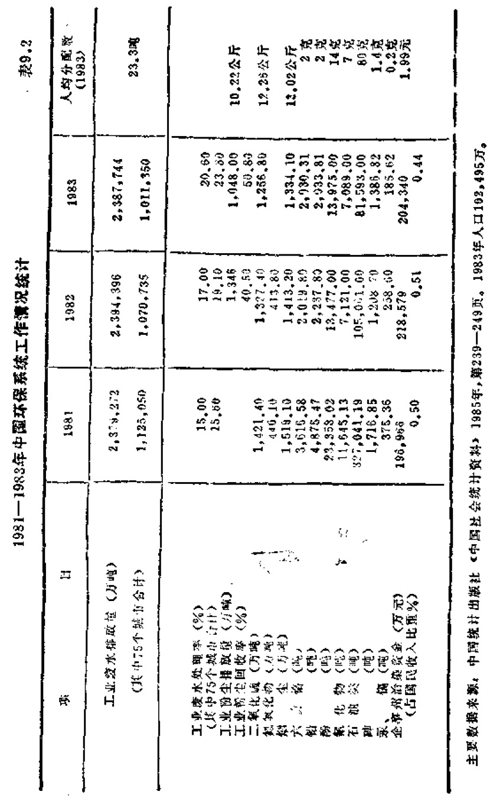
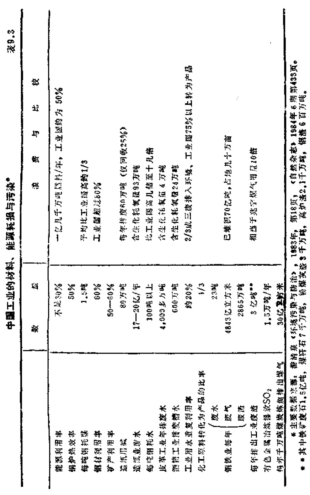

# 第九章 “忘恩负义”之罪

    大地……给予所有的人
    是物质的精华，而最后，它
    从人们那里得到的回赠却是
    这些物质的垃圾。
            ——[美] 惠特曼

## 9.1 兴安与舟山的悲哀

  1987年2月，笔者在一份杂志上发表《中国的生态危
机》一文，对我国的森林生态危机提出了一个警告。当时，
编者还以高度的敏感性，在文中加上图片及说明，对这一警
告，作了“危机将随时爆发”的特别强调。这里，要特别注
意“随时”两个字。如果说30年内这个地区要爆发一场什么
危机，意义是不大的；但是说三天内要爆发一场危机，情况
就完全不同了。对任何潜在的危机作短期的预警是最困难
的。可惜，我们的警告当时没有引起应有的注意。

* 本章在上海1988年初肝炎大流行两个月前曾以《中国下一个要爆发的危
机：严重的环境污染》为题发表。文中的一节就以上海地下水严重污染为题，提
出明确警告。现作了修改补充。

图9.1 笔者在兴安林火爆起前两个月提出的明确警告

（这是《中国的生态危机》一文中的插图）

  更不幸，特别警告提出之后，不过两个多月，便发生了
一场举世震惊的大兴安岭林火。101万公顷（其中有林面积70
万公顷）地面惨遭火劫，85万立方米木场存材被烧毁，6万人
之众的漠河县城一夜间变成废墟，从塔河到古莲的几百公里
铁路沿线被洗劫一空，2,488台各种设备、总长1,340公尺的
67座桥涵、483公里的通讯线路、284公里的输变电线路、325
万公斤粮食、61.4万平方米房屋、193人的生命，在一阵火光
中报销（受伤者还不知其数）。[^284-1]当地森林资源的1/19从地球
上抹掉了，一场大火可悲地改变了大兴安岭森林面积居全国
之首的历史地位，成了建国以来毁林面积最大，伤亡人员最
多、损失最为惨重的一次大灾难。

[^284-1]: 各主要损失数据及有关图片见《虎门》杂志，1987年6月现场采访专号。

图9.2 大兴安岭的悲哀：1987年6月8日爆起的森林大火

图9.3 一夜之间惨遭浩劫的漠河县城

  有人可能会认为，提出的警告并没有包括林火。其实非
也。火本来就是森林生态系统的一部分，是森林垃圾最好的
清理师。全世界森林每年起火约20多万次，大多在一二小时
或一二天内便扑灭了，造成重大灾害的为数不多，其中却以
中国为最。1987年全球性森林大火，据说可能与一个使东西
太平洋气压逆转的“厄尔尼诺”现象有关。但同一时期、同
一纬度的美国阿拉斯加森林大火，只毁林2万5千公顷（仅
及大兴安岭毁林的1/28）；加拿大北部连起4场森林大火，每
场大火毁林也只有2.2万公顷；苏联后贝加尔地区森林大火
烧了一个多月，也只烧掉20万公顷地方。为什么大兴安岭开
过去5万8千灭火大军，挖出了5百公尺之宽的隔离线，仍
然挡不住烈焰的席卷？长期的过量砍伐，森林垃圾超巨量积
聚。加上官僚主义、管理混乱、灭火工具落后等是主要原因。

  据建国头25年的统计，中国林火面积达866万公顷，占
造林保存率的1/3（中国的造林保存率本来就只有百分之十
几）。黑龙江1977年的一场大火，烧毁森林面积等于全省5年
造林面积总和。

  中国的林火只是生态环境道受严重破环的冰山之一角。
实际上，中国森林的砍毁早已超过国土安全线（覆盖率20%，
中国只有12.5%），近1/3的草原变成沙漠；耕地的减少已非
常接近危险点（人均0.8亩。按上报统计数目前中国为1.4亩，
2000年中值预测只有1.06亩）；水资源已岌岌可危。这四大自
然生态资源的破坏情况，我们已在上一章中说过。还有第五
大生态资源，这就是污染使我们的海洋渔场几乎遭到毁灭性
的破坏。

[^287-1]: 《山东经济》1985年5期，第43页；《光明日报》1986年10月10日，12月23日。

  根据各地的报道，[^287-1]中国的渤海、黄海的油污染已超过
标准近50%。渤海的小黄鱼、带鱼、鳓鱼、鲷鱼等遭到毁灭
性破坏，对虾已成珍品；黄海的大小黄鱼，以及一度盛名远
播的河蟹和银鱼已几乎绝迹。与千岛渔场、纽芬兰渔场、秘
鲁渔场齐名的中国最大的舟山渔场，全国海洋捕捞总重1/3
的所在地、北京人均年供应八斤鱼中75%的产出地，由于长
期的过量滥捕，无可遏止的污染加剧，鱼子鱼孙一网打尽的
政策，早已陷入严重的危机之中。时至今日，舟山渔场的危
机却是有增无减。渔场海域内，5万多张网铺天盖地般撒
下，网数还在快速增加；各地捕捞船1万1千多只日夜在此
不停打转排污；上海、杭州、宁波等市每年30亿吨污水又倒
人这一海域，这一污染到2000年正有翻番趋势，渔场水体
油、铜、锌、汞、铅等含量早已远超过标准，污染指数的平均
值还是越来越高。此外，从1983年起，中国沿海办起200多
家拆船厂，仅舟山地区就有16家。渔场更是大受威胁。1986
年，舟山渔场的捕鱼量已比10年前下降二三百万担。60年代
该渔场年捕大黄鱼120万担，小黄鱼50万担，墨鱼70万担，
1986年，大黄鱼、墨鱼只能捕到4千和5千多担，小黄鱼已
基本绝迹，海蜇产量亦从过去的60万担降为一二万担。舟山
的悲哀真不下于兴安岭。

## 9.2 饮用水受三大排放源严重威胁

  据世界卫生组织统计，世界上的疾病80%以上与水有
关。在每年死亡的1800万儿童中，约有50%的死因与饮用水
不良有关。因此，联合国定1981一1990年为“国际伙水供给
和卫生的十年”。现在，第七年快过去了，中国的水源污染却
还在恶化之中。

  我们的生产管理者很少计算，即使按目前工业国水平，
采一吨煤器需水1一1.5吨，炼一吨钢需水20一40吨，造一吨纸
需水200一250吨，生产一吨化肥需水500一600吨，提取一吨
人造纤维需水1200一1700吨，制造一辆汽车需水400吨，制
一吨合成橡胶需水2000吨；每亩农作物生长期内耗水，棉花
为330—400立方米，小麦为345一506立方米，生产一吨谷物
需水约450吨。由于人口增加、工业、农业发展，地面水源的
取水量一直在不断增加。特别是灌溉等耗水量大的工程的增
加，不断减少河流在下游可用来稀释废水的水量；大量地下
水源的提取，也加速饮用水化学成分不断增加的过程。在这
种情况下，工业废水，回流灌溉水、生活污水，成了我国目
前对饮用水威胁最大的三大排放源。

  工业排放出种种新的复杂的化学污染物，使水源水质严
重恶化。特别是其中几十种不易处理的丙酮、苯、2-苯并
噻唑、乙苯、甲苯、异氰酸、甲基氯、硝基苯、苯乙烯等顽
性工业废料，对饮用水危害极大，这种情况已尽人皆知。回
流灌溅水回到河流与蓄水地层时，会大大增加溶解性固体的
总含量。其中如硫酸钠、氰化物和一些不能被常规处理方法
清除的物质，又会大量危害饮用水的质量。生活污水更是常
常直接排放到给水水源。细菌、病毒、藻类营养物、需嗜氧
量的物体、悬浮固体和溶解固体，以及使给水水源产生异味
与臭味的物质，不断大量倾入水源之中。

  我国目前每天排出工业污水约8,000万吨，其中80%以上
未经处理直接入江河湖海；全国火力发电每年直排入江河的
粉煤约1,000万吨，每年排放工业废渣3亿多吨，严重破坏大
气水体。

  城市水源的污染问题更到了令人难忍的地步。直到1980
年，我国才有第一个废水处理工厂在北京东郊启用。在人口
达2亿多的全国城市中，到1983年才有35个小型废水处理
厂。美国从50年代起为治污水，每年花50亿美元，但第二代
污染，即富营养化和有毒有机物致癌等，仍未能解决。中国
的第二代污染问题更不用谈了，技术力量可算最强的上海，
在每天排出的500多万吨污水中，只能处理20万吨（4%）。上
海的下水道是二三十年代铺设的，现在早已老化，更难承受
人口增加的压力，污水甚至大量渗漏上街道。虽然上海有数
以10万计的待业人员或者是不得意的个体户，敢府却叫没有
下水道修理工。黄浦江水质在1958年已开始恶化，目前江水
的黑臭天数每年在165天以上。每年11月至翌年4月，因咸
潮顶托，污水下泄受阻，水质恶化更为严重。连煮的菜也带
一股腐烂味道。上海的啤酒也是国内的劣质啤酒。上海苏州
河两岸有77家二三十年代建的破旧工厂，河水全部黑臭，早
已变成一条臭水沟，河里生物已绝迹几十年。上海迟至1980
年才建立环境保护局，饮用水一向直接取自黄浦江。除大量
污水外，还有8千家工厂一年烧去的1,800万吨煤。几年前，
上海每平方公里月降落的尘埃已达44吨。

  1985年，南京大学的几位研究者，对南京市自来水中痕
量有机污染物进行研究，初步检查出有敌敌畏、六六六、双
醚等73种有机污染物。城市自来水受污染的严重威胁近年已
引起世界卫生组织的极大重视。饮用水中的有机物毒性遗害
极大。美国环保局已鉴定出城市饮用水中各种类型的有机化
合物达数百种。南京自来水中的73种污染物，有14种就属于
美国环保局公布的首要污染物。其中具有致癌性的有4种。
另据对47个主要城市地下水源的调查，已有43个受到不同程
度的污染，在18个以地下水为主要水源的北方城市，有17个
受了污染。其中有9个受到严重污染，尤以北京为首。南京
所受的污染还只属中等程度。[^290-1]

[^290-1]: 《商京大学学报》1985年3期，第509页；《未来五十年》，三联书店，1985
年，第75页：《新华文摘》1983年2月，第228页。

[^290-2]: 《自然杂志》1987年12期，第920—924页。

  中国城市还有一个目前平均每年增长10%的垃圾问题
（西德为每年增3一4%），即每7年便翻一番（英、法近18
一20年才翻一番）。张尧官最近详细地研究了这个问题。[^290-2]
1985年，全国300多个城市排出5,188万吨垃圾、3,453万吨粪
便。但无害化处理仅占清运量的3.6%。大量未处理的垃圾、
粪便裸弃于城郊或倒进江河中。据航空摄影调查，北京近郊
可辨认的垃圾堆约有5千个，占地9千亩。

  以西德学者的研究计算，一个垃圾堆场可使周围50公里
左右的全部水源被污染。这样，北京附近将有25方平方公里
土地被污染。实际上北京连郊区只有不到17万平方公里，彻
底被污染将无可幸免。上海市区目前日产垃圾12万多吨，近
郊可供理土地锐减，加之郊区农田每亩年施用化肥量从1950
年的不到1斤，增到1970年的300斤，江浙两省消纳上海垃
圾的能力又从过去的30%到1985年降为5%，出路大成问
题。

  更甚的是，中国城市垃圾60%为炉煤灰，另夹杂大量砖
瓦、灰土、菜根、菜叶，而并非象纸张、大件金属（如废旧
汽车）、塑料等废品。我国的城市垃圾更易使土壤垃圾化、渣
化、沙化，使作物受污染。北京郊区20万亩菜地，每亩年平
均承受上万斤垃圾，已严重液化。有的农田瓦砾含量已达25
一50%，形成了一片垃圾层，不仅破环土壤结构，使保水，
保肥能力下降，而且大量病菌，虫卵在菜地传播。其实，别
的且不说，只要在郊区发展“净菜”业，中国城市的大量蔬
菜运费便可节约10一30%，且大为减少城市污染、增加菜田
有机肥。

  看到这种污染情况，我们便可以理解为什么会出现这样
可怕的事实：据1986年的一个统计，世界上约有2.5亿B型
肝炎病毒携带者，中国占有其中的1亿；全世界每年有25万
人死于肝癌，而中国占其中的10万。这个比率，远远超过中
国人口占世界人口的比例（约20%）。这也是上海肝炎大流行
不得不爆发的原因。

## 9.3 不知清江为何物

  中国最近一个令人忧虑的新动向是，环境污染有从城市
迅速扩散到5万多个乡镇，从而扩展到整个农村的趋势。

  一向以山青水秀著名的浙江绍兴，近几年搞了80多个小
印刷厂，还有不少电镀厂、小造纸厂。结果，不要说“绍兴
老酒”难以维持生产，有些地方连干净的水都喝不上。绍兴
与河南省被广为宣传的巩县等，可以成为目前中国某些地区
的缩影：“先富起来”竟是与“先脏起来”“先污起来”同步发
展的。

[^292-1]: 《公元2000年的中国》，科学技术文献出版社，1984年，第190页；《环境与资源》1984年1期，第18页。

  据对全国10个流域，798座城镇的一个不完全的统计，每
天有7800万立方公尺污水（全年为285亿立方公尺）基本上
未加任何处理而直接排入水域。其中，工业污水占31.2%，
生活污水占18.8%。至少有1.86万公里的河长中，5项毒物
（酚、氰、砷、汞、铬）超过标准。其中有1.26万公里河长
已不能用于灌溉，鱼虾绝迹的严重污染水体已达2,400公里
河长。黄河的兰州段，酚超标10多倍，砷超标10倍。[^292-1]最
近，山西科委副主任仲济学到晋东南武乡、沁县、屯留、襄
垣等十个县调查，发现著名的漳河水已受严重污染，“两岸群
众怨声纷纷”。漳河两岸10大家省、市厂矿企业、300多处乡
镇的烧土焦点以及一串县级化肥厂、纸厂、电厂的废水废渣
直倒入河，河水已呈黑色，水中多种有害物浮而不沉，化学
耗氧量超标100%，生化需氧量超标50%，氨氮含量超标
66.7%，挥发酚超标16.7%，氟化物超标20%，凡饮河水的
群众都感异味，40%的人患肠道腹泻、粉牙、掉牙现象严
重。[^293-1]据另一个调查，1986年江苏5个县，8万个小工厂每
年排出废水6.7亿吨。其中只有10%经过简单处理。其余直接
流入地面，从面使全省40多万亩农田受污染。山西阳城河口
地带，由于开采河床硫矿而造战严重污染，已使河岸大片坡
地寸草不生，河床亦被抬高；浙江各地大量印染、电镀、砖
瓦、水泥、造纸、制革厂，已使各县城关河段变黑发臭，主
要河流勒江、奉化江，姚江水质急剧下降。1986年有人调查
河北廊坊地区8县1市，发现有4,237个乡镇企业成了污染
源。其中有1689个是严重污染源。全区电镀厂、点350个，每
月用铬酐28000公斤、氰化物26000公斤。而这些厂绝大多
数无三废治理设施，废水只有渗坑或慢流处理，致使该地区
水位在40米以上的地下小已全部污染，已多次发生人畜误饮
废水当场死亡的事故。甚至300米深的井水亦已受严重污染。
况且，工厂无通风设备，工作条件恶劣。文安县一间电镀厂
14名操作工，有9人长铬疮，4人鼻穿孔。该区还有372个
石棉加工点，其中最集中的大城县，癌症死亡率居全国首
位。1986年1月至9月，中国发生648起重大工业事故，比前
一年增加73%。其中有一半是发生在近年迅速发展起来的乡
镇工业之中。

[^293-1]: 《光明日报》1987年4月8日

  中国至今对饮用水的继续恶化，仍然束手无策。最近一
城市大批兴建高层住房，房顶的水池许多是与乌烟狂喷的
烟囱并排的，居民又面临一个直接污染饮用水的威胁。
  
  我们主要经济区的所有河流都已受到严重污染。其中尤
以几条大江的污染最严重。许多中国人已不知清江为何物。

  美丽的松花江已经污浊不堪，第二松花江流域出现了
1,200多个工业污染源；黄河由于污染已使著名的大鲤鱼基
本绝迹；仅位于兰州段的盐锅峡化工厂，从1971年起每年耗
汞100吨，大量汞水直入黄河，淮河亦难逃厄运，其支河奎河
实际上已成一条排污沟。仅徐州124家工厂，平均每天向奎
河排放的工业废水就达7万吨、生活污水2万吨，却又无清
水补给，早已臭气熏天，严重危及沿岸60万人民的安全[^295-1]。
珠江在广东境内的水网已污染到难以找到合格水源的地步。
梅江、北江、练江水质已经严重下降，汾江（佛山）已近黑
臭，广州河段氨氮含量已超过标准四倍。1987年，清远县新
洲镇几千人上山挖金，一条狭窄的山谷，竟排着二百多个氰
化池，南方暴雨特多，毒水四散奔流，无人过问。几乎所有
挖金区都有这种情况。珠江的污染已使广州的8个水厂全部迁
出东江、西江，但佛山、江门、中山、东莞各市的水厂又能
往那里迁呢？就这些情况，笔者在1987年10月发表一篇长
文，指出我们的另一个危机即将会在环境严重污染方面爆
发。随后不几天，粤东一间化纺厂，居然大量向梅江排入氰
化物，造成巨大损失，使广东全省轰动。

[^295-1]: 《武汉大学学报》1981年3期，第46页

  举世闻名的长江更使人深感扰虑：被称作长江第一城的
宜宾市，江边纸厂的污水瀑布般倾出，绿糊糊的污水泡沫铺
满一江，过往的火轮乘客纷纷掩鼻锁眉，大有“日落江湖
黑，潮来天地墨”之概。长江所有的港口，从重庆、武汉到
上海，江面全蒙上尘埃和煤屑。如果李白、杜甫再游长江，
他们的诗决计写不出来。或者白居易的诗会写成：“一道残阳
铺水中，半江乌黑半江浊。可怜一年三百夜，露似泥珠月朦
胧。”两年前，蚌埠的饭店已挂出“本店用井水烧饭”的招
牌；到苏州寒山寺住的一个外国旅游团临走贴了一张大字
报：“姑苏城外寒山寺，夜半臭味实难眠。”目前长江干流沿岸
城市每天排入江里的污废水已高达1,600万吨[^296-1]，即使不再加
重，到2000年，长江全流域一年将排入300亿吨污废水。按一
吨废水污染20-30吨清水计，占全国水资源约34%的长江将
有60一90%受到污染，长江流域的20多个大中城市、全国近
1/3的人口难免于难。

  据统计，我国78条主要河流，有54条已受到污染（在5
万多条支流中，约有70%已受污染），其中有14条受到严重污
染。我国流域面积在100平方公里以上的河流有5,300多条。
近年国家曾对其中的1,200多条进行测试。结果发现有850多
条（占70%）受污染。其中230多条受严重污染。全国的淡
水捕捞量已从50年代的60万吨，60年代的40万吨降到70年代
只剩下30万吨。目前仍在减少之中。

  国家环保办公室不久前曾公布，全国近十几年来污水年
增率为7.9%，跟工农业总值增长速度相近。我国1980年的
年排污水量为313亿吨，估计到2000年也将随“翻番”目标一
起翻番，即可达1,252亿吨，受污染的清水将达25,040一
37,560亿吨。其中位值已超过全国淡水资源总量（约27,000亿
吨），达43,000亿吨之数！真要如此，到时我们可能要到天山
顶上去找水了。

[^296-1]: 《经济日报》1986年2月23日

  中华民族是一个与水关系特深的民族。有人甚至认为，
中华民族的建国，最先就跟夏禹治水有关。邓云特的《中国
救荒史》曾统计，中国历史上发生过926次大水灾。另外，从
殷周到解放前的5258次自然灾害中，有1074次（占20%以
上）是早灾。瓦·斯米尔在1983年出版的《贫瘠的大地-
中国的环境退化》中也专门研究了黄河的灾难史；早年卡尔·
魏特夫在《东方专制主义》一书中甚至把以中国为代表的
“东方社会”称为“水利社会”；本书在上一章中详述了中国
水资源危机的状况。如果在不仅水患连年而且正在日益枯竭
的水资源中，还要不断加强污染而不懂得珍惜，在公元前21
世纪的夏禹治水中兴起的中华民族，到公元21世纪时，是否
要遭受“山穷水尽”的威胁呢？难道这个问题不值得每个炎黄
子孙关注吗？

## 9.4 保护蓝天红日

  以乐感文化为背景的中国人相信“柳暗花明”，所以往往
即使“山穷水尽”也不觉可怕。只是，到下一个危机来临
时，就容不得中国人再盲目乐观了。这下一个危机就是空
汽：大气污染、贫氧、臭氧层的破坏和热岛效应。

  不久前联合国一个环保监测组，带一套仪器到中国检
查，在北京机场下机后打开仪器一看，指针已到污染最高数
字的尽头，超出最大测量能力，仪器失灵了。此事在外国已
到处传为笑话。不久前，哈尔滨亚麻厂一声巨响，87名工人
又死于车间空气粉尘过量引起的静电爆炸之中。

  这个世界，可能没有什么东西比空气更重要了。中国的
许多城镇，特别是工业集中区，或入冬时节的北方地区，长
期烟雾弥漫，空气质量严重下降。国家标准的每平方公里月
降尘量为6一8吨，但几乎所有的城市都在30一40吨之间，
有的高达上百吨、数百吨，甚至上千吨。正是黑龙天上舞，
黑雨头顶下。有些群众竟至要叫喊“还我蓝天红日”。

  不久前美国的一个环保代表团曾对中国的四大城市的飘
尘量进行测量，并对其危害性作出估计。结果如下表：

表9.1 

--------  --------------  --------------  --------------  -------------- 
            飘尘数值        飘尘最高值       每年损失          每年额外
          （微克/米3）     （微克/米3）      工作日（万个）   死亡人数（个）
--------  --------------  --------------  --------------  -------------- 
北京           80             150             2,500           550
上海          150             200             4,000           1,300
武汉          170             400             2,200           3,500
广州          190             190             2,000           1,700
--------  --------------  --------------  --------------  -------------- 

来源：俞潜福等《环境污染与人体保健》，复旦大学出版社1985年第56页

  1985年有关部门对茂名市一间不大的碳素厂进行调查，
结果发现：慢性咽炎156例，过敏性鼻炎47例，慢性支气管
炎11例，肺结核8例，可疑尘肺9例。其他的病例还有一大
堆，多半与厂区毒尘过量有关。结果工人不安心工作，生产
大受影响。对潮州市钴冶炼厂的另一个调查表明，车间作业
环境毒化，约有半数职工患有跟空气污染有关的各种职业
病。1985年湖南浏阳县对4个乡镇小煤窑的尘肺发病情况进
行调查。结果发现粉尘浓度超过国家标准17倍，职工尘肺患
病率在14一24%之间，发病工龄平均19年。在统计上不论
厂矿还是工种，均无显著性差异。湖南资兴矿务局对井下作
业人员的服务年限进行调查发现，从1950一1982年的年平均
淘汰率逐年上升。淘汰时的平均年龄和服务年限只有36.4岁
和11.8岁（通常应为16一18岁）。辽宁省辽阳石化公司对参加
苯、二甲苯超标作业的女工进行现场调查，68名女工的自然
流产率明显高于对照组。此外，各地工人受高温、高湿、辐
射热等影响以及水俣病（汞中毒）、痛痛病（镉中毒）、蛤蟆病
（砷中毒），油症（多氯联苯中毒）等事件也不断发生。

图9.6 一位煤矿工人的煤肺

  空气问题是个典型的全球问题。以DDT为例。散布在空
气中的DDT浓度即使只有百万分之0.000003，但当它降落水
中，经浮游生物、小鱼、大鱼、水鸟等吞食后便迅速富集起
来，到人体食用后便可富集到一千五万倍，再加积累，后果便
不堪设想。中国每年排入大气的烟尘约1400万吨（约占全
世界1亿吨的14%），二氧化硫约1500万吨（约占世界1.46亿
吨的10%）。不久前对30个大城市进行调查，平均浮游灰尘量
达0.6毫克/立方大气，超过日本10倍[^300-1]。别的且不说，据国
家规划，到2000年中国要消费12亿吨煤。按目前的使用方
法，那时将会产生24000万吨煤灰，4000万吨烟尘和2400万
吨二氧化硫散落在土地上。

  由发电站、金属冶炼厂和汽车排泄到空中的二氧化硫和
氧化氮生成硫酸和硝酸后，以雨、雪、雾形式出的所谓酸
雨，被认为是“对人类的一场化学战”是目前对人类威胁最
大的一种空气污染。1986年，中国工业排出的二氧化硫已占
世界第三位。但中国还没有认真注意酸雨问题。实际上，华
东、中南、西南都是迅速发展中的酸雨区。仅对上海1980年
到1983年的分析表明，三年间酸雨量增加6倍！进入80年代
以来，重庆的酸雨已接近1966年欧洲酸雨严重时期的水平。
看看重庆长江大桥的锈蚀就知道酸雨的严重性。从宜宾到上
海，在1986年已有18个城市出现酸雨。[^300-2]

  地球大气中游离氧的主要“提供者”是浮游生物，还有
百分之几十的氧是由热带森林中植物的生命活动提供的。但
由于森林滥伐的结果，非洲和南亚的热带森林几乎砍伐殆尽，
只有亚马逊河的盆地中保留了一部分。即大气圈中氧的平衡
已受破环。

[^300-1]: 《未来与发展》1985年2期，第29页江西《争鸣》1985年2期，第21页。

[^300-2]: 《经济与社会发展》1985年3期，第25页；《光明日报》1986年10月10日。

  参与破坏氧的平衡的还有人类利用能源的野蛮方式。目
前人类每年开采的燃料大约相当于50亿吨氧气，而地球大气
圈中氧的总量约为10^21克或10^15吨，即约够用50000年，地球
上还有许多其他自然原因会使大气中的游离氧固定起来。
地球用几百万年时间建立起来的氧平衡，现在遭到人类两
头夹攻破坏，现估计，地球大气氧的平衡数量大约降低15一
20%。

  地球臭氧层的破坏显得更迅速和危险。主要的破坏者是
氟利昂（氟氯烷）中的分子。据统计，目前每年约有1000
万吨灌入所有冷冻机的氟利昂因蒸发而进入大气圈，而且还
以每年20%的速度增加，它在20一30公里高空与臭氧分子结
合成化合物，并在与氧分子反应的还原中在大气圈上层积累
起来。几十年后，臭氧层作为生物圈免受太阳紫外线伤害的
保护装甲的特性会大受损害。人类这一行为有如一个发疯的
乘客在宇宙飞船的船壁上拼命钻孔，实在是岂有此理。

  此外，矿物燃料的增加，森林破坏、城市扩展等均会使
二氧化碳大量积累在大气中，产生“热岛效应”。学者们正在
热烈争论，30年之后地球的平均温度是否会因此上升3一5
°C，从而改变气候分布图，使温带变成干旱地区，并溶化极
区冰幅使海水平面升高几米？当然，还有一批学者认为这是
“杞人忧天”，说是二氧化碳增加是福是祸还未知。不过，自
然的法则是：人类对自然的过分干预，迟早是要受报复的。
我们绝不可以等闲视之。

## 9.5 技术水平太低

  我国环境污染严重的一个主要原因，是技术水平太低。

  让我们来看一些重要的事实：

  中国在环保系统中工作的科技、业务人员，1981年只有
10,442人，平均近10万人口才有1人；到1983年增加到
15,336人，平均亦近7万人口才有1人。1983年中国拥有与
环保有关的仪器、仪表只有23,060台（套），仅以约40万工矿
企业计，平均17家还分不到1台。而1983年中国工业废水排放
量已达人均23.3吨、二氧化硫达人均12.26公斤、烟尘达人
均13.02公斤。环境治理资金的比例却还在下降：1985年中
国第一次较为详细地正式公布了3年的环保工作情况，经整
理如上表9.2。

  从上表可以看到，工业废水处理率每年只提高百分之二、
三。按此，仅仅达到全部废水的简单处理就要四五十年时
间。其他污染治理速度亦很慢。

  中国工业生产技术水平低，工业生产的三废排放量却比
发达工业国高几倍到十几倍。工厂作业区普遍存在跑、冒、
滴、漏现象，工人深受窒息性、刺激性气体的危害。中国工
业规模远比日本小，但“三废”的排放总量却比日本高几
倍。主要原因是，产品回收率低，原材料与燃料消耗指标
高。例如，中国若能使每吨钢耗煤降低0.1吨，全国每天就可
少生产1亿立方米废气，若全国钢铁企业把每吨钢的煤耗由
1.5吨降到1.0吨，所减少的废气量约相当于减少5个首钢的废
气污染。又如，若能回收有色金属冶炼中每年排出的1.5万
吨二氧化硫，等于每年多生产几十万吨硫酸。其余情况参看
表9.3。

  最近，就环境污染可能导致对未来气候的影响问题，南
京大学著名的学者杨怀仁教授甚至指出，今后中国在海拔4
米以下的地区已不宜再投资，海拔1一2米的低洼地区还必
须制订出长期的人口迁移计划。虽然这可能是全球性的问
题，但中国对由于环境污染而导致的这种困境负有重要责
任。中国目前的各种污染不仅未能真正控制，而且还在恶
化。据初步预测，到1990年，全国烟尘量将增加一倍以上。

  中国还是世界上噪声污染最严重的国家之一。但许多中
国人却还未真正认识到噪声对人的危害。

  噪声白天达65分贝，夜间达45分贝时，对人便有伤害作
用。但据测定，北京、上海、天津、南京、杭州、武汉、广
州、重庆、哈尔滨等城市市区噪声强度均在80分贝以上，有
些地区夜间噪声亦高达70分贝。各地的通风机，鼓风机，空
气压缩机、燃汽轮机、抽水机、锅炉排气、发电机、变压
器、球磨机、碎石机、电锯、打桩机、各种车床、织布机，
一直是毫无限制地日夜隆隆作响。最近作了一些规定，却又
因种种原因，难以彻底执行。

  一个国家在科学技术上落后，便好象处处都相应地表现
落后。近年中国城市交通运输车辆（约占城市噪声来源70%）
虽然剧增，但仍未可以跟先进工业国相比，但噪声却比车辆
增得更快。1985年，北京市的机动车约15万辆，不及东京十
分之一，但平均噪声强度却高一倍，成为世界上有名的噪声
城。同年，杭州只有4千辆交通车，其噪声却超过拥有百万
辆车的纽约市。南京交通干道的噪声为80分贝，有些达85一
90分贝。广州12条主要交通干道的噪声为80分贝。1985年广
州市政府环保办公室接到616封告状信，有关噪声的255封，占
41%。

## 9.6 官僚主义、愚味和贫困是最大的污染

  在美国1983年8月出的《当今重要演说集》中，著名学
者W·D·拉克尔肖斯说：“十年前，我曾相信如果我们打算
花足够的钱，我们就能有效地消除我们称之为污染的风险；
……然而我错了。……我们应该作这样的假定：生活正处在
一个风险的布雷区内。我们再也不会告诉民众：你们安然自
在。”我们正在自己的生活区中布雷。

  我们有出路吗？旧方法是传统工艺加净化设施，目标是
清除污染。但目前工业国为此所花的费用占工业基建投资
10一25%，甚至40%，今后还有增无减。而且在实验室条件
下只能清除70-80%的污染物，在生产条件下不大于25%。
美国估计2020年河水有机污染会恢复到60年代水平，若对污
水作三级处理，则进入土壤和空气中的污染物等于从水中除
去的2倍。

  工程师们曾设想过从遥远的冰源地带把淡水引过来的方
案，或者把两极冰山推过来融化应用；还有，原子聚变核电
站的建立，给人类带来以廉价电力从海水中提炼淡水的希
望。这样，未来的炼水厂会比炼油厂更为重要。可是，陆地
的污染物，最终会被河流带进海洋。目前北半球的几乎所有
内海均遭到污染，海产急剧减少。海水的淡化问题同样不能
避开污染之害。最后又只好回到老方法：人们不得不用昂贵
的复杂处理技术去净化每一滴水。那时，便“滴水贵如油”
了。至于“生态工艺”之说，若企图普遍推广以代替传统工
艺，如果不是一个现代神话，可能又会产生更严重的生态问
题。而目前，我国的生物资源同样在遭受严重的破坏与失窃
却仍未引起足够的注意。

  站在环境保护派对立面上的有三种理论：

  苏联人曾有一种说法认为：“人与自然之间的相互作用达
到最优化是社会主义社会的必然特点。”按此，只管按人的意
志去做便了。这是十足的教条主义理论。

  七八年代间，西方的企业界认为投入环境保护的费用
太大，已难以负担。因此突然掀起一场“反环境保护”运动。
对于资本家，这是可以理解的。

  第三种是出自中国某些官方有关主管人员的出人意料的
“兼顾论”。中国环境问题的严重危机之一在于，当生态平衡
严置失调、环境污染急剧恶化，早已成为清清楚楚的事实，
以致现在去研究它已为时过晚、错失时机时，却还未真正受
到决策者的真正重视。环境污梁、资源短缺和人口过剩，已
成为人类三大基本问题。这三大问题，对中国都是致命的。
在面对世界上最严重的环境污染问题时，竟强调要“兼顾生
产、生活和生态”。实际上是说：为了生产和生活，可以破坏
生态。这是似是而非的危险理论。正是这一点可以使我们理
解，为什么过去中国的一些环境保护方面的规定，既不明
确，又无法律效力。尽管环境保护法在1979年就颁布了，实
际上并未认真执行。环境保护研究所的人自认，多年来，他
们只是研究口号。“保护法”之无效的原因很简单，最大的污
染制造者是工厂，而工厂是国家的，惩罚工厂就等于惩罚国
家。所以各地环境污染者手中帮有一张王牌：“有条件就执
行，无条件就等有条件之后再执行。”所以，即使长久以来，
控制污染的实际行动远落在污染增加速度之后，处理污染的
方法粗糙、简单、落后、陈旧、可靠性差，资金与人员短
缺、监督制度常常有名无实，可是仍没有看到在近期可以改
善这种状况的迹象。在中国各级管理人员的决策表中，很少
有环境保护一项内容。许多人只有眼前的局部物质利益，很
少长远的整体利益，较多考虑的是发展生产力，很少考虑保
护生产力。大多数人对损失的反应要比对利益的反应敏感得
多。因而常常不求有功，但求无过。即使环境受到破坏也从
来不会觉得是一种罪过。

  中国的官僚主义、愚昧、落后怎样成为最大的环境污染
者的典型例子，可以在大兴安岭的灾难中看到。大兴安岭爆
起狂火时，卫星云图早有报告，可是却无人注意，当爆破专
家自告奋勇建议前去灭火时，居然还有人冷嘲热讽，不予理
会。最使人大惑不解的是：大火在5月6日爆起，人民日报
在5月9日才发出全国第一个报道：“……通往这四个林业局
的铁路、公路和有线通讯都已中断……”（新华社哈尔滨5月
8日电）其实这时，家家堆满干柴的漠河县城早在7日晚上
已成了一座炼狱，报道却还未提到。全国上下对这一报道更
回报了整整两天的沉默！到第三天漠河城被毁的报道发出
后，大家才“如梦初醒”。最急剧惨烈的灾难，碰到了最迟钝
愚昧的反应。然后，几万大军几近赤手空拳地前往扑火。这
惨剧如何可以幸免？

图9.7 靠近乎徒手的拼搏如何能遏制烈焰焚毁性的灾难？

  还有一点不可不提。在环境问题上，即使有高明的管理
者作出坚决治理的决策，往往因为可能跟局部利益相冲突，
也常常得不到作为执行者的职工的支持，难以取得好结果。
从这方面说，贫穷也是中国最大的污染者之一。事实上，破
坏环境的最大力量来源于人口，特别是贫穷、落后，缺乏教
育的人口。只要往诸如郑州、西安等城市的火车站走一下，
虽然到处会见到人山人海，但往往苍蝇比人更多。随地吐
痰、丢果皮、丢垃圾，又毫不在意地随地坐卧。有太多的人
显得教养不足，过惯粗、脏、乱生活。

  中国对环境污染的治理，在70年代主要靠行政手段进
行。所谓“限期治理”，通常是作为国家任务下达给有关部门
进行的。其弊端是不能调动企业内部的动力。近年来采取了
一些新措施，但迟迟未能形成健全的调控体系。一些生产单
位把超标排污缴纳的排污费如数计入成本，而国家又规定把
收缴的排污费80%无偿返回企业。特别是经济体制改革之后
企业把追求“最大经济效益”当作动力，纷纷倾向采取“短
期行为”。这对环境保护很不利。只追求经济效益，却不顾要
付出更大的生态效益作为代价。许多问题更借此拖着不办。

  据一个有关的测算，仅仅为保持目前中国的环境状态不
再继续恶化，需要投入两倍于基建投资的资金。这看来是难
以做到的。但即使这样，中国人在环境保护这个全球性的敏
感问题上不应该无所作为。自70年代世界性的能源、资源危
机爆发之后，工业发达国家在全力调整资源消耗型的产业结
构，努力降低产品的原材料消耗系数，提高原材料利用率，
减少废弃物的排放。例如，日本在石油危机以后的十几年
中，单位国民生产总值的能耗约下降40%，石油消耗量减少
50%。中国也必须走这条路：改变过去以净化污染为主的做
法，大力支持企业开发和推广低度无废技术和循环利用技
术，诱发企业降低资源消耗和减少废物排放的内在动力，使
环境保护与生产发展紧密结合起来，发展资源综合利用，实
行废物资源化。

  “道可道，非常道，名可名，非常名。”老子因为在《道
德经》上写了这句话，现在被一些西方人称为环境生态的鼻
祖。白居易在钱塘湖边亦注意过环境问题，二百多年前的道
光进士梅曾亮更以“开不毛之土，而病有谷之地”大谈生态
环境保护问题。可惜，今天绝大多数中国人，仍未能认识到
一个重要的事实：现代国家安全受到的主要威胁可能已经不
是来自外来的军事入侵，而是来自内部的资源枯竭，人口剧
增、生态平衡破坏和环境污染。这些东西最终会转化成经济
压力，从而导致社会不安和政治动荡。

  过去，人类受到大自然的威胁，现在，人类却去“威胁”
大自然。这真是莫大的罪过。老普林尼在某个地方曾说过：
“不了解大自然是极大的忘恩负义。”我们怎可以“忘恩负
义”呢？日本东京大学的谷鸣教授1984年在中国社会科学院
演讲时说：“中国虽比其他先进国家晚一步着手于近代化，这
反而是很幸运的。因为可以把为大自然遭到破坏而深感痛苦
的先进国家作为反面教员，以至勿蹈前车之覆辙。中国的与
大自然共存的近代化得以成功的话，将成为举世无双的光
荣，伟大业绩！”

  不幸的是，中国工业化的程度还不高，生态的破坏和环
境的污染却已到了这个程度，而目前又正在事实上执行不惜
赔出环境血本去拼命追求生产发展的“兼顾论”。如果这种政
策不能得到有力的调整，以便采取更为根本的有效措施，中
国未来潜伏的重大危机，就有可能在环境严重退化方面爆发
出来。到时，中国人可能要付出比发展经济更大的代价。

