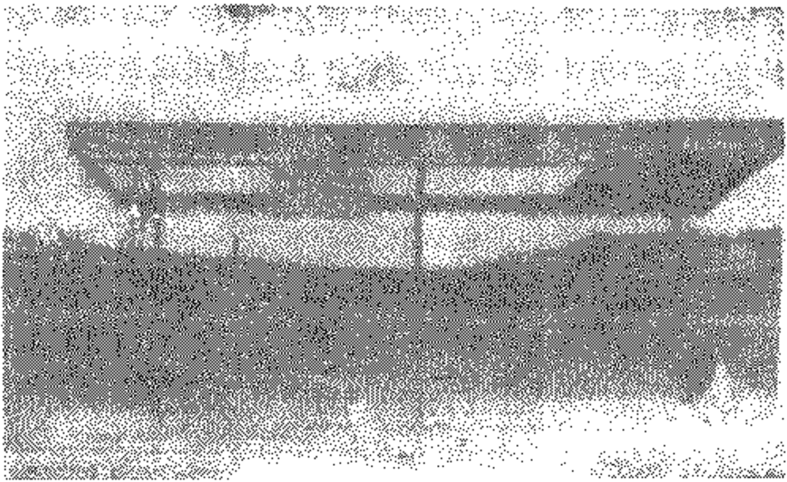

# 第十章 中国干部的水平能排世界第几位

    当官不为民作主，
    不如回家种红薯。
        —— 民谣

## 10.1 第五个现代化的壁障

  “管理者，先管好你自己！这样做，也就减少了管理部
下的必要性。”这是日本著名管理学家土光敏夫的话。

  带着种种心态和复杂感情刚刚向前迈出一步的中国人，
马上就碰到现代管理的壁障。

  美国有位管理学者在一次来华讲学中，善意地批评说：
全世界的政府都重视管理，只有一个例外，这就是中国。

  这位美国学者的话，按他的理解来说是对的，但他不了
解中国的情况。

  其实，不能一般地说我们不重视管理。恰恰相反，中国
人一向是很重视管理的。在井岗山时期我们就“把支部建在
连上”，那不是搞管理的吗？我们建立了世界上最庞大的干部
队伍，这不是搞管理的吗？问题在于，我们重视的只是政治
管理，思想管理，而不是现代意义上所说的科学管理和技术
管理。

  现代科学管理的热潮，是从二次世界大战后掀起的。先
从美国开始，以后陆续被各国政府“抓住不放”。日本人是在
1950年开始抓管理问题，对西方新趋势一向反应迟钝的苏联
人也在60年代中后期开始注意管理问题。此后，管理与科
学、技术一起，成了各国现代化的三鼎足，管理还摆在首
位。

  按照文化传统，中国人是不需要知道什么叫做科学管理
的。有家规国法，有君臣父子就够了，一切都已经给你安排
好。大多数中国人是在1978年以后，才知道有个科学管理问
题。已经落后于世界30年了。

  有人断言：中国如果没有第五个现代化——管理现代
化，“四化”也只是一句空话。现在许多人赞成这种说法。
拉美一些发展中的国家认为，所谓发展中国家，其实
“只是管理落后”的国家。中国目前的情形，大体正是如
此。

  我们的管理，从工厂、机关、团体、学校、到商店和市
场，似乎都有“版本规定”。这个“版本”不是“首长讲话”
就是“红头文件”。一项紧急公文，可以转几个月而无下文，
但往往一个人的一两句话就可以决定一件大事：或者是停办
一项工程，或者是开拍一部电影；或者是停办一个企业：或
者是开办一间大学，或者是决定一项政策。用高级干部的言
论来代替政策、法律，自然谁大谁说了算。结果往往要迫使
大人物出来讲话，而大人物的讲话便愈加变成圣旨了。西方
国家一个领导人，总把自己的话与“国家的话”（法律，政
策）分开，个人的话，可说可改，国家的话不能改。我们相
反，个人的话不能改，国家的话可以随便改。许多事情，无
法可依、有法不依，执法不严，以权代法。一个政府部门的
效率，往往比不上某个大官半句话或者点一下头的效率。一
种完全封闭的管理体制就这样形成。

  这种体制的愚味、落后性，到处可见。例如，价格混
乱，实行管制；工业出口有困难，实行津贴：物资供应紧
缺，实行定额供应。这管制，津贴、定额供应，是战时经济
管理体制的三大法宝，却一直沿用至今。“大乱子”是“控制
住”了，结果是一潭死水。我们的管理不仅没有市场观念，
而且不懂库存技术。越是紧缺物资，库存越多。家家设库，
户户有仓，越缺越存，越存越缺。例如钢材一直紧缺，弄到
不得不加价。但1981年的库存达2,000多万吨，超过年钢产
量的一半，1984年上半年，全国钢材的消耗量只增加了100
多万吨，而库存却增加300多万吨，库存数大大超过生产增
加数。库存增长速度超过生产增长速度，结果是越紧越管，
越管越紧，完全没有流通、回收的概念。1984年我们生产
4377万吨钢材，还进口1000多万吨钢材，加库存2000万吨，
共7000多万吨钢材，但汽车每年50万辆都生产不出来。国
法每年只有2000万吨钢，却生产几百万辆汽车。机电产品积
压的总值达几百个亿，其中5一10%只能报废，必须削价的
占40%。1978年的国民收入不过3000亿元，同年的国营企
业占用的流动资金高达2900亿元，1981年更达3545亿元，
亦接近当年的国民收入。现在我们大搞开发区，天天叫引
进，但对外港口压船问题却又总不得解决，每年要赔款1亿
多美元[^315-1]。在整个国民经济运转中出现如此严重的淤塞和低
效益现象（参看表1.2），再高的发展速度也设有用。我们天
天讲辩证法，却连最简单的加减乘除都不愿去算一下。

  应该承认，我们在管理方面的思想原则有许多是成问题
的。

  我们反复强调过统一指挥问题。西方古典管理学派的理
论中就有一条关于组织管理的统一指挥原则。不同的是，西
方人早就认识到，统一指挥的关键在于：任何人不应受一个
以上的上级的直接指挥，即下属只执行来自一个上级的权力
和决策，就此建立单线联系。我们的情况正相反：重重叠叠
的机构到处设卡，互相冲突的文件不停地往下发。有好分的
猪肉人人插手，有难啃的骨头个个推走。1982年2月4日
《光明日报》读者来信反映，给孩子落户要盖13个公章。其
实，那位读者的困难不过是因为找不到一个关系网，或者不
懂得“一千个公章，抵不得拍下肩膀”的道理。另有一个报
道说，贵州一家铁合金厂跟瑞典一家公司签订一份合资企业
合同，层层报批，盖下70个公章还不算数。结果，他们把盖
公章的工作承包给7名干部，最后加盖270个公章才把事情
办成，有鉴于此，他们于脆成立了一个专跑公章的机构。真
可谓天下奇闻！

  在繁琐、重叠的机构背后，必然会形成克格勃式的相互
制约的人际关系。

[^315-1]: 见《财经问题研究）1985年3期第3页；《未来与发展》1986年2期第
6页；中国科学技术情报所《科技参考资科》737期，1983年8月第4—5页。

  更难理解的是，虽然对内关卡重重，对外的关卡却常常
无一有效。在外贸方面的一连串轰动全国的大事件就因此连
续爆出。1982年广州卷烟二厂因烟叶诈骗案而损失420多万
美元就是一例，案情的荒谬绝伦，达到罕见的地步。我们为
此类事件所交的“学费”已近千万美元之巨！[^316-1]

  多年来我们深受一言堂、家长制管理之害，对此大家表
示深痛恶绝。现在提倡一长负责制，宣传机构又是一片赞歌
声。上面一提倡，下面就歌赞，中国人是历来如此的。其
实，一长负责制不也可以演变成家长制吗？据报纸报道，某
省的一个工厂在两年内撤换了9个厂长，不言自明，其中大
有文章。日本人在决策方面就是搞家长制，搞一言堂的（也
搞终身制和铁饭碗）。我们每个人都要当家长，有些当得好，
有些当得差。若家长制都不好，岂非所有父母都应“辞职”？
可见根本问题不在于家长制还是一长负责制。

  一个国家要求得稳定的发展，应当有一贯的基本国策，
不以人而异，不以时而非。美国人就说，他们换一个总统，
对国家基本政策的影响很少。钟惦斐生前曾批评说，我们时
常以“中心工作”为幌子，大搞“群众运动”，一大群人东一
锄，西一耙，人无定职，职无定规，专搞轰轰烈烈的表面文
章。事实确实如此。一提“尊师”、“敬老”，便敲锣打鼓给学
校老师人人送一张红纸或请喝一碗豆浆，至于他们的学术成
果的整理，生活的窘迫，工作条件的困难，千呼万唤亦无人
理会。社会一出现非常人物或非常事件，便人人趋之若鹭，
“万元户”出了头，搞针头线脑，油盐酱醋的人便如跌落深
渊，无人理睬。

[^316-1]: 《广州对外贸易学院学报》1985年2期第8页

  人人爱作听命虫，只看红头文件办事。文件一来，猛抓
一阵，文件一过，哪怕你墙开瓦裂，没有三几年，不会有人
去理会。许多口号与事实的差别，有如山西大同晋华官矿工
人村前车站的那个《便民风雨亭》，实在是一个很大的讽刺
（见下图10.1）。

（笔者摄于山西大同）

  人们很少认识到，根据某种死计划从一个“中心工作”
跳到另一个“中心工作”这种做法的危险性。从管理学角度
说，“死计划”会使人失去选择的机会，堵住意外发展的通
道，更无法为下一步行动制定原则。

  蒋子龙写“乔厂长”时，写的是靠个人魄力，靠强化劳
动纪律，靠重奖重罚那一套东西。在百废待举的特定历史环
境下，这套东西对无组织、无纪律、无制度的一时混乱局
面，是行之有效的方法，但现在就行不通了。人的需要，比
单纯的物质要求复杂得多，积极性、创造性的发挥比简单的
口号，规章和行政命令所能推动的要艰难得多。乔厂长的三
板斧是不能当作灵丹妙药的。

  在我们的管理思想上，负责人是了不起的人，而不是吃
苦的人；领导很有权力，而不是很有权威，他们把权力留给
自己而把责任推给下属；下级要为上级服务，而不是上级为
下级服务；强调要在生产发展的基础上来提高工资与福利待
遇，而不是强调使生产的发展速度超过工资与福利待遇改善
的速度；我们历来重言教轻身教，老企图用说教使人行动，
而不是用以身作则使人行动；我们认定，统一的口号、统一
的步调、统一的言论是最好的组织状态，而不懂得“开锅般
的沸腾状态”是最佳的组织状态。

  长期以来，我们的企业是由政府部门用行政方法来管理
的，材料由国家调拨，产品由国家包销，盈亏由国家计算，
企业有责无权，行政部门有权无责。什么动力、活力都不见
了。整个系统在低效率中运转。

  现在“承包”被称为了不起的重大改革。这承包制不知
是谁发明，但肯定曹雪芹就已精通。在《红楼梦》“敏探春
兴利除宿弊”一节中就写了探春临时代理王熙凤时，这贾府
三小姐将府中竹园、帮田，花圃分别包给老祝妈等3户人管
理，得了个一举三得之利。“承包户”也满心欢喜。

  解放后，早在农业合作化初期，各种短期包工、季节包
干、常年包工和三包（包干、包产、包财务）一奖（超产
奖）等已得到中央肯定。从1953年到1955年都有过中央文件
认可。1954年，据华北统计局统计，已实行各种包工包产的
社，河北有30%，山西有80%，京郊有58%。[^318-1]

[^318-1]: 《武汉大学学报》1984年5期，期38页

  前几年，在农村实行承包制，确有成效。其实那是过去
把他们束缚得太过分所致。等到承包制推广到城市之后，许
多地方和部门就变成了闹剧。举凡机关、学校、医院、托儿
所、派出所、公安局、文化局、演出公司、出版社，纷纷以
搞承包为时髦。近几年看到一些“新书”，质量之低劣，无以
复加。一了解其原因，乃是用公款为私人出的，出版社只卖
书号，不管销售，保证有钱可赚就行。这就是“承包”的怪
胎，实在是一种罪过！

  其实“承包”是属于“你为我做事，我给你报酬”的一
种低级的被称做“交易型”管理方式的产物。它的最终结果
不过是“付给报酬”，却是很少顾及个人成长方面的精神上的
收获的。不能否认，有许多事情，搞承包是个简单可行的有
效方法，但不值得一般地去大肆鼓吹。例如，在商业企业经
营管理责任制中推行的“独立核算”制，现在看来弊病就不
少。它使管理人员和费用大量增加，内部帐务手续更繁，增
加结算准备金，分散了专用基金，增加了银行贷款，扩大了
派生存款，也迫使商品库存增加和货币投放增加。另外，责
任制与竞争同时提倡的结果必然以各种形式封锁与限制先进
技术的推广应用，特别是引进技术的推广应用。

[^319-1]: 《松下全集》17章，第43页。

  “庙穷和尚富”，这是现在许多新改革政策造成的一个相
当普遍的怪现象。许多地区的国营企业年年亏损，奖金却不
断增长。有些工厂全厂工资上浮，实行高奖、重礼政策，却
要借钱增购设备。低基数承包，高比例分成，滥发奖金，钻
政策的空子，弄虚作假，乱摊成本，偷税漏税，一时“蔚然
成风”。许多地方报道过逃税的例子，讲起来只有一个统计数
字，好象若无其事。日本著名的企业家松下幸之助曾说过：
“逃税比破产更可耻”，指责逃税者为“不尽国民义务的败
类”。[^319-1]在美国，破产只是一时经营不善，同业工会还会保留
其会藉（日本不保留），但逃税者必开除。我们有的干部却连
资本家的品格都不如。

  有一个时期，医务工作者是很苦的。可是一旦“放权”、
“松绑”，千奇百怪的名堂铺天盖地般飞起来。各种药物因滥
发以求提高“营业额”，多分奖金而造成大量浪费不用说了。
（黑龙江医药研究所的哈永年在1987年发表文章，就他的一
个调查作估计，仅中药饮片一项，全国每年多花用19万多公
斤，价值250余万元），有人给“头痛”患者开七日香洗发精，
有人以“六一散”名义给病人开褶骨伞，麦乳精、乐口福、
多维可口乐，甚至连电热毯都成了“药品”，领“药”后还外
加一张“合法报销单”回单位报销。哈尔滨火车站北区候车
室有间药店，你买二三元药，可以领到二三十元的“医疗费
收据”。[^320-1]某大公司的医院辛辛苦苦进得北京正品“乌鸡白风
丸”170盒，开诊后不到两小时竟被一发而光。最妙的是，只
要有熟人，公费医疗证竟是可以“公用”的，只要有一个
证，不仅全家可用，就是三亲六友，左右邻居或同事全可
“借用”。结果许多地方的公费医疗费支出惊人。1985年，全
国公费医疗费人均72元，广东为138元，深圳高达200多元[^320-2]。
这种情况至今并未改变多少。就在笔者写这段文字的时候，
一位在工厂工作的人告诉我，他只要喜欢，每次可到卫生院
领5元钱蜜枣回来享受。相反，一些只有记账关系的知识分
子病号，除了少数“感冒灵”之类的普通药品以外，大多数
真正治病用的药品都要自费。

[^320-1]： 《人民日报》1965年7月28页；《光明日报》1987年4月1日
[^320-2]： 《光明日报》1986年12月4日

  各种管理的弊端与社会不正之风以及人事“关系网”奇
妙地纠结在一起，互相作用，互相“促进”。不正之风在管理
体制的缝隙中高密度凝聚，管理体制的弊端又因不正之风和
“关系网”的存在得以生生不息。对营养不良的中国的改革
者来说，要革除和纠正这些弊端是何等艰难啊！

  西方的现代改革始于本世纪，结果是人们从改革中获得
了大部分的管理权力。它使政府脱离了纯政府的特征，趋向
企业化，限制了个人专断和腐化的发展。我们的情形似乎相
反，许多干部一旦从改革中获得权利，立即便胡混起来。许
多人怀着深怕政策有变的心理，乘机先捞一把。现实与文化
背景之不同，在这里有清楚的体现。

  “第五个现代化”是中国人的一个难越的壁障。

## 10.2 “香山叫好症”

  大名鼎鼎的美籍华人建筑师贝聿铭为北京设计了名噪一
时的“香山饭店”。一年之后，香港1983年1月的一期《时
代》周刊评论说：“虽然才建好一年，墙也裂了，漆也掉了，
地毯也脏了，走廊满布厚尘。一个从事酒店管理的奥国人
说，酒店管理之罪以此为最，六间厕所中四间漏水。你向他
们要资料，他们却向你吐瓜子，真要命！”

  曾四次到中国讲学的美国芝加哥大学经济系主任山·G·
詹森教授在离开香山饭店回国时说：“为什么一个制度可以把
一个国家弄到这个样子？就算是执政者有心破坏也难以弄到
这么糟！”詹森太太在香山饭店建成后不过几个月就见其面目
全非，并为此事问该饭店的中国管理人员究竟是怎么一回
事，那管理者竟然不觉得有什么不妥，有人甚至还自称饭店
办得很好。香港大学的张五常教授在1984年1月20日发表的
一篇文章中称之为“香山并发症”（Fragant Hills Syn-
drom)。

  与“香山”例子“对称”的是钱正英住破房子的一篇报
道。复旦大学编的《新闻大学》一书把这一报道列为“报道
不当”的例子。说会使人误解为部长也要住“危房”。其实，
这也是，“香山并发症”之一：以苦、穷、烂、破为荣，认为
这是“革命传统”，大家长期破破烂烂地生活惯了，个个都是
心甘情愿的。从宾馆大经理到日报小报道员，无不受这种心
理的影响。

  “香山并发症”的最重症状就是叫“好！”因此，不妨称
之为“香山叫好症”。按我们的习惯，只要做了一点点工作，
就要叫好；刚刚喘了一口气，也要叫好；即使搞得一塌糊
涂，还是要叫好。中国人不仅习惯于俯首听命，最怕犯上作
乱，而且在“知足”、“能忍”方面的表现优秀之极。哪怕你
欺负他几十年，只要一句话带过，他便会叫好，如果比过去
增加了一点新东西，更加要叫好。这搞坏了也要叫“好”
很要命，它是一般“叫好症”被“辩证法”加以发挥的结
果。

  前一段时间，由于港台流行歌曲的泛滥和一些西方思潮
的侵入，不仅到处有人写文章论证“社会主义为什么比资本
主义好”，而且有组织地重又大唱《社会主义好》这首歌。结
怎样呢！有多少人是因此解决了思想问题的呢？一般老百
姓是不喜欢只用大道理讲话的，只有行动和事实受欢迎时，
大家才会从心里由衷地叫好。现在一些取得实际成效的地方
例如蛇口之受赞誉就是如此。

  未来的历史学家会发现，“好”是中国现代史上一个异乎
寻常的重要概念。虽然马克思的理论承认，“好”与“不好”
是个实践问题而不是理论问题，但我们却一直企图用概念来
论证这个问题。有人问：“为什么会理论好，实际不好？这不
是理论脱离实际吗？”

  是的，我们的管理者不敢承认不好。原因是很简单的：
一且承认不好就要承担责任，就要采取改善措施，否则就会
受到更大的社会压力。这大概也是全世界的政府都比较倾向
保守的原因。对于无力改进而又不想洗手不干的人，显然只
能用叫“好”来掩盖事实的真相了。

  这种自欺欺人往往与官僚主义作风和国家的政策有关。
这是世界性的灾难。一个典型的例子是，第二次世界大战期
间，德国的情报大量被盟国掌握，但德国情报部却坚决驳斥
那种认为敌人可能破译其密码的推测。他们既不愿花功夫重
创一套密码系统，又害怕希特勒警察国家的高压政策，谁也
不敢承认自己的失误，结果导致了许多战役上的重大失败。
日本的情形也大致一样。相反，一位美国破译人员说：“我们
从未象德国人和日本人那样欺骗过自己。”令人遗撼的是，现
代中国这种不顾事实、粉饰太平的人和事太多了。

  毋庸讳言，我们的政府机构一直是严重缺乏效率
的。

  社会服务质量低劣，工作人员的普遍不满，群众的种种
怨言，实际上反映了政府工作的无力。诸如“禁止乱涨价”，
“禁止滥发奖金”、“禁止破坏生态环境”、“禁止用公款请客
送礼”、“禁止滥印学生复习资料”……之类大大小小的禁
令，年复一年，甚至月复一月地不断颁发；在实行招标制之
前，我们年年强调基本建设单位投资成本一年要降低百分之
几，从来没有兑现过，官样文章却还是照发不误。有令不
行，有禁不止——在这一点上，我们的政府机关很有点象当
年恩格斯批评过的柏林政府：有能力颁布法令而无能力执行
法令。

  “香山叫好症”与过去我们国家和领袖人物的形象被神
化有很大关系。国家的形象是一个庞然大物，个别的领袖则
是主心骨、天才、圣人、火车头、上帝、“教主”、舵手，其余
的人，全是细胞、螺丝钉、小绵羊、阿斗罢了。社会主义大
厦仿佛是上帝手里捏出来的，完满无缺，十全十美，它是绝
对数说不得的。

  不幸的是，我们的不少管理者，也果真只是甘当“细
胞”与“螺丝钉”。一切按长官意志办事，懒于思考，不负责
任，没有主动精神和创造性思想，更不敢质疑，提问。

  《论语·为政》记袁公问孔子：“何为则民服？”孔子答：
“举直错诸枉，则民服：举枉错诸直，则民不服。”美国著名
强人亚科卡更有豪言：“我总是努力物色有强烈进取心的人。
不需要很多，只要有25名这样的人，我就可以管理美国政府
了。”正直，有进取心，这是当干部的基本条件。管理者竟然
无知到不能判别好坏，或者强作不知好坏，只知大声赞好。
此种心态不改变，是没有希望可谈的。

  与“叫好”原则成孪生姐妹的是一种可怕的高压式管理
政策。这是中国政治文化的一个重要传统。

  西方的管理政策，强调以严密分析为基础的科学管理原
则，“管理”概念的核心，只是一种科学的组织方法。所以著
名的“泰罗制”在西方出现不是偶然的。

  中国的管理政策，强调以绝对唯命是从为基础的经验管
理原则，“管理”概念的核心，是一种宗法式的压制方法。所
以中国历代管理者的管、卡、压花样特别多。

  老子有句名言说：“治大国如煎小鱼。”西方还有管理学者
认为，三千年来的管理学思想“无出其右”。这“煎小鱼”之
说，确实活灵活现地表述了中国管理技术的精髓。管、卡、
压传统大概就是从这里发展出来的。在文革期间，“四人帮”
打着“反对管、卡、压”的旗号，却把高压“管理”政策发
展到恐怖和残忍的地步。

  长期以来，事不论大小，领导说是“自愿”的，大家不
敢不“自愿”，说是要“自觉”的，大家不敢不“自觉”：甚
至说是可以“自由”参加的，许多人还不敢不“自由”。有什
么怨言更不敢说了。

  近日看到关于苏联“乌兹别克黑手党”的一则报道。在
他们那里，勋章、别墅、党证、主席团座位和墓地穴位、官
职或代表委任状，全成了商品。更奇怪的是，当地几十万人
知道这些丑事，但全都不吭声。有的集体农庄半年不发工资，
无人敢发怨言。我们的干部就没有这一套么？上至大主任，
下至小校长，常常权倾一方。在刚刚结束的中学教师职称评
定工作中，有些地区符合条件面没有被评上的教师合议着一
起向有关领导提意见。结果被认为“闹事”。好几间学校的校
领导，同时在大会上公开讲：“谁敢闹！谁闹就不给谁，有名
额也不给，以后也不给，看你怎样闹！”

  可怜，中学教师能闹什么呢？他们什么时候闹过什么
呢？那些话，却是活灵活现地反映了管理者的愚昧、落后、
野蛮，可怕的家长统治式的封建专制意识。

  “管理者”、“负责人”在西方的观念中就是吃苦的人，
在中国的观念中却是了不起的人，西方强调组织形式方面的
科学管理，中国强调政治思想方面的统一管制。其结果，西
方人形成一种便于发挥个人作用的气氛和环境，使他们习惯
于积极地发展个人的创造才能。中国却形成一个便于干部高
高在上、君临一切的气氛和环境，而一般人只习惯于消极地
等待指示，命令，行为便不得不处于被动状态。

  在管理上，中国干部的基本观念与方法，如果没有一个
根本性的深刻变草，现代化是没有希望的。

## 10.3 “群魔”乱割唐僧肉

  美国学者E·沃格尔不久前指出，中国面临的一个首要
问题是缺乏有经验的领导干部和技术骨干。新毕业的大学生
对原有的技术骨干造成一种威胁，这使他们的合作不会顺
利。[^326-1]这个意见，很值得注意。最近有人重新评价历史上享
有盛誉的诸葛亮，说他战略失策，任人唯亲，嫉贤妒能，参
与迫害有才干的文臣武将，德薄，才平，过大于功。不知这
反“定评”的新见是否能被大家接受，不过，若拿来评论我
们的某些干部，倒是贴切的。

[^326-1]: 见《国外社会科学》1985年9期，第41页。

  中国干部总的水平，不知能排世界第几位，很可能象教育
水平那样要倒数来算。我们的不少干部有“三化”病，即：
思想僵化、知识老化、技术硬化。可怕的是，他们中不少人
还带着一根斩不断的专制主义的脐带，在新的社会条件下，
又繁育了某些新的不良因素。面对时代的新挑战，他们缺乏
自信，看不到通过学习与实践改变自己的知识结构，增长才
干的可能性；干起事情来，胆子却又大得惊人。只要有利可
图便肆无忌惮，不择手段，弄虚作假，贪赃枉法。县纪委带
头经商，支书组织卖假药，书记妙买炒卖国家外汇，主任倒
买倒卖国家紧缺物资，经理靠涨价，放款、发彩券发横财。
局长任意挥霍公家财物，厂长突击为自己提工资而置企业月
月亏本于不顾，向税务人员行贿送礼、越权乱开减免税口子。
1987年5月1日《光明日报》报道，占全国财政收入90%以上
的税收，每年查出的漏税金额上百亿元。厦门电视机案，海
南倒卖汽车案与广州、四川的烟案，使全国为之震惊。所谓
“你有政策，我有对策”。简直是“群魔”乱割唐僧肉。一时
间，社会上流行许多“新民谣”：“工人干活，干部拿钱”；
“‘主人’劳动，‘公仆’发财”；“承包承包，领导先捞”；“工
人按劳分配，干部按需分配”。杨纪柯在1984年的一次讲话中
提到，湖北有些县的农民抱怨化肥分配的不正之风严重。他
们说：“这叫什么化肥！这叫干部肥、后门肥，关系肥！反正
我们买不到平价肥。”[^327-1]这种情况在全国并非个别。

[^327-1]: 见《安徽教育学院学报》1984年1期，第2页。

  30多年来没完没了的政治运动，“磨炼”出了一批“说话
三六九，行事风马牛”的干部败类。浮夸风、共产风、瞎指
挥、急跃进，穷过渡，无不与此有关。且至今遗风犹在。一
号召要重视科学技术，便到处宣扬本地区、本系统、本单位
科学技术的“新成就”；一说要重视教育，又连篇累牍报道如
何如何抓了教育。但据1987年国家审计署的公报，1985一
1986年仅对2,700多个县以上的教育主管部门的审核，查出被
挪用、占用的普教经费，竟高达5亿多元，占审计总额5%
（1984年还达9.%1）成了违纪金额中的主要项目。被占用
的钱用来建干部宿舍、招待所、办公楼、买小汽车、经商办
厂。一个省级教育厅占用100万元盖“服务中心大楼”做生
意；一个县教育局更把40万元转入工商银行信托部吃利息，
而置全县二万多平方米的学校危房于不顾。[^328-1]为此，民进中
央几位领导发表谈话，要求对查出的问题不能搞下不为例，
要追究责任，限期清退。却又哪里有下文了？还有，中央提
出翻两番的目标，湖南桃江县便有7个乡吹嘘“农业产值四
年翻番”，后来经《人民日报》揭露，才被取消了“翻番乡”
的称号。整党数年，少见成效。不少地方，确如有人批评
的：几个报告一做，几次声势一造，几块牌子一换，几个官
儿一封，整党即告“完成”，改革也就“成功”。不少人是专做
表面文章的老手，官腔官话十足。如果有人想了解什么是中
国式的官腔，不妨一阅《广东高教电教通讯》1985年第一期
发表教育部电教局某局长谈电教工作中“存在的五个主要问
题”的讲话。全文如下：

    一、虽然……但是，……
    二、虽然……，但，……
    三、虽然……，但……
    四、…… ……，但……
    五、虽然………，但是……

  全文不长，“虽然”讲问题，“但是”唱赞歌，结构就是如
此。这篇东西，值得列入中国现代文献史。

[^328-1]: 《光明日报》1987年6月2日，6月11日。

  在我们的某些干部那里，事实不过是块“七巧板”，可以
随意地拼过来拼过去，到头来一样升官发财。

  解放前的工人在对付工头与老板时，有一种叫“糊弄洋
鬼子”的方法。解放后，在一片纯正、朴实、热烈的民风
中，这种“方法”早已消声匿迹。却不料后来会以广泛得多
的形式出现于种种不愿干又非干不可的事情之中。这显然是
一场接一场的政治运动，使人失掉信念，失去心理乎衡，产
生迷惘、怀疑、失望的结果。中国各种类型的干部、参谋、
助手、秘书许多都曾自愿地或被迫地使用过这种方法。至于情
报所、政策研究室，组织与人事部门，宣传机构，搞“糊弄”
的，也许比任何其他部门都多。这些部门为了迎合领导意图，
“紧跟”形势，不惜提供大量盛假的数据、明知无效的“对
策”、有意编造的“调查报告”和歪曲事实的报道。有一位省
级情报所的老工程师对笔者说：“说实话，我们所谁的抽柜里
没有一堆过时的旧数据？15天要你报未来15年的‘发展规
划’，有什么办法呢！”

  是的，人事部门搞调查，要你三天内填写“有偷渡思想
的人数”；卫生部门搞运动，要你宣传“不准苍蝇过八一”。如
果不“糊弄”，你有什么办法呢！领导长期高兴听喜不听忧，
喜欢自我陶醉，甘心满足于明知的虚假。

[^329-1]: 见《松辽学刊》1985年2期

  与“糊弄洋鬼子”“对称”的自然是愚民政策。最近有人
认为《论语》注释中的“民可使由之，不可使知之”是历来被注
家断错了。应该断为“民可使，由之，不可使，知之”。即民众
者被役使，就任其行动，若不可被役使，就教育他们。[^329-1]这
与孔子“智民”“教民”“诲人”的教育思想一致。果真如此，可
是冤枉之极了。“愚民”者，历来是被指责为孔老二的门徒的。

  不久前，有位著名的数学教授对笔者说：我们的干部不
知道加法与乘法的分别。若几个数相加，其中一个数很小，
对整体影响并不大；乘法就不同了，几个数相乘，只要有一
个数很小，所得乘积就大为减少。我们的群众是用乘法来看
干部的。你做了10件好事，只要有1件是假的、错的，群众
就会对其余9件事打上问号。外国人评论中国，常常以一概
全，他们用的也是乘法。

  说话“假、大、空”是最令群众厌恶的干部通病之一。
“喊破嗓子，不如做出样子”，这样简单的警语，许多干部似
乎是忘记了。

## 10.4 干部现在怎样做父亲

  鲁迅有篇著名的文章：《我们现在怎样做父亲》。他强调父
亲对子女要“健全的产生，尽力的教育，完全的解放”。特别
是后者，鲁迅要求“义务思想须加多，而权利思想却大可切
实核减”。

  如果我们问：干部现在怎样做父亲？答案可能会便鲁迅
在天之灵感到哀痛。每当有机会升学、招工、分房、出国镀
金时，有多少父母是在为子女“加多”义务的！或明修栈
道，暗渡陈仓；或颐指气使，了无忌惮。一般地说，只要
“父亲”当了个煤霸，电霸，车霸，水霸，房霸或什么的，
那便天下三分明月夜，二分明月在他家。这父亲就好做之极
了。1987年5月7日晚，当黑龙江森林大火正在吞没整个漠
河县城之际，县消防科副科长竟敢置全县百姓生死于不顾，把
全县仅有的5辆消防车中的3辆调去保护自己的家！平时，
这位干部怎样做父亲，怎样当“一家之主”，不是显而易见么？！

  如果要在现实生活中找寻鲁迅所说的“自己背着因袭的
重担，肩住黑暗的闸门，放他们到宽阔光明的地方去”的父
亲，虽不能说绝无，却实在少见。

  清代纪昀有首“一字诗”，是为乾隆出游吸秋江景色而
作。诗说：“一蒿一橹一渔舟，一个艄头一钓钩，一拍一呼还
一笑，一人独占一江秋。”此诗在十年浩劫中曾大受挞伐。大
概是赶巧无意中刺中了我们许多干部的痛处。

  这样“做父亲”，必须靠权势。我们的一些干部是靠“位
能”来工作，而不是靠动能来工作的。他们很象打着普渡众
生旗号、鼠窃齐天大圣之功而登殿入莲座的唐僧，最大的能
力不过是口念观世音的紧箍咒罢了。对这类干部来说，最重要
的就是一个“权”字。

[^331-1]: 格式法则原指“劣币驱逐良币”的经济现象。如两种铸币面值相同，却
由价值不同的金属铸造，则价值低的货币会使价值高的货币退出流通领域，此
法则在16世纪时已知道，后来却错误地归功于19世纪伦敦皇家交易所创始人格
氏。这里，萨氏提借用。见《水浒传与中国社会》，台湾三民书局。1986年湖
南岳麓书社有翻印本。

  理论上争权，这在中国是有历史根源的。秦汉时期，中
国的官职甚少。至东汉以后，随各朝文化的发达，人口增
加、知识阶层扩大，官职就逐渐多起来。中国知识阶层既以
治国平天下为己任，就必须争个官来做。但由于士多官少，
自然结党为朋、依附权势、争权夺利。值得注意的是，台湾
学者萨孟武以历史上的“党争”为例指出，在中国官僚争权夺
利的斗争中，君子常被小人打倒，这叫做政治上的格勒善法
则（Gresham's Law），[^331-1]因为君子有所忌，而小人则不择
手段。明代焦芳、李宪、张彩之攀附刘瑾，曹钦程、黄运泰
之拜倒魏忠贤，均极尽奴颜婢色之事。这些人都是进士出
身，却不是君子所肯为。知此一端，便可见中国官僚史中权
势之争的特殊性。我们有“人民公仆”一说，因而不允许人
们谈论干部的“权力”之争。但事实上，权力之争在无声的
战场上日夕激烈进行着。电视剧《花园街五号》的揭示不过
是承认了“半个悲剧”而已。

  既然当了“父亲”，为什么还要强化自己的权力呢？其中
一个秘密就是有权可以整人，而只有整人自己才会得势。越
是“无情打击”越可积紧政治资本。整人成了以枚谋私的必
然中介。

  不可否认，30多年来无休止的政治运动培养起了一批专
靠整人起家而青云直上，手中权杖浸透了无辜者血泪的干
部。有一位老干部说得好：“整人算什么本领？你有权，要整
人还不易？整完之后怎么办了？"这句话最简单不过，可惜几
十年来真正懂得这句话的不多。更有甚者，“整人”已经网络
化。《讽刺与幽默》报上曾发表一幅漫画：秦香莲告陈士美的
状子，落到了陈士美的手里。有些干部确实不可一世，以言
代法，一言废法。之所以如此，依仗的就是他长期精心编织
起来的权力网络上的无数结点，保证无辜者逃不出他的手
心。

  值得注意的是，干部的权力欲，并非已是过去的梦。现
在搞党政分工，搞股份试点，把党委领导下的厂长负责制改
为董事会领导下的厂长负责制，结果，一些党委书记一夜之间
又成了“董事长”，变成权势更大的第一把手，现在搞政企分
开，许多行政性专业公司在这边被“撤销”了，在那边又以
“联合股份有限公司”的名义挂起更大的招牌，有不肯“联
合”的非行政公司，整不下者便施加“优惠政策”实行诱
迫：“增拨新产品开发费”，“免交调节税”，“可以超比例提取
留成和奖金”，结果一一并入他的行政公司，然后，行政公司
变成“国营公司”，“婆媳”关系变成“母女”关系。明代的
江西道御史崔呈秀捧大奸魏忠贤，送去五彩大袖蟒衣贺其生
日。魏问“为何衣袖会如此大？”崔答：“袖大些愿殿爷好装权
柄。”现在我们有些干部，最喜欢的是送他牌子，越大越多越
妙。因为有牌子就有人、有钱、有权、有势。如果不信，可随
便到一些办公大楼或大院门口看一下，排满牌子的比比皆是。
“我们是一个班子，两块牌子”现在成了非常吃香的一句话。

  过去有人问：据说我们的干部是人民的公仆，与昔日的
“父母官”早已不可同日而语。怎的不但未见以甘为人民吃
亏的精神自励，不见以党、国、民的利益为重，不见为民办
事，为民请命，反倒拉裙结带，营私舞弊，压制百姓起来？！
意识形态与事实的分离，应该说是当前全社会都已深切感受
到了的一种难解的痛苦。

  依附权势必然跟拍马屁结亲家。

  十年动乱结束后，我们有一个大快人心的清除“三种
人”的行动。

  著名作家廖沫沙对中央所指的“三种人”颇有研究。他
还特别提到，可能出现未来的“三种人”，他们必定要靠拍马
屁起家的，并且“介绍”了他们的拍马屁的方法：阿谀、逢
迎与奉承。各有典例。

  阿谀法大概以日本福富织部《屁书》中《屁颂》所说的
故事为最妙。故事说一文士死见冥王，王忽撒一屁，士即拱
揖进词三：“伏惟大王，高耸尊臀，洪宣宝屁，依稀丝竹之
音，仿佛兰麝之气。”王大喜，赐以御宴。

  中国古代的马屁精也是很绝的。《汉书·陈万年传》就可
为廖先生补充一个例子。陈万年为拍马屁，千般丑态，百般
逢迎，甚至不借倾家荡产。直到大病不起时，还不忘教儿子
如何去拍马屁。这比日本人的例子要实际得多。

  历史上，隋朝有个拍马屁大王赵元楷，隋炀帝南巡，一
路耗费无度就与这类人有关。唐太宗幸能识穿此辈佞人。他
感概地说：“朕观前代谗佞之徒，皆国之蟊贼也。或巧言令
色，朋党比周；若暗主庸君，莫不以之迷惑，忠臣孝子所以
泣血衔冤。故丛兰欲茂，秋风败之，王者欲明，谗人蔽之。
此事著于史籍，不能具道……”[^334-1]

  权势者与马屁精结合的结果，使我们的一些部门、单位
有如一个在地上滚动的鸡蛋。核心成员与一股群众的关系，
有如蛋黄与蛋清的关系：貌合神离。蛋黄是结成一块的，一
起从一边滚到另一边，蛋清则转过来转过去，被搞得松松散
散。不过，最经不起滚动而先行破裂的是蛋黄，而不是蛋
清。这个事实是够残酷的。

  在1985年第9期《中国青年》杂志上，发表了当年一次
关于领导者与专门人才相互关系的抽样调查。结果见下表
10.1。

  可以认为，这已经是自1957年以来的最佳情况了。但离
上下紧密合作的距离还远得很。

[^334-1]: 转自《人民文学》1981年第2期，第110页。

表10.1

----------------------------    -----------------------
项 目                             所占比侧（%）
----------------------------    -----------------------
彼此肝胆相照者                        2.43
把人看作依赖对象者                   25.47
认为人才可用不可信者                  15.26
对领导敏而远之者                     4.2
“有事有人，无事无人”者                42.34
把人看作团结教育改造对象者           3.98
----------------------------    -----------------------

  什么叫做“健康”，医学界至今有争议，不过肯定不会同
意通常所说“没有生病就是健康”的说法。世界保健大宪章
（WHO）目前所采用的健康定义是：“不单关乎疾病和虚
弱，还包括身心的健康和对社会上的良好表现”。我们的一些
干部，似乎总是心境不愉快的人。按“大宪章”的定义，那
是一种病态。他们似乎天生的爱挑剔、爱发脾气、爱摆架
子，毫无激情，没有基本信念，常常失信于人。

  明代的功臣刘伯温在他的《诚意伯刘文成公文集》
中写了一个《卖柑者言》的故事，专门讽刺官老爷们的虚假
丑恶现象。

  故事说一个卖柑者用一种技术贮存柑子，使柑子外表光
彩鲜亮而晶莹，然后以10倍的高价出售，大家还争相抢购。
但把柑子打开，却是一股烟粉味扑出，里面象破棉絮一样。
为此，刘氏质问卖柑者，说他只知用虚假的外表来骗傻瓜，
欺人太甚。不料，却引出卖柑者的一段议论来。这议论，精
妙无比，在研究当代中国干部中的不正之风与官僚主义时，
值得一读：

  卖者笑日：“……世之为欺者不寡矣，而独我也乎？吾子
未之思也。今夫佩虎符、坐皋比者，洸洸干城之具也，果能
授孙吴之略耶？峨大冠、拖长绅者，昂昂乎庙堂之器也；果
能逮伊皋之业耶？盗起而不知御，民困而不知救，吏奸而不
知禁，法致而不知理，坐糜廪而不知耻。观其坐高堂、骑
大马，醉醇醲而肥鲜者，孰不巍巍乎可畏，赫赫乎可象
也？又何往而不金玉其外，败絮其中也哉？”

  卖柑者言足可引为对当今干部的“醒世恒言”！

