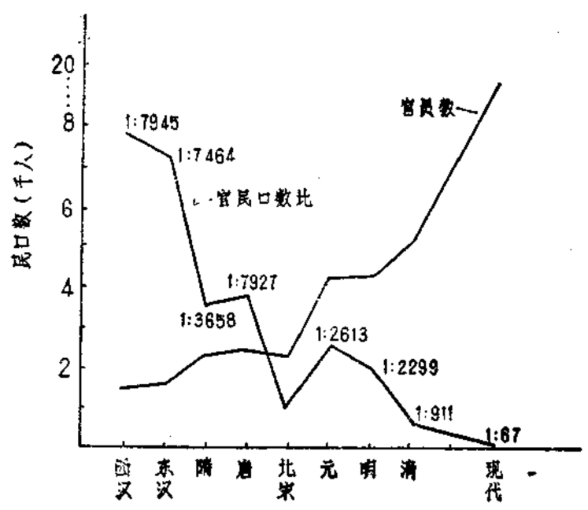
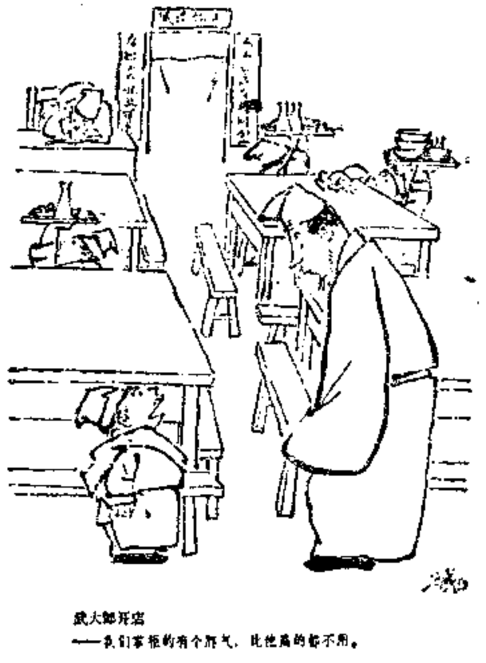
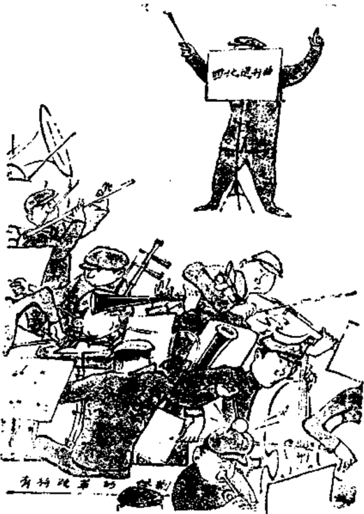

# 第十一章 一个“黑洞”

        一个金字塔式的权威结
    构把权力集中在几个人手
    里，这种社会布局在过去和
    现在都适合于解决常规的任
    务。然而环境已起了变化，
    变化的方式正好使这种机构
    最容易产生问题。因为稳定
    性已经消失了。
        在未来的25到50年间，
    我们都将加入为官僚主义送
    葬的行列。
         —— [美] 沃伦·本尼斯

## 11.1 官冗之患

  由于干部问题事关至要，我们还要详细地研究一下中国
封建社会历代遗传的一个赘瘤——官冗之患。

  元人张养浩在《三事忠告》中说：“人徒知治民之难，而
不知治吏为尤难。”此语实为至理。

  古代中国封建专制皇权，有一个基本的支撑点，就是由
官僚体制组成的监控网。这是导致官冗之患产生的主要原
因。

  秦始皇有一个极要命的遗产，那就是分天下为三十六郡
（后增为四十郡），实行郡、县、乡、亭制。到汉代便有“十
里一亭”、“十亭一乡”的建制，并在郡上设州，组成了一个
严密的封建监控网。后来，以拓跋氏为中心的北魏，仿效晋
朝官制，设置镇制，更改镇为州，或州镇并存。[^338-1]发展了这
种监控网。

  顾炎武在《日知录》中，对这种以皇权为中心的监控网
关系作了深入的研究。他在论及改革时更指出，由秦始皇开
创的郡县制，成了各级地方官僚横行霸道的保证，其弊极
大，是为“民生之所以日贫，中国之所以日弱而益趋于乱”
的根本原因。

[^338-1]: 日本学者直江直子对此颇有研究。见《山西师大学报》1986年3月。

  为了构建这个监控网，官员的委任逾制超额，官署的设
置叠床架屋。从汉代开始，设有县令、长、丞、尉、公卿，
大夫，均为正式官衔，称为“长吏”或“大吏”。以下是胥
吏，或“吏胥”、“小吏”，虽不是正式官员，却人员庞杂，职
称繁多。《汉书·百官表》中记有：“大率十里一亭，亭有长，
十亭一乡，乡有三老，掌教化；啬夫，听讼，收赋税；游
缴，缴循，禁盗”。《周礼》又记：“地官自州长以下有党正、
族师、闾胥、比长。自县正以下有啬师、郓长、里宰、乡
长。”此外还有流外官、员外官、试官和不领职事的勋官、散
官等官爵。用以优待功臣故老、宗室贵胄，推行“恩荫”制
度。先秦时代虽然号称“百官”，但按杨雄所记，不过二十五
种。隋唐之后，“百官”之说便名副其实了。到了宋朝，本来
是为官择人的，竟变成为人设官。推行官在员多，不在得人
政策。按照洪亮吉、游百川等人的估计，18世纪的中国，一
个县的胥吏在200至1000人之间，到19世纪就增至三、四百
到二、三千人之间。这情况，竟连咸丰帝也感到惊讶。他在
1851年的一个批注中写道：“直隶、河南等省白役，一州一县
何至盈千累百之多？”

  封建官僚队伍的不断扩大，不论从官员绝对数量的增
长，或从官民比例的缩小均可看出。不久前卢明明和郭建研
究过这种情况。西汉有近6,000万人口，官僚骨干队伍（不含
非正式官员的吏员）不过7,500人；到明初，统治的人口数几
乎相同，官僚骨干队伍却比前者扩大2.29倍。清初，官僚骨
干队伍已发展到2.7万余人，为西汉的3.6倍，而其统治的人
口却只及西汉的40%多一点。宋朝开国时，官僚骨干队伍人
数只有1.3万，仁宗时为2万，哲宗时已达2.8万；明朝开国
时的官僚骨干人数是2.4万，宪宗时增至10万，世宗时竟逾
12万人。这就是官冗之患。

  下表是一个有价值的资料，可以加一个表名（见表
11.1)

表11.1 冗官——中国封建社会的一个赘瘤

-----  -----  -----------  -----------  -----------  -----------  -----------
朝号    庙号   官员数（个）  民口数（个）  民户数       官民口数比    官民户数比
-----  -----  -----------  -----------  -----------  -----------  -----------
西汉              7,500     59,587,473   12,225,562    1:7946      1:1630
东汉              7,567     53,479,282   10,670,393    1:7461      1:1410
隋               12,756     46,007,380    8,894,924    1:3658      1:707
唐      高宗     13,465      5,288(万)    3,780,535     1:3927      1:281
北宋    太祖     13,000      1,628(万)    2,575,065     1:1252      1:198
元      成宗     22,500     58,812,211   13,173,706     1:2613      1:585
明      太祖     24,683     60,521,129   10,628,187    1:2299       1:432
清      圣祖     27,000     24,594,324                  1:911
-----  -----  -----------  -----------  -----------  -----------  -----------

来源：《江准论坛》1982年2月，第106页。其中，唐，北宋人口数空缺，本表以湖南
《社会科学情报》1984年第11期上的资料补入，相应的官民口数比亦依此计算。

  官冗之患，为害极大。国家财政开支增加，赋税来源因
封赐而减少自不必说。官吏的管理就是一大难题。前引元人
张养浩在《三事忠告》中概叹“治吏为尤难”是深有所感而
发的。

  王安石曾向仁宗皇帝提出“饶之以财”、“约之以礼”和
“裁之以法”的治吏之道。实际执行却不是那么简单。古有
“圣臣、大臣、忠臣、智臣、贞臣、直臣”所谓“六正”之
分，也有“具臣、谀臣、奸臣、谗臣、贼臣、亡国之臣”的
“六邪”之说。忠臣逆贼同出于官，难治得很。国家兴亡就
与此“六邪”关系极大。

  其中，又以皇亲国戚与宦官为最。唐代杨国忠，明代魏
忠贤就极著名。他们“手握王爵，口含天宪”，篡权窃柄，干
预政事，僭夺皇权，废立皇位，制造政治动乱，残杀忠良，
荼毒百姓，祸国殃民。实为无恶不作。

  对中国历代宦官之专权乱政，史家向无好感。原因多以
为出于昏君，其实不然。汉末至唐初四百年间，昏君不少，
宦官之祸却不见，而宦官专权之时，昏君反少。且秦代赵
高、汉代弘恭，石显等已记入史册，却未成后戒。这是为什
么？唯一的解释是出于专制集权导致的腐败。只有皇权至高
无上时才会有奴才权重的现象出现。春秋时权力分散在卿大
夫手中，连国君权力也有限，奴才便不会成气候。

  历代统治者中有不少人研究过治吏问题。明太祖曾写
《臣戒录》，明宣宗又有《官箴》。清世祖对此也颇有研究，他
在《人臣儆心录》中对在今奸臣恶迹作了分析，并开列了八个
篇目：植党、好名、营私、徇利、骄志、作伪、附势、旷
官。此外，在《中国丛书综录》中“史部·政书类·职官之
属·官箴”项下，收入著作69种，大都与治吏有关。

  治吏问题似乎从未解决过，历代官吏之腐败是最好的证
明。官吏腐败之事，历代成灾。帝王猜疑寡恩，小人紊乱朝
纲，妒贤忌能，官僚宗派门户纷争，在中国历史上不绝如
缕。从乡官到宰相，绝大多数人行为凶恶、险毒、猜忌、攘
夺、虚伪、奢侈、酗酒、荒淫、贪污、吝啬、颓废、放荡。
他们贪赃枉法，贿赂公行，假公济私，尔虞我诈，搜刮民
财，吹牛拍马，卖官卖法，偷国库，扣军饷，横征暴敛，敲诈勒
索，侵田霸地，明抢暗夺，蚕食国家，鱼肉百姓。可谓有法
皆枉，无处不贪，几与盗贼无异。官场中的“打点”、“规
礼”、“照应”以及种种杂派、杂费，不可胜数。明代有本
《虞谐志》，所列公差杂费就有：索路费、索纸包、酒钱、饭
钱、买差钱、雇役钱、门子掣签钱、吏房销名钱、粮房嵌数
钱、数书还库钱、经催常例钱、府厅解比钱、内衙公费钱，
不下十几种。《后汉书》卷34《梁翼传》记东汉权臣梁翼身败
后查抄家产“合三十余万万，以充王府，因减天下税租之
半”，清代军机大臣和坤被嘉庆赐死后，抄出财产不下白银8
亿两，几乎相当于清朝20年的财政收入，25年的财政支出，
60多年的财政盈余。时有“和坤跌倒，嘉庆吃饱”之说。《魏
书》卷19有北魏吏部尚书脩义传提到：“及在铨衡，唯事货
贿，授官大小，皆有定价。”史书中所记的这些例子，千不及
一。王亚南曾愤然说：“中国一部二十四史，实是贪污史。”[^342-1]

  萨孟武甚至指出，贪污是古代中国当官的原则。因为
古代官俸微薄，主要是靠权势。如果做官之后，仍然两袖清
风，势必被骂为蠢材。反之，若能置田买地，盖屋起楼，三
妻六妾，便会被认为“能干”，无官也还有权势在。

  明代的贪污特盛还跟明太祖推行的“地方官回避”制有
关。明以前的地方官有“南人选南，北人选北”制度。明太
祖却认为是“开请托之门，而启受财之径。”于是规定“南人
选北，北人选南”，且任期特短。结果，适得其反。地方官成
了临时傀儡，大权旁落滑胥之手，对人民为害更深。

  明代官场还有一种老夫习气更为奇特。士大未拼命挤身
统治集团，既不负十年寒窗苦，又可骑人头上，光宗耀祖。
可是一旦达到目的，又惊心于法网森严，深感“仕途艰险”，
常会出现“急流勇退”的矛盾心理。当时官僚之间，彼此常
以“老”相称。如称内阁大学士为“阁老”，各级官僚间，哪
怕是20几岁的新进青年，也彼此称“老”。甚至不足40岁的人
亦以“老夫”自称。一入仕途，立即称老，造成一个满朝皆老
的气氛。人人盼早日告老还乡，反可以“国之元老”的缙绅
豪门身份，凌驾于地方的府尹，县令之上，独霸一方，形成
一个豪绅统治阶层。这又加重了官冗之患。

[^342-1]: 《中国官僚政治研究》，中国社会科学出版社，1981年，第117页。

  贪污腐败使官吏间形成一种相互影响和制约的整体性风
气。清人薛福成说：“非其时人性独贪也，盖有在内隐为驱
迫，使不得不贪者也”。贪污需要权，有权又可以贪污，权力
要舞弊枉法才有污可贪，舞弊枉法又需昏庸无能作配合，昏
庸无能则必有更大的贪污出现。这又是一个恶性循环，是中
国封建官僚集团的一种独特的经济生态现象。官吏昏庸，以
宋代至为典型。宋代官僚多半不知廉耻，诬之不怒，弹之不
耻，贬之不去，逐之不走。所谓“笑骂由你笑骂，好官我自
为之”，以堂堂宰相为例：李肪从不伤人害物，每日焚香沐
浴，口颂御诗；李沆对任何事情从不表态，号称“没嘴葫
芦”；吕大防更甚，终日端坐不言，号称“铁哈蜊”；王珪只管
转取圣旨，号称“三旨相公”；富弼更是“一向畏事，只是要
看经念佛”，丁谓之流为迎合真宗佞道心理，终日只知装神弄
鬼，张口符端，闭口吉样，指乌鸦为仙鹤，目甲虫为金龟，
人称“鹤相”[^343-1]宰相尚且如此，其他可想而知。

  在这个恶性循环中，权力交易是其核心。对皇帝来说，
一般只要求忠君，不关心清廉。“十恶”之罪，历代不同，但
均以“谋反”为首，而无贪赂一项。甚至还有皇帝喜欢贪官
的，刘邦与梁武帝就可为例。其实封建官吏的俸银、禄米，
赏赐、职田与其贪污、纳略、勒索等并无本质区别。唐玄宗
曾将全国一年内的贡品全数赏给宠臣李林甫，连以廉洁正直
著名的诸葛亮也有田1500亩，岳飞被害时亦有田1800亩。都
是例证。

[^343-1]: 参看《河北师大学报》1980年2月，第89页。

  法国素负盛名的孟德斯鸠在《论法的精神》一书中，曾
谈到中国皇帝的专制问题。并且说：“在我们……的历史上，
都只有内战而没有革命，但在专制的国家，却只有革命而没
有内战”。正如黑格尔对孔子诸多误解一样，许多外国学者，
即使是大名家，每谈到中国问题时，常常只是貌似深刻，其
实却是一知半解的。西汉有“七国之乱”，西晋有“八王之
乱”，唐代有“安史之乱”，明代有“靖难之役”，清代有“三藩
之乱”，都很著名。其余，种种宫廷政变、内战、不计其数。
皇朝开国后在皇位继承权上就往往内乱不绝。太宗杀兄屠
弟；太宗诸子争立太子：武则天篡唐；李隆基杀武三思；中
宗、韦后杀李重俊；李隆基与太平公至杀韦后：李隆基又杀
太平公主。内乱之害，还能算少么？内乱其实是君主集权和
腐败的产物，是不可能没有的。

  无论是政治腐败还是贪污腐化都是封建集权的必然结
果。集权产生腐败，腐败促成内乱，内乱又催动集权。这是
又一个恶性循环。每当这个恶性循环发展到极限时，就会触
动一场大规模的农民战争的爆发，使中国封建社会陷入一个
又一个周期性危机之中，整个封建社会的进程便一次次地被
打断。（我们将在另外篇章中详细讨论这个问题）。

  官冗结网成患，并不那么简单。其实中国社会一向受两张
网控制：封建官僚行政网和宗法家族网，如果一定要说第三
个，那就是儒家精神网。这三张网是纠结在一起的，其中的
一些传统遗传到今日，仍可以在例如“政企分离”政策执行
之困难中看得出来。

  目前中国的“公司”多如牛毛，真站得住脚能成大气
候、大发展的，基本上都是一些官办公司。所有那些不依附
任何行政权力的“独立”公司，都被人蒙上一层不可靠的、
非正式的迷雾，除了一手交一手的买卖，无人敢信任。

  不过，如果“非行政”公司的经理是权贵亲属，情况就
完全不同了，甚至比行政公司更吃香。行政网与宗法家族
网，就这样缠在一起。

## 11.2 宋-帕金森定律

  传统久远的官冗问题，还有更使人感到惊异的现实发展。
如果我们说，“官冗”是封建君主专制政体的派生物，若不消
灭其原因，便无法消灭其结果，这还是可以理解的。那么，
对今天的类似于“官冗”的现象就难以说明了。

[^345-1]: 见《未来与发展》1955年4月，第31期。

[^345-2]: 注意：历史上，从西方的第一批职业科学家——古希腊阿历山大博物馆
的学者到中国清朝的宫廷天文学家，都属于“官员”，其中也包括吃公粮的教
师。所以，现代各国对“官员”（国家干部）的统计，都包括教师和科技人员

[^345-3]: 按刘铮提供的比例数计算为1487.7万（据此，比例为1:67）。比例数
见《中国第三次人口普查资料分析》，中国财政经济出版社，1987年，第275页。

  我们究竟有没有“官冗”现象？答案恐怕只能是肯定
的。据统计资料，日本1983年的人口为1.7788亿人，政府官
员50万。官民比例为1:236。苏联党员骨干430万，苏维埃
代表220万。这两者中约有40万人具有双重身分，这样，苏
联的党政干部数约为610万，人口约为26880万。[^345-1]按此，
官民口数比为1:44。苏联只有工程技术、经济和农业干部
2800万（即技术干部），加上述干部合共3410万，按此，
比例为1:8。这是很可惊的。香港1987年公务人员17万多
（包括教师、治安人员等），人口约6百万。即使按此算，比例
也仅为1:35.3。[^345-2]我国还未见准确的全面统计数据公布，
且统计口径又各不同。如1983年正式公布的科技人员为
685.2万，教师为848.1万，其他国家机关、党群组织、企事
业单位负责人、行政办事人员、政治与保卫工作人员，按第
三次人口普查10%抽样资料推算约为1200万[^345-3]，加科技文
教人员合计为2733万余名。若按2733万（人口十亿）算，
“官民”口数比接近1:37；若按1200万党政干部算，比例
超过1:83。比日本的比例大2.8倍还多。由于科教人员中亦含
大量行政干部，使全国党政干部目前已达1900万人。按此，
比例更不到1:53。当然这里有不少难以解说的不同因素，
但却并非绝对没有可比性。“官冗”之患，正是我国机构膨胀，
人浮于事的真正秘密所在。

  我国历代“官民”比例变化的基本动态如下图11.1。

  历史上官冗发展的原因，或出于宫廷内部的斗争，或因
出现统治危机，或因财政困窘卖官鬻爵，或因少数民族入主
中原要加强监控，或因昏庸君主恣肆妄为。其中以北宋的
“分化事权”、“互相维制”政策最有心计。按照这种政策，
本来是一个人可做的事，偏偏要分给五六个或六七个人去
做。其结果，“或事无专责，致生推诿；或人无专事，致多废
弛”，“贤者苦于掣肘而不得尽其长，不肖者便于推诿而藉以
分其谤，事之举者转少”。[^347-1]

[^347-1]: 《续资治通鉴·宋纪80》 转自《江淮论坛》1982年2月，第109页。

[^347-2]: 帕金森定律以下式表示：X=(2Km+I)/n。
式中，K为行政部门每年增加的职员人数，K表示一个要求增派助手达到提升目
的人，I为K被任命到退休期间的年龄，m是部门内部互相扯皮而耗费的劳动时
间，n是被管理的单位数。

  英国著名政治学家和历史学家帕金森，在1958年出版了
一本政治小品文集《帕金森定律》。尖锐揭示批评了英国行政
机构充满矛盾、扯皮、办事效率低、机构臃肿、人浮于事的
“官场病”。其中谈到，各部门用人越来越多的秘密在于，当
官者宁愿找两个比自己水平低的助手也不肯找一个与自己势
均力敌的下属。由于人多了，互相之间又会制造出许多“工
作”，于是人员进一步扩大，结果陷入机构越大扯皮越多，而
人员增加也越多的恶性循环之中。[^347-2]帕金森的书对世界有很
大影响，不过，如果帕金森细读过中国的历史，也许不会用
“帕金森定律”这个名称。因为中国人比他早约9个世纪就
明确地表达过这条“定律”。如果说得早一点，自汉代以来，
中国人便已懂得其中的道理了，中国官臣，最怕功高震主。
为君之道又最怕太柯倒持。历代统治者都不喜欢比自己聪明
能干的下属。刘邦杀韩信，袁绍杀田丰，曹操杀杨修，都因
韩、田、杨太聪明能干之故。而萧何能苟安，是靠在刘邦面
前装糊涂；唐朝开国功臣李靖也因知自己功勋太大，有意避
开权位，才得以79岁高龄终老林下。朱元璋跟其大臣之间的
类似关系更是众所周知。

  直至今日，中国人在设官用人方面，仍非常熟识此道。
有位老资格的干部就曾嘲讽地说：“要想在官场得意，就得学
会平庸，千万不能超过领导。”越是碌碌无为，与世沉浮，越
能步步高升。此类事例举目可见，不胜枚举。漫画家方成有
感于此，便画了那幅著名的“武大郎开店”。这其实就是北宋的
“分化事权”定律。按科学界的规矩，不妨称之为“宋-帕
金森定律”。

  这条定律虽然是世界性的，但在中国有着发挥其作用的
最适宜的土填。

  当代的中国人，不可能不受到宋一帕金森定律的困扰。

## 11.3 中国官僚主义六大特色

  现在我们爱谈“中国特色”。其实，最有特色的是“中国
式的官僚主义”。按日本人的理解，官僚主义是指官衙和社会
团体中所产生的特殊的行动样式与精神状态，是一种“衙门
风气”。如神秘主义、繁文缛节、因循守旧、刻板式的政令，
形式主义、文牍主义、缺乏创造性、宗派意识、顽固性、损
公利己、假公济私、妄自尊大等。[^349-1]把这种理解与邓小平对
我国官僚主义的深刻揭示与批评对比一下，就很足以说明问
题。邓小平说：“官僚主义现象是我们党和国家政治生活中广
泛存在的一个大问题。它的主要表现和危害是：高高在上，
滥用权力，脱离实际，脱离群众，好摆门面，好说空话，思
想僵化，墨守陈规，机构臃肿，人浮于事，办事拖拉，不讲
效率，不负责任，不守信用，公文旅行，互相推诿，以至官
气十足，动辄训人，打击报复，压制民主，欺上瞒下，专横
跋扈，徇私行贿，贪赃枉法，等等。这无论在我们的内部事
务中，或是在国际交往中，都已达到令人无法容忍的地
步”。[^349-2]事实确实如此。象不守信用、打击报复、欺上瞒下、徇私
行贿、贪赃枉法等，显然都已超出一般“官僚主义”概念的
范围了，足称为中国官僚主义者特别恶劣表现的一大特色。

[^349-1]: 见《日本问题研究》1980年5月，第34页。
[^349-2]: 《邓小平文选》第287页。

  自己搞特权、称霸王、当老爷、摆架子、玩权术、发号
施令、欺压群众不在话下，工作瞎指挥，只当“耍嘴皮子干
部”，“原则干部”，“收发室干部”，见责任就推，见困难就
避，见危险就躲，唯独见功利就要。列宁曾尖锐地指出：“我
们内部最可恶的敌人就是官僚主义”、“共产党员成了官僚主
义者。如果说有什么东西把我们毁掉的话，那就是这个。”[^350-1]

  邓小平最近告诚干部要懂得“领导就是服务”。可惜我们
的许多干部所理解和实行的，却是群众为他服务，而不是他
为群众服务。这可称是中国式官僚主义的又一特色。

  据有关部门统计，我国各级行政机关工作人员，约有1/3
是后勤服务性的，实为世界罕见（值得注意的是，这并不意
味当官的人少，办实事的人多。据孙兢新提供的数据，“单位
负责人”与“办事人员和有关人员”的比例：中国1:0.84，
日本1:3.6，美国1:1.7。这说明只有中国是官多兵少，十
羊九牧的）。其结果是行政手续无比繁复，“文山会海”成灾，
时间与金钱的浪费惊人。上海交通大学的岭济鸣曾作过一个
统计：全国一年的企业管理费共280亿元，其中直接用于会议
的费用达70亿元，占管理费总数的1/4，相当于全国人民近一
个月所创造的财政收入。在管理学上有一条著名的R·B·苛
希纳公式指出：若实际管理人员比最佳人数多3倍，时间就
要多花两倍，成本要多花6倍！可惜我们的官僚主义者不
懂，或不愿懂这条公式。

[^350-1]: 《列宁全集》35卷，第196页；35卷，第552页。

  特别严重的是，国内许多“会议”是跟用公款游山玩
水、送礼请客、大吃大喝联在一起的。国家年复一年三令五
申要“立即刹住”这股歪风，此风却狂刮不已，近年，更假
借“搞活经济”、“疏通关系”、“感情投资”“开拓视野”之类新
名目，恶性发展起来。我们在第二章谈到社会集团高消费的倾
向时，已提到用一个人一年的工资招待几个普通工作人员一
顿饭而不当作一回事的那种假公济私的可怕心态。1987年
初，单就上海包装装璜公司统计，每月即售出请帖50万张，
90%为团体公款购买，上海市审计局统计，在1987年元旦，
春节前后50天内，仅上海9大宾馆、饭店用公款设宴的单位
就有400多家，耗资40万7千5百元；有些小县每年招待费达
百万元，中小城市以千万元计，普通一家企业亦不下二三万
元（以40万家企业计，每年便要花上百亿）。解放30年来，全
国行政费每年平均增长8.56%，已属惊人。近5年来更几乎
翻了一番，平均每年增长14%！大大超过同期国民收入平均
年增长率（12%）和财政收入增长率（8.8%）跟教育经费
的状况（所增加的只是人头费，近年至连人头费也不足！）和
人民生活水平的实际提高情况相去何其远！

  如果算算经济以外的账，应该把官僚主义的“会议干
部”列为时间盗窃犯。他们不仅自己盗窃别人的时间，而且
容许旁人窃盗他人的时间。

  1988年4月27日的《中国青年报》，在头版发表一篇长
文，以《倾斜的金字塔》为题第一次详细解剖了现代中国官
冗之患的一个极有代表性的实际例子：

  在教育系统中，最具“现代中国特色”的中国人民大
学，目前有7个副校长，270多名在职处级干部、80多个部
们，行政部门就有40多个，却还未包括党务系统的管理部门
在内。80年代与50年代比较，教学部门增加4倍，非教学部
门竟增10倍（顺便指出，1979年一1983年，全国小学入学人
数减少1,100万人，但学校行政管理人员仍增加28%！1979
—1984年，全国高校教师增加35.9%，非教学人员却增加
41.5%)。

  虽然有这么庞大的，吓人的官僚队伍，但一位名教授出
国访问回来有重要校际事务要求跟一位副校长交谈5分钟，
竟未蒙“恩准”而作罢，一位当了十几年系主任的人，居然
还未能有机会跟校长正式谈过一次教学问题！

  《中国青年报》这一报道的记者称人民大学的例子为
“帕金森定律的中国注脚”。其实，正如我们前边说过的，中
国人认识这条定律比英国人至少早9个世纪，而且近现代中
西方对这条定律的发展形式是有很大差别的。西方的权力结
构是从金字塔形式转向矩阵形式，因而减缓了“宋-帕金森
定律”起作用的速度；中国的权力结构，则是从金字塔形式
转向一个膨胀的多层圆葫芦形式，里面的怪圈层层交错，使
人一入其中便如堕深渊，再也难以出“圈”，只能让自己的青
春、知识、才能在怪圈的周游中无端耗费，灰飞烟灭。毋宁
说，金宇塔不过是葫芦的偏平形式，而单纯的、西方式的
帕金森定律，只不过是中国式“葫芦定律”的一个特款而
已。

  如果在概念上搞不清这种关系，那只要看下面一点说明
便可明白：

  西方一间大学的校长，往往不过是一栋楼的楼长，他再
多找几个助手，也只是过问教学问题。中国大学的校长（其
他单位领导亦一样），往往就是家长。他们无可避免地要把政
治、思想、工作、生活、待遇以及种种复杂关系纠缠在一
起，相比之下，教学的地位自然就次而又次之了。

  人民大学的实际教学情况究竟如何？笔者没有能力去研
究检验。但在后面讨论中国教育危机问题时会提到的教材落
后情况，最近笔者却意外地在人民大学的外语教材中发现了
一个使人感概万千的典型例子。

  这是人民大学出版社1980年12月1版、1987年5月重印
的一套三册的俄语教材，是目前全国大学社会科学各系学
生、研究生、出国人员与教师升职培训的通用基本教材之
一。随手译出其中的几段文字，便可窥见中国目前的教育、
管理，及思想的混乱。这些文字目前之仍然在全国大学的
教育中通行无阻，更是值得深思的。

  第二册，328页：“马克思的伟大学说是万能的、不可战胜
的，”（这样的话，本身是反马克思主义的）403页：“在帝国
主义统治的一切地方，现在都燃起了被压迫人民争取解放的
斗争烈火。”417页：“马克思学说之所以万能，就是因为它正
确。”（原书的译文）436页，2.4）：“资本主义各国千百万劳
动人民所幻想的东西，已经在中国实现了。”437页、4.2）：
“我们已经取得了史无前例的成就。”4.3）：“使大家惊奇的
是，我们伟大的祖国以多么快的速度前进。”502页，3.7）：
“不受经济危机影响的社会主义经济，以很快的速度发
展。”

  必须说明，笔者并未翻看过整套教材，上面所列，只是
随手从第二册中翻出的几句话。再随使翻翻，例如，第三册
210页：“我国的经济力量日益壮大，然而资本主义国家却经
受着经济和政治的全面危机：”类似的陈旧、过时、大成疑问
的话，随处可见，至于其中一些出了《联北布党史》的，在
苏联亦早已被改正的错误说法，更不用提了。

  好不容易，我们在第三册中找到一篇课文：“科学技术革
命”，这应该有点现代气息了吧。但是请看译文：

  “现代的电子计算机一秒钟内能完成几百方次初等算术
运算。（实际上，现在已制成每秒2620亿次浮点运算的计算
机，每秒几百万次运算的计算机在1960一1964年之间便已制
造出来。——笔者译注）……

  “……资本主义的生产关系使科学技术革命受到极大限
制。只有社会主义才能使科技革命硕果累累，并利用它们造
福社会。”

  读这些课文，我们好象回到了陕北公学的时代。把半个
世纪之前的一些套话、情绪化的语言、僵化的教条，几乎原
封不动地搬到80年代后期的大学课堂上，真难怪系主任10年
找不到一次机会跟校长研究教学问题了！7个副校长、270多
名处级干部，不管教学，都管什么呢？不得而知。笔者只
知，有些堂堂的名牌大学人事部门，居然细心地研究出只用
一个木头公章，便可以“创造经济效益”，大发横财的门道
来：你自己写好一张证明送去，他们给你用木头章按一下。
如果是职工本人外出办个人事务用的收10元；如果是职工子
弟用的收20元；如果是送去公证处办理出国留学用的收50
元。

  都这样搞法，一千个处长也是养得起来的。倒不用怕无
事可做了。

  我们的行政机构，是典型的人员密集型机构。在1980年
的五届人大三次会议上有人提出，我们不仅要精兵简政，而
且更要精官简政。后来更有人说“赶和尚不如拆庙。”实际结
果如何呢？东边赶出一个和尚，西边盖起一间更大的庙！以
1983年的广西为例。自治区一级的直属工作部门113个（其
中厅局以上机构100个），比“文革”前增加38个，有关人员
更增加6300多人。文革前，每个专区（市）一级机关一般
为500一600人，后发展为1400一1500人。[^355-1]建国初期国家
负责管理经济的部门只有16个部委，现在增加到68个部委
（占总数102个的2/3，政府部门数仅比“世界冠军”苏联
少一个），每一部门内又以产品或实物为对象设置了很多司、
局、处、室、同时各部又互有交叉。为要“对口”，各省市又
设立几乎与中央一样多的厅局。甚至县一级也这样搞。有个
县只有一个小煤矿，也设一个煤管局。我们在前面提到的西
藏情况（第五章）就是典型的例子。结果是摊子大，部门
多，工作分而不管，事情议而不决，一切照抄、照转、照
发，是非、扯皮不断，组织涣散，政出多门，事事都在团团
转。“中国式官场来往的繁文缛节”早已成为官僚主义的世界
性术语。中国社科院政治学所研究员谭健在1987年提到一个
例子：有个地方要建一个食品公司，为争取批准，盖了427个
公章，最后还是不了了之。在政府部门多多的同时，搞咨询
的部门却很少（美国政府有700个咨询机构，日本政府有200
个，仅总理办公室首相府就有29个咨询机构）。1980年，全国
行政事业单位正作人员1476万，到1985年增为1900万，国家
预算的1/4被吃掉了。中央有人说到1987年底，全国干部已达
2700万（以人口普查资材推算，此数可能说小了。见18页），包
括市长级的和尚、处长级的尼姑，全是吃国家粮的。

[^355-1]: 广西《学术论坛》1988第2期，第20页。

  最近，在人大会议上宣布，国务院5万人员将削减1/5。
这自然是个重要行动。但国内外的观察家普遍认为，这还不
是个大胆的行动。1982年国务院就削减过11个部、委，1.7
万人，却仍然没有解决问题。作为一种比较，苏联人最近宣
布要把260万个高级管理职位削减一半。显示了比我们更大
的决心。

  一个使人心惊胆战的问题是，在我们这里，官僚主义有
一个似乎是天然的强大保护伞。这是第三个大特色。

  我们国家的特殊的金字塔组织结构，使得官僚主义者可
以把党内党外的各种有关人员网罗在自己的周围，他们不仅
“党内有党”，而且网内有网，结上又打结，以致任何对官僚
主义者的抵制，都会牵一发而动全身，使抵制者身陷重围，
徒唤奈何。

  1985年6月6日的《经济参考》发表了一篇评论员的文
章：《党票是属于私有的马？》，把“党”与富有商品交换和买
卖色彩的“票”证联系在一起，作为公开舆论文章，这种做
法自然受到了批评。但是党内外群众对“入党当官”者的反
感情绪，却是无可否认的事实。

[^356-1]: 参看《战争论》第一卷，第三篇，第六章《胆量》。

  与西方人比较来说，我们的许多干部有个反常的现象。
伏尔泰在《亨利颂》中有一句名言：“在第二位上大放光芒，
升到第一位时黯然失色。”德国著名的军事家克劳塞维茨更分
析过，许多谨小慎微的指挥官，当他处在第二把手地位时是
极富于胆略和创造性的人，“指挥官的职位越高，胆量就越
小，他们越是缺乏个人的见解，就越感到压力的沉重。”[^356-1]或
者，这就是美国现代管理学者L·Peter所说的“彼得原理”：
“在一个层级组织中，每一个成员都会晋升到他的效率无能
级。”我们的情形似乎相反，“第二把手”常常是“无权无势”
的代名通，或者是靠边站的代称。“第一把手”是主宰一切的
象征，有些人可说胆大包天。其原因或许是，西方的第一把
手所依靠的只有一个副手，他深感自己缺乏知识，而中国的某
些第一把手控制了整个关系网，他不需要知识，只需象一头
若狮子那样老大地坐在那里，第二把手即使忙得象团团转的
石磙子，也不过是他的玩命工具罢了。这是中国式官僚主义
的第四个大特色。

  近两年体制改革中，换上了一大批年轻的新干部，给人
们带来了新的希望。但尚需拭目以待，不可过分乐观。中国历
来有“新官上任三把火”之说。现在有的新官上任动辄就去放
火。有些人是精神可嘉，有些却是烧坏了工作，烧伤了同事，
也烧掉了自己。其实是乱放火，仍然是一种官僚主义的表现。

  中国部分干部中的种种不良表现和在管理上的种种问
题，看来复杂，其实，全有一清二楚的内部联系。从总体上
看，可以归结于一点：文化与心理素质比较低。其中，尤以
官僚主义者为最。这是中国式官僚主义者的第五个大特色。

  1948年，王亚南出版了我国第一部解剖官僚政治的著作
《中国官僚政治研究》。王亚南指出，官僚政治的基本矛盾是
官民对立，它的组织路线是层层只对上级、对君主负责，而
不对人民或民意机构负资。它是靠人治和形形色色宗法与陈
腐思想统治来维持的。各级官僚只需千方百计地取悦于上
级，便可对人民为所欲为。这大概就是官僚主义者大多为马
屁精的根源。不过，“这个人是国王，只是因为有别人当作他
的臣属”。贫困无知和长期被束缚在土地上的绝大多数中国
人，就是这样的“臣属”。

[^358-1]: 《学习与探索》，1985年9期，第5页。

  心理素质的低下根源于文化素质的低下，这成了官僚主
义的温床。据铁道部基建总局系统最近的一次人才调查：全
局有大专文化程度的人20275个，占职工总数6%，中专
18441人占5.4%，高中58862人占17.4%。合起来占28.8%。
但管理干部中，初中以下文化程度的竟有24320人，占干部
总数62.8%。其中科级以上干部属初中文化程度以下的5611
人占科级以上干部的47.8%。[^358-1]又据中央1982年对若干省、
市的抽样调查，干部中比较系统地了解马克思主义基础知识
的约占18%，部分了解的约占56%，基本不了解的约占26%，
即80%在这方面可以说是不合格的。直到1987年，全国干部有
大专以上学历者，只占干部总数16%（苏联已在90%以上）。

  或许可以回忆一下。解放以来，干部集中培训、读书班，
讲用班，训练班，不知开过多少。大概是“学而后入政”吧，
成效不会没有的。但成群的人，日夜躲在一起，会上读本本，
会下发牢骚，所得效益如何，只有上帝晓得。华君武曾有一
画，以“蠹鱼公寓”嘲之，很有道理。

  文化与心理素质低下的必然结果便是愚昧落后。农业上
到处打井，乱施农药，滥用化肥，还以“炒菜不怕放油多”
而洋洋得意，工业上只知外延扩大生产，让一些文化、技术
水平低的人去操作进口的先进设备，生产与经营管理落后，
成本高、消耗大、质量差、效率低，浪费惊人；工业“三废”
无人打理，空气、水源和环境受到严重污染。这种种后果都
是一种对无知者的报复。

  最富有教育意义的或许是轰动全国的“渤海二号”事件
公审时，审判员与事故直接责任者、原石油部海洋石油勘探
局局长、党委书记马骥祥的一段对话：

  问：你在局长碰头会上，听了拖航会议的错误决定有什
么表示？

  答：我当时听不清楚，什么也没有说。

  问：在另一次会议上你听到山东、河北、天津三个气象
台的大风警报的预告，作过什么指示？

  管：我什么话也没有说。

  问：你对海上作业懂不懂？

  答：我来局一年零四个月，海上作业的先进技术，我一
点也没有掌握，连技术名词都听不懂。机器设备我都没有见
过。我没有去学，也没有人向我讲过。……[^360-1]

  我们的许多干部都是在大风大浪中“久经考验”的。他
们什么都学过了，唯独没有学过科学知识和科学管理。

  72位工人的生命，国家的重大财富，就牺牲在这样的不
学无术的灾官手里。现在总算还有个公审了结，要在过去，
不过是又交了一次“学费”，更长了一次“阅历”，大概还可以
跳槽“升级”的。

  有权的不负资任，负责任的没有权。这正是中国式官僚
主义愚昧落后的一种表现。

  在现代经济活动中，新技术、新材料的应用，经济学过
程的分析，对过程的观察、操纵和控制，都变得愈来愈复
杂，愈来愈需要头脑清醒的内行的工作人员。在信息收集、
加工，分析和判断的工作中，情况更为如此。所以，一般情
况下，进修学习比从错误中吸取教训的代价要低得多。然而
我们的情况不是如此。中国的各级主管人员，多数是从军队
的大学校中培养出来的。历来的复员转业军人，不是送去学
校深造，而是层层自动走上领导岗位，使社会失去的机会成
本变得非常大，最后便只好自吞恶果了。

  笔者曾偶然翻阅一本某部队复转军人的“战友通讯录”，
看到不少在各单位当主管人的名单。例如，文工队员搞外汇
管理局，团副主任管化工总公司，电影队员搞建设工程公司，
卫生战士搞国际公司，指导员当高级宾馆培训中心经理，宣
传科长当外资建设公司经理，报务员当科学院物理所处长等
等。相信这是很普遍的例子。

[^360-1]: 见《江淮论坛》1980年5期，第70页。

  中国的官僚主义者，还有一种很深的被一些研究者称作
“主奴根性”的本能表现：失意时逆来顺受，讨好逢迎，甘
于屈辱卑贱而无怨；一朝得势，则反奴为主，颐指气使，加
倍压迫自己的同类。这类人既是被吞噬者，同时又去吞噬比
自己更弱者。他们绝口不谈自己的弱点和错误，一味推卸责
任，嫁祸于人，千方百计掩盖自己的过错，阿Q气特重。有
人称之为“东方的解脱之道”，是一种反选择很强的文化表
现。它耽于个体自足的欢乐，抑制和阻碍民族的进化，它无
视苦难与挑战，泯灭社会发展的生机和活力。不妨把这两者
合起来，称作具有“主奴根性的阿Q”。这是从国民性中演化
出来的东西，是中国式官僚主义的第六个大特色。

## 11.4 政治生态危机

  所谓“主奴根性”，是典型的小生产者，农民习性和封建
家长统治传统的产物。中国官僚政治盛行就跟这一基础太
深、太厚、太沉重有关。更可怕的是，用现代“革命”的方
式革不走我们的官僚主义。因为中国现代的官僚主义常常穿
着“党和人民事业利益要求”的外衣，有的还加上“革命
的”、“国家的”披风，谁敢轻易说半个不字！

  现在大家谈论不少的一个问题是：如果没有相应的政治
体制改革，中国当前的经济改革是无法进行下去的。然而，
随着改革深入对社会各方面利益不可避免的重新调整，问题
就变得分外复杂起来。

  一个根本的困难在于权力在手者的既得利益上。不久
前，《经济日报》曾报道，“一些城市的市长，一提到住房改革
就脸色灰白”。东北某中等城市的市长得悉自己的城市可能被
选作搞住房政革试点时便赶去北京要求有关部门取消这一计
划。号称广东的“四大能人”，都是党员干部，曾经显赫一
时，一涉及个人利益，便一个个跌下马来。

  众所周知的《盂子·梁惠王下》中的一段对话，也许可
作为这个问题的一个最好的注释：

    孟子问齐宣王：“王之臣有托其妻子于其友而之楚游
    者，比其反也，则冻绥其妻子，则如之何？”
    王曰：“弃之。”
    曰：“士师不能治士，则如之何？
    王曰：“已之。”
    曰：“四境之内不治，则如之何？”
    王顾左右而言他。

[^362-1]: 在天体物理学上，能源耗尽的恒星，若其质量超过某个极限，其内部的
气体压力就不能平衡恒星外层重力引力，使恒星发生灾难性的引力坍缩，它会
在几秒钟内变成体积趋向于零而密度变成无限大的一个超密实的“点”。这
称为“黑洞”，或“重力坟墓”。

  睡着的人是叫不醒别人的。中国现代官僚主义的总病根
在于权力过分集中。按邓小平的分析，这既是封建意识的产
物，又是共产国际时期领导者个人高度集权传统的产物。官
僚主义所形成的是一个排他性的社会。他们压制首创精神，
推行神秘主义，实施以官为本。在他们狭小的、极端自私和
感情用事的“办公室世界”中，一切都被颠倒，这是一个可
怕的社会“黑洞”。[^362-1]或“效率坟墓”。在这个黑洞中，时间会
停止，引力被吸收，种种社会规律与法则会失效。而且还有
比天体黑洞更神秘的地方：会使人中毒。

  中国目前正在竭力清除这个“黑洞”。中央领导人已经清
醒地看到，在这方面，如果不能成功，现代化的理趣，将永
远是一个实现不了的梦。

  托夫勒曾指出，官僚主义制度有三个明显的特征：永久
性、等级制与劳动分工。长期供职与忠诚，权威与驯服，还
有拍马屁，是它的特产。并认为这种制度很快就要料理自己
的“身后事”了。不过，中国的官僚主义特别根深蒂固，尽
管是人人喊打，深痛恶绝，但在形成官僚主义的历史根源未
能清除之前，官僚主义要产生官僚主义，黑洞又产生黑洞，
我们无可避免地要继续陷入一场“政治生态危机”之中。在
这方面，我们是不可以盲目乐观的。

  中国的干部问题还有一个很大的疑难：在一、二、三梯
队的经验与知识结构之间存在着冲突，这必然会妨碍他们之
间的合作。第一梯队的人员有经验而缺少知识；第二梯队的
人员等到他们取得经验时，他们从非常不充分的教育中所取
得的知识将会显得陈旧和过时了；第三梯队的人员由于缺少
经验，他们不知道怎样去运用自己的新知识。显然，必须跨
过难关，实现三者之间的合作。

  纵观中国今日的困境，在很大程度上根源于昔日的教
育，中国未来潜伏的最大危机，可能仍然在于教育。让我们
来看一下这个使人痛苦的事实吧。

