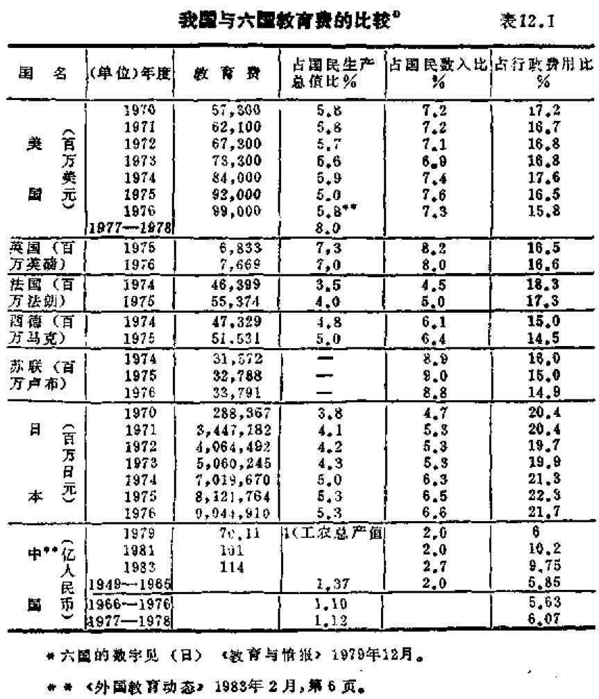

# 第十二章 教育的困境★

      不富无以养民情，不教无以
    理民性。故家五亩宅，百亩田，
    务其业而并夺其时，所以富之
    也。立大学，设庠序，修六礼，
    明七教，所以道之也。
                    —— 荀子

★本章与下一章曾收入《未来预测学大全》（贵州人民出版社1988年版），这
里作过补充修改。

## 12.1 可怕的世界倒数第二

  教育是任何一个社会发展的最重要的后备力量。现代社
会的任何进步与生产的发展，都离不开科学，因而离不开教
育。教育成了振兴一个民族的强大力量。本世纪60年代以
来，几乎世界上所有的工业国家，都把科学和教育摆在最重
要的位置上，认为教育是生产发展的首要因素。并且，大家
都认识到，由于我们正面临一场“知识革命”，未来世界最重
要的竞争将是科学技术的竞争，也就是人才的竞争，而归根
到底，首先是教育的竞争，当代，使全世界都感到深深困扰
的一系列全球问题，从人口、环境、生态、核战争、南北差
距的扩大，到其他种种危机，都跟教育相关。

  可惜，长期以来，我们把教育仅仅看成是为政治服务的
一种工具，时至今日，如果我们不回避事实就不能不承认：
在教育上我们是个失败者。在教育方法方面，尤其如此。

  让我们先来看事实。首先是投资。我国的教育投资处于
世界水平的最低位置上。这很难理解。

  据1980年的一个统计，我国历年基本建设投资浪费额达
6千亿元，而从1952年到1980年教育总投资只有1千亿元，
年均只有34亿元！[^365-1]

[^365-1]: 《韩山师专学报》1986年第1期，第35页。

  我国的教育投资，年年宣传增加了绝对数字。例如：
1979年为70.11亿；1981年为101亿：1982年为114亿。但实
际情况是，1982年教育经费占国家财政支出的比例（9.75%），
比1981年相应的数字（10.2%）还下降了。每年教育经费增
加的绝对数字甚至赶不上人口出生的增长数字。1988年的财
政总支出预算为2634.5亿元。其中教育为253.9亿元，占总
预算9.6%。从比例数看，跟1987年相同，似乎是“保持了
发展速度”，其实不然。因为，入学人数增加，学校数增加，
行政费增加，退休金增加，办公费增加，职称评定后上靠工
资增加，物价补贴增加，……结果，真正用于教学的经费非
降不可！降了多少？有待国家统计局统计。教育经费占国家
财政的比例，印度为20.8%（1969年），南斯拉夫为16.1%
（1970年）。若与一些发达国家70年代的情况比较，我国教育
经费不论在占国民生产总值、占国民收入总值、占国家预算
方面的相对比值或绝对值等方面均相差甚远（参看表12.1）。
教育费占国家预算总支出的一般世界水平为15一20%，日本
1975年高达22.3%，中国不到10%；各国教育费占国民收入
比例一般约为5一8%，我国却只有2%左右（1987年为
2.5%），处于世界水平的最低层。据1978年联合国教科文组
织统计，我国教育投资在国民生产总值的比例排在有统计数
字的149个国家的第130位，1976年还排在倒数第二位，仅比
也门（0.6%）高。[^366-1]1976年泰国的相应数字为4.1%，新加
坡为2.7%。30余年来，我国教师队伍增加35倍，高校毕业
生增加超过16倍，但教育投资1979年仅比1952年增加7.8倍；
1952—1978年我国工业产值增加15倍，财政支出增加9.93倍，
经济建设投资增加9.56倍，而教育投资仅增加6.3倍。据王建
在提出参加“国际大循环”理论时说，目前每年投资总额为
3,000亿元。所以到2000年前，出口追加1,400亿（每年100
亿）“并不算大”。这个建议，马上得到中央“立即组织实施”
的肯定。要知，教育经费每年只有200余亿，如果有人建议，
教育经费每年道加100亿元，会有什么结果呢？千家驹就建议
了，结果如何呢？“把科技、教育摆在首位”之说，也不过是
说说而已。

[^366-1]: 见《世界经济导报》1981年3月30日

[^366-2]: 见《百科知识》1983年3期，第15页

  目前，全世界的年教育经费已超过2,000亿美元，在公共
资金的支出中仅次于军事费用，占第二位。世界工业化国
家人口只占世界人口约1/3，但其教育经费比发展中国家多
10倍以上。[^366-2]中国人口占世界总数超过1/5，但教育经费却
仅占约1/30！英国的约翰·希思曾对1960年的90个国家进行
统计，地区包括从北美到北非、欧、亚、澳、南美与太平
洋，所有的资料都表明：教育经费的增长一般都高于国民收
入的增长。这表明教育投资的前序性。在发达国家中尤其明
显。日本1905—1960年的55年间，物的投资仅增加6倍，
劳动力只增加0.7倍，国民收入增加9倍，但教育投资增加
22倍。[^368-1]日本1960-1975年的15年间教育投资又增加了10
倍，同期国民生产总值仅增加3倍多。1977、1978年日本的
教育投资占国民经济的比率升到6.76%、7.06%，美国1900
年的教育投资为630亿，1970年为8,150亿，70年间增加13
倍。1965一1970年的教育投资又增加75%，而同期国民生产
总值仅增45%。1977一1978年，美国教育投资占国民生产总
值的比例又上升为8%，近年经费在1,200亿美元以上，比科
研与发展经费还多两倍多。[^368-2]

  看一下人均教育费，竟然不够买半张小书桌，如何不使
人吃惊！

  千家驹在1985年的一次谈话中指出，在世界151个国家
中，按人口平均所占的教育经费，依数字大小排列，我国占
第149位。[^368-3]我们花那么大的气力去争一个体育项目的第一，
而对这个真正与国家命运相关的重大项目处于倒数第三，却
充耳不闻，熟视无睹。决策者的理性何在？！

  1978年中学在校生比1965年增加6.37倍，而中学经费只
增加2.14倍。每个中学生的人均教育费由1953年的112元，降
为1965年的88.98元，到1977年又下降为39.81元（仅相当于
1953年的1/3，1965年的1/2），1978年我国在校学生有2.13亿
人，学生平均年教育经费仅有33元。简直是超指数的下降！
每个小学生的平均教育费也由1965年的20元下降到1979年的
16元。[^368-4]

[^368-1]: 见《红旗》1983年8期，第2页。
[^368-2]: 《美国的科技潜力》第1页。
[^368-3]: （高等教育学报》1985年1月，第64页。
[^368-4]: 见《学术论坛》1983年4期，第43页。

  1980年，我国的人均教育经费为2.7美元，每个中小学
生的平均教育费仅为13美元。还不如印度1975年的水平（相
应数字为3.9美元，27美元）。与其余一些国家的比较情况如
下：[^369-1]

表12.2

-------------  --------  --------  --------  --------  -----------------
1973年           日本      美国      埃及       印度       中国（1980年）
-------------  --------  --------  --------  --------  -----------------
人均教育费
（美元/人·年）   247.7      471.4     18.0        3.9         2.7

小学生平标教      1189     1583                   27          13
育费
（美元/人·年）
-------------  --------  --------  --------  --------  -----------------

  我国按1982年的数字算，人均教育费也只有11.2元人民
币，还不够买半张学生书桌用，为世界14个人均教育经费不
足6美元的国家之一。目前这个数字变化很少，物价却是飞
涨了。

  建国35年来，我国总的教育投资为1348.51亿元，平均
每年只有38.5亿元，仅相当于我国被排在世界倒数第二位时
（1976年）教育投资的一半多一点！35年来的教育基建总投
资为162.88亿，平均每年只有4.7亿.[^369-2]

[^369-1]: 参看《外国教育情况》1982年3期第9页；《世界经济导报》1981年8
月30日

[^369-2]: 参看《中国教育报》1984年9月18日。

  由于历年积欠的教育费太多（尤其是“文革”期间的欠
债最大，例如1971年实际的教育费只占总财政支出的4%！），
办学条件相当差。不少地方的中小学缺台凳、缺房子情况严
重，危房数量惊人，教学设备更谈不上。以1978年的甘肃省
为例，全省有17.2%的校舍为危房，小学危房竟占77%！中
小学缺台凳60万套，缺校舍170万平方米，仅此两项共需款
1.8亿元。[^370-1]同年，中央宣布“用三五年或稍长一些的时间，
做到校校无危房，班班有教室，学生人人有桌凳，”但时至今
日，甘肃等地的一些小学仍在土台、黑窑洞中上课，在南方
还有不少用破旧草席搭盖的学校，即使在全国触目的广州市
中心，1984年还要通过电合、电视呼吁社会帮助解决中小学
生的课桌凳问题。堂堂的北京首都连一些小学的粉笔也要定
量供应，有些农村的小学教师竟然每周只能领一支粉笔！一
些国家重点大学，备课稿纸亦要定量供应；农村还有搞“以
生养师”制的。千家驹教授曾估计过，要修理全国学校的危
房约要2百亿元人民币，即约需用两年的全部教育经费。[^370-2]
全国人大教科文委员会委员刘达在1985年批评某省时指出，
该省省府近两三年内建了580多栋大楼，主要用于机关办公，
而小学只造了一处。这个省办得较好的一所小学，竟还用旧
时代留下的破旧建筑物。[^370-3]北京近年建了不少高楼大厦，可
是中小学的校舍、操场、设备、实验室的落后面貌并无多大
改进。1985年8月笔者曾到天安门西侧的一间中学参观，其
中的脏、乱、旧的样子，处处可见。

  导致出现这种情况的原因是十分简单的，现在国家的教
育经费基本是人头费。仅仅发工资就占去了总数的约85%！
一个小学生一年的体育费只有两三角钱，勉强够给体育教师
发规定的服装用；图书费也是两三角钱。德、智、体全面发
展的要求只是一句空话。

  我国历年教育基建投资占基建总投资比为：[^370-4]

[^370-1]： 见《西北人口》1983年8月，第19页。
[^370-2]： 见《社会科学》1983年5期（当时每年教育经费只有一百多亿元》
[^370-3]： 《光明日报》1985年6月10日
[^370-4]： 见《西北人》1983年3月，第19页

表12.3

------  --------  --------  -----------  ----------  ----------  ------------
时期      “一五”   “二五”     1962-1965     “三五”       “四五”     1976-1978
          计划     计划         年           计划        计划           年
------  --------  --------  -----------  ----------  ----------  ------------
%          5.5      2.6         3.2         1.0         2.3            2.7
------  --------  --------  -----------  ----------  ----------  ------------

  这些与占人口总数1/5的巨大教育系统简直不成比例的
数字，是不需要再加评论的。

## 12.2 混乱的管理

  让我们看看管理方面的事实。首先是严重的教育浪费。

  教育系统中的各子系统的配比关系，本应由国民经济各
部门的发展状况及其有关比例决定，而不是由各学科的关系
或学者的关系来决定。但长期以来，我国教育系统产出的人
才结构与经济结构不能互相适应，结果造成一方面是教育的
重大浪费，另方面又未能解决社会需要的问题，

  最明显的是农业和轻工业，这两方面需要大量的中等技
术人才。但长期以来，我们却集中力量培养普通中学生，既
不能适应经济建设的要求，又造成他们的就业困难。一方面
是供不应求，另方面又“供过于求”。这些人，一毕业就要
“改行”，成了大浪费。据教育部门对1982年的大学毕业生作
抽样调查，本科毕业生用非所学的占12.3%，降格使用的占
20%。[^371-1]一方面是人才不足，另方面是人才浪费。

[^371-1]: 见《江苏高数》1985年3月，第6页。

  高教系统在人才培养上的问题更多。根据上海市在1981
年组织的一次大规模的调查。[^372-1]所发现的典型问题就有如下
一些：

  （1）机、电、土、化通用专业缺口很大，很难适应当
新企业技术改造的要求；

  （2）外贸、财经、管理人才问题严重，在上海这样的
地方，财会人员达大专水平的仅占6.6%，统计人员受过大
专专业训练的仅占1.9%。

  （3）高级医科人才增加太少，预计“六五”期间仅能
解决需求的一半，“七五”期间则只能满足1/3；

  （4）“重重、轻轻”现象仍未改变。多年来对工矿交
通军工较注重，轻纺方面人才，从培养到分配都不受重视，
日用品的有关行业因人才无法补充而接连丧失优势，失去市
场。轻工手工行业的技术力量最弱。1978年上海农、林、
轻，食品方面的技术人员仅占全市技术人员的1.98%。

  （5）城市集体企业产值迅速增加，规模愈来愈大，但
一直无法解决人才分配问题。

  （6）各行业的应用文科人员奇缺。政治，秘书、档
案，资料管理、社会学等专业无人接班。

  （7）各行业非对口专业的配套人才无法解决。

[^372-1]: 沈振华，《人才预测工作的初步步实践；《上海高教研究》丛刊，第八期。

  我国长期以部门为主办学，主要培养对口专业人才。结
果造成非对口专业人才紧缺的状况。例如，非卫生部门的医
生断档，非化工系统的化工人才无法补充，非建筑系统的建筑
人才无着落，非电力系统的电工人才奇缺等等。但实际上，
例如：非电力系统的冶金、化工等工厂都是用电大户，机械
人才在非机械专业单位中就占总数的约一半之多。结果，大
多数是用改行的办法来解决。与生产不相适应的部分积压或
“改行”的人才，其劳动力不能为社会所充分利用或只能在
萎缩状态下被使用，结果就是教育浪费，即教育投资失败。
我们的教育系统，对这种情况是历来无调查研究的。

  不久前，全国各地对各行各业的青年职工进行文化考
核，还发现一个惊人的事实：大多数人的实际文化程度与其
学历不符。例如，沈阳市对各系统35岁以下职工的检查结
果，不足初中文化程度的竟占总数93.3%之数，而他们之中
绝大多数是受过初中教育的。1981年，沈阳市曾以初中教学
内容的下限水平命题，作抽测。结果，语文、数、理、化四
科合格人数仅占参加考试人数的8.58%，其中矿务、轻纺、
公用事业系统的青年的合格人数竟低至1一3%。

  高中的情况绝不会比初中好。中等教育的虚脱现象，暴
露无遗。小学的情况同样严重，巩固率仅达50一60%。其结
果，必然出现大量的重复教育，造成严重的教育浪费。这种
现象，30多年来一直存在，而这是与知识老化，知识更新的
现象完全无关的另一种特异现象。

  我国教育系统结构之不合理，至为奇怪，实在是出于一
种不可理解的政策产物。整个教育投资不仅是软弱无力的，
而且投资的政策，即在既定条件下，资金使用的方向、构成
及其相互适应、衔接与配套问题，从来就没有被认真对待
过。

  首先，多年来，整个中等教育系统基本上是为了那个不
过百分之三、四的升学率而转。这是早就受批评的极不合理
的做法。大学的情形也是这样。一般发达国家大学中的本科
与专科比为1:10~12，而我国1953年为1:3.1，1980年为
1:1.1。按大学，中专、熟练工人的培养比例计算，苏联为
2:3:5，我们为2:2:1。

  其次，专业结构也无合理比例，前述“重重，轻轻”的
情况是1952年进行院系调整时就确定下来的，当时有当时
的意义。可惜，在这个迅速变化的社会中，我们的这个结构
竟基本上保持30年不变。直至目前，全国大专院校理工科
453个专业，只有46个与轻工业对口，仅占专业总数10.2%。
解放以来，理工科毕业生共224万人，其中轻工业仅有7万
人，占毕业生总数不过3.1%。财经方面的学生，现在约有
1.8万，占高校在校生总数2.6%，而我国有40万个工业交通
企业！[^374-1]不少新兴科学方面的有关专业，至今仍为空白或几
乎空白。1921年全国高校毕业生分配时，发现了天大的笑
话：全国高校开设的专业不过845个，竟有353种专业人才奇
缺（占专业总数41.7%），差额达19万。而另外还有157个专
业的毕业生又多出10万人，占专业总数18.5%，全缺的专业
有214个。[^374-2]

[^374-1]: 参看《科学管理研究》编辑部《管理人才与管理教育》文集，第116页

[^374-2]: 参看吉林大学《预测方法与人才预测》文集，第132页；新华社1983年11月
8日报道

  再其次，高校师生的比例结构也受到普遍的批译。目
前，大学的师生比，世界平均水平为1:14，英国为1:8，美
国的政府大学为1:20，法国是1:20，日本1:19.3，而我国为
1:4.3，其中教育部直属大学为1:3.3。若按教职工算则为
1:1.97，离校中的教师职工比竟达1:1.5，职工比教师多50%
以上（先进工业国为2:1或3:1）。1980年我国的675所高校
有教职工63.25万：平均每校936人，其中教师只有24.75万，
职工有38.5万），中学师生比为1:19.1，小学为1:24.3。总平
均师生比为1:22，按教职工算为1:12.1。

  其中，中小学的师生比在纯数量而不计算质量的情况
下，较为接近国际水平。比较情况可以从下表（12.4）中
到:

表12.4 七个国家的中小学师生比

------  --------  --------  --------  --------  --------  --------
        1965年               1970年              1975年
        小学       中学       小学     中学       小学      中学
------  --------  --------  --------  --------  --------  --------
美       1:28      1:20.6    1:24      1:19.4    1:20      1:18.5

英       1:25      1:14.2    1:25                1:22
                                                 (1974)

法       1:25      1:16.8    1:23      1:15.8    1:28  

西德     1:27      1:15.2    1:26      1:12.3     1:23     1:14.6
                                                 (1974)    (1974)

日       1:28      1:22      1:26      1:18.2    1:25       1:17
                                                 (1976)

苏       1:17                1:17                1:15
------  --------  --------  --------  --------  --------  --------

中      1983年    小学1:24.3   中学1:19.1

外国数字部分转摘自王承绪等《比较教育》，人民教育出版社1982年，第206页。

  我国普通学校的大、中、小学生比为1:27.6:78.5亦属
不合理结构之列，根本构不成一个金字塔。

  美国没有一间大学有围墙，我国没有一间大学无围墙。
这是开放式与封闭式教育系统的两个小小的象征。其实，其
内容远不止此。

  目前，我国学校的封闭式管理体制，与许多其它行业一
样，造成被动的“单位所有制”局面。于是，机构重叠，管
理重复，学校被迫社会化，编制越搞越大，设备放空，人才
闭阻，冗员充塞，中学设“级组”，大学设“教研室”，都是世
界少有的做法。过去有一些教研室成了某些既外行又无事业
心的领导的防空洞。大量的人力、物力、财力在自我束缚中
消耗掉，并且又造成恶性循环：愈是浪费性的消耗大的，愈
得到“照顾”，也愈是无力改进和愈加倾向于封闭。

  在这种情况下，教育系统的人才产出成本有增无减。而
事实上，由于经费的限制，成本的实际增加的可能性是不大
的，真正的出路便必然是降低人才的质量。30多年来，我国
教育系统的情况难道不是这样吗？

## 12.3 困迫的学校

  建国35年来，我们经过上下的努力，已经建立了一个世
界上最庞大的教育系统。这是一个不容否认的成就，但总的
情况还是很不理想，与世界发达国家的水平差距很大。主要
的问题是：小学仍没有普及，经费短缺，设备与场地等办学
条件差，教学质量低，教师待遇差且水平不高，学生的智力
未能得到充分的开发，教育体制与结构存在的问题严重，地
区发展不平衡等。

[^376-1]: 参看《光明日报》1984年9月1日与21日；《中国教育报》1983年5月
5日；1984年9月4日1985年12月31日：《中国统计年鉴1984》。

  根据最近有关的正式报道[^376-1]，我国教育系统的简要情况
可列出如下表（12.5）：

表12.5 1985年中国教育系统统计

--------------  ----------  -----------  -----------  ------------  ------------
                 学校数      在校学生数     教师/职工   毕业生/招生     1983年底
                （所）         （万)         （万）     （万）         毕业生数
--------------  ----------  -----------  -----------  ------------  ------------
研究生（含科      688         80553人
研单位)                        ①

普通高校          1016        170.31       34.43②       31.64           411.02
                                           /52.6        /61.92

成人高校          1216        172.50       6.03/7.41    34.70           200
                                                        /78.78

高校合计          2232        350.84       41.36        66.34           611.02
                                          /60.04        /140.7

普通中学③       9.32万       4705.96       259.7                     17160.2
                                          （1983年)

中 技             2529        101.29       12.80         125.16
                                           /18.51       /45.36

中 师             1028         56.82       4.60       16.71
                                          /4.41       /21.47

职业中学          8070         228.57                                  1639.8

成人中校         19322        546.96        14.7         284.27
                                           /11.24       /413.53

小 计            16.47        5639.6      291.8          327.14
                                          /34.15        /480.36

小 学④          83.23万      18370.18    合611.83⑤                    23210

成人初校         278450        833.81     7.27/4.02      493.82
                                                        /592.18

小 计             110万        14204       合623.12

统计              127万        2亿          合1060.5

幼儿园           17.23          1479.7      111.52
                                            /22.2
                                            (1982年)
--------------  ----------  -----------  -----------  ------------  ------------

说明：

① 1984年在校博士生73人。

② 其中救授4700人，副教授2.86万，讲师13.68万。教员3.91万。助教
13.51万。

③ 其中高中在校生741.13万，比1978年减少52.3%，初中在校生3064.83
万。

④ 1982年的小学入学率为93%，1985年为95.9%，同年小学毕业升学率为
67%，到1985年10月止，宣布已普及初等教育的县有731个（不包括市和市辖
区），占全国总县数1/3。

⑤ 1983年数据。其中308.3为民办，超过50%。

⑥ 资料来源：《中国教育报》1983年5月5日，1984年9月4日，1985年12月31
日；《中国百科年鉴》1986；《中国统计年鉴》1985，《中国教育年鉴》1985

  从表中可以看到，我们已经建立起成百万所各类学校，
有约2亿人在各类学校中学习；已经建立起一支约1,000万
人的教师队伍；35年来培养的高等学校毕业生已达600余万，
高级与中级人员合计约有1,300多万。从发展来看，技校与普
通中学增加最多，小学增加较少。不过，表中的成人高等教
育较为复杂。以1985年计，当年在校生172.51万。其中，本
科生20.85万，专科生151.66万。[^378-1]另外，35年来，我们派
出国留学的有24,557人，已毕业回国的有15,131人。

  我国的教师队伍，是虚肿而困迫的。我国现有近千万教
师大军，中小学的师生比亦不低于工业化国家的一般水平，
为世界上最庞大的教师队伍。

  可惜的是，我们的教师队伍充满虚肿的现象。最大一次
虚肿膨胀，是“文革”期间盲目发展中小学搞起来的。那时，
一群荒唐的决策人，提出要普及高中教育的要求。1978年，
我国的中等教育虚肿到了顶头。当年的普通中学有学生
6,548.3万人，[^378-2]比1965年增加5,614.5万人，增加了6倍，
为1983年4397.73万的1.5倍；同年的普通中学教师达318.2
万，比1965年增加272.5万人，增5.9倍，比1983年全部中等
教育的师资296.2万还多出22万人。而在当年的这批教师中，
高等师范学院毕业生21万，仅占总数7.7%，其余92.3%的
人全为从小学、中等师范学校和当时的高中生中层层“提拔”
而来。

  1978年小学的情况亦如此。当年的小学生1.46亿，教师
达522.6万，比1965年学生增加3千万（25%），教师增加136.9
万（35.5%）。其中，中师毕业的1,245万，约占33%，其余全
为民办教师。当年初全国教师876.59万人，分配如下：[^378-3]

[^378-1]: 见《中国教育报》1985年12第31日。

[^378-2]: 参看《西北人口》1983年3期，第18页。

[^378-3]: 参看《高等教育资科》1981年1期，第13页。

  小学587万人，其中民办353万多人，占60%；

  中学（含中专）260万人，其中民办127万多人，占49%；

  大学23万。

  比较一下，同年美国教师，中小学250万，仅为我国数字
的30%，而大学教师70万，相当于我国数字的3倍多。

  我国当时解决中小学教师的办法是很可笑的。那时不少
地方流传这样的口号：“中学教师小学顶，小学教师队里请。”
有人估计，当时的初中教师86%不合格，高中和小学合格的
教师亦仅约有一半。中小学教师中，学历未达要求的超过一
半以上，这种情况在大学同样存在，并且遗患至今，造成当
前总体师资水平奇低的极端困迫的状况。这种状况，在高校
教师中还随着年龄的老化而变得愈来愈严重。我们会在后面
看到，高校将由此而面临一场学术水平再度下降的危机。

-------------------------------    ------------------------
  据1983年的资料统计：[^379-1]               (%)
-------------------------------    ------------------------
    中学民办教师的比例                   16.46
    小学民办教师的比例                   49.32
高中教师本科以上学历比重                  40.4
初中教师中专以上学历比重                  21.2
小学教师中高中毕业以上学历比重             56.1
-------------------------------    ------------------------

  直至目前为止，教师的最大困迫状况在于待遇和工作、
生活条件方面。

  按1980年的情况，小学教师的工资在全国所有行业中倒
数第一！中学教师为倒数第二！[^379-2]

[^379-1]: 参看《高等教育》1984年第3期。

[^379-2]: 见《高等教育资料》1981年1期，第13页。

  大学教师的工资不如自己的孩子和学生，甚至不如自己
的学生的学生。中国教师种种使全世界都目瞪口呆的困迫事
实太多了。教师的社会地位问题始终未能认真解决，许多地
方仍然受歧视，住房挤迫，福利差，生活负担重，高校教师
中职级不符现象相当普遍。据上海交通大学1981年的调查，
65名教授中有54人职级不符，占90%，在230名副教授中有
198人职级不符，占86%。其中低一级的46人；低两级的62
人；低三级的42人；低四级的48人。在1,046名讲师中有962
人职级不符，占92%，其中低一级的205人；低二级的548
人；低三级的204人。[^380-1]这种情况至今并未改变。

  我们的学生是被捆起来读书的。

  据1983年的资料，我国每万人口中，各类在校学生数为:[^380-2]

-------------------     -------------
                        （单位：万人）
-------------------     -------------
  （1）高校学生                21.2
      普通高校生              12.0
      成人高校生              9.12
  （2）中专生                 11.4
  （3）普通高中               62.7
  （4）普通初中               375.4
  （5）职（农）中             12.2
  （6）小学生                1,352
-------------------     -------------

  以小学为1时，1—6类学生的比例为：0.015（0.09、
0.07) : 0.008 : 0.046 : 0.27 : 0.09 : 1

[^380-1]: 见《辽宁师大学报》1984第6期，第26页

[^380-2]: 参看《辽宁教育》1984年.第3期

  其中，初中为职（农）中的30.7倍，高中为中专的5.5
倍。大、中、小学全不成比倒。面对这些冷酷的数字还需要
说明的一个事实是：我国中学生就业无门，绝大部分都要挤
向升学一条路。于是，全部学生都被各级升学考试捆起来
了。而升学的路子却又及其狭窄。以1981年计，升学率小学
升初中为68.3%，初中升高中为31.5%（日本为94.3%），高
中升大学不到5%。考试不及格，这成了中国学生的一大特
点。与我国1983年每万人只有不足12个在校大学生相比，美
国（1975年）为520人。其他一些国家的相应数为：日本
（1976年）2,104人，苏联（1975年）近200人，法国（1976
年）197.3人，西德（1976年）137.8人，英国（1976年）
58.4人，巴基斯坦（1974年）16.8人。[^381-1]我国每万人口的中
等学校学牛（1983年）为454人，1975年美国为962人。同年
其他一些国家的相应数字为：日本818人，西德638人，法国
952人，加拿大1156人。[^381-2]

  我们的整个教育都是以灌输知识，培养定向型书生为目
标。学生始终跳不出分数的圈子，上课记笔记，下课背笔
记，考试考笔记，考完扔笔记。知多识少，高分低能，成了
学生的普遍特征。有人指出，据现代管理学对人才的测定要
求有128项指标：凭卷面考试只能考出其中的47项。还有81项
未能考出。例如：毅力、反应力、合作性、创造性、研究、
组织管理、获取信息情报、口才、写作、社会活动能力等
等。

[^381-1]: 见《世界经济导报》1981年3月30日。
[^381-2]: 1981年《中国统计年鉴》

  中国学生的这种情况是深有传统的。从封建时代以八股
取士开始，读书为要当官，当官就要听话，怕担风险，怕负
责任，不敢选择，不敢探索，习惯于俯首听命，循规蹈矩，
易于接受种种僵化的思想。这种文化传统是导致我国近代落
后的重要原因之一，其影响至今普遍存在，尤其是在教育系
统中存在。

  中国学生的特点是：

    稳重——保守——听话

  这些特点的一个方面是基础知识扎实，处处小心谨慎和
能忍受磨炼；其另一面是守旧、易于满足和学究气重。

  在这种教育传统的影响下，整个民族都有重理轻文，轻
工轻商的思想，整个社会心理都把有才能的青年人引向追求
安逸地位而不愿走向独立发展和冒险求进的道路。所谓“知
足常乐”，成了“孔孟之邦”的神圣教条。

  中国学生的特点，目前最典型的表现之一反映在出国留
学生身上。据各地的考察人员反映，我国出国的留学生普遍
有这样一种表现：第一、二年搞基础训练时，表现相当好，
不少还当了教授的助手。但到第三、四年动手工作时，就被
抛在当地学生的后面。不久前，杨振宁教授还讲了个典型的
例子，说我们有一位研究生，考在美国一位诺贝尔物理奖获
得者门下，得博士预考第一名，然后，他回家等导师给他出
题目，一等就是很长一段时间，结果被导师拒绝接收。

## 12.4 千钧压顶

  我们的教育系统正在承受越来越大的压力。

  首先是幼儿的教育问题。幼儿教育从早期幼儿园的看管
职责变成“学前教育”，现在又发展成“前初等教育”。这是一
种很有意义的变化。问题出自对幼儿智力发展本质的新认
识。美国心理学家布卢姆认为，人的智力有3/4是升入小学
前形成的，幼儿时期被剥夺智力刺激的儿童，永远达不到原
来应达到的高度。

  有鉴于这种认识，世界各国都强调这一前初等教育。苏
联人认为，这是整个教育系统中的一环；英国制定了尽早发
掘儿童潜在才能的扩展计划；法国人把这部分的教育看作是
开发人力资源的重要步骤。美、日的行动更走在各国的前
头。日本甚至规定幼儿教师必须有大学二年以上学历，且受
过专业训练。

  各国3一5岁儿童入园率比例相当高。苏联为50.2%
（1980年）；美国为49%，5岁儿童为87一92%，（1975年）；西
德为65%（80年代）；法国1980年，2岁入园率为45%，3岁
为90%，4一5岁96.6%，5一6岁为98.9%；日本1982年
为100%。[^383-1]我国每年出生要儿近一千七八百万，3一5岁儿
童约有6,000万应入园，但1983年入园儿童仅1,140万，只占
不到2成。广东在国内算是发达地区，1982年适龄幼儿入托
率却仅有7.45%，许多地方几乎是空白。随着独生子女的增
加，经济生活的改善和社会竞争性的加强，前初等教育必将
会成为一种强烈的社会要求。

  在这种情况下，不言而喻，师资的培训、场地、设备等
问题会变得尖锐起来。

[^383-1]: 见《比较教育》，教育科学出版社。

[^383-2]: 《教育研究资料》1980年。

  其次是初等教育问题。“文革”期间，全国的小学教育受
到了一次异乎寻常的破坏，那是由于荒唐地提出“二三年普
及高中教育”并人为地强行拔高造成的。1976年仅山东省的
中学就挤掉了3千多所小学和抽走56万教师。[^383-2]1983年，我
国农村的初等学校有82.23万所，占总数95%，适龄儿童入学
率为94%，[^384-1]及格率在20一45%之间，教师近606万人，其中
达中师、高中毕业的占56.1%，[^384-2]实际合格的仅约1/3。有
些地方的小学三率（合格率、巩固率、入学率）还是2、5、
8的比例。这一串基本事实说明了很多问题。与解放前相
比，学生增加了5倍，学校却只增加两倍，新文盲、半文盲
的产生率仍有50一65%以上，即每年还要增加1千多万文
盲、半文盲！1987年宁夏自治区的一个调查表明，全区12一
14岁的文盲比率达36.84%，15一40岁的文育比率更高达
50.9%。若今房每年按2千万人出生估计，现有1.35亿的学生
容量已足够，但质量极成问题。小学设备之差，前面已曾说
过，“黑屋子、土台子、泥孩子”比比皆是。近几年来还不断发
生因校舍房屋倒塌砸死砸伤学生的事故。整个保定县小学6
年的平均公用教育费只有每人0.79元，1982年为1.27元。[^384-3]
于光远不久前曾提到，在日本农村，哪一座房子最好，那一
定是学校，而在我国农村，哪一座房子最破，那一定是学校。
建国38年，仍然存在大最破破烂烂的到处是缺砖少瓦有门无
窗的学校。这种落后情况，已到难以容忍的地步。

[^384-1]： 《中国教育报》1984年9月15日。

[^384-2]： 1985年9月29日《新民晚报》报道：据1984年统计，全国男、女儿童入
学率为97%和93%，仅西南、西北及内蒙、广西等省，就有三百万女童没有入
学。

[^384-3]： 河北教育科学研究所等：《教育改革理论讨论会论文选辑》1984年8月第
29页、111页。

  我国西周时便有小学教育，1897年上海首创公立小学
（南海公学外院），1909年（清政府）已在北京试行过强迫义
务教育法。1982年通过的《中华人民共和国宪法》第十九条
规定要“普及初等义务教育”。但直到1984年5月才有陕西省
的合阳县实现了普及初等教育。按目前的状况，要在1990年
按国家规划完成普及初等义务教育的任务，仍然困难之极。
有一个显然的事实是：国家在相当一段时期内无力解决这一
不能不解决的问题，于是，在强烈的社会要求下，初等教育
就会随着地方的经济发展而形成一股地方性的浪潮。目前，
这个浪潮的第一个浪头已在江苏省掀起，1984年6月27日，
江苏省六届人大二次会议率先通过在全省执行初等义务教育
暂行条例。随后，内蒙亦通过类似法律。全国也规定在1986
年7月1日开始实施义务教育法。国家计划在1990年完成全
国普及初等教育的任务。从我国的实际情况来看，如果在十
年内能真正解决这一问题已属不错。可惜实际情况无法让人
乐观。义务教育法已颁布三年，在财政，物质上却无保证。
各地小学入学率反而降低，大量学生弃学。最近报道，目前
全国每年约有270万适龄儿童未入学。其中女儿童224万，占
83%。1987年儿童入学率在95%以下的有11个省区，有些地
区女儿童入学率只有40一50%：贵州威宁县至少有4万儿童
失学，入学率只有66.4%；宁夏6-11岁的回族儿童失学率达
56.9%；甘肃1986年有15万多儿童失学，其中女生占83.6%，
贵州苗族聚居区女学生仅占20%；广西瑶族自治区基本上是
“男孩读书，女孩养猪”，有些学校竟没有一个女生。[^385-1]

  作为一种比较，可以列出一些国家的情况，如下表
(12.6)。

[^385-1]: 见《中国教育报》1988年4月26日；5月5日《学术研究》1988年，第2期

  目前，世界202个国家和地区已有169个实行了初等义务
教育。我国的中等教育，不久也会刮起一场旋风。

表12.6 六国普及初等教育情况 [^386-1]

------------  --------------  ------------  --------------  ------------------
国别           义务教育年限     起讫年龄        完成时间          注
------------  --------------  ------------  --------------  ------------------
美               8-12            6岁起       1852—1920年    各州不同：以9
                                                近70年            年为主

英国              11             5-16             25年

法               10              6-18            30多年

西德              9               6-15                        义务教育思想起
                                                              源于德国

日                9               6-15       1872-1907年
                                                35年

苏               10              7岁起        1934-1975年
                                                41年
------------  --------------  ------------  --------------  ------------------

  1983年底，我国有中等学校98703所。其中，普通初中
77598所，完全中学和独立高中18876所（合96474所），中等
专业学校3090所。还有技校、农中、职中、成人中等学校
等10121所，总共109685所。普通中学与中专之比为31.2：
1，文革前为2.5:1。初中与完全中学和独立高中之比为
4.1:1。与解放前相比，普通中学增加21.6倍，中等专业学
校却只增加2.97倍。两者的递增比率为8.7:1。

  同年，中等学校学生共有4476.5万人。其中，普通中
学生4397.7万，比解放前增加28.4倍；中专生还达到68.8万
人，比解放前增加7.9倍，两者的学生人数比为64:1，其递
增比率为3.6:1。1982年普通中学生与中专生之比83.5:1。[^386-2]

[^386-1]: 参看《比较教育》，第100页。

[^386-2]: 中山大学，《人口研究论文集》1984年，第49页；其余数字见《中国教育
报》，1984年8月1日、8日、15日、18日。

  即使按每年平均2千万人出生算，中等教育的适龄人数
亦在1一1.2亿之间，实际在校生不到41%一44%，而且这已
是大大地人为拔高了的数字。按平均算，解放以来，我国小
学毕业生的升学率为67.3%（1982年仅为66.2%），初中毕业
生的升学率只有35.5%（1982年仅为32.3%）。有不少初中学
校，其办学条件并不比最困难的小学好多少。

  一个更奇怪的问题是，一旦发现70年代盲目发展普通中
学的错误之后，竟采取了断然简单砍削的办法：1983年全国
普通中学比1978年减少6.6万所，减少40.7%（1985年更减
至52.3%，见表11.5）在校学生碱少2150.6万人，减少32.8%。
按1982年人日普查推算，1983年全国12一16周岁的人口达1.3
亿，而这一年龄段的中学生仅4000万人，只占31%，1983年
小学毕业生升学率仅为67.3%，初中毕业生升学率（未含技工
学校）仅为35.5%，比一些国家的高校入学率还低。[^387-1]这
种情况很难与我国实现四个现代化的宏伟目标相适应，很难
与将要出现的我国在本世纪的第三次大发展的形势相适应。

  现代的中国人不可能听任这种情况继续长期存在。追求
光明和知识的强大潮流必然会从劳动群众之中兴起。一场发
展中等教育的旋风将会劲吹起来。特别考虑到，现在开始进
入中等教育系统中的学生，10年之后，即在我国实现翻两番
宏伟目标的最紧要关头，要进入社会，走上接班的岗位。问
题的重要性十分清楚。

[^387-1]: 见《统计》1984年，第6期

  其中，尤其是中等职业教育问题，必将随我国农村都市
化、经济商品化和社会信息服务业发展等进程而形成一个强
大的需求压力。即将出现的教育地方化的趋向值得密切注
意。有人估计，我国目前全国青壮年职工需补习文化技术课
的约有2千万，从最近对几个省的统计来看，经补习后及格
者，仅占参加补习总人数的27%左右。

  当前对教育的一种普遍的失望情绪，笔者相信，只是一
种一时的历史错乱，问题就看我们怎样对待了。

## 12.5 高等教育的难题

  我国教育面临种种困境，其中，最复杂的问题，应该说
仍在高等教育。无论就质量、数量，师资、设备以及各种办
学条件看，高等教育的现状都远远不能适应目前社会经济大
发展的需要。其中以农业、师范、管理、法律等方面的专门
人才培养问题，是得更突出。

  我国高等教育如果不从1862年设立的北京同文馆算起，
而从1898年创办的京师大学堂开始，至今只有80多年的历
史，与世界一些主要国家相比，历史较短。

[^388-1]: 《中山教育报》，1985年12月31日

  1949年，我国只有205所高等学校，学生11.7万人。到
1965年发展到434所，学生67.4万，“文革”期间又降为300多
所，而且全部教学工作停顿、倒退，遭受了一场空前的大破
坏。1977年高校恢复到404所，学生62.6万，两年后剧升为
633所，学生102万，竟以每年增加110多所学校和近20万学
生的速度发展。以后，一连几年，仍以每年五六十所学校的
速度发展，至1983年达805所（其中重点学校97所），学生120
多万。1985年底，普通高校发展到1016所，成人高校1216
所。且还有52所普通高校在正式获准筹建中。[^388-1]其中不知有
多少高校是硬拔、硬竖起来，有名无实的。许多是中专戴帽
的“四无”学校（无校舍，无正副教授，无设备，无图书资
料），计算机课还搞“无机教学”。有人调查35所地方大学，有
投入5万元就算“创办”了一所大学的，有招来几十名学
生，也算一所大学的。其中固定资产不足10万元的有12所，
占34%，全校教学用房不足2000平方米的有30所。还有8
所是基本无教学用房的。[^389-1]这种“发展”，用的是当年“全民
炼钢”、“土法上马”的办法，纯属装点门面，自欺欺人。说
穿了，有的人是为拼凑“政绩”，捞政治资本去做花花文章
的。当然，现在还加上了一条：“向钱看”。某省一下子竟出现
8所自行挂牌的“大学”。擅自乱发大专文凭更形成普遍性全
国热潮，每年收费从900元到2300元不等。这种做法竟还得
到“社会的大力支持”。1985年上半年，某公司动用十几万元
巨款保送30人到人民大学学习，大多数为该公司干部子女。
这也称得上是一个应时的“绝招”。

[^389-1]: 《高等教育未来与发展》1985年，第2期，第57页。

[^389-2]: 《略论高等教育的发展速度和单纯追求升学率的问题》，《人民教育》1982年
1月。

  1982年蒋南翔曾提到：从1949年至1982年，32年来，我
国全日制大学生平均年增8%，“文革”前17年平均年增
11.5%，1977一1981年平均年增18%。美国在1946一1976
年的30年中，平均年增5.33%，在发展最快的60年代为
3.27%；日本在1965一1975年的10年间，平均年增为6.3%；
苏联同期为2.4%。据此，蒋南翔认为我国高校发展是很快
的。他并且指出：虽然有人批评，说我们的高中升大学率不
过4%，但这个4%是不能说明问题的。他说：“有人把这个
事实看作大学招生太少，发展太慢的论据。然而这个论据是
不科学的”。[^389-2]他认为，那个18%才能说明问题。我们又有了
一个“世界第一”！

  其实，这个数字是变戏法变来的，不值得宣扬。50年代
的10年中，我们有6年大学招生数超过当年高中毕业生数，
其余4年，有3年在89%以上；60年代，升学率降为30一
40%，1965一1980年高校招生从16.5万增至28.1万，增加
75%，但靠硬拔发展起来的高中从36万剧增至616万，增18
倍，其发展速度比高校快24倍，使升学率一下子从45%降为
4%。这个4%比18%更能说明问题。以那个18%来自豪是
完全不恰当的。把那个原来已有的发展速度，强行按下去，
然后又不顾一切地强行拔起来，于是就造成了那个18%！真
正的问题却在于：

  一方面，这种完全不正常的大起大落的发展，造成了一
片混乱，是给高等教育带来严重困难的主要原因之一。学校
与学生的大起大落，必然会使教师、资金、设备、教学与科
研传统、人才供求、社会的各种接替工作和社会心理等，亦
随之大起大落。整个高教系统的质量必然会在大起大落中降
低。

[^390-1]: 1985年高校总计招生61.92万（包招代培生和干部专修科招生），国家教委
已宣布“发展太快”。

  另一方面，我们的实际数量是太小了。仅相当于我国人
口约1/5的美国，1979年有3,125所高校（1984年为3,280所，
其中四年制的有1,700所，其余为二年制），为日前我国的3.9
倍，若按人口的比例算更为19.4倍；他们那时有1,030多万
大学生，为我国1984年的9.4倍，按人口比例算为47倍。美
国高校每年招生250万（占学龄青年1/3以上），为我国约30万
人的8.3倍，[^390-1]按人口比例则为41.7倍：高校录取学生与全
国人口总数比，美国为1:19.2，世界平均为1:98.2，我国
为1:421.6人（1981）；美国高校人学率已占18一24岁适龄人
口的53%，日本则占40%。对比之下，我们的那个4%为什
么不能说明问题呢？差距太大了。1982年整个高教系统的经
费只有22亿。

  国外，60年代是高校大发展的时期，我们显然已落后了
20年，现在几年内就想追赶上去，这是非科学的态度，脱离
实际的要求。

  世界科技新发展的势态说明，教育与科研是今后决定一
个国家和一个社会集团命运与前途的最重要的因素。据有关
部门不久前的一个初步测算，为要为90年代我国的经济振兴
打基础，约需要增加一个四五百万大、中专以上程度的专
门人才，而现有大、中专院校的办学规模，在80年代的培养
能力不过仅有七八百万，差一半。[^391-1]据另一个1983年的预测
表明，为实现2000年时工农业总产值翻两番的战略目标，我
们还缺少2千万以上具有大专程度的专业人才。而目前我国
适龄人口的大学升学率极低（1981年为0.89%；美国1975年
为45.2%，日本1979年为37.9%）。很难想象我们的高教系统
能满足这个要求。

  这一情况，必然会对我国的高等教育产生重大的影
响：从结构到形式，从迎接社会经济发展的挑战到保持高等
学府学术传统的愿望，均不可避免地受到巨大冲击。国家必
须作出巨大的政策调整，在办学权利，办学模式、师资准备、
招生方式、人才分配、教学要求、设备配备、学轻布局等方
面都要作相应的变动，以承受这场冲击。

[^391-1]: 见《红旗》1983年14期，第33页。

  其中，特别是农村的教育问题会造成最大的影响。因为，
随着农村经济的迅速发展，广大的农民必然会对包括生产技
术、物质生活和文化生活提出愈来愈高的要求。与农村多层
次经济结构及集镇化趋向一起出现的，将是对建立多层次教
育系统的迫切要求。如果抛开占人口80%的农村的现代化，
中国的现代化是无法想象的。

