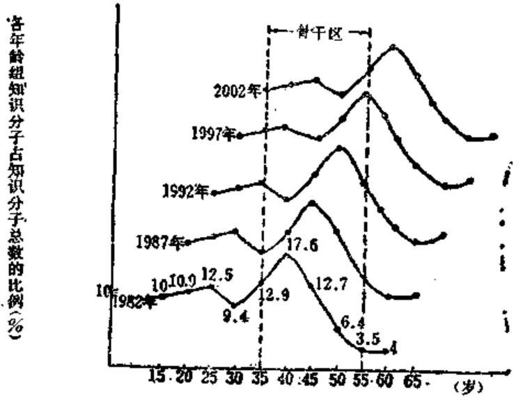
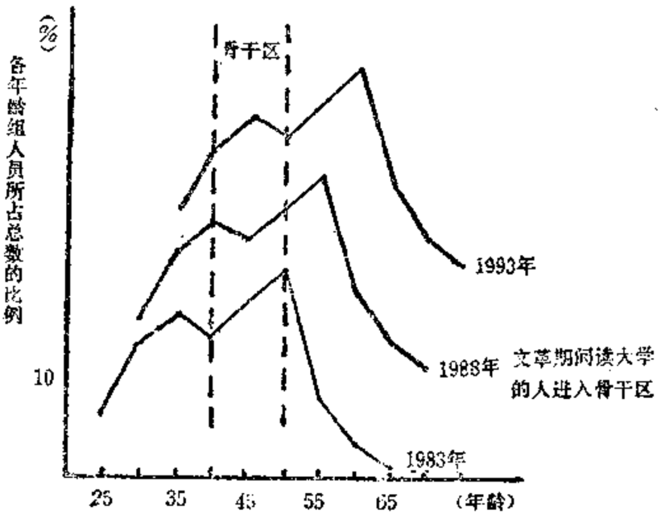
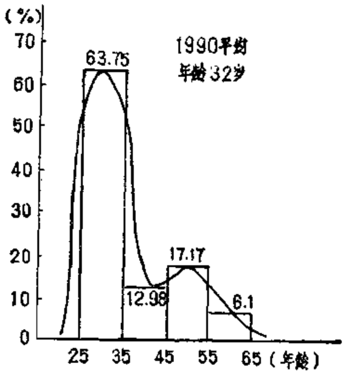
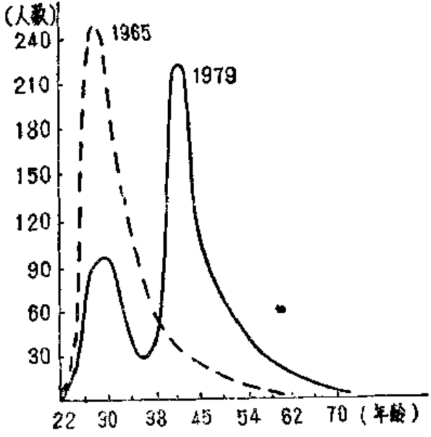

# 第十三章 十大危机的报复[^393-1]

        人类的历史日益成为教
    育与灾难之问的竞争。
            —— [英] H·G·韦尔斯

[^393-1]: 本文关于“十大危机”的预言，在3年前就提出来（《未来与发展》1985
年，第4期），现在的事实证明各种危机正在爆发之中

  目前普遍认为，各国在进入信息社会时，成败的关键在
于教育。

  在即将来临的一连串冲击之下，现有的教育结构，政策
和状态必定会出现种种断裂性的危机，我们必须有一个清楚
的认识。

  在教育方面有可能给我们造成重大困难的可以归结为如
下潜伏着的十大危机。

## 13.1 脉动式人口振荡的压力

  我国人口，一是基数大，二是属于年轻型，三是出生率
高，四是具有大幅度脉动的形式，这将会使教育系统产生难
以调控的重大嬗变，造或巨大的压力。即使按照最低的估
计，在未来的十几年内，我们还要增加两亿多人，每年要先
受教育然后投入劳动岗位的人口有2500万到3000万。而且到
2000年前后，我们将进入有史以来的生育高峰期，严重的问
题会继续出现。

  目前，我们的幼儿园全部容量只有1100万，还不到3
一5岁儿童总数的2成，且大部分为无系统教育的看管机
构；中等学校的容量只有需求量的36%左右，高校的在校生
仅占相应年龄组人口的1.19%。这样，未来我们必然还要面
对教育“先天不足”的一代人。更有甚者，我国的人口变化
具有骤增骤降的脉动形式（如前章图12.1所示），五六十年代
的两次生育高峰，必然会造成八九十年代的两个入学高峰。
其变化幅度近50%，有几百万人数之差异，世所罕见。教育
系统所要求的稳态的理想人口结构在长时期内不可能出现，
致使这个系统不可避免地要发生难以调控的重大嬗变。任何
粗略的教育规划，都可能导致把差异平均化和抽象化的错
误。我们现在是否有适应这种危机的恰当的对策呢？

## 13.2 文盲大军可能波及几代人

  据1982年的普查资料，最能说明我国人口文化素质的数
字就是在12岁以上人口中有2.35亿人属于文盲或半文盲。现
在，估计相应的数字已达2.5亿，占世界相应数字的30%左
右。我们每4个人就有1个文盲或半文盲，美国则恰巧是每
4个人就有1个大学毕业生。按千家驹教授1983年的计算，
我国的学龄儿童有70%实际上处于文盲，半文盲状态。

  联合国最近估计，世界成年人中的文盲人数为8.24亿，
而世界银行统计全球生活在赤贫中的人约有8亿。在这两个
8亿中，中国人约各占2.5亿。这与国民生产和教育发展水
平正相关。

  必须认识到，整个文盲大军所影响的，不仅是一代人的
问题，种种统计分析都指出，一个文盲充斥的国家，其影响
会波及几代人。有人对705名科技人员的家庭出身与父母文
化程度作过调查，结果如下表：

表13.1

------  ------  ------  ------------  ------  ------  ------------
                          家庭出身                     父母文化程度
------  ------  ------  ------------  ------  ------  ------------
          工人   农民     知识阶层      文盲    小学     小学以上
人数      123     161         421       109     240       356
%         18       22          60       15      34         51
------  ------  ------  ------------  ------  ------  ------------

  这表明，父母的文化程度与下一代有着明显的相关关系。

  我们应当强调千家驹教授提出的那个警告：我国教育落
后的这一严重状况如不能迅速改变，将会和50年代忽视人口
问题那样，带来严重的后果！

## 13.3 农村教育现状的可忧后果

  农业是国家三大战略重点之首。我们不能因目前农村中
出现的“万元户”而忘记一个基本原则：“没有第一流知识的
农民，就没有第一流的农业”。我国目前农村的文化背景是相
当严酷的：全国的80%的人口在农村，却只有10%的学校在
农村。全国2亿多的文盲绝大部分集中在农村；在全国4亿
多青壮农民中，有8千多万文盲、半文盲。据1979年统计，
30年来，我国高等农业院校培养的毕业生73万余人，实际留
在农业生产第一线的只剩25万人，流失率达65.7%。现在全
国平均6000亩耕地、3200万农业人口才有一名农业科技人
员，而且情况还在进一步恶化（参看第17章第4页）。如江西
省，1966年有科技人员9700多人，1976年降为7900人，
1979年又降为5000人左右。同样，贵州这几年流走7600多
人，山西流走21000多人。特别是大量教师弃教流走的情况
最令人震惊。仅河北保定地区，近3年弃教的教师就近千
人，最近自党政机关改革以来，全区又有633名教师调离。
其中，中青年骨干占90%以上。辽宁省自1979年以来，全省
中学骨干教师提前退休、改行流走达6300多人，占骨干教
师总数之半。兴城县3年间外流教师201人，就在县内改行者
达101人。有些中学已办不下去。辽宁师大政治系77属毕业
生78人有28人不到教育系统报到，中文系78届走读生90人毕
业，有半数不到教育系统报到。1986年8月6日《光明日
报》报道，安徽桐城县11所完全中学有8所校长要求辞职
（合肥市第一至第十中学也有7所学校校长要求辞职），1988
年5月，福建850名中学教师集体辞职，2800多名学生受影
响。近年据一些高师院校毕业分配的情形看，估计有百分之
三四十的学生未到教育第一线报到。如此下去，农村的劳动
结构无法改变，商品生产难以发展，整个社会的经济发展将
失去平衡，一代人又将被耽误。在这一点上，经济愈发达的
地区，眼光愈短浅，令人百思不得其解。1983年笔者在广东
作过一实地调查：全国的经济大县顺德，全县10个公社，竟
无一个国家技术干部；名震全国的佛山地区，全区平均每个
公社只有1.7个国家农业技术干部，平均每2.2万亩地才有一
个。在1982一1984年的3年间，广东发生打骂教师的事件共
585宗，而高考成绩又排在全国倒数二三名之间，1985年，
“一手抓教学，一手抓经济”，竟成了校长们的统一口号。有
人还作过一个调查：海南岛定安县多校村，过去一向是能人
才子辈出的地方。1979年全村在校人数是：小学102人，初
中45人，高中37人，大中专4人。那时，适龄青少年100%
就学。但1984年情况变化惊人：全村中学适龄人数94人，全
为健康者，但只有22人读初中，2人读高中，仅占25.5%，
其余了70人均离校回家。其他如安良村等，情况亦类似，是一
个普遍存在的严重问题。

[^397-1]: 见《中国教育报》1988年3月15日，1987年7月16月；《新华日报》1988
年4月20日；《学术研究》1988年2期。

  据新近报道，从1980一1987年，全国至少有4000万中小
学生弃学流入社会。仅江苏如皋县，1987年上半年就有5000
多学生流走。有些50余人的班，居然走了近20名。1987年江
苏全省流失学生13.9万人，且大部分为女生。在外国，义务
教育就是强制教育，香港亦如此。江苏率先宣布义务教育
法，却是如何了？广东的情况更不妙。有些县的小学，四年
级以上的，几乎成了清一色的“男生班”。东莞号称“广东四
小龙”之一，1986年的流生就高达1,500多人，其中70%为
女生。1980一1985年，广东小学生流失70.2万人之众。[^397-1]近
年更是有增无减。

  大学的情况，对农村同样不利。以1985年高校情况为
例，其中综合大学43所，毕业生3.81万人，招生7.40万，在
校生20.89万，教工9.73万；农业院校61所，相应数字分别
为1.95万，3.53万，10.23万，6.97万；理工院校262所，相
应数字分别为10.17万，20.56万，58.88万，35.97万。[^398-1]理
工、农业与综合大学之比为：毕业生数1:0.19:0.37，招生
数1:0.17:0.36，在校生数1:0.17:0.35，教工数1:0.19:0.27。
一个大致的综合比例为1:0.18:0.34。对一个以农业立国的
国家来说，农业教育的比例显然偏低。

  一个更为严重的问题是，从前几年开始的教师弃教、学
生弃学流走的情况，目前已从农村扩展到城市，从中小学扩
展到大学！甚至到研究生，大学教师。上海杨浦区几所中学
85%以上的学生认为“读书无用”，几个区的重点中学有30%
以上学生根本不想读书，大量学生要求退学。许多教师在校
园里以卖茶叶蛋作副业。贵阳市在“开辟第二职业”号召
下，一些中小学教师被迫课间在校园分工摆卖凉面、米粉、
面包等各种小食，班主任要轮值摆卖。有人还写文章称道
说：“君子不言利”的古训“被抛到脑后去了”，却不顾教师被
迫而为的现实和令人忧虑的后果与影响。

[^398-1]: 《中国百科年鉴1986》，第437页。

  目前大学受冲击的情况更使人震惊。要求退学的大学
生、研究生不断出现；无心读书，一觉睡到中午不起床的学
生比比皆是。北大的学生上街擦皮鞋，仅物理系就至少有10
名学生要求退学；复旦的研究生去当服务员，或经商搞承
包；几十名副教授报名要求当一个个休户的秘书（月薪500
元）；管理学院的年轻教师不辞而别。清华，中大、上海大学
等校的团委书记辞职，或去郊县公司任职，或当个体户。而
另一方面，各地大学毕业生，尤其是女毕业生愈来愈多分不
出去。1987年，人大50余名毕业生被用人单位退回，全北京
71所高校，21,217人毕业参加分配，有655人被退回：同年
全国大学毕业生有5500人被退回；教委直属的36所高校，
1290人被退回。[^399-1]这些情况“方兴未艾”，尚在继续发展中，
全国都应密切关注。

[^399-1]: 参看《人民日报》1988年5月14日；《广州文摘》1988年4月7日；《光
明日报》1987年10月21日、9月11日、10月30日；《中国教育报》1988年4月30
日。

## 13.4 提防出现新一代人的分裂

  近年来，我们事实上在执行一种贯彻梯度理论的发展政
策，这必然会使少数原来就有较好基础的地区在文化上“先
富起来”。

  我们还有一大批时至今日仍在土台，黑窑洞中上课，还
用破砖瓦、旧草席搭盖的真正说得上是破破烂烂的学校，怎
么办呢？许多学校有凳无台，有门无窗。我们曾经说过，仅
全国学校的危房即需约相当于近两年的全部教育经费来修理
的情况。此事叫了多年，至今未有认真解决。1986年6月9
日山西襄垣县一间小学因课室塌陷，当场12人伤，2人死
亡。就是一场悲剧。

  近年，教育投资的一点“增加”，仍然没有赶上人头费的
增加，更没有赶上通货膨胀的速度。特别在“经费包干”政
策下来后，本来就严重不足的教学办公费，更被“节支奖”
先行扣去一大部分，许多“办公费用”就通过学生转移到家
长身上。

  现在问题就出现了：一些“先富起来”的地区，国家规
定的每学期7元、5元的中小学学费，实际上已变成30元、
50元、70元，甚至上百元，这是地区经济发展必然要刺激教育
发展的结果。但是，在大片经济落后地区，如何能承受这种经
济压力呢？与此同时，国家太过微弱的投资力量和平均主义的
投资政策，在短期内又无法改变地区教育差距扩大的趋势。

  如此下去，地区文化水平的差距同样将继续扩大，这不
仅给提高全民族文化水平的目标造成重大障碍，而且新的一
代人，有可能产生分裂的危险。

## 13.5 人才链断裂的危机即将爆发

[^400-1]: 《科技人才及管理》，科学管理研究编辑部1983年，第250页。
[^400-2]: 朱钧佩：《论人才的良性循环》，《扬州师院学报》1983年3月。

  文革十年中，我们少培养了160万人才。根据1978年的
统计，当时我国全部助理研究员以上科研人员平均年龄为48
岁，全部正副教授以上的科学技术人员平均年龄为58岁。学
部委员为73岁，当时我国科学家年龄谱的峰值已超过60
岁。[^400-1]实际上已全部进入退休期。全国91个学会的理事长，
中年人仅占2.2%，30个理科学会的理事长平均72.3岁，全
国科研人员中，35岁以下的不到1/4，即近3/4的人在2000年
都要退休。[^400-2]近年来的情况并无好转。据1984年10月公布的数
字，我们高校只有教授4,427人，其平均年龄超过66岁。中国
科学院共有374个学部委员，平均年龄为70岁。在全国科协所
属的82个学会的会长中，50岁以下的一个也没有。全国共有
博士指导教师1,788名，而65岁以上的占52%。复旦大学中
文系的博士指导教师平均年龄超过86岁。

  再把我国1978年科技人员的年龄按51岁以上，50一46岁，
45一36岁，35岁以下，分成四代，则各代人数占科技人员总
的比例为10.7%、14%、55.4%和19.9%。[^401-1]这19.9%的第
四代所受的就是文革型的教育，他们从1985年开始正走上全
面接班的道路。这批人中有一批特殊历史背景下磨炼出来的
出色人才，但总的说不仅数量少，而且底子薄，素质较差。
而这个时期，我国正处于现代化建设转向高速发展的紧要关
头。文革型教育遗留下的一个极大的潜伏危机，势必爆发。
我们在文革期间缺失了10年的正式大学毕业生，即少培养了
约160万人。这实际上是无可挽救的损失。

  到了2000年，由于我国老年人口将从目前的约8,000万
增至1.3亿，35岁以上的高、中年劳动人口比重增多，即劳
动人口老化，青少年人口减少，特别是目前40几岁以上的骨
干全部进入退休期，目前20岁左右的人将或为社会中坚。而
他们生于困难时期，长于动乱时代，学于调整之年，是文化、
学识和修养都准备不充分的一代。

  按照1982年7月的普查资料，[^401-2]把15岁以上的知识分
子，按比例的分布曲线装述如图（13.1）。

[^401-1]: 朱钧佩：《论人才的良性循环》，《扬州师院学报》1983年3月，第750页。
[^401-2]: 数据见《光明日报》1981年6月17日，《我国知识分子的数量、构成和分
布》一文。

（数据来源见《光明日报》1984年8月17日）

  从图上可以看到，曲线有个深谷，以1982年时为25至35
岁的人为界，谷底在30岁的点上，这个深谷进入人才骨干区，
从而产生最大影响的时间为1992一2002年，谷底出现在骨干
区中心点的时间是1997年。这一年将是我国人才整体不论在
数量和质量上都是最弱的危机点。而这个时期，我国正处于
现代化建设转向高速发展的紧要关头。值得注意的是，各省
的统计情况所得的曲线簇与此基本一样。如下图（13.2）为
广东省相应的曲线簇。

  与此问题相关的是：实行开放政策之后，人才的走向同
样令人担忧。一大批有才能的青年人，被吸引到小车司机、
服务员、导游、个体摊贩等职业中去了。在一些开放地区，
考上高级宾馆当服务员的一些青年，比考上名牌大学还高
兴。而这一切，还以“开拓精神”来加议赞扬。

（数据来源见1984年广东省专门人才规划预测办公室公报）

  我们再来作一个更具体的分析：1980年我国教学人员的
平均年龄约36.8岁，科技人员为38岁。后者在1985年为35
岁，到1990年约为32岁（见下图）。

  整体是年轻化了。但其中潜伏着一个危机：35一45岁的
中年骨干大幅度减少（仅占总数12.98%），且他们几乎全是
文革期间上大学的毕业生，这部分骨干，1985年仅为1980年
的57%，1990年更降为1980年的29%。这就是1971一1980年
大专毕业生骤然减少的恶果。到1990年，不仅整体人才缺
乏，而县高、中级人才会出现大空缺。

（来源：《未来与发展》1982年3期，第4页）

## 13.6 最可怕的恶性循环

  笔者不久前曾听一位学生家长诉说一件事：他在初中读
书的一个孩子在课堂上问数学老师：“为什么要先乘除，后加
减？”那位老师想了一下后回答说：“那是国务院规定的。”我国
1983年统计的大中小学教师为923.4万，单看绝对数不算少。
但如前章所述，其中有相当一部分是荒唐地层层硬拔上来
的。1978年的教师比1965年多了6.7倍，这种可疑的“增长”，
焉能不造成教师合格率降低的恶果！我们的中小学教师有
48%是由中等师范学校培养的，由高等院校培养的仅占11%。
按1982年的估计，学历合格的教师，高中为30一50%；初中
为10%。实际能胜任工作的约20%，基本能胜任工作的约
40%，有较大困难的约占30%，根本不能胜任工作的约10%。
全部教师中，约有1/3是不合格的，达300多万之巨。贵州
初中教师达大专以上水平学历，高中教师达大学本科以上学
历的比率分别比全国水平高84%和34%，情况不算差。但1983
年就所用教材进行的一次考试，全省教龄未满25年的教师中
的及格率（80分以上）小学语文只有15%，小学数学7%，
初中语文22.9%，初中数学14.2%，初中物理29%，初中化
学38.4%，一些县的平均合格率只有0.3一7%！还有大学
本科毕业教小学算术100%不合格，教初中数学只考得6分；
大专毕业教小学语文和算术近90%不合格，最低只有9分，
中专毕业教小学90%不合格，数学竟几个县不止一个人考零
分，语文也只考4分！整个地区学生的毕业率也只有10一
20%。[^405-1]有人批评说，我们的教育界不搞教育，师范不搞师
范。许多师范学院千方百计去掉“学院”改成了大学，甚至
还想去掉“师范”两宇，实在至为奇怪。

  不合格的教师教出不合格的学生，然后，不合格的学生
又将成为不合格的教师，学校变成了制造庸才的机器。这是
教育系统中最可怕的恶性循环。

[^405-1]: 王小强等，《富绕的贫困》，四川人民出版社，1986年，第123一125页。

  危机在于客观制约因素太多，我们在短期内很难开拓解
脱困境之途，除非中央采取非常措施，而这种可能性是不大
的。原因很简单，仍在人与钱：师资问题又要师资，经费之
外又加经费。仅这3百多万教师的进修问题，粗略一算便要
130亿元之巨，据有关部门的预测，到本世纪末，需要补充
普通中学师资320一350万名，另外中技和职校又需补充近300
万名，而现有的约800万名中等学校教师，仅约30%合格，即
有近200万需再培训；再加上解决其他教师知识老化问题的
需要，按我们的计算，到本世纪末，师资培训量达800万之
巨。目前，我们仅有高等师范院校200所（1983年），约占高校总
数26%，学生有32万，占大学生总数的25.5%。教师不足5
万，整个高师的年培养能力不过8万人，要整整一个世纪才能
培养出800万人来！我们要每年培养50万人以上，才能在16年
内解决这800多万人的问题！是1:6！仅仅普通中学每年要补
充的教师就达20万，如果我们考虑到未来的“全员教育”方
针，则我们要面对近5亿就业人员（目前4.3亿）所需的师
资更远在800万以上。

  而对如此巨大的客观需要，我国高等师范教育现状的实
际承受力又如何呢？水平低，经费严重不足，设备落后不
堪，校舍紧张之极，图书资料紧缺。整个师范教育，社会不
重视，学生看不起，师范院校毕业生约有半数不愿当教师。
在200所高师中，只有2所重点大学、6所部属院校力量较
强。另有67所稍有基础，而高等师专119所大部分是近几年
从中师拔上来的。在约5万名教师中，只有2900多名正副
教授，且绝大部分集中在几所学校里，不少师专连一名副教
授都没有。1983年，我们有中师86所，幼师竟只有36所！靠
它解决几千万幼儿教育的师资问题，不用说，这会是一个什
么结果。有人提过每个县要设一所师范学校的计划，这样，
我们至少要有2136（全国县数）所，而现在高初师全加在一
起不过1100所左右，还差一半。至于说到教师的待遇，工作
与生活条件，问题便更多了。这些问题叫了多年，口惠而实不
至，这在思想与观念上造成的全社会对师范教育的离心力是
难以衡量的。其中所潜伏的危机，不言而喻。

  我们顺便指出，有些同志仅仅根据我们高校师生比不大
的事实便断言，我国高校有很大潜力，其实这只是一面之
词。只要考虑到教师的质量、年龄与知识的老化，以及环境
条件与管理的实际情况，便知道，我们实在不可乐观。有人
估计，高校教师有30一40%是水平低于要求的。李洪基等曾
对湖南省中南矿冶学院，湖南农学院、湖南医学院、湖南师
院等四学院全体教师进行统计分析，结果发现1979年与1965
年比，许多指标变化很大。如：年龄分布的峰值29岁变为43
岁，老化严重，且1979年曲线有主次峰，两峰之间同样有个
深谷，在32一41岁之间，这是文革的损害痕迹。这个深谷将
在最近的几年内产生一场持续十年之久的巨大震动。如下图
所示约在80年代末90年代初，当深谷起作用时，不仅人数少，
学术水平下降，而且全国各个行业都会与高校争夺人才。高
等教育会进一步面临危机！

（来源：《教育研究》，1981年，第3期）

## 13.7 硬化的教育系统

  目前，教育结构的变革势在必行。随着第三次浪潮的冲
击即将到来，我们必须为培养未来的社会变革所要求的新的
人才作准备。新的人才结构，除原有的农、工、医、文、史、
哲之类外，需要大力发展政法、商业、服务业与管理等职业
教官，而首先需要这些方面适量合格的师资。这是现有的
高校难以解决的。

  以中国下一代的命运之神——管理人才为例。目前，我
们的管理干部约有1,200万，据有些省在前两年的调查，我们
约有2/3的厂级主要管理人员不能胜任工作，而我们的管理
教育一直十分落后。1979年，全国598所高校中，只有20间
财经院校，在校生9600人，加其他院校管理系学生也只有
18190人。而全国工业企业有35万个。企业与该专业学生比
为20:1，按此，要40年时间才能每个企业分配一名管理专业
的学生；1981年我国财经院校发展为36所，但在32所综合大
学中，竟有26所没有设经济系，管理专业更为奇缺。1980年
我国有工业企业35.5万个，社队企业148万个，商业企业146
万个，即共有企业329.5万个。到1986年，工业企业发展到
49.93万个，但建国以来，大学和中专培养的财经干部不到
50万，占职工总数的0.6%。近年把大批科技人员转去搞管
理，到1982年4月止已达47.5万，占科技人员总数570万的
8.3%。据预测，到2000年我国财经管理专业所需的大专单业
生约为100万，而我们的大专学校不仅数量少且分布不合理。
1983年前有10所以上的只有河南、四川等5省，有5一9所的
有10个省，约1/3的省是没有专科学校的。物资管理专业各地
急需，但全国到1983年也只有航空工业部的一所学校开设。

  比较一下，1979年美国有600所大学设有管理学院或系
科，有学生70万，研究生10万，两者共占在校大学生总数的
8%，已经有50多万人得到管理倾士证书。哈佛大学曾统
计，近10年间在美国提拔的11000名大公司经理中，博士占
3一5%，硕士占18一25%，学士占48一49%。在1960至
1970年间，美国的就业人数只增加20%，而管理人员却增加
70%以上，1976年美国各公司培训376万人，其中有140万人
学管理（占37%）；共开支18亿美元，其中4.3亿为管理培训
费用，占24%。[^409-1]日本有34个管理学院，仅1970年从事管理
职业的毕业生便有77万人。苏联已培训过400多万人，现在
每年约有140万经济干部参加学习；1975年罗马尼亚县一级
领导有80%受过高等教育。

[^409-1]: 《管理人才与管理教育》，第120页。
[^409-2]: 见《杭州大学学报》1984年，第1期，第17页。

  按日本的经验，培养一个高级管理人员约需16一20年，
要形成一支企业管理的专家队伍约需10一12年。可见，在我
国80年代后期开始的人才低谷中，管理人才问题将显得极为
突出。目前我国受过系统管理教育的人都在50岁以上，而在
1970年前后的十几年中，我们的高校没有正式培养出一个管
理专业的大学生。[^409-2]我们从1981年起，才开始有这方面的毕
业生作少量的补充，他们要在90年代才能成为骨干，可以说，
直到90年代后期，所能补充的数量均是极其有限的。这是我
们即将出现的人才危机深谷谷底上的一个难填的深沟，它必
将成为整个经济高速发展所不易跨越的障碍。

  此外，计算机软件、法律，会计、商业、咨询、金融和
许多服务行业的情况，同样如此。据最近联合国的统计，在
世界128个有较完整统计数字的国家中计算，中国第三产业
仅占20%，为倒数第一。法律方面的情况亦一样。按《人民
日报》1980年11月5日公布的数字，全国只有专职律师3千
名。至1982年，连兼职律师在内还不到1万名。平均十几万人
才有一名。同期美国有律师44.5万名，平均500人中有一名；
英国有律师3.5万名，平均1400人一名：西德有律师3万
名，平均2000人一名；新加坡有律师3300名，平均700人
一名。若到2000年，我们只要求达到西德1982年水平的一
半，即每4千人有一名律师，也需要32万名（接12.5亿人口
算）。不言而喻，实现的可能性极小。1979年至1985年中旬，
我国公布了200多个经济方面的法规。一些大学毕业生提升
为工程师、厂长后，对法律一窍不通，违章违法事故不断发
生，与外商谈判吃亏的更多。以在国内最具人才优势的上海
为例，目前，全市仅有一个30多人的会计事务所；专职律师
只有200多人，若按每万人应有1.5人的比例，只达要求的十
分之一；上海的自动化售货系统建立后，要与上万个企业、
事业单位联网，需要七八万信息处理人员，而现在只有二三
十分之一。又据司法部估计，我们现在起码缺1一2百万司
法干部。新闻教育方面的专家预测，到2000年，我国新闻战
线需补充大学毕业生11万，其中新闻专业9万，平均每年
5000，总数为建国30多年来的总和。

  这一人才结构的变动问题，将会在教育系统中造成一次
剧烈的震动。我们必须在这次震动所带来的新局面出现之
前，做好应变准备。

## 13.8 职工教育的难题

  1984年在我国5亿多农业劳动力与职工中受过高等和中
等专业教育的只有约1千多万人，仅占总数2.5%左右。1979
年有人据全国23个省市区的1645万名工人调查，他们的技术
等级为1一3的占71%，即近四分之三处于初级技术水平。
同年对工交战线两千万职工调查，初中以下文化程度的人占
80%。[^411-1]

  我国工业系统中的科技人员仅占全系统职工总数的
2.9%。 [^411-2]

  1957年便提出的中学学生的就业问题因未解决好，10年
后便演成大规模的上山下乡运动。这一大批人的知识基本丢
光。

[^411-1]: 见《红旗》1983年，第16期，第20页。
[^411-2]: 《人民日报）1981年4月1日社论公布的数字为2.8%

  我国国营企业职工的平均受教育年龄只有8年多一点，
几乎30年没有变化。日本就业人员文化水平：1965年高中毕
业生占46.8%，大学毕业生占11.4%，到1975年，相应数字
变为57.3%，33.6%。我国机械工业劳动生产率仅为美国的
1/10，为日本的1/5；每个职工的年钢产量，美国为我国的
26倍，日本为31.4倍，苏、英为10.6倍。

  从以上的情况，大致可以知道我国目前就业人员的文化
背景如何。按规划，我国到2000年国家职工会增至2亿左
右。按最近的一个测算，今后20年内，我们约有4.4亿人就
业，即平均每年有2200万人[^412-1]要离开学校投入劳动岗位，是
个教育的年度常数。且最初几年，每年的平均数达2680万
人，而最后几年降为1840万人，还有大约1一2亿个劳动
力从农业中转移出来。这样，平均每年职工的教育量达2500
一3000万人！但按1983年统计，我国只有1408所职中，在
校学生53.87万，在805所普通高校中只有169所办夜大学（155
所办函授大学），除函授外，培养能力太低。考虑到这些人之
中的新文盲、知识陈旧周期缩短等等情况，再加上技术改造
会造成就业的暂时困难和急促变化的社会动态，我国的职业
教育不可避免地要面临一场重大的挑战。

  职业教育的一个难题，是如何使我们高等教育系统的毕
业生能够适应未来社会结构变化的需要。有人调查我国1965
届大学毕业生5年后的知识陈旧率为45%，10年后为75%，而
国外有人认为，一个人从大学只能获得约10%的有用知识。[^412-2]

[^412-1]: 王胜泉：《试论2006年我国的劳动就业问题》，《未来与发展》1983年，第3期。
[^412-2]: 见《百科知识》1984年，第4期，第8页。

  我国的大学生，必然要在未来面对一个激烈竞争的、不
稳定的职业市场，这首先是由国家的工业结构变化所引起
的。据美国劳工部专员艾伦豪特提供的资料，60年代的美国
大学生，90%的人进入专业性、技术性和管理性的岗位，
但到70年代，这一比例降为68%。于是，竞争不可避免。另
一个变化是向服务性工作的转移。1982年，美国非农业职工
中有73%属服务行业，每5个有大学毕业学历的工人中，4
个在服务性行业工作。30年来，美国服务性行业职工人数增
加了146%。在美国经济新增加的每10个职业中，服务性行
业约占9个；而同一时期，制造业、建筑业和采矿业增加不
到29%。[^413-1]日前美国有28,000种职业，从1949-1965年，西
方有8千种职业从劳动力市场消失，而同时有6千种新职业
出现。西德人已把职业教育看作是经济发展的柱石。他们规
定，在9年义务教育后未能升学的，要接受技术教育至18岁。

  未来，一个人的一生，一般会碰到4一5次职业变动情
况。这使我们的学生，包括大学毕业生都要重新接受职业教
育。美国人已把在职科技教育称作明日的第一号明星。我们
的职业教育系统能够健全起来以适应这一挑战吗？

  目前，我国的中等职业教育本身是非常落后的，全国
1983年的5,481所农业中学与职业中学只有122万学生，只比
高校学生多出2万人！

  成人高等教育的问题更多。到1984年9月止，我国成人
职业教育系统情况如下：[^413-2]

[^413-1]: 见《国外社会科学》1984年4期，第34页。
[^413-2]: 数据摘自《光明日报》1984年9月28日，其中，中等学校的数据与上一章
总表差距很大，估计为轨计口径问题。

表13.2

-----------  ------------  -----------  ------------  -----------  ------------
商等学校                    中等学校                    初等学校
-----------  ------------  -----------  ------------  -----------  ------------
学校数（所）         人数   学校数（所）          人数   学校数（所）         人数
1196                113万       9.66万         675万       21.9万         817万
-----------  ------------  -----------  ------------  -----------  ------------

  这一特况是非常奇特的。全部学生不足2千万人，但学
校却有30多万所，平均每所不足61人，总人数不足我国目前
职工总数的4%。未来，终身教育与全员培调方针，就职人
口的高学历化趋向等，必将对我国的职业教育系统产生一次
巨大的冲击。

## 13.9 最大的危机可能来自内部

  任何一个系统，最大的危机可能来自内部。我们的教育
系统，为着要面对现代化、面对世界和面对未来，首先就要
认真地面对自己。事实上，我们在自己的教育政策、学校管
理、体制、教材和教学方法方面存在着种种重大的弊病。

[^414-1]: 见《国外社会科学》1984年4月。

  首要的问题是，任何一个正常的发展都需要有一个正确
的出发点和首尾一贯的方向。可惜，我们的教育政策却一直
是摇摆不定的。美国的著名学者S·罗森最近在《中国过渡
时期的教育》[^414-1]中批评我国教育政策摇摆在两种似乎最根本
对立的观点之间，一种观点强调教育的经济意义，另一种强
调政治意义。他称前者为学术模式，它要建立以等级制为基
础的学院教学模式，后者称为革命模式，它要强调平等主义
的教育结构。前者强调质量，后者强调数量。事实是，两个
极端我们都走过。“普及高中”的恶果我们还在承受而未得解
决；学院模式的危险却未能很好认识。S·罗森曾指出，这
些危险在于：

（1）教育的其他作用会被忽视；

（2）扩大了等级差别，使学生处于新的不平等地位上；

（3）有助于形成学历社会的偏见，会使许多青年的社
会问题难以解决。

  我们能否在这两种模式之间找到一个平衡点呢？这对于
我们好走极端的管理者来说是不容易的问题。

  同样的问题也反映在教材与教法上。

  美国哈佛的管理学教材，每年有20%被淘汰。[^415-1]世界上
最有权威的生物学教材：每5年要改写一次。其他课程的变
动速度也是我们目前所赶不上的。在教育方法上问题更严
重。我们的外语教学就极其失败。苏联的情报学校1年半便
可培养出能监听敌台的人才，我们用4年时间还不成。美国
普林斯顿大学在我国招100名计量经济学留学生，经济系的
学生考不上，就是因所学课程太旧，搞计算机的、搞数学的
理科学生反而考上了。30多年来我们搞了多次教改，每次都
改掉一些东西，唯独教学法不改。就象旧祠堂里的神主牌一
样，30年一贯制竖在那里。宦乡同志在1984年中国未来研究
会春节学术座谈会上讲活时指出：“教育方面，我们是落后
的，“……教育要改变，根本的一点是教育方法要改变。”

[^415-1]: 《管理人才与管理教育》，第112页。

  目前，陈旧的传统教育观念在我们的教育系统中仍然根
深蒂固。以传授知识为主的教学目的，以课堂课本为中心的
教学形式，重理轻文，重工轻商，重技术轻管理的教学内
容，都是很大的弊端。严格地说，学习一个已知解答的问题
是培训，而学习一个未知解答的问题才是教育。我们目前的
“教育”基本上还是培训。这种传统受到指责的主要之点在
于：它把人的知识框定在一个狭小的圈子内，把在这个知识
圈内的知识积累作为培养目标。人的智力与才能的高低，全
由这种积累的多少来衡量，被称为“仓库理论”。这种理论虽
然在过去已备受批判，但由它所造成的矛盾在过去还不很
突出。因为，在社会变化发展较为缓慢的时代，最新的知
识、教科书与实际应用方面三者的差距所造成的矛盾还不很
尖锐。旧的生产方式通过教科书来接受新技术的速度是很慢
的。

  现在，事情正在起变化。研究表明，目前最好的教科书
上的知识一般要比最新的科学技术知识落后5年。未来，在
社会急速变化的时代，特别是在社会与知识发生迅速的结构
性变动的年代，这个问题便显得十分尖锐。如果我们的学生仍
然被培养成一个书虫式的人，将会迅速被社会淘汰。

  “述而不作”是旧教育的一条基本原则，至今仍强烈地
影响着中国的教育。

  学生总想“多学”，教师总想“多讲”，选课时最多的课
程，争讲课时间。整个教学系统基本上还是传道、授业、解
惑的结构。这种传统，一再被暂时不可避免的考核制度强化
了。

  不妨称中国的传统教育为“述”性教育，它在今天成了
抑制创造性的重大压力。

  东西方教育的一个重大差别是，东方人重视学历、资格
和“述”的能力，西方人重才智，潜能和创造的能力。前者
考试能力强，独立精神弱，知识量大，创造力低。

  科研与教学的长期分离，已使中国大学的教师失掉创造
力而成为真正的教书“匠”。教育者必须是创造者，这种现代
的教育观，远未在中国教育界确立起来。

  “大学”（University）一词来源于拉丁语中的“公司"
（Corporatien），而大学宿舍只不过是同业公会计划的延
续。大学教育的圈子本来就是这样产生的。可是后来，教育
与工业分家了，学者们对工业界以不屑一顾为荣。他们的学
生自然非学榜样不可。只是时至今日，西方的教育已开始返
回它的出发点——“公司”和“大学”又开始具有同等意义
了。我们的大学，却仍在不遗余力地集中培养书呆子。

## 13.10 “穿过地狱般的”社会出生的威胁

  虽然目前弃教、弃学日渐增加，但这肯定是不可以长久
发展下去的。只要中国的教育系统还在寻求发展，那么，就
会有一个容易被接受的判断：[^417-1]中国很快会步日本与西方的
后尘，走入“学历主义社会”。这一社会，使人经历了“生物
出身”之后，还要经历一场有如“穿过地狱般的”社会出
生。其出生证就是学历证书。目前，各国政府无论如何改
革，这种竞争还是不可避免。特别是名牌大学及热门学科尤
为突出。

[^417-1]: 参看《外国教育情况》，1982年1月，第14页，吕可红《日本近年来高等教
育招生制度的改革》

  学历社会的一些被指出的主要危险在于：

  这种竞争会迫使一些有能力的人不是为将来的事业打下
牢固的知识和能力基础，而是整天苦于考试技巧的磨炼。这
已成为一种社会弊病。偏重学历的考试，“一考定终身”，实在
是误人误已。由于一些只会考试，不能适应学习要求的人被
招进来，高校本身将首先受害。

  目前的招生制度对中学造成严重的影购，高考试题成了
高中教育的指挥捧，教师划地为牢，学生唯题是攻，大家
“明知故犯”，一时不易解决。

  此外，大多数思想家认为，目前各国的教育制度，“绝对
不足以达到民主的目的”。

  所有这些问题，事实上我们至今尚无对策。加上我们还
会碰到诸如二流知识分子大量增加，高等教育产生出大量的
新“文盲”，学生的体质下降等等问题，构成阻碍发展的威胁
性壁垒。

  最后，我们必须提到，教育危机问题已从社会科学家们
的探讨转入文学家们的视野。不久前，作家苏晓康在《人民
文学》上发表《神圣忧思录》，描写教师的悲惨境遇，不仅使
老作家冰心女士激动不已，发表了《我请求》一文，而且使
千家驹教授在1988年的全国政协大会上再次慷慨陈词，向全
国转述苏晓康的发问：“报复将在何时？”。千家驹教授指出，
“目前我国小学教师的待遇相当于香港小学教师的1%，大
学教授待遇相当于香港大学教授的1/50。无论是大学或小学
教师的实际工资，都达不到抗日战争前旧中国的1/10，一点
不假地到了“斯文不如扫地”的地步。报复将在21世纪出
现！千家驹再次指出，“对教育的漠视，其后果之严重将远远
超过人口问题。这是令人不寒而栗的。”他特别提到稿酬征税
的问题：旧中国的稿酬比现在高1一2倍，却未闻有所得税
之说，而我们的征税规定，文化界多次呼吁，均未能取消。
千老叹说：“执此一端，亦可说明我国尊重知识、尊重知识分
子，空言多于实际了。”

  让我们用北大校长丁石孙教授的话来结束关于教育问题
的讨论：不重视教育，不重视知识分子待遇的人将是历史上
的千古罪人，[^419-1]未来将为我们的结论作证。

[^419-1]: 《中国青年报》1988年4月5日。

