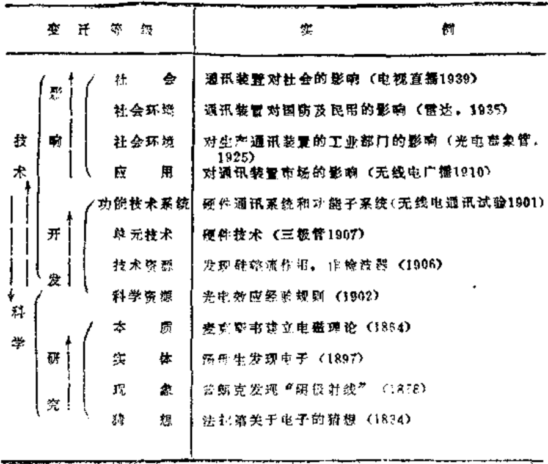

# 第十四章 穷人的假上蒂

      中国人有时太天真，太
    理想化。想到久远未来会需
    要什么，今天就大干起来，
    这是完全不合算的。
            —— [美] 杨振宁

## 14.1 电子传教士的现代神话

  中国现代的一切事情都非常富有戏剧性。当世界各个主
要国家对：“悄消来到”的据说是由科学技术革命挑起的新的
产业革命，早已作了长久的热烈讨论之后，我们直到1983年
的7月底，仍然几乎“鸦雀无声”。在这之前不过几个月，托
夫勒应中国未来研究会邀请，前来访问中国，我们竟没有一
个国家级的干部愿意去会见他。[^420-1]他的《第三次浪潮》的录
像片带来了，不让看；他的《第三次浪潮》早已翻译好了，
迟迟不得出版。[^420-2]托夫勒在70年代早已震动世界各国的《未
来的冲击》一书更退至1985年才翻译出版。

[^420-1]: 托夫勒在1983年1月访华，只有《第三次浪潮》的译校者中国未来研究
会的会员、中国社会科学院美国研究所的研究人员姚综一人陪同。

[^420-2]: 现在的中译本也有多处删改，其中第24章《历史的洪流》是全章删去的。

  戏剧性的序幕发生在1983年7月29日。这一天，《世界经
济导报》发了一条西方的普通消息。当时谁也没有想到，这
成了后来中国发生一场科学技术大地震的导火线。这条消息
说：据美国《芝加哥论坛报》报导，美国科协副主席认为：
将出现以微处理机、遗传工程、新能源、新材料为主要内容
的第四次产业革命。……

  重要的不是这条消息，而是赵紫阳总理重视这条消息。

  同年10月9日，赵紫阳召开座谈会，布置任务，研究西
方所谓的“新的产业革命”，及其与我国现代化建设的关系。

  11月5日，国务院技术经济研究中心，国家计委、经
委、科委联合举行“新的产业革命及我国的对策”研究动员
大会。

  11月8日、12月3日，胡耀邦总书记接连就现代科学知
识问题作了重要批示，其中特别指出：现在主要困难是我们
一大批经济管理、技术干部缺乏现代化科学技术知识，有些
同志又缺乏这方面的进取精神。对世界上最新科学知识，最
新的先进技术，最新的科技动向，反应迟钝，没有每年每月
每周去询问、打听、跟踪的热情。

  这样一来，按照中国人服膺权威的传统心理定势，这场
地震是必然要发生的，震中的主动力其实也不是赵紫阳与胡
耀邦的那几段批语。而是“总理”与“总书记”这几个字在
中国人，尤其是在中国干部心头上的异乎寻常的张力。

  自此之后，有关科学技术革命、知识革命、信息革命、
产业革命、第三次浪潮、大趋势的宣传介绍，铺天盖地般席
卷全国，仿佛明天一觉醒来，这个世界就会全变了，大有山
崩地裂之势。

  然而，宣传的热浪过去之后，实际的进展却有如步履蹒跚
的百岁老人。今天，应该是我们作出反思的时候了。

  近几年，关于科技—产业革命前景的宣传介绍，可谓
五花八门。国内外的一些宣传家、社会科学工作者和一些试
图为自己的研究工作取得支持的自然科学工作者，凭着各自
不同的自然科学常识的套用，不断地借用、改编、创造和发
展各种各样令人眼花撩乱的名词、术语来描述他们所从事的
活动，以及他们的信念。什么信息爆炸、知识革命；什么“三
大前沿”、“四大领域”、“五大技术”[^422-1]；什么社会生活将会
根本变革，人类的思维方式将会彻底改变……等等，等等。
我国科学技术的现状与实际的发展进程很少被理论家们提
到，却反而被淹没在浩瀚的新名词和新概念术语的大海中
了。

  有人说：“在旧产业革命中，曾经发生了“羊赶跑了人”的
现象。在这场新产业革命中，机器人将会取代蓝领和白领阶
级，小小的生物反应塔将驱逐临海的石油化工企业，光电特
性良好的非晶质元件可能使巨大的火力发电站和通讯设施变
成废物”。还说，西方人士惊呼：如不采取对策，新的科技一
产业革命将使现在的工业发达国家变成21世纪的“工业恐
龙”，消失在地球上。

[^422-1]: 通常这是指：材料、生命、倍息；原子能，宇航、计算机，生物工程；
计算机、生物工程，能源、材料、海洋工程；运有所谓“十项关键技术”说：
机器人——传感技术、复合材料、表面技术、循环方法、遗传工程、计算机辅
助设计和辅助生产、生物物质技术、远距离通讯、储能技术、微处理机。这些，
都被认为是新技术革命与新产业革命的主要标志。

  又有人说：这边说着很快的日语，那边的计算机就把它
转换成英语而从扩音机里播放出流畅的英语来；今后30年左
右，“生物学将取代化学”，“生物技术革命”已经开始，25年
后，石油资源枯竭，那时代替石油化学制品出现的将是经遗
传学技术改造过的细菌以及由酶所制造出来的东西。“生化能
源”时代即将到来。并且，“利用这些东西能生产出上万种产
品，如肥料，塑料，无需电熨的衣料，农药，染料，涂料
等”，分子仿生学、医学仿生学可制造”人造细胞”，进行“分子
修补”，甚至模拟生物的“组织再生”。

  西方更有人说：到90年代，大多数人都将拥有并应用人
工智能机来放大我们的脑力，从帮助我们解决各种家务直到
帮助我们建立一个“明智的政府”。而且不久，人戴上一顶可
以随意脱戴的装有某种拾波器的帽子，将能直接通过他自己
的思维过程编制计算机的程序。这时，你可以坐在沙发上，
接通“神经电话”，让算计机直接向人的神经系统“讲话”。于
是，思想可以被“读出”，智能会直接被“放大”。这样，我们
不仅可以建成让算机乌托邦，而且即将要达到“智能上的末
日”了。

  这些议论，就目前来说，正如计算机算命与复制天才一
样，绝大多数都不过是电子传教士的幻想与神话。有许多说
法，追寻其根源，乃是西方与日本一些风险型企业家做宣传
广告的产物，还包括一些想发财的科学家有意作出的夸大的
宣传。

  现代科学技术对社会、经济、政治、军事、教育，人的
思维方式和生活方式无不产生影响，致使整个人类社会不断
发生变化。这是个无可否认的事实。但是还有另一个事实，
现代科学技术对先进的国家和后进的国家，对富人和穷人，
有者完全不同的两副面孔，特别是那些神话。如果只是在课
堂上当作一种未来的幻想讲给学生们听听，唤起他们对科学
的热爱倒无不可，但如果以之作重大对策的咨询意见，如果
我们某些太过心急的决策人，据此立即拿出大笔资金，“抢先
引进”，“优先发展”，那样，事情可就糟了。

  两年前，著名的日本学者武谷三男和星野芳郎就据露过
“生物工程学的真相”。[^424-1]他们引用日本记者在美国的实地调
查报道：曾乘生物工程热潮，带头大肆宣扬“幸福美梦”的
125家风险企业，半数以上遭到破产或在资金周转上处于一筹
莫展的困境。早已宣告制成的生长抑素（1977年，脑激素）、
胰岛素（1977年）、生长激素（1977年）、干扰素（1980年）等，
在市场上却“无所见闻”。似平所有单细胞生物中试验成功的
东西，对高等生物均难以适用。

  以为尖端科学必然会导致尖端技术，从而又开辟一个新
的技术时代，正如核分裂导致制成原子弹一样。这种观点，目
前至少还是一个疑问。

[^424-1]: 【日】《现代技术政治>，第一章“新产业革命的幻想”，1984年5月。

## 14.2 征服世界的游戏

  目前，人们对于现代科学技术百般迷信、至为倾倒的，
无过于计算机。笔者不仅在学生时代就参加过国内“第一代
计算机”的试制工作，而且也曾当过计算机的吹鼓手。可
是，实际情形并不象所传的那样神乎其神。至少目前其精
巧、灵活、适应性仍很差，远不如人脑。被称作“电脑”的
计算机不过是一部通用数字计算机；人脑则是通用问题解决
机（Geheral Problem Solver），它的重量不到3斤，却有1
千亿个神经细胞。而且，一般人不过利用了其中的5—10%，
连爱因斯坦那样的人也只是利用了约30%。[^425-1]一只小小的螳
螂，追踪捕食的灵敏性比庞大的电子追踪系统要高得多。许
多生物体的惊人特性都是由极微小的看起来甚为简单的机构
完成的，其低消耗，高效率以及随机应变能力，均远非今日
的计算机可比。

  联合国1984年10月号《发展论坛》发表了达·萨克塞南
的一篇文章《微型机——穷国乡村的假上帝》。文章指出，认
为计算机技术可以为贫穷的国家，特别是乡村，解决获得技
术情报问题，完全是无稽之谈。同年，台湾第339期《生产
力》月刊，又转载美国中小企业管理辅导处对中小企业的一
个告诚：不要盲目购置微型机。

[^425-1]: 杨记珂主编：《面临新挑战的科学技术》，安徽科学技术出版社，1984年，
第8页

  萨克塞南的意见对我们是很有意义的。他指出：对穷国
来说，打字机、电话、参考书、手工工具、自行车、摩托
车、吉普车、录音机、照相机和幻灯机等等，都比微型机更
重要。我们今天，受电话不通之苦不是远甚于受微型机不通
之苦吗？引入微型机不仅要从支付工资、建筑、交通，能
源、职工培训的资金中扣除相当的投入，而且软件的补充，
社备的维修要花至少是引入硬件3倍的费用（人员培训、机
构改组的费用还未包括在内）。其实，按廉价的瞬时信息系统
来说，微机系统不如电话系统。即使是卫星联网的微机系
统，也仅在获取传统短信息时是较经济的，对获取较详细背
景参考资料就远不能说是经济的了。当我们自己第一次利用
联机网得到的检索结果时，情况就是这样。通过终端送来的
不过是一份字母与数码索引，具体材料却远在大洋彼岸，自
己却已破费数百元了。大多数关于微型机可以完成任何人在
纸上无法完成的任务、微型机会使整个组织工作更富生气的
说法，同样是谎话。美国人已经发现，除了具有确定程序的
任务，微型机的使用费用不低，本领又不强，对大多数组织
来说，它不过是一台灵巧的打字机。即使购入一个多终端系
统，其效率也不一定能超过好好使用的由打字机、铅笔和可
编程序计算器组成的系统。日本1985年5月号的《前卫》杂
志发表了吉谷泉的文章，指出中小企业微电子机械化存在的
问题：利用效率低，投资过大；使竞争激化和收益恶化，还
会造成生产力的破坏——使现有的熟练劳动力成为废品，新
的相应改组会割裂行业内部分工的有机联系，使地区产业的
生存基础出现崩溃的危险；加强了大资本的统治。据日本中小
企业厅调查，有44%的中小企业不能适应微电子机的生产效
率，确保充足的定货，以收回相应投资；33%的中小企业在
编制程序等方面花费很多时间，不能有效地开动微电子机。[^426-1]
这就是目前的实际情况。如果我们不考虑本身的具体条
件，盲目地大规模引入微型机，势必造成投资浪费。所谓具
体条件，对中国目前的状况来说，既复杂又艰难。它包括预
先详细整理好的信息（美国为对银行票据进行统一编码就花
了十年的时间）；要由人预先输人大量准确的信息（即使是
用单板机去控制一台机床，也要把被控对象的转速、工件，
刃具、几何尺寸等检测出，并转换成计算机可以接受的信息
形态输入去，处理后还要考虑目标参数的调整问题）；要与
设备的通讯网配合（所谓“三C”革命即计算机通讯控制要
一体化才是有效的）；要有足够的管理费用和相应的管理技术
配合。这对我们每个月都为办公费短缺而苦恼的绝大多数部
门单位来说：特别不适合。

[^426-1]: 《国外社会科学》1985年11期，第34页。

  我国在计算机问题上是备受折磨的。五六十年代刚刚起
步便天折不用说了，直至目前，研究、生产、应用仍然是三
落后。说它是五花八门，笑话百出，一片混乱，算不得太过
份。整个计算机系统比单机水平落后得多。研究与生产既没
有时间的连贯性，又互不配套。外围设备问题更突出。日本
几家公司已经宣布1024K超大规模集成电路产品要商品化
了，他们正在着手研究1亿位的超大规模集成电路。连南朝
鲜均已在1985年4月推出64K芯片，几个月后又推出256K
芯片。我们还在搞1K的工业化，4K还在奋斗。科学院虽然
做出16K的样品，但还不过关，1990年的科学规划还是研制
16K及64K的产品。我国第一台百万次计算机DJS一11早在
1972年便投产了，却因长期无磁盘配备，一直只能当一部小
型机使用；80年代生产的小型机DJS一130亦因无配套，至今
很多在“空转”积压。1978年后，美國外围设备年产几十万
台，我国在80年代仅年产几千台，且有一半不及格，生产车间
的洁净度只及人家的万分之一，劳动生产率为美国的1/30；
国家磁盘机的平均故障时间只有50小时，只及日本的1/20到
1/60。[^427-1]计算机使用方面的情况亦不一。武汉市曾投资上百万
元，在四个单位搞小型机监测监控和业务处理项目。由于与
计算机配套的传感器、执行机构不合用，或主机可靠性差、
系统不先进、备件和维修跟不上，都停下来了。[^428-1]领导普遍
摇头，认为用不起、用不好、不会用、不敢用。全国企业40
多万户，大企业一千四五百个，但用机的只有几百户。

[^427-1]: 《未来与发展》1985年2期，第41-44页

  1983年7月赵紫阳讲话之后，情况忽然大变。种种大上快
上计算机的鼓吹雪崩似地倾泻而来。杨纪珂1984年6月12日
在华东七省市教育干部培训工作的一次座谈会上就指责过某
些认为可以跳过能源大搞计算机的不负贵任的鼓吹者。他批
评有些大上计算机的省份，不顾三七二十一，竟然花几千万去
哄购计算机，香港一些商人乘机推销旧坏机子，大发横财。[^428-2]

  中国人近几十年学会的这种大搞“群众运动”，一哄而上
的做法很要命。我们在前面就说过，这已成了一种可怕的
“遗产”。在这一阵计算机热中，各地区、部门，八仙过海，
各自为政，互不通气，大量外国的杂牌计算机被盲目地重复
引进来。据有关的统计报道，近年来，我国共进口9万台计
算机，其中只有不到1/10在使用，约有8万台积压。仅此
一项，至少积压人民市17.2亿元以上（目前全国被搁置的计
算机已有十几万台）。这不仅使国家损失大量外汇，造成将来
配接联机的困难，而且由于一些单位宁可花高价买进口机，也
不用国产机，国内几经艰辛才优选出的1000，2000，3000小型
机系列和8000大中型机系这么一点幼弱的计算机生命，几
乎被扼杀在摇篮之中。而另一方面，在这种困迫情景中，关
于《我国研制第五代、第N代计算机的战略设想》又有人提
出来了。这个计划的第一步就是用10年时间跟踪日本正在研
制的第五代计算机（R1Ps），以之作为战术目标。[^428-3]

[^428-1]: 湖北《社会科学动态》1984年，第19期
[^428-2]: 见《安徽教育学院学报》1984年创刊号。
[^428-3]: 见《科学研究》1985年，第3期。

  第五代机，确实是很诱人的。按美国“人工智能之父”
费根鲍姆及其合作者在其《第五代计算机》一书中所说，第
五代机会写会说会讲，能推理、作判断，将有“巨大经济效
益和政治、文化和国防意义，……对人类文明也将产生巨大
影响。”西方人现在的一个口号就是“谁最先掌握人工智能，
谁就能征服世界！”我们的决策人若接受这个设想，就是说我
们要投入第五代机的竞争，那就完全是另一回事了。我们是
否有足够的人才，像日本那样成立一个“新世代电子计算机
技术开发机构”且先不说，有待回答的起点问题是：有没有
足够的资金呢？

  关于第五代机的研制，1981年日本订下10年计划，准备
投入5亿美元；随后，美国的13家企业提出相应的10年计
划，规定调集400名高级研究人员，每年投资约7500万美
元；1983年，美国国防部则公布了一项投资6亿美元的有关
计划：欧洲共同体在1984年宣布投资15亿美元介入此项竞
争；英国则订5年计划，投入5亿2400万美元：法国1983年
10月宣布将用173亿美元进行为期5年的研制。

  即使现在有足够的人力、物力，与其投入搞第五代机，
远不如发展电话系统。否购就真是太天真了。日本人虽然在
第五代机上投入了很大力量，但按相矶秀夫最近的估计，至
少还要10年以后才能见到具体成果。[^429-1]美国DEC公司的前
副总经理戈尔顿·贝尔在1984年说：“第五代计算机现在还只
是哗众取宠的提法”，至今“仍然只是一个充满憧憬的美
梦。[^429-2]

[^429-1]: 《国外财经》1985年第2期，第70页。
[^429-2]: 《计算机世界》1984年第7期，第23页

  难道我们要以自己目前的条件去参加“征服世界”的游
戏吗？可不要忘记，电磁方面的科学革命是英国人发起的，
用电机征服世界的事情却不是英国人的事。今天，美、日在
“第五代”机方面强烈竞争的本质在于企图垄断国际市场。
我们当然不应甘心落后，但更要脚踏实地，实事求是去寻求
进取，一昧讲大话、空话、假话、奢谈什么高技术、高速
度、高利润，高附加值、高变化、高风险、高淘汰……不仅
无济于事，往往反而有害。一般来说，至少是在近几年内，
我们把计算机引入中小企业远不如把计算机引入教育；大规
模开发硬件，不如大规模开发软件；把力量投入第五代机的
研制，不如投入专家系统和知识工程[^430-1]的研究。西方目前关
于计算机教育的种种批评，大多数是在另一个层次上发生的
问题，情况是与我们根本不同的。这请形很象我们的文字改
革，大家都看利中国文字必须走世界性的拼音化道路，但事
实证明，脱离实际强求是无效的，必须等待条件，得一步步
向前走，否则反而只能自乱步伐。

  甚至，即使在教育方面引入计算机，也不能盲目。日本
是电脑强国，不断叫喊要搞“三A”革命（即工厂、办公室
和家庭三个自动化）。但据日本文部省1983年6月公布的数
字，日本中小学引入计算机的比率为：小学36所，占小学总
数0.1%，初中194所，占初中总数1.8%：高中，公立的1970
所，占公立总数49.8%，私立的400所，占私立总数32.2%，
高中合计，占高中总数45.6%。与此同时，日本却有5万所
珠算补习学校。

[^430-1]: 1977年美国人工智能专家费根鲍姆在第五届国际人工智能会议上提出的
概念。指用人工智能的原理和方法，为需要专门知识的难题提供求解的手段。
在笔者刚写完初稿后，已了解到不少预料到要发生的事实：有许多在
1985年初还大手大脚分奖金的计算机公司、厂家，由于找不到市场，又还不起
每年几十万、上百万银行贷款利息，正面临破产的命运。

## 14.3 科学技术面临革命之争

  这是大多数人肯定，但远不是所有人肯定的问题。弄清
这个问题的真实含义，对我们分析自身的总体对策是会有帮
助的。

  如果我们观察，从过去几秒钟才完成一次加减法运算的
手摇计算机到今天制成每秒完成上百亿次运算的巨型电算
机，从过去米丘林杂交试验到今天的基因拼接，从80年前人
类认识的大小两极只达10^6光年（银河系）——5×10^-9厘
米（原子）到目前达到10^10（100亿）光年——5×10-18厘
米（目前狭义相对论成立的最小距离，约为质子半径的190），
那么，科学技术确乎隐伏着一场新的革命。

  但是，究竟科学技术革命的含义是什么呢？就我们目前
所知，主要有五种理论。

  第一种，主要是根据“信息爆炸”、“知识爆炸”或科学
技术活动的种种指数式增长的统计数据预言，我们正面临着
一场新的科学技术革命。

  第二种，由于出现了计算机、原子动力以及电子学、光
学、生物学等方面的重大事件，一场新的“现代科学技术革
命”在本世纪四五十年代间已经开始，并估计这场革命还要
延续30至70年。

  第三种，现代科学技术革命，实际上是19世纪与20世纪
之交在物理学中开始的革命在自然科学各个领域的继续，著
名的天文学家阿姆巴楚扬就说：现代物理学的方法和成就渗
入到其他科学——化学、生物学等等，引起它们的蓬勃发展，
引起一系列崭新观念的建立，以至于有充分的根据把这种渗
入看成是现代自然科学中的革命的继续。这实际上认为，现
代只有一个物理学的革命。

  第四种，可以钱学森的意见为代表，他指出，过去，我
们从牛顿力学进到量子力学和广义相对论是人的认识从宏观
进到微观和宇观的一场科学革命。现在，从统一场论中发现
的“希克斯场”空间尺度进至10^-24厘米，同时，用希克斯场
解析的宇宙大爆炸理论表明，这一爆炸只是宇宙的一个局部
爆炸，大爆炸理论应改称为膨胀理论。于是钱学森提出，人
类的认识正在进入渺观和胀观两个新层次。并据此预言：我
们正面临一次新的科学革命。[^432-1]

  第五种，当前还没有发生科学技术革命。例如，苏联著
名的物理学家、诺贝尔奖金获得者卡皮察院士说：“整个三百
年来科学的发展是均衡的，而我们可以期待的，适应于当前
进行的科学技术革命那种飞跃，并没有发现。现代科学的迅
速发展只能够解释为，任何按指数规律发生的过程，归根到
底总是具有爆发的性质。[^432-2]这种意见的持有者指出：科学体
系并非简单的事实总和，知识数量的增长并不意味着革命，
科学事实的积累和描述理论的变换，是科学发展的正常现
象，不能视为革命的飞跃。

[^432-1]: 见《国内哲学动态》1965年，第1期。
[^432-2]: 《实验，理论，实践》莫新科，1974年，第108页

  分析一下这些理论，是很有趣的。他们各有根据，又好
象互相矛盾。卡皮察的意见似乎对现代科学技术发展的事
实，抱着过于谈漠的态度，但其中所说的道理却又是相当有
力的。

  第三种意见是建立在还原论的哲学观点上的，至今大有
争论。

  第四种意见是很有力的，但涉及的只是人类认识的空间
尺度。而且，在两个新层次上的认识能达到成熟的地步从而
促成一场科学革命的时间又极难预料。

  第一、二种意见宣传的人最多，但亦最成问题。大多数
中国人目前接受的正是这两种理论。

  首先，第二种意见有一个根本的假定：科学技术是个统
一的整体，这是值得质疑的。虽然当代的科学技术有整体化
的发展趋势，但至今，自然科学还是各门学科的总和，技术
还是各门具体技术的总和。统一的科学，统一的技术，甚至
统一的科学技术还远未出现。[^433-1]当一些具体的基本学科作了
多次急剧的发展，并对其余的许多学科产生了深远影响的同
时，另一些基本的学科可以长期保持稳定不变的保守面貌，
毫不受影响。亚里士多德的是非逻辑与欧几里得的平面几
何，2,000多年来几乎无变化就是例子。所以，任何少数几
个学科或者少数几件新工具，都不足以表现科学的整体。例
如，目前所谓的几大技术、几大科学前沿，均没有包括化
学，化学家们已经提出异议，他们同样可以列举出化学左右
许多科学领域的例子。

[^433-1]: “科学家”一名首先出现在1840年休厄尔（Whwll）《归纳科学的哲
学》一书中，当时是作者用来称呼其朋友法拉第的。此时科学与技术，仍未结
缘。虽然不少人认为，近代科学技术的结合始于1850年之后。但实际上，科学
成果效用之低，说明这种结合至今还在进行之中。

  再如，美国《科学八四年》杂志曾列举本世纪以来对人
们生活影响最大的20项科技成果：塑料（1940年5月售出第
一双尼龙袜子）、智商测验（1905年）、相对论、血型、农药、
电视（第一台十英寸屏幕电视机在1946年上市，售价375美
元）[^434-1]、植物培育、网状系统（产生电力网、电话网、计算机
等）、抗菌素（1941年始大量生产青霉素）、汤恩头盖骨（第一件
与非洲人类起源有关实物）、原子裂变、大爆炸理论（1929年，
哈勃红移理论引起）、避孕药（1962年在美国上市）、精神病药
物、电子管、计算机、晶体管，统计学、脱氧核糖核酸、激
光。[^434-2]在这一串事实中，我们还看不到什么统一性和“前
沿”领域，我们不知道晶体管重要还是抗生素更重要，不知
道原子裂变有意义还是避孕药更有意义。我们认为，迄今为
止，对科学统一性的最好理解，就是从科学的整体上去把握
科学，而不是把它看成只有几条支柱的东西。这情形很像计
算机，那些只知道花大本钱去搞主机硬件而不知道软件与配
套附属设备的价值更大的人，不过是个傻瓜。今天，眼睛
只盯着什么“三大”、“五大”前沿的人，是发展不了科学
的。

[^434-1]: 电视是1939年4月30日由美国无线电公司在纽约世界博览会上首次播
放。

[^434-2]: 1976年美围读者文摘出版社编辑出版的《二十世纪大事记——改变我们
生活的大事》一书中：所提到的科学技术事件有22项。内容及提法均与此有不
同。

  其次，在第一种意见中，把所谓“知识爆炸”之类的现
象，当作“革命”要爆发的标志是很成问题的。特别当我们
考虑到，今天科学技术活动爆炸性迅速增长的指数性质，不
过是人口爆炸的一个响应时，卡皮察的理论显得更为有理。
我们其实用不着为指数式发展的事物惊呼，所有有机事物的
发展变化几乎都带有指数的形式，一个由150个氨基酸的多
肽单链构成的蛋白质，可能构成的链的总数约为10^198，大肠
杆菌的基因组的可能数目约为10^2000000。可是与这些可怕的
超天文数字相比，蛋白质与大肠杆菌也没有多少花样。[^435-1]必
须顺便指出，以纯数量变化的计算去分析定性问题，历来带
有重大风险。近年来，在我国大行其道的所谓“科学中心转
移”说是一个典型的例子。按照日本汤浅光潮或者我国赵红
洲的研究，世界科学高潮的出现仅仅与数字25%联系在一
起。他们认为，哪个国家的科学技术发明事件数占当时世界
总数的量大就处于科学中心、高潮或兴隆时期。结果，意大
利（1540—1610)，英国（1660—1730），法国（1770—1830），
德国（1810-1920），美国（1920一），平均各领风骚80年。最
成问题的地方在于，计算过程中，他们把大诗人歌德（同时
是颜色理论的创始人）与牛顿看作是同“一个”科学家，把
量子力学或者相对论的建立与“开始进行岩石的显微镜研
究”（1958，索比）当作是同“一件”科学事件。按照这种
算法，瑞典化学家柏齐力阿斯的科学贡献超过达尔文，荷兰
的德拜超过爱迪生。因为，在复旦大学编的《自然科学大事
年表》（赵红洲计算的依据）中，他们的科学“贡献”（项
目数）的比例是9:4与8:3，连爱因斯坦也比不上了。“文
革”期间，在看到汤、赵工作的几年之前，笔者亦作过类似的
“计算”工作。当时就是因为发现这种“计算”的片面性太
大，而把结果放弃了。

[^435-1]: 作为一个比较：“人类观察计算的宇宙物质的电子总数不过是10^80，
宇宙的存在时同不过是的10^90秒。

  其实，科学事件的数量增长与质量增长，并非总有历虫
的一致性。例如，上一世纪末是公认的现代物理学革命的开
始时期，但据我们的统计，无论从世界科学技术的发现总数
量来算，还是按各个主要的科学先进国家分别计算，这一时
期的科学技术事件数的增长都不是处于“高潮”时期。由法
拉第（1791-1867）、麦克斯韦（1831—1879）等发动的电磁
学革命，主要是英国人的事，但当时的“科学中心”早已远
离英国。同样，由量子力学掀起的现代物理学革命，主要是
在以德国为中心的欧洲大陆上发生的，但当时的“科学中
心”已从德国转移到美国，而且这个转移（1920年），恰好开
始于量子力学产生的一切准备工作均已完成，革命即将爆发
的前夕。这不是太奇怪了吗？虽然，“科学中心”所谈的不是
科学革命，但若“科学中心”“科学兴隆期”竟与科学革命
无关，这样的中心又有什么意义呢？

## 14.4 小心抱错假上帝

  科学技术作为一个复杂的大系统，其发展过程是不能由
一两个侧面来刻画的，用纯算术方法更分析不了它的动态。为
了能够以质量与数量结合的方式来研究科学技术发展的复杂
系统，应当选择出一套怡当的指标。

  真正有意思的是实际进程的变动界线。从已有的各种研
究中，可以看到一种有效的分析方法，不妨称之为界线分析
——因为事物的发展总有界线，界线的出现与变换既包含有
关事物数量方面的内容，亦包合其质量方面的内容。尤其是
在预测决策的工作方面，界线概念提供了一个明确的分析工
具。

  最值得我们的决策人寻找的主要界线有五条：

  1.动力界线

  人们普遍认为，科学技术革命是与某种社会的工业动力
相适应的。从这一观点来看，现代科技革命从蒸汽动力开
始，目前正经过电力向着原子能和热核动力方向转化。这是
被议论得最多的一条明显的界线。原子能动力从1954年算
起，目前在发达的国家中，约只占总动力的10%。一些人预
测，到2000年，原子动力还只能占发达国家中总动力的30一
50%：美苏的热核电站则估计要到1990年才能出现示范性装
置。要使原子能与热核动力在这些国家的动力中占主导地
位，至少还得等40至50年。因此，科技革命中的动力变换的
最新界线，的确正处于开始形成阶段，它的完式是下一个世
纪的事情。如果我们指定一个可接受的数字，例如，若该动
力占世界总动力的P%，便认为这条界线正式成立或“达到”，
这便有可能在条件成熟的时候预测到取得P值的时间。杨纪
珂甚至指出过：人类文明的进程也是可以用动力变动的状况
来刻画的：

  还有一种关于未来会出现能源多样化的议论。不过，这
不一定可信。事实上，每个时期都有多样的能源，但这不妨
碍每个时期都有一种占主导地位的能源。

  2.技术结构变革的界线

  按照一般的分析，传统概念下的机器体系。由工具机、
传动机和动力机三部分构成。从现代的观点看，传动机部分
已被控制机代替。对机器及其结构的这种研究，不仅是对
“机器系统”的一种普遍的分析，而且可以看作是对整个技
术革命过程的分析。可以认为，迄今为止技术革命的对象就
是变革“机器体系”。从这种观点看来，古代至18世纪，技术
革命的中心在于变革工具机：整个19世纪至本世纪中叶，技
术革命的中心在于变革动力机，本世纪中叶起，技术革命的
中心开始转向控制机的变革问题。当然，这三部分的变革，
任何一部分都不可能有彻底的完成。例如由于新动力的寻求
还在艰苦的努力之中，所以，动力机的变革不可能已经完
成。但是，如果认为技术的这种变革是有层次的，那么可以
说：与过去的材料加工（木器、铁器）和能源利用（蒸汽、
电气）的内容相适应的工具机和控制机（传动机）的变革已
基本完成了。于是我们可以预测：未来技术革命的中心在于
寻找与核动力相应的控制机，当这种控制机系统的革命完成
之后，又会出现全新的工具机和动力机革命。控制机这一变
革的界线何时能“达到”呢？即何时控制机在社会活动中开
始达到表示其占有主导地位的某个可接受的P值呢？这也是
一个在适当的条件具备时才可进行测算的问题。

  可以说，没有象离心调速器等自动控制的萌芽性技术，
便谈不上蒸汽机的实际利用；没有象继电器、各种仪表等初
级控制技术，也谈不上电力的利用。一般说来，人类对电的
研究要比对蒸汽机的研究早得多。富兰克林比瓦特大30岁，
但生产上对电力的应用，要比对蒸汽机的利用迟得多。原因
是有关电的控制机，必须依靠蒸汽动力机的革命成果才能取
得，而蒸汽动力机的利用，则要依靠与蒸汽动力机相适应的
“控制机”。现在，原子能与热核能的利用，似乎又一次面临
必须解决新的控制机的问题。正因此，目前最尖端的技术之
一仍然是受控热核反应问题，其关键是寻求全新的“控制
机”。

  整个工程技术革命的关键，有从材料到能源转变到控制
技术的倾向。石、木，铜、铁的使用曾引起了划时代的变
革，但蒸汽、电器革命之后成百万种新材料的出现，已没有
一种在整个技术革命中再取得决定性的关键作用的地位了。
新能源的寻找才是关键，显然，材料中心地位的丧失，是由
于出现了新的能源，同样的道理，能源的中心地位下一步会
让控制机构夺去。目前这两者，正处于争夺中心地位的阶
段。

  作为一种历史性的变动来看待，我国科技部门在80年
代，应以发展控制机问题当作一个中心，组织协同研究。所
谓未来是“控制论——电子学社会”的说法，并非无道理。

  3.生产特征的界线

  每个时期的社会生产，从内容到技术都有明显的特征。
这一特征，在古代是材料加工；近代是能源开发；现代正转
向信息控制。这是与技术结构紧密相关的界线。

  信息控制是五六十年代间才开始的事情，当前已经成为
一个最现实的头等问题。一旦信息分类、信息加工的技术有
所突破，信息控制问题就会有根本性的进展。一些预测表
明，一般的信息控制问题有可能在世纪内解决。下一个世纪
会转入高一层次的综合自动化的生产方式。有专家预测：大
规模的自动化机器生产的创造阶段可能在本世纪90年代开
始，而“完备的发展”则在2000年之后；另一种意见认为新
的生产方式应转变为新的产业革命，并导致新的技术形态，
即综合自动化生产方式。这些研究，得到相同的结果：要从
生产力性质的根本变化来研究科学技术革命的界限。但是，
这种界限如何量度？这需要有一整套由各有关专家制定的数
字指标，包括各个综合自动化生产部门、非生产形式的自动
化部门和动力部门等方面的数据。

  应当指出，这里所谈的综合自动化生产过程，与目前在
生产和工艺过程中所利用的自动化并不相同，技术是按照自
己的规律来发展的，其中每一部分的变化都有自己的特征，
但是一般的方向总是包含在以更复杂的物质运动形式为基础
的新的工艺形式的利用上，它在最终产品的劳动对象的改变
中表现出来。因此，“综合自动化生产”的概念，不仅是指自
动和自动化系统的生产管理和工艺过程的高水平发展，而且
是指技术和其余综合生产部门（包括人员的组织管理学）的
深刻变化。

  4.认识的界线

  人对自然的认识，在不同的历史时期，会有不同的界
线。有观察空间大小尺度的界线，有感知范围的不同“频
谱”宽度界线；有深入不同层次（物质的、能量的、温度
的）区间的深度界线等。此外，大家熟知的带头学科转移现
象，实质上也是一条变动着的认识界线，它表示人的认识能
力从简单现象向复杂现象的转变过程。

  让我们来看一个从理论研究的猜想开始通过技术开发，
如何影响到整个社会的科学技术等级变迁过程的实际例子
（表13.1）：

  显然，这种“等级”的实质就是认识的一条界线。如果
我们用类似的界线来检查目前所说的各种“新的科学技术革
命”，将会发现，有不少还只是处于“初等”阶段，所谓
“进展神速”、“革命即将爆发”之说的广告性质十分明显。
遗传工程就是一例。若贸然对其投入大量的人力、物力进行
“突击”，非我们的国情、国力所能容许，却是正中风险企业
家的下怀。

  从认识的界线去分析一门学科是否进入新的一轮革命问
题，会有许多意外的结论。我们在前面已提到过钱学森关于
认识的空间尺度的一个独创性的见解。但还应介绍一下才气
横溢的著名科学家伽莫夫关于认识本质的另一个精辟的见
解。有趣的是，两种见解都是从分析粒子物理学的进展情况
出发的。按照伽莫夫的见解，我们关于物质本性的认识，其
实离古希腊的德漠克利特不远。

  伽莫夫指出，虽然我们关于基本粒子的实验知识增长得
很快，但是我们企图解释这些事实的任何尝试却都碰了壁，
这方面发展起来的所有理论迄今还只是纯唯象性质的理论。
对于最根本的物质本性问题，我们实在一筹莫展。物质的粒
子概念是25个世纪之前的东西（原子论），能量的粒子化，如
果当作一个推广，只能算是“半个”新概念。宇称守恒原理
的失效，证明基本粒子世界不是对称的。跟“镜中”物理对
应的另一半世界在哪里呢？不知道，只要物质粒子的基本性
质没有弄清，我们就不可能知道。而目前，我们不知道：为
什么电子的电荷总是4.77×10^-10静电单位；为什么粒子的质
量是量子化的；为什么物质应由极小的微粒构成而不是真正
连续的；为什么精细结构常数是1/137而不是别的（这个数字
137曾使爱丁顿、贝克、贝蒂、里兹勒和福克等一代物理学
大师们在50多年前大闹一场，却至今没有弄清）。[^442-1]

  对于量子化学，情形也完全一样，1981年，瑞士的化学
家H·Primas就曾提出“量子化学中的十个疑问”，这些疑问
从孤立量子体系是否存在，到温度是否可以测量，都是带根
本佯谬性的。[^442-2]

  所有这些，都说明即使对今天的科学进展，亦并非只有
“突飞猛进”的描述方式，如果我们认为，“革命”必须具有
认识观念根本变革的性质，那么，迄今为止，整个科学的进
展还是极其缓慢的。

[^442-1]: 伽莫夫《物理学发展史》，商务1981年，第30页
[^442-2]: 见《松辽学刊》，1985年4期。

  对技术进展情况的看法也有不同。按美国宾夕法尼亚大
学基利法卡教授的研究，最近三次科技突飞的时间是1825年、
1885年和1935年，接近经济学上的60年周期说。这样，下一
次应该在1995年前后了。在1956年首先提出“人工智能”这
一概念的史坦福大学教授麦卡锡另有一种看法，他说：“我对
技术的主要意见是它的发展速度太慢。我的印象是，技术革
新的速度，就它对日常生活的影响而言，譬如说，1940年至
1980年，要比1880年缓慢。所以，那些埋怨技术发展越来越
快的人是根本不对的，从某种意义上说，许多抱怨实际只是
抱怨技术进展太缓慢了，一个人的一生看不到有多大的改
进”[^443-1]。美国还有人统计，从阿基米德时代到本世纪70年代，
全世界在所有重大规模研究上所花的费用，没有超过美国10
天的总产值。说明科学研究费用的增长速度比用于社会财富
的增长缓慢得多。

[^443-1]： 见美刊《交流》1985年1期，第11页。

  5.对人本身产生影响的界线

  科学技术，作为人类的一种社会活动，自然会体现在劳
动中的地位上。一般说来，过去研究的只是人与环境的相互
作用与影响问题，人的命运、社会地位与未来出路等等问
题，而现代研究则转向对人本身直接产生的影响上，对人的
直接影响，目前已体现在生物学与医学的一系列新的成就方
面，一般可分为生物学的影响路线和技术的影响路线。前者
如试管婴儿、精子银行、人体器官库、器官移植、遗传工程、
优生学，后者如各种人造器官，人工智能等。过去，人只是
科学认识的主体，现在，人同时成了科学认识的客体；并且
日益被推到科学认识的首要位置，创造“完备的”、可以反复
延长生命的、具有优异遗传特征的人的要求，已被严肃地提
出来了。所谓“生物技术革命”、“人类文化电子学”、“生物
心理社会医学模式”等议论，都直接影响人本身的这一界
线。

  此外，科学技术革命的演变，还有方法论、形态学等方
面的界线。其中，对形态学的分析指出，科技革命的未来将
转向一个综合应用的新形式。

  从上述对种种界线的综合分析，可以看到未来科学技术
革命向着三个方向发展：（1）创造物质丰富的世界。寻找新
能源、改变能源的转换方式；寻找新材料、新的加工技术；
创造各种代用品，解决人口、粮食等问题都属这一类。其中
解决基本粒子与遗传工程问题是关键。（2）创造大规模综合
自动化的社会。包括发明各种自动化技术；发展大系统控制
技术，最优化数学理论与系统工程理论；建立各种复杂的工
程系统。其中制造人工智能与控制技术是关键。（3）改造人
本身，用生物与非生命的方法创造完备的人，包括多次延长
生命、器官代换、在偶然灾难的情况下保证人身的安全等。
这里要求自然科学、技术科学与人文科学的充分发展和结
合，还有赖于社会条件的创造。直接改造人的这一界线被一
些人认为是现代科技革命的可预想的最终界线。

  我们的目的是想指出：当这种种新的界线还未清楚地显
现时，新的科学技术革命不会到来。

  日本人提出“不要错过新技术革命这班车”。这是对的，
因为他们已经有“车票”，我们提出，“不要坐失时机”这也是
对的。不过，首先要设法去弄一张“车票”。笔者所指出的一
切，既不想贬低计算机非为一种新工具的革命意义，更没有
贬低现代科学技术对社会会产生巨大作用的意思。恰恰相
反，我们深知，科学技术是四个现代化的关键。唯其如此，
必须指出，对我们来说无论是计算机的不可避免的冲击，还
是科学技术革命的必然爆发，都还需要条件和时间。当前的
科学技术还是处于普通的正常发展之中，如果我们不能确切
把握当前科学技术发展的实质和时机，一任宣传鼓动者把它
说得天花乱坠，神乎其神，致使我们对科学技术有过高的要
求，以为只要依赖科学技术便可以找到解决未来问题的出
路，甚至可以作出“跳跃”、“跨越”、“腾飞”的发展，因而
忘记根本的东西还是发展生产，发展能源，发展教育，而且
忘记接受任何现代的最新技术都要有充分的准备，那么，我
们实在是抱错了一个假上帝！

