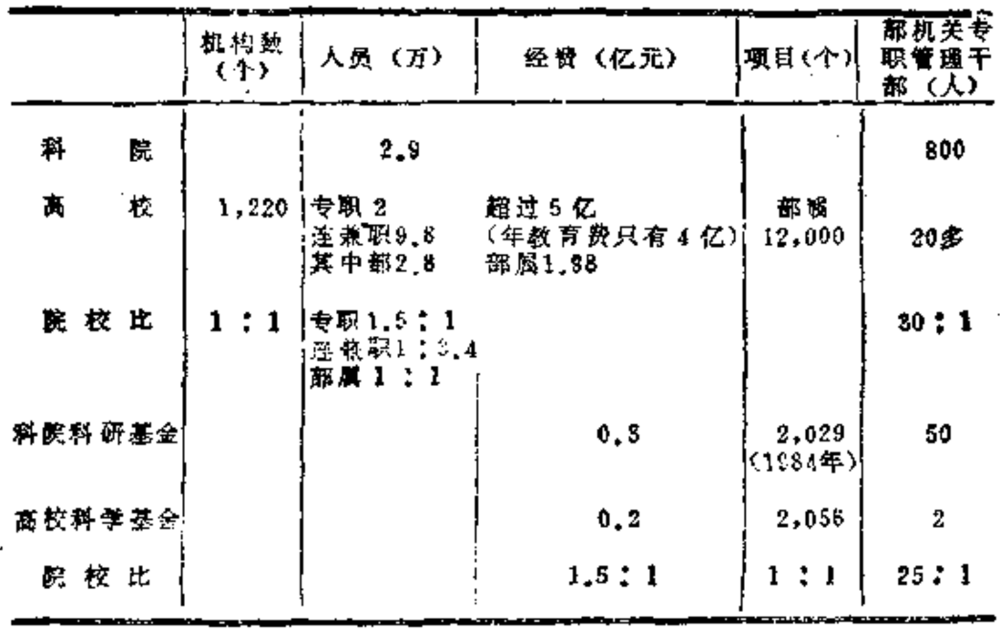

# 第十六章 我们的疑难

      由于没有一个良好的科
    学技术基础，中国领导人面
    临着他们的国家与先进国家
    技术距迅速扩大的前景。
            —— 【美】 D·西蒙

## 16.1 七大事实

  当代世界的科学技术，有一个可怕的问题：发达国家已
经进入指数发展时代，发展中国家与发达国家的差距却同时
转入指数增长的不幸模式中。

  现在我们关心的是，中国人在目前艰难而痛苦的大过渡
之中，是否会落得一般发展中国家的那种命运——在未来的
国际劳动分工中，仍然处于从属地位？这个问题，在很大程
度上取决于我们的科学技术发展情况。

  对此，在近年来许多关于“迎接挑战”的种种激烈、高
昂的理论中，有关我们的优越条件、能力和必胜的道理已经
讲过不少。我们在这里想讲的还是“问题的另一个侧面”
——我们的疑难。主要指的是如下这些令人苦恼的事实：

  1.一支疲软无力的杂牌科学军

  我们号称有近700万人[^468-1]的科学技术大军，这是数量上
的统计。综观一下实际情况呢，则无法不承认，这又是一支
学科混杂，专业落后，研究人员质量不高，数量太少，高、
中、初级人员结构不成比例的队伍。这个结构比例，发达国
家一般为1:2:4或1:3:9，我国的各种抽样研究结果为
1:17:20或1:34:8。我们统计某个先进省的情况，这个比
例竟是1:19:304（均为1982年数据）。正常的人员结构应为三
角形，而我们的实际结构是菱形，橄榄形，洋葱头形，甚至
是倒三角形。此外，没有一贯的传统，经费短缺，条件艰
苦，设备陈旧，束缚多多，伤痕累累。可说是一支疲软无力
的科学杂牌军。最好的说明是以下的事实：我们每万人口中
的科技工作人员数约为68人（1983），而苏联为948人（1977），
日本为1,758人（1975），巴西为139人（1970），印度为106人
（1970）；我国的科研投资占财政总支出的比例，1965年约为
5.8%，以后一直下降或停滞，到1979年为4.3%；1982年的
科研费只有9.96亿元人民币，仅占该年全部基建投资的
1.8%。日本的科研经费占政府预算支出3.9%（1975），巴西
为3.5%（1974），印度为518亿美元，[^468-2]比我国1982年的绝对
数多一百五六十倍。国外有人把每10万人口中科学家和工程
师小于4人，按人口平均的科研经费小于1至1.5美元的国
家列为发展中的低级国家，[^468-3]而我国每10万人中的科研人员
只有0.37人（1982），连工程师算也仅有1人左右，按人口平
均的科研经费则仅约0.3美元（1982）。可以列入低级中的低
级之列。

[^468-1]: 《光明日报》1984年7月15日公布：1983年我国全民单位科技人员685.27万人

[^468-2]: 有关数据参看广东《科技快讯》1983年37期；陕西《理论研究》1984年4期；《晋阳学刊》1983年4期等资料。

[^468-3]: 江苏《国外杜会科学情况》1983年13期。

  2.一个二三十年的技术差距

  据机械部的一个统计，目前我国生产的2万多个品种的
产品中，达70年代国际技术水平的只占5%，达60年代水平
的只占35%，其余60%属50年代或50年代前的技术水平。估
计我国工业技术水平与发达国家约有二三十年的差距。仅达
发达国家50年代末、60年代初的水平，基本上属于传统的机
械技术体系[^469-1]。据中国科学技术情报研究所程宏谟在《公元
2000年的中国》之九的一份报告中提供的1983年的一个统
计，我国共有各种机床287万台，其中约只有90一100万台是
符合质量要求生产出来的。煤炭工业中相当一部分设备服役
超过30年，最老的60年；电力工业中有1/3火电机组（按容
量计）的役龄超过20年，最老的60年；轻工专用设备约有
2,500种，大多数是四五十年代的产品，其中900种急待改
进，600种要立即淘汰。上海手表行业有自动车床354台，其
中106台已使用约30年，产出零件的返修率达1/3。上海造纸
厂甚至至还有1903年的设备在运转。我国机电产品有2万多
种，60%属过时、落后，要淘汰。据1985年的一个估计，
全国急需更新的设备与厂房约需2千亿元以上[^469-2]。农业的情
况，要远比这个糟糕得多。科研设备方面的落后，也是笑话
百出，有位美国学者到我国一间著名的重点大学某实验室参
观，看见一些自己从未见过的设备，大吃一惊。回国后一
问，原来是他的老师当学生时曾见过的东西。

[^469-1]: 《科学学研究》1985年3期，第76页。
[^469-2]: 《青海社会科学》1985年3月，第9页。

  3.信息元年还未知什么时候能出现

  70年代起，日本平均每百万人拥有超过400台计算机，为
计算机拥有量的世界第二。因此，他们把1970年算为日本的
“信息化元年”。

  按此比较，美國到1975年止，共装机211,900台，1976
年达220000台（一年增期8000多台），平均每百万人有1,100
台，另有外围设备4400000台。同年止，据公布的数字，我
国共装机1294台，仅及美国的1/170；外围设备13000多
台，为美国的1/338；计算机平均每百万人不到1.3台，约为
美国1/846，为日本的1/308。到1979年10月止，我国共装机
2604台，[^470-1]平均每年装机只有436台，约接近日本1962年水
平的一半。

  据信，目前世界各国装机势头有增无减。美国仅以最小
的每年8000台计算，到2000年的总装机数在412000台以
上。即便是这样，我国到时要达到这一水平，将平均每年至
少要装机近2万台，为我国80年代初每年平均装机量的45倍
（旧机还不能撤换）。就以2000年我国只有12亿人口计算，那
时，每百万人口亦只有343台，社会计算机化程度只及美国
1976年水平的31%，接近日本“信息化元年”的86%。我国
的“信息化元年”确实还难预知哪一年出现。

[^470-1]: 各有关数字见《计算机的预测和我国的对策》，《未来与发展》1983年2
期。另外，据日本《世界电脑年鉴》1983年统计，我图有通用电脑2,933台。

  有关人才与教育方面的差距更大。按目前美国每台机平
均要11个有关专业人员计算，到2000年，我们若想达到41万
台机的话，需要近500万有关的专业人员，估计平均每年要
投入3万以上的专业人员。这是难以想象的。然而，计算机
专业人员继续增加的倾向又不会改变。更大的困难有如我们
在前面所说，与计算机配套的种种要求和条件，我们又未具
备。需要搞又难搞，我们在这里会碰到一个真正痛苦的选
择。

  4.可怕的惰性力

  我们现在有大小科研机构上万个，80%是独立的，与企
业联系很少。科技人员被分隔在大学、科学院、军队、科
委、各部委五大圈子内。圈内人员接触已不易，圈外更难，
跟国外同行联系就不用提了。光学行业有15万人之巨，却被
分散在50多个部门和系统，各自独立经营，科研与生产严重
脱节，教育与生产也脱节，连搞光子与搞电子的也脱离。每
年还要进口价值八、九千万美元的光学仪器[^471-1]。研究者毕生
只能搞自己份内的事。这给像生物工程，环境科学那样的边
缘科学与应用科学的发展带来了莫大的困难。对工业的技术
改造更很少支持，基础研究的主要资金，最好的设备拨给科
学院，而第一流的毕业生却留在大学。在大学里又把教学人
员与研究人员的编制分开，“各安天命”。这种长期呆板的政
策，不是想改可以改的。它已经形成了顽固的惰性力；交
流短缺，兴趣雷同，互相感到陌生，不善于合作，对环境养
成强依赖性。这一切，甚至已经转化成一种观念，在一二代
人身上也不易改变。

[^471-1]: 《光明日报》，1984年7月27月。

  5.40%重复、80%弃置的成果

  既然长期把人封闭、隔绝起来，却又全无协调统一计划。
信息闭塞，效率低下自然难免。据统计，我国目前的科研成
果有40%是国外早已研究过的，纯属重复浪费。[^472-1]甚至有些
军内的项目已转向民用时，地方研究人员还被蒙在鼓里。要
了解国内的信息往往比了解国外的还雅。即使在中国科学院
的117个研究所内，情形也是如此。有一个单位远跨重洋去外
国考察一项光电技术，却不知人家的技术是从我们的一个研
究所接去的，而这个研究所同他们单位仅隔一条街，还有一
个单位，辛辛苦苦从国外引进一种新的设备，回来一看，设
备后面有块牌子明写着“中国制造”，价钱却比国内贵了几
倍。1976年盲目上马的DTS一183计算机生产线，每台要价
120万元，国外却早已被微处理机代替，还未生产，便被淘
汰。在这方面，中国科学院化学部的甘道初有个很好的研
究。他指出，我国的科研工作，选题缺乏经济分析，缺少强
大的中间训练基地，对成果宣传不力，没有形成一支专门从
事推广科研成果的技术队伍，部门所有制严重，有的未能大
力扶持国内先进的科研成果，缺乏组织协调，低水平的重复
研究较多。目前我国科研成果的利用率平均只有10一20%，
而美国高达80一85%，西德和法国为50一65%，苏联为30一
50%。[^472-2]目前我国农业方面的科研成果有5,700多项，其中约
2/3就没有被利用。[^472-3]

[^472-1]: 《社会科学评论》1985年3期，第20页。
[^472-2]: 见《科学学研究》1985年8期，第92页。
[^472-3]: 见《江西财经学院》1985年5期，第23页。

  6.从样品、展品到废品

  一窝蜂行为竟然会传到科技界，是使人百思不解的事情
之一。过去，我们拉单晶几千根不过关，花了600万元；搞转
子发电机300家一齐动手，不得要领，花了1500万元；全截面
联合掘进机，40家各师各法，搞了60台却一齐下马，花了
9,000万元。[^473-1]计算机外围设备磁盘、稀土永磁材料、激光
和遥测研究无不如此，科学院、大学、工业部门与军工部
门，几千家、几百家一齐“大上、快上”，不遗余力，却毫无
协作可言。1979年我国从事激光研究的单位有300多个，人员
1万多，占世界总数30%。大家都向往高、精、尖，不是本
高利薄，就是亏损严重。常因无力进行到底而以展品、半成
品形式“入仓”处理，最终变成废品。我们的“两弹一星”
上去了，不少科研成果转向投产项目时的实际收益却比外国
同类项目低几十倍。我们在建立科技界与外国联系方面的实
效已经是够差了，我们在加强科学技术支援国家发展方面则
做得更为差劲。几经跟难得到的新科技产品，一无人推销，
二无人教用，三无人修理。整个科学技术组织虽有层层关卡
机构，却又似一个无序混乱系统。既无有效的组织管理，又
无技术商品市场的刺激，更无经济效益观念。相反，各种保
守、禁锢、作梗之事却层出不穷。60年代初，科学院所属兰
州的一个研究所与产业部门的一个研究单位同时制成一种航
空高级润滑脂，有关的事迹已被搬上银幕了，但仅仅因为前
者的质量比后者好，而后者却拒绝按前者的工艺生产，成了
一场官司，竟一直打到70年代末期才得个“基本解决”[^473-2]有
关的事例实在举不胜举。笔墨至此，真使人感到无比痛心！

[^473-1]: 《科研管理》1980年1期，第54页。
[^473-2]: 《科学学研究》1985年3期，第97页。

  出现这种种怪事的一个直接的重要原因是：我们各个研
究机构的许多领导职位，长期被一些非生产性的、外行的人
员占据着，长期受政治冲击，习惯与“紧跟”、“高举”相适
应的那一套工作方式和思考方式。我们在1978年2月公布四
个现代化计划，强调科学技术的重要性。结果，新的科研机
构有如当年的“人民公社运动”那样立即“风起云涌”。有一
个省仅在1978年至1979年间，这样的机构便增加了153%；[^474-1]
1981年初，全国科技界中的营理人员为37.4万，到1982年初
就达47.5万，一年增加27%！对这种完全不正常的，游戏似
的“高速发展”，宣传界还当作了不起的“惊人发展”事例到
处宜传。在科技“高速发展”中冒出来的新机构，有些是无
课题、无经费、无人员的“三无中心”，有些是一间小房子，
一颗小公章，一个小书架的“三小中心”，有些是一架油印
机、一个钉书机，一部电话机的“三机中心”。国内外均传为
笑话。这种搞法，如果不是有些人急于想得到政治上的好处
来赶时髦，又如何另作解释呢？此风不禁不绝，要不出问题
就真是怪事了。

  笔者无意夸大这些问题的严重性，但更不应回避这些问
题的可忧虑性。即使我们今天确实有了一个了不起的真正进
步；不仅承认自己的困难、问题与弊病，而且容许人家揭露、
议论、批评了。但是不要忘记，有许多问题承认了、让人讲
了，也还是不起作用的，更需要相当的时机，条件和努力去
解决它。尤其是以下的一个疑难问题：

[^474-1]: 《国外社会科学情报》1985年4期，第7页。

  7.现代科学技术与传统的冲突

  美国人想效法日本最新的管理方式，实地考察后觉得经
验不错但不可学，英国女王的丈夫是海军出身的工程技术人
员，他明知英国的强烈保守性格只注重科学，不重视工程技
术，一直致力于推动英国技术科学的进步，但总不能如愿，
阻力竟是异常之大。

  在这里，存在着一个巨大的惯性力量，那就是文化传
统。我们应当清醒地认识到，中国文化传统的种种弱点，有
不少是与现代科学技术产生严重冲突的。

  近代的中国人，总是不重视科学，尤其是不重视技术，
至今未改。1985年胡耀邦所批评的就是这种情况：现在还有
些人对于现代化的科学技术基本上没有多少兴趣，对于科学
技术推进经济和社会发展的巨大作用，没有多少认识：有的
人满足于已有的陈旧知识，对于世界上的新的科学理论和技
术成果，根本不放在限里，不去学习，不去研究，不致力知
识更新。

[^475-1]: 见《社会科学动态》1985.2。

  杨振宁最近提到值得我们深思的一种奇怪现象：“中国的
知识分子都真心诚意地想为祖国作贡献，他们真挚的心情世
界上无与相比，但对国民经济发展的贡献却并不非常大，比
外国差得多。”[^475-1]其原因，固然与杨振宁说的“这就是政策不
对头”有关，即首先是与对知识分子的态度有关，但跟中国
知识分子的传统也不无关系。中国传统文化视默默无闻为英
雄，宁肯处处小心为自己打算而不肯出人头地去冒风险的特
性，在知识分子身上表现得特别突出。而且，几十年来的政
治冲击，意识形态纯洁性方面的压力，大大加深了这种特
性，在这种环境、条件、气氛，政策和传统的压力下，无论
如何，中国知识分子去攻外语、写论文、搞学位、评职称的
劲头总大于冒风险去攻技术难关的劲头。在这点上，中国的
知识分子很像英国人。许多中国人与英国人都有一个通病：
上班不努力，下班后很卖力，这也是一种传统。正如英国女
王的丈夫所碰到的难题一样，无论是杨振宁或者是胡耀邦，
在传统的惰性面前都无能为力。

  还有，现代科学技术需要勇敢的开拓精神，要大胆进
行风险投资，需要不断接受新观念，需要不停地更换旧知
识。这一切跟我们的传统管理思想也是冲突的。近30年来，
我们养成了好大喜功，胆大妄为的品性，养成了一窝蜂上，
一窝蜂退的行为习惯，受惯了似是而非的一面倒理论的制
约，听惯了报喜不报忧的宣传鼓动……所有这一切，都不是
一朝一夕便可以改变过来的。

## 16.2 科学城的难题

  有一个问题必须特别研究。

  50年代，美国搞了个“斯坦福工业公园”，那就是后来举
世闻名的“硅谷”。接着1957年苏联始建新西伯利亚科学城。
此后，美国又搞“硅原”、“硅山”、“硅滩”、“电子带”、“技
术岛”、“技术飞地”、“仿生谷”、“基因谷”；日本搞“筑波研
究学园都市”、“硅岛”、“技术城”；加拿大建“北硅谷”。其他
如英国、法国、西德、比利时、瑞典、印尼、新加坡，都纷
纷设立各种形式的科学园区。连台湾也搞了一个“新竹科学
工业园区。”这种科学技术“飞地”似乎具有世界性的来潮势
态。目前，全世界据说已有约130多个科学城。仅美国就有
110多个，英国有14个，苏联有4个。1980年日本提出要建
技术城时，全国47个都、道、县中就有38个提出申请。
这股30年来我们不闻不问的科学城之风，忽然在1984年
吹入中国。北京的中关村，上海的江湾五角场，天津的红旗
路，南京的江浦珠江镇，武汉的东湖，沈阳的南湖，杭州的
钱塘江南岸……几乎全国的主要城市和开发地区，竟同时有
人建议要动手筹建“科学城”、“科学工业园区”、“硅洲”
“科技特区”。仅在广东，就有四、五个地区被提出要搞科学
特区。

  中国人实在太爱凑热闹。殊不知，叫了那么久的日本
人，至今只搞了两个这样的城区。所谓全世界有130多个，真
正有成效地搞起来的没有几个。又有谁知道为此投入的力量
究竟有多少？

  中国的科学城、科学园区是要搞的。其实，有一些早就
在搞。只不过，从现代新建科学城的许多基本要求来看，我
们的科学园区并技有搞好罢了。

  近几年，我们大谈发展科学技术问题。按照中国人的特
性，在这种情况下，往往就会忽视另一个侧面的问题。不久
前，周培源在谈到我国科技问题时曾提出一个疑问：我们是
否要搞那么多科学院？[^477-1]另外，1988年初，苏联国家劳动和
社会问题委员会主要官员哈林宣布，苏联正计划裁减10%的
科学工作者。如果我们想要搞一批新的科学城区，千万要谨
慎，绝不可轻率决策！

[^477-1]: 《科技管理研究》1985年1期。

  世界的科学园区有种种不同的目标。

  有些以大工业企业的利益为主，以风险资本与技术股份
合作，大搞创新型的风险投资。这种园区竞争性极强，需要
有人员、资本、信息的快速流动；要有兴旺的技术市场及其
反馈系统；要形成科研、生产、市场的一统体系。

  另有一种科学园区主要围绕大学、科研机构组成。实际
上就是各种研究中心，科学院城。我们的中关村、五角场、
东湖，早就是这类“科学园区”。这种园区以尖端科技的赶超
为目标，建成研究与教育基地，要成为综合的巨型“脑库”。

  还有，以台湾的新竹为代表的那种“科学工业园区”是
以吸引外资为目标的，具有经济特区的性质。主要依靠的是
一个得到充分发展的“出口加工区”。

  建个科学城，可谓事关重大，要解决的难题多得很。所
有上述目标都会使我们面临多向难题，实在是谈何容易。我
们理应多提几个疑问，多作思考，以便于研究对策。

## 16.3 举步维艰

  在中国办事情，实在是举步维艰。建科学城的疑难，除
与资金、人才，信息网、基础实力等基本条件有关外，还会
跟传统、教育、地域发展等产生冲突。对我国的大部分城市
和地区来说，与其现在动手筹建科学城，不如动手清除建科
学城的障碍，扎扎实实地为未来建科学城创造必备条件。

  让我们来指出一些主要的障碍：

  1.地区力量太弱

  按日本科学城建设委员会主席石井的说法：“科学城首先
是要作为一个转移尖端工业革新力量的有力工具。”[^478-1]其后
果，将会导致地区力量时代的出现。

  这一点，从各科学地区筹建地点的选择上看得很清楚。

[^478-1]: 广东社会科学院《社会科学情报资料》1984年5期，第18页。

  美国的“硅谷”设在原来荒凉的西海岸旧金山以南的圣
克拉一个山谷之中，原来不过是个大果园。那附近只有一所
有名的斯坦福大学。后来在得克萨斯州达斯市搞的“硅原”，
在丹佛搞的“硅山”，在佛罗里达搞的“硅滩”，在犹他州搞的
“仿生谷”，都在并不发达的地区。日本的“硅岛”设在较为
偏远的九州；1980年提出要搞技术城，最后所选的19个候选
区，全都避开工业发达区，挑上边远之地。苏联的科学城，
干脆设在最遥远的边疆鄂毕河滨的一片荒林上。这是为什
么？相比之下，我们设想要筹建的科学城，又全在原来的各
大工业、科研中心地。这又是为什么？差别就在于“转移”
两字上。人家是着眼于转移，着眼于发展地区力量，开拓新
的科研场地，以发展来促进平衡；我们则着眼于“科学城”
本身。而根本的困难则在于，我们的地区力量仍然太薄弱。
这是我们要建科学城的一大疑难。被转移到合肥的中国科技
大学，就碰到利种始料不及的额外的困难。事实说明，这个
转移是过早的。

  2.凝聚力不足

  科学城是资金、人才、技术高度密集、长时间营造的系
统。这需要有一种强大的凝聚力在那里起作用。美国的“硅
谷”已有30多年历史，现在集中了全美96%的半导体公司，
有8千家企业在工作，有约6000多名博士，22万多高级技
术人员，76万科技劳动力。日本的筑波，1963年由内作出
决议，到1968年才动手建设，共投资13000亿日元，历时13
年才建成今日的规模。筑波现有60多个科研教育机构，两间
大学，有11000多名科研人员，约占政府科学家总数的一
半；另外还有30多家民间企业机构与高级技术公司。苏联的
新西伯利亚科学城仅有5万人口，而现有23个研究所和一所
大学以及一大群由各种设计、实验机构组成的“应用区”，仅
科研人员就有2万人。[^480-1]印尼在西爪哇塞庞建的科学中心，
仅研究中心的一个反应堆就耗资7000万美元。沙特阿拉伯
在吉达筹建大学城，初步计划投资20.34亿美元。台湾的新
竹科学工业园区，自1976年开办以来，当局亦已投资8000
万类元。[^480-2]现在，日本人估计，一个技术城，仅最基本的基
础设施的投资就要5000一6000亿日元（约合20一25亿美元），
而研究和教育设施等方面还需更多的资金，再加上私人的投
资，大概要上五六千亿美元。

  3.提防保守传统作怪

  现在我们选定要建的科学城区，都是近旁已有成万知识
大军的地方，据说这是一条经验。

  其实论人才，早期的“硅谷”、“硅岛”或新西伯利亚科
学城都不多。“硅谷”里面那个著名的苹果公司，不过就是两
个年轻人搞起来的，科学园区主要是以搞“尖端”研究，搞
最新开发与最重要的新应用为目标，而并非搞一般的科研
——生产工作。所以，开始时，关键不在人多，不需要成万
科学大军的“优势”。真正需要的是少数一批有胆有识，有创
造潜能，有才学，敢作为，肯献身的人物，最怕的就是保守
传统从中作梗。

[^480-1]: 《科学管理研究》1985年8期，第34页。
[^480-2]: 天津社会科学院《经济问题参考资料》1985年7期，第8页。

  我们有人把科学城设想为科学特区。说经济特区要突出
个“特”字，科学城也要突出个“特”字，要“特事特办”。
其实，在这里指出两种特区共同性之点，不如指出他们的差
异；经济要热心于迅速运转，科学却要埋头于静心研究。从
这个意义上说，科学城应突出一个“新”字。新人、新事、
新方法。因而，最怕的就是旧保守传统的干扰。

  按照我们目前的实际情况，原来已有成万知识大军集中
的地方，大概必有保守传统在起作用。原因很简单：在行政
上，那里一定已有许多重重叠叠的机构，它们长期执行着一
套旧的管理程序和维持着上上下下的复杂关系。以武汉东湖
地区为例。该地区目前有大专院校19所，科研设计院54个，
机械、动力、电子仪表等厂75个；人口25万，其中有大专文
化程度者3.6万，高级教学，科研、设计人员3,200人，大学
生、研究生5.4万，每百名居民中大学文化程度者32.8人，在
中国，早就算得是个“科学城”了。但可借，他们分属中央、
省、市、区、街五级共50个部门[^481-1]，可说是“一百个庙堂一千个
菩萨”，要解决规划、指导、协调、服务等问题，谈何容易！
此外，即便就科学研究本身说，老一辈学者所熟悉的领域与
他们的治学传统，亦不容易与一些并不成熟的新学科和新人
物取得协调，这种不协调越多，对集中的发展越不利。大概
正因此，许多开创者，宁肯势单力薄，甘冒风险，也要避开
原有的“势力范围”，另立地盘，另辟山头。

  可惜，中国人有大家庭的生活传统，依赖性特别强。我
们所缺少的正是此类敢冒风险、愿意献身，又才华横溢的
人。这是我们要创建科学城的第三大疑难。

[^481-1]: 见《江汉大学学报》1935年2期，第85一87页

  4.“抢珠”之争悬否会重起

  我们在教育方面的问题，已多到难以想象。其中，科学
与教育截然分开，相互争夺人才，是造成教育方面出现严重
境的原因之一。

  教育、科学争人才问题，由来已久。谈家桢不久前还提
到，[^482-1]1957年，在北京怀仁堂的一次中央宣传工作会议上，
发生过著名的“二聋抢珠”之事。当时，因大批有成就的教
师被抽调去科学院，使高校的教学和科研力量大伤元气，[^482-2]
因此，科学院长郭沫若与高教部部长杨秀峰（两人均有点聋）
为科研人员归属问题吵得面红耳赤，后来，毛主席提出：划
条三八线，到此为止。那时没有想到的是，科学院与高校竟
由此结下矛盾。这条比喻的“三八线”，后来竟不幸成了割裂
教育与科研的鸿沟，于两者均有损害。

  目前，各地新办的大学纷纷出现。不过一年之间，高等
学校总数竟翻一番，从1千多所变成2千多所。很有点几年
前大办科研机构、大办公司的样子。最近，国家教育委员会
已经说，大学办得过多，过快了，师资跟不上。如果科学城
区同时而起，这“夺珠”之争是否又会重新上演？

  联系到是否要搞那么多科学院的问题，还可扩大一点
问：是否所有高校，所有高校的教师都必须搞科研？

[^482-1]: 见《科学学与科学技术管理》1984年1期，第28页。

[^482-2]: 科学院与军工科研从1954年便从高校抽调力量。1956年国家制定60年科
学技术规划57项重大项目中，科学院承担45项，每个科研人员平均每年的科研
费9,000元，而高校一项任务也没有承担，一分钱科研费也没有。见《高教探
案》1986年第1期，第43页。

  事实证明，一般地强调高校要教学、科研一起抓，不一定
是好政策。其结果是大量重复一些初级的、低水平的研究。
外国有人指出，高校教师必须搞研究的传统是过去的历史原
因造成的。那时，学科不多，且不成熟，教师本人的研究，
可以拿去讲很长时间，当年康德讲课的内容就几乎全是自己
研究的结果。现在不同了，一般教师一年的研究工作，往往
不足以讲一个小时。通常不值得提倡所有高校教师都同时要
搞研究。问题在于：我们一向没有区分有用的研究和无用的
研究。本应认真组织好好研究的没有认真进行研究，大多
数不必要去进行研究的又到处在动手研究。美国号称有3000
多所大学，认真开展研究工作的，不过20来所，搞一般研究
的也只有200所左右。其余基本上是不搞研究的，美国高校
的科研经费，4/5用于培养博士级人才的院校，剩下经费
的一半，给培养硕士学位的院校。[^483-1]其余院校的科研费可想
而知。

  我们还是回到科学城问题上。除了上述的重大疑难外，
还有许多同样使人感到困迫的难题。例如：交通与信息网络
的运转，专业性企业群的配合，政策、法律的保证，风险投
资组织与信贷组织的鼓励，广大技术市场的开发，教育与生
活环境的建设，后勤与服务系统的支持。所有这些，尤其是
对中国人来说，远不是轻而易举的事情。

  最后，在科研管理体制与人事管理体制未能得到有效的
改善之前，可以断言，我们的科学城这是搞不好的。

[^483-1]: 潘来星等《美国科技管理》中围学术出版社，1982年，第187页。

  有一个事实，可以说明我们在科研管理体制上的混乱。
由于高校掌握着人才分配权，在后来高校科研力量的重建
中，慢慢又组成了一支可以跟科学院抗衡的队伍，并且在研
究项目的数量、科研费支出等方面亦跟科学院系统接近。面
只要在管理上一加比较，便可以大致看到；科学院系续管理
人员太多，从管理学原理来说是必然要混乱的；高校科研管
理人员又太少了，自然便只有任其自流了。对这个问题的最
简单的说明，可以看下表（16.1）：

① 高校按902所算，其中“部属”指理工类33所。

② 高校科学基金指“重点高等学校博士学科点专项科研基金”

③ 以地方为例，广东省和中科院广州分院有科技人员1742人，院部机关105
人，其中科研管理业务处21人，广东高校参加科研人数约4500人，为省科院三
倍，但主管干部不足10人。

数据来源：《高教探索》1986年1期第44一45页

  正如谈家桢所说，我们的科研部门虽然荟萃了不少人
才，但由于种种原因，力量互相抵消，到头来不少人“英雄
无用武之地”，造成了人才的浪费。“科研体制必须改革，科学
院必须改变现状。不然，单靠机构调整，人事更动，是治表
不治本，是不能从根本上解决问题的”。[^484-1]

  据说，我国目前选定在京、津、沪、武汉和广州五地筹
建科学园区。我们上述提到的各种疑难，将会变成一场考
验，结果如何，国人正拭目以待。

[^484-1]: 《科学学与科学技术管理》1984年，第1期，第28页。

## 16.4 为悲观派鸣冤

  自从《增长的极限》在1972年发表以后，罗马俱乐部一
直被加上了一个“悲观主义未来学派”的头衔，意多指责。
因为，极限被指为意味着死亡和毁灭。再加上该报告激烈的
措词和夸大的口气，一种对罗马俱乐部难于理解的气氛便到
处流传。

  其实，应当把罗马俱乐部称作未来学的悲观派，而不是
悲观主义未来学派。我以为，悲观派与悲观主义不同，这正
如组织管理中的官僚化理论与官僚主义理论不同一样。罗马
俱乐部执委会一再声明，《增长的极限》不是预言或预测。他
们只是指出旧模式可能潜伏的危机，如果不改变现行政策和
设法改变现存的发展趋势的话，我们将陷入一系列的全球性
的困境之中。为此，他们提醒和警告人们去中止不良状态的
继续，设法避免困难的产生。悲观主义说的是“这样不成”、
“那样不成”、“什么都不成”；悲观派只是说“这样不成”，并
没有说“那样不成”，更没有说“什么都不成”。那是研究未来
的一种角度，一种方法。与一些唱高调的批评者相反，悲观
派的重要作用正在于，他们不断向人们提出重大的疑问，敲
响危机的警钟，逼着大家去寻求解答。从这一点上说，对于
人类未来的困境，悲观派的行动比盲目的乐观派积极得多，
实际的贡献也大得多。

  事实上，70年代初，当罗马俱乐部提出人类面临空前困
境的大胆预言时，正是资本主义世界充满重大幻想的时期。
但1973年爆发的石油危机，使西方的心理发生彻底的变化。
接着1980年起，西方陷入战后最严重的经济危机，经济增长
率在1982年只有0.75%。罗马俱乐部的预言成了西方的一个
幽灵。

  想想我们自己吧。

  昔日，我们宣传大跃进，扬言15年超英赶美如何可行而
又合理，企图在经济上搞大飞跃，结果是一场大失败；接
着，我们又想在政治上搞更大的飞跃，鼓吹“文化大革命”
如何“必要”和“有理”，结果是一场空前的更大浩劫；“四人
帮”刚刚打倒，神州大地百孔千疮，政坛众星陨落，经济濒
临崩溃，人们恶梦初醒，血泪未干，国势无托，万事待举，
正是“待从头收拾旧山河”的时候，忽然我们又急忙宣布：
要建十来个大庆，要“三年大见成效”。结果如何呢？简直是
把国运兴衰当成一副可以随意拼接的七巧板，视同儿戏。今
天，我们总算回到现代化的世界主流里来了。踏上了振兴中
华之途。可是我们不少理论工作者又在一个劲地鼓吹如何可
以进行现代化与科学技术的“超阶段”、“大跨越”。这怎不使
人提心吊胆，忧从中来！

  对于西方人来说，中国人的哲学实在神秘之极。我们每
天唱着“中华民族到了最危险的时候”，实际上，中国人的危
机感，威胁感，是太过薄弱了。妄自尊大，固步自封，盲目
乐观，胡吹乱捧，恣意妄为，自欺欺人，给国家和民族造成
了几多恶果！积30多年来的经验教训，我们应当承认一个基
本事实：我们的国家隐患深重。否则，为什么一个大错误接
着一个大错误，一场风暴接着一场风暴，一番折腾接着一番
折腾？难道真能简单地用少数几个人的“失误”或“罪恶”
解释得通么？如果当年，我们也容许有一个罗马俱乐部式的
“悲观派”起作用，如果我们不只听报喜的锣鼓，也听得进
报忧的警钟，我们所付出的历史代价也许就不会如此巨大
了。事实证明现代的整体复杂问题，许多悲观派人物即令言
过其实仍不失为真正有价值的高参，而许多脱离实际的盲目
的乐观主义者所充当的，不过是胡参的角色。悲观派是受冤
屈的。

  在现代科学技术强大潮流的冲击下，我们已无可后退。
不过，多少年的经验教训告诉我们，对重大、复杂而困难的
新事物，我们既不应做冷眼旁观的诋毁者，也不应该做不负
责任的过激的鼓吹者，而应当做实事求是的冷静的分析者和
扎扎实实的实际行动者。

[^487-1]: 《马克思恩格斯全集》第23卷，第119页。

  或者我们可以按照弥尔度或史垂登认为“失业”过时的
想法，设计一个新的发展策略：并非一定要提高国民生产总
值，而可以提高自产自消者的“生产力”，但这也是“未来的
前景”。目前的问题十分清楚，如果工农业生产搞不上去，如
果教育搞不上去，科学技术是上不去的。我们不可忘记，科
学技术要迅速转化为生产力是以普及教育为基础的。世界第
一台蒸汽机车由特勒维西克经10年的努力在1797年制成，但
直到1825年才开始转化为现实的生产力。主要的原因之一就
在于当时的教育没有培养出掌握蒸汽机车的技术人员和技术
工人。而瓦特等人的发明之所以能够实现，“只是因为这些发
明家找到了相当数量的，在工场手工业时期已准备好的熟练
的机械工人”。[^487-1]童大林在谈到迎接当代科学技术的挑战时曾
经直率地说：“我们应该毫不隐讳地说，我们在现代科学知识
方面的愚昧无知和现行经济体制中的不利技术进步的环节，
正是我们迎接这一新挑战的两大困难。因此，集中力量解决
这两大困难，就成为我们迎接挑战的两大对策”。[^488-1]也因此，
我们就必须首先解决训练，知识转让，建立中心以及体制改
革等问题。在这种情况下，不管我们多么不愿意，也不管有
没有被指责为悲观主义的危险，我们要严肃地指出：中国的
科学技术，在近期内，有面临着与先进国家的差距迅速扩大
的危险。这是我们在发展科学技术方面的最大疑难。

  1985年3月13日终于公布了《中共中央关于科学技术体
制改革的决定》。这个决定提到，要改革对研究机构的拨款制
度；开拓技术市场；调整科学技术系统的组织结构；改革农
业科学技术体制；合理部署科学研究的纵深配置；扩大研究
机构的自主权；对外开放；改革科学技术人员管理制度等方
面的内容。这确实是个迫切而又艰巨的任务，虽然其实际效
果如何，还需等待时间作出判断。但从1986年初正式布置的
国家科委的“星火计划”和“高技术研究发展计划纲要”来
看，整个科技推进战略比较稳实，并非是搞假、大、空那一
套。特别是，国家科委在“七五”计划期间，按照国家控制
的科研经费，为传统产业的技术服务的经费，发展新兴技求
为形成新产业服务和开发“短、平、快”适用配套技术为振
兴地方经济服务的经费以及加强基础研究和应用研究的经费
这四个方面，选择了大体为4：3：2：1的比例安排。这是
一个比较符合国情的而不是唱高调的决策。

  这使人在忧虑中又充满了希望。

[^488-1]: 杨纪珂主编《面临新挑战的科学技术》安徽科学技术出版社，1984年，代
序。

