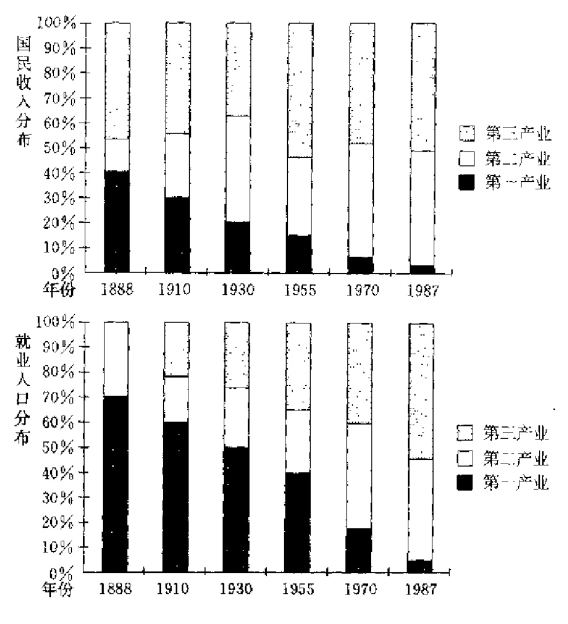
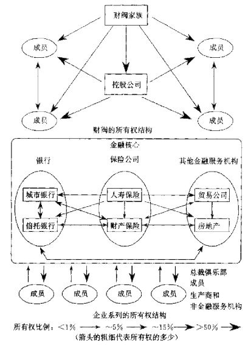
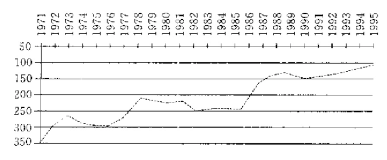

> 第十二章“日本资本主义”是本书中有关国别章
> 的最后一章。我们己经在本书中详细介绍了其他三
> 个国家，所以我们有了一个坚实的基础，可供我们进
> 行跨国比较。日本资本主义到底有什么日本特色呢？
> 它与其他国家的资本主义到底有多少相同或相异之
> 处呢？
> 
> 日本与英国一样，也是一个具有悠久历史的岛
> 国，这是其最明显也是最重要的特点。日本拥有众多
> 的人口，且大多濒海而居；日本的内陆地形崎岖，大
> 部分都不能居住。在可居住地区的日本人口密度是
> 世界上最高的。
> 
> 根据现有汇率和人均国内生产总值测算，在我
> 们已经讨论的四个国家中，日本是最富裕的，而且从
> 80年代末至今一直如此。日本国民是世界上受到教
> 育最好、城市化程度最高的。然而，日本的生活费用
> 昂贵，从购买力上看，日本的人均收入落后于美国
> 18%。现在仍然生活在乡村的大量日本人口至今仍
> 然持续着几十年不变的生活方式。在本书所讨论的
> 四个国家中，日本与其他三国之间的反差最大，
> 
> 从历史上看，日本资本主义最引人注目之处是
> 其飞快的发展速度。在1868年的日本明治维新之
> 前，日本闭关锁国达几百年。当其他三个国家已基本
> 上完成了第一次工业革命而行将进入第二次工业革
> 命时，日本依然保持着封建的社会结构（德国是个例
> 外，因为德国直到1871年才得到统一）。所以，用经
> 济历史学家的行话来说，日本是个“后起的工业化国
> 家”。
> 
> 与许多其他后起之秀一样，日本用政府的力量
> 来加速发展；然而，与其他国家不一样的是，日本取
> 得了巨大成功。我们应该找出其中的原因。为什么
> 日本能够迅速发展现代化工业，而许多其他国家（如
> 中国、俄国和墨西哥）虽有尝试却并未成功？日本的
> 公司是如何组织的？世人认为有日本特色的一些商
> 业方法，如终身雇用、忠心耿耿的“工薪族”，公司之
> 间的密切联系和企业联合等，这些方法究竟有多么
> 传统？
> 
> 尽管经济数据不能体现情绪的紧张，但从传统
> 生活方式向现代生活方式的迅速过渡对处于这种过
> 渡中的人来说是极其痛苦的，所以我们可以思考一
> 下日本为其经济的快速增长所付出的代价，设想一
> 下在不同时期里哪一个阶层所受的冲击最大。此外，
> 既然日本工业化的目标十分集中，意图十分明显，那
> 么，与其他三个国家相比，日本是否应该是当今发展
> 中国家所应仿效的优秀模式呢？日本的情况十分特
> 殊，那么，它的经验是否难以仿效呢？

# 第十二章 日本资本主义

**杰弗里·R·伯恩斯坦**

**日本之谜**

> 日本是一个充满矛盾和怪异的国度。
> 熟悉的东西在日本也戴上了新面具并被奇
> 怪地颠倒了过来。日本人当然是头朝天用
> 双脚走路，但除此之外乎所有东西都以
> 倒序向完全相反的方向发展。

——路德福特·艾尔柯克爵士，1863年出使东京的第一位英国大臣

> 我不知道日本体制是好是坏，因为我
> 根本就不理解。
——鲍伯·霍纳，1987年在日本参加过比赛的棒球运动员

对许多西方人来说，日本如谜一般的
神秘。日本的经济体系往往被描述成与大
家所熟知的资本主义模式不同、甚至完全
相反。一位著名的美国经济学家认为：“日本式的市场资本主义
与西方传统的经济思想南辕北辙，应该被视作另一个经济体
系。”也有人用“人文资本主义”、“竞争性共产主义社会”或“非资
本主义市场经济”等名词来描述日本。一批被称为“修正派”的专
家学者和新闻记者认为，不承认日本明显的独特性就无法了解
日本的经济体系。

然而，日本经济是以私有制为基础，市场相对自由的经济体
系，从这一点上看，日本显然是“资本主义的”。根据这一标准，日
本早在19世纪末就已是一个资本主义国家了。当时日本就已经
有了一部成文宪法，一套规定了公司有限责任的商业体系以及
一个新兴的本土资产阶级。所以，分析家坚持认为，当代日本在
很大程度上符合英美的资本主义概念，他们把日本的发展更多
地归功于传统因素（如自由运作的市场、稳定的财产权以及受到
良好教育的国民等），而不是任何特殊的日本政策或社会体制。

本章认为日本是一个资本主义国家，但也承认日本资本主
义与前几章所述的另三个资本主义国家有很大的区别，主要
区别在于：（1）大企业的管理和雇工制度：（2）公司与公司间联
系的广度和不同类型：（3）可感知的政府作用。对这些区别的重
要性众说纷纭，这实际上是一场长期大辩论中的一个中心问题；
在这场辩论中的修正派被贴上了“日本的对头”的标签，而那些
认为日本与其他发达的资本主义国家并无区别的人则被称为
“辩护士”。

尽管日本资本主义的特殊性还有待讨论，但日本资本主义
的成果是毫无疑问的。在100年内，日本从一个前工业化国家转
变为一经济超级大国。日本资本主义为何能取得成功？它还
能够继续取得成功吗？它为别的国家带来了什么样的经验？本
章概述了日本经济发展的状况，意在为读者提供信息，使读者能
够自己发现这些问题的答案。

## 日本经济发展的基础：前资本主义时代

> 日本人很能干、很聪明，日本儿童能够迅速理解
> 掌握我们所传授的知识，他们学习读写我们的语言
> 比欧洲儿童来得快。

——艾尔桑德罗·瓦里格那诺，16世纪末的一位耶稣会传教士

> 1868年后，日本人的能量和勃勃雄心使西方国
> 家深感不安，这并非日本人的一日之功。从其历史上
> 看，日本人一直有迅速吸收新思想和新方法的天赋，
> 他们勇于做大事并且拥有训练有素的、久经磨练的
> 组织能力。

——G·C·艾伦，经济历史学家，1981年

**与西方的早期接触（1543~1639年）**

1543年前的几百年里，日本一直保持着与中国的文化交流
和经贸往来，从中国学来了文学、宗教、艺术、文化和技术等。日
本人采用了中国人的一大创举，那就是官僚政府体制的概念，文
职官员的选拔依其才干而非仅仅依其家势。在很长一段时间里，
这一原则只是一个抽象的理想，难以真正实施，但其影响是不可
否认的。即使到了今日，日本的政府、商界和社会仍然十分重视
人的才干。在向中国学习的过程中，日本人一直很谨慎，使自己
置身于中国人的控制之外，在后来与西方人接触的过程中，日本
人依然如此：向他们学习，但限制他们的影响。

到达日本的第一批西方人是来自西班牙和葡萄牙的天主教
传教士，他们希望使日本人皈依基督，有些日本人很快便投入了
这个新宗教的怀抱，于是1572年的一位耶稣会教士在描述日本
时写道，“日本以出产精致银器而驰名，不久的将来日本即可以
基督教在其国民中的传播而驰名。”到17世纪，日本已经有了近
30万基督教民，大多生活在南方的九州岛。

传教士进入日本后，商人也接踵而至；这些贸易者来自荷
兰、英国、西班牙以及葡葡牙。有些商人在日本得手了。1543年，
一群葡萄牙人触礁沉船，来到日本的岛上，他们向当地的封
建领主出售火绳枪，每支1000两黄金是日本工人平均年收入
的14倍。然而，这样的商业成功来得快去得也快，日本人不久便
学会了造枪，甚至在西方的设计之上作了改进。不久，日本人便
开始大量生产火绳枪，到17世纪初，枪支的价格便降到了每支
1.2两黄金。从此，日本人每次打仗都使用上万支枪，而与此同
时的欧洲人每次打仗时不过用几百支枪而已。

当西方人第一次到达日本时，日本的一场长期内战正在进
行。1603年，德川家族控制了全日本，德川家族统治日本长达
265年，一直到1868年为止。德川家族的统治依靠一个相当繁
杂的封建体系。德川家族的一名成员担任将军，是位于江户（即
今天的东京）的中央政府的首脑。将军直接统治着全国农耕地的
四分之一，其余土地被划分成260块领地，每块领地由一个大名
（即日本的封建领主）统治。

在强化了自己的统治以后，德川家族的统冶者视外国人及
其做法为威胁。他们积极镇压基督教，并于1637~1638年屠杀
了2万名日本基督教徒。英国人是自愿离开日本的，但西班牙人
和葡萄牙人却分别于1624年和1639年遭到了驱逐。此后不久，
将军便禁止几乎所有对外接触，只有为数不多的一些荷兰商人
和中国商人得到允许，可以在离长崎不远的一个小岛上进行贸
易，仅此而已。于是，日本成为一个“封闭之邦”，但日本的一些学
者仍从荷兰语书籍中积累了一些东鳞西爪的西方知识，如枪炮
制造、航海、数学和天文学。

**德川社会（1640~1868年）：社会基础设施的建设**

德川家族的统治者强制实行等级制，把日本人划分为四类。
第一类为武士，约占总人口的7%，但在政府中占有所有高级职
位，第二类为农民，占人口的80%；第三类为艺人和工匠；最底
层为商人，在这个重农社会中，商人被看成是罪恶。

尽杜会制度森严，但德川时期的日本并未完全停滞不前。
德川时期日本的一些大城市，如江户、大阪、京都等，在当时是世
界名列前茅的大都市，拥有很活跃的城市文化生活。尽管无孔不
入的行会窒息了很多企此活动，但日本的各领地之间依然有相
当可观的贸易活动，大阪成为商业活动中心。当时，各个大名收
入的管理是相当重要的一个行当；大名的收入主要是农民交来
的稻米税。收上来的稻米除留下一部分吃的和赏给下属武士的
之外，许多大名就把大米运到大阪储藏起来或卖出去。随着时间
的推移，许多大名们的经济地位下降了，于是他们使用下一季的
税收稻来作为担保，向商人借贷。到18世纪初，大阪已有了稻米
的期货市场；这种期货市场与现代期货市场有着惊人的相以之
处，既有票据结算中心和会员制，也有过期限制和抵押金要求。

在德川时代的日本大城市里，既有提供商业信贷的钱庄，也
有出售衣物、茶叶、铁、纸以及草垫等物品的货栈，货钱都是家庭
经营的生意，但大型货栈一般都雇有一帮学徒、伙计和总管，而
且货栈往往交由总管经营。大多数货栈都想代代相传下去，因此
趋向保守，但管理能力很受赏识，往往有商家把有能力的管理者
过继为传人，取代无能的子孙。

在德川时代的日本农村也有很发达的商业网。农民把自己
收获粮食中的很大一部分拿到市场去卖，而且许多农民还业
余兼做非农业的职业。农业生产尽管增长缓慢但也有发展。实
际上，19世纪60年代日本的稻米生产能力比20世纪60年代
的许多亚洲国家的生产能力更强。

日本人之所以能够取得这些进步是因为日本有一个受到了
良好教育的国民群体。在德川时期，日本有1.2万多所学校，分
散在全国各地。到德川时代末期，日本有43%的男童和10%的
女童在校入学，学生的入学率与同期西方技术发达国家的入学
率相比毫不逊色。如今的日本依然注重早期教育，因此日本拥有
世界上受教育最好的公民群体。

德川时代的日本人口增长缓慢，在德川时代的前半期，日本
人口年增长率约为1%，到后半期则更低。有认为，人口的低
增长是由于贫穷、疾病和饥荒；也有人认为，这是因为农民家庭
为提高自己的生活水平而自觉采取的计划生育措施（如堕胎、溺
婴等）。无论是什么原因，人口的低增长使日本拥有明显的优势，
如今发展中国家的人口高增长率（有时超过3%）阻碍了经济的
发展。

德川时期的日本在当时的社会和文化方面是很先进的，但
它与西方国家直接遭遇时，其技术和军事力量的薄弱却是致命
的。1853年，美国海军准将马修·佩里率“黑船”驶进江户湾，要
求日本开户通商。在西方的武力面前，将军只好同意了美国人的
要求。日本的门户被打开之后，欧洲列强也一拥而入。到1859
年，日本已与美国、英国、俄国、法国以及荷兰签订了条约，开放
了三个通商港口。1866年，日本又与上述列强重新签订条约，给
予列强在日本的公民以治外法权，并禁止日本征收高于5%的
关税。当然，日本人捞不到任何好处，因此十分憎恨这些“不平等
条约”。

将军对外国人的要求卑躬屈膝，引起了许多武士的强烈不
满，他们打着“尊重天皇，驱逐蛮夷”的旗号，不时对西方人和西
方人的财产发起进攻。不久，将军本人也成了发泄不满的对象；
1868年，日本南方的武士便联合起来，推翻了德川家族的统治，
武士们把这次暴动说成是恢复日本天皇的皇权；在整个德川时
代，日本皇族一直被幽禁在京都。武士们在东京成立了新政府并
扶持了一个16岁的天皇，号明治。这个事件被称为明治维新，它
给日本的政治、社会和经济带来了巨大的变化。

**明治初期的日本（1868~1885年）：传统产业的发展**

明治天皇只是名义上的统治者，实权控制在一小撮寡头的
手里，这些寡头大多是下层武士。起初，这些官员面临着两次复
辟浪潮。第一次复辟来自那些仍然支持德川将军的家族，1870
年被镇压下去了；第二次则来自那些开始时支持维新但随后却
又感到梦想幻灭的武士。这次起义于1877年被镇压后，明治政
府才真正取得了政治上的统一。

明治政府的地位在日本国内坚如磐石，但它然觉得深受
西方强国的威胁。于是，在经济和军事方面赶上西方国家成为明
治政府的首要目标，其著名的“富国强兵”口号便是证明。为达到
这一目标，明治政府进行了一系列的维新变法。

在政治领域内，明治政府废除了领地自治，代之以法国式的
府县制，民主政府的形式初具雏形，有了一个两院制的立法机关
和准独立的司法系统。但如上所述，实权仍掌握在少数几个精英
分子手中。然而，贵族性的明治政府却是一股解放性的力量。它
废除了等级制、行会以及职业限制和国内人口流动限制，鼓励大
量人口从农业流向工业；它还剥夺了武士的身份，在普遍征兵制
的基础上建立了一支军队。

德川时代的稻米税被土地税所取代，土地税不仅减少了政
府收入的波动，而且在明治初期的政府财政收入中占了大头。当
然，在新税法实施之前，政府必须决定谁是土地的所有者，于是
日本现代的财产权便确立了。

1872年，明治政府对男童和女童都强制实施普遍的初级义
务教育，比英国还要早，并于同年设立了东京技术工学院，该学
院在1877年是世界上最大的技术大学。那一年，政府又成立了
东京大学。东京大学与私立的早稻田大学一起，在日本精英人物
的培养过程中发挥了重要作用。

在所有的明治维新变法措施中，最值得称道的是大规模向
外国学习的努力。在德川时代的末期，德川将军和许多持不同政
见的大名已经开始有意地吸收西方知识。在明治时期的头十年
里，日本加速引进西方的体制，来自23个不同国家的2400名
外国人来到日本，传授西式的组织、智理和生产方式。明治政府
开支的2%用于雇用外国专家。日本还花大笔的钱，向欧洲和
北美的大学派遣日本留学生，这些留学生几乎都回到了日本。最
负盛名的留学项目是1871年至1873年的岩仓计划，大批的政
府要人访问了西方诸国，意欲修改不平等条约，决定应该把什么
样的体制引进日本。表12.1显示了日本于明治早期所引进的各
种体制。

在商务方面，日本政府也主动学习外国模式，从西方引进了
农业技术，建立了模范工厂，还把西方技术用于丝织、造船、水泥
生产和玻璃制造等行业。这些努力基本上都未取得成功。西方
的资本密集型农业技术在日本很不经济，因为日本虽有大量的
廉价劳动力但土地稀少。在政府管理下的模范工厂根本不能盈
利，于是在19世纪80年代初便被卖给私营企业家。

表12.1 明治时期日本引进的各种体制

| 来源 | 机构 | 年份 |
| ---- | ---- | ---- |
| 英国 | 海军 | 1869 |
|      |电报系统| 1869 |
|      |邮政系统| 1872 |
|      |邮政储蓄| 1875 |
| 法国 |  陆军 | 1869 |
|      |小学系统| 1872 |
|      |警察系统| 1874 |
|      |司法系统| 1872 |
| 美国 |小学系统*| 1879 |
|     |国家银行系统|1872|
| 徳国 | 陆军* | 1878 |
|比利时|日本银行|1882|

注：星号（*）表示在新模式基础上的重新组织形式。

从此，日本政府不再直接拥有公司，但它在日本经济中继续
发挥着重要作用。日本政府在基础设施建设中注入了关键性的
投资，这些设施包括公路、桥梁及现代通讯和运输形式。1870
年，东京和横滨之间开通了电报业务；1871年出现了邮政服务；
1872年，日本的第一条铁路建成。1884年，政府投资占日本总投
资的66%，在第一次世界大战爆发前，政府投资一般都超过私
人投资。

日本政府不仅在大工程上投资，在组织贸易展览会、建立质
量认证体系以及进行业联盟的发展等方面，也协调并支持在
明治政府的非农业经济中占主要地位的小型企业。这些活动大
多出现在明治政府于1884年发表的十年经济发展计划中。这项
计划长达30卷，是世界上最早的国民经济综合发展计划之一。

在草拟这个计划时，日本正处于一场产重的经济危机中。
1881年，日本物价飞涨，政府债务不断增加，贸易平衡急剧下
滑。在大藏大臣松方昌义的领导下，日本政府采取了强大的稳定
措施。政府卖掉了模范工厂，向清酒和烟草征税，并削减政府开
支。这些措施生效了，不仅制止了通货膨胀，还稳住了政府的财
政。1882年，日本银行成立，松方紧缩通货，为日后的经济增长
提供了稳固的金融基础。这种做法被称为历史上第一个“休克疗
法”，给日本造成了极大的痛苦，许多羽翼未丰的企业破产倒闭，
大批农户被迫卖掉土地而沦为佃农。

在松方紧缩通货之前，日本社会中的一部分人即发现自己
难以适应新时代。日本的货栈对旧秩序的依赖性很大，行会被废
除，港口的开放以及其他维新措施使许多货栈深受其害。一些著
名的货栈破产了，其他货栈则在苟延残喘。与此同时，也有一些
货栈如三井购绝处逢生，成为商界的领头雁。

在这一时期里，日本经济发展主要表现在传统农业的扩张。
1880年，日本国内生产总值增长的45%来自第一产业（农业、林
业和渔业），德国为30%～40%，美国为19%，英国为11%。这
一结果的根源可以说是因为日本的第一产业所占比重太大，如
图12.1所示。这一时期内，日本的主要出口物为丝绸和茶叶；如
果没有丝绸和茶叶的出口，那么日本的收支平衡问题会更加严
重。从1868年至1900年，单是生丝一项就占日本出口额的
30%。

资料来源：南亮进著，《日本的经济发展》，纽约：圣马丁出版社，1994年。

## 19世纪80年代至20世纪40年代的日本经济

> 我们西方人认为日本人不可能富强……日本
> 民族知足常乐，只要有一点点东西便心满意足了，他
> 们不可能取得什么成就。

——《日本论坛》，1881年4月9日。此报是当时日本最大的英文报纸

> 日本的产业结构是全新的……这种产业结构的
> 最大特点是其效率。它十分高效，它可以把啤酒卖到
> 德国，把美国国旗卖给美国军团。

——《幸福》，1936年9月

**财阀的兴起**

19世纪80年代，日本出现了现代商业，与传统经济并行，
这是日本产业史上的一个转折点。在这个发展过程中，“财阀”是
一个关键的组织。财阀指某个家族所拥有的由各种不同企业所
组成的集团。当时最大的四个财阀为三井、三菱、住友，安田；二
级财阀有古川、大仓、浅野、藤田。控制企业集团的这些日本资本
家家族被比作美国的洛克菲勒、范德比尔特和福特家族。

有些财阀的历史很悠久。住友财阀始于1590年，开始时是
一个炼铜厂；三友财阀的前身是1673年的一家服装零售商。但
是，大多数财阀都是在明治初期兴起的，得益于政治庇护；比如，
三菱财阀于1874年从明治政府手中得到了11艘铁轮船，这笔
厚礼一下子使三菱的资产翻了一倍，使得三菱有实力与外国商
船抢生意，而此前日本贸易物资大多由外国商船经手。即使是那
些更有实力的财阀也从政府庇护中捞到不少好处；1888年，三
井财阀从政府手中买下了一座煤矿，大发了一笔。

如上述事例所示，这些财阀在开始时集中经营非生产性活
动，如海运、采矿和金融，后来他们才转向新行业，三菱财阀便是
一个极好的例子。开始时，这个财阀只有一家海运公司，后来一
位叫岩板的老武士开了一家保险公司，接着又开了一家外汇兑
换和贴现银行（三菱银行），于是这个集团不仅经营货运，还经营
相关的金融业务。后来造船、采矿和外贸等行业也加入了三菱帝
国。

财阀中的所有权结构各有不同并不断有所变化，不过每个
财阀都由某个家族所拥有的控股公司控制着的其他公司组成，
控制方式是通过控股或交错参与董事会来实现（图12.2是财阀
的结构图和二战后企业系列的结构图）。财阀的组织形式扩大了
商务范围，保持着权力分散的管理结构。与此形成对照的是，20
世纪初的美国大公司一般来说都把相关功能相对集中，而日本
的财阀则通过创办新公司来经营外围业务，同时与这些新公司
保持协作关系。

在财阀内部，开创新产业的工作发生在集团层次，各分公司
保持小规模，经营目标相对单一，这与美国的大公司不同。此外
还有一个不同点是，日本公司无论是否与财阀有关系，很少向前
一步跨进销售领域，也很少后退一步进入他们供货商的生产领
域，正如日本的商业史学家所说：“19世纪末兴起的实业公司几
乎全都依靠外部的零售或批发组织来营销自己的产品。”日本公
司的这一特征至今仍然很明显。

财阀在某些产业中发挥着极其重要的作用，如海运和外贸。
在这些领域内，日本公司早在一战前就已取代了曾经占主导地
位的外国竞争者。1893年，日本轮船所经手的物资只占日本出
口物资的7%和进口物资的9%，但到了1913年，相应的比例分
别上升到52%和47%。在这段时间里，日本最大的船运公司属
于三菱财阀。到1900年，仅三井公司一家就经手了日本海外贸
易量的三分之一，在很大程度上取代了外国商家。1887年，外商
承运的日本外贸物资份额曾达90%。

后文我们还将继续讨论财阀，但是我们应该强调指出，财阀
公司并非惟一跨入现代产业的公司。纺织业大多处于财阀的控
制之下，此外还有许多独立的公司进入了钟表、酱油以及药品等
制造业。

**纺织业的崛起和重工业的开端（1886～1913年）**

我们在有关丰田公司的那一章里己经详细研究了战前日本
纺织业的飞跃发展，但我们还需要指出三点。第一，纺织业在日
本经济中占有相当大的比例，纺织业在制造业产值中的比例从
1877年的10%上升到1900年的26%，进而又上升到1920年
的28%。纺织业在日本的出口中所占的份额更大，在1910年至
1920年间高达56%。

第二，纺织业的业绩并不是日本政府推动的结果。实际上，
不平等条约制止日本政府征收高额关税，迫使日本企业家根据
自己的相对优势进行投资，造就了日本纺织业的活力。成立于
1882年的大阪棉纺厂是第一家成功的日本现代纺织企业。大阪
棉纺厂以蒸汽机为动力，由在曼彻斯特受过培训的日本管理人
员经营，比典型的国有棉纺厂大五倍，这一切使大阪棉纺厂一举
成功，为其地企业家建立纺织厂铺平了道路。

第三，日本纺织业的发展反映了、同时也推动了公司成为日
本企业的主要组织形式。直到1872年，日本才出现第一家股份
制公司，比欧洲晚了三个世纪。直到1893年，日本才形成了一套
商业规则，确定了公司的权力和义务。日本的大公司起先都是纺
织公司，直到后来才被重工业公司赶超了上去。如表12.2所示，
1918年的日本十大公司中有四大纺织公司。在1918年的前200
家实业公司中，纺织公司占四分之一，在1930年占三分之一。

从19世纪末起，日本企业进入重工业领域。在这个方面，政
府的干预和军事需求起了十分重要的作用，造船业和钢铁业便
是很好的例证。在造船业方面，日本政府于1896年颁布了两项
重要的法律：《造船业促进法案》规定，为大型钢铁船舰的建造提
供补贴；《航海补贴法》规定为购买日本产的船舰给予特殊补贴。
在钢铁工业方面，日本政府于1897年建成了八幡钢铁厂，这是
当时日本的最大企业，也是亚洲第一个现代的钢铁联合企业。

表12.2 根据资产（千日元）排定的日本十大实业公司

| 1918 |      | 1954 |      |
| ---- | ---- | ---- | ---- |
| 公司 | 资产 | 公司 | 资产 |
| 1. Kawasaki Shipyards | 140347 | 1. Yawata Steel | 105544 |
| 2. Kuhara Mining      | 103610 | 2. Fuji Steel | 85415 |
| 3. Mitsubishi Shipyards | 89327 | 3. Japat Steel (NKK)| 66671 |
| 4. Kanegafuchi Spinning | 69936 | 4. Hitachi | 49420 |
| 5. Toyo Spinning | 61705 | 5. Toyo Spinning | 44690 |
| 6. Dai-Nihan Spinning | 59209 | 6. Toshiba | 41799 |
| 7. Teiwan Sugar Manufacturing | 55930 | 7. Mitsubishi Heavy Industries | 35895 |
| 8. Mitsubishi Steel | 46942 | 8. Kanegafuchi Spinning | 34827 |
| 9. Fuji Gas Spinning | 40057 | 9. Dai-Nihon Spinnng | 34321 |
|10. Japan Steel(NKK) | 39374 | 10. Sumitomo Metal Industries | 34199 |

| 1973 |      | 1987 |      |
| ---- | ---- | ---- | ---- |
| 公司 | 资产 | 公司 | 资产 |
| 1. Nippon Steel | 2270889 | 1. Toyota Motor | 6024909 |
| 2. Mitsubishi Heavy Industries | 1891257 | 2. Nissan Motor | 3418671 |
| 3. Japan Ste-l(NKK) | 1371319 | 3. Matsushila Electric | 3277613 |
| 4. Hitachi | 1198053 | 4. Japan Tobacco | 2946881 |
| 5.ishikawama Harima | 1111154 | 5. Hitachi | 2919539 |
| 6. Sumitomo Metal | 1084556 | 6. Toshiba | 2682781 |
| 7. Kawasaki Steel | 1033610 | 7. Honda Motor | 2650077 |
| 8. Nissan Motor | 1005063 | 8. NEC | 2304392 |
| 9. Toshiba | 1001285 | 9. Nippon Steel | 2147038 |
| 10. Kobe Steel | 887039 | 10. Mitsubishi Electric | 1954187 |

这些措施所产生的结果是复杂的。虽然八幡钢铁厂在国内
的铁和钢的生产中占有极大的比例（1913年的比例分别为73%
和78%），但它并不盈利。而且，日本仍然是钢铁制品的纯进口
国，1913年国产的铁和钢分别只占国内消费的48和34%。在
造船业方面，日本基本上能够自给自足。到1913年，日本的造船
厂已经能够建造大型巡洋舰和战舰；然而，日本的船舰产量和其
他重工业产品的生产仍不能与西方强国相比。

此外，日本经济大致上仍然是传统型的。1910年，日本的第
一产业成业人员仍然占其总劳力的60%。尽管如此，日本走向
工业化的趋势是很明显的。图12.1既表明1880年至1910年
间日本第一产业的收缩，也表明了其第二产业（制造、采矿、建
筑、运输等）的增长。日本只用50年时间就跨过了第一次工业
命，只用了英国所用时间的三分之一。

**军事力量、一战以及两次大战的间隙（1914～1931年）**

日本本来很有可能会沦为西方的殖民地，但它却成为一个
新兴的帝国主义国家，它又完成了一个转变。1876年，明治维新
才过了八年，日本便派自己的“黑船”去打开朝鲜市场。这个侵略
行动预示着将来的日本必将与其邻国发生冲突。日本以其新兴
的经济力量为后盾，在两次军事行动中取得了胜利。在1894年
的甲年中日战争中，日本胜利，得到了巨额战争赔款，其数量
约相当于当年日本国民总收入的四分之一。1905年，日本又击
败了俄国，使世界为之震惊。从两次军事胜利中，日本夺得了两
个重要的殖民地：朝鲜与台湾，并赢得了西方国家的尊重。1899
年，不平等条约得到了部分修订。1902年，日本与英国结成军事
联盟；1911年，日本取得关税自主权。1912年明治天皇去世时，
日本如果说还不能算是世界强国的活，那么它至少是个重要
的地区性强国。

1912年，明治的儿子登基，号大正，但只持续了14年。这一
时期是自由化时期，被称为“大正民主”。政治上的寡头统治让位
于政党统治，西方思想和文化大行其道。这一时期的日本经济兴
旺发达，日本资本主义的主要体制出现了。

1914年，欧洲爆发了世界大战。不久，日本作为英国的盟国
也成了参战国，夺取了德国在中国和北太平洋上的殖民地。一战
刺激了日本经济的繁荣，参战各国的需求猛增，战争中断了与欧
洲贸易的亚洲市场，使日本产品的市场需求大增。1914年到
1918年，日本的贸易量扩大了2.5倍。同期日本出口货物的
构成也发生了巨大变化，由原来的50%的原材料和30%的成品
转变为35%的原材料和50%的成品。

贸易的增长刺激了贸易公司的增长。最大的贸易公司是成
立于战前的三井公司，但新的竞争者不断涌现。例如，三菱公司
于1917年从控股公司中独立出来。贸易公司的增长促进了造船
业的发展。在战争期间，日本的船只吨位扩大了一倍。日本公司
开始生产化学品、染料、钢和机器等工业产品，因为战争中断了
这些产品的进口。战争使许多企业家几乎是一夜暴富，一个著名
的例子是直吉金子，此人经营着一个庞大的商业帝国，包括铃木
公司（一个大型贸易公司）、神户钢铁厂、播磨造船厂和皇家造丝
厂。铃木公司在一战中发展很快，其贸易量曾一度超过日本最大
的三井公司的贸易量。

然而，在一战中发展迅速的一些公司受到了战后萧条的重
大打击。例如，铃木公司最后竟跨掉了。金子羽翼未丰的财阀解
体了，其成员公司大多被三井和三菱两大集团所吸收。财阀通过
这种方式接管破产公司，所以即使在经济萧条时依然得以扩大
其规模和范围。

金融领域内也出现了类似的合并。1923年的关东大地震使
东京地区死亡9.1万多人，这场地震还在金融业中引起一场混
乱，使业已受战后萧条影响的金融业雪上加霜。许多日本银行，
特别是小银行身处困境。1927年，铃木公司破产时，仅其一家尚
未偿还的贷款就相当于日本国家预算的四分之一，这个事件使
人们对金融系统失去了信心。日本大藏大臣出言不慎，使金融界
惶惶不安，使许多著名的金融机构倒闭.

为此，日本政府出台了更加严格的金融法规，新法规大大提
高了对银行资金的要求。此外，由于一大批薄弱银行的倒闭，使
日本金融业得到一次大调整。1924年底，日本约有1700家银
行，但到1932年只剩下651家。财阀依然是这次调整的受益者；
到1928年底，五家最大银行中的四家属于财阀，它们控制着日
本银行储蓄的34%。

不过，我们也不能过分夸大财阀的影响，它们在日本经济中
虽占有较大的份额但并未占有绝对多数的份额。在1930年前，
财阀约占日本国内生产总值的四分之一到三分之一。1930年，
日本八大财阀控制着日本合股资本的15%，实际影响可能略大
于这个比例，因为他们控制着一些部分产权的子公司。此外他们
在金融和外贸中占有统治地位。然而，大部分日本产业工人受雇
于中小型公司。1930年，58%的产业工人所在的工厂只有不到
四名雇员。

财阀和日本其他大公司的重要性并不在于其规模，大公司
的生产能力更高。虽然79%的工人受雇于中小型企业（雇用100
名工人以下的企业），但这类公司只占有日本工业总产值的
25%。中小型公司里的工人工资也很低，1930年里平均只有大
公司中工人工资的40%，所以说当时日本工业中存在着“双重
结构”：为数不多的现代化大公司与一大批传统的小公司共存。

**日本企业体系：早期的发展情况**

在第一次世界大战后的10年里，在大公司里出现的一些机
构和体制可以看作是日本资本主义中的根本内容。20世纪初的
日本公司比今天的日本公司更接近西方模式。日本公司的一些
显著特征，如公司内部培训、论资排辈的工资和晋升制度、终身
雇佣制、分红等，这些特征出现在1910年至1930年的20年间。

公司的管理者通过公司内部培训来与传统的工头在工作场
所争夺权力；传统的工头无法提供工人们所需的技术和技巧，可
能会成为引进新生产方式的障碍。19世纪末，造船厂开始实行
厂内培计划；20世纪初，其他大型产业公司也开始实行。于
是，到1920年，大部分大公司都实行了某种形式的内部培训制
度。

终身雇用和论资排辈的工资序列始于20世纪20年代。我
们千万不要误解这种做法的本质。所谓“终身”雇用绝不是指
人在某一个公司内一直到退休；它指一种双向承诺：公司方面
努力争取不在退休年龄之前解雇工人，而工人也承诺长期留在
公司里。终身雇佣制并不惠及所有工人，它只适用于日本工人中
的20%~30%，且大多集中在男性工人身上。

同样，论资排辈的工资和晋级制也并不是说工人的工资和
晋升只取决于年龄。工人工资主要取决于年龄，但工人工资也反
映个人功绩、公司业绩以及其他因素，如工人的家庭义务等。晋
级主要取决于年龄，但能干的雇员可以比同期进入公司的其他
人晋升得更快。能力超群的人在日本公司里如果想很快跳上公
司中的高位要比在美国和欧洲困难。

这些做法一般被归结于日本管理者“传统的”父权思想，但
他们雇员的终身雇佣制却是另外一回事。一般说来，公司的管理
者不愿保证会给雇员提供铁饭碗，因为公司不想失去在效益滑
坡时解雇工人的权力；日本公司之所以为雇员的工作提供安全
保障是为了防止自己花了九牛二虎之力培训出来的熟练工人跳
槽。工人则想在经济繁荣时保留自己的流动权，而在经济萧条时
则又想保住工作；他们还想在公司中取得更高的地位和更好的
待遇。是终身雇佣制和论资排辈的年序工资制便在诸般利益
冲突中应运而生。所以，这体制并非管理者赏赐给雇员的礼
物，它们是长期以来工人和管理者不断冲突和妥协的结果。

在二战前，即使在日本的大公司里，终身雇佣制和年序工资
制也没有在蓝领工人中普遍实施。不过，这两种做法有很强的生
命力，俩者与战后的企业联合一起并称为“日本雇工制度的三大
支柱”。

1910～1930年间还有一个重要发展方向，那就是经营控制
权由股东向经营者的转移。这种情况在财阀中尤为普遍，因为它
们的经营规模和范围扩大后，很难进行从上往下的有效管理。作
为最负盛名、薪金待遇也是最好的公司，财阀可以雇用到最好的
管理人员。总的说来，日本大公司的领导者都受过良好教育。
1924年的一项调查表明，181家日本最大的公司中，高级行政管
理人员中有64%的人有大学文凭或同等学历，高于同期的美国
公司水平。

**小公司和农业的困境**

20世纪的20年代和30年代里，小公司生计维艰。即使在
财阀控制范围之外的零售业中，传统的日本商店也觉得难以与
当时刚刚兴起的现代百货商店竞争。农业的情况更为艰难。一
战中及一战后，日本食品短缺使日本殖民地朝鲜和台湾的稻米
产量大增，压低了日本本土上农产品的价格。从1926年到1929
年，农产品的价格下降了15%。从1929年到1931年，源于美国
的经济大萧条使丝绸市场崩溃，从而使日本的农产品价格陡降
40%；同期内，农户收入下降50%以上。

财阀的兴旺成为心怀不满的农业人口的政治靶子。1930
年，日本的半数劳动力仍来自农村。即使在农业凋蔽之前，战前
日本的现代和传统行业间早就存在巨大差距。产品价格的陡降
使贫苦农民采取了绝望的手段，如，为渡过饥荒而卖女为娼。许
多农民认为财阀们发了国难财。1931年，日本的大银行看准
了日本即将放弃金本位制，因此进行投机，大发了一笔，这便是
“购买美元丑闻”，这个丑闻更加深了人们的疑心。据说，当日本
于1931年底放弃金本位制时，三井银行一下子赚了5000万美
元，公众义愤填膺。右翼分子拿起了武器，于1932年刺杀了三井
财阀的头目。这一事件促使财阀纷纷向公益事业捐款，并不再指
责政府。日本人对财阀及与之相关的政客失去了信心，导致了日
本军人势力的抬头。

**战时经济（1932~1945年）：走向政府控制**

1926年，大正天皇驾崩，皇子裕仁继位，号昭和，一直到
1989年。昭和时代一开始便不太平。1927年发生了一场金融危
机，接着又发生了严重的经济萧条，进一步加剧了现存杜会差
别，使日本军国主义抬头。1931年9月，几名驻扎在满洲里的中
级日本军官蓄意破坏了一段属于日本的南满铁路，日军以此为
借口侵占了整个满洲里并成立了满洲国，这个傀儡国比日本本
土大三倍。日本占领满洲里受到了国际社会的一致谴责，但却使
日本军队的胆子大了起来。在随后的几年里，日本军队中年轻的
极端分子刺杀了好几位反对军方的高级政府官员和著名的实业
家。有一群军官甚至阴谋策划想控制政府，尽管他们失败了，但
却强化了军队业已抓到手的权力。

1937年的卢沟桥事变使中日士兵之间的冲突演变为全面
战争，这就进一步强化了军队对日本的控制。在日本侵华的情况
下，美国和几个西方国家对日实施了严厉的经济制裁，日本军方
辩称，这是西方国家企图切断对日本原材料的供应以保护西方
在亚洲的殖民统治。正因为日本人对这种经济压力怀恨在心，所
以日本才会在1941年12月偷袭了珍珠港，引发了一场连日本
军方人士也认为不会取胜的战争。战争一开始，日本取得了一些
令人吃惊的胜利，在六个月内接连占领了缅甸、马来西亚、新加
坡、菲律宾以及荷属东印度的大部分地区。到1945年，经过一场
血腥无比的战争之后，日本终于不得不在美国军队和强大的工
业力量面前低下了头。

**经济复苏和贸易摩擦**

尽管1932～1945年的日本历史密布着军国主义的阴云，但
日本经济在一开始时还不算坏。日本从经济大萧条中复苏过来，
比大多数国家都快。在1929年的工业指数为100的基础上，
1935年日本的工业指数为142，英国106，德国94，而美国只有
76。扩张性的财政和货币政策以及日元的贬值刺激了日本经济
的复苏。

日元的贬值（从1930年的1日元=0.5美元到1933年的
1日元=0.25美元）导致了日本出口的剧增。当时世界贸易普遍
紧缩，日本的出口增长使世界各国无不抱怨日本的贸易方法。
1936年，《幸福》上的一篇文章把日本的出口增长称为对抗全
世界的产业侵略战”，其他国家对日本的贸易增长作出了反应，
规定了各种各样的贸易限制。正是在这个时期，人们把日本称为
“日本公司”，并第一次指责日本进行“社会倾销”。并非所有人都
责怪日本。《幸福》中的那篇文章继续写道：“尽管意大利的媒介
叫嚷着《黄祸》、《杜会倾销》，《醒来吧，欧洲！》等等，但意大利政
府承认，日本丝绸之所以能打进丝绸生产国意大利，这也许是因
为日本的机器和日本的机构组织更胜一筹。”这文章得出的结
论是，日本的出口增长不能仅仅用是日元贬值、政府补贴以及剥削
工人和农民等原因来解释；日本的贸易增长可以归结为“劳动
力、外汇（兑换率）、技术以及组织等方面优势的总和”。

在20世纪30年代，并不是日本的所有产业都是欣欣向荣
的。美国丝绸市场的萎缩和尼龙等新材料的烈竞争使日本丝
绸业举步维艰。与此形成对比的是，日本的棉纺织业和人造丝的
生产却很繁荣。增长最快的还是重工业，如钢铁、造船、机床、机
械和卡车等。这些产业的繁荣来自迅速增长的军备开支（从
1930年占总国民预算的28%到1935年的49%）；另外一个原
因是控制特定产业的专门法律。

**政府干预：从扶持到高压**

20世纪30年代初，日本政府开始对其工业进行前所未有
的干预。日本政府自从1911年重新取得关税自主权后，便适当
地运用关税保护特定的产业，20年代时尤为如此；但1930年之
前，日本政府并未下力气去影响总的产业结构。1925年，日本实
施了一项法律，强制特定产业形成出口卡特尔，这是个例外。
1931年的《主要产业控制法》所涵盖的范围要广得多，它规定，
如果某个卡特尔中三分之二的成员要求达成某种卡特尔协议，
那么这个协议也可强制非成员遵从。因此，日本的卡特尔成员剧
增，从1927年至1929年间的12%上升到1930年后的48%。日
本政府的这种促进企业卡特尔化的政策源于德国的产业合理化
重组思想，这种思想于20世纪20年代传播到了日本。

其他合理化重组措施也接踵而至。1934年，日本政府合并
了国有的八幡钢铁厂和五家私营公司成立了日本钢铁公司。政
府控制了好几家大型的合并公司，成立了诸如王子造纸厂，三和
银行，三菱重工和住友金属公司等。日本政府还实施了一些具体
法律，控制与军事密切相关的一些产业。第一项此类法律是
1934年的《石油产业法》，随后又出台了相关法律，涵盖了汽车
制造、人造汽油、钢铁、机床、航空器材生产以及造船等产业。这
些法律限制了进口和外来竞争，帮助了国内的生产商，但也强化
了政府对相关产业的控制。

日本在满洲国实行了更广泛的政府干预，使满洲国成为苏
联式经济计划的试验基地。日本军方认为大财阀都是腐败的，不
爱国的，因此企图通过中央控制的经济计划来发展这一地区，依
靠南满洲铁路公司来执行它制定的五年发展计划。这种方法失
败了，因为南满洲铁路公司无力管理重工业和化学工业。于是，
日本军方又求助于一帮新的企业家，这些人管理的集团被称为
“新财阀”，新财阀与老财阀的不同之处在于，新财阀主要集中在
很少的几个产业中，股份控制不是很集中，并且狂热支持日本的
对外战争。新财阀相对集中在高科技产业中，有的公司生产卡
车，有的公司生产机械，有的公司生产化工产品，有的公司生产
航空器材。包括重工业和化学工业中的许多最大生产商在内的
老财阀在军火生产和军需供应中也很活跃，但它们的相对位置
在这个时期下降了。

1937年以后，日本经济开始为战争服务，产业结构明显偏
向重工业和军火生产。日本的军费开支急剧上升，从1936年国
民生产总值的5%上升到1942年的18%左右，1943年则上升
到30%以上。与此同时，特别是在日本卷入二战以后，政府干预
变得越来越明显，越来越严格，尽管企业利益抵制了其中的某些
措施，但日本政府最终仍然控制了工业。1943年的《军需公司
法》规定，可以关闭与战争并非密切相关的公司并把其员工分流
到其他公司，它还授权政府往各公司派驻军需监察员以保证各
公司尽力完成政府规定的生产目标。

这些措施对日本的产业结构产生了巨大影响。民用企业被
关闭，工厂和机器设备被当作废品用作军需生产，轻工业受到严
重破坏。到二战末，战前日本的纺织业只剩下33%，这种破坏大
多并非是由战争带来的，而是由于政府下令拆毁机器设备造成
的。因此，一个日本人说，“日本的‘和平工业’在美国人的炸弹尚
来落下之前就被日本政府毁掉了”，与此形战对比的是，有些重
工业在战争期间迅速发展，尽管战后受到大规模的破坏，但其生
产能力仍高于战前水平。1937年，日本钢铁年产量为300万吨，
1945年则达560万吨；同一时期里，日本机床的年生产能力从
2.2万件上升至到5.4万件。重工业的物质基础被毁掉之后，在经
营这些工厂的过程中所获得的知识——人力资源——仍然保留
着，可以作为战后重新发展这些工业的基础。

日本政府的战时控制不仅对日本的工业构成有着长期影
响，也影响了工业体制中的上层建筑。大股东的权力被削弱了。
战前，日本政府对大股东资本的依赖性很大，股息很高且随着公
司的盈利情况灵活变化。如今美国人抱怨股东目光短浅、惟利是
图，这也正是当时日本人所说的话。一战以后，日本大股东的权
力已经受到工薪族的经营管理者的蚕食，这一趋势在二战中又
进一步加速。战时经济扩张所需的大量投资超越最富裕的日本
资本家的财力，银行借贷和外部资本在日本公司财政中占了更
大的比例，削弱了财阀内部所有权关系。从1928年到1946年，
三井家族在三井财阀公司中的所有权从91%下降到67%，而三
菱财阀在内部公司中的所有权则从78%下降到33%。

战后日本经济的其他主要特征在二战期间便出现萌芽，且
往往是作为战时措施的无心插柳的副产品出现的。1942年的一
项法律规定是使银行组成借贷银行团并指定领头银行对借贷者
进行监督。战后，这种代理监督制度又改头换面，以“主要银行”
制度的名称出现，在战争时期，由于重工业的迅速膨胀以及强制
非军事企业生产军需物资，分项承包生产制得到发展，复杂的分
项承包网成为战后日本经济的一个明显特征。日本政府还促进
劳资关系的改变，强迫企业实行年序工资制。实行固定工资制而
不是计件工资制，使工人在企业中的地位更加稳定。这些改革措
施在一定程度上预示了战后日本雇工制度的发展。有些学者认
为，战后日本的产业政策应归功于战时管理日本经济的官僚精
英们所获得的知识。

无论其长期影响如何，日本的战时经济计划在短期内是失
败的，而且败得很惨；供与求常常不配；零部件和原材料的缺乏
导致囤积居奇，日本海军和日本陆军的竞争使之进一步加剧。在
二战之前，日本的国民生产总值于1939年达到峰值，此后一路
下滑。日本的政府宫员削减了用于消费的资源以加强军需生产，
因此战时的控制严重影响了日本人的生活水平。日本的一位经
济历史学家说：“纳粹德国在1943年之前一直很谨慎，没有让消
费品生产滑坡；而日本则不然，从一开始日本就极为重视军需生
产，完全不顾其国民以及日本占领区人民的日常生活需要。”
1945年8月日本战败投降时，日本已经精疲力竭、满目疮痍了。

## 战后的日本经济

> 如果日本人口继续增长，达1亿以上，那么，根
> 据对其资源的分析，日本在今后30年中很可能会出
> 现下列两种情况中的一种。（1）如果国外经济援助
> 能无限期持续下去，日本人有可能保持1930～1934
> 年的生活水平。（2）日本也可能能够“自给自足”，但
> 其国内的政治、经济和社会将会出现紧张状况，生活
> 水平也将逐渐靠近最低的生存水平。除了这两种可
> 能性之外，日本似乎不可能通过对外贸易和提高资
> 源利用率来达到自给自足，保持1930～1934年生活
> 水平的目标。

——爱德华·艾克曼，美国资源专家，1948年

> 日本作为一个经济强国的发展已经到达了一个
> 高峰。日本在商业生产和金融方面的偶像地位已无
> 须争论。在过去500年经济发展的巨变中，许多国家
> 曾经走在世界的前列：威尼斯、荷兰、英国、德国、美
> 国；现在的日本无疑也可以加入这个行列。

——大卫·威廉斯，政治学教授，《日本时代》评论员，1994年

**盟军占领日本时期（1945～1952年）：改革与复苏**

从1894年的中日甲午战争到20世纪40年代初，日本的经
济膨胀一直受其军事胜利的影响。现在日本吃了一个大败仗，面
临着战后恢复生产的艰巨任务。在战争中，大约有300万日本人
死亡，国家的资金储备被毁掉至少25%，国民生产总值只有战
前水平的50%。日本失去了自己的殖民地，这些殖民地本来是
日本的重要贸易伙伴，也是从前大日本帝国的主要组成部分。从
军队中退伍或从原殖民地遣返的1000万人面临着就业问题；
日本还面临着严重的通货膨胀问题，在战后的三年里日本的通
货膨胀连续保持在三位数以上。主要产品供应不足，包括日本人
吃的大米和工厂的燃料用煤。

在日本人的历史上，日本第一次面临着外国势力长期占领
日本的可能性。盟国占领军主要是美国人，由盟军最高统帅道格
拉斯·麦克阿瑟将军领导。（在后文中，盟军最高统帅不仅指麦
克阿瑟，而且指盟国占领军的整个官僚机构。盟军最高统帅部
本来不打算重建日本的工业，只打算恢复日本最基本的生活水
平，更迫切的任务是使日本解除封建化和军事化，最后使日本
“民主化”。盟军最高统帅部中的许多年轻官僚都是拥护新政的
美国人，他们企图根据理想化的美国模式重建日本的体制。他们
修改了日本宪法，把美国宪法中也没有保证的权利写进了日本
宪法，如男女平等等。日本的新宪法还包括著名的“放弃战争”条
款（第九条），宪法的这一条规定，“日本人民永远放弃战争”且不
维持“陆军、海军和空军力量”。这种理想主义的做法使盟军最高
统帅部的目的显得很崇高，但这却使他们的某些天真的改革注
定要失败。盟军最高统帅部奉行间接行事的规则，事事假手日本
的官僚机构，这就限制了盟军的权力，用一位日本前首相的话来
说，盟军最高统帅部“对其统治的国民缺乏了解，使它举步维艰。
他们对自己所必须掌握的东西基本上一无所知，这也许使他们
的行动更加困难”。

对盟军最高统帅部里的理想主义者来说，美国国内的优先
问题的转变也是一大挑战。1948年，冷战已经开始，所以美国便
不再希望日本一直贫弱。当时迫切需要把日本变成远东的“对抗
共产主义的堡垒”，使日本经济能够在没有美国援助的情况下生
存下来。这些新目标导致一条“相反路线”，即盟军最高统帅部
改变了其部分改革措施。1945年至1952年，许多改革措施走的
都是迁回道路：先是风风火火的变革，接着出现倒退，有时甚至
是彻底的复辟。有些改革措施不适合日本的土壤，没能扎下根，
于是便枯萎继而死亡。最持久的政策是那些得到了日本本土人
支持的政策。

土地改革便是这种能够持久的政策之一，这是盟军最高统
帅部最成功的改革措施。在第二次世界大战前，日本的大部分农
田由佃农耕作，佃农受大地主的控制。在战争期间，战时的米价
控制措施对土地所有者不利，于是权力的平衡发生了变化，这种
变化十分重要，但战后所采取的措施仍然显得苍白无力。盟军最
高统帅部认为，地主与佃农之间的封建关系是日本军国主义的
基础，于是盟军最高统帅部拆开了大农场并废除了非本地人对
土地的所有权。土地所有者获得的补偿很少，每英亩地的价格只
相当于52包香烟。尽管土地所有者叫苦连天，但这种土地政策
是十分有效的；从1946年11月到1950年8月，佃农在全部农
业人口中的比例从46%下降到10%。土地改革的缺点是鼓励了
效率不高的小农场，但好处是被解放了的农村人口生活更安定
了，这足以补偿这项政策的缺点。

为惩罚应对战争负责的“封建”因素，同时缩小日本将来发
动战争的能力，盟军最高统帅部对工业也采取了同样的措施。这
类措施包括解散财阀、清理商务界的著名人物以及其他分散瓦
解措施。盟军最高统帅部认为，中产阶级本该可以与军方抗衡，
但财阀阻碍了日本中产阶级的发展，于是它着手消灭作为控制
中心的财阀控股公司。这些控股公司被解散了，它们在其成员公
司中所拥有的股份被以极低廉的价格甩卖掉了。此外盟军最高
统帅部还抽取了财阀的资金，进一步削弱了财阀家族的经济势
力。总之，这些大资本家的财产被剥夺了，他们的企业集团也解
体了。

盟军最高统帅部不仅盯上了财阀家族而且盯上了实际参与
公司管理的高层经理人员，清理了1500多名公司领导人物。这
种清理也涉及到日本的政界和教育界的领导人物，在日本很得
人心。1950年和1951年，情况又出现了反复，允许部分被清理
出去的管理人员走上了日本国民经济的领导岗位。

盟军最高统帅部曾企图阻止经济力量的集中，但这种政策
也出现了反复。1947年，统帅部强制通过了《清除过度集中法》
根据这项法律，麦克阿瑟指定了25家日本企业必须进行重组或
解散。后来，经过这些公司和美国保守人士的多方游说，这项法
律松动了，最终只有19家公司受到影响。从1947年开始实施的
还有《反垄断法》，这是日本的第一个与反垄断有关的法律，其中
的反托拉斯措施也是最严厉的，这项法律参照了美国于1914年
颁布的《联邦贸易委员会和克莱顿法案》，在某些方面甚至走得
更远，例如，它禁止控股公司的交叉管理关系，禁止日本公司与
外国公司签订排他性的许可协议，最后这项规定特别不受欢迎，
因为当时的日本迫切希望缩小日本与西方在技术方面的差距。
1949年修正《反垄断法》时，这项规定被删除了。1953年，《反垄
断法》又一次被修改，放松了对交叉控股的限制，并允许某种形
式的卡特尔存在。1977年，《反垄断法》再一次被修改，加强了某
些限制，但与原来的《反垄断法》相比还是宽松了许多。此外，反
托拉斯法的实际执行只是偶尔有效。

在劳工可题上，盟军最高统帅部通过法规保证工人有组织
工会、集体讨价还价以及罢工的权力。组织工会的自由实际上是
鼓励工人们组织工会，于是工会成员的数量爆炸性增长，从
1946年2月的49.6万人增加到1948年7月的660万人。然而，
工会的复兴滋生了激进主义，盟军最高统帅部又被迫加以镇压。
1947年初，统帅部制止了一场有可能使刚复苏的日本经济再
次陷入混乱的大罢工；第二年统帅部又禁止了一场政府工人的
罢工。这两次行动控制住了激进活动。1948年后，劳资纠纷急剧
下降，直到50年代初才又重新抬头，后来的这次劳工动乱使日
本的劳资关系发生了转变。

盟军最高统帅部的许多改革措施有着长期重要的影响，但
这些措施并未能在短期内启动日本经济。因为美国国内保守主
义的滋长以及对统帅部经济政策的不满，1949年，底特律的银
行家约瑟夫·道奇被派往日本。道奇直接向杜鲁门总统负责，因
此有很大的权力。道奇下定决心要制服日本通货的暴涨，使日本
经济能够在脱离美国广泛援助的情况下自立起来。在三个月内，
他制定了一系列政策，这些政策就是后来所谓的“道奇纲领”。他
强迫日本政府通过了一个平衡预算，砍掉了政府补贴，并禁止日
本国有的复兴金融银行发行新债券。最重要的一条措施也许是
道奇单方面决定把日元的汇率确定在1美元=360日元，完全
不顾长期以来纷繁复杂的争论。这个汇率一直保持了22年，直
到日本的经济形势朝着有利的方向发生了巨大变化时依然如
此。道奇纲领遏止了日本的高通胀；因为日元成为可兑换货币，
日本贸易的扩张也便有了基本的必需条件。然而，道奇纲领最立
竿见影的效果却是使日本的经济萧条更加恶化。

**日本人主动采取的措施**

明治维新后发生的变化大多是从日本内部产生的，而二战
后日本的变化却不然，战后改革方案大多出自美国人之手。优先
生产体系却是个例外，这个体系试图集中日本的经济资源，优先
重建几个关键部门：煤炭、电力、钢铁和造船。日本政府为此建立
了重建金融银行，煤炭业贷款的71%、电力业贷款的87%、造船
业贷款的65%都来自这个银行。尽管道奇禁止该银行提供新的
信用贷款，但该银行的功能被后来的日本发展银行（成立于
1951年）以及日本进出口银行（成立于1950年）所取代。为了向
资本密集型产业提供长期贷款，日本政府又成立了两个长期信
贷银行，即日本产业银行（于1952年重组）和日本长期信贷银行
（成立于1952年）。

优先生产项目使日本的煤炭和其他指定物资的产量大增，
但经济领域中其他部分的发展却很缓慢，且发展速度不平衡。
1952年日本的人均国民生产总值只有188美元，比巴西、马来
西亚和智利等国还要穷。

这种悲惨状况却成为日本一些企业家发展的肥沃土壤。
1946年，盛田昭夫和井深大创办了一个公司，这就是后来的索
尼公司（他们的第一个产品是一种不能正常工作的饭煲）。同年，
本田升一郎也开办了一个工厂，生产带发动机的自行车，这便是
日后本田汽车公司的前身。企业家们的这种努力是日后的一些
著名日本公司产生和发展的源头。1950年朝鲜战争的爆发有着
更为现实的影响。从1950年到1953年，联合国军队（主要是美
国军队）的“特别采购”占日本出口总值的47%。朝鲜战争使日
本经济走出了低谷，为日本经济史无前例的发展铺平了了道路。

**高速发展时期（1953～1973年）**

到1953年，日本的实际人均国民生产总值已超过战前水
平；不过，日本的经济计划厅直到1956年才宣布日本重建工作
的结束。一个更加令人瞩目的事件是1955年自由民主党的成
立，这是一个以商业为中心的联盟，得到了农民的支持。在其后
的38年里，自民党一直在台执政，为日本经济提供了稳定的政
治环境，使日本人得以专心发展商业和工业。经济增长成为日本
的首要任务，不知疲倦的日本“工薪族”成为日本城市生活中一
个固定的组成部分，其形象闻名于世。

从50年代后期起，日本开始进入大众消费时期，消费者争
先恐后地购买耐用消费品，先是冰箱、洗衣机和黑白电视机这三
大件，后来又是彩电、汽车和空调新三大件。伴随着大众消费而
来的是日本收入分配的平均化，日本人的收入分配是最平等的。

最能体现这一时期气氛的是日本首相池田宣布的《1961～
1970年十年收入翻番计划》，这位首相曾被法国总统戴高乐讥
讽为“晶体管推销商”，有些分析家认为这个计划只是空头口号，
是一种政治姿态。这项计划十分宏大，要实现目标就必须使这十
年内的经济年增长率达到7.2%，这几乎是天文数字。尽管50
年代后期日本曾实现过这样高的年增长率，但想把这种增长率
保持十年并没有绝对的把握。然而，收入增长翻番的目标竟超额
实现了。1970年的实际产值是1960年的2.8倍，经济的平均年
增长率超过了9.3%。日本经济增长速度极快，1965年经济萧条
时其经济增长仍达5%以上，这样的速度在如今的任何一个工
业化国家中都可算是上佳表现。到1973年，日本的收入是1953
年水平的5.4倍，简直使人难以置信（同期人均收入增长4.1
倍）。在这个时期里，日本于1960年超过了加拿大，于60年代中
期超过了法国和英国，1968年超过了西德，成为世界上非共产
主义国家中的第二个经济大国。

**日本公司的发展**

在日本的经济奇迹中，日本公司是一个关键机构。在1953
～1973年这20年间，日本公司有以下几方面的发展。终身雇佣
制，年序工资制和晋级制已在很多公司里传播开，成为所有公司
都努力争取达到的规范，但许多中小型公司尚难以实现。提据公
司的经营业绩而不是根据个人的成绩进行分红的制度是战前
的一项创造，这个制度在当时也流行开了。

企业工会是日本雇佣制度的第三大支柱，出现在第二次世
界大战初期。企业工会是一个公司内部的工会，包括蓝领工人和
低层次的白领工人，这在当时是日本工会的主要形式，与美国和
欧洲涉及整行业或产业的工会形式不同。即使在二战前，日本
工人往往也是在工厂或车间内组成工会，而不是根据具体行业
或产业组成工会。现代企业工会兴起于50年代，当时正是劳资
关系紧张时期。战后的自由化浪潮使左翼工会对阶级斗争比对
重建日本更感兴趣；当左翼工会与日本的管理阶层对峙时，有时
会导致激烈的罢工，如1953年发生在日产汽车公司的罢工和
1959~1960年发生的日本矿工罢工。管理阶层鼓励温和派的工
人在公司中成立比较合作的工会，企图以此瓦解有激进倾向的
工会。这种策略是成功的。尽管日本工人参加工会的比例比美
国还高（但低于英国和德国），但日本的劳工组织却异乎寻常地
安静，企业工会是劳工与管理层之间的协商机构，再加上有了终
身雇佣制，日本工人比其他工业化国家的工人更乐于接受新技
术；然而，取得劳资和平并不是一帆风顺的。

日本雇佣制度的某些效果是十分明显的。日本工人的平均
任职期比美国工人和欧洲工人的任职期要长得多，与年龄相关
的工资增长在日本也要比在其他工业化国家里高得多。其他方
面的效果比较微妙。尽管日本的雇佣制度似乎很死板，但这种制
度也有几个特征，强化了其自身的适应性，如通过分红进行可变
性补偿，每年签订一次合同而不是几年签一次合同，工作任务含
糊以及工作的经常轮换。社会学家罗纳德·多尔的所谓“灵活的
僵化”可以说是日本雇佣制度的特点。

除雇佣制度外，日本公司和西方公司还有其他的不同点。在
公司结构方面，日本公司的主要特点体现在其信息管理和人事
管理制度上。美国的公司往往依赖等级制，根据由下往上传递来
的信息，再由上往下发布经营决策的命令。而人事方面的决策
（雇用和迁升）则交给具体部门的经理，日本公司的情况恰好相
反，他们的人事部门权力集中，权力很大，而基层经理只有一定
的经营决策权。日本的一位经济学家认为，这种特点也许能够解
释为什么日本公司在某些生产过程革新起关键作用的产业中
（如钢铁和汽车）表现卓越，而在某些产品革新起关键作用的产
业中（如航空航天和制药）却很弱。

日本公司所优先考虑的问题和发展目标似乎也与西方公司
有别。日本公司的管理者往往并不强调股东作为公司所有者的
重要性，认为雇员才是公司的真正核心。针对美国和日本公司中
管理人员的一项调查表明，日本的管理人员更注重市场份额和
新产品的开发，而美国的管理人员则更注重投资回报和股票价
格。这一发现使人们普遍认为，日本公司比其西方竞争对手更注
重长远目标。

日本公司注重长远目标与其说是文化影响倒不如说是受到
了日本金融结构的影响。从历史上看，日本公司在两个方面与股
票市场的压力隔绝。首先，在经济高速增长时期，日本公司依赖
债务而不是依赖留存利润或新股票的发行。其次，公司资产主要
属于其他金融或非金融公司。有人认为，这种交叉控股体制使日
本的管理者可以不受金融家们短期的、投机性的行为影响，可以
实施长期的投资计划。

**创建公司间的新纽带**

公司间的新纽带的建立是这一时期另一个重要发展，与交
叉控股有密切的关联。在二战前，新老财阀在日本经济中占有突
出的地位。战后，各种各样的公司集团出现了，这种公司集团通
常被称为企业系列，共有四种主要类型。

有一种集团很像战前的财阀，这种联合大企业常称为“横
向”系列，更确实的说法是企业集团。日本共有六大企业集团：三
菱、三井和住友集团，这三个集团是真接从战前的财阀中演变而
来的，另外三个集团是富友、三和和第一劝业。富友的前身与财
阀有关，另外两个集团则是战后以三和银行和第一劝业银行为
中心建立起来的。

六大集团中的每一个集团都包括很多公司，横跨很多产业。
在集团成员中，有一个核心小集团定期集会，讨论集团的商务事
宜，这便是集团中的总裁俱乐部。在集团的核心中还有一个城市
银行（一个大型商业银行），这是集团中成员公司的“主要银行”
该银行通常是集团中各公司贷款的主要来源，但并非惟一来源
（在日本，一个银行可拥有一个公司资产的5%）。当客户公司遇
到困难时，主要银行常给予帮助，可以提供应急贷款，降低利率，
甚至为公司制定复苏计划或向客户公司派出人员。

贸易公司是集团中的重要组成部分，这样的公司有九个。战
前最大的两个贸易公司是三井公司和三菱公司，这两家公司曾
被盟军最高统帅部解散，但后来又都重新组织起来。其他贸易公
司的前身都是战前的小公司，只有住友公司例外，这家公司是战
后成立的。贸易公司经营的商品种类繁多，从缝衣针到地铁车
辆，什么都有。它们经营的贸易量令人难以置信。1993年，六个
最大的贸易公司的销售额达到86兆亿日元（相当于7720亿美
元，大约相当于中国大陆和台湾地区产值的总和）。在同一年里。
它们经营日本出口的29%和日本进口的43%。这些庞大的贸易
公司对其他公司也有很大影响。据估计，它们经营美国海外销售
的10%，世界贸易总量的4%。在集团内部，贸易公司是集团的
产品销售和原材料进口的主要渠道。此外，贸易公司也是一些小
公司融资的主要来源。

银行和贸易公司是企业集团的核心，但企业集团还有其他
方面的联系。在集团内部，交叉控股的现象很普遍，成员公司股
份的15%-30%掌握在集团中的其他公司手中，特别是集团中
的金融机构。人员调动、贸易网络、项目合作以及高级管理人员
的定期会晤等形式也是集团中各公司保持联系的方式。西方人
往往认为企业集团是固定不变的，但集团中公司的数量以及各
公司的附属关系实际上都随着时间的变化而变化。

从表面上看，企业集团似乎与财阀很相近，但它们之间有着
根本区别。财阀是由某个家族所拥有的控股公司控制的，而企业
集团中没有控股公司，因此结构松散。如图12.2所示，企业集团
中的所有权结构比财阀的所有权结构更加复杂，更加分散。企业
集团在日本经济占了很大比例，但并非处于主导地位，这一点
与财阀是相似的。1992年，属于六大企业集团的非金融公司只
占日本公司总数的0.1%，它们的实收股本占15.2%，销售额
占13.8%，普通收入占10.6%。

第二种集团由许多生产实体组成，称为“纵向”系列，日本的
一些大型生产公司，包括丰田、日产、松下、日立和东芝，是这种
集团中的典型。在这类集团中，每个集团都有一个母公司，主
要负责设计和组装，另外还有各个层欢的分项承包商负责为母
公司生产配件，因为有了这样的结构，母公司一般要比其美国和
欧洲的竞争对手小得多。例如，1987年丰田汽车公司的销售额
约为通用汽车公司销售额的一半左右，但丰田公司的员工数量
只是通用公司在全球范围内81.3万名员工数量的8%。

第三种集团也是纵向的，是“销售”系列，一般由向国内厂商
提供销售渠道的小零售商组成。松下电器拥有一个广泛的销售
网络，供应其National牌电器（松下的外销品牌叫Panasonic），
这使得松下成为日本最大的日用电子产品生产商。近年来，电器
专门店的不断增长挤掉了一些松下零售店的生意。在汽车业中，
日本排他性的经销网络也一直受到企图打进日本市场的外国汽
车制造商的责难。

第四种集团主要由附属于大型零售商和铁路公司的一些公
司组成，日本人称之为“格鲁普”，这是英文单词“group”在日文
中的读音，属于这种集团的有伊藤公司等。这类集团也正如生
产性集团一样，它们的存在表明，日本公司宁愿小而专。这种集
团往往是在母公司成立新企业的过程中形成的，例如，当伊藤公
司成立新公司时，定期把新公司分离出去，所以该公司的子公司
也在东京股票交易所挂牌上市，如日本七-十一连锁店和日本戴
尼商店等。

这些集团经常被比作卡特尔，但它们与我们通常所说的卡
特尔并不相同。正如我们在下文中要讨论的，日本政府对卡特尔
十分宽容，在某些产业中甚至鼓励卡特尔的发展，但日本的这些
集团却与卡特尔有明显区别。如果日本这些集团的内部公司相
互串通，那么日本的产业应该比美国产业还要集中，但事实并非
如此。如果附属于某一集团的公司相互勾结，那么它们的利润也
应该比独立的公司高。然而在同一产业中，企业集团中公司的
经营业绩比非附属公司差；而且在企业集团的成员公司占主导
地位的产业内，该产业的整体利润往往也比较低。这种情况表
明，不同集团内部成员之间的相互竞争是日本产业中激烈竞争
的原因。每一个企业集团在每一个主要产业中都有一个代表性
公司，这种情况可能会使竞争加剧。然而，并不是所有市场上的
竞争都如此激烈，在某些行业中，相互勾结串通的现象十分猖
獗，如建筑行业。日本公司富有竞争能力，同时在必要时又能与
其他公司合作。西方人对这一点很惊奇但也很难理解。

**日本政府的作用**

日本的公共政策在日本经济中也发挥了一定的作用，当然
这种作用到底有多大还有待于进一步讨论。显然，经济政策最重
要的任务之一是为宏观经济打下坚实的基础。在经济高速发展
时期，日本政府做到了这一点，保持了高积累，控制住了通货膨
胀，避免了巨额内外债务并限制了政府部门的扩大。

更有争议性的是日本政府在微观经济层次上的干预，也即
所谓的“产业政策”。有两种不同的产业政策应区分开来。其一
是选择性定位的政策。有些分析家认为，日本政府不满足于让自
己的相对优势决定产业的发展，而且有选择性地进行干预以改
变日本的产业结构。先是由轻工业转向重工业和化学工业，后来
又转向知识密集型和技术密集型产业。作出这一决策的主要是
通产省，它选定的产业根据两个基本标准：一是收入需求弹性的
高低（也即收入增加时，消费者会购买更多的某类产品）；二是附
加值的大小（即相对于产品的最终价格所消耗的原材料成本的
多少）。促进优先部门发展的方法是多种多样的，包括补贴性信
贷，优先使用外汇，政策组织的共同研究项目以及税收优惠政策
等。

第二种产业政策是对卡特尔的利用。日本政府不仅促进朝
阳产业的发展，同时它还采取措施减轻夕阳产业自身调整过程
中的负担，并预防在需求不旺时发生残酷的竞争。日本人经常使
用“过度竞争”这个词。英美经济学家的理想是“全面竞争”，所以
他们对过度竞争的概念大惑不解。而日本人，特别是日本的经济
官员对不受控制的竞争很谨慎。害怕过度竞争往往被用来作为
在日本成立卡特尔的理由。在暂时受影响的产业中，这些卡特尔
被称为“萧条卡特尔”，在长期以来一直走下坡路的产业中则称
为“合理化卡特尔”。这种情况是很普遍的，这从受到认可的卡特
尔的数量上可见一斑。据一项统计表明，60年代中期大约有
1000个卡特尔，占所有生产部门的20%，日本工业产品的43%
出自有卡特尔的部门。

日本政府干预经济的手段也是罕见的。美国政府采用正式
的立法手段进行干预，而日本政府则常常用非正式的手段，这种
手段统称为政府引导。政府引导在任何法律中都没有明文规定，
其影响来自政府官僚的权力，他们可以对那些不听从其“建议”
的公司加以惩罚或把这些公司置于不利地位。政府引导并非通
产省特有的做法，运输省在管理航运和造船时也进行政府引
导。大藏省和日本银行利用所谓的窗口引导来分配信贷，这也是
政府引导的一种形式。

日本人通常把退休的政府官员安排在私营企业的高级、高
收入职位上，这种企业通常在这些官僚们原先所在的政府部门
管辖范围内，这样便使政府引导得以顺利进行。这些精英官僚名
望很高，而且大多是日本著名学府的优秀毕业生，所以这种做法
被称为“天上来客”。不过，政府引导并非总是能行得通。1953
年，川崎钢铁公司成立了世界上最先进的钢铁联合企业，经济上
大获成功，而这却与政府的意图相左。通产省本想把日本的汽车
制造业合并成两三个公司，但也未能如愿。

另外一种政府干预是，政府用“展望”作为政策导向，向私营
企业发出信号。与干预性更强的政府所采用的强制性或“指示
性”计划不同，日本通产省的“展望”和经济计划署颁布的中长期
“计划”大多是预言式的。这种预言常常预示日本经济在未来的
走向。

这些政策的整体效果如何尚未取得共识，选择性定位的作
用如何尤有争议。有些分析家认为，定位在日本经济的突出表现
中和日本经济结构的快速转变中发挥了巨大作用。拥护这种观
点的大多为政治科学家和新闻记者，他们往往依靠个案研究中
的证据、某个具体单位的历史调查以及日本政府官员的证言和
记录。约翰逊的《通产省与日本经济奇逆》一书是持有这类观点
的代表作。

然而，经济学家却认为，产业政策影响甚微，他们更强调统
计数据而不强调体制方面的环境。由两位经济学家所作的一项
研究表明。受政府支持最多的一些产业在生产能力增长方面并
未取得最高记录，而且政府支持缺乏连续性。另一项研究发现，
政府许可的卡特尔对日本公司的产品定价和利润并没有多大影
响。还有一项研究指出，通产省和其他机构所能配置的资源很
少，以此说明产业政策并没有什么效果。

日本政府的影响尚难以下定论，但日本经济在这一时期中
的优秀表现却是毋庸置疑的。从1955年到1970年，日本经济既
有高速增长也有巨大的结构调整；农业人口急骤减少，为工厂提
供了雇佣劳动力（见图12.1）。在属于相对落后产业的销售领域
内，自选超级市场的兴起被捧为“销售革命”。重工业和化学工业
的发展最快，它们的产值在所有制造业产值中的比例从1955年
的39%上升到1970年的60%。钢铁、汽车制造和日用电子产品
等产业表现尤为突出。在这个时期的开始，日本只是一个纺织品
和玩具生产国，在不到20年的时间内日本便成为“新的亚洲巨
人”。

## 面对经济成熟期和泡沫经济

70年代初，人们普遍对日本经济的前景抱着乐观态度，认
为在下一个十年里日本经济还能保持两位数的高速增长。尽管
有人对高速增长所引发的环境问题表示担心，但乐观主义态度
依然很流行。70年代初发生的几起广为人知的污染事件使日本
人在战后第一次开始怀疑日本全力追求经济增长是否明智。当
日本国民对这个问题的关心上升到一定程度，连最沉稳的报纸
也大声疾呼：“让国民生产总值见鬼去吧！”这时日本政府才作出
反应，通过了世界上最严厉的几项环境法。后来，日本产业界不
仅提高了对能源的利用效率，还成了控制污染设备的主要生产
商。

日本在这一时期作了很多调整，向环境问题开战只是调整
措施之一。日本经济成熟后，产值的增长降到了一位数的水平，
产业重心开始由重工业和化学工业转向更加清洁的、能耗小的
高科技产业。服务业也扩张了。两次石油危机和几次日元增值
加快了这种结构调整的进程。

尽管有诸多变化，日本经济的表现仍然继续超过其他发达
国家，到1989年昭和天皇驾崩，明仁继位时，日本已经成为经济
超级大国，成为世界上最大的净资产所有者和经济援助捐赠国。
在一段时间里，东京股票交易所的资本总额甚至一度超过了纽
约股票交易所。根据当时的汇率，日本的人均收入超过了美国。
这种繁荣大多是真实的，这是日本人100年来努力“赶超”西方
的结果，但这种繁荣也部分反映了80年代末期“泡沫经济”的反
常的投机性环境。当90年代初泡沫破裂时，日本经济走了一个
很长的下坡路。1993年又发生了一次冲击，从1955年开始执政
的自由民主党被选下了台。经济泡沫的破裂和政治结构的明显
动摇立即使日本资本主义产生了一些变化。从长远来看，日本人
口统计方面的变化，如日本人口的快速老龄化（到21世纪初，日
本可能会成为世界上老龄人口问题最严重的国家）和过惯了富
裕生活的新一代日本人快速增多等，这些变化也许比暂时性的
变化更重要。

**克服对体制的冲击**

1973年，石油价格的上涨影响了所有工业化国家，其中资
源缺乏的日本所受到的打击最大。当时，日本的石油几乎全部依
赖进口，且石油在日本的能源供应中占四分之三。1973年9月
至12月间，原油价格翻了四倍，使日本工业受到重创。1974年，
日本的产值出现了战后的第一次下滑，同时通货膨胀达到
24%。滞胀的经济环境使日本人不知所措，于是他们称之为“石
油冲击”。

1973年的石油冲击威胁到了日本雇佣制度的基础，但管理
人员尽力避免裁员。他们通过其他途径精简冗余人员，如自愿退
休、自然减员、停止雇用新人员、公司内工作调动和公司间工作
调动等。各个公司开始缩小终身雇用的范围，更多地依赖临时工
人。股东也被迫承担负担，日本利润率的下降幅度比任何其他工
业化国家利润的下降幅度都要大。

对包括日本在内的所有工业化国家来说，第一次石油危机
标志着高增长时期的结束。1979年的第一次石油危机使石油价
格的绝对增长幅度增大，但对日本的影响却要轻得多。在70年
代，日本公司吸取了经验教训，降低了能源消耗和其他生产成
本。

除了这两次石油冲击外，日本还面临着一系列的“日元冲
击”。从1949年到1971年，日元的汇率被固定在360日元兑1
美元。随着日本工业竞争能力的加强，日元的实际价值被低估
了，这就进一步促进了出口。1971年，世界范围内的固定汇率制
被打破。1973年后，日元的价值开始由外汇市场决定，日元出现
了三次增值，第一次是从1976年到1978年，第二次是从1985
年到1988年，第三次是从1990年到1995年。到1995年，日元
对美元的汇率降到100日元以下（见图12.3）。

资料来源：《国际金融统计年鉴》，华盛顿：国际货币基金组织，1995
年

石油和日元的冲击不仅影响了整体的经济增长，还造成了
产业结构的变化。有些公司别无选择，只有退出自己的行业，纺
织业中一些劳动密集型的小公司和能源密集型产业中的一些公
司——如铝制品公司——尤其如此。有些公司则脱胎换骨，转而
生产精品，如大型的日本纺织、石化和造船公司。也有公司向其
他产业渗透，实行多种经营；那些核心业务正在走下坡路的公司
走的大多是这条路。嘉娜宝公司便是一例。该公司本是纺织公
司，但它却打入了化妆品、食品加工、制药和房地产等行业。日本
公司还有一个选择，那就是把生产放在海外；日本在海外的直接
投资将在下面一部分讨论。日本公司对这些冲击所作出的最后
一种反应是降低生产成本。为降低成本，他们把任务交给工资低
的分承包商并要求分承包商进一步降低成本。此外，日本公司还
在节省劳力的技术上大量投资，这种现象在第二次和第三次日
元升值时尤为明显，私人投资在国内生产总值中的比例创下了
新记录。

从1974年到90年代中期，日本的产业结构和经济增长率
发生了巨大变化，但相对而言日本的商业体制变化很小。在经历
了石油危机和日元升值的冲击后，日本的雇佣制度基本完好无
损，日本妇女的就业水平接近了美国，但日本妇女仍然被排除在
公司系统的核心之外。在金融方面，日本的公司变得更加独立于
银行，但集团内各公司之间的关系仍然十分稳固。企业集团仍然
十分庞大，渡过了一个又一个解体危机。在世界经济从高增长转
入低增长时期，日本的商业体系保持了很强的连续性。

然而，从70年代到80年代，政府政策的作用和影响却发生
了变化。在高增长时期，日本经济受到了强有力的控制，同时也
受到了保护，不受国际竞争的影响。当日本变成第二个工业大国
时，外国要求日本开放其市场，其经济的压力也越来越大。因此，
日本开始慢慢地、极不情愿地使其经济自由化。撤销管制往往造
成巨大的政策转变，如日本于1979年修改了《外汇法》，从原则
上准许外汇交易。然而，这一过程往往是一系列渐进的变化。

比起其他发达的工业化国家，日本采取撤销管制措施较晚。
日本的私有化计划模仿了英国和美国的先例，如出售了日本国
有铁路、日本烟草公司和日本电报电话公司。金融部门的改革进
行得也比较晚，如大藏省直到1989年才允许一家期货公司在东
京开业。其他经济部门的变化很小。农业、销售业、建筑业和金
融服务等行业在90年代的中后期仍然受到高度的控制和保护。

在日本，撤销管制的速度和概念都与别国不同。在日语中撤
销管制的学面含义是“放松管制”，撤销管制的本意不仅仅是改
变管理条例而且意味着无须任何管制，而日本人的概念却允许
官僚继续监督，正如上文已讨论过的过度竞争这个概念，术语的
不同意味着日本与西方国家有着完全不同的市场观。

即使如此，撤销管制确实减少了日本官僚的一些政策工具，
他们现在实施产业政策有困难了。日本公司的发展使其减少了
对政府的依赖，因此不那么愿意合作了。同时，日本在技术方面
由落后转变为先进，产业定位的选择也就不那么明显了。这些变
化并没有使日本政府放弃长期计划，也没有使日本政府停止牵
头实施合作性的研究开发项目。然而，正如一位学者所说，日本
政府已由一个“计划者”向一个“裁判员“或“仲裁人”转化。

**日本贸易和投资中的冲突**

具有讽利意味的是，当日本政府放松了对国内经济的控制
之时，日本公司和日本产品却受到外国政府越来越多的限制。对
日本来说，贸易冲突并不是什么新鲜事。二战前，日本纺织业的
活力就引起了其他工业化国家的愤怒；战后，日本的贸易政策仍
受指责。在50年代和70年代，纺织业中的冲突重新出现；后来，
钢铁和电视机又引起了争执。80年代初美元的升值使美国的
汽车制造商很难竞争，于是他们寻求美国政府的保护。最后，美
国强迫日本在钢铁和汽车方面接受“自愿”出口限制，欧洲国家
也采取了同样的政策。于是，80年代中期，日本向美国和欧共体
出口的30%～40%都受到“自愿”出口限制的约束。美国在限制
日本进入美国市场的同时又进行了一系列谈判，希望打开日本
市场。第一次谈判是1985年的“以市场为中心，以具体部门为目
标”（MOSS）的一系列会谈。接着又出现了1989年至1990年的
“结构性障碍倡议”（SII)和未能达成任何协议的“框架”会谈（于
1994年2月11日结束），谈判的范围越来越广，但结果却令双
方越来越不满意。

随着日元的升值和新的出口障碍的出现，许多日本公司认
识到了海外生产潜在的盈利机会，于是它们开始在国外购买新
建工厂。尽管日本人的投资遍及世界各地，但80年代后期日本
人的主要投资地点是美国。很多美国人对这种投资大惊失色，然
而，对日本在美国的海外直接投资的分析表明，日本投资与其他
国家的投资并无数量上的区别，惟一的不同点是日本在美国开
设的子公司往往进口更多的配件。日本在美国的投资并没有盈
得很多利润，80年代后期日本人在美国的投机性购买尤为如
此；到90年代，日本人在美国收购的财产有的被蚀本售出，日本
人的海外直接投资开始越来越多地注入亚洲国家。

很多人把日本越来越多的贸易盈余看成是日本市场封闭的
证据，但日本往来账户盈余（或美国往来账户赤字）绝对值的大
小主要取决于宏观经济力量，特别是本国储蓄与本国投资之间
的平衡。近年来，日本的储蓄大于其投资，而美国的投资则大于
其储蓄。除非能够减少这些宏观经济方面的不平衡，否则各国的
往来账目情况不会变化。对许多观察者来说，日本的贸易构成问
题更多。与其他工业化国家相比，日本进口的工业产品少，吸收
的外国投资也少，而且日本的产业内部贸易也较少（也就是说，
日本不进口其出口物资，也不出口其进口物资）。表12.3表明了
“反常”的日本贸易模式。

表12.3 “反常"的日本贸易模式

|                 | 日本 | 美国 | 德国 | 英国 |
| --------------- | ---- | ---- | ---- | ---- |
|行业内部贸易指数（1990年）| 0.58 | 0.83 | 0.73 | 0.79 |
|进口货在工业产品消费中的比例（1990年）| 6% |  15% |  15% | 18% |
|外国公司在国内营销市场上的份额（1986年）| 1% | 10% | 18% | 20% |

注：行业内部贸易指数的变化从零（如果某国既不进口也不出口某类
商品）至一（如果某国出口某种商品的数量恰好是其进口同类商品的数
量)。

资料来源：弗雷德·伯格斯顿等著，《美日经济冲突》，华盛顿：国际经济学研究所，1993年。

这些特点是否表明日本人在设置障碍，并不清楚。在所有工
业大国中，日本的关税是最低的，所以对日本关闭市场的指责主
要集中在非正式障碍上。有些研究似乎表明，日本的公司集团是
外国在日本的贸易和投资的障碍。即使这些集团限制了外国公
司在日本市场上的参与，那么，它们何以能至此？是因为它们效
率高，富有竞争力呢?还是外国公司在进入日本市场时遇到了障
碍呢？这些问题仍不清楚，有些观察者很怀疑日本的贸易模式
是由日本人的贸易行为和政府政策造成的，他们把问题归结为
日本独特的地理、经济甚至文化特征。

**“泡沫经济”**

从1985年起的日元升值在日本引起了经济萧条的恐慌。为
此，同时也是为了满足日本贸易伙伴对日本经济发展的要求，日
本政府降低了利率，由此引发了疯狂的投机。投资者利用手中不
断增多的流动资金抬高了股票和地产价格，于是资产价格直线
上扬。这些活动有幕后操纵者，但即便那些很保守的日本公司也
参与了这种“金融工程”活动。所谓金融工程实际上是赌博的代
名词，各个公司都在房地产和股票上投资，显然认为价格会继续
上涨。80年代末，土地价格和股票价格直线上扬，但投机性的繁
荣终将结束。结束期一到，公司间便产生了分化。日本的银行受
资产价格下跌的影响最大；银行不但是持股大户，同时它们还以
土地为抵押借出了大量贷款。股价的跌落减少了它们的资本，同
时土地价格的下滑导致坏账急剧增多。

泡沫破裂所造成的心理冲击与其经济影响一样具有破坏
性。80年代末，日本人精神振奋，甚至有点趾高气扬，日本已经
赶上了西方国家，在些方面甚至超过了西方，日本人正在享受
自己的新财富，但泡沫的破裂对日本人的信心是个沉重打击。同
时，它也暴露了日本商界的阴暗面，如与有组织犯罪集团之间的
联系和对享有特权的内部人物的偏袒。证券公司曾补偿大户的
短期损失等。

有些分析家认为，经济泡沫的破裂将会导致日本社会的巨
变，有好几本书描述了“灾难”场景，声称作为经济超级大国的日
本已经走上了穷途末路。也有人认为，正如石油危机一样，经济
泡沫的破裂会给日本的工业带来暂时的阵痛，但最终会使日本
更强大。

## 日本资本主义是值得仿效的模式吗？

> 人类的资本主义产生于18世纪的英国，是一个
> “英国”现象，所以资本主义并非仅仅是“日本”现
> 象……人类资本主义是战后日本经济复兴的基础，
> 它在日本经济的高速发展时期初具形态……同时，
> 它的原则是合理的、普遍的、可以移植到其他国家和
> 其他文化中去。

——罗伯特·俄萨基，日裔美国经济学家，1991年

> 对富裕国家有吸引力的是美国模式而不是日本
> 模式。美国的缔造者胸怀普遍的理想，不受任何民族
> 传统的影响，而日本的民族性削弱了其作为榜样的
> 力量。

——塞巴斯蒂安·马拉比，《经济学家》，1994年7月9日

在日本尚未成为经济强国之前，日本便自认为（别人也这么
认为）是值得仿效的榜样。1902年，一位西方观察家把日本形容
为“亚洲的老师”，可以成为“使中国现代化，使朝鲜觉醒，对暹罗
（泰国）有帮助”的主要力量。不幸的是，日本企图通过武力征服
和殖民来完成这个角色，先是在本世纪初，接着在30年代和40
年代初期更是变本加厉。日本在二战中战败，被剥夺了其殖民帝
国的地位，于是日本便开始致力于国内经济的发展。到60年代
末，日本成为一个强有力的经济范式，对亚国家而言尤为如
此。有些亚洲国家，如马来西亚和新加坡，明确采取“向东看”的
政策，把日本当成经济发展的榜样。作为日本的前殖民地，韩国
和台湾不太愿意承认把日本作为榜样，这是可以理解的，但在实
际行动中它们却更加紧密地跟在日本的后面。

日本人鼓励其他人研究“日本”或“亚洲”模式，最近甚至资
助一个世界银行研究项目，研究“东亚奇迹”。但把这一模式用于
许多发展中国家究竟能有什么样的效果却很难说。悬否能把日
本模式运用于东欧的前共产主义国家，这个问题正引起越来越
多的争议。有些西方经济学家认为，对这些国家来说，采用日本
模式比采用美国模式更好。有些日本官僚、学者和公司官员更是
积极地在东欧传播日本资本主义的福音。但也有人发出警告说，
日本模式并不适合这个地区的环境，正如它在非洲和拉美行不
通一样。

日本模式能持续多久也是可以讨论的。在战后的很长一段
时间内，许多观察家——既有日本人也有非日本人——都认为，
日本经济的特点所代表的是缺点或“被歪曲的现象”，随着日本
经济的发展，这些“被歪曲的现象”就会消失，这时日本经济就会
更像富裕的西方国家的经济，特别是美国经济。迄今为止，这些
所谓的缺点不仅富有弹性而且具有很高的效率。当然，随着时间
的推移，日本资本主义难保不会丧失某些特点。正如这篇概述所
示，过去的日本资本主义的发展并非是线性的，也没有其他可预
测的模式。然而，有一点是明确的，现代化决不能与西方化混为
一谈。

在最近的将来，日本肯定还是一个工业和商业超级大国，虽
然日本不可能像巅峰期的英国和美国那样主宰经济。尽管如此，
西方观察家一再低估了日本的实力。我们即将跨入21世纪，那
些不相信日本资本主义力量的人应该注意俄国中古史学家的警
告：“历史不会教给人们任何东西，只会惩罚那些不汲取教训的
人。”

