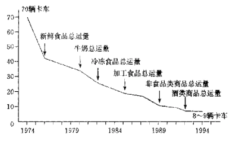

> 与前几章讨论过的丰田、IBM和德意志银行等
> 巨人相比，七-十一连锁店的故事似乎不值一提，以
> 这一章作为本书的结尾似乎也异乎寻常。然而，我们
> 将会发现，商业中的事并不总是像看起来那么简单。
> 
> 七-十一连锁店的历史开始时也只是个别企业
> 家头脑中的某些想法，这也正如前几章已讨论过的
> 其他公司一样。在美国，那位在这个连锁店的发展中
> 起关键作用的企业家在20年代就有了这个想法，而
> 日本企业家直到70年代才产生这个念头：七-十一
> 连锁店产生于美国，本章中有大量有关美国的便利
> 连锁经营的材料，但本章的主体和真正的中心还是
> 放在日本方面。本章中有几处令人惊奇之处。从总
> 体上说，日本零售业的效率不及美国，但日本的七-
> 十一连锁店的经营业绩却优于美国的同名店。日本
> 学生不仅超过了其美国老师，后来甚至把自己的美
> 国老师从破产中挽救了出来。这是一个令人惊奇之
> 处。
> 
> 另一个令人惊奇之处是本章的重点：经营七-十
> 一连锁店的日本公司可能是第三次工业革命的真正
> 代表。这家公司率先采用新的信息技术，并富有创造
> 性地把这一技术推向深入。该公司使用在线数据库
> 和销售点电脑终端，不仅记录了销售情况还记录了
> 顾客信息。它还发明了一种组织包括生产商和批发
> 商在内的供应商的新方法。该公司员工人数很少且
> 有形资产不多，基本上可以看作是一个虚拟公司，然
> 而在市场资本总额方面，该公司都名列世界50强。
> 
> 这样的情况怎么会出现在便利连锁店中呢？有
> 多少种公司能够充分利用第三次工业革命的力量
> 呢？这是不是大多数产业在21世纪中的必由之路
> 呢？
> 
> 在考虑经营日本七-十一连锁店的企业家经历
> 时，我们应该问自己，什么样的力量和条件可能会成
> 为他成功的障碍呢？当他向他的同事推销自己的想
> 法时为什么那么困难呢？当便利连锁店终于在日本
> 出现时，它为何能够取得如此成功、为何能够发展得
> 如此快呢？
> 
> 在比较日本和美国的七-十一连锁店的不同经
> 历时，是否可以说美国的七-十一连锁店仍然固守着
> 第二次工业革命中的商务模式不放，而日本的七-十
> 一连锁店则已进入第三次工业草命？这种说法是否
> 准确？本章将提供这些问题的一些答案。

# 第十三章 美国与日本的七-十一连锁店

**杰弗里·R·伯恩斯坦**

1991年3月，两家日本公司花了4.3
亿美元购买了索斯兰德公司70%的股份。
索斯兰德是美国和加拿大的七-十一便利
连锁店的经营者，该公司还许可20个不同
国家中的公司使用七-十一的店名。注入的
资金使索斯兰德免于破产。从表面上看，这
项收购与80年代末和90年代初日本人大
举收购美国公司中的几宗大买卖差不多，
如1989年三菱房地产公司收购洛克菲勒
中心，索尼公司收购哥伦比亚电影公司以
及1990年松下公司收购MCA。然而，收购
索斯兰德公司在两个主要方面是不同寻常
的。

首先，这项收购发生在零售业中，在这
个行业中日本公司并不出色。日本的销售
体系被形容为“前现代的、原始的、错综复
杂的、陈旧过时的、落伍的迷宫”。表13.1
显示，与其他工业化国家相比，日本人均拥
有更多的零售商和批发商，批发层次繁多，商店很小。巨型购物
中心和大型商店在日本很少见。

第二个不寻常方面是买主的身份：伊藤公司和日本七-十一
连锁店（该公司在名称中用文字“七”而在公司标志中用数字
“7"）。前者是日本零售业中的大王。17年前它从索斯兰德公司
获得了使用七-十一为店名的特许权，同时从索斯兰德那里获得
如何经营便利店的指导。伊藤公司是一个零售集团的核心，这个
集团的经营范围横跨超市、百货店、折扣店、特色店、餐馆等。这
个集团中的另一个核心成员是日本七-十一连锁店，它是索斯兰
德公司的共同买主，当年伊藤公司创建这个公司是为了让它管
理便利店。在收购索斯兰德公司时，日本七-十一连锁店在日本
有4300家便利店，在夏威夷有58家。

表13.1 80年代中期国际销售体系比较

|                 | 英国 | 西德 | 美国 | 日本 |
| --------------- | ----:| ----:| ----:| ----:|
| 每千人拥有零售店 | 6.1  | 6.7 | 8.1 | 13.5 |
| 每干人拥有批发部 | 未知 | 2.1 | 1.6 | 3.4 |
|批发交易与零售交易比率|未知|1.8| 1.9 | 4.2 |
|每个零售店拥有店员数| 6.8 | 5.8 | 7.5 | 3.9 |
|小商店（少于10名店员）的市场份额| 23.3% | 21.3% | 13.7% | 48.9% |
|大商店（多于100名店员）的市场份额| 63.6% | 44.9% | 65.2% | 15.0% |

资料来源：《服务业的生产力》，华盛顿·麦金赛全球研究所，1992年。

收购索斯兰德这件事表明，日本的七-十一连锁店在其短短
的历史中敢得了很大成绩；同时，索斯兰德的破产代表了美国便
利店行业中的先驱已经一败涂地。但这两个连锁店的故事不仅
是两个公司的兴衰史，同时它也说明了日本与美国的不同零售
环境，说明了从第二次工业革命到第三次工业革命转变的某些
方面。

## 索斯兰德公司从成立到1973年的历史

在19世纪后半叶的美国，与第二次工业革命中大生产技术
的普及和应用结伴而来的还有一场销售革命。在这个时期中出
现了连锁店，大百货公司和邮购商店。与老式的商店相比，这三
种新型零售商店的目标是薄利多销，铁路运输使运输成本大大
下降，这些新式零售商店利用这个优势不断繁荣壮大，为美国带
来了一个大众市场。20世纪初，汽车拥有量的扩大使自录商店
失宠，但却促进了百货店和连锁店的发展。20年代被称为“连锁
店”时代，因为药店、食品店和服装店等连锁商店在这几年里大
量涌现。

便利店也出现在这个时期。成立于1927年的索斯兰德自称
是世界上第一家连锁便利店。这家公司原来叫索斯兰德制冰公
司，由达拉斯的四家公司合并而成，拥有八个制冰厂和21家冰
块零售店。一个名叫克芳德·道雷的人为发展其家族的冰块生
意而促成了这次合并，他说服大富翁马丁·英瑟尔出资相助。可
是在1927年，索斯兰德公司下属的一个冰店里有一位名叫约
翰·格林的雇员，此人很有进取心，顾客要求他提供一些常用食
品，于是他除了卖冰以外又卖起了面包、鸡蛋和牛奶，结果很受
欢迎也很赚钱，因此这种做法又推广到其他冰店中。这些商店用
“图腾”作店名，门口竖着一根印第安图腾柱；每个店里都卖一些
食品，有的店里还卖汽油。

在大萧条时期，图腾店依然兴旺，但克劳德·道雷破产了，
索斯兰德公司出现金融危机，跟着也破产了。这时，法院委任索
斯些德公司董事，31岁的乔·汤普生为诉讼中的财产管理人，
负责对公司进行重组。1933年撤销了禁酒令，这对索斯兰德是
个莫大的帮助，它的商店里可以卖啤酒了，而且可以卖更多的冰
块用于冰镇啤酒。到1939年，索斯兰德恢复了元气，在达拉斯地
区已经拥有了60家图腾店。

在第二次世界大战期间，制冰业繁荣起来，图腾店也兴旺起
来，卖啤酒尤其有利可图。索斯兰德公司于40年代成为达拉斯
地区最大的制冰公司。1946年，索斯兰德公司决定用“七-十一”
作为店名，这是该公司在40年代走出的最重要一步。这个名字
是由达拉斯的一个广告代理机构想出来的，意思是商店的营业
时间从早上7点到晚上11点。1950年，达拉斯和福特沃斯地区
已有了80家七-十一连锁店，商店年收入达1000万美元。

50年代初，该公司跨出了达拉斯和福特沃斯地区，在奥斯
汀和豪斯顿开设了新店。1954年，索斯兰德公司跨出了得克萨
斯州，在迈阿密和杰克逊维尔又开了五个分店；50年代末，又有
更多的七十一连锁店在华盛顿特区开张。尽等索斯兰德公司的
管理人员担心便利店在寒冷地区兴旺不起来，但新商店依然一
举成功。与此同时，该公司还在本地进行扩张，于1959年吞并了
达拉斯地区的竞争对手。到1960年，索斯兰德公司所经营的便
利店总数已达490个。

60年代，索斯兰德的发展更是突飞猛进，其中部分原因是
领导人的变更。1961年乔·汤普生去世，其子约翰继任总裁。约
翰·汤普生后来回忆道：“爸爸想扩张，但他比我更加小
心……他经历过大萧条，亲眼见过公司破产，这当然会使人很小
心谨慎。”约翰·汤普生不像他父亲那样为未来担惊受怕，于是
便大力扩张。从1960年到1965年，索斯兰德公司便利店的数目
翻了三倍，从490家发展到1519家，到1970年则上升到3537
家。

1963年，索斯兰德公司收购了斯皮迪玛特公司，这个公司
位于加州，拥有126家特许便利店，这是索斯兰德公司扩张中的
一个中心环节。约翰·汤普生承认：“斯皮迪玛特给予我们经营
特许专卖店的技巧和知识。”索斯兰德公司由此开始经营特许专
卖店。公司把装备齐全的商店出租给经销商，经销商则向索斯兰
德公司上交一定比例的利润。特许经营加快了索斯兰德公司的
扩张速度，不过该公司仍然自己经营着很多商店。在美国的七-
十一商店中，特许专卖店从来没有超过总店半数的比例。

索斯兰德公司还在地理上不断扩张。到1970年，索斯兰德
公司在38个州、华盛特区以及加拿大的三个省拥有商店。从
1960年到1972年索斯兰德公司的股票正式在纽约证券交易所
上市时，公司的股东从317人增加到9500人。到1973年，索斯
兰德成为一个庞大的便利店王国，拥有近5000个七-十一连锁
店，营业收入达14亿美元，纯利润达2300万美元。

**索斯兰德公司发展的原因**

有利的市场条件促进了索斯兰德公司的成功。30年代，自
选超市在美国兴起，但其增长却先后受到经济萧条和战时限制
的束缚。从50年代起，超级市场迅速地把生活区中的夫妻老婆
店挤垮了，这种趋势在60年代进一步加速，于是为便利店留下
了一席空间，因为有些匆匆忙忙的顾客只想买几件物品。索斯兰
德和其他便利连锁店便利用这一空挡，把商店建在生活区附近，
而且多在发展速度快的郊区而不是在城区。便利店延长营业时
间，有时24小时营业，于是便利店与超市就有了差别。

当然，索斯兰德公司卓越的经营业绩并不是与生俱来的。该
公司富有创造力并乐于试验新思想，特别是乐于提供新产品。如
上文所述，索斯兰德公司从20年代起便开始在冰店中卖汽油。
1935年，该公司率先使用纸奶盒。该公司推出的最著名的产品
是一种名叫“斯乐皮”的冰镇碳酸饮料。这种产品本来是由生产
冷饮零售机的生产商开发出来的，但索斯兰德公司却给饮料取
厂“斯勒皮“的名字并在自己的店里销售起来。1965年，该公司
试着买了三台冷饮零售机，第二年便在几百个店中配了机器，售
出了1.5亿份斯勒皮。当然，并非所有新产品都能获得如此成
功。索斯兰德公司于50年代后期推出的一系列微波炉快餐食品
就显得超前了。

在提供新服务方面，索斯兰德公司也是领先的。到50年代
中期，它开始出售汇票、电视机显像管测试仪和配钥匙机。60年
代后期，七-十一商店开始出租地板打磨机、地毯清洗器和电视
机。有些服务项目不久便消失了。但有些服务项一直延续至
今。继美国邮政之后，索斯兰德公司是美国的第二大汇票销售
者，它也是州营彩票的最大销售者。七-十一商店成为“一应俱全
的小店”。

在管理方面，索斯兰德公司也有创新。它从1949年起便采
用了雇员分红制度。1969年，它又发明了一种新的销售系统。当
年，即将离任的陆军空军交流处主任乔·哈丁受雇设计一套新
系统，该系统的基础是索斯兰德公司的地区性销售网。分销中心
利用计算机进行仓储管理、物资调运和运输，力图减少店内库
存，简化向商店进行小批量运输的过程。1973年，这种分销中心
开始运行，向半数以上的七-十一商店提供服务。当时，甚至在几
年后，这种系统仍然被认为是最先进的。

## 便利店进入日本

日本便利店的兴起较晚，这与日本的零售业历史有着根深
蒂固的关系。

在日本，大型的百货商店出现在20世纪初，比美国晚了40
年。这些百货店本来大多是出售和服以及棉纺服饰的服装店，且
大多有几百年的历史。如，三越公司是成立于1673年的一家和
服店，1904年成为日本最大的百货商店。

在20年代和30年代，各种各样的公司进入了百货业，其中
有许多公司是铁路企业，他们把百货商店开在繁忙的车站附近
或车站内。

正如在美国和其他国家一样，百货商店在日本的兴起威胁
了许多小店主的生路，于是小店主们便要求限制大商店的攻击
性降价行为并企图使当权者限制百货商店的发展。为防止政府
干预，日本百货商店协会于30年代中期主动限制自身的发展，
但这些限制措施却不能使小店主们满意。1937年日本颁布了
《百货商店法》，把产业置于政府的严格控制之下，这个法律具有
划时代意义。

大小零售商和新旧零售方式之间的冲突在许多国家都存
在。在20年代和30年代，美国的大小零售商在零售价格、批量
折扣以及连锁店的扩张等问题上大动干戈。

美国的小零售商也取得过一些胜利，如1936年的《罗宾逊-
帕特曼法案》限制了大零售商从批发商那里获得的批量折扣的
幅度，但在大多数情流下都是大零售商占上风，因为美国的联邦
法院往往把歧视大零售商的立法裁决为不符合宪法精神。

然而，在日本大小零售商之战中的结果却往往是另一个样
子，低价格中所体现的消费者利益得服从保护现存小商店的需
要。

《百货商店法》于1937年通过后，特别是第二次世界大战爆
发后，大小零售商之间的摩擦暂时平息了下来。在盟军占领日本
期间，《百货商店法》被推翻了，但不久又出现了问题，于是1956
年又开始实施一项类似条例。这个条例还叫做《百货商店法》，它
规定，任何大于1500平方米的零售商店的开业和扩充都必须
得到通产省的批准，规定面积实际上只相当于美国的一个小百
货店（日本大城市中的规定面积为3000平方米）。在实际操
作中很难获得通产省的批准，即使申请得到批准，那也往往是四
至七年以后的事了。

不过，这项条例中有个漏洞，有些精明的商人便很快钻了空
子。法律条文只适用于单个企业，于是便有人建了好几层楼的商
店，每层面积都不超过1500平方米，并由不同的公司管理。这
些多层商店被称为超级商店，以相对低廉的价格出售副食品、服
装和其他日常用品。有些企业家甚至开始连锁经营超级商店。尽
这种做法触犯了《百货商店法》的精神，但为了促进销售业的
现代化，执法当局对此便视而不见。小零售商对此有多少投
诉，因为日本的超级商店并不多，而且60年代的日本经济年增
长率大多超过10%，所以超级商店的扩张并未妨碍小商店的发
展。
不过《百货商店法》确实妨碍了现有百货商店的发展，百货
商店较之超级商店更加保守同时也受执法官员更严格的监察。
结果，到了70年代初，有些连锁超级商店一跌超过了百货商店，
成为日本最大的零售商（见表13.2）。

表13.2 日本十大零售商（销售额以百亿日元计）

| 1960 |     | 1972 |      |
|------|-----|------|------|
| 商号 |销售额| 商号 |销售额|
|Mitsukoshi| D | 45 |Daiei | S |305|
|Daimaru   | D | 45 |Mitsukohi| D | 292 |
|Takashimaya| D | 39 |Daimaru| D | 213 |
|Matsuzakaya| D | 37 |Takashimaya| D | 199 |
|Toyoko| D | 30 | Seiyu | S | 167 |
|Isetan| D | 23 | Seibu | D | 155 |
|Hankyu| D | 21 | Jusco | S | 155 |
| Seibu| D | 19 |Matsuzakaya| D | 149 |
|Soga | D | 15 |Nichii| S | 144 |
|Matsuya| D | 12 |Uny | S | 126 |

| 1980 |     | 1993 |      |
|------|-----|------|------|
| 商号 |销售额| 商号 |销售额|
| Daiei | S | 1134 | Daiei | S | 2073 |
|Ito-Yokado| S | 688 | Ito-Yokado | S | 1536 |
|Seiyu | S | 599 | Jusco | S | 1061 |
|Jusco | S | 554 | Seiyu | S | 1050 |
|Mitsukoshi| D | 546 | Nichii | S | 822 |
|Nichii| S | 455 | Mitsukoshi | D | 801 |
|Daimaru| D | 421 | Takashimaya | D | 724 |
|Takashimaya| D | 415 | Seibu | D | 681 |
| Seibu | D | 375 | Uny | S | 577 |
| Uny | S | 126 |Daimaru| D | 543 |

注：D代表百货商店公司，S代表超级连锁商。

资料来源：罗伊·拉克著，《日本零售业》，伦敦：劳特利奇出版社，1994年。

**伊藤公司的诞生**

在新型的超级商店中，最富创新精神的是伊藤公司。1972
年，它是日本第17大销售商，销售额达260亿日元（8500万美
元）。如表13.2所示，1980年它成为第二大销售商，仅次于代英
公司。它与赛松集团以及代英公司是日本销售业中的领头雁，而
且从60年代中期以后，三家是最直接的竞争对手，它们的传统
很不一样。

代英公司的根扎在日本西部，特别是大阪。它成立于1957
年，本来是个折扣药店，后来又从经营药品和化妆品转而进行多
种经营，同时经营副食品和各种各样的日用品。通过建新店和收
购其他连锁超级店，它的业务迅速扩张，到1964年已经拥有20
个超级店。扩展是代英公司的首要任务，后来它又跨入了与零售
无关的行业，如出版、金融、甚职业棒球。代英公司的业主很注
重购置地产，他相信“在日本，只有那些拥有土地和房产的人才
有商业机会”。在许多方面，代英公司的扩张策略是其业主中内
勇夫个性的延伸，此人在其传奇的一生中一直是一名勇敢的领
袖人物，他不怕挑战并勇于接受挑战。

伊藤公司的根生在东京，其创始人伊藤正年本来在三菱矿
产公司工作，二战后辞职转而经营家族的商店。其长兄于1956
年去世，正年接管了家族的商务，当时只有一个中型超市，20名
雇员，年销售额1亿日元（28万美元），1961年，伊藤应邀参加了
一个前在美国的参观团：这是伊廉首次出访美国，在这次参观
中，美国连锁店的繁荣给他留下了深刻印象。伊藤坚信，连锁店
在日本也能兴旺起来。1962年，他组成公司，开始经营超级商
店。到1964年，他在东京地区已经拥有八家超级商店。1965年，
他把公司更名为伊藤公司。

与代英公司相比，伊藤公司在扩张过程中更加慎重，而且对
收购和多种经营的依赖性也不那么大。代英公司全力扩张，而伊
藤公司则更注重盈利，代英公司急于积累土地和房产，而伊藤公
司期宁愿把资产保持在低水平上，尽可能租用设施。最后这一个
不同点对这两个连锁超级商店获取外部资金的方式有很大影
响。代英公司拥有大量的不动产可以用作抵押，因此向日本的银
行大肆借款，而伊藤公司则没有这个条件，于是它首创了新的集
资办法。这些新办法包括售后回租协议和向科威特政府出售以
日元单位为面值的债券，这在日本公司中是闻所未闻的。

尽管有诸多不同，但代英公司和伊藤公司在70年代初都遇
到了一个共同问题，其实所有超级商店都遇到了这个问题，超级
商店的竞争以及日本经济增长减慢损害了小零售商和批发商的
利益，于是他们又一次动用强大的政治力量要求政界人士限制
连锁超级商店的扩张。不久，超级商店公司便难以像从前一样轻
而易举地建大商店了。要想发展，他们必须找到其他不太受限制
的生意。便利店便是走出这个困境的一条出路，虽然这一点当时
还不是很清楚。

**便利店的兴起**

便利店的概念已经引起了日本人的兴趣，但这部分日本人
主要是饱受挤压的小零售商，特别是批发商，他们组织起“自愿
连锁”，这种连锁店实际上是一种由小零售商组成的协会。这种
连锁店对商店设计和经营政策的标准化要求较低，所以在组织
上不如特许经营连锁店的组织严密。这种连锁店对其成员提供
的指导和帮助也较少。

1969年，一个名叫“我的店”的自愿连锁店成立了，成为在
日本开业的第一个连锁店。不久，其他自愿连锁店也相继成立，
出现了伊苏米食品连锁店和凯玛特连锁店。（后者与美国的凯玛
特公司并无关系。日本公司常使用从英语中来的洋名称，借以树
起“摩登”形象。）总体来说，日本的政府官员欢迎自愿连锁运动，
认为这是保护小商店并提高其生产率的一个途径。1972年，通
产省下属的中小企业署发行了《便利店手册》，帮助小零售商和
批发商组成自愿连锁店。

其他公司也试探性地进入了便利店零售业领域，这些公司
大多是批发商和食品商。1973年，赛裕公司成为第一家进入便
利店零售业的连锁超级商店，它先是在东京的郊区开办了一个
试验性商店。

然而，这些先期努力的效果都不能与日本七-十一连锁店的
创立相比，这个连锁店是日本第一次大规模地向便利店行业进
军的连锁店。这项决策主要归功于一位名叫铃木的年轻人，当时
他只是一个年轻的经理，后来成为伊藤公司的总裁和日车七-十
一连锁店的董事长。

铃木原先在出版销售业中工作。1963年，铃木31岁时遇到
了伊藤，伊藤给他留下了很好的印象，于是铃木便辞去工作，加
入到伊藤羽翼未丰的连锁零售工作中来。1971年，铃木成为伊
藤公司的主任：当年春天，铃木数次赴美，与戴尼连锁餐馆谈判
许可协议事宜。他到处都能看到七·十一连锁店，对此印象尤深，
1971年，他建议在日本开设特许连锁便利店。

铃木的建议在公司中引起了强烈反对，公司内的许多经理
都认为，该公司应继续建立大商店以充分利用规模经济的优势。
公司中的其他官员以及公司的外聘顾问、经济学家和产业专家
一致认为，便利店的概念在日本成干上万的传统小商业中已存
在。而铃木却认为，便利店可以为公司带来利润，同时还可以减
轻大小商店之间的摩擦。他认为，大批小商店并不构成障碍，相
反倒是一个机遇。铃木清醒地认识到大部分日本小店的生产率
都很低下，他设想，伊藤公司可以通过特许经营体系向这些小店
提供管理技巧和支持以换取它们的部分利润。他向索斯兰德公
司寻求有关管理特许经营系统的知识，因为该公司在美国和加
拿大拥有一个巨大的七-十一连锁店网络。铃水终于战胜了怀疑
论者，说服伊藤至少应该试着与索斯兰德公司达成某种协议。

索斯兰德公司起先对此并不感兴趣，但铃木坚持不懈。克服
了开头的困难之后；谈判中仍有几个棘手问题。索斯兰德公司要
求：①与伊藤公司合资，②日本市场一分为二，伊藤公司只能
在东部市场上用七-十一的名字；③相当于销售额1%的专利使
用费；④在八年内至少开设2000个商店。

在前两个问题上，伊藤公司非常坚决：它决不参与任何形式
的合资而且要求在全日本享有使用七-十一店名的权利。它还要
求降低专利使用费和商店数量的下限。最后，索斯兰德公司放弃
了前两点，并在后两点上作出妥协。专利使用费降到销售额的
0.6%，商店数目的下限降到1200家。在这些条件的基础上，两
家公司于1973年11月达成了特许协议。

1973年，索斯兰德公司在向股东发出的年度报告中说：“索
斯兰德将参与日本食品零售业的现代化进程，对此我们感到万
分荣幸……我们对这项举措的未来感到十分乐观。”大家当时都
没有意识到，这种评价真是有先见之明。

1973年的协议促成了本七-十一连锁店的创立，使日本
出现了新式连锁便利店。起初，新成立的机构叫做约克-七，它是
完全属于伊藤公司的子公司。伊藤和铃木认为，便利店与作为公
司核心的超级商店有着本质的区别，所以他们成立了一个独立
的实体。正因为如此，约克-七的首批15名雇员乎全都来自零
售业以外的部门。用日本七-十一连锁店的公司正史中的话说，
开办新公司的任务被委托给了“一帮业余选手”。即便如此，约
克-七的总裁仍然是铃木，伊藤任董事长。

在开业前。部分“业余选手”被派往美国，接受索斯兰德公司
的培训。伊藤公司有很强的以盈利为目的的倾向，但日本学员对
索斯兰德公司的经营之道印象很深；索斯兰德公司认为，便利店
不应当与超级市场卷入价格竞争。同时他们还认识到了索斯兰
德公司高度发达的结算体系的价值，他们认为这是在母公司和
特许经营者之间建立信任的重要手段。然而，铃木和其他雇员不
久便认识到，索斯兰德公司可资借鉴的经验是有限的。要想在日
本取得成功，他们必须创建一个适应日本环境的新体系。他们的
许多创新将在本章的最后进行讨论，且让我们先看看他们取得
的成果。

## 日本七-十一连锁店及其业绩

1978年，约克-七公司更名为日本七-十一连锁店。1979年，
该公司从伊藤公司中部分独立出来，在东京股票交易所上市。从
1974年5月该公司开设第一家商店时起，日本七-十一连锁店
（包括其前身约克-七）创下了骄人的经营业绩。商店数量稳步上
升，1980年达1000个，1984年达2000，1987年达3000，1990
年达4000，1993年达5000，1995年达6000。公司的销售额和
利润也保持了强劲的增长势头（见表13.3）。

表13.3 日本七-十一连锁店的发展

| 年份 | 店内销售额（百万日元） | 总收入（百万日元） | 纯收入（百万日元） | 商店数目 | 雇用人数 | 每个商店库存量（千日元） | 毛利（百分比） | 日销售额（千日元） |
| ---- | ----:| ----:| ----:| ----:| ----:| ----:| ----:| ----:|
| 1975 |  726 |  406 | -158 |  15  |  45  | 未知 | 未知 |  未知 |
| 1976 | 4769 | 1324 |  -41 |  69  |  91  | 未知 | 未知 |  未知 |
| 1977 | 17401| 3067 |  365 | 199  | 161  | 未知 | 24.0 |  365 |
| 1980 |109775|16619 | 1815 | 801  | 189  | 7739 | 25.0 |  436 |
| 1983 |256470|49176 | 5179 | 1643 | 890  | 6230 | 26.8 |  482 |
| 1986 |453616|83757 | 11628| 2651 | 1189 | 5471 | 27.4 |  506 |
| 1989 |686356|100246| 22304| 3653 | 1489 | 5129 | 28.3 |  545 |
| 1992 |1081871|162820|40674| 4687 | 1814 | 5165 | 29.0 |  670 |
| 1995 |1392312|214560|49525| 7965 | 2364 | 5114 | 29.6 |  676 |

数据来源：日本七-十一连锁店。

超级商店开始时的扩张正遇上日本经济的高速增长时期；
而日本七-十一连锁店则不然，宅在日本经济总体增长比较缓慢
的情况下实现了迅速扩张，同时它还面临着许多新对手的激烈
竞争。它最主要的竞争对手是代英公司和赛松集团，但小竞争对
手也不少。（1973年日本只有500个便利店，1995年日本便利店
的数目达4.68万个。尽管如此，日本七-十一连锁店很快成为
日本最大的连锁便利店，到90年代中期仍保持着这个地位（见
表13.4)。

表13.4 1995年日本五大连锁便利店排行榜

| 店名 | 母公司名 | 成立年份 | 店内销售额（兆日元） | 商店数目 | 日均销售额（千日元）| 特许连锁店（百分比）| 覆盖的府县数目 |
| ---- | ---- | ---- | ---- | ---- | ----| ----| ---- |
|1. Seven-Eleven | Ita-Yukado Group |1973 | 1392 | 5952 |689 | 96 | 21 |
|2. Lawson | Daiei Group | 1975 | 821 | 5139 | 450 | 80 | 41 |
|3. FamilyMart| Salson Group| 1978 | 471 | 3454 | 513 | 26 | 31 |
|4. Yamazaki Daily Store/Suntry|Yamazaki Bread|1977| 353 | 2616 | 379 | 95 | 38 |
|5. Circle K| Uny | 1979 | 275 | 1734 | 462 | 92 | 19 |

资料来源：《便利店》，1995年秋冬季刊，1996年春夏季刊。

日本七-十一连锁店不仅在便利店行业中称雄，它还是日本
最大的食品零售店，也是日本盈利率最高的零售商。1995年的
一项研究把七-十一连锁店和微软公司着作是日本和西方商业
管理中的最优秀代表。同年，日本的商业报纸所进行的一项调查
称七-十一连锁店为最优秀的日本公司。

日本七-十一连锁店巨大的市场价值表明投资者极为重视
其盈利率和增长潜力。90年代中期，根据市场资本总额计算，该
公司在世界上公开上市的非保险业公司中名列第46位（其母公
司伊藤公司名列第70位）。表13.5比较了它与几个著名大公司
的规模。

表13.5 根据市场价值排定的世界上最大的非保险业公司

| 排名 | 公司（国家） | 市场价值（百万美元） |
| ---- | ----------- | ------------------- |
|   4  | 丰田汽车（日本）|  78788           |
|  14  |沃尔玛特连锁商（美国）|  57169 |
|  23  |通用汽车（美国）| 36990 |
|  24  | IBM（美国） | 36018 |
|  43  | 微软（美国） | 29232 |
|  46  | 日本七-十一连锁店（日本）|  28344 |
|  55  | 英特尔（美国） | 26111 |
|  64  | 日本钢铁（日本） | 22972 |
|  69  | 索尼（日本） | 21900 |
|  70  | 伊藤公司（日本）| 21791 |
|  71  | 德意志银行（德国） | 21740 |
|  86  | 麦当劳（美国） | 19161 |

资料来源：《华尔街杂志》，1994年9月30日

日本七-十一连锁店不但自身取得了出色业绩，而且在伊藤
公司集团中也发挥了重要作用，因为它能收到大量现款并对集
团中其他公司的经营有影响。在日本社会中，它是把信息技术引
入小商店的重要渠道，它是使日本销售渠道合理化的一支坚持
不邂的重要力量。它与美国的沃尔玛特连锁商一样，表明第三次
工业革命已经进入零售业。它与它的母公司被比作是沃尔玛特
连锁店，其创始人伊藤则被称为“日本的山姆·沃尔顿”（山姆·
沃尔顿为美国沃尔玛特连锁店的创始人）。

**日本七-十一连锁店增长中的基本因系**

便利店是典型的美国店，它能在日本繁荣起来似乎很令人
吃惊。便利店是泊来品，因此日本人认为它与典型的日本小商店
不同，这可能是便利店有吸力的原因之一；日本主要的连锁便
利店大多取了有洋味的名字，这也许是为了强化这种印象。便利
店是否是泊来品并不重要，重要的是人们认为它有洋味。据
说，日本七-十一连锁店直接从美国进口的商品只有三种；1994
年，进口商品在该公司的销售中所占的比例还不到1%。

日本七-十一连锁店的发展有着一些有利的市场条件，与早
年美国索斯兰德公司的发展情况很相像。但有一个因素却是日
本独有的，那就是管理法规方面的变化。1974年，第一个七-十
一店在日本开业时，一项新的限制大商店发展的法律开始生效。
起初，这项《大商店法》受到几乎所有零售商的拥护，原因有二。
其一，这项法律与1956年的《百货商店法》不同，目的是兼顾消
费者的利益并保护小零售商。此外，这项法律采取了通报和建议
程序，比起建立在许可证基础上的《百货商店法》似乎少了些限
制。然而，这项法律的实施并不是在法律框架内进行的；控制这
一法律程序的权力交给了地区性的商店业主协会，他们当然会
反对任何新商店的开业。后来，《大商店法》变得限制性更强，
1978年修订的大商店法甚至适用于500平方米以下的小店，
而且批准新店开业的手续更复杂，要花很多时间。

法律对大中型商店的束缚限制使便利店获益匪浅。立法者
有两个理想，一是使日本的销售系统现代化，二是提高小零售商
的生产效率，而像日本七-十一连锁店这样的商店正好符合这两
个条件，所以他们的营业时间未受限制。于是，这些商店便把自
己定位在“便时”，营业时间比传统的小商店长，有时甚至24小
时营业，这在日本是非同寻常的，因为《大商店法》限制大商店的
营业时间。（在金融业中，自动取款机的萱业时同也曾受到过限
制，显然也是为了保护小银行。）为了强调这点，日本七-十一
连锁店在早期的广告中曾用过这么一句广告词，“太好了，还没
打烊！”

《大商店法》驱使许多超级商店学伊藤公司的样子，也开起
了连锁便利店。在90年代，日本的五大连锁商店有四家附属于
以超级商店为中心的零售集团。总的说来，日本的便利店并非超
级商店的竞争者，而是超级商店进行扩张的一个变通手段。而美
国却不然，美国的便利店通常是独立的，是超级市场的竞争对
手。

公司集团在日本的连锁便利店中其有很重要的作用。七-十
一便利店中出售的许多商品在开头都是由伊藤公选定的。日
本七-十一连锁店在刚开张不久店面不多的情况下就可以对批
发商提出要求，这主要是因为伊藤公司在市场上很有力量。劳森
连锁店是个主要竞争对手，这个连锁店刚开张时便多灾多难，它
也是仰仗其母公司代英公司的财力才渡过了难关。

日本的超级商店和便利店的关系表明，这两种不同的零售
部门不会卷入融烈的竞争。当然，单枪匹马的超级商店无疑也想
与便利店争抢生意。然而，大型商店所拥有的价格优势在日本零
售业的传统中并不是一个关键因素。研究日本零售业的一位学
者写道，日本零售业中没有价格竞争使得“同样商品在不同类型
商店中的价格基本一致”。

90年代，日本经历了长期萧条，零售业也开始发生变化。有
些零售商开始希望通过大幅度降低价格以得到更多的市场份
额。于是便出现了“价格毁灭”的说法。例如，代英公司推出了一
种标价只有每听40日元的自行罐装可乐，价格只是品牌可
乐——如可口可乐——的三分之一，在市场上起了骚动。不
过，“价格毁灭”的范围也不可过分夸大。在日本零售业中，折扣
店只占很小比例；根据美国的标准，日本的价格竞争根本算不了
什么。

另外，便利店所处的她理位置也使得它相对免受大型零售
商的挤压。因为城区地价很高，所以超级商店一般都在郊区，但
日本的便利店都在城区。此外，与美国的便利店不同，日本的便
利店无须与出售食品和杂货的加油站竞争；来自连锁快餐店的
竞争也不像美国市场那么严重。不过，日本的便利店却要和无所
不在的自动售货机竞争。从听装咖啡、酒精饮料到报刊杂志，日
本自动售货机无所不售。据估计，均每30个日本人就有一
台自动售货机；而美国平均每55个人才有一台。

即使如此，日本便利店的最主要竞争对手仍是大量的夫妻
店。食品零售是便利店业务中的大头，然而日本的食品零售比其
他商品的零售更分散。在商品种类和营业时间方面，传统的夫妻
店往往不是便利店的竞争对手，而且它们也无法提供新式便利
店所能够提供的务种各样的服务，如复印传真及至自行车保险
等。这些服务在商店的销售中占很小份额，而且对商店而言一
般也无利可图，但这些服务却能吸引顾客。此外，便利店拥有新
式的管理技巧并且能得到母公司复杂的指导。总之，因为便利店
拥有如此优势，它能够取代大量的夫妻店也就不足为奇了。

便利店满足了日本的传统零售店所不能满足的需求，这一
点与许多人的看法正好相反。便利店拥有传统小店所具有的最
大优势，即便利性和顾客服务，同时便利店又弥补了传统小店商
品种类不丰富的缺陷。

便利性之所以重要与日本人的购物模式有关。日本家庭比
美国家庭的空间小得多，而且比大多数欧洲家庭小。家庭存储空
间不足以及日本人对新鲜程度的偏好使日本人的购物频率很
高。因为日本的公路比较狭窄拥挤，所以日本人大多在公共交通
比较方便的场所购物。所有诸如此类的因素使日本人较少到超
级市场购物，因而也就使得便利店有了相当的吸引力。此外，妇
女就业人数的上升对营业时间较长的便利店也有利。

这些因素可以解释便利店在日本的增长但却无法解释为什
么有的连锁便利店比别的连锁便利店做得好。在80年代之前，
几乎所有便利店的经营者都发了财，但随着70年代末和80年
代初大批经营者拥入便利店行业，有些连锁便利店——特别是
地区性的连锁便利店——销售出现了停滞，利润率下降。即便
在日本七-十一连锁店及其大竞争对手之间，经营业绩也有很大
差别，这表明具体公司内部的特殊因素起着重要作用。

**日本七-十一连锁店成功的公司内部因素**

使日本七-十一连锁店获得成功至少有四大策略：特许经营
体系和市场主导策略；分售的合理化；食品生产的协调；在信息
技术中的投资。每一项策略都值得仔细研究。

**特许经营体系和市场主导策略**

日本七-十一连锁店向索斯兰德公司学习了管理特许经营
体系的方法，但它走的却是另一条路。索斯兰德公司一般是买或
租一块土地，建起一个商店后再通过特许经营协议交给别人经
营。日本七-十一连锁店则不然，它仔细选择现有的夫妻店，然后
说服店主把自己的店变成七-十一连锁店。这种方送并未直接侵
犯到小店主的领域，因此使可能出现的爆炸性政治对抗的可能
性降到了最低程度，而且这种方法并不需要日本七-十一连锁商
在财产和开发上投入多少资金（该公司严格避免在房地产方面
投资。该公司的总部与伊藤集团中的其他公司合租一幢面积不
大的办公楼。）

从一开始，日本七-十一连锁店便强调立志于发展小商店的
决心。铃木坚持要求日本的第一个七-十一连锁店应该是一个特
许经营店，不应该是一个由公司管理的试验店。尽管如此，启动
特许经营体系并非易事。便利店在当时的日本还是无人尝试过
的新概念，许多店主并不情愿放弃独立、把自己的店名换成七
十一连锁店的标志。第一批特许经营者大多为年轻店主，他们营
生艰难，对自己的前途没有把握。实际上，七-十一连锁店的第一
个特许经营者是一位23岁的小店主，他拥有一个卖酒的小店但
却看不出卖酒能够有什么发展前途。日本七-十一连锁店的第一
批特许经营者开始取得了一定成果之后，其他店主才开始产生
兴趣。

不久，日本七-十一连锁店向其特许经营者提供的服务便开
始风靡日本，这是有原因的。例如，如果卡车运货线路中断，该公
司愿意用摩托车、小船、甚至直升飞机运送商品。该公司还保证
风险。该公司准备了详细的、综合性的、然而又通俗易懂的经
营手册和店员培训手册。一名被称为经营顾问的公司雇员负责
帮助经营者决定如何进货，推销以及如何搞商品展示。每个经营
顾问负责八个商店，每周走访每个商店两次，每次至少两个小
时。

除了给予这种指导之外，该公司的最高层也给予相当的控
制。日本七-十一连锁商坚持要与特许经营者签订严格的合同，
规定每个商店都必须全年每天都营业。合同有效期为15年，时
间很长，但为了使习惯于经营家庭店的特许经营者产生一种“商
业”意识，这是必要的。在选择特许经营者时，精明的日本七-十
一连锁店瞄准了卖酒的店主，这些人拥有十分有价值却又很难
弄到手的酒类经营执照，而且这些店一般也位于交通要道之处。

日本七-十一连锁店还依赖“市场主导”策略。这条术语的意
思是，连锁店只向新商店可以聚集在一起的地方扩张。该公司信
守市场主导原则的态度可以从表13.4的最后一栏数据中略见
一斑，这栏数据比较了该连锁店与其他连锁店在地理分布上的
区别。尽管日本七-十一连锁店所拥有的商店数量比其他任何连
锁店都多，但该连锁店于90年代中期在日本47个县中的21个
县有经营活动。商店的集中有三个目的：防止其他连锁店进入该
地区，提高分销和特许经营指导活动的效率；提高商店的知名度
和投放在该地区广告开支的成本效益。

当然，市场主导策略是一把双刃剑，它有许多好处，但同时
也使竞争者在其他地区得以站稳脚跟，日后很难再打进去。到
90年代中期为止，日本七-十一连锁店尚未能进入有厚利可图
的关西地区（包括大阪、京都、奈良和神户）。在这一地区，代英公
司的劳森连锁店几乎成了便利店的代名词。但总的来说，日本
七-十一连锁店的特许经营方法是成功的，受到了日本许多连锁
便利店的仿效。

**分销的合理化**

分销的合理化是日本七-十一连锁店经营策略中的第二大
支柱，与传统的日本销售体系有着根本不同。在传统的日本体系
中，商店与生产商之间的联系要经过很多分销环节，每个生产商
都有一个产品销售总代理，总代理依靠二级有时甚至是三级批
发商把产品分销到商店中。这种多层次的体系很笨拙，开销也很
大。

为解决这一问题，日本七-十一连锁店从1976年起采取一
种卖主合并的政策，要求同一地区的所有生产商都把产品交给
同一个批发商，不容许生产商选择自己的批发商。该地区的惟一
批发商负责向地区中的所有七-十一商店分送多家生产商的产
品。这项改革大大减少了每日送货次数，简化了送货路线。

同年，日本七-十一连锁店出台了一项所谓的“统一分销"措
施，把商品按运送条件进行分类，其中最值得注意的是按商品的
储藏温度分类：冷冻食品（一20°C），冷藏食品（5°C），日式午餐盒
饭（20°C），干燥食品和非食品类商品（室温）。同类商品被送到统
一分销中心（42个冷冻中心，42个冷藏中心，51个午餐盒饭中心，
31个干食品中心，41个非食品类商品中心，14个酒类中心）。这
些中心分布在全国的168个地点，有些地点有不止一个分销中
心。

重要的是，日本七-十一连锁店自身并不拥有这些中心，而
且既不拥有任何运货卡车也不拥有其名下的商店。该公司的供
货商和几家专门从事分销的公司拥有并经营这些分销中心。日
本七-十一连锁店的作用仅局限于协调、帮助和支持。铃木解释
说：“批发商拥有人力资源，而且也有地产和房地。我们不搞新投
资，我们的目标是通过与现有的批发商合作以降低成本并使分
销合理化。”

改变现存的分销体系并非易事，因为这种改变会影响到现
存的关系。然而，日本七-十一连锁店毫不妥协。正如铃木所说：
“我不管这个产业过去是如何经营的。我只考虑‘我这样做能够
解决问题吗？’”通过合并其分销商，日本七-十一连锁店减少了
摩擦。即使生产商指定的批发商并不运送任何产品，该连锁店仍
然付给这个一级批发商一定的佣金（日本七-十一连锁店并未根
除所有的二、三级批发商）。许多批发商都同意参与统一分销并
发现很有利可图，但也有批发商不买账，拒绝合作，其中包括一
家很有名的批发商。

日本七-十一连锁店的分销改革成效显著。图13.1表明，随
着该公司对其体系的不断调整，为每个商店送货所需的卡车数
量不断减少，每辆卡车的利用率当然随着提高了。例如，在运送
干食品的过程中，为该公司服务的卡车的利用率达到85%，而
其他零售商的平均利用率只有30%。分销体系的改革以及在信
息技术方面的投资（见下文）使本七-十一连锁店得以大幅度
降低存货量，提高了毛利率，即使在销售额上升时仍然如此。

数据来源：日本七-十一连锁店。

分销改革的另一项成绩是极大地提高了某些商品的送货频
率。例如，从1987年起，饭团和年餐盒饭每天送货三次，面包和
奶制品每天送货两次。新鲜食品和快餐在日本七-十一连锁店销
售的商品中占有很重要的份额，所以商店能够比竞争者提供更
新鲜的食品是至关重要的。对新鲜程度要求不高的食品送货频
率要低一些，例如，加工食品每周送货只有三次。

**协调食品的生产**

在美国七-十一连锁店旺销的食品——如斯勒皮和热
狗——在日本七-十一连锁店中销售平平。日本七-十一连锁店
把重心放在饭团和年餐盒饭等传统的日本快餐上。为了抓住对
这种快餐的潜在要求，商店必须提高这些食品的质量；为此，日
本七-十一连锁店介入了食品生产，组织起自己的快餐和新鲜食
品生产商。

制作这种食品的公司通常都很小，一般都缺乏生产和管理
经验。日本七-十一连锁店成立了一个合作性的协会，叫做日本
美食协会，以帮助这些小公司。这个协会成立于1979年，开始时
由十个生产米制食品的小公司组成，参与者相互交流生产经验
以期提高产品质量和生产效率。起初，很少有参与者愿意就范；
后来协会组织了质量管理研讨会并确立了三级（A，B，C）质量
评估系统。如果某个公司有一项被评为C，那么该公司必须采取
决定性的行动，努力提高自己；如果某公司有三项被评为C则
不能再作为日本七-十一连锁店的供应商。

到90年代中期，日本美食协会的成员已经包括约100个公
司，不但生产米制食品而且还生产特色面包和配菜。这个协会不
但创立并监督执行质量标准，它还从事生产方法研究并承担大
宗原材料的购买。该协会作出的种种努力提高了日本七-十一连
锁店中销售的快餐和新鲜食品的质量，还统一了各商店中的质
量标准。

正如有些独立的批发商愿意为日本七-十一连锁店成立专
门的分销中心，同样也有很多生产商专门为该连锁店建立工厂，
生产特供商品。到1995年，这样的工厂有214家。日本美食协
会的成员尤其依赖该连锁店。这个协会的成员下属工厂中有四
分之三把自己90%的产品都卖给日本七-十一连锁店。

**信息技术的应用**

日本七-十一连锁店利用计算机网络把生产商、销售商和各
个分店连接起来。迅速引进信息技术并不断进行技术升级是该
公司能够不断取得成功的一个重要原因。该公司在技术升级方
面花了大笔资金，据说其技术基础设施已经更换了80多次。

该公司进入信息技术领域的本意是为了简化原先的电话定
货程序。利用电话订货时，店主必须分别给各个供货商打电话。
1978年，计算机处理的定货单取代了电话订货。店主们填好定
货单并送交地区办事处，由地区办事处把订货单输入电脑。在不
到一年的时间里，这些订单又被一个简单的条形码系统取代，店
主只需在店内的电脑终端上输入定货数据即可。这种被称为7
号终端的计算机系统是日本七-十一连锁店的第一代信息系统。
1979年，该公司又建立了一套在线网络，把商店和供货商以及
总部连了起来。这样一来，定货程序变得简单了，并且更加准确。

简化定货程序仍然是个重要目标，但该公司不久便把重点
转向如何利用自动收款机所取得的数据来决定定货、推销和新
产品开发。1982年，该公司把自动收款机引进了每一个分店并
采用了一个新的电子定货系统。如此大规模地利用销售数据在
日本还是首例。1985年，该公司又用一个更先进的系统替换了
老系统，增加了可以双向传输数据的新式自动收款机。（商店因
此可以掌握特殊的季节性礼品的库存情况，以便为顾客定购自
己未库存的商品。）每个商店中还装了一台个人电脑，以便店主
和雇员对销售数据进行图解式分析。

1990年，日本七-十一连锁店采用了第四代信息系统，其开
发费用高达230亿日元（1.58亿美元）。新系统主要由三个部分
组成：一个手持式扫描终端用以简化对送货的监督；一个笔记本
大小的图形式定货终端以便雇员在店中各处走动时随时对选定
的销售数据进行处理并即时定货；此外还有一台高性能的电脑。

1991年，一体化服务数字网把日本七-十一连锁店的总部
和所有商店连接起来，这个网络可以高速传输销售信息（该公司
自称拥有世界上最大的此类数据网）。此前，只有与以米为主的
午餐盒饭和其他快餐相关的数据通过电话线传给总部；大部
分产品的数据都是录在软盘上送出去的。这种方法使店方看到
分析结果的时间延迟七至十天。通过数字网络，每天的销售数据
当晚便传给主机，次日上午7点便能看到处理后的分析结果。与
生产商和分销中心的高速连接使迅速送货成为可能。例如，店员
于上年10点输入的三明治定货数据很快便能传送到生产商和
分销商手中，产品于下午6点便会送到商店，正好赶上晚上就餐
高峰期。

销售数据在商品推销中的应用也很深入。货物售出时，店员
把顾客的性别和大致年龄储存在自动收款机中，因此可以提供
什么样的人买什么样的东西等信息，对此类信息的控制从根本
上改变了生产商、批发商和零售商之间的权力平衡。传统的日本
零售商把选择商品的任务委托给批发商，批发商帮助零售商充
实货架并允许退回未售出商品，批发商相应地也要求得到较好
的价格。但日本七-十一连锁店相信，它从自己所得的信息中可
以直接了解什么商品有销路，什么商品没销路，所以它可以放弃
退货权。通过内部消化未售出商品的风险，它可以要求较低的进
货价格。此外，它还可以迅速甩掉滞销商品。到90年代中期，日
本七-十一连锁店向各分店推荐的6000种商品每年至少要更
换二分之一到三分之一。这种商品更新的速度可能是举世无双
的。

该公司还利用自己掌握的大量有关顾客的偏好和购物行为
的信息，与供货商合作开发新产品，持别是新鲜食品和快餐类产
品。例如该公司与别的公司分别合作开发了现烤面包、啤酒、冰
淇淋和圆珠笔等产品。这些合作开发的产品一般要比日本国产
品牌有更高的利润率，且日本七-十一连锁店打算在将来进一步
进行这种“集体产销”活动。为扩大自己的购货渠道，该公司与美
国的沃尔玛特连锁店和德国的麦特罗集团建立了战略联盟。

日本七-十一连锁店在信息技术上的投资还有值得注意的
另外三点。首先，该公司信息系统的开发工作大多是与其他公司
联合完成的，这也正与它在分销领域中的做法一样。在软件开发
和网络管理方面，野村研究所发挥了重要作用，实际上该公司网
络的主机便属于野村研究所。连锁店中的硬件也是与各个不同
公司联合开发的：日本电器公司（NEC)制造了商店中的电脑，
东京电子公司制造了电子收款机，丰田集团的电子公司生产了
扫描终端。日本七-十一连锁店通常要求联合开发的产品在两年
内不得售予任何竞争对手。

日本七-十一连锁店依赖外援，所以不需要雇用一大批电脑
专家。90年代中期，该公司的系统开发部中只有50名雇员，且
50个人中只有很小一部分人有电脑技术知识，大部分人都有销
售经历，还有一些人来自其他领域，如会计等。对日本七-十一连
锁店来说，重要的并不是技术知识，因为这些知识可以从专家手
中买得，最重要的是要理解特许经营者及其总部和外勤人员需
要什么样的信息。理解了这样的需求，公司便可以向硬件和软件
销售商提供开发新产品的建议。

但该公司却拥有其特许经营店中的所有电脑设备，它利用
这种技术作为“锁住”特许经营体系的手段。该公司的特许经营
费相当于特许经营者所获毛利的45%，而其竞争对手——如劳
森等——收取的特许经营费只有35%。这种差别之所以存在，
部分原因是特许经营者想利用日本七-十一连锁店的超级信息
系统。

该公司的主要竞争对手最终也都配上了自动收款系统，如
劳森连锁店于1988年配上了该系统，于是日本七-十一连锁店
便不再拥有对硬件的垄断，然而它仍然处于领先地位。90年代
中期，该公司在信息技术方面仍然比其竞争对手领先一代，其特
许经营者的信息使用能力似乎也大大领先于竞争对手。

最后一点特别重要。在投资于信息技术时，日本七-十一连
锁店的目的是为了增强工作人员的力量，而不仅仅是实现自动
化功能。该公司的商品添购方法很明显地表明了这种目的。该
公司完全可以使电脑系统在商品售完时自动添购，然而它却并
没有这么做。其核心思想是“商品逐项控制”，但其重要性远远超
出了其字面含义。这种思想的根本点在于，它积极鼓励店主和其
他雇员——包括临时工——参与定货程序。公司教会定购者先
形成一个假设，运用销售数据以及与购物行为相关的信息，如天
气情况、当天是星期几、当地的特殊活动等。然后公司再教会这
个店员如何验证自己所做的正确与否，其中要考虑的不仅是商
品积压可能造成的损失，还要考虑如果商品供应不足可能会损
失什么样的商业机会。店主、管理人员和雇员都积极参与定货被
看作是必须的。在这种情况下，计算机成为个人作出决策的辅助
工具而不是取代人思考的手段。

日本七-十一连锁店除了给其特许经营者以订货的自由外，
公司的结构也保持相对单薄。该公司把内部结构图有意颠倒过
来：各分店在最上面，而董事会在底下，其目的便是为了显示实
际销售者的重要性。

日本七-十一连锁店规模很大，但雇员很少，90年代中期它
只有2500名雇员，而美国的沃尔玛特连锁店则有67.5万名雇
员（这个数字当然不包括各分店雇用的12万名员工，其中大多
是临时工，也不包括供应商）。在该公司的雇员中，三分之一以上
人员是前面提到过的经营顾问，他们与各分店保持密切联系，同
时他们与总部也保持联系。他们每周从日本各地到东京举行例
会。下面两个层次的片区经理每周也到东京开一次会。这些会
议的目的是为了向公司总部迅速提供来自商店的准确信息并使
所有经营顾问了解某些商店中的成功策略，然后由经营顾问把
信息传送到各个分店。

日本七-十一连锁店把大量的任务委托给商店中的工作人
员和外聘专家。它的信条是，只有敏捷的机构才能对消费需求的
转变和外部环境的变化作出反应。

因为该公司把中心工作放在应付无穷的变化上，所以铃木
及其同僚把他们复杂的体系建立在不断改进的基础上。日本七-
十一连锁店的历史并不是一举成功的历史，成功之后并不是静
候下一突破；它的历史所记录的是通过不断进行中小型调整
而不断取得成功的整体策略。微小的变化积少成多，终于带来了
辉煌的成功。

**美国索斯兰德公司的衰落和再生**

在70年代和80年代初，日本七-十一连锁店迅速扩张，索
斯兰德公司也取得了很大发展。为此，索斯兰德公司克服了高通
胀、政府对物价断断续续的控制以及70年代的两次石油危机所
引发的萧条。通货膨胀给索斯兰德公司带来的困难最多，因为土
地价格的上升提高了该公司建设新商店的成本。尽管如此，该公
司在1976年仍取得了20亿美元的销售额和4000万美元净收
入的业绩。从1980年到1985年，索斯兰德公司净收入的复合年
增长率达23%，超过了60年代20%的最高记录。1985年，索斯
兰德公司达到了其鼎盛时期。当年，它在美国的零售业中名列第
七，拥有商店8000家，营业总收入达130亿美元，净收入达
2.12亿美元。

在80年代，美国便利店行业的竞争很激烈。竞争实际上从
60年代就开始了，但80年代的新从业者蜂拥而入。在60年代
的十年里，便利店的数量翻了一倍。新从业者有几家大石油公
司，他们把自己的油站重新改造，附带开起了小便利店。对索
斯兰德公司和其他连锁便利店来说，石油公司是个很大的威胁，
他们实力雄厚并且店址都在一些黄金地段。表13.6显示了13
年中美国和加拿大的几家最大连锁店，这些小便利店对便利店
行业的冲击从中可见一斑。1981年，十大连锁店中只有一家属
于石油公司；到1993年，石油公司拥有十大连锁店中的七家。

对便利店的第二个威胁来自超级市场，因为超市的营业时
间也延长了。1979年，在独立的超市中只有1%是每周七天每天
24小时营业，而到1992年这个数字则上升到12%。1979年，超
市（包括独立超市和连锁超市）每周平均营业82小时；而到
1992年，独立超市平均每周营业103小时，连锁超市平均营业
129小时。便利店的主要优势在于“时间便利”，而超市延长营业
时间则降低了便利店的这个优势，从而侵蚀了便利店价格的上
涨。

人们对健康的日益重视对美国的许多便利店也构了威
胁。便利店中所销售的货物有很大一部分是啤酒、香烟和高脂肪
快餐食品。在这个方面，美国商店与日本商店有显著的区别。表
13.7显示了美国的索斯兰德公司和日本的七-十一连锁店所售
商品的分类。

表13.6 美国和加拿大的十大连锁店

| 1981 | |      | 1987 | |     | 1993 | |     |
| ---- |-| ----:| ---- |-|----:| ---- |-|----:|
|公司名称| |商店数目|公司名称|商店数目|公司名称|商店数目|
|索斯兰德|C| 7202 |索斯兰德|C| 8200 |索斯兰德|C| 6167 |
|瑟克尔凯|C| 1194 |瑟克尔凯|C| 3500 |瑟克尔凯|C| 2575 |
|坎伯兰德|C| 1105 | CT食品 |C| 1400 | 艾摩柯 |G| 1892 |
| 蒙福德 |C| 1080 |德里玛便利店|C|1207|德克瑟柯|G|1720|
|方便食品|C| 1039 | 坎伯兰德|C| 1205 | 壳牌 | G| 1625 |
| 尤图腾 |C|  936 |西尔柯普|C| 1042 |  美孚 | G| 1221 |
|全国便利店|C| 832 |全国便利店|C| 950| 雪弗龙| G| 1180 |
|劳森 | C | 701 | 德克瑟柯 |G | 900 | BPD油业|G | 1105 |
|麦克便利店|C| 701| 狄龙公司|C| 853 |德里玛便利店|C|1079|
|大西洋里切菲尔德|G|685| 美孚 | G | 800 |马拉松油业|G|1077|

注：C代表便利店，G代表石袖公司开设的百货店。

资料来源：《便利店新闻年度报告》，1981年、1987年和1993年。

表13.71 993年索斯兰德公司和日本七-十一连锁店所出售商品的构成

|   | 汽油 | 烟酒 | 软饮料 | 甜食小吃 | 牛奶、盒饭、面包等 | 报刊杂志 | 加工食品及其他 |
|----          | ---- | ---- | ---- | ---- | ---- | ---- | ---- |
|索斯兰德       | 22% | 27% | 10% | 7% | 23% | 4% | 7% |
|七-十一连锁店  | -   | 11% | 10% |  8% |49% |  8% |14% |

数据来源：日本七-十一连锁店。

索斯兰德公司对80年代产品市场的挑战作出了两个反应。
第一，它采取了两种价格方案，为啤酒和苏打水定低价，对副食
品及其他商品则定高价——也即所谓的侮辱性价格。第二，它引
进了其他服务，如自动取款机和录相带租赁服务。但这两种反应
都未能体现该公司历史上曾有过的独创性。如果说有什么变化
的话，那就是它的价格政策重又回到了量多价廉的老路，此前该
公司放弃了这种策略。

该公司未能把自己和加油站小店区分开来。实际上，在第一
次石油危机后，该公司发现出售汽油是赚钱捷径，于是便越来越
依赖于汽油销售。1972年，汽油销售在其总销售额中所占比例
还不到3%，到1985年则超过了25%。

与此同时，索斯兰德公司没在信息技术上投资，而信息技术
应该是能够提高其推销和仓储管理能力的。该公司也未能对其
一度领先的分销体系进行革新。到80年代中期，该公司所拥有
的五个分销中心和两个食品中心已经过时，不堪重负。公司的管
理层似乎只满足于开设新的分店，而对商店的经营并未作调整。
用该公司一位前雇员的话说：“他们官僚透顶，就好像是国会，你
想干什么事都干不成。那些管理人员只知道建、建，建。”

从70年代末起，索斯兰德公司开始介入各种各的业务，
它收购了各种各样行业中的公司，如炼油、汽车配件、快餐和电
子安全装置等。它还卷入了房地产投机。80年代初，该公司在达
拉斯城北购得一块面积为160英亩的土地，建起了42层美轮美
奂的总部大厦，并且还为剩下的土地制定了详细的20年内的计
划。

尽管产品市场上竞争激烈而且索斯兰德公司的多种经营计
划显得缺乏明确的目标，但该公司的经营业绩在一段时间内并
未受到影响。该公司继续扩大其商店网络而且同一店中的销售
额还有所上升。1986年，该公司的营业收入和净利润在25年中
第一次出现了下滑，然而即便如此，该公司似乎仍然处于良好状
态，没有很快便会垮的危险。

除了该行业的自身问题之外，80年代的美国便利店还遇到
了其他挑战，如兼并、重组和管理人员买断公司等浪潮。这些金
融举措的基本思想认为，公司往往会把周转资金胡乱花在不能
盈利的生意，投机买卖以及管理人员的津贴等项目上，买断能够
产生自由现金的公司，使公司负债，并卖掉外围的和经营业绩不
佳的业务，迫使现金流问股东的手中。当这种观点为人们接受以
后，零售业便被看作是有奶水可挤的“现金好牛”。被举债买断的
十大美国公司中有五家是零售企业，其中包括索斯兰德公司。

对索斯兰德公司的挑战出现在1987年，拥有索斯兰德公司
4.9%普通股的加拿大投资者塞缪尔·贝尔兹伯格向掌握该公
司的汤普生兄弟通报了自己购买公司的意向。贝尔兹伯格为每
股股票出价65美元，高出市场价16%。汤普生兄弟和索斯兰德
公司的其他高级管理人员对此大为吃惊，但根据当时的市场形
势和该公司在80年代初的做法，这种结果并不是无法预见的。在
吞并成风的年代里，鲁莽地进行多种经营无疑是拿命运冒险。

尽管汤普生兄弟所拥有的股份在索斯兰德公司已发行股票
中所占的比例总共还不到10%，但他们认为贝尔兹伯格是在侮
辱他们的家族。1987年6月，他们实行反收购，每股出价77美
元，高出市场价38%。

汤普生兄弟成功地挫败了贝尔兹伯格的收购企图，但他们
立刻又遇上了1987年10月股市暴跌的冲击。道-琼斯工业指数
在一天内下降了500多点，使投资者一下子便失去了信心，尤其
是对风险债券，而汤普生兄弟本来正是想通过风险债券为其反
收购融资，所以他们不得不推迟他们的偿债期限。当债务最终被
偿清时，债务利率比预计高出1.5至4个百分点，为此他们须付
出3000万美元的额外税后利息开支。汤普生兄弟还被迫发行
认股权证，允许股东购买不超过公司股份10%的普通股。华尔
街把收购索斯兰德公司谑称为“得克萨斯连锁店大屠杀”。

为了减少债务，索斯兰德公司开始了资产大甩卖，它卖掉的
不仅有炼油、汽车配件、快餐食品和电子安全装置等与零售不相
干的企业，还卖掉了在该公司处于核心地位的制冰和牛奶制品
企业以及上千个连锁商店。该公司还大幅度削减开支，使年平均
开支从1983年到1986年的3.98亿美元降至1988年的1.11
亿美元，到1989年则只有7600万美元。它还砍掉了大量的广
告开支，1988年的大部分时间里则干脆把广告停了下来。

索斯兰德公司采取这些措施是因为该公司面临着越来越残
酷的竞争且公司的经营业绩也受到了影响。从1988年到1991
年，该公司同一商店中的销售额年均下降幅度超过了2.5%。索
斯兰德公司的损失在1988年是2.16亿美元，1989年是13亿
美元，1990年是2.77亿美元。更使该公司雪上加霜的是，达拉
斯的房地产市场也低迷起来，公司在达拉斯城外的一片地产找
不到买主，空空荡荡的写字楼也找不到租户。

1990年初，索斯兰德公司显然已无法履行某些债务，遑论
什么利息和本金了。该公司必须重组，特别是要注入新的资
金。1990年3月，索斯兰德公司的官员向伊藤公司求助。

## 日本盟友的救援

此前，伊藤公司和日本七-十一连锁店已经提供了某些帮
助。1988年，两个公司达成协议，把伊藤公司每月应付给索斯兰
德公司的特许使用费变成410亿日元（约和3亿美元）的无息贷
款，“7-十一”店名作为贷款的抵押。1989年，日本七-十一连锁
店在夏威收购了58家7-十一连锁店，于是索斯兰德公司便
有了更多的现金。1990年，伊藤公司和日本七-十一连锁店对索
斯兰德公司的援助请求又作出了反应，提出购买该公司的控股
权益，前提条件是必须有95%的股东同意对债务进行重组。

从表面上看，伊藤公司决定救援索斯兰德公司是很大胆的
一步，但伊藤公司担心索斯兰德会破产或被另一方收购；无论发
生这两种情况中的哪一种，日本七-十一连店的自身形象和品
牌都会受到损害。日本七-十一连锁店的总裁铃木相信，用自己
和自己的管理队伍在日本创立的技巧在美国重建索斯兰德公司
是可以赚钱的。

拿出一个各方都能接受的重组协议需要进行一系列繁杂的
协商。会谈从1990年3月开始，整整持续了一年。与此同时，索
斯兰德公司的财务状况日益恶化。1990年10月，该公司申请
“预置”破产，成为使用该程序的第一个大型公司。1991年3月，
各方终于达成了重组协议，伊藤公司和日本七-十一连锁店共同
出资4.3亿美元，购得索斯兰德公司资产的70%，股东们得到
了新的债务证券和22%的资产，汤普生家族保留公司资产的
5%。1992年，伊藤公司增加了对索斯兰德公司的承付款项，保
证提供4亿美元的信贷。

日本人收购了索斯兰德公司这件事在美国并未引起震动，
这是相当奇怪的，因为七-十一连锁店是美利坚的一个组成部
分，而且90年代日本公司在美国进行收购使许多美国人担心。
美国人之所以如此平静也许是因为伊藤公司和日本七-十一连
锁店并未在这个过程中采取主动，他们只不过是对索斯兰德公
司的援助请求作出了反应。

## 日本教练重建索斯兰德公司

日本七-十一连锁店在美国经营七-十一商店已经敢得了一
些经验。1989年，日本七-十一连锁店接管索斯兰德公司在夏威
夷的58个分店时发现，这些商店的库存量很大，且18年来一直
如此，日本人十分吃惊。更使他们震惊的是，这些商店里的商品
种类很少，只及日本商店的一半。于是他们迅速采取措施，纠正
了这些明显的缺陷，把夏威夷的商店纳入了日本七-十一连锁店
的管理体系。

然而，索斯兰德公司拥有上万个特许经营店和公司自营的
连锁店，铃木和伊藤都不希望由日本的某位铁腕人物来负责公
司的重组任务。80年代末和90年代初，日本人兼并美国公司的
事件在美国引起了广泛的关注，因此由日本人对该公司进行大
改组可能不利于公共关系。更为重要的是，伊藤和铃本都相信，
零售业在不同国家各有特色。铃木把日本七-十一连锁店在重建
索斯兰德过程中的作用比作是集体运动项目中的教练。教练为
运动员制定策略并提供指导，但比赛还得由运动员来进行。

在日本七-十一连锁店的影响下，索斯兰德公司大规模削减
了商店的教量，砍掉了经营不善的商店并全力实施一种市场主
导战略。该公司大规模地对分店进行重新装修，使各分店的外表
更清洁、更摩登，对顾客更友善，使美国各地的分店统一格调。公
司用“平价”策略，很多商品降低了高出超市的价格，与此同时也
不再对某些商品大打折扣。公司还敦促特许经营者增加商品种类。

索斯兰德公司把自己的分销中心卖给了沃尔玛特公司下属
的麦克伦公司，然后把大都分分销工作委托给麦克伦，麦克伦公
司通过一个拥有1个大型分销中心和15个“快速反应”中心的
全国性分销网向七-十一连锁店提供服务。与此同时，索斯兰德
公司还与其他分销公司结成战略同盟，建成联合分销中心，为
七-十一连锁店提供服务。很多新的分销中心专营新鲜食品和快
餐的速递业务。为提高这些食品的质量，索斯兰德公司说服了食
品生产商建立专门的工厂和烘烤房为七-十一连锁店生产特供
商品。90年代中期，该公司开始每天都运送新鲜食品，而不是以
前的每周两至三次。

为实现日本式的“商品逐项控制”想法，索斯兰德公司建立
了一个名叫“加速仓储管理”的项目，鼓励店员经常检视商品存
货，新鲜食品的存货甚至每隔几个小时就检查一下，鼓励店员自
己作出推销决策，与日本店员不同的是，美国人在开始阶段并无
可供依赖的电子自动收款系统，他们必须亲手数点商品。为对这
种劳动密集型工作作出一定的补偿，参与这个项目的特许经营
店可减免部分特许费。索斯兰德公司打算迟早要向各分店提供
一个新的信息系统，新系统与日本系统相似，但根据美国情况作
适当调整。

索斯兰德公司还着手调整公司内部结构，把原来接每五个
分销中心分片进行的推销活动集中起来。该公司还废止了多层
管理体制，扩大了经营顾问的权力，经营顾问不再仅仅是向分店
传递文件信息的渠道，他们还被赋予帮助分店解决问题的责
任。索斯兰德公司还开始每周召集外勤人员召开电信会议。

1993年，索斯兰德公司扭亏为盈并一直延续到90年代中
期，其中部分原因是因为关闭了一些商店而降低了成本，从
1988年即开始持续下滑的销售额也开始回升，1994年上升了
2%，1995年也保持了这个势头。实施“加速仓储管理”项目的
分店和重新装修后的分店转变尤为巨大，得克萨斯州的奥斯汀
有50个属于该公司的分店，在采取了这些措施后平均销售额上
升了17%。

索斯兰德公司所采取的变革措施中，有的受到了抵制，许多
特许经营者对“加速仓储管理”很不满，认为这会增加不必要的
开支并且是对他们权利的损害。改变由生产商直接向商店供货
的企图也受到了供应商和特许经营者的抵制。对这些新计划的
不满使得很多特许经营者向法院起诉索斯兰德公司。

与此同时，美国的便利店行业的竞争依然很激烈。业界的一
份出版物是这样形容索斯兰德公司所面临的挑战的：“竞争激
烈，市场饱和。虽然竞争依旧，但自从七-十一成为便利店的代名
词以来，竞争规则已发生了变化。”这些问题并非是索斯兰德公
司独有的，80年代末破产的大型连锁店有四家。许多零售专家
认为，美国的便利店时代已经过去了，他们对日本人在索斯兰德
公司中的大笔投资是否能取得满意的回报持怀疑态度。在日本
七-十一连锁店指导下索斯兰德公司改革的长期效果究竟会怎
么样很难预测。

在商业中，变化是惟一可以确信无疑的事。在日本和美国业
已发生的转变是异乎寻常的。表13.8概括了日、美两国的连锁
店在历史上的区别，并提供了有关索斯兰德公司和日本七-十一
连锁店在90年代中期的几组比较数据。

表13.8 日本和美国的七-十一连锁店比较

|        | 美国 | 日本 |
| -------| ---- | ---- |
| 便利店的作用：|提供更加方便的、有别于超市的服务方式。|提高传统夫妻店的生产力，同时提供高水平的方便服务|
| 便利店类型：| 既有直接经营型商店，也有特许经营型商店，同时也雇用特许经营者经营新建的商店。| 以特许经营型商店为主，把已有的小商店变为特许经营商店并交由原店主经营 |
| 店址： | 居民区。 | 市区，特别是传统的商业购物区。|
| 主要竞争者：| 加油站和超市。 | 传统的夫妻小店以及自动售货机 |
| 与供应商的关系：| 现货交易 | 以市场为媒介，长期合作 |
| 信息技术：| 投资少，无后续投资| 投资大，经常升级换代 |
| 分销方法：| 既有纵向联合（利用分销中心），也依赖生产商（向商店直接发货）| 利用现有批发商，但对其经营活动进行重新组织，以提高效率。|

| 现有特点 | 索斯兰德 | 日本七-十一连锁店 |
| ---- | ----:| ---------:|
| 销售额（百万美元）| 6684 | 15337 |
| 纯利（百万美元）| 92 | 556 |
| 商店数目 | 5630 | 5952 |
| 特许经营商店（百分比）| 53 | 96 |
| 每个商店平均面积（平方米）| 224 | 101 |
| 雇用人数 | 30417 | 2364 |

资料来源：索斯兰德公司（1994年）和日本七-十一连锁店（1995年）年度报告

当然，表13.8未能说明日、美两国在外部环境上的一些重要区
别，如法律体系的差别、临时工教育程度的不同以及犯罪率的差
异等。比如，犯罪问题是美国便利店所面临的一个主要问题，但
在日本却并非如此。有一项调查表明，1994年，日本有142起便
利店抢劫案，其中有八起是持枪抢劫，只占6%。1995年，在全日
本只有32起枪杀案，而1994年的美国则有1.5万起枪杀案。国
家之间犯罪率的差别对某些经济部门也许无关紧要，但它对零
售行业却有很大影响。

## 迈向新世纪的零售业

日本七-十一连锁店在日本市场上的远景似乎比索斯兰德
公司在美国市场上的远景更加安全。然而，90年代日本慢慢地
不断放松了对大型商店的管制。限制性的法规环境促进了便利
店的繁荣，从这方面看，撤销对零售业的管制对日本七-十一
连锁店而言并不是什么好消息。1991年，《大商店法》得到了修
正，新商店的面积限制放宽了一倍，大商店的营业时间限制也从
下午6点放宽到7点。更重要的是，通产省必须对建立大型商店
的申请在18个月内给予批复。

此外，1991年后一直困扰着日本的经济不景气打击了消费
者的信心。日本七-十一连锁店虽能保持度好的经营业绩，但它
也遇到过挫折，该公司于1991年推出的一个名叫美国店的邮购
商店未能吸引到足够的顾客，被迫于1994年停止营业。1992
年，不断加剧的竞争迫使日本七-十一连锁店降低了糖果、加工
食品甚至午餐盒饭的价格。这种行为很令人吃惊，因为该公司长
期以来一直反对打折扣。日本七-十一连锁店的市场价值虽然依
旧很大，但在1994年6月到1995年6月却下降了10亿美元
（约3%）。在1996年财政年度，该公司同一商店的销售额在历
史上第一次出现了下滑。

销售额的停滞引出了市场饱和问题，在日本的许多地区，便
利店十分密集。据劳森公司的一项民意测验表明，东京人在上班
路上平均会遇到5.6个便利店，在大阪则为4.4。日本七-十一
连锁店是日本最大的连锁便利店，市场饱和问题对它来说尤为
重要。在一天中约有600万名顾客（约占日本人口的5%）光顾
这个商店。它是日本最大的快餐销售商，每年可卖掉8亿份盒饭
和饭团，1.5亿份三明治，10亿罐饮料，4亿份杂志。它还能有什
么发展呢？

90年代中期，铃木并不十分为市场饱和问题担心。他坚持
认为，依然有十分巨大的地理空间可供日本七-十一连锁店发
展：该公司的活动范围毕竟还只是日本国土的一半。他也不担心
别的便利店的竞争，用他的话说：“从目光短浅的角度来看竞争
是令人不快的，但从长远的角度来看竞争则是鼓励不断努力的
积极因素。”

这种观点与索斯兰德公司的创始人乔·汤普生的观点不谋
而合，汤普生曾对一位害怕竞争的合伙人说：“别的公司在一定
程度上对我们有损害，但他们也会促使我们不懈努力。”他还说：
“组织完善的公司总是最后的赢家。”铃木无疑也会赞成组织能
力的重要性；然而，对他来说，在不断变化的世界上并没有一个
固定的目标。当有人问及他最大的成绩是什么时，他答道：“我没
有任何成就感。世界变化太快。马拉松赛跑尚有个终点，但世界
却不会停止。”

他还可以说，资本主义也不会停止。

