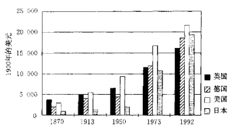
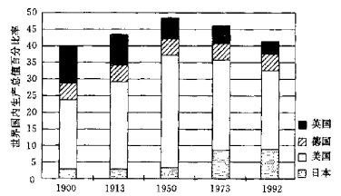

# 附录

附表1 1700-1994年各国人口数据（单位：千人）

| 年份 | 英国 | 德国 | 日本 | 
| ---- | ----:| ----:| ----:| 
| 1700 | 8400 | 15000 | 251 | 30000 | 
| 1820 | 19832 | 14747 | 9656 | 31000 | 
| 1870 | 29312 | 23055 | 40061 | 34437 | 
| 1913 | 42996 | 37843 | 97606 | 51672 | 
| 1950 | 50363 | 49983 | 152271 | 83563 | 
| 1973 | 56211 | 61976 | 211909 | 108660 |
| 1994 | 58202 | 66802 | 261558 | 125188 |

附表2 1992年各国面积和人口密度

|    | 英国 | 德国 | 美国 | 日本 |
|----| ---- | ---- | ---- | ---- |
|面积（千平方公里）| 244 | 357 | 9373 | 378 |
|人口密度（每平方公里）| 88 | 225 | 27 | 328 |

附表3 对进口燃料的依赖程度（%）

|      | 英国 | 德国 | 美国 | 日本 |
| ---- | ---- | ---- | ---- | ---- |
| 煤炭 | 22.4 | 13.3 | 11.7 | 94.7 | 
| 石油 | 54.9 | 96.1 | 46.6 | 99.6 |
|天然气| 9.5  | 77.3 | 11.4 |  96.0|
|总能源| 39.1 | 50.3 | 22.8 | 82.6 |

附表4 1992年的能源消耗

|      | 英国 | 德国 | 美国 | 日本 |
| ---- | ---- | ---- | ---- | ---- |
|人均能耗（与千克石油等值）| 2629 | 3009 | 5487 | 2568 |
|单位国内生产总值能耗（与吨石油等值）| 3.74 | 4.23 | 7.78 | 3.63 |

附表5 社会经济指标

|      | 英国 | 德国 | 美国 | 日本 |
| ---- | ----:| ----:| ----:| ----:|
|健康指标|     |     |     |       |
| - 1900年平均寿命| 51 | 47 | 47 | 44 |
| - 1993年平均寿命| 76 | 76 | 77 | 80 |
| - 1993年婴儿死亡率（每千人）| 7 | 9 | 9 | 4 |
| - 1990年每万人拥有医生数| 16.4 | 25.6 | 21.4 | 17.0 |
| - 1988年人均摄入热量（卡路里）| 3249 | 3351 | 3641 | 2852 |
|结婚率和离婚率|   |  |  |  |
| - 1970年每千人结婚对数| 14 | 12 | 17 | 14 |
| - 1993年每千人结婚对数| 9 | 9 | 14 | 9 |
| - 1970年每千名已婚妇女离婚人数| 5 | 5 | 15 | 4 |
| - 1993年每千名已婚妇女离婚人数| 13 | 7 | 21 | 6 |
|犯罪数据|  |  |  |  |
| - 1988年每10万人中杀人案| 7.4 | 4.2 | 8.4 | 1.2 |
| - 1988年每10万人中抢劫案| 62.6 | 47.3 | 220.9 | 1.4 |
| - 1988年每百起杀人案破案率| 81.5 | 94.4 | 70.0 | 97.1 |
| - 1988年每百起抢劫案破案率| 23.3 | 46.4 | 25.6 | 78.5 | 
|正规教育平均年数|  |  |  |  |
| - 1913年的劳动人口（15~64岁）| 8.82 | 8.37 | 7.86 | 5.36 |
| - 1950年的劳动人口（15~64岁）| 10.60 | 10.40 | 11.27 | 9.11 |
| - 1992年的劳动人口（15～64岁）| 14.09 | 12.17 | 18.04 | 14.87 |
|通讯手段和媒介|  |  |  |  |
| - 1994年每百人拥有电话线路| 47 | 48 | 59 | 48 |
| - 1992年每千人拥有移动电话| 26 | 10 | 43 | 13 |
| - 1993年每千人拥有电视机 |435 | 559 | 816 | 618 |
| - 1993年每千人拥有报纸份数| 383 | 323 | 236 | 577 |
|交通基础设施|  |  |  |  |
| - 1870年铁路总长（千公里）| 21.5 | 18.9 | 85.2 | 0 |
| - 1950铁路总长（千公里）| 31.3 | 36.9 | 402.0 | 27.4 |
| - 1950年汽车拥有量（百万辆）| 2.3 | 0.5 | 40.3 | 0.05 |
| - 1996年汽车拥有量（百万辆）| 20.3 | 39.9 | 146.0 | 40.8 |
| - 1996年民用航空（10亿英里飞行里程）| 58.8 | 12.6 | 480.0 | 69.3 |
|住房条件|  |  |  |  |
| - 1990年每户面积（平方米）| - | 102 | 167 | 86 |
| - 1985年管道齐全的住房比率（百分比）| 95 | 91 | 73 | 44 |
| - 1988年私房拥有率（百分比）| 51.1 | 36.0 | 64.7 | 62.4 |
|消费品价格（以1991年的美元价格计）| 伦敦 | 汉堡 | 纽约 | 东京 |
| - 汽油（每升）| 0.89 | 0.89 | 0.60 | 1.05 |
| - 录像机（每台）| 970.00 | 1213.48 | 397.75 | 587.78 |
| - 牛奶（每升）| 0.91 | 0.79 | 1.19 | 1.65 |
| - 卫生纸（五盒）| 6.05 | 13.75 | 9.11 | 4.42 |

附表6 1990~1991年各产业部门拥有公开上市公司财产情况

|拥有者 | 英国 | 德国 | 美国 | 日本 |
| ---- | ----:| ----:| ----:| ----:|
|金融部门|  |  |  |  |
| - 银行| 0.9 | 8.9 | 0.3 | 25.2 |
| - 保险公司| 18.4 | 10.6 | 5.2 | 17.3 |
| - 退休基金| 30.4 |  -  | 24.8 | 0.9 |
| - 投资公司及其他| 11.1 |  -  | 9.5 | 3.6 |
|非金融部门|  |  |  |  |
| - 非金融商业部门| 3.6 | 39.2 | - | 25.1 |
| - 家庭| 21.3 | 16.8 | 53.5 | 23.1 |
| - 政府| 2.0 | 6.8 | - | 0.6 | 
| - 外国人| 12.3 | 17.7 | 6.7 | 4.2 |

附表7 1990年公开上市公司数量及市场资金在国内生产总值中的百分比

|      | 英国 | 德国 | 美国 | 日本 |
| ---- | ---- | ---- | ---- | ---- |
|国内上市公司数目| 2006 | 649 | 6342 | 1627 |
|上市资产的市场资金所占国内生产总值的百分比| 80.8 | 23.3 | 56.5 | 88.5 |

附表8 国内总储蓄占国内生产总值的百分比

| 年份 | 英国 | 德国 | 美国 | 日本 |
| ---- | ---- | ---- | ---- | ---- |
|二战前| 12.3 | 20 | 18.7 | 11.7 |
|1950~1959| 16.2 | 26.8 | 18.4 | 30.2 |
|1960~1984| 18.1 | 23.7 | 18 | 32.5 |
|1994| 14 | 22 | 15 | 32 |

附表9 1885~1995年固定资产在国内生产总值中的百分比

| 年份 | 英国 | 德国 | 美国 | 日本 |
| ---- | ---- | ---- | ---- | ---- |
| 1885 | 7.4 | 10.7 | 21.2 | - |
| 1920 | 8.4 | 12.8 | 11.4 | - |
| 1950 | 13.2 | 19.1 | 16.8 | 25.5 |
| 1970 | 18.9 | 25.5 | 14.3 | 35.5 |
| 1995 | 15.1 | 21.7 | 14.2 | 28.4 |

附表10 失业率（百分比）

| 年份 | 英国 | 德国 | 美国 | 日本 |
| ---- | ---- | ---- | ---- | ---- |
| 1920 | 1.9 | 1.7 | 3.9 | 5.3 |
|1950~1973| 2.8 | 2.5 | 4.6 | 1.6 |
|1974~1983| 7.0 | 4.1 | 7.4 | 2.1 |
|1984~1993| 9.6 | 6.2 | 6.4 | 2.5 |

附表11 罢工天数（单位：千）

| 年份 | 英国 | 德国 | 美国 | 日本 |
| ---- | ----:| ----:| ----:| ----:|
| 1910 | 880 | 17848 | - | - |
| 1930 | 7952 | 4029 | 26200 | 1085 |
| 1950 | 1389 | 380 | 38800 | 5468 |
| 1970 | 10980 | 93 | 66410 | 3915 |
| 1990 | 1093 | 364 | 5926 | 140 |

附表12 1870~1992年每个就业人员年均工作时间（单位：小时）

| 年份 | 英国 | 德国 | 美国 | 日本 |
| ---- | ---- | ---- | ---- | ---- |
| 1870 | 2984 | 2941 | 2964 | 2945 |
| 1913 | 2624 | 2584 | 2605 | 2588 |
| 1950 | 1958 | 2316 | 1867 | 2166 |
| 1973 | 1688 | 1804 | 1717 | 2042 |
| 1992 | 1491 | 1563 | 1589 | 1876 |

附表13 参加工会的工人在工人总数中的百分比

| 年份 | 英国 | 德国 | 美国 | 日本 |
| ---- | ---- | ---- | ---- | ---- |
| 1970 | 48.5 | 37.0 | 27.2 | 35.4 |
| 1980 | 52.6 | 39.4 | 22.6 | 30.8 |
| 1991 | 43.1 | 42.2 | 15.8 | 24.2 |

附表14 商品出口在国内生产总值中的百分比

| 年份 | 英国 | 德国 | 美国 | 日本 | 世界 |
| ---- | ---- | ---- | ---- | ---- | ---- |
| 1870 | 12.0 | 9.5 | 2.5 | 0.2 | 1.0 |
| 1913 | 17.7 | 15.6 | 3.7 | 2.4 | 5.0 |
| 1929 | 13.3 | 12.8 | 9.6 | 3.5 | 8.7 |
| 1950 | 11.4 | 6.2 | 3.0 | 2.3 | 9.0 |
| 1973 | 14.0 | 23.8 | 5.0 | 7.9 | 11.2 | 
| 1992 | 21.4 | 32.6 | 8.2 | 12.4 | 13.5 |

附表15 1880~1992年各国政府总开支在国内生产总值中的百分比

| 年份 | 英国 | 德国 | 美国 | 日本 |
| ---- | ---- | ---- | ---- | ---- |
| 1880 | 9.9 | 10.0 | - | 9.0 |
| 1913 | 13.3 | 17.7 | 8.0 | 14.2 |
| 1938 | 28.8 | 42.4 | 19.8 | 30.3 |
| 1950 | 34.2 | 30.4 | 21.4 | 19.8 |
| 1973 | 41.5 | 42.0 | 31.1 | 22.9 |
| 1992 | 51.2 | 46.1 | 38.5 | 33.5 |

附表16 1900-1993年的通货账胀率

| 时期 | 英国 | 德国 | 美国 | 日本 |
| ---- | ---- | ---- | ---- | ---- |
|1900~1913| 0.9 | 1.3 | 1.3 | 2.8 |
|1920~1938| -2.6 | -0.1 | -2.0 | -0.3 |
|1950~1973| 4.6 | 2.7 | 2.7 | 5.2 |
|1973~1983| 13.5 | 4.9 | 8.2 | 7.6 |
|1983~1993| 5.2 | 2.3 | 3.8 | 1.7 | 

附表17 1900~1995年的汇率（外币与美元比率）

| 年份 | 英国（英镑)| 德国（马克） | 美国（美元） | 日本（日元） |
| ---- | ---- | ---- | ---- | ---- |
| 1900 | 0.21 | 4.20 | 1.00 | 1.97 |
| 1913 | 0.21 | 4.20 | 1.00 | 1.97 |
| 1938 | 0.20 | 2.49 | 1.00 | 3.51 |
| 1950 | 0.40 | 4.20 | 1.00 | 360.00 |
| 1973 | 0.41 | 2.67 | 1.00 | 271.22 |
| 1995 | 0.63 | 1.43 | 1.00 | 94.06 |

**大事年表**

<table>
    <thead><tr>
        <th>英国</th>
        <th>德国</th>
        <th></th>
        <th>美国</th>
        <th>日本</th>
    </tr></thead>
    <tbody>
        <tr><th colspan='5' align='center'>1600年</th></tr>
        <tr>
            <td><li>光荣革命（1688）</li><li>英法战争（1688～1697）</li><li>皇家非洲公司成立（1672）</li><li>英格兰银行成立（1694）</li></td>
            <td></td>
            <td></td>
            <td><li>第一个永久性英语移民居住区出现（1607）</li></td>
            <td><li>德川时代开始（1603），日本对外闭关锁国</li></td>
        </tr>
        <tr><th colspan='5' align='center'>1700年</th></tr>
        <tr>
            <td><li>英格兰、威尔士和苏格兰统一（1707）</li><li>第一台蒸汽机建成（1712）</li><li>南海公司在南美进行股票投机骗局（1720）</li><li>乔塞亚·韦奇伍德诞生（1730）</li><li>英法七年之战（1756～1763）</li><li>瓦特改进蒸汽机（1765）</li><li>韦奇伍德发明玉陶（1774）</li><li>亚当·斯密发表《原富》（1776）</li></td>
            <td><li>普鲁士和奥地利是两个最大的德语国家，此外，在现在的德国范围内还有几十个大小不一的国家</li></td>
            <td></td>
            <td><li>美国独立（1776）</li><li>美国宪法获得通过（1789）</li><li>亚历山大·汉密尔顿发表《制造业报告》（1791）</li><li>美国第一银行成立（1791）</li></td>
            <td></td>
        </tr>
        <tr><th colspan='5' align='center'>1800年</th></tr>
        <tr>
            <td><li>在滑铁卢击败拿破仑（1815）</li><li>英格兰银行失去垄断地位（1826）</li><li>建成第一条铁路（1830）</li><li>议会扩大了选举权（1832）</li><li>废除《谷物法》（1846）</li><li>大英博览会（1851）</li><li>亨利·罗伊斯诞生（1863）</li><li>废除《反工会法》</li><li>查尔斯·罗伊斯诞生（1877）</li></td>
            <td><li>奥古斯特·蒂森诞生（1842）</li><li>蒂森开设了带钢厂（1867）</li><li>德意志银行成立（1871）</li><li>德国统一（1871）</li><li>蒂森公司成立（1871）</li><li>金融危机（1873）</li><li>皇家法院支持卡特尔（1897）</li></td>
            <td></td>
            <td><li>H·克莱的“美国体制”初具雏形（1824）</li><li>首次通过保护性关税（1828）</li><li>国会拒绝批准美国第二银行成立（1836）</li><li>美国内战（1861～1865）</li><li>亨利·福特诞生（1863）</li><li>第十三条修正案废除了奴隶制（1865）</li><li>老汤姆·沃森诞生（1874）</li><li>阿尔弗雷德·斯隆诞生（1875）</li><li>《谢尔曼反托拉斯法》获得通过（1890）</li><li>4227个美国公司合并为257个公司（1897～1904）</li></td>
            <td><li>佩里打开了日本的大门（1853）</li><li>丰田佐吉诞生（1867）</li><li>明治维新（1868）</li><li>大和银行成立（1882）</li><li>君主立宪（1889）</li><li>引进商务法则（1893）</li><li>丰田喜一郎诞生（1894）</li><li>甲午中日战争（1894～1895）</li></td>
        </tr>
        <tr><th colspan='5' align='center'>1900年</th></tr>
        <tr>
            <td><li>工党成立（1900）</li><li>劳斯-莱斯公司成立（1906）</li><li>劳斯-莱斯生产出银色幽灵牌轿车（1907）</li><li>英国卷入第一次世界大战（1914～1918）</li><li>劳斯-莱斯生产出飞机引擎（1914）</li><li>实行普选（1929）</li><li>脱离金本位制（1931）</li><li>英国卷入第二次世界大战（1939～1945）</li><li>全面实行福利国家体制（1945）</li></td>
            <td><li>蒂森加入钢铁卡特尔（1904）</li><li>蒂森名下的公司结成“利益共同体”（1915）</li><li>新德意志共和国宣布成立（1918）</li><li>《凡尔赛条约》签订，《魏玛宪法》获得通过（1919）</li><li>德意志银行工人罢工（1919）</li><li>极度通货膨胀时期（1922～1923）</li><li>银行业危机</li><li>希特勒上台（1933）</li><li>纳粹强迫犹太人住进隔离区（1941～1942）</li><li>盟军占领德国（1945～1949）</li><li>德意志银行分裂（1947～1948）</li><li>新德国马克发行（1948）</li><li>苏联隔断西柏林（1948）</li><li>东德和西德正式分裂（1949）</li></td>
            <td></td>
            <td><li>J·P·摩根成立美国钢铁公司，资本14亿美元（1901）</li><li>福特汽车公司成立（1903）</li><li>通用汽车公司成立（1908）</li><li>福特汽车推出T型福特车（1908）</li><li>查尔斯·弗林特建立计算制表记录公司（1911）</li><li>联邦储备制度建立（1913）</li><li>小汤姆·沃森诞生（1914）</li><li>斯隆成为通用汽车公司总裁（1923）</li><li>福特汽车产量达1000万辆（1924）</li><li>索斯兰德制冰公司成立（1927）</li><li>股市大崩溃（1929）</li><li>《格兰斯-斯蒂格尔法案》使商业银行和投资银行分离（1933）</li><li>《国家劳资关系法案》和《社会保障法案》获得通过（1935）</li><li>美国卷入第二次世界大战（1941～1945）</li></td>
            <td><li>俄日战争（1904～1905）</li><li>丰田织机公司成立（1907）</li><li>大正元年（1912）</li><li>昭和元年（1926）</li><li>丰田自动织机公司成立（1926）</li><li>丰田公司与普拉特兄弟公司签订许可协议</li><li>日本占领满洲里（1931）</li><li>丰田公司成立汽车部（1933）</li><li>丰田汽车公司从目公司独立（1937）</li><li>盟军占领日本（1945～1952）</li></td>
        </tr>
        <tr><th colspan='5' align='center'>1600年</th></tr>
        <tr>
            <td><li>韦奇伍德公司公开上市（1967）</li><li>劳斯-莱斯公司申请破产（1971）</li><li>英国被欧共体接纳（1973）</li><li>撤销对证券业的管制（1986）</li><li>沃特福特公司收购韦奇伍德公司（1986）</li><li>劳斯-莱斯公司实行私有化（1989）</li></td>
            <td><li>德意志银行重新央化（1952）</li><li>德国人民银行成立（1957）</li><li>柏林墙建成（1961）</li><li>柏林墙倒塌；德国重新统一（1989）</li><li>德意志银行的赫尔豪森遇刺（1989）</li></td>
            <td></td>
            <td><li>IBM开始生产计算机（1950）</li><li>对贫困宣战（1964）</li><li>IBM推出360系统（1964）</li><li>司法部起诉IBM（1969）</li><li>平均实际工资开始下降（1973）</li><li>IBM宣布推出个人电脑（1981）</li><li>索斯兰德公司申请一揽子破产（1990）</li></td>
            <td><li>自民党成立（1952）</li><li>《百货商店法》出台（1956）</li><li>《国民收入翻番计划》（1960）</li><li>丰田汽车推出花冠汽车</li><li>索斯兰德公司与伊藤签订许可经营协议（1973）</li><li>第一家七-十一连锁店开张（1974）</li><li>日本超过美国，成为最大汽车生产国（1980）</li><li>泡沫经济破灭（1990）</li></td>
        </tr>
    </tbody>
</table>

注：统计数据由杰弗里·R·伯恩斯坦整理。 
大事年表由罗恩纳·奥利加里奥整理。

