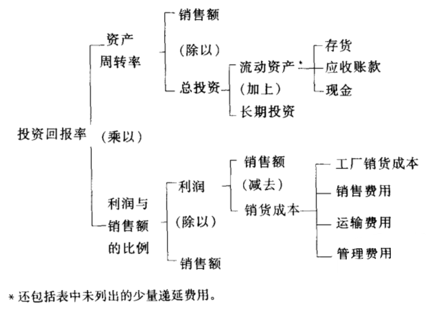

# 第四童 控制垂直统一管理企业：1914年以前的杜邦火药公司

1900年左右的一场兼并风暴造就了一些大型企业，从此它们的
名字变得家喻户晓，例如国际收割公司、杜邦公司、通用电气公
司、美国饼干公司、美国烟草公司、匹兹堡厚玻璃板制造公司、美国钢
铁公司等。每个企业都是将从前由不同企业完成的几种业务合并在
了一起。生产、采购、运输、分销等从前由独立企业承担的互不相关的
业务如今被综合到了多重业务企业中。

综合性企业的发展主要是由于它们通过合并独立业务为企业家
提供了新的获利机会。19世纪的企业家们在单一业务企业中实现了
前所未有的高速生产力。到了19世纪晚期，技术的发展使得钢铁制
造、石油精炼、农机制造和食品加工等产业达到了令人惊讶的高产出。
然而，这些企业面临着如何保证其产出实现最大收益的问题。制造商
需要激进的市场营销策略。它们发现，传统的分销商面对着大量制造
商生产的多种产品，不会对宣传某个制造商的系列产品感兴趣，从而
给分销商折扣以鼓励它们进行宣传并不是一种有利可图和有效的方
法。因此，许多大规模制造商为了控制和促进产品的分销，建立或收
购了属于自己的分销渠道。一些企业还发现，有必要建立或收购原材
料和其他生产投入资源的进货渠道，尤其当原料供应商享受着大量供
货给制造商带来的规模经济收益，而又不肯以低价格让制造商分享一
部分收益的时候。企业家们发现，在多重业务企业中，由于拥有资源、
信息和酬劳的自主权，能对其进行控制，企业家们同时承担了风险和
潜在的可观收益，否则这样的机会将会在市场上消失。[^4-1]

以内部交易为特征的多重业务企业具备一个复杂的系统，这一系
统减少了市场的不确定性影响。但具有讽刺意义的是，这个复杂系统
本身又带来了另一种不确定性。由于有关这些复杂内部过程的信息
很难获取，一个综合性企业可能陷入官僚管理的无效性迷潭中，从而
失去潜在的收益。早期最成功的多重业务企业是通过采取我们如今
所说的统一管理，或者说集中管理的组织形式来解决这一问题的。[^4-2]统
一管理的企业将总体业务分割为独立的部门，每个部门承担专业性业
务（例如分销、制造、运输、财务和采购）。企业总部协调并指导各部门
工作，以达成企业的共同目标。

这种集中化统一管理的方式似乎是协调多重业务企业多种独立
业务的正常方法。这种结构使各部门的管理者致力于自身业务的效
率和有效性。同时，它使高层管理者致力于协调企业各部门的工作，
以保证企业的整体绩效。[^4-3]每个部门都由专家管理，这些专家将部门视
为个独立的单一业务企业，将管理单一业务企业的各种方法都用上
了。到了1900年，这些方法已经得到了完善的发展，并且通过泰勒等
人的书籍得到了广泛的公开。[^4-4]通过这些方法，部门经理们完成了成本
效率和规模经济的目标。高层管理者摆脱了经营各部门业务的任务，
从而能够集中精力进行高层协调，使公司内部各种活动更好地配合作
用。当然，企业主们认为整个公司的利润能够超过将公司各个部分的
业务通过市场或者其他公司进行组织所能产生的利润。

这种经过仔细安排权责关系的集中式管理本身并不能保证多重
企业的业主们能够达到预期的收益。应当还有一种机制来保证各部
门的工作与企业整体目标的协调一致。不同部门之间的协调以及企
业整体的绩效并不是靠运气得来的。有一些机制能够确保社会组织
所必须的协调性，例如集中计划的数学模型、分散的价格系统，以及固
有的文化价值观。[^4-5]在19世纪晚期美国的多重管理企业中，一种流行
的机制就是管理会计系统。

为了应付企业的各种业务，20世纪早期一些成功的多重业务企业
管理者们设计了相应的程序，来保证有价值的可靠信息和指示在集中
管理企业中的流动。他们本应当采用一定的程序来追踪产品对各种
资源的消耗情况，类似于Alexander Hamilton Church所倡导的。我
们在第三章中提到，他们没有这样做或许是因为就当时的信息处理技
术而言，采用这样的程序成本太高。实际上，我们发现这些垂直统一
管理企业管理者们采用了原来单一业务企业所运用的系统来协调内
部各种单一生产活动的多个过程。不过垂直统一管理企业的管理者
们修订了这些系统，以协助自己评估和控制各种不同的业务。

在这些修订后的系统中，综合性多重业务企业内部的各个部门依
赖于那些在单一业务企业中发展起来的会计指标来评估自身绩效。
然而，在多重业务企业中，很难将这些分散的效率指标（如单位成本
运营比率、存货周转率）与企业的整体绩效直接联系起来。此外，这些
主管单一业务的部门管理者仅仅是多重业务企业的雇员，对于公司整
体利润目标，他们往往没有像单一业务企业管理者们那样大的工作动
力。多重业务企业的高层管理者们通过对管理会计的两种新发展来
减轻这些控制和激励问题的影响。首先，他们设计了预算指标，来协
调和平衡内部资源从原材料流向最终顾客的过程。其次，他们开发了
新的指标——投资回报率——来比较企业各部门的绩效和企业的整
本绩效。

预算指标和投资回报率这两种机制是为协调部门活动和企业总
体目标而设计的。许多早期综合性企业的主要目标是通过将大规模
生产技术的产出分销给美国广大市场以获取高于平均水平的利润。
多重企业管理会计的发展使管理者的视线越过了店铺层面的经济效
率目标，其至越过了结合多重业务以形成合力的目标。第一次，管理
者们的注意力集中到了资本本身的生产力和表现上。

19世纪的单一业务企业忽视了资本的运用情况。我们在前面的
章节中提到，一旦资本投入生产，这些企业的管理者们就仅仅满足于
了解生产过程的效率。然而，在多重业务企业中，高层管理者们（而非
市场）必须在不同业务间分配资本。通过预算指标和投资回报率信息
将关注重点放在资本上（尽管也是为了评估和控制特定的内部活动目
标）产生了令人预想不到的效果。对资本本身进行高效率和有效的管
理最终成为企业发展的推动力。[^4-6]投资回报率最初是用于协调各种业
务活动的工具，最终成为一种导向原则。由会计引发的对资本的关注
给企业带来的全面影响直到现在仍然处于研究当中，我们在第八章中
将继续讨论，不过这一发展的起源在早期美国多重业务企业管理会计
系统中就可以看到。我们可以通过研究一个知名的综合性工业企
业——杜邦火药公司来充分地了解这一发展，该公司设计了新的
管理会计方法来监控复杂的多业务系统，这些实践对公司产生了深远
的影响。

## 杜邦火药公司的组建

杜邦火药公司建于1903年，它的记录反映了早期多重业务的综
合性工业企业运用管理会计来评估机会和达成控制目标的一个极好
例子。[^4-7]杜邦火药公司取代了自1804年以来就占据美国火药市场的
E. I. Nemours杜邦公司的业务。[^4-8]杜邦火药公司是由杜邦家族的三
位表亲Alfred，Coleman和Pierre建立的，他们在19世纪90年代时
工作于单一业务的制造企业和运输企业，当时的企业已经开始运用现
代管理方法。因此，他们认为将现代管理方法运用到旧式家族企业中
能够促进利润增长。三位表亲抓住了家族企业转换时期的机会，以新
建的杜邦火药公司的债券为代价购买了原企业的资产。通过这一交
易（我们如今称之为融资购买），原有企业的业主以资产换取债券，债
券利息与原有企业的预期收益相等。从而三位表亲获得了原有企业
资产的控制权，成为新企业的业主，新企业如果能够利用原有企业的
资产获取更高的收益，其价值就会上升。

为了评估和控制新收购企业的效率和获利能力，杜邦的三位表亲
立即着手建立了新的管理架构。[^4-9]这一架构不但对杜邦火药公司产生
了深远的影响，而且还影响到整个火药产业的组织结构。在1903年
之前，这一产业是由几个独立管理的企业构成的，各企业主要致力于
制造过程。向顾客分销的活动主要由批发商和一般的商人进行。原
有的杜邦公司和产业中的其他主要企业通过一个结构松散、分散化的
黑色爆破火药联盟——“枪支火药贸易协会”来协调售价和制定配额。
1903年以后，三位表亲废黜了该协会当中几乎所有的贸易条约，并购
了多个杜邦公司具有局部或者全面控制兴趣的企业，并将所有业务合
并成一个集中管理的部门化企业。简言之，杜邦火药公司通过协调本
公司原有的大部分制造业务以及原来由市场上专业公司进行的分销
业务，形成了一个集中管理的企业。

集中化管理的会计系统便于信息在杜邦公司的复杂部门结构中
流动。[^4-10]总部要求企业遍布美国各地的工厂和销售中心汇报每天和每
周的销售、薪资和生产成本数据。然后将数据记录在基本账户上。总
部的会计部门将账户上的数据进行编辑，以保持运营的合理化，并监
控运营效率。这些信息协助最高管理层——杜邦公司的行政委员会
设定计划，保证企业各种业务之间的平衡。这也是评估和控制公司整
体和三个主要业务部门（生产、分销和采购）的持续发展的一种方法。
在杜邦管理会计程序的设计中，投资回报率指标受到了极大的重视。
这是被早期单一业务企业几乎完全忽略掉的一个价格信号。杜邦公
司使用投资回报率指标作为评估绩效的普遍标准，并利用这一指标，
为了企业资源所有者追求的获利目标进行计划、评估和控制活动。

公司集中会计系统提供的信息使高层管理者能够实施两项资本
计划任务：一是在竞争性经济业务之间分配新的投资（包括运营资本
的维持）；二是对新资本需求进行融资。[^4-11]资本分配是新建的综合性工
业企业的主要任务之一，原因在于多重业务企业的形成促使管理者必
须考虑原来由资本市场决定的资源分配选择。根据对杜邦火药公司
投资分配决策的监控我们可以发现一个原则：如果某个项目的资金运
用到公司其他业务中能够获取更高的收益，那么就不应该投资这个项
目，因为它无法提高公司的赢利能力。[^4-12]投资回报率是用于评估所有投
资项目的标准。

杜邦火药公司或许是最先在管理会计中运用投资回报率指标的
公司之一。1900年以前的单一业务企业只将净收益与运营成本进行
配比，而不考虑净收益与公司总资产投资之间的关系。19世纪单一业
务的企业家们往往只关注控制成本和提高效率的目标，因此没有理由
去评估投资回报率。他们认为企业的投资情况（例如运营规模）是预
先设定的，因此致力于管理短期成本。杜邦火药公司的行政人员们同
样认识到控制每天运营成本的重要性，不过他们也意识到，“如果一件
商品所需的制造设备比较便宜，即使售价只比成本高10%，所获得的
投资回报率也比售价比成本高100%、但生产设备昂贵的商品高。他
们总结道：“评价利润究竞是高还是低，最真实的指标是投资回报率，
而不是成本利润率。”[^4-13]

资产会计系统是保证投资回报率成为一种管理会计工具的主要
创新所在。1900年的资产会计与原有的会计实践有很大的差异，主要
表现在它将资产支出尽快与留存收益进行配比。19世纪的企业很少
详细记录对厂房和设备的投资。杜邦火药公司的生产性资产会计系
统建于1903年，当时公司对所有厂房和设备进行了全面的清查，在总
分类账上的“永久性投资”项目下进行逐笔登记。从此以后，所有新发
生的建设都作为成本记录在该项目下（资产处置时贷记）。有关建设
和处理活动的成本会计信息通过一套全面的建设拨款程序来获取。[^4-14]

这套建设拨款程序除了及时准确地提供有关新投资项目的信息
以外，还为高层管理者的长期融资计划提供有用的信息，这是我们上
面提到的两个计划任务当中的第二个。由于新厂房和设备的支出在
很大程度上决定了公司融资的需求，建设拨款和支出的信息对于长期
资本需求计划就是必需的了。然而，这套建设拨款系统只能提供融资
计划所需的一部分信息。由于杜邦火药公司的基本政策是根据预期
营业收益和股票销售收入的情况进行融资（避免债务融资），[^4-15]公司需
要对现金流动情况做出预测，以决定公司能为新建设项目承担的最大
融资额度。现金流入的预测是将预计每月火药的销量（根据销售部门
预计）与单位销售量的边际贡献（根据会计部门的记录）相乘而得。[^4-16]在
计算边际贡献时，要考虑未来产品价格和投入成本可能的变动情况。
然后将经营现金流入与预期非经营性收入（土地销售收入，金融投资
收入等）相加得出总的预期现金流入。将这信息与建设拨款数据结
合起来，就可以协助高层管理者预计企业的资金情况以及增发股票的
需要。[^4-17]到了1910年，行政委员会每月都可以收到下一年的现金情况
预计，并且这些现金流动预测会定期根据实际情况做出调整。[^4-18]

杜邦火药公司集中会计系统提供的信息还用于评估和控制企业
各部门之间及部门内的活动。19世纪晚期铁路、金属制造、化工、电器
设备和钢铁产业专业企业的会计系统也提供类似的信息。不过杜邦
火药公司的创始人开创了预算和投资回报率指标，将各部门会计系统
提供的分散信号综合起来，成为着眼于整个公司绩效的信息。通过这
些改善的会计方法，高层管理者不再需要像1900年以前单一业务企
业的管理者那样，将日常经营管理作为工作重点了。如今高层管理者
可以将这些经营任务授权给部门管理者，因为有关经营绩效的可靠的
标准化信息随时可得，并且公司运用了程序化的经营标准和经营指
导。由于随时可以获取各种各样的会计信息，行政委员会的控制范围
大大提高了，并且避免了1903年以后原本会伴随杜邦火药公司的发
展而发生的控制权的丧失。不过，我们在做出评价这个公司管理会计
程序的结论之前，最好先介绍一下公司三个主要部门所运用的会计系
统。

## 杜邦公司的生产部门

生产部门是杜邦公司最大和最复杂的部门，由三个子部门（烈性
炸药、无烟黑色火药、黑色爆破炸药）构成。会计信息使得对公司位于
40多个分散地区的工厂生产活动进行控制和评价成为可能。[^4-19]每个
月，会计系统会将生产信息总结在两个报告中：工厂成本报告和损益
报告。两个报告中的数据部分来自工厂的生产控制记录，如每天记录
工作时间的卡片和每天的原料使用日志。[^4-20]两套报告都会提交给行政
委员会（其成员包括各生产子部门的副总），提交给工厂主管的则只有
工厂成本报告。工厂成本报告中的信息与主管的责任范围——生产
过程的运营效率是直接相关的。[^4-21]而只提交给行政委员会的损益报告
协助高层管理者完成他们的主要责任：企业总体收益和投资回报率的
最大化。

通过对其内容的描述，我们可以清楚地理解两套报告的不同目
标。工厂成本报告描述了各工厂在各生产阶段消耗的原材料数量（非
价值）和其他投入的成本价值（除了管理性费用以外）。原材料消耗情
况与预定的标准和其他工厂的消耗情况进行比较。非原料投入可以
分解为人工、动力、燃料和辅助耗用品，工厂各生产阶段的相应投入成
本都显示在报告中。工厂成本报告提供的信息使各主管能够评估其
工厂各时期的表现，以及同部门其他工厂表现的比较。仅提交给行政
委员会的损益报告包含了所有的生产成本，运营收入和投资回报率信
息。[^4-22]这些信息与一些辅助报告信息结合起来，使高层管理者能够评估
各工厂和各生产线的收益和投资回报率情况。例如，对“销售营业收
入的报告显示了每种产品总体和单位产品的销售收入（总）额、运输
费用、销售费用、生产成本、营业净利润、管理费用和净利润。这些数
据也按照各工厂和企业总体进行加总。[^4-23]报告中的“工厂成本”（例如制
造产品成本）数字使管理者能够分析各产品成本和各工厂的制造成本
与总体净利润的关系。在一个月度报告中，企业将工厂成本进一步具
体分析，显示了各工厂和企业16种产品成本的各组成部分（产品成
分、人工、工厂维修、动力、辅助耗用品、工作事故保险、资产折旧[^4-24]）
数字。

将提供给工厂主管的信息与提供给高层管理者的信息分开，表明
企业希望工厂主管像管理一个19世纪晚期的单一业务企业那样思考
和行动。提供给工厂主管的信息强调工厂生产过程的物理有效性，它
并不体现工厂的获利能力、收益和投资回报率情况。就像安德鲁·卡
耐基运作他的大型钢铁企业一样，杜邦公司炸药工厂的主管会认为其
经营规模是预先给定的，他主要关注的是让现有的设备尽可能高效地
运转起来。在公司年会上，烈性炸药工厂主管的表现使这种关注体现
得非常明显。[^4-25]当时，主管和生产部门的副总讨论了最近一年工厂的运
营报告，其话题几乎完全集中在各工厂人工生产力和原材料消耗情况
的比较上。显然，该主管的目标是通过激烈的竞争成为直接成本最低
的生产单位。他们几乎没有谈到有关利润和投资回报率的话题。

对财务获利能力的探讨留给了行政委员会。因此，杜邦火药公司
的创始人没有运用新管理会计系统的投资回报率信息将定价、利润和
投资决策进行授权。有关原材料采购、工资水平、其他投入成本和厂
房设备投资的决策仍然由总部的高层管理者统一进行。高层管理者
运用投资回报率信息来评估各种资源运用机会，而不是评估各利润单
位和投资单位管理者的绩效。当然，投资回报率信息的集中化要求行
政委员会更加注重运营细节，因为工厂主管们并没有像投资单位管理
者那样受到评估。但是，这样也减轻了高层管理者的一些顾虑，正如
当今管理会计学者所熟悉的，工厂管理者们可能会为了提高自身的投
资回报率而采取破坏性行为，损害公司的整体利益。

显然，杜邦火药公司的高层管理者们作为企业的拥有者，不可能
采取损害公司长期获利能力而提高短期投资回报率的行为。现代会
计学者们指出，当用于评估绩效的投资回报率数据是基于减去会计折
旧（如直线折旧或者加速折旧法）的收益或者投资额得出的时候，这种
“赌博”行为就可能存在。在上述情况下，管理者只要不开展新的投资
活动，就能将一个逐渐上升的投资回报率趋势保持很多年。不过当运
用投资回报率数据的管理者也是企业的拥有者时，就像杜邦火药公司
早期的行政委员会一样，这种行为就不太可能发生。当管理者也是企
业的雇员，不像业主那样关注企业的长期获利性时，这种赌博行为最
容易发生。不过，根据折旧会计处理之前的收益和投资指标评估非业
主管理者的绩效就可以减少赌博行为发生的可能性。[^4-26]因此，非常有趣
的是，当杜邦公司于1920年采用分散化多部门结构之后，就开始运用
未经折旧会计处理的收益和投资数据来评估企业各部门的投资回报
率了。[^4-27]

杜邦火药公司的新管理会计系统仍然遗留了些令管理者和会
计人员困扰的实际问题。实际上，公司的创始人争论的两个问题直到
今天还困扰着会计学者。第一个问题是，在进行“购买或是制造”的决
策时，是否应当将间接成本分配到中间产品和成品上。企业制造了许
多中间产品用于制造最终产品。在争论如何分配中间成本的时候，烈
性炸药生产部门的副总Hamilton Barksdale坚持认为，应当将中间成
本分配到成品上，但不应当分配到任何中间产品上。Barksdale担心，
武断地将管理性费用分配到中间产品上会损害对工厂内部效率的分
析。而企业的总会计师Russell Dunham反对这一政策。他认为不将
间接成本分配到中间产出的做法妨碍了企业成本与外部同样产品的
市场价格进行有意义的比较。[^4-28]企业的早期记录没有显示他们最终是
如何解决这一问题的。

杜邦火药公司创始人们争论的第二个问题是如何制定内部产品
的转换价格。对此，会计部门有自己的处理方法：根据所有的会计成
本计价。而Barksdale及大多数企业经营管理者有着不同意见，他们
认为内部转换价格应当与相应的市场价格对应。根据Alfred Chan-
dler和Stephen Salsbury的论述，这种观点差异的内在原因是对企业
会计信息的最终目标看法不同。那些认为应当以市场价格制定内部
转换价格的人“希望运用会计数据来评估企业各部门的表现”，而认为
应当以成本定价的人“视会计信息为仅用于反映公司总体的损益情况
和投资回报率的工具”。[^4-29]有趣的是，后一种观点（形成了早期杜邦公司
转换价格政策的基础）的倡导者Pierre du Pont后来改变了自己的观
点，当他开始经营通用汽车的分散化业务后，就转而提倡采用市场转
换价格了。

## 杜邦公司的销售部门

================================

和生产部门一样，市场营销活动也给杜邦火药公司的集中会计系
统提出了许多有待解决的管理问题。销售部门的主要管理任务包括，
协调顾客订单与工厂的生产安排、跟踪市场情况、评估价格、管理顾客
资料、协调和评估销售人员的表现。[^4-30]当工厂产出产品以后，销售部门
就开始承担企业的产品销售责任，当他们将产品卖出并送到消费者手
中之后，责任就结束了。由于企业产品和顾客的多样化，以及企业市
场的分散性，销售部门的责任变得非常复杂。它管理着散布于美国各
地的大量销售分支机构，以及在销售机构以外工作，几乎销售企业所
有类型产品的受薪销售人员们。大多数销售分支机构（以及所有的工
厂）都保存着产品存货记录。用于监控销售部门复杂市场营销活动的
会计系统或许是杜邦火药公司管理会计系统中最新、最复杂的一
部分。

销售会计记录主要包括各销售分支机构的订单和发票，以及各工
厂的运货订单。[^4-31]每天这些分散的基础记录复印件会送到总部的会计
部门，那里记录了所有产品存货账目、销售账目和顾客资料。公司建
议顾客直接将购买款项寄到Delaware的Wilmington公司总部，从而
集中掌握着公司的现款结存。此外，公司的总部审计人员会定期审查
分支机构和工厂的存货，从而实现集中控制。

公司总部会计部门从销售会计记录中获得的最重要的信息来自
于每天的销售报告，上面列出了各分支机构销售每种产品的数量和销
售金额数据。这一报告为销售部门的副总以及各分支机构管理者提
供了及时的（滞后时间通常不会超过四五天）市场趋势信息。而每天
销售报告的信息是通过一种先进的方式从发票记录中获取的。[^4-32]将数
据记录到穿孔卡片上，然后运用一种美国人口普查局在1890年左右
引进的系统进行分类。这种穿孔卡片系统相当灵活，使总部会计部门
不仅能够制定每日销售报告，还能提供下列销售信息：按照地域、产品
种类和顾客种类总结月度销售量和单位平均售价；比较各分支机构销
售各种产品的净收入和销售费用的销售成本表；以及每月与总分类账
进行协调的成品存货试算平衡表。所有这些报告为公司副总及销售
部门人员提供了全面的信息，以便控制和协调邦火药公司的整个市
场营销活动。

销售会计系统为实现集中控制做出了贡献，然而和生产部门会计
系统的不同之处在于，它鼓励将决策制定权最大程度地下放。价格制
定程序和对销售人员实行的激励一补偿计划为分散化决策和低层级
的利益激励机制提供了基础。

尽管在1903年前，定价是枪支火药贸易协会中各企业高层管理
者的主要任务，杜邦火药公司对产品价格的评估却是一种常规事项，
很少要求高层管理者的关注。[^4-33]由销售部门经理人员组成的销售委员
会通常会每个月对每种产品的最低价格进行审查。这种审查是为了
保证产品价格足以使每条产品线都能获得预期的投资回报率。为了
便于制定价格决策，公司总部会计部门每月会对各种产品达成某个回
报率目标（炸药产品是15%，黑色火药是10%）所需获得的每桶或者
每磅利润做出预测。[^4-34]根据建设会计记录上各产品线对厂房和设备的
投资，总部可以计算出预期收益（例如，黑色火药的预期收益是其产量
投资额的10%），并将该收益除以工厂的常规产量和最大产量。然后
将每单位产出要达成预期回报率（包括常规产量和最大产量水平下的
回报率）所需获得的利润与单位生产成本相加，就得到了产品的最低
要求价格。

杜邦火药公司设定产品最低价格是为了保护其现有的竞争地位。
杜邦公司的管理者们相信，公司在产业中的规模和专业能力可以长期
确保生产成本低于竞争对手，因而他们并不希望通过残酷的竞争来打
破现有的格局。相反，他们还认为（类似于安德鲁·卡耐基早期的总
结）在市场不景气的时候，让小规模、高成本的竞争企业为产业提供过
剩生产能力是有利的。这些竞争者的存在使杜邦的工厂更有可能在
整个经济周期内各阶段都以最大产能运作。[^4-35]他们对现有竞争的价值
的认识从某种程度上影响了公司管理人员将价格维持在与竞争企业
非常接近的水平上的决策。有关竞争者的价格信息由销售人员定期
获取，然后传送给销售分支机构的管理者及公司总部。

最低价格数字是由公司总部送到销售分支机构的管理者手中的，
然后由他们最终决定销售给消费者的价格。销售管理者制定的价格
可以高于最低价格，但不能低于这个价格。他的策略是在不让新进入
者有机可乘的前提下尽可能提高价格。如果现有的竞争者仅仅能够
维持，自然不会有新对手加入。例如，在1906年底，杜邦火药公司的
助理出纳员John J. Raskob发现，位于宾夕法尼亚无烟煤生产区的公
司生产和销售的黑色爆破火药获得了22%的投资回报率，而其他公司
在国内其他地方生产和销售同样的火药只能获得约2%的回报率。由
于所有的厂房都是以最大产能运作的，他建议将非无烟煤地区黑色爆
破火药的价格提高5%，而将无烟煤地区的售价降低8%。他表示：
“除非这样做，否则我们损益表将显示，尽管我们为了防止新企业的进
入而在全国各地采用了前所未有的低售价，但我们在无烟煤地区的价
格使我们获取了4倍于其他地区的投资回报率，这实际上给了竞争者
很大的诱惑。”[^4-36]

销售会计系统还通过定期收集财务数据的激励计划来帮助销售
管理者控制和评估销售人员的业绩。杜邦火药公司的销售总监这样
描述这个计划：设计它的目的是“给处理交易的员工更大的自由度，让
他们为最终结果承担更大的责任，并且尽可能为他们提供与业绩挂钩
的灵活报酬机制[^4-37]”。销售人员获取的报酬是与对销售能力的激励相
联系的，而不是传统的佣金。总部的销售部门为每个分支机构的各种
产品制定了一个“常规”销量指标和一个“基本”价格（并非是最低价
格）。分支机构的管理者将本部的“常规”销量指标分配到客销售人员
头上。如果某个销售人员实际的月销售额等于其“基本销售额”（基本
价格乘以常规销量），就可以获得100%的基本工资。如果其实际销售
额超过基本销售额，他获得的工资会成比例增长（然而，如果实际销售
额低于基本销售额，也可以获得最低工资保障）。这样的政策鼓励销
售人员既重视销量，也重视售价。从根本而言，这种政策鼓励他们在
企业定价政策的限制之下寻求公司收入（及自身收入）最大化的目标。
激励政策的运用还使销售部门在尽可能少干预销售人员行为的同时
有效地指导他们的行为。例如，总部销售部门可以通过调整某种产品
的基本价格，直接驱使一个销售人员产生比其他人更加努力的行为。

销售会计系统还为高层管理者提供了另一种减轻管理责任的方
式。它使高层管理者能够分别考查分支机构管理者的表现，从而激励
他们去控制本部门的存货和成本。[^4-38]销售部门预计了每个分支机构销
售成本与总销售额的“常规”比例。销售成本包括一般性机构费用，加
上平均应收账款的5%和平均存货余额的5%。如果销售成本与总销
售额的比例低于常规比例，节约额的7.5%将加到分支机构管理者的
薪水中。管理者还可以选择是否从节约额中另抽取5%给下属销售人
员。行政委员会每个月会收到销售成本报告，比较各分支机构的总销
售额和销售成本。通过建立激励和控制制度，杜邦火药公司的销售会
计系统对销售部门的表现与企业总体赢利目标之间的协调起到了
帮助。

## 杜邦公司的采购部门

杜邦火药公司的创始人们意识到，比起由各地工厂分别采购原材
料，让总部的采购部门统一采购能够节约大量成本。采购会计系统用
于协助控制原材料成本、评价不同的供货来源，以及协调生产与采购
活动的进行。然而，与生产部门和销售部门的会计系统不同，采购部
门的系统并不用于协调和评估各线路的运作情况。

采购会计系统依赖总部会计部门使用的著名的凭证式应付账款
系统实现对订货、接收，以及采购各阶段费用的集中化管理。[^4-39]这种凭
证式系统最早是由19世纪中期铁路企业会计人员使用的[^4-40]，它为控制
到期账目余额以及保证将采购活动记录到适当会计期间的适当账目
中提供了便利。直到1908年（后来公司开始实行向后兼并，将供货业
务纳入公司自身业务中），采购部门一直负责拟定公司与外部供货商
的所有原料订单，这些订单完全根据市场价格信息拟定。公司总部会
计部门的应付账款分部在每张订单中加入一张支付凭单，签发付款支
票，并按月总结所有的原材料费用。这一总结来自支付凭单记录，为
制定分类账和成本报表提供了基础。每个月，审计人员会审查所有的
凭单记录和付款情况。

在实现了对采购交易的集中控制之后，采购部门的下一个目标是
达成最低的原材料采购价格。直到1908年，公司大多数原材料仍然
是从外部代理商那里采购的，其提供的价格很容易与市场价格相比
较。因此，公司并不需要多少内部会计信息。实际上，仅有的几次对
内部会计信息的需求发生在1905年之后，当时杜邦火药公司在智利
建立了一个收购硝酸盐的代理机构，通过美国代销商订购了一批硝酸
盐。[^4-41]这次投资活动所需的内部报告信息也是很少的。对于在智利机
构发生的附加成本、运输服务花费以及运营资本，都进行了常规会计
记录。每吨硝酸盐成本会随时与外部代理商的价格进行比较，如
W. R. Grace and Co.等。[^4-42]

1907年的经济萧条反映出分散化采购会计系统的一个主要问题。
Chandler和Salsbury对经济萧条给杜邦火药公司政策造成的影响进
行了仔细的评估，他们指出，采购部门以最低价格购买原材料的努力
使公司在1907年陷人了运营资本危机。[^4-43]在经济周期中价格下落的阶
段，采购部门的副总囤积了大量原材料。然而，在这些存货应付账款
下降的同时，炸药的订货量也下降了，从而公司的运营资本大大减少
了。在勉强度过这一危机之后，公司管理层修订了采购政策，只允许
采购部门在一定存货水平之下以最低价购买，这一存货水平根据每个
月的销量预测而调整。

尽管这一最大存货水平的新政策降低了承担运营资本危机的风
险，但同时也带来了紧急情况下供应不足的可能性，例如战时运输中
断等。为了降低对外部供应商的依赖性，公司开始收购许多供应渠
道，尽管它从未实现对其所需的所有基原料的100%所有权。[^4-44]最早实
行向后兼并的步骤包括控制一些关键原料的生产，如木炭、起爆雷管
本和包装柳条箱。这些投入在总体采购中只占很小的比例。杜邦火
药公司的主要采购原料是硝酸盐苏打和粗甘油。对此，公司只选择向
后兼并了硝酸盐的生产业务。

尽管有许多战略性因素和经济因素促使杜邦火药公司做出向后
兼并的决策，公司评估这些决策的最主要指标是投资回报率。一般而
言，投资于外部供应业务的项目至少获取每年15%的预期回报率——
公司获利性最高的炸药制造业务的常规回报率水平——才能获得批
准。采购部门使用两种程序来预测综合采购业务的投资回报率。[^4-45]当
公司计划生产内部所需的某种投入品时（例如包装炸药的柳条箱和起
爆雷管）运用第一种程序。生产过程的预期回报，或者说“利润”是用
市场售价减去预期单位生产成本得出的。然后将这一预期“利润”除
以建设或者购买必要的生产设备和资源的预期净投入。

当公司计划控制，而非拥有某种关键原材料的来源时，运用第二
种预测程序。首先预计直接购买比从委托代理商那里购买能节约的
成本额。节约额由部供应商提供的市场价格减去预计直接购买的
单位成本获得。然后，采购部门将这一节约额除以实现直接购买所需
的附加存货投资额，计算得出投资回报率。尽管这两种程序由于没有
考虑杜邦火药公司预期需求对价格的影响而受到批评，但却体现了公
司运用保守的市场价格预期来计算投资回报率的事实。[^4-46]因此，从总体
上讲，这些程序为杜邦火药公司的资源分配提供了有价值的指导。

## 投资回报率的优势

杜邦火药公司各部门的管理会计系统提供了大量统计工具，用以
协助公司各种业务的计划、控制和员工激励工作。这些系统提供的有
关各专业部门过程效率的信息与19世纪单一业务企业的管理会计信
息非常类似。然而有关跨越三个职能部门的内部资本效率信息却是
多重业务企业首创的。对投资回报率信息的创新运用使杜邦火药公
司的高层管理者能够代替资本市场，在美国炸药产业范围内进行有效
的资源分配决策。

实际上，杜邦火药公司的创始人们非常希望根据资本价格指标来
评估企业各方面的活动，这促使他们设计了一套具有独创性的投资回
报率公式，直到今天仍为会计人员和财务分析者们所使用。如图4-1
所示[^4-47]，投资回报率指标被分解为资产周转率（销售额除以总投资）和
运营比率（净利润除以销售额）。根据图4-1的描述，投资回报率指标
会因为损益表上某个因素的变化（通过运营比率）或者资产负债表上
某个因素的变化（通过资产周转率）而受到影响。从这个角度上说，杜
邦的投资回报率公式是运用会计数字来控制任何一个垂直统一管理
企业的理想工具。这也是杜邦火药公司的创始人们运用这一公式的
目的。在1915年到1918年间，公司建立了一个专门系统，根据图4-1
的要求报告每个工厂和每条生产线的相关信息，然后将这些信息用一
系列墙壁大小的图表（超过350个）描述出来，呈报给高层管理者。这
些信息每月更新，并以一种便于观看的方式保存在Wilnnington总部
的一个特殊制图室内。[^4-48]

然而，我们并不能因为杜邦火药公司的创始人们大量运用这些公
式和图表就断定他们“根据数字管理企业”。这些投资回报率报告只
呈报给运用这一信息来进行计划和全公司控制的高层管理者。下属
管理者并不需要达成投资回报率目标，相反，他们的任务是在各自专
业活动中实现经济和效率目标。只有高层管理者承担投资和资源分
配决策的责任，这些决策将最终决定企业整体业务资源运用的有效
性。因此，公司的运营管理者们很少有机会为了达成投资回报率目标
而减少资本投资或者缩减费用，以损害企业长期价值为代价提高短期
收益。

实际上，杜邦火药公司的创始人们可能已经预见到他们的投资回
报率公式将会对多重业务企业产生的重要历史价值。我们前面已经
提到，这些多重业务企业希望能够通过将两个或多个单一业务企业合
并为一个整体，达成比单一业务企业独立运营更好的结果。对于多重
业务企业而言，将运营比率和资产周转率合并起来以反映公司的整体
绩效是合理的。实际上，杜邦的投资回报率公式是将19世纪制造业
和分销业的单一业务企业分别发展起来的绩效评估会计指标结合起
来了。不过杜邦公式对两个评估指标（运营比率和资产周转率）的结
合使得多重业务企业能够像一个微型市场一样运作起来。

据我们所知，杜邦建立投资回报率公式（以及制图室）的想法来自
F. Donaldson Brown，他是一个受过大学教育的电子工程师，于1909
年加入杜邦火药公司销售部门销售电子设备，1914年成为公司的助理
出纳员。[^4-49]没有任何记录显示他是如何偶然发现投资回报率公式这一
概念的。[^4-50]有趣的是，Brown从未受过任何正规的会计训练，也没有会
计工作经验。他在电子工程方面的专业水平（他在17岁时就获得了
维吉尼亚工业学院颁发的电子工程学士学位）显示，他对数学非常精
通，并且善于解释复杂系统中各部分之间的关系。毫无疑问，他在销
售方面的经验使他认识到对周转率及分销成本对公司利润的影响。
显然，他在数学、工程和市场营销方面的技巧使他能够从有别于当时
大多数会计人员的独特视角去理解影响公司绩效的因素。Brown对
于财务计划和控制的观点对杜邦和后来的通用汽车公司都产生了深
远的影响。然而他的观点直到20世纪50年代才被专业会计人员认
识到，因为当时一批新的管理会计教科书将这些观点记入了MBA的
标准课程中。

## 总结

对统一财务评估指标的需求促使综合性多重业务企业管理者们
推进了管理会计的发展，超越了19世纪单一业务企业的成本管理系
统。杜邦火药公司发现了其中一个评估标准——投资回报率，这一会
计指标能够帮助管理者确定公司内部的资本运用价格。杜邦火药公
司的投资回报率报告系统将公司各种内部业务各方面的情况与其他
资本运用方式进行比较，同时保留了单一业务企业运用得最好的成本
管理信息来评估企业的各种专业活动。杜邦公司在1903年到1915
年建立的管理会计系统是具有独创性的，它的一些实质性特点直到今
天仍然是复杂企业组织的参考模式。

杜邦火药公司的管理会计系统减少了许多官僚问题，否则这些问
题会困扰这类集中管理的复杂综合性企业组织。如果不解决这些问
题，用于协调企业各种内部活动的成本最终将会限制垂直统一管理企
业的发展规模。这类成本会随着企业规模的扩大而增长，主要是由于
不断增加的员工数量提高了指令沟通和信息流动的难度。沟通困难
降低了信息的质量，减少了在公司内部获利的机会，这与导致产品市
场价格和资本市场价格（例如对其他获利机会的评估）达不到最优状
态是类似的。由于发现市场和企业内部获利机会都需要成本，我们会
发现经济交易在两处都会发生，而不是全部在市场或者全部在企业内
部发生。根据科斯在50多年前提出的著名理论，当企业发现内部赢
利机会的边际成本超过发现市场获利机会的边际成本时，企业就会停
止发展。[^4-51]通过降低发现企业内部机会的成本，管理会计系统无疑能够
扩大复杂企业组织的潜在规模，就像杜邦火药公司创始人设计的系统
的作用一样。

**注释：**

[^4-1]: 前几段论述的要点总结在Alfred D. Chandler，Jr.，The Vis-
ible Hand : The Managerial Revolution in American Business (Cam-
bridge, Mass. : Harvard University Press, 1977), chapters 9--11.

[^4-2]: Oliver E. Williamson, Corporate Control and Business Be-
havior; An Inquiry into the Effects of Organization Form on En-
terprise Behavior (Englewood Cliffs, N. J. : Prentice-Hall, 1970),
chapter 2; Alfred D. Chandler, Jr. , Strategy and Structure: Chap-
ters in the History of the American Industrial Enterprise (Garden
City, N. Y.: Anchor Books, 1966; reprint of 1962 ed.), 43-50.

[^4-3]: Oliver E. Williamson, Markets and Hierarchies: Analysis
and Antitrust Implications (New York: Free Press, 1975), 133.

[^4-4]: Joseph A. Litterer, “"Systematic Management: Design for Or
ganizational Recoupling in American Manufacturing Firms," Busi-
ness History Revier (Winter 1963), 369--391.

[^4-5]: 见 H. Thomas Johnson, “Accounting, Organizations and
Rules: Toward a Sociology of Price,” Accounting, Organizations
and Society volume11,No.4/5(1986), 341-343.

[^4-6]: 在19世纪单一业务企业对加工成本信息的运用中也有类似的
发展。一些会计数字，例如单位人工工时成本，通过驱动提高机械化
比例以节省人工效率的研究证明了自身的价值。而在20世纪垂直统
一管理的企业中，投资回报率数字驱动了类似的研究，这一次的目标
是寻求更具生产力的资金运用机会。

[^4-7]: 这里参考的记录来源于H. Thomas Johnson，“Management
Accounting in an Early Integrated Industrial: E. I. Du Pont de
Nemours Powder Company 1903--1912," Business History Reviex
（Summer1975），185，n. 6。这些记录在后文中的引用来源记为"记
录库”，标明相应的box或shelf号码。

[^4-8]: 对杜邦火药公司早期历史的描述摘自Alfred D Chandler，
Jr.  and Stephen Salsbury, Pierre S. duPont and the Making of the
Modern Corporation (New York: Harper &. Row, 1971), 47-120.

[^4-9]: Ibid.，77-120.

[^4-10]: Ibid.，144一147.有两篇文章详细的描述了杜邦火药公司集
中化会计系统的各个方面：R，H.Dunham，“Object of Accounting，”
paper for the High Explosives Operating Department Superintend
ents' Meeting No. 33 (New York, April 20--26, 1911), and William
G. Ramsay,"Construction Appropriations,"paper for the H. E. O.
D. Superintendents' Meeting No.32 (New York, April 12--16,
1910). The papers, on file at the Eleutherian Mills Historical Li-
brary,Greenville, Delaware, are reprinted in H. Thomas Johnson,
ed. , System and Profits: Early Management Accounting at Du
Pont and General Motors (New York: Arno press, 1980).

[^4-11]: Chandler and Salsbury, Pierre S. du Pont , 158--168, 201-
217.

[^4-12]: Ramsay,"Construction Appropriation," 2.

[^4-13]: Dunham，“Object of Accounting，17.公司计算投资回报率
所使用的基础数据是净收益（在扣除折旧之后及扣除长期负债利息之
前）除以净资产（总资产减去商誉和其他无形资产、流动负债、累计折
旧)。

[^4-14]: 根据这种程序，所有对厂房和设备的预计投资都按照标准拨
款形式的要求进行描述：预计花费、预计投资可能获得的成本节约或
者其他收益，以及来自相应权力部门的证明。一旦通过某项拨款，就
需要对新资产的最终实际花费进行报告。相应的权力部门需要解释
所有未预计到的、与最初预测不一致的变动。见Ramsay，“Construc-
tion Appropriation,"passim.

[^4-15]: Chandler and Salsbury, Pierre S. du Pont, 210--213, 251--
254.

[^4-16]: 收益预测的例子见记录库，boxes 184736一184740，item 43
（大约 1907年)，and shelf area 182701 --182712，items 161 and
161A-161D(1910年).

[^4-17]: Chandler and Salsbury, Pierre S. du Pont , 251-252.

[^4-18]: 这些月度现金预测的例子见记录库，shelf area 182701 - 
182712，item 173；将现金预测与实际现金流进行协调的例子见item
186；将收益预测与实际收益进行协调的例子见boxes 184736一
184740, item43

[^4-19]: 每个工厂只生产一种类别的炸药（烈性炸药、无烟黑色火药或
黑色爆破炸药），通常有几个品种，也生产许多用于制造最终产品的中
间产品（例如各种酸）。

[^4-20]: 公司将所有采购和工资记录集中在总部的会计部门。各工厂
仅保留用于确认投入品（原料和人工）数量及各阶段产出数量的记录。
Dunham."Object of Accounting,"7--19.

[^4-21]: 这些报告的例子保存在Eleutherian Mills历史图书馆的烈性
炸药运营部门监督会议备忘录中。

[^4-22]: Chandler and Saisbury, Pierre S. du Pont.146--147.用于
制作这些报告的工作表格见记录库box 133859。

[^4-23]: 见记录库box 133859。
[^4-24]: 简单描述一下公司折旧政策。由于公司定期投资于一些能够
节约成本的更新技术，大部分厂房和设备在报废之前很久就被更换
了。因此，每期的折旧费用是“报废保险，用于（补偿）整体或部分厂房
的重置费用，重置的原因可能是这些固定资产过时、不适应现有的观
念、不符合交易过程中变化情况，或者其他任何理由，但却不是因为厂
房损坏或者由于事故而报废。”（Dunham，“Object of Accounting”，
17）公司每期还记录一笔支出，预计由于火灾或爆炸引起厂房设备损
坏的成本（称为工作事故保险）。每月的折旧比例是厂房的0.5%，
加上设施设备的1.25%；工作事故保险的比例是制造每单位炸药产品
所需的每桶火药的2%，加上每磅硝酸盐的1%。因此当时的运营费
用包含了对永久性厂房设备定期维修和维护的费用，由于技术过时而
产生的折旧费用预测，以及由于火灾和爆炸产生的损失预测。

[^4-25]: 见保存于Eleutherian Mills历史图书馆的烈性炸药运营部门
监督会议备忘录。

[^4-26]: 理论家们会指出，解决这个问题的最佳方式是使用年金（或者
现值）折旧来计算投资回报率。对于运用投资回报率数据评估管理者
的缺陷，请见Robert. S. Kaplan，Aduanced Maragement Accounting
(Englewood Cliffs, N. J.: Prentice-Hall, 1982), 526-534。

[^4-27]: 对于杜邦公司如今运用折旧以前的投资回报率进行内部评估
的更多实践，请见David Solomons，Divisional Performance：Meas-
urement and Control (Homewood, IlL: Richard D. Irwin, 1965),
134-135。

[^4-28]: Dunham, "Object of Accounting,"10-1l and "Discussion,"
1-2.

[^4-29]: Chandler and Salsbury,Pierre S. du Pont, 153.

[^4-30]: bid.140--141.

[^4-31]: 对公司销售会计记录的详细描述请见Dunham，“Object of
Accounting,”4--7.

[^4-32]: Ibid., 5, 19.

[^4-33]: Chandler and Salsbury, Pierre S. du Pont, 163, 14l, 155
157.Chandler和Salsbury并没有讨论本段中描述的公司用于确定最
低产品价格的方法；这是从记录库中的工作表和信件中推断出来的，
见boxes 184736一184740，item 27（黑色爆破火药）和item 39（炸药）。

[^4-34]: 公司记录并未解释炸药和黑色火药预期收益率的差异。我们
可以猜测，炸药的预期收益率高是因为它是一种相对较新的产品，潜
在市场风险较大。

[^4-35]: Chandler and Salsbury, Pierre S. du Pont, 93, 156.

[^4-36]: Letter form J. J. Raskob to P. S. du Pont (Wilmington, Ju-
ly27，1906），记录库boxes 184736一184740，item 29。对销售主管定
价行为的限制在销售部门总监的信件中有清楚的描述。

[^4-37]: 销售部门总监1906年4月2日的信件，引用于Johnson，Sys-
tem and Profits .

[^4-38]: Ibid.

[^4-39]: Dunham, "Object of Accounting," 2-4, 7--13.

[^4-40]: J. H. Bridge, Inside History of Carnegie Steel Company
(New York: The Aldine Book Company, 1903), 84; George W.
Wood, The Voucher System of Bookkeeping (Pittsburgh: G. W.
Wood,1895).

[^4-41]: Chandler and Salsbury, Pierre S. du Pont , 185--186.

[^4-42]: 记录库shelfarea182701-182712,item139。

[^4-43]: Chandler and Salsbury, Pierre S. du Pont, 220-228.

[^4-44]: Ibid., 187, 204,228.

[^4-45]: 记录库shelf area 182701-182712, items 116, 137, 138, 139,
145。

[^4-46]: Chandler and Salsbury, Pierre S. du Pont , 245.

[^4-47]: From T. C. Davis, “How the Du Pont Organization Apprai-
ses its Performance," in AMA Financial Management Series No. 94
(American Management Association: New York 1950), 7. Reprin-
ted in Johnson,System and Profits.

[^4-48]: Ibid. 同样见F. Donaldson Brown，Some Reminiscences of
an Industrialist (Easton, Pa. : Hive Publishing, 1977, reprint of
1958ed.),27。

[^4-49]: Brown, Some Reminiscences , chapters 1-3 and introduction
（byErnestDale)若对Brown的背景有更进一步的兴趣，请参见Pe-
ter F. Drucker, Adventures of a Bystander ( New York: Harper &.
Row,1978)，263-266。

[^4-50]: Brown可能阅读了AlfredMarshall对收益、资产周转率和资
本收益率的论述。见Alfred Marshall，PrinciplesofEconomics
(London:Macmillan,8th ed.,1920;reprinted in 1969),260,
511-513.

[^4-51]: Ronald Coase, "The Nature of the Firm," Economics, Vol.
IV (1937), 386-405. Reprinted in K. Boulding and G. Stigler.
eds.， Readings in Price Theory (Homewood, Ill. : Richard D. Ir-
win, 1952), 331-351. An extremely interesting commentary on
Coase's article, including a note on its evolution, is in Stephen N. S.
Cheung, "The Contractual Nature of the Firm, Journal of La
and Economics (April 1983), 1-21.

