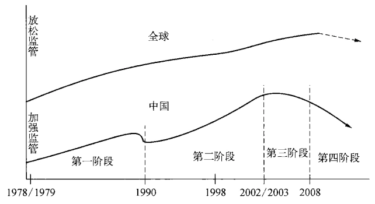
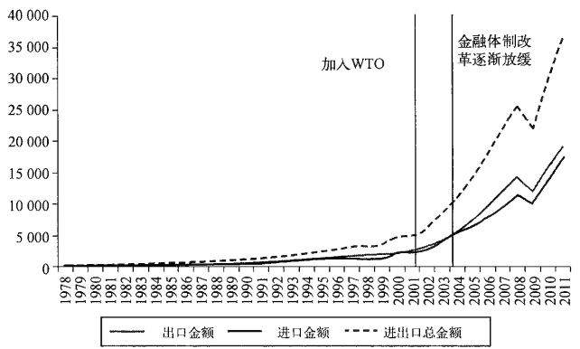
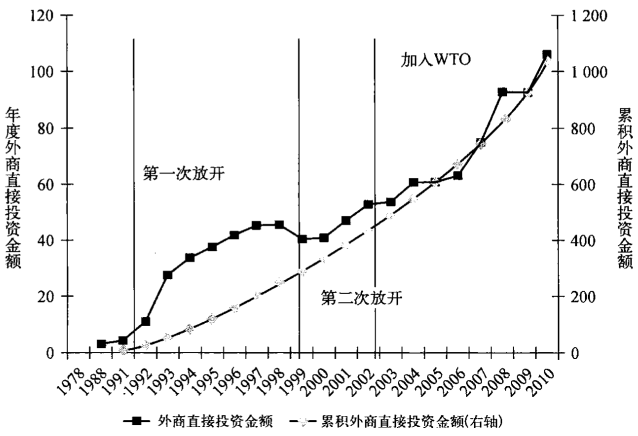
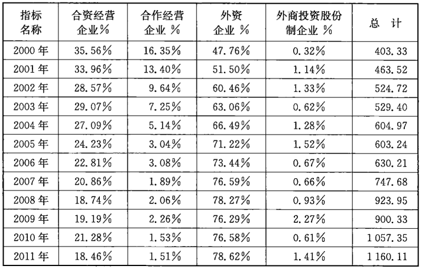
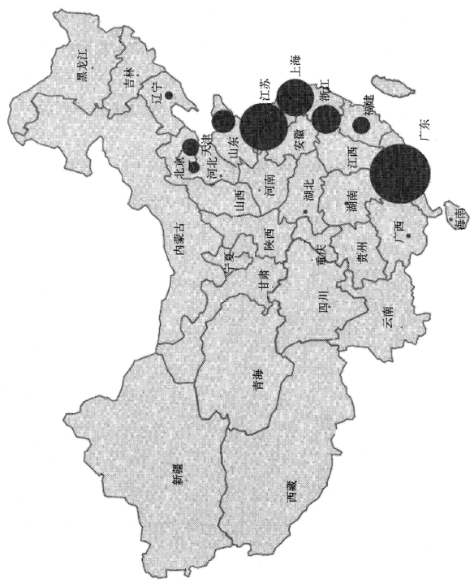
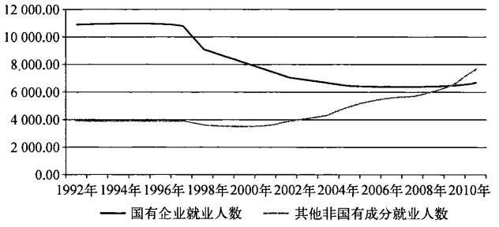
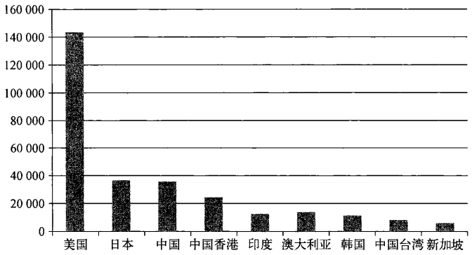
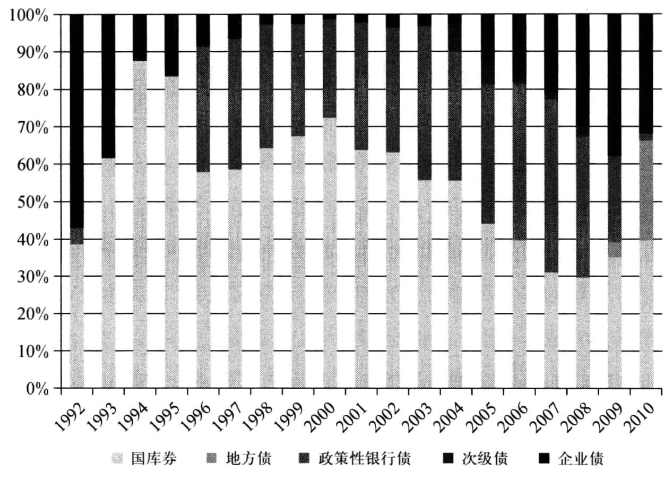
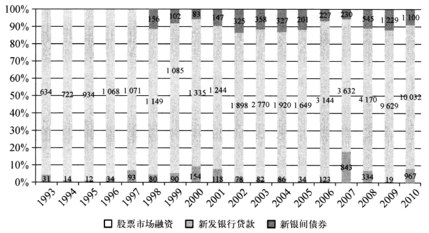
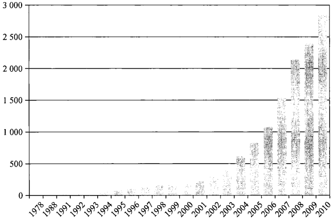

---
title: 红色资本 - 中国的非凡崛起与脆弱的金融基础
author: 【美】卡尔·沃尔特
cover-image: cover.jpg
language: zh-CN
...

  这是一部由美国学者撰写的，关于中国金融体制变革、发展及
其现状的学术著作。作者首先肯定，中国改革开放以来取得了
举世瞩目的成就，经济上实现了“非凡的崛起”
同时也认为，在中国经济发展的过程中，金融发挥的作用还相当有限。
中国的金融体制相对于过去的经济突飞猛进和未来的可持续发
展，还具有“脆弱性”和不相适应的地方，还需要进一步改革
完善。

这本书从西方学者的视角，观察分析中国的金融机构，从商业
银行到投资银行，从股票市场到债券市场，也部分地涉及到政
府机构的职能和管理体制。书中论及国有银行的扩张、信用评
级的缺陷、地方债务的快速增长等问题，也是国内读者所关心
的。书中收集和列举了大量的统计数据资料，其研究和讨论问
题的方法，值得国内的金融从业者和研究者参考借鉴。

上架建议：金融

ISBN 978-7-5473-06079

定价：38.00元

<div style="page-break-before:always;"></div>

<h1 align='center'>红色资本</h1>

<h2 align='center'>
中国的非凡崛起
<br/>
与脆弱的金融基础
</h2>

```
HONG SE ZI BEN
THE FRAGILE FINANCIAL
FOUNDATION OF CHINA'S
EXTRAORDINARY RISE

[美] 卡尔·沃尔特 CARL E. WALTER
[美］弗雷泽·豪伊 FRASER J. T. HOWIE
译者 祝捷、刘骏
审校 王海
中国出版集团东方出版中心


上海市版权局合同登记：图字09-2013-52

Red Capitalism : The Fragile Financial Foundation of China's
Extraordinary Rise( Revised and Updated) by Carl E. Walter and
Fraser J. T. Howie (ISBN : N/1 - 118 - 25510 -0), Copyright Ⓒ 2012,2011
John Wiley & Sons Singapore Pte Ltd.
Authorized Translation from English language edition published by John
Wiley & Sons Singapore Pte Ltd.
Simplified Chinese edition copyrightC2013 Orient Publishing Centre, China
Publishing Group.
All rights reserved
Copies of this book sold without a Wiley sticker on the cover are unauthorized and illegal.

图书在版编目（CIP）数据
红色资本：中国的非凡崛起与脆弱的金融基础
（美）沃尔特，（美）豪伊著；祝捷，刘骏译．一上海：
东方出版中心，2013.8
ISBN 978-7-5473-0607-9
I. ①红··· II. ①沃··· ②豪··· ③祝··· ④刘···
Ⅲ．①金融改革一研究一中国　IV．①F832.1

中国版本图书馆CIP数据核字（2013)第176165号

红色资本：中国的非凡崛起与脆弱的金融基础

出版发行：东方出版中心
地    址：上海市仙霞路345号
电    话：021-62417400
邮政编码：200336
经    销：全国新华书店
印    刷：昆山亭林印刷有限责任公司
开    本：710×1020毫米¥1/16
字    数：220千
印    张：17
插    页：2
版    次：2013年8月第1版第1次印刷
I S B N   978-7-5473-0607-9
定    价：38.00元
版权所有，侵权必究
东方出版中心邮购部　电话：52069798
```

<div style="page-break-before:always;"></div>
<div style="text-align:center;">献给约翰·威尔逊·刘易斯</div>
<div style="page-break-before:always;"></div>


## 第二版序

本书出版后的热烈反响，是我们自己始料未及的。正
如一位读者说的那样：“中国金融体制的历史十分值得一
读。”我们当然也这样认为。我们觉得这的确是一个引入瞩
目的故事，并且乐意与全世界的读者们分享。当然我们也很
高兴读者和我们有同样的想法。在这本书的第二版中，我们
更新了一些数据，也增加了一些章节内容，但是总体来讲没
有很大的变化。事实上，自从本书第一版在2010年出版之
后，中国所发生的事情基本上符合我们的预料。另一方面，
读者也针对中国的金融体系和它的健康状况提出了很多问
题，有些问题我们也从未思考过，无法给出合适的答案。我
们并不是无所不知的。我们同时还发现，我们很深入地讨论
了中国的问题，但是并没有涉及亚洲其他地区的问题，一些
读者也许也会很关心这方面的问题。我们已经努力在本书
第二版中回答一些读者提出的问题，但是对于某些问题，我
们认为也许可以在本书的第二版序言中做一些回应。

我们被问到最多的问题就是“中国的经济什么时候会崩
溃？”以及“什么会使得中国经济崩溃？”虽然试图回答这样的
问题是一件很有挑战性的事情，但是这并不是我们出版此书
的目的。我们试图解释的问题是：中国经济是如何管理的，
以及它为什么会长期保持高速增长的态势。事实上，中国政府在过去一段
时间通过信贷扩张维持了经济的增长。但我们可以相信，从结构性的观点
来看，中国经济已经没有过去几年那样的空间，让中国政府再像以往那样做
了。对于中国经济来说，现在的关键莫过于：一、继续让民众把钱存入中国
的国有银行以保持较高的储蓄率（中国的储户目前还不能把钱存进汇丰或
花旗之类外资银行）；二、继续对利率和汇率进行管制、限制货币兑换、加强
资本管制；三、促进中产阶级的发展来为经济发展注入新的活力。全球金融
体系在2011年之后的发展逐渐活跃起来，包括标准普尔调低美国国家信用
等级在内的一系列事件，对脆弱的全球金融体系形成了压力。即便这样，我
们仍然认为中国政府有能力应对这些问题。

由此衍生的一个问题是关于中国银行业是否足够强大的问题，因为它
们是中国金融体系的基础。事实上我们的确研究了中国主要银行的资产负
债表，但这本书并不是旨在对这些银行进行分析研究。我们的目的在于分
析和说明，中国这些由政府直接管理的公有制大银行在这个庞大的金融体
系中是如何运作的。从这个角度来说，分析整个银行体系的表现只是我们
研究中国经济的第一步。如果仅就中国的银行风险而言，我们可以确定的
是，中国政府有办法来处理这些问题贷款并且持续增加银行的资产，即便是
国际和国内非国有体系的投资人对这个问题的反应也一直不冷不热。

但是必须看到，迄今为止中国修复银行资产负债表的方式都是增加“杠
杆”。在过去十年，中国银行体系形成的5000亿美元的坏账刚刚被全部减
记。因此，在我们思考中国银行业问题的时候，最好能够后退一步来看一下
整个经济体制所存在的问题。有一些旁观者对于中国政府全面掌控经济体
系的做法十分赞赏，他们认为中国现行的金融体系富有活力而并非那样脆
弱。但是这种观点忽略了中国的实体经济成本，诸如不良投资和通货膨胀，
这些因素都带来了很多系统性风险。如果这样的投资失误、通货膨胀遭遇
到民意反弹的话，那么这种所谓的“富有活力”的体制将首当其冲。

在我们看来，重要的问题不在于“是什么将导致中国经济的崩溃”，而是
这样高度集中的金融体系一旦出现问题，对中国、中国人民乃至全球经济会
造成什么损失？这个问题对于本书来讲过于复杂了，但可以肯定，一旦发生
那样的情况，损失一定是很大的。幸而我们现在讨论这个问题并没有什么
现实意义。最近一段时间，已经有越来越多的中国人开始关心，这样高速
度、非均衡的发展将对中国经济的未来造成什么样的影响。对于当前而言，
我们必须要承认，在经历了100多年的滞涨、战乱、政治运动之后，中国在过
去的30年间实现了高速的发展，十几亿中国人的生活得到了极大改善。从
这一点来看，中国的政治经济体制的确是适应其国家需要的，这是大多数人
的共识。我们同时也要指出，现行的金融体制也许已经不能适应中国经济
的发展，而正如我们在本书中所说的那样，体制的变革是十分困难的。

在目前的环境下，欧美国家的政客和银行家们都对自己所经受的金融
困境一筹莫展，此时很多人会想当然地认为中国的经济制度似乎并不比西
方社会差。诚然，美联储和欧洲央行对于放任政府和机构违约一向十分抵
牾，因此也采取了很多试图阻止政府和机构违约的措施，但这些措施也明显
弱化了市场在定价风险中所扮演的角色。尽管这样，我们相信通过对比西
方金融危机而认为中国经济体制更优越的观点是不正确的，并且将影响中
国经济的发展。我们应该看到的是，中国这样的经济框架还不能与以市场
为基础的发达经济体相提并论。

如果说十几年前西方的人们不了解中国国内的金融安排还是情有可原
的话，那么今天应该知道，中国已经是世界经济的一个重要组成部分，它的
一举一动都会深刻地影响到我们。正如本书指出的那样，中国现在还不允
许通过市场对资本进行定价，它的银行体系需要不断地注资才能照常运营，
通过30多年的改革开放，中国现在经形成了以国有企业为主导的垄断市
场。国家在很多方面已经取得了巨大的成功，但是它的金融体系仍然对外
界封闭，资本账户不能开放，资本定价由行政权力主导，国内金融市场的大
门仍然向众多外资金融机构关闭着。由于对外贸的依赖，中国政府仍然需
要对人民币汇率进行管制，这也造成了诸如通货膨胀以及国家收支不平衡
等问题。但是，在各种问题交织的情形之下，在过去的十年，中国经济仍然
保持高速发展，GDP年增速高达9%，最高达14%。

自20世纪90年代中期开始，中国政府开始把GDP作为衡量经济发展
的标准。但是，单纯追赶美国的GDP体量是十分狭隘的。比如，在1912年
中国清王朝倒台的时候，中国的GDP是2410亿美元，远远超过德国、英国，
仅仅位列美国之后。在1932年日本关东军入侵中国东北地区的时候，中国
的GDP超过日本的两倍。简而言之，一个国家GDP的多少根本不能作为
其经济竞争力的衡量标准，也不能作为这个国家实力及其人口社会福利的
衡量标准。

是的，今天的中国看上去是如此的富裕，因为它坐拥巨额的外汇储备，
但这也正是其问题所在。这些外汇储备的存在反映了中国货币政策管理的
问题。这些巨大的价值是虚幻的，因为这些资金价值过大，难以消化，也无
法分散处理，与实际价值背离甚远。事实上，中国政府能够拿这些外汇储备
做的事情只有去购买以美元计价的金融产品，诸如美国国债，房利美、房贷
美的按揭贷款，以及美国萨利美（Sallie Mae)的学生贷款等。中国的资金回
流使美国减轻了债务负担，这有利于美国经济的持续发展，同时也有利于中
国现有的经济增长模式在下一个经济周期持续运转。当然，这种运转过程
并不显现，但这正反映了中国金融体系运转方式的扭曲。发达市场国家曾
经犯下很多错误，有些错误在未来也还会再犯。但是，发达市场国家处理类
似债务危机的方式绝对不会是中国的一些诸如资产管理公司或是中央政府
应收账款之类的经验。

最后，我们需要指出的是，中国政府现在所走的道路并非别无选择。正
如我们在书中提到的那样，中国在2001年加入了世界贸易组织，自那时起中
国就有了一个重新整理自己金融和产业格局的整体框架，也彰显了中国改
革的决心。如果从那时起中国政府就开始逐渐允许人民币升值并允许资本
的自由流通，那么中国今天的GDP也许会更小一些。但是关键在于，这样
一来中国的经济发展将更加均衡，相对来说也会不过分地依赖政府投资拉
动和低端商品出口。中国在加入世贸组织之后并没有加紧进行后续的一系
列改革，这才是其问题的根源所在。中国的市场几乎完全被国有资本垄断，
其政策安排也尽量保持现状，在这样的情形之下，中国经济怎么会真正的开
放呢？从这一点上来看，如果我们说中国的经济模式并不比西方的差，那是
一种不真实的说法。或者我们换一种说法，如果中国的经济体制不进一步
完善，它能够担当起全球领导者或者表率的作用吗？

本书的第二版和第一版一样，要感谢我们的朋友和约翰·威利出版公
司（John Wiley & Sons），感谢他们对我们不断的支持。我们也要感谢我们
的热心读者，他们向我们提出了很多具有建设性的问题。我们在书中对于
这些问题的理解和解答仅代表我们自己的观点。所有的问题和错误都由我
们自己负责。我们在过去得到了来自很多国家的朋友们的帮助，我们的确
欠下了很多人情。我们无法承诺得更多了！

2011年9月

于纽约、新加坡


## 第一版序言

此前我们曾合著过《私有化的中国》一书，那本书主要
着眼于中国股票市场，已经重版了三次。现在当我们再次把
目光聚焦到中国的资本市场的时候，希望能够有新的发现。
1999年我们刚开始关注中国的股票市场时，就注意到一个
有趣的现象，即在中国奇迹般的宏观经济增长的背后，它的
金融体系所起的作用却是十分的微弱。我们赞成这样的看
法：如果没有在这个国家生活过25年以上，我们可能就没
有资格成为研究中国经济问题的专家。但是，我们同时也有
这样的自信，由于拥有丰富的阅历，我们对于中国的政治精
英们如何管理国家财富和经济也略知一二。我们在银行界
有着相当长时间的工作经历，我们会试图了解中国的国家管
理者是如何为自己融资的。当然我们必须先从银行体系开
始入手，因为那几乎就是中国全部的金融系统。因此，如果
读者想从本书中得知一些有关腐败或者“太子党”之类的传
闻，那恐怕要失望了。我们认为，中国30年的高速增长已经
改变了十几亿人的命运，而这背后的金融故事要比其他事情
有趣得多。因此我们将努力把当代中国政治经济中“体制
内”的情况挖掘出来。

我们不相信中国在经济发展的道路上面有什么特殊性。
即便是存在着一些必然的“中国特色”，中国的经济和其他任何国家相比，也
并没有什么不同。如果普遍的经济规律确实是客观存在的，那么它在中国
和在其他市场都同样适用。有一位资深银行家曾公开表示，中国的银行系
统在全球金融危机中得以幸存了下来，其原因仅仅是由于中国的金融体系
相对于世界仍然是封闭的。通过认真研究1994年墨西哥比索的崩溃，1997
年的亚洲金融危机，以及其后发生的主权债务危机，中国的政治精英们无意
将自己暴露到国际资本市场中去。因此，中国国内的经济和市场会继续进
行刻意地封闭。中国的货币仍然无法自由兑换，外资在中国国内经济中的
成分依然很小，中国的海外投资仍然以美国国债为主，另外中国的商品投资
永远不会“盯市”，也不会被卖掉。在这样的情况之下，中国的金融体系当然
很容易就能在全球金融危机中独善其身。中国的金融体系是被设计好了
的，没有任何人有能力站在政府的对立面。

当然，在2008年至2009年的金融危机中，外向型的私营企业遭受了巨
大冲击。企业收入受损，员工失业，很多中小规模的企业倒闭关门。但是中
国的银行并没有采取任何实质性的措施来帮助这些受到冲击的私营企业。
事实上，中国的金融体系，它的股票、债券、信贷市场等都只会重点照顾那些
国有企业，这些所谓的国有企业是经济发展的重心，而那些“国家队”中的
“冠军”则更是红色资本中最红的一部分。这些企业都是中国国有经济的核
心，被人称作“体制内企业”。私营经济无论多么充满活力，都是“体制外”
的，而事实上，它们必须服从整个体制的意志。

如果不出意外，2008年的那场金融风暴将会给中国经济多加一条封印，
更加强化了执政者维持一个封闭的、严格控制的经济体的决心。“只许成
功，不许失败”，这是中国官员的口头禅。但中国自己的金融体系能够成为
全世界学习的典范么？中国在这样的一个金融体系的支撑之下，能够在现
在或是将来成为一个超级经济体吗？

带着这些问题，我们开始翻阅中华人民共和国的金融史。我们很幸运
地看到，2008年是中国非常成功的改革开放政策实行30周年。因此，中国
政府机构编制了许多优秀的回顾展。特别是中国人民银行发布了一些非常
有用的资料，这些资料也让本书的一位作者回想起30年以前，那时他在北京
大学刚刚开始对中国银行系统进行最初的研究。我们在此必须强调的是，
撰写本书的所有信息和数据，都源于公开渠道。在中国，所有的重要部门，
企业和银行都有维护得很好的网站，通过网站可以下载到需要的数据和资
料。另外，中国债券信息网和中国人民银行的下属机构中国银行间市场交
易商协会的网站上有十分详尽的关于中国固定收益市场的数据和信息，并
且是中英文对照的。而中国股票市场的数据一直是丰富的，并且我们相信
是准确的。再次，万德（Wind)资讯，作为中国的彭博系统，一直为我们提供
着丰富的数据和信息。此外，中国的银行有经过审计的财务报表，这些报表
在上市银行的各大网站上都可以找到。阅读这些报表对资料的研究很有帮
助。我们强烈鼓励其他人，包括中国的监管机构和管理者在内，也能够去做
一做同样的事情。

因此，在这个现代化的科技时代，我们通过这些渠道所了解的信息就可
以连接成一幅完整的图画，为读者呈现出中国金融体系的整个面貌。将这
些信息连接成完整的图画，是本书作者共同的责任。通过本书作者们自身
的专业水准和经历，我们相信，这幅图画将会是准确可靠的。多年来，中国
的领导人把被外界认为是一个非常脆弱的金融体系整合在了一起。那么外
界对此是如何看待的呢？我们希望，这本书能够像《私有化的中国》一书那
样，成为一本富有建设性的著作，向广大读者阐述以上的问题。

但是，对于当前整个金融体系的脆弱性，我们其中的一个人曾经常回忆
起他在1979年到访北京时的样子，那时的北京与平壤十分相似。我们必须
承认并且牢记，过去30年的改革开放改变了绝大多数中国人的命运。这一
点是不能被忘记的，但是我们并不能因此忽略掉或者淡化在金融体系的核
心潜在的非常现实的薄弱之处。我们要感谢那些帮助我们思考这个宏大主
题的人们,包括 Kjeld Erik Brosdgaard，Peter Nolan，Josh Cheng，Jean Oi.
Michael Harris， Arthur Kroeber， Andrew Zhang， Alan Ho, Andy
Walder, Sarah Eaton, Elaine La Roche,还有 Victor Shih。

同样也要感谢约翰·威利出版公司（John Wiley & Sons)的朋友们多年
来对我们的帮助，尼克·沃尔沃克（Nick Wallwork），他是我们的出版人，在
2003年帮助我们踏上写作之路，同样的还有Fiona Wong，Jules Yap，
Cynthia Mak 和 Camy Boey。还有所有的专家们，他们让这项工作变得简单
并且愉快。John Owen是一个令人难以置信的高效率的编辑。我们的校对
Celine Tng，是一位十分“注重细节”的人。我们感谢你们所有人的大力支
持。当然，本书的内容由我们负全部责任，它既不等于是我们的朋友和同事
的观点，也并不代表我们在其中工作的组织机构的意见。

我们特别将此书奉献给约翰·威尔逊·刘易斯（John Wilson Lewis），
他是斯坦福大学的政治学名誉教授。约翰对于卡尔（Carl)在中国的事业起
到了很大的影响与帮助，并间接也影响到了弗雷泽（Fraser）。没有他的支持
和鼓励，不光是这本书，我们在中国所有的一切可能都不会发生。我们同时
感谢妻子和家人对我们的帮助，他们对于我们研究中国金融问题十分的包
容。我们承诺会把这个主题放弃一段时间，即使我们都知道，仍有许多金融
领域的问题需要继续发掘，包括信托投资公司和资产转移方面的问题。

2010年10月

于北京、新加坡


## 目 录

      第二版 序言 ／ 1
      第一版 序言 ／ 1
      第一章 中国改革开放政策的回顾 ／ 1
            2008年夏天 ／ 1
            开放的三十年：1978—2008年 ／ 2
            金融改革的十三年：1992—2005年 ／ 10
            金融改革的结束：2005年 ／ 15
            中央国企“大家庭” ／ 21
      第二章 中国的银行堡垒 ／ 24
            银行就是中国的金融体系 ／ 26
            中国的银行都是大银行 ／ 28
            危机：刺激银行改革，1988年和1998年 ／ 30
            20世纪80年代的扩张 ／ 32
            海南房地产泡沫 ／ 35
            广东国际信托投资有限公司 ／ 37
            2010年中国的银行堡垒 ／ 39
            对于资金和现金分红的渴求，2010年 ／ 46
      第三章 脆弱的堡垒 ／ 52
            人民银行的重组模式 ／ 55
            四大银行的部分注资，1998年 ／ 55
            “坏银行”和“好银行”，1999年 ／ 58
            资产管理公司收购的不良债务，2000年 ／ 59
            人民银行重组中国建设银行和中国银行，2003年 ／ 61
            “商业”不良资产处置，2004-2005年 ／ 63
            工行和农行的资本结构调整，2005年和2007年 ／ 65
            财政部的重组模式 ／ 66
            “坏银行”的表现及其意义 ／ 70
            中国人民银行的“永久卖出期权” ／ 73
            新的经济“大跃进” ／ 77
            中国最新的银行经营模式 ／ 83
            资产管理公司的估值 ／ 86
            意义与影响 ／ 89
      第四章 受管制的中国债券市场 ／ 95
            中国为什么需要债券市场？ ／ 99
            风险管理 ／ 103
            人民银行打造的完美的收益曲线 ／ 104
            由假想交易产生的假想曲线 ／ 107
            固化收益曲线 ／ 109
            现金和回购市场 ／ 114
            “3.27”国债期货事件 ／ 116
            “金字塔”的基础：对居民储蓄的保护 ／ 118
      第五章 中国债券市场上的纠葛 ／ 127
            国开行、财政部和四大国有商业银行 ／ 128
            中国人民银行和国家发改委 ／ 133
            地方政府的“松绑” ／ 136
            融资平台 ／ 137
            信用加强 ／ 144
            省级政府的半主权债务 ／ 147
            中国投资公司：中国金融体系中的关键 ／ 148
            人民币冲销和中投 ／ 150
            中投对其拥有银行的掌控 ／ 155
            金融市场的周期 ／ 160
      第六章 西方金融、国企改革和中国股市 ／ 164
            今天的中国股市 ／ 165
            中国为什么要建立股市？ ／ 169
            炒股热和社会动荡 ／ 169
            国有企业公司化改革 ／ 171
            股市给了中国什么？ ／ 173
            全国性金融市场和地方 ／ 173
            中国电信：高盛完成的“上帝的杰作” ／ 177
      第七章 “国家队”与中国政府 ／ 185
            1998年机构改革 ／ 186
            国资委模式和汇金模式的比较：谁拥有谁？ ／ 191
            超大规模投资者和超大上市规模 ／ 193
            初级市场表现：让每个人都满意 ／ 202
            谁的热钱：二级交易市场 ／ 206
            赌场还是成功，还是两者皆是？ ／ 208
            启示 ／ 211
      第八章 紫禁城 ／ 213
            金融王国 ／ 214
            红墙背后 ／ 217
            另一个王国 ／ 224
            壁垒打破了吗？ ／ 228
            城墙的裂隙 ／ 232
            中国特色/237
      附录 ／ 242
      参考书目 ／ 244
      索引 ／ 247
      译者后记 ／ 253

# 第一章 中国改革开放政策的回顾

      “辛辛苦苦三十年，一夜回到解放前。”
      ——无名氏

## 2008年夏天

这是2008年的夏日，中国东部最伟大的城市在太阳下闪着光芒。来自
西方国家的游客们在科幻电影之外从来没有见过这样的场景。在北京，奥
运会开幕已经迫在眉睫，最后的准备工作正在紧锣密鼓地进行。约4000万
盆鲜花在一夜之间被摆放在了首都的街道两旁。这个城市已经建起了新的
地铁和轻轨、无与伦比的机场、令人难以置信的鸟巢体育场、闪亮的写字楼，
以及CCTV电视塔。高速公路四通八达，且交通运行有序。而与北京的发
展相对应，上海似乎已经回到了它在20世纪30年代的富裕和优越，并且拥
有在亚洲地区人数无法超越的休闲族。在更远的南方，广州，它跟随着上海
浦东发展的脚步，正在着手建立一座新的城市，它拥有两座百层以上的综
合性摩天大楼，一座全新的图书馆，歌剧院，当然还有一座接着一座的玻璃
幕墙写字楼。好像在任何地方，人们都开着奔驰或者宝马，这个国家好像到
处都是钱！

在2008年的夏天，中国迎来了其整个历史上最热门的井喷式增长。同
时也激发了人们强烈的富有正义感的民族主义：看看全球正在发生的金融
危机吧！有人还记得“文化大革命”，或者“大跃进”吗？在这短短的30年，中
国已经逐渐放弃过去的传统模式，开始走有自己特色的道路，并且正如大家
所看到的一样,准备着超越另一个大国：美利坚合众国，它的名字在中文里
是“美丽的国家”的意思。如果我们放眼看看中国沿海城市，我们可以看到
它们到处都沐浴在跨国品牌广告的霓虹灯光中，它们的城市街道上奔跑看
别克和奔驰。有一些不知名的共产党员干部曾经感慨道：“辛辛苦苦几十
年，一夜回到解放前。”在很多方面，中国改革开放过去的30年就像是播放电
影倒带一样，回到了20世纪早期的中国。

西方社会，包括有一定政治倾向性的评论家和投资银行分析师，都认为
这是个奇迹，因为他们从来没有想到类似的事情会发生在中国。毕竟30年
前，中国还几乎没有能力从“文化大革命”的阴影中完全走出去。1978年的
北京满是衰败之象，就如1949年的北京城一般，只是已经没有了雄伟的城
墙。北京的城墙在解放后被拆除了。1979年，人们涂抹掉了原先“文革”时
候留下的毛泽东语录，而新的画面展现在人们面前：在长安街上，开始出现
了川流不息的汽车，骑自行车的人群看着车流，缓慢地前行着。上海，这座城
市在历史上曾被称作“东方明珠”，而当时已经几乎完全荒废，由于在炎炎的夏
日没有空调等制冷设备，乘凉的人们只能睡在街头。深圳那时还是一片稻田，
而广州也满目疮痍。那时的中国连啤酒都没有，更不要说冰镇啤酒了。那时
人们能喝到的，只是堆放在木箱里的用厚玻璃瓶灌装的暖橙色碳酸饮料。

## 开放的三十年： 1978—2008 年

1974年，邓小平第一次重回政治舞台，这次事件虽然十分短暂，但是
在他的努力之下，中国重新获得了联合国的席位。中国自此重新登上世界
的舞台，改变了“文革”以来中国自我封闭的局面。在出访纽约之前，整个
中央政府找遍了自己的银行寻找外汇，为此次出访筹措资金。但他们发现，
自己的橱柜里几乎空空如也，当时他们能凑足的只有3.8万美元。这可是中
国的一位最高领导人第一次访问美国。如果他当时连一张头等舱的机票都买
不起，那么用来支持中国经济发展的巨额资金又将从何而来呢？

而接下来的一切又是如何发生的昵？难道仅仅是因为历史的必然吗？
中国是怎样仅仅依靠一代人的付出，换回当下辉煌的成就呢？与此同时，我
们还要问，这样辉煌成就的背后，它的代价又是什么？如果我们想要了解在
未来的几年中国将要在世界经济中扮演什么角色，我们就要深刻地了解中
国，以及中国共产党所建立的这个具有鲜明中国特色的社会制度。事实上，
国际经济学家们对于中国目前在经济上所面临的处境十分了解，但是，他们
对于隐藏在深层次的关于中国经济和政治的制度安排却知之甚少。这本书
所要介绍的，是中国的金融部门，它的银行体系、地方政府融资平台、证券公
司以及相关企业，对于中国经济决策以及发展道路选择的影响。当然，在这
些金融机构背后的，是中国共产党。关于它的使命和作用，我们在这本书中
也必然有所涉及。

在2008年9月的雷曼危机之前，中国的金融发展一直沿着一条长期被
其他发达经济体证明行之有效的道路进行着。这样的做法对于当今的政治
精英们来说并不容易，因为这条路已经被他们自己的领袖摧毁了20年。但
是，这个平常的故事已经成为了中国伟大发展的神话。它开始于1976年毛
泽东的去世与两年后邓小平第二次出山。这些事件使得中国最终解脱了出
来，并且使之成为了在过去长达四分之一个世纪里席卷全球的金融自由化
的一部分（见图1－1）。当我们回顾过去的时候，我们不难发现，在上世纪80
年代末期，中国将美国的金融模式看做自己走向富裕的道路。这种模式对
于“亚洲四小龙”而言似乎是行之有效的，但是对于中国是否一样可行妮？
历史已经给予了证明。



资料来源：基于彼特·诺兰（Peter Nolan)相关评论，哥本哈根商学院，2008年12月4日

20世纪90年代，在美国的影响之下，中国国内的金融改革走上了一条
放松监管的道路。1992年在深圳，邓小平坚决地表示，市场经济不仅仅是为
资本家服务的。他的信心使中国改革的步伐加快了速度。中国在2001年加
入了世界贸易组织，这也许象征着江泽民和朱镕基那一届政府在13年的执
政期间所达到的最高成就。那时，中国富有国际主义精神的政治精英来自
中国伟大的城市上海。然而，在进入新的世纪之后，事情似乎发生了转变。
人们开始感觉到，一部分人在短时间内暴富起来。政府所做出的政策开始
对早期的成就进行调整，新领导在金融和经济政策方面都略显乏力。政策
上的妥协使得改革的路径与早前相比有所偏移。这些政策方面的偏移被表
面的经济繁荣所掩盖，并且接二连三的各种大型活动也转移了人们的视线，
如奥运会、大阅兵、世博会和广州亚运会。

中国当今金融系统的大框架由江泽民在20世纪90年代设计制定。最
具有方向性的两大代表性标志就是在1990年建立的上海与深圳股票交易
所。谁能够料到,在经历了1989 年那样一场风波之后，中国能在 10 年内建
立起一整套市场经济体系呢？在1994年，中国政府制定了一整套的法律,建
立了自己独立的中央银行。与此同时，中国的中、农、工、建四大银行也开始
逐步全面商业化，开始独立的风险衡量，并且进行资产和财务重组，将风险
资产剥离。

通过吸取1997年亚洲金融危机的教训，中国的改革进一步开始强化。
时任国务院总理的朱镕基抓住有利时机，推动银行的资产重组和重新定位。
在当时，国际上将之视作“技术性破产”。他和他的团队领导人周小川通过
国际上先进的手段，彻底调整了当时银行的资产负债表。之后，周小川升任
了中国建设银行行长。类似于美国当年利用重组信托公司（Resolution
Trust Corporation，RTC)来解决储蓄与贷款危机的经验，周小川主张建立
中国的四个“坏银行”，即用于处理大型国有商业银行不良贷款的四大资产
管理公司，每一个公司负责背负一个大型国有银行的“坏账”。从2000年至
2003年，中国政府从银行中剥离出了价值4000亿美元的“坏账”，并将其转
移进四大资产管理公司中。然后重新对各个银行进行注资，并吸引全球首
屈一指的金融机构作为银行的战略合作伙伴。在此坚实的基础之上，四大
国有银行于2005年和2006年相继在上海和中国香港上市，并成功融资400
亿美元。为了完成这一过程，中国政府下了很多年的决心。毋庸置疑的是，
四大国有银行的成功上市标志着中国金融改革的巅峰，并且通过这个短暂
的时间，中国的银行开始真正走上成长为世界银行巨头的道路，逐渐能够和
汇丰、花旗这样的银行一争高下。

中国经过15年的艰苦谈判，终于在2001年年底加入世界贸易组织
（WTO）。朱镕基认为，中国在经历了一段漫长的自我封闭的时期之后，成为
世界贸易组织成员将保证其今后不可改变的国际化倾向。他认为，WTO能
够成为中国经济转型的引擎，并且促进中国的现代化。朱镕基对于让中国
走向世界有着极大的热情，这一热情带来了之后几年中国对外贸易的高速
增长(见图1－2)。



数据来源：《中国统计年鉴》，Wind资讯

强劲的增长不只是体现在进出口贸易方面，直接外资投资方面也有很
高的飞跃。中国的年度直接外资投资曾达到了600亿美元，并在2008年的
时候增长到920亿美元。那时全球主要企业都承诺将把他们的生产部门放
在中国（见图1－3）。当时每一个公司的大老板都相信朱镕基，认为中国经
济自由化的道路是不可逆转的。



资料来源：《中国统计年鉴》，Wind资讯


这些来自外国商人的投资承诺并不单纯只是出于对朱镕基的信心。在
21世纪最初几年，中国的市场正以前所未有的程度开放着。就在经济自由
化开始起步的20世纪80年代，外商投资者还被迫接受当时著名的所谓“鸟
笼”理论。当时外商投资只能在中国东南沿海的特定区域进行，就像100年
以前清政府的通商口岸一样。当时，外商投资者被迫和效率低下的中国合
作伙伴组建合资企业。在那之后，每一个地方政府都希望能拥有属于自己
的开发区和来自国外的“鸟儿”，所以在整个1990年代，开发区开始遍布全
国，逐步变得没那么特殊了。即便是这样，在2000年年底，中国以中外合资
形式存在的外资企业占到了所有外商企业总数的50%以上。在中国加入
WTO以后，这一情形有了非常大的变化。中国似乎终于向世界打开了大
门：在2009年，有75%的外商企业是全外资企业（见表1-1）。终于，中国
的“通商口岸”成为历史，外资企业拥有了选择投资方式和地区的权利。



资料来源：Wind资讯

在过去的几年中，他们将科技和管理技术带到了中国，并且学会了如何
同中国那些富有才干的工人们共事，他们创造了举世瞩目的就业和出口。
但是，他们所作的只是局限于中国的两个地区：广东省和包括上海和江苏省
在内的长江三角洲地区（见图1－4）。这两个地区的经济主要以外资和民
营企业为主，国有企业参与的成分相对较少。这些地区吸引了将近60%的
外商直接投资，也创造了全中国70%的出口。这里为中国的中央政府创造
了巨大的外汇储备，当然，这里的面貌也焕然一新。事实上这是极有讽刺意
味的，因为这里曾经都是清王朝设立的通商口岸，这里曾是国家屈辱和殖民
主义的象征。而今，它却成为了中国发展的引擎，并且成为了全球制造业和
贸易的中心。这里是中国，乃至全亚洲最具有活力也最振奋人心的地区。



资料来源：《中国统计年鉴》

中国的经济版图并不是简单地以它的地理版图为基础而设计的。整个中
国经济版图的设计，除了需要考虑到其地理分布之外，更重要的还有政治战略
方面的考虑。这通常被人称为“体制内”经济，从中国共产党的角度来看，这才
是真正的政治经济。所有国家的财力、物力和人力资源，包括已经开放了的全
国外商投资的政策，都必须严格遵守“体制”的指导。不断改善和加强这个“体
制”，一直是执政党自1978年以来开展的每一项改革努力的目标。我们也必须
记住，朱镕基，这位也许是中国最伟大的改革家，他的目标也只是稳固“体制内”经
济，而并不是改变它。他不仅相信改革的迫切性，也更相信整个体制顺应改变的
能力。朱镕基从来也没有做过任何削弱这个国家及其执政党地位的尝试。



资料来源：《中国统计年鉴》

这样我们就可以了解到，外资以及非国有经济成分之所以能够得到支
持，仅仅是因为他们能够提供就业（见图1一5），从而带来了重要的储蓄、技
术，以及外汇。当今中国的工商业，无论是外资的或是本土的，都与古代传
统工商业的地位很相似：它在执政者的眼中只是具有一定的战略价值，但是
并不能使其占据主导地位。

## 金融改革的十三年：1992一2005年

外商投资使中国的一些地区富裕了起来，而那里人民的生活也发生了
极大的变化。外资金融服务所起到的作用，也比中国的政府要大得多。其
实可以毫不夸张地说，中国的国有部门现在所取得的成就，全部都有赖于高
盛与摩根士丹利的工作。没有他们的金融知识相助，中国的国有企业将会
一直默默无闻下去，毫无任何竞争力，就像他们在20世纪80年代的时候那
样。在20世纪80年代，有谁能说出几个著名中国国企的名字？北京吉普，
一个合资企业？或者青岛啤酒，一个半殖民地时期留下来的品牌？在深圳，
人们把邓小平的巨幅肖像竖立在他曾经南巡时做过讲话的那个地方。如果
邓小平从来没有说过，市场经济也能为社会主义所利用，那我们很难想象中
国的现在会是一个什么样子。他的讲话为那些所有如朱镕基一样希望中国
的“体制”走向世界的人，提供了政治庇护。

在1993年年初，朱镕基向前迈出了第一大步。他接受了中国香港联交
所首席执行官的建议，决定选择国有企业在海外股票市场上市，打开了中国
企业海外上市的大门。朱镕基很清楚，中国国有企业如果要在海外上市，就
需要遵守海外的法律，遵守海外的会计准则与财务要求，他对此也十分支
持。他希望外国的监管能够对国有企业的管理和业绩起到积极的作用。他
的期许在很多方面都成为了现实。经过多年的实践努力，“公司”终于成为
了支撑起中国经济的力量，这在5000多年的中国历史中尚属首次。
像中石化、中石油、中国移动和中国工商银行这样的全球“财富500强”
企业都是从何而来的呢？答案其实很简单：美国投资银行家们将一个管理
经营不善的省级邮电局打造成为了现在的中国移动，并且将它包装成一个
国际电信业巨头，打包卖给国际投资基金经理们。在1997年10月，那时亚
洲金融危机的势头正盛，中国移动完成了在纽约和香港两地的上市工作，募
集了42亿美元。接下来，犹如多米诺骨牌效应，中国的石油企业、银行、保险
公司陆续地在全球资本市场的IPO中发行了价值数十亿美元的股份。所有
这些公司的构建与上市都是美国投资银行家们的功劳。为了使这样的转变
更其有象征意义，政府又开始计划新的目标。在中国移动成功IPO之后，中
央政府开始努力让更多的企业进入全球“财富500强”的名单中。在国际投
资银行家、律师以及会计师事务所的协助之下，中国已经完全达到了这样的
目标。中国已经有44家企业进入了全球“财富500强”的榜单之中（见表1-
2）。其中包括中国工商银行在内的中国五大银行，他们已经能够与摩根大
通这样的银行一争高下。中石化和巨大的国家电网公司排名第七和第八
名，中国的“国家队”诞生了。

表1－2 世界经济500强中的中国公司，2009年度　 单位：百万美元

排名            公司名称                             收入
-----------     -----------------------    -------------
7               中国石化                          187 518
8               国家电网                          184 496
10              中国石油天然气                     165 496
77              中国移动通信                        71 749
87              中国工商银行                        69 295
116             中国建设银行                        58 361
118             中国人寿                            57 019
133             中国铁路建设                        52 044
137             中国铁路集团                        50 704
141             中国农业银行                        49 742
143             中国银行                            49 682
156             中国南方电网                        45 735
182             东风汽车公司                        39 402
187             中国建筑工程                        38 117
203             中化集团                            35 577
204             中国电信                            35 557
223             上海汽车                            33 629
224             中国交通建设                        33 465
242             来宝集团                            31 183
252             中国海洋石油                        30 680
254             中信集团                            30 605
258             中国一汽集团                        30 237
275             中国南方工业集团公司                 28 757
276             宝钢集团                            28 591
312             中粮集团                            26 098
313             中国华能集团                        26 019
314             河北钢铁集团                        25 924
315             中国冶金科工集团                    25 868
330             中国航空工业集团公司                25 189
332             中国五矿                            24 956
348             中国兵器工业集团                     24 150
352             中钢集团                            24 014
356             神华集团                             23 605
368             中国联合网络通信                     23 183
371             中国人民保险公司                     23 116
383             平安保险                            22 374
395             中国资源                            21 902
397             华为技术有限公司                     21 821
412             中国大唐集团                         21 460
415             江苏沙钢集团                         21 419
428             武汉钢铁                             20 543
436             中国铝业公司                         19 851
440             交通银行                            19 568
477             中国国电集团                        17 871

资料来源：《财富》杂志，2010年7月26日

在20世纪90年代刚开始的时候，所有的中国企业都还是没有完全成形
的国有企业，但当这个十年结束的时候，已经有数百家国有企业在中国香
港、纽约、伦敦和上海证券交易所上市交易。在那短短的几年里，银行家、律
师和会计师帮助老式的国有企业改制，将他们重组成为现代化的企业，然后
将它们的股票包装上市交易。总之，中国的全球“财富500强”企业，是华尔
街的产品，即便是那些在中国本土上市的中国的投资银行，如坐拥260亿美
元市值的中信证券，也是按照美资投行的模板构建而成的。

现在，包括中国香港地区在内的中国资本市场，是最大的IPO市场，这
一点足以让世界各地的投资银行家和发行人嫉妒。迄今为止，上海和深圳
交易所已经有超过1800多家企业上市，总市值超过24.5万亿元人民币，约
合3.6万亿美元。这在亚洲已经名列前茅，紧逼日本的东京交易所（见图
1－6）。如果我们把中国香港交易所也看做中国交易市场的一部分，因为其
中中资上市公司所占份额已经高达48.1%[^1-1]，那么，中国在过去15年已经
崛起成为全世界继纽约之后的第二大股权资本市场。从1993年上市开始至
2010年初，中国的国有企业已经累计在境内上市融资了3890亿美元，在境
外国际市场融资2620亿美元。除8180亿美元直接外商投资外，又为中国
提供了总计6510亿美元的资金。考虑到1985年中国的国内生产总值为
3060亿美元，1999年为9710亿美元，2009年为4.9万亿美元，这一数字是
十分巨大的。

[^1-1]: 这个比例应该会更高，因为仅统计了在中国香港交易所以H股方式上市的中资公司。



资料来源：彭博资讯，截至2010年3月26日

虽然都是钱，但是这两个不同的资金来源对中国的影响是有差异的。
外国直接投资创造了一个全新的经济体，即非国有经济体。多年来，企业管
理和生产技能，以及外商投资企业的技术已转让给中国的企业家，并已诱发
了国内产业的崛起。相反，在国际和国内资本市场上筹集的6510亿美元中
的绝大部分都已经用来建立和加强体制内的公司。从1993年一开始，北京
就限制以国有企业改革的名义将国有企业股份上市出售。中国共产党对在
上海、中国香港以及其他地方上市的中国国有企业都拥有绝对控制权，而事
实上他们只有少量的股票上市流通。

国有企业改革，股票市场的建立，国际市场上市，包括加入WTO等，这
一切的初衷，其实都是中国领导人努力推行的体制内经济改革计划。2008
年亚洲金融危机的到来，迟滞了中国金融体制改革的计划[^1-2]。

[^1-2]: 吴敬琏：《中国经济60年》，《财经》杂志，2009年9月28日，第98页。

## 金融改革的结束：2005年

2005年是了解今天中国金融市场最重要的一年，它标志着江泽民、朱镕
基时代最后一股推动力的作用。它的作用还是十分明显的，使中国拥有了
现代化的市场，并标志了改革的重大成功。依据世贸组织的条款，股票、商
品和债券市场的建立将帮助成为所谓的“市场经济体”。但由于1998年开始
的改革未能完成，使得中国的金融机构，尤其是它的银行，处于弱势地位。
在2003年年初,有两个重大举措正在进行中。第一个是在1998年开始银行
重组计划，当时正处于第二阶段，开始出售银行的问题资产。第二个，则是
努力使已经坍塌的股市恢复健康。这是周小川在2002年从证监会主席调任
中国人民银行行长提出的，他是朱镕基金融改革战略的首席设计师。

周小川在刚开始就拿银行体系开刀，因为在1998年时。它们对实体经
济是极大的威胁。由于中国的资本市场发育不够，当时几乎所有的金融风
险都集中在银行系统。为了建立一种机制来减轻这种压力，周小川开始寻
求发展债券市场。这样的市场将让公司与投资者建立直接的金融联系，并
且这项举措意味着更高的金融市场灵活度，能够在当股票市场表现弱势不
具有吸引力的时候提供更多的投融资渠道。从这一点来看，在2003年，企业
债仅占中国的债券市场发行总额的3.5%（见图1－7）。



资料来源：中国人民银行，《金融稳定报告》

从市场角度而言，在2003年，通过债务融资的规模没有高于包括贷款、
债券和股权在内的总规模的30%（见图1－8）。



注：银行间债券包括中国政府债券，金融债券和所有企业债券

资料来源：中国人民银行，《金融稳定报告》

在2003年和2004年的过程中，周小川奠定了他未来的政策措施的基础
工作。首先，他积极形成了自1992年邓小平讲话以来，中国政府在支持中国
资本市场方面的首次正式声明。一系列的相关政策规定在后来被人称之为
“国九条”，而在2004年年初，中国共产党着重肯定了资本市场的关键作用，
它被定义为同时包括债券市场和股票市场。

有了这样的政治庇护，周小川创造了体制基础来支持他所倡导的银行
改革。2003年9月，一个崭新的中国人民银行金融市场部成立了，这个部门
将主要负责债券市场的新政策和新产品开发。更具战略性的是，在2003年
12月6日，中国人民银行主导成立了中央汇金公司（简称汇金）和中国建银
投资公司，中国建银投资是汇金公司全资拥有的企业实体。这些公司都成
为重组四大银行的重要成员，在2004年为建设银行和中国银行提供了新的
资本，它们也成为中国金融体系中最为重要的一部分。

虽然周小川的出发点似乎是银行和不发达的债券市场，他真正的目标
是股市。他很清楚，债券市场的风险很大程度上仍然是由银行承担，而只有
股票市场才能使企业绕开银行系统，直接从市场上的投资者那里融资。然
而，推动股市复苏在他的管辖范围之外，他这样做就要踩到别人的脚趾头。

自2005年开始，中国人民银行就与其他机构“密切”合作（见表1－3），
开始实施其发展债券市场的计划，推出了一系列新举措。在当年的二月份，
中国出台了相关规定允许国际机构，如亚洲开发银行发行人民币债券（熊猫
债券），并同意中国的银行成立基金公司，迈出了全能型银行模式的第一步。
三月份，出台了相关规定允许发行资产抵押证券（ABS），五月份推出了债券
远期交易，并且推出了一种新的公司债产品——商业票据（commercial
paper)。

表1-3 交叉监管金融改革职责表

改革内容                       主要负责机构
----------------------------  -----------------------------------
熊猫债券                       中国人民银行，财政部，国家发改委
银行的业务模式：共同基金子公司  证监会，银监会
资产抵押证券（ABS)             财政部，中国人民银行，国家发改委
远期债券交易                   中国人民银行，银监会
商业票据(CP)                   国家发改委，中国人民银行
银行注资                       财政部，中国人民银行
救援失败的证券公司             证监会，中国人民银行
交易所和利率政策               中国人民银行/外管局，财政部，金融小组


如果没有利率市场化，就不会有一个功能完善的债券市场，而这些都和
国家的外汇政策息息相关。在这里，周小川依然成功了。2005年6月，中国
人民银行发布消息称放弃长期以来人民市汇率盯住美元的汇率政策。在那
之后18个月的过程中，人民币升值了近20%。而在2007年，利率上升了
2%，这在外界看来是中国迈向利率市场化的重要一步。把这两者结合起来
看，我们可以发现，一个活跃的债券市场的所需条件已经逐步落实到位了。
作为一揽子政策，所有这些举措代表最显著的努力都是为了刺激债券市场
的发展，但是在银行业方面，改革的举措却显得苍白无力。

2004年，中国建设银行和中国银行都已经重组完成。在从中国的外汇
储备的450亿美元注资之前，银行已注销了其剩余的不良贷款。随后，这两
家银行的股份被出售给了国际战略投资者。这些投资者扮演了两个角色。
首先，他们的投资能够证明国际投资界对于该银行成功重组的认可，体现了
这将会是一个有吸引力的投资机会。其次，同样重要的是，这些战略投资者
的加入意味着中资银行将与外资金融机构展开深层次合作，这将有利于提
升中国公司的治理、风险管理和产品开发等各个方面的能力。总之，银行改
革的目的是加强银行财务状况以及整个银行体系，使中国的银行家可以提
供良好的判断和建议。因为朱镕基一直希望能够建立起一个完善的制度和
专业的机构，来帮助执政党做正确的政策和决定，而不是像过去那样，领导
人一声令下，信贷如洪水般汹涌而至。

2005年6月，美国银行（BOA)收购中国建设银行高达19.9%的股权，
7月，新加坡的主权财富基金之一的淡马锡，收购了另外5%的股权。作为收
购的第一步，美国银行和淡马锡分别支付25亿美元和15亿美元，收购中国
建设银行9%和5.1%的权益。然而，这样的并购却被中国某些媒体称作“卖
国”，将宝贵的国有银行出售给了外国人。这项“指控”的根据就是，由于中
国的银行剥离了不良资产，现在整个资产已经变得十分干净。因此，有人争
论说，如果外国投资者被获准投资中国的银行，他们应该付出高昂的价格来
弥补其亏损的状态。除了考虑到价格因素以外，甚至有些“指控”声称，引进
外国人的概念本身将导致国家的金融安全受到严重威胁。这富含民族主义
色彩的左派言论攻击了整个银行体系的改革进程。尽管整个改革受到了这
样的抨击，中国人民银行仍然坚持完成了中国建设银行和中国银行的重组，
并且最终成功上市。

与此同时，中国人民银行再次采取行动。它以金融稳定的名义，开始通
过汇金公司收购破产的证券公司[^1-3]。在过去，央行提供了所请的“棺材钱”，
以弥补那些在倒塌的金融企业中的零售储户（人民银行负责填补客户交易
结算资金缺口的资金，俗称“棺材钱”）。然而，这一次，其方法是不同的：它
收购证券公司的股权，来控制这家机构。在2005年的夏天和秋天，中央汇金
公司及其控股的中国建银投资收购了17家券商机构的股权，大到银河证券
和国泰君安，小到民族证券和湘财证券。中国人民银行表示有意使用“以市
场为基础”的方针。这就意味着，当这些券商机构恢复健康后，央行就会将
其套现，卖给新的投资者，当然有可能包括外资银行。从2004年年底，中国
人民银行已经把一家由其参股51%的中等规模、破产的证券公司的股份，向
有兴趣的外资银行作价，寻求出售。一家外资银行已经赢得了投标，全面的
申请已在当年初夏被送往国务院审核。周小川的意图是要开放整个国内股
市，并且首次引入直接外资参与。

[^1-3]: 更多细节请参考本书作者所著的《私有化的中国：中国股票市场内幕》第二版，John Wiley & Sons出版公司2006年出版。

中国的“为官之道”已经流传了几千年。中国人民银行和它的行长周小
川，在2004年和2005年的这段时间，似乎违反了每一个传统的官场潜规则
银行改革使得财政部在建设银行和中国银行的投资损失惨重，而允许证券。
公司和国有企业发行短期债券，这也入侵了国家发展和改革委员会（NDRC）
在企业债务方面的行政空间。他们试图通过向外资银行出售证券公司股份
这一行为则侵犯了证监会的固有领土。在一些报道上，甚至有人说汇金公
同是“金融国资委”。更糟的是，中国人民银行正着手建立一个超级监管机
构，将银行、股票和债务资本市场监督整合在一个屋檐下。因此霎时间，各
种针对周小川的丑陋的人身攻击出现在中国香港的媒体上，其源头显然不
在中国香港。

中国人民银行是一个部级单位，它的改革举措得到了当时国家领导的
广泛支持。因此面对如此多的攻击，它只能成功，不能失败。在2005年10
月全国国庆假期期间，周小川的改革计划被削减。长假结束后，形势迅速变
得清晰明朗了，财政部已恢复了对银行的影响，证监会已成功地阻止了外资
势力的进入，而国家发改委的权威也得到了加强。甚至亲人民银行的《财
经》杂志也在首页为国家发改委发表封面故事。那时的结果对于今天的中
国仍然影响深刻：一个综合的金融改革方案结束了。而接下来的一切政策
都只是头痛医头，脚痛医脚，各个部委各管各的，自说自话。

从1998年开始，在朱镕基领导下，周小川已建立了一定的框架，并在此
框架内对金融市场进行全面的改革。改革计划包括建立银行环账资产管理
公司，加强资产良好的银行，建立全国社会保障基金，建立债券市场使之有
更广泛的投资者基础，最重要的一点是，向合格的境外投资者开放国内的股
票市场。此外，他还开启了人民币的汇率改革。中国人民银行在2005年试
图改革失败后，这个体制框架仍然是不完整的。更糟的是，它一直是，并将
继续被人用于解决它从来就不应该去解决的问题。这样做的原因很明显：
从2008年初，中国政府再次锁定美元与人民币汇率，而利率和市场也被逐渐
冻结[^1-4]。大量的美元涌入到中国（见图1－9），创造了巨大的人民币需求，给
整个体制带来了巨大压力。政府处理这些压力的方式并不是建立一套完整
的制度进行统一管理，而是设立了过多冗繁的专门机构，这些机构共同决
策、相互妥协来解决问题。而2010年的结果则是这项金融体系的集中体现。
它具有过去苏联老大哥的身影，同时貌似还有点走向资本主义世界的意思。

[^1-4]: 中国人民银行2010年公告称，将进一步推进汇率改革，增强人民币汇率弹性，重在坚持以市场供求为基础，参考一篮子货币进行调节。但这并不意味着人民币汇率将会大幅变动。



资料来源：《中国统计年鉴》

## 中央国企“大家庭”

朱镕基所倡导的金融改革是一场非凡的改革，它强调全面的转型，并且
要求贯彻始终。但是，由于国内独特的政治结构以及共存的各种特殊利益
集团，这项改革最终还是未能继续贯彻执行下去。能够撼动这个政治结构
的不是什么市场经济，也不是供给和需求规律，而是围绕利益集团而寻求相互
制衡的社会机制。从某种意义上说，中国就好像是一个家族企业。当执政群
体发生变化时，家族利益平衡会不可避免地发生变化。但这些家族有一个所
有的共同利益：体制的稳定性。只有社会稳定，各方才能持续利益的追求。

1998年，亚洲金融危机爆发了，广东国际信托投资公司破产，在这场危
机中，这些家族团结了起来。他们一致认为，金融系统的薄弱威胁到他们的
体制，并通过国际经验的启发，支持彻底的银行重组。现在，很多年过去了，
这场金融危机虽然表面上并没有给中国金融体系带来很大的影响，但其深
层次原因是，中国的金融体系和世界金融市场仍然是相对绝缘的。但这的
确使这些重要的家族信心百倍。中国坐拥两万亿美元的外汇储备，它的银
行在全球“财富500强”榜上有名，这样的国家金融体系怎么会有问题呢？此
外，改革使这些家族中产生了一批富可敌国的“国家队”。1200亿美元被撒
向北京奥运会、上海世博会和广州亚运会，这些所有的活动都比任何其他的
国家曾经举办过的要更大、更好、更昂贵，他们试图向外界彰显财富，以此来
证明自己的成功。他们成为了一个自我实现的预言。既然现在整个体制看
上去是如此的强大，那还要继续改革干什么？

要想了解今天中国的现状，就不能不了解两点，一方面社会阶层中精英
阶层获益于类似西方却无约束机制的市场经济，另一方面则是法律和道德
约束的缺失。“国有经济”的贸易保护主义壁垒和所谓“体制内经济”的背后
是财富的膨胀，而金钱就是所有的语言。这些垄断型的企业被称为“国家
队”，他们是中国的“社会主义市场经济”的“支柱”。某位国有企业负责人曾
经明智地评论说，“谁拥有的钱并不重要，重要的是谁可以使用它。”在中国，
每个人都希望用这笔钱，但是很少有人愿意为如何使用它而负责。

从1978年开始，政治管制开始有所放松，而经济改革的议案已导致在中
国国内建立起了两股完全不同的经济力量：国有经济和民营经济。处于首
要地位的是“国有经济”，它在“体制内”运行，经常会和“中国”这个字眼儿发
生混淆。长久以来，国有经济都由国家赞助和支持，所有的政治精英都是
“国有经济”的受益者。在过去的30年，中国的国有企业一直试图用西方现
代企业的面貌将自己包装起来，利用专业的会计师、律师和投资银行家，在
外国证券交易所上市。庞大的国有企业已获得了其国际竞争对手的财务技
术，并募集了数十亿美元的资本，成长到了一个空前强大的经济规模，所有
这些在中国历史上从来没有出现过。但是，这些公司都没有自主的企业，他
们几乎很难说是企业。而事实上，他们的高级管理人员，以及公司本身的命
运，都完全依赖他们的政治领导人。

由于这些特点，即使中国学到了西方社会的法律体系、会计标准、市场
以及其他国际资本主义机制的特征，表面上虽然和西方的那套东西十分类
似，但实际运转却是两码事儿。政府的庞大机构和巨大力量，影响遍及中国
经济的各个方面。这样，它就不可避免地破坏了其表面上国际化的一些
内容。

过去30多年改革开放是一场和平的革命。在社会经济方面，它所取得
的巨大成功在过去170年的中国历史上是前所未有的，帮助超过三亿的人摆
脱了贫困。这样的成就必须得到承认。但是改革之后出现了一些新的问
题，例如：政治精英与企业和经济部门的关系；政府和各利益群体如何运用
西方国家的金融知识；这个国家如何在一条充满危机的路上前进。毕竟，每
个国家、任何社会制度都会遇到繁荣和萧条，遭遇丑闻和野蛮的投机热潮。
不同之处在于，当问题发生后，每个国家是如何对其进行管理的。我们撰写
这本书的目的是，拉开中国的神秘帘幕，向世人揭示那背后的情况，并用世
人熟悉的语言来描述这个体制运行的现实，然后展望未来。我们相信，直面
现实才是真正有利的和正确的。


