# 第三章 脆弱的堡垒

[^3-0] 

        对于中国银行业来说，做大做强是最好的盈利模式。但
        是这种成长模式不是长期可持续的，也不符合社会和经济均
        衡发展的要求。情况很复杂，对策相应也会很复杂。

        ——中国银行行长　肖钢
            2010年8月25日

[^3-0]: 参见《中国日报》，2010年8月25日。

当1997的亚洲金融危机威胁到中国金融机构稳定的时候，朱镕基着手
组建了一个小组，由时任中国建设银行行长的周小川领导，来为中国金融体
系的改革制定方案。1998年，为了解决中国银行业的信心问题，政府出台政
策由财政部向各大银行直接注资。接着，周小川的研究小组提出了“好银
行/坏银行”的方案，以图改善四大商业银行的资产负债表。方案以美国“重
组信托公司（RTC)”为原型，计划为每一个大型银行建立一个“资产管理公
司”。这些资产管理公司将成为所谓的“坏银行”，持有从各大银行剥离出来
的不良贷款，最终帮助它们成为“好银行”。这些“坏银行”将全部由政府提
供资金，目的是通过各种手段尽量从不良贷款中挖掘能够追回的款项。国
务院最终批准了这个方案，并于1999年成立了各大资产管理公司（详见本书
附录：中国的金融体系的组织结构图）。

2000年，各大银行原来数额巨大的问题贷款转让给了资产管理公司，释
放了沉重的负担，使得它们能够吸引到美国银行和高盛等大型机构成为其
战略投资者。这些境外的战略投资者虽然带来的资金并不像人们想象的那
么多，但是他们带来了国际银行专业的知识和经验，这也是中国政府所希望
得到的。但是，批评的声音逐渐加强，一些保守主义者和民族主义者声称这
举动是“卖国”。即便如此，在2005年，中国建设银行在中国香港的IPO
也非常成功，并筹集了数十亿美元的新资本。通过本次IPO，朱镕基和周小
川的努力取得了一个非常显著的成功，在几年前，很少有人会预料这样的事
情可能发生在中国的银行业。然而不幸的是，银行改革的成功同样招致了
保守主义者的批评。这些批评被央行的“对手们”加以夸大，目的在于削弱
周小川和央行的力量。中国央行的“对手”包括国家发展和改革委员会、中
国证监会、中国银监会，最特别的是还有中国财政部。这些一致的批评影响
到了各大银行的财务重组过程，从工商银行开始，一直到中国农业银行。这
些批评也影响到了周小川对于资本市场和监管体制的改革方案。

银行改革的一个实际后果是对资产负债表的重组产生了两种不同的方
法。当然，即使财政部在2005年独自主导了对工商银行和农业银行的改革
之后，起初对于四家银行的改革计划在形式上还是被“保留下来”了。其实
所有的批评声音都没有提出一个更好的解决方案，所以最终这四大国有银
行都成功上市IPO了。但是重组的方式不同，就连不良贷款打包出售的方
式也是不一样的。通过从表3－1我们可以看出这两种不同的方法。此表中
的信息是来自银行的财务报表脚注“债务证券分类为应收款项”。这张表向
我们展示了中国大型国有银行重组十年以来遗留下来的持续且重大的风险
敞口。简单的说就是，这些“应收账款”老坏账并没有消失，它仍然在银行的
资产负债表上，但已被重新分类，从某种程度上说这些“应收账款”可能永远
不会收到。

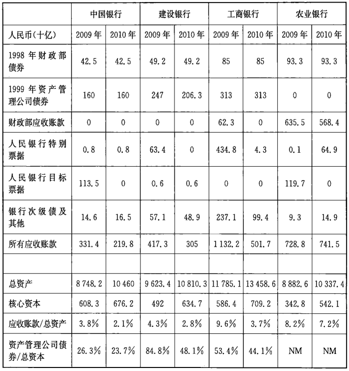

资料来源：银行经审计的财务报表，2009年12月31日，2010年12月31日

这些资产的性质和价值是什么？人民银行发行的各种证券，以及1998
年的财政部债券，事实上都是一种明确的主权债券。但是，这些资产管理公
司的债券，或者来自财政部的“应收票据”又该分配以什么样的价值呢？很
明显，从表面上看，财政部的应收票据应当类似政府债券。然而这些债券已
被国务院和全国人民代表大会批准作为国家预算的一部分。这些债券将由
国家税收收入偿还，或者发行更多的债券偿还。谁批准发行的这些债务呢？
这些债务如何被偿还呢？这些都是非常重要的问题，因为各大银行都拥有
这些证券资产所带来的风险敞口。例如，这些重组的总资产是工商银行总
股本的近两倍，其中资产管理公司的债券就占53%。在接下来的章节中我
们将试图探讨这些债务是怎么形成的，以及它们都代表着什么。以此来确
定其价值和结构对于整个银行体系的影响。

## 人民银行的重组模式

从加强银行体系的角度来看，中国人民银行最初提出的模式是最有效
率的，通过结合更多的新资金，给不良贷款更好的估值，向银行提供更多
的资金。在第一阶段的1998年，中国各大银行的资本金补足到了国际标准
所要求的最低水平。接下来，就是以总值100%的价格向资产管理公司转移
了1700亿美元的坏账。这些“坏银行”通过人民银行贷款和自己发行的债
券向银行支付现金来购买不良贷款。然而，当这些现金注入进来的时候，通
胀开始隐现了。因此，央行为了冲销在资产负债表上的现金，不得不开始购
买央行债券，而这些债券也不能进行任何进一步的融资交易。这些就是表
3－1中列出的中国人民银行债券的来源。在2003年，中国银行和中国建设
银行把剩下的坏账全部从资产负债表上勾销掉了，价值930亿人民币，约合
120亿美元。然后通过中国政府的外汇储备和境外战略投资者的投资来补充
银行资本。中国建设银行和中国银行以这种方式进行重组，并在2005年和
2006年成功完成了首次公开募股。

## 四大银行的部分注资，1998年

由于广东国际信托投资有限公司的破产以及对于其他银行破产的谣
言，1998年朱镕基总理颁布了命令，要求尽快向四大银行注资，以达到最起
码的国际标准，这在当时是中国国内唯一可以找到依据的标准。其实早在
20世纪80年代和90年代，银行放出的不良贷款已经堆积成山，这个问题被
搁置了十年之久，这是面对棘手问题时最典型的官僚主义做法。但是到了
1998年,这个问题已经日益显现，为政府增加了极大的系统性风险。在此之
前，中国的银行别说从来没有按照严格的专业标准开展审计，即便是按照一
般的专业标准进行审计也没有过。正如广东国投一样，没有人能确有把握
地说这个“窟窿”有多大，朱镕基总理极为震怒。我们可以想象到当时财政
部官员的压力，因为他们必须给出一个能够让总理满意的数字。当然在那
时,并没有时间做一个真正意义上的审计。但有人很聪明，想出了一个据称
是足够的数字，能够把银行资本充足率提高到8%，以符合巴塞尔协议对国
际银行业的标准。这个数字是2700亿元人民币，约合350亿美元。在1998
年的中国，这可是一大笔钱呢。这几乎相当于全年政府债券发行量的
100%，或是25%的外汇储备，抑或是4%的GDP。为了达到这个要求，财政
部当时将大部分储蓄存款都视作国有资本了（见表3一2）。

表3－2　组成四大银行的存款组成，1978一2005年       单位：十亿元

           总计   家庭储蓄    政府储蓄    企业储蕾        其他
------ -------  ---------  ----------  ----------  ----------
1978年   113.5      27.2%       40.3%       32.4%        0.0%
1983年   276.4      34.9%       32.6%       31.3%        1.2%
1988年   744.9      44.7%        9.2%       39.4%        6.7%
1993年  2324.5      55.7%        5.2%       33.0%        6.1%
1998年  6978.2      57.1%        4.9%       36.2%        1.8%
2003年 13465.0      56.7%        7.9%       30.9%        4.5%
2004年 15355.7      56.6%        8.3%       31.6%        3.5%
2005年 18112.1      55.8%        9.9%       29.5%        4.8%

资料来源：《中国金融统计》1949一2005年

首先第一步，中国人民银行通过法令把存款准备金率从13%降至8%。
这一举动释放了2700亿元人民币的存款准备金，而后这笔钱被用来购买由
财政部发行的相同价值的特别国债（见图3－1)[^3-1]。接下来第二步，财政部
将发行债券所得的收益“借给”了各家银行，以补充银行的资本金（见图
3－2）。这相当于通过财政部将这2700亿元人民币从储户和企业名下悄无
声息地转移到了银行的资本金之中。

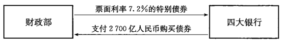

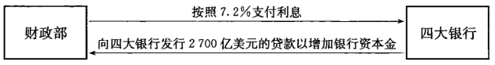

作为建设银行和中国银行在2003年重组的一部分，这些名义上属于财
政部的资金共计人民币930亿元全部被用作了坏账准备，然后用于减记相同
金额的不良贷款[^3-2]。而财政部则要负责偿还当初发行的债务。对于银行来
说，这当然是一笔很好的交易，因为现在财政部不仅有义务用原本就属于银行
的钱来向银行偿还这些债务，而且用于偿还这些债务的资金全部都来自财政
部自己的家底。也难怪财政部并不支持中国人民银行对于各大商业银行的重
组方案，因此这笔债务的还款期限被延长到了2028年。但是，在当时，如果没
有国务院和全国人大的批准，人民银行怎么能够动用这么一大笔资金呢？

[^3-1]: 债券本身期限为10年，但是在2005年进行了调整。新的票面利率被调整至2.25%，到期日延展至2028年。

[^3-2]: 在工商银行和农业银行的案例中，1998年财政部注资被保留了，并且没有像建行和中行重组案例中的那样被勾销。

## “坏银行”和“好银行”，1999年

通过这种会计上的技巧，各大商业银行终于开始走上了IPO之路。在
周小川提出“好银行/坏银行”的方案之前，它已经被成功地应用在北欧国家和
美国，这显然是一个国际性的战略。这涉及一些问题，如何建立“坏银行”，使
其持有从大型国有银行剥离出来的问题资产，并使之成为“好银行”。周小川
提出，可以分别为四大国有银行各自创建一个被称为“资产管理公司”的“环银
行”。之后就是最有争议的一步，当不良贷款被重组完成之后，这些资产管理
公司将会逐渐关闭，而其损失将会被结晶化，并减记，这一过程则需要十年之
久。1999年，国务院批准了该计划，并成立了四个资产管理公司。

财政部通过购买四大资产管理公司发行的总额400亿元人民币，也就是
差不多每家10亿美元的特别金融资产管理公司债，对其完成了注资（见图
3－3）。和当初对这些资产管理公司存在的时间预期一致，这些特别资产管
理公司债券的到期时间是十年以后。但是400亿人民币根本就不足以购买
这些银行的坏账，因此就需要更多的资金，而这些资金从何而来呢？这些资
产管理公司分别向其所对应的银行发行了总值8580亿人民币约合1050亿
美元的十年期债券。

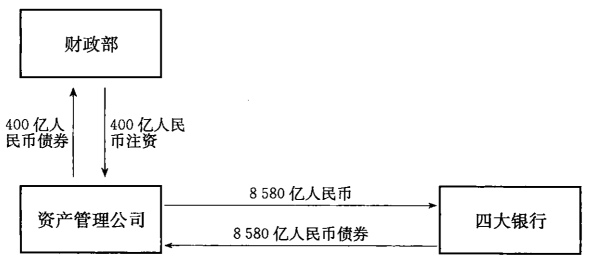

这些由资产管理公司向他们各自对应的银行所发行的债券体现了人民
银行安排上的主要缺陷。这些债券的最大问题是，即便在账面上这些不良
资产已经从银行资产负债表上被转移走，银行却很大程度上依然面临着原
来这些不良贷款潜在的风险。银行只是用明确无疑的坏账换来了一块价值
并不确定的资产。而这笔交易所遗留的敞口相较于银行的资产规模而言也
非常巨大。由于当时银行的再融资规模庞大而中国的财政能力有限，因此
政府不得不依靠这些银行。但是这种方法显然不符合国际上特定的模式，
也不能从根本上解决问题。

按照北欧国家和美国的模式，国家财政不单单为“坏银行”提供了注资，
更为其提供了融资帮助，使那些“好银行”不再保留有不良贷款的敞口。这
些坏账最终会成为国家财政的问题，而由国家税收来买单。但是在中国，只
要政府依然依靠银行为体制内的资产管理公司融资，那么其实就并无大碍。
中国的监管者对银行持支持态度，而由于资产管理公司是体制内国有企业，
其所发行的债券也有些半主权债的意味，因此从某种意义上讲，信用风险可
以被避免。但是一旦这些银行到国际市场上市，接受了境外投资者和监管
机构的监管，国际上的审计人员一定会质疑这些债券的价值问题。这些资
产管理公司的资本约为50亿美元，而他们已发行债券的总额为1050亿美
元，并且其购买的资产并没有什么价值。如果这些资产管理公司在2009年
的时候无力偿还这些债务，那该怎么办呢？

## 资产管理公司收购的不良债务，2000年

新的资产管理公司最初开始收购这些不良贷款是在2000年，并在当年
结束。总值1.4万亿元人民币（约合1700亿美元）的不良贷款被全额从银
行转移到了资产管理公司。这些用于购买不良资产的资金主要来自于发行
债券，以及中国人民银行价值6340亿人民币（约合750亿美元）的进一步信
贷支持（见图3一4）。这就很明显地带来了一个问题：如果这些不良贷款真
的值这么多钱，为什么还要从银行剥离出来呢？这里有一些可能的答案：
2000年对坏账的核销抵消了1998年财政部对这些银行资本的注入，但那时
新的资本将从何而来，具体地说还是个未知数。从数量来看，新资本的来源
并没有太大的选择空间。另外，这样的资产转移也相当于是间接地为银行
注入了资本，因为用现金一对一将坏账置换走降低了坏账金额，自然也使得
银行的坏账准备金有所下降，释放了一部分资本。这也减少了将来对坏账
准备金的需要，可以促进未来银行的利润和资本状况都获得改善（对坏账的
核销在财务上将被计入当期的费用）。

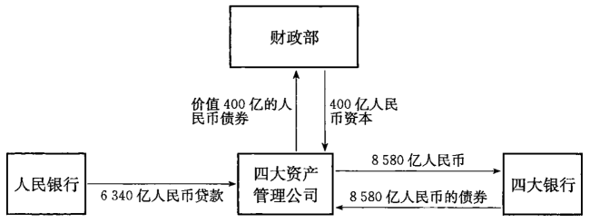

而另一种答案可能是，政府无法对这些不良贷款的估值达成共识，毕
竟这些贷款都是国有企业欠下的账。如果这些不良贷款的实际估值跟原
本的价值有什么差距，那么就意味着国家无法偿还自己欠下的债务。因
此，政府并没有选择让那些无法偿付贷款的国有企业破产，这些企业几乎
遍布了了所有工商行业。政府最终选择将这些潜在损失集中在银行的资产
负债表中，把这个难题留给未来，而不是现在就将这些不良贷款做减值
处理。当然，到了2009年，政府决定再做一次同样的事情，所以这些资
产管理公司的债务问题又被推迟了十年。“体制内”就是可以如此的随
心所欲。

## 人民银行重组中国建设银行和中国银行，2003年

官方数据表明，在2000年第一批不良贷款被转移之后，四大银行仍然持
有2.2万亿元的不良贷款，约合2600亿美元，而这个数字还是在2002年采
用更为严格的国际贷款分类标准之前所得出的统计数字。政府费尽心思想
要好好研究一番银行的资产水平，但他们自身的资源却非常有限。政府的
做法往往十分保守，保守到不希望增加一点国家债务。如果这些银行真的
需要增强，那么它们就需要更多的资本。因此周小川得出的结论是，这些资
本只能由国际战略投资者来提供。但问题是，如何才能将这些银行的资产
负债表和商业前景描绘得足以吸引这些战略投资者呢？

最终这个问题归结为，每家银行能够承受多少不良资产减记。最终，人
民银行发现，这四家银行中只有中国银行和中国建设银行有足够的留存收
益和注册资本金来将所有的不良贷款减记掉，而最终还能剩下一些资产。
这对于工商银行和农业银行在2003年的水平来说却是无法做到的，如果全
部减记，二者都要面对负资产的情况。因此在那时，从实际意义上来讲它们
已经破产了。中国银行和中国建设银行的930亿人民币的资产要被减记掉，
哪里来这么多钱补这个窟呢？在经过多方争论之后，周小川提出了唯一
可能的解决方案：动用外汇储备额。正如人民银行金融稳定局局长谢平说
的那样，这次政府并不仅仅是在玩会计游戏，而是要将大把的真金白银注人
银行。

[^3-3]: 930亿人民币作为1998年财政部2700亿特别债券的一部分被注入到两家银行。在当时银行的不良资产率已经达到了40%，因此不可能有任何一家银行拥有真正意义上的留存收益。

周小川的计划最终被国务院批准了，并且在2003年的最后一天，各家银
行都将自己的资金和留存收益[^3-3]划入了坏账准备金，并且减记了所有不良贷
款。换句话说，财政部之前给这两家银行的930亿元人民币的注资全部都被
“减记”了，但是财政部仍然需要偿付1998年发行的特别债券所遗留下来的
债务。这本身就显示出了当局在进行银行重组时的严肃性。这两家银行各
通过中央汇金投资公司（将在第五章中详细说明)从中国的外汇储备中得到
了价值225亿美元的注资。在此后不久，2004年的5月和6月，这两家银行
又通过由中国人民银行主导的拍卖渠道出售了4420亿人民币的不良资产，
获得了更多的注资，这一切都是事先安排好的。在这一系列的不良资产拍
卖之后，中国银行和中国建设银行终于成为了能够吸引境外投资者的公司，
并于2005年开始了上市之路（见表3一3）。现在中国人民银行已经全面地
控制了中国建设银行和中国银行[^3-4]。

[^3-4]: 事实上，中国人民银行此前允许一些央企持有建设银行股票以起到分散股东的目的，如中国社保基金。在引进国外的战略投资者以前，此时，中国人民银行仅仅持有刚过95%的中国建设银行股份。

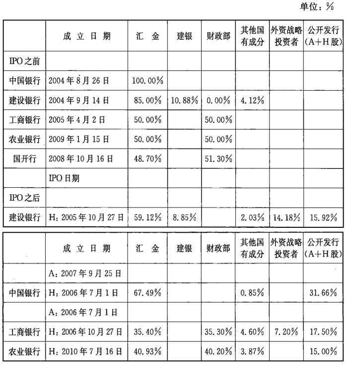

注：首次公开招股日期，包括中国香港(H股)和上海（A股)首次公开发行时间。其他国有成分
包括中国境内战略投资者如国有企业。对于中国银行来说，所有全国社会保障基金理事会（4.46%）
和境外战略投资者的股份（13.91%)在IPO发行之时已转换为H股股份，并包含在公众持股数量之
中。建银是汇金公司的全资子公司。

资料来源：汇金公司，银行年度财务报告及ABC招股书

## “商业”不良资产处置，2004一2005年

按照中国人民银行的蓝图，在随后的2004年和2005年将要开始第二
轮的金融资产管理公司收购不良贷款，总额为1.6万亿元人民币（约合
1980亿美元）。除了第二批的价值人民币7050亿元的工商银行不良贷
款，整个收购组合还包括价值6030亿人民币的小型第二梯队银行的不良
贷款。在这些交易中，中国人民银行提供了必要的资金支持，估计高达人
民币7000亿元（参见图3－5和表3－4）。但是这一次，中国人民银行已
经直接预先拿到了一部分款项，这是原版拷贝了财政部在1998年时的脚
本：在2004年，它已经向中国银行、中国建设银行和工商银行发行了价值
5672.5亿元人民币（约合700亿美元）的强制性特别票据。这些票据不能
在市场上公开交易，它们将会在2009年，原定资产管理公司停业的那个时
候到期。

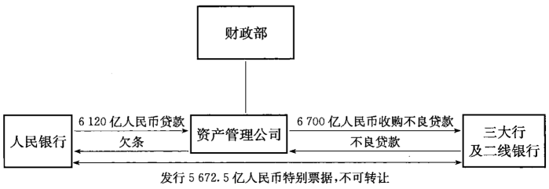

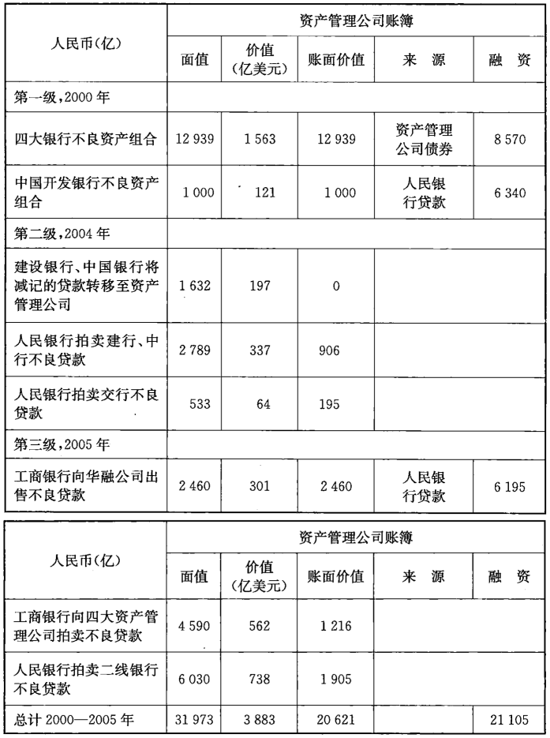

资料来源：《财经》杂志，2007年7月25日；银行招股说明书；中国人民银行，《金融稳定报告》

中国人民银行通过发行特别票据，完成了两件事情。首先，它去除了之
前为了剥离不良贷款而融资产生的多余流动性；其次，人民银行实际上已经
预先从这几家商业银行抽出了部分款项，总额相当于它当初给资产管理公
司融资总额的1/3。从实质上讲，这种特别票据是2007年财政部发行特别票
据为中投公司融资的一种前奏，这种特别票据的发行有着共同的原因，就是
控制多余的流动性。

## 工行和农行的资本结构调整，2005 年和 2007年

1998年中国建设银行与中国银行重组时，我们可以发现那时财政部的
注资被完全用于核销坏账了，但债务却依然由财政部背负；可是在2005年工
商银行进行重组的案例中，中国财政部最初的850亿美元的注资得以以资本
金的形式保留了下来。所以在工商银行的股份结构中，人民银行和汇金公
司的注资被减少到了150亿美元，相当于银行股东权益的50%。而在两年
后的2007年，中国农业银行的资产重组依旧沿用了工商银行的重组模式，但
是当时的情况和之前又十分不同了。就像之前那样，汇金公司动用了中国
的外汇储备向中国农业银行提供了约190亿美元的新的资本，而中国财政部
1998年的注资仍然保留。但是，正如我们将要在第五章讨论的那样，汇金公
司此时并不属于中国人民银行，而是属于财政部。当然，从表面来看，这次
重组的方式和过去人民银行所做的一样，但是通过这次重组，整个银行的所
有权结构都回到了过去重组之前的那样，即由财政部主要控制。当然不仅
仅是所有权受到了影响，就连问题贷款的处置方式都与政府对待银行的态
度完全不同。随着中国建设银行和中国银行重新成功地走向复兴，政府开
始希望银行能够帮助其分担一些责任。从2009年的贷款盛宴我们可以看
出，现在银行又一次沦为了政府的一个简单的工具。

## 财政部的重组模式

对于人民银行的商业银行重组模式，财政部当然不怎么高兴。因为从
历史上来看，这几乎是第一次他们的角色发生了逆转。但是，正如我们前文
说的那样，从2005年开始，财政部又逐渐开始能够向银行体系发挥影响。当
然这需要一个过程，而这个过程的标志就是2007年中国投资有限责任公司
（简称中投公司）的设立（参见第五章）。财政部的做法和中国人民银行的主
要区别是，它直接负责这些不良贷款出售相关事宜的融资和偿付。事实上，
从这一个角度来看，这种做法似乎更接近国际上通行的模式。在整个改革
的进程中，人民银行已经成功地将财政部推到了一边。但其复杂的不良贷
款的处置方式、资金安排，以及实际操作中政府的诸多限制，使其并没有成
为一个很好的解决方案。从一开始，这些资产管理公司的资本就并不充裕，
并且还要无望地面对着100%全额收购不良贷款的压力。他们怎么可能真
的会想要偿还人民银行的这笔债务昵？

然而，如果我们仔细研究的话，财政部的解决方案也有它的弱点。在
2005年财政部开始着手掌控工商银行重组的时候，它用自己发行的票据取
代了一部分资产管理公司的债券。在那年，一个价值2460亿元人民币的不
良贷款组合被转移到一个“共同管理账户”（见附录）。并且，中国工商银行
并没有因此收到现金注资，这同中国建设银行、中国银行的重组大相径庭。
相反，工商银行只是收到了来自财政部的“欠条”，而不是来自资产管理公司
的债券，但实质上都差不多（见图3－6）。

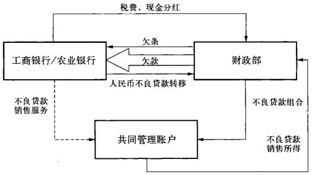

农业银行的案例也是一个典型的财政部的做法。财政部用特别发行的
“欠条”全额置换了农业银行大约80%的不良贷款，总价值约6651亿人民
币，约合975亿美元。与工商银行一样，资产负债表中的不良贷款被这些“欠
条”所替代，并且只是用含糊的字眼儿在财务报表的附注里说明财政部将在
“随后的几年”进行偿付。对于工商银行来说，它的应收款项期限为5年，而
农业银行为15年[^3-5]。从积极的一面来看，这些应收账款实际上还是有利的，
因为它直接表明了财政部的义务，并缓解了银行不良贷款的压力。此外，由
于工行和农行并没有收到现金，流动性过剩并没有成为一个问题。这是这
种方法的优点，但也是缺点。

[^3-5]: 原资产管理公司自1999年起所欠中国农业银行的1380亿人民币的债务被“欠条”所代替；价值1506亿人民币的不良资产被用来冲销相等金额的央行债务。

从这两家银行的相关交易的细节来看，我们可以发现，这种方法又一
次将现行的问题推到了遥远的未来。事实上这些所谓的不良贷款都被转
移到了财政部的“共同管理账户”。通过财政部的授权，银行可以对这些不
良贷款进行处置。但是这些财政部的“欠条”究竟是什么？它似乎可以代
表财政部的义务，可事实上财政部代表着主权债的发行主体，那么这些
“欠条”能不能理解为中国政府的直接义务呢？这个交易本来可以十分
简单明了，那就是由财政部发行债券，通过其债券发行的收入来向资产
管理公司注资，并用现金收购不良贷款。如果这样的话，也就不要人民
银行扩张信贷了。这是美国财政部在储蓄和贷款危机时，出资重组信托
公司的方法。

这种方法可以将银行完全清理干净，而这笔债务也无可争议地转移到
财政部下面，由政府税收来负担这些责任。但是为了完成这一系列的交易，
财政部则需要将这些债务问题纳入国家预算，并且需要全国人大的批准审
核。而这些没有兑现的“欠条”是资产负债表外的东西，只需要作为银行资
产重组的一部分通过国务院的审核就可以了。事实上，这些“欠条”甚至可
以不用通过国务院的审核，因为这些工具只不过是一些未能兑现的“或然负
债”而已。“或然负债”并不包含在国家预算和其他的一些地方，至少是并不
包含在任何公开的部分中。

当然，财政部欠条的偿付并不依靠国家预算。事实证明，银行自己将是
其唯一的现金来源。中国工商银行经审计的财务报表和农业银行首次公开
发行股票招股说明书中的脚注表明，这些“欠条”还款将来源于不良贷款回
收、银行股息、银行相关税收和出售银行股份所得的收入。换句话说，银行
将会在接下来的几年里自己支付这笔款项，因为财政部不会或者不被允许
出售这些银行的股份。事实上，这其实已经开始发生了（见图3－7）。由于
这种资金来源代表着未来的现金收入，因此所谓的“共同管理账户”就像是
不良贷款的一个寄存处一样，又好比是一个方便的停车场。鉴于资产管理
公司的问题贷款回收的经验（本书在后面会讨论），任何其他银行似乎都无
法比他们做得更好。在2010年初，北京金融资产交易所成立了，这一举措强
烈地暗示了银行将如何处置在那些共同管理的账户中的不良贷款。这一新
交易所位于北京金融区的心脏地带，其股东包括信达投资、光大银行和北京
产权交易所。它的任务是通过公开拍卖，来处置不良贷款。也许，这家交易
所将着手这两家银行不良资产的处理。但是哪家机构有如此大的实力能够
接手这些不良资产？又有谁会去接受这些明显不可避免的被减记的资产
呢？最后，财政部将不得不发行债券来弥补原先的“欠条”，或者干脆延长支
付期限。

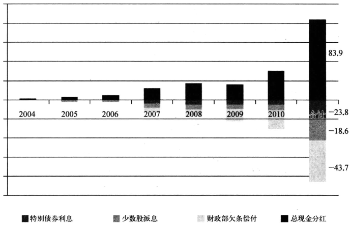

数据来源：H股经审计的财务报告

最终，银行股份的分红成了这些债务的一大可靠还款来源。这样又牵
扯到了银行的股息分配政策，我们曾在第二章的时候提到过。而在下一章，
我们将要探讨中投公司的问题，以及和并不完美的人民银行方案相比，财政
部方案有哪些明显缺点。

## “坏银行”的表现及箕意义

到2006年年底，中国银行、中国建设银行和中国工商银行已全部完成了
他们的首次公开发行上市。此后不久，各资产管理公司也逐渐完成了他们
对于不良资产的处理工作。鉴于每家资产管理公司对于每家银行的重要
性，有一个问题必须要问，那就是：这些“坏银行”的表现到底怎么样呢？在
2005年，即便是在第二轮不良资产剥离之后，四大国有银行和其他二线银行
总共有超过1.3万亿元人民币（约合1580亿美元）的坏账在他们的资产负
债表上。到2005年，前面两轮剥离的坏账加上剩下的所有总计有4.3万亿
元人民币。如图3－4，资产管理公司承担了2.1万亿元人民币的义务，相当
于2600亿美元。所有的这些负债结构都是经过设计的，可以通过贷款产生
的现金利息来偿付。很明显，由于第一组的1.4万亿元人民币和第二组的一
部分是按照面值全额支付的，因此一开始就一次性全额支付是不可能的。
从整个交易运作的最初，这些资产管理公司就已经技术性破产了，这一点和
现在由财政部使用的“共同管理账户”有一定程度的不同。

在2006年年底,第一批剥离的不良贷款中有80%被处理完毕了，而此
时公布的资产回收率只有20%，这完全无法支付各类相关债券和贷款的利
息。而第二批待剥离的坏账中大部分是贸易类，显示回收率可能比第一批
要高，可是来自行业的信息却显示，实际的回收率要低于预计。随着2009年
不断临近，中国政府开始面临着这些资产管理公司将近80%的资产如何减
记的问题，这些资产总值超过1.5万亿元人民币。但事实上，损失很可能要
比这些大得多，甚至那些资深的业内人士也无法估量这个数字究竟是多少。

各资产管理公司拥有约12000名员工，有自己的经营开支，包括借入资
金的利息开支。经营亏损的估计，不包括任何坏账的减记，如表3一5所示。
资产管理的财报使用贷款的回收收入为营业收入的来源，但是这种会计处
理方法并不合适。事实上，相关的报告表明，资产管理公司依靠对坏账的清
缴来支付其发行债券的利息，这些债券由人民银行和四大银行持有。如果
资产管理公司不能按时支付利息的话，那么四大银行将不得不为银行所持
有的资产管理公司债券提取违约准备，如果不提取违约准备，那么财政部就
必须代资产管理公司支付利息。没有迹象表明这种情况会发生。为了能够
达到一个预估的回收率，表3－5假设20%的以面值被收购贷款可以被完全
清缴，而有35%的通过拍卖而购得的贷款可以被完全清缴，而资产管理公司
则被假定支付30%的金额。营业性费用支出是依照财政部的相关规定，基
于出售不良资产收入的10%来计算的。

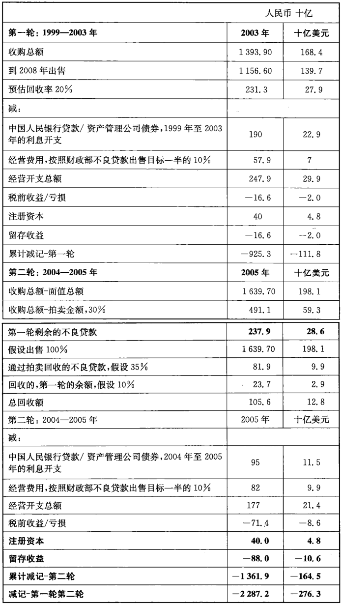

注：8.28人民币=1.00美元

资料来源：《财经》杂志，2008年5月12日，第77—80页；2008年11月24日，第6062页。

结果表明，这四家资产管理公司总计损失了400亿元人民币的资本金，
而大约2.3万亿元人民币（约合2760亿美元）的不良资产尚未被减记扣除。
这意味着损失率达到了75%左右。但是资产管理公司的盈利或损失只是一
个粗略的猜测而已，不良资产的减记却是一个相对准确的数字，更重要的
是，这些数字被留在了这四家非公开、非透明的企业的资产负债表中。

不良资产没有完全减记扣除的理由其实很简单。如果全部，甚或是部
分减记这些不良资产，四大资产管理公司就会面临倒闭的局面，这致使政府
面临一个艰难的换择：要么银行将承受资产管理公司发行的债券的巨额损
失，要么财政部承担责任并向全国人民代表大会作出解释。

数年之后，所有的方案和计划都发生了转变，财政部得以负责整个事
务。而到了2009年，中国的银行似乎已经变得举世无双，而那些资产管理公
司也可以大声谈论关于综合金融牌照的事情，似乎每个人都刻意遗忘历史。

在2009年，当资产管理公司的债券到期的时候，他们并没有停业，当然
他们的债券也并未被偿付。经过国务院的批准，这批债券的到期日将再延
长十年。为了在银行的资产负债表上体现出这些债券的全部价值，中国财
政部还请国际会计师事务所的审计师为其债务偿付提供了书面的支持。每
家银行的年度财务报告，如中国建设银行2008年的报告，都用以下文字进行
描述：“根据财政部颁布的通知，从2005年1月1日起，如果信达公可不能足
额支付债券利息，财政部将给予资金支持；对债券的本金兑付，必要时财政
部将给予支持。”当然，所谓的“通知”并不是付款保证，中国财政部才不会用
书面的形式给予任何“保证”。这只是说明，财政部会以某种方式偿还这些
义务做出一些支持，当然也不排除在某些时候，财政部不愿或不能这样做。
“付款保证”总是发生在不合时宜的时间，比如发生在2009年的“展期”。在
此之前，中国建设银行、中国银行和中国工商银行都继续以全部价值持有这
些债券。如表3一1所示，债务的违约或者其价值的减记，都会显著地影响到
这些银行的资本基础，并且必然导致再一次的资产重组。

## 中国人民银行的“永久卖出期权”

利用资产管理公司来解决各大商业银行的不良贷款危机似乎是整个中
国银行体系内最重要的一个部分。这好比是中国人民银行向四大资产管理
公司“发行”了一只“卖出期权”。事实上这个“卖出期权”已经超越四大资产
管理公司并达到了整个金融系统的层面，并可以削弱任何可能进行的改革
努力。这是政府为了抵御金融灾难而制造的保护盾。以“金融稳定”为目
的，中央政府已经要求人民银行承担所有财务清理的工作。这可是一个巨
大的工程，从1990年代的信托公司破产到2004一2005年的证券公司破产，
从公开市场的估计来看截至2005年年底，涉及的总金额超过3000亿美元，
而这个数字很有可能是被低估的（见表3－6)[^3-6]。正因为持有这样的“卖出
期权”，这些银行的管理层就根本不用去关心贷款的估值、信用的评估和风
险的管理。他们可以轻易地将自己的错误转嫁给资产管理公司，或许是基
于所谓的商业协议的基础之上，而中国人民银行对这些资产管理公司则会
出资支持。

表3-6 历史上的人民银行“金融稳定”成本，截至2005年

单位：十亿元

------------  ------------------  ----------------------------------------
时间             金额(10亿人民币)   用途
------------  ------------------  ----------------------------------------
1997-2005年                159.9   向信托机构、地方商业银行、农村信用社借款偿
                                   还负债

1998年                     604.1   向四大国资产管理公司注资以完成第一轮的银
                                   行不良贷款收购

2002年起                      30   向11家破产券商注资以帮助其偿还相关债务

2003和2005年               490.2   通过汇金公司向中行、建行和工商银行注资

2004-2005年              1223.60   向四大国资产管理公司注资以完成第二轮的银
                                   行不良贷款收购

2005年                        60   再次向破产券商注资以帮助其偿还相关债务

2005年                        10   向投资者保护基金注资

总计                     2577.80

十亿美元                   315.5
------------  ------------------  ----------------------------------------

资料来源：《经济观察报》，2005年11月14日；中国人民银行，《金融稳定报告》，2006年；《财经》杂志，2005年7月25日

[^3-6]: 参见《经济观察报》，2005年12月26日。这个数字似乎可能会更大，中国人民银行在其2005年的金融稳定报告中也提到了3.24万亿人民币，或3900亿美元。

因此，我们对于中国人民银行在2005年8月建立自己的资产管理公司，
以解决其自身资产负债表（见图3－8）[^3-7]上的“历史遗留问题”就不必惊呀
了。汇达资产管理公司成立之后，被人称作第五大资产管理公司，其业务自
2005年以来一直十分神秘，因为它没有向外部投资者出售其不良债务的投
资组合。汇达资产管理公司可以被看成汇金公司的兄弟企业。汇金公司向
那些制造问题资产的金融机构进行注资，而汇达则收集持有这些未能偿付
的不良贷款，并使其成为中国人民银行维持金融稳定工作的一部分。

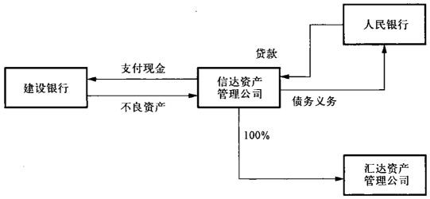

汇达资产管理公司就如汇金公司一样，是中国人民银行金融稳定局的
一个产物，其管理层都来自局内的高级管理人员，剩下的也都是汇金公司的
管理层[^3-8]。但是，与汇金公司对银行的投资不同的是，中国人民银行想要将
问题资产从自己的资产负债表上剔除掉。因此，汇达资产管理公司实际股
权持有者应该是一个第三方，而鉴于它与人民银行之间的紧密关系，信达资
产管理公司就是一个显而易见的选择。

[^3-7]: 于宁：《汇达登场》，《财经》，2005年7月25日。
[^3-8]: 《汇达资产托管浮出水面，张汉桥或出任董事长》，《第一财经日报》，2005年8月3日

问题资产中都包含着什么呢？从汇达的中国香港经营许可证上来看，
目标资产来自海南和广西的房地产贷款，而其资产组合部分来自原先广东
国际信托投资公司以及广东省的倒闭企业。有趣的是，这些数字是不包括
在表3－6中的，估计约为人民币1000亿元[^3-9]。尽管这个目的显而易见，金
融界当时都普遍认为人民银行的意图是让汇达管理这些由央行发放给四大
资产管理公司的总值6000亿元人民币的贷款。早在2000年，中国央行已
经安排四大资产管理公司处理相关工作。汇达资产管理公司的注册资本仅
有1亿美元，无论是从老的不良贷款的角度还是人民银行近期的资产管理公
司贷款来看，汇达的杠杆率都会非常高。

假设正如图3－9中的交易所示，汇达的确承接了部分或者全部的人民
银行对资产管理公司的贷款，就像我们前面所提到的那样，在2000年，人民
银行向信达资产管理公司提供了相应贷款来用于全额购买中国建设银行的
不良资产。这些资产最后成为了人民银行资产负债表中的一部分，并最终
被出售给了汇达。汇达最终需要替这笔不良资产而买单，但反过来，人民银
行会将这笔钱先借给汇达，事实上他们就是这么运作的。这笔交易最终的
结果就是，汇达实际上拥有了当初与信达相关贷款资产，并且记在了自己的
账上，而人民银行则持有了汇达的贷款资产。

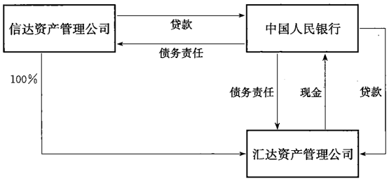

[^3-9]: 海南和广东两省数字的缺失让人想起关于巨额三角债务的命运的问题。朱基在20世纪
90年代解决了1980年代遗留下来的巨额债务。

这样一来，唯一的问题就是，汇达是信达资产管理公司的全资子公司。
换句话说，信达对于中国人民银行的贷款义务（包括最终环节的汇达）都由
信达自己本身持有。如果这些账户可以合并，然后资产和负债相抵消，一切
都将消失。这一切都看似没有道理，但是从政治的角度来看除外：对于人民
银行来说，它是可以在自己的资产负债表上保留一些不良资产的，而信达这
样一个非上市公开、不受审计约束的实体企业也并没有必要将汇达合并报
表。最好的情况是，这些贷款可以最终成为或有负债（表外债券）：如果汇达
无法收回这些不良贷款，那么人民银行对于汇达的贷款也将无法被偿付。
正如前面提到的，或有负债（表外债券）在中国的金融实务中不被认为是真
正的负债。在国家预算报告中提到了这样的事情吗？如果我们看一眼信达
资产管理公司的网站，我们就会发现，对于上面100%持有汇达股份的事情
只字未提。人们不禁要问，是否有第六个或第七个资产管理公司潜伏在中
国的金融体系之中呢？

## 新的经济“大跃进”

20世纪90年代的不良贷款问题还没有解决，2008年开始一直延续到
2009年、2010年的信贷狂欢也没有一些缓和的迹象。然而现在中国政府已
经有紧缩信贷的迹象，而新的资本正通过传统银行系统以外的渠道流入这
个市场。或者这仅仅是一个定义上的问题。事实上，中国人民银行、国家审
计署和银监会对于正在发生的事情都有自己的看法。当凑近距离观察现状
的时候，我们发现，整个金融体系都在不断地用各种方式满足对于资本的需
求，因为这种需求是从未止步的。这也进一步表明了，在过去的三年里，中
国经济的确发生了十分显著的变化。这些金融创新和创造力都向我们证
明，在融资需求的驱动之下，实际上中国的企业家和富有创造力的商人能做
的事情有很多。但是，由于拒绝接受这一充满生命力的现象，中国管理机构正
在“逼迫”着中国的商人甚至银行寻找新的方式来规避各种新的管理规定。

在这样的环境下，这样做的结果显然将导致问题贷款的增加，并且在未
来对银行资产负债表形成压力。借款人和融资的项目跟上一个周期都是相
同的：基础设施建设，国有企业和地方政府的融资平台（这将在第五章中进
一步讨论）。但是这一次，他们的贷款数额要大得多，有些媒体甚至将这次
的信贷狂潮比作1958年到1961年中国的“大跃进"运动。只是这一次，高速
铁路网络和大片的“鬼城”代替了大炼钢铁的高炉。

在2010年年初，监管机构和政府发言人都声称，随着时间的推移这些贷
款将被还清。这些话被全球各地的分析师传来传去，但是其中隐含的意思
也许只有中央政府才知道。正如一位官员曾经简单地说：“在短期内，这些
项目都没有现金流。”换句话说，这些贷款中有相当一部分，大约是地方层面
50%的融资贷款，都已经违约了。在2011年，曾有人建议中国政府做足资产
泡沫破裂的打算，做好在未来从银行资产负债表上减记2万亿到3万亿元人
民币，约合3000亿到4500亿美元不良贷款的准备[^3-10]。这个数字相当于7%
的GDP,也近乎于过去十年国有银行剥离的坏账的总和。在2011 年中期，
当时的中国铁道部已经过于雄心勃勃了，它已经负债约1.98万亿元人民币，
而铁道项目的营运现金流却是负的。

更令人惊叹的是，以上对于资产泡沫的估计仅仅是考虑了银行信贷对
于地方实体的支持，并未考虑到国有企业贷款、房地产融资和地下金融市
场，以及中国铁道部的举债。在2011年5月，当中国人民银行的社会融资规
模[^3-11]相关数据公布之时，这个画面才逐渐展开。这个统计口径不仅包括了银
行贷款，还包括了其他融资工具（见图8－2），包括证券化贷款，这个数字在
2010年早期的时候是1.6万亿元。如果把这些融资工具全部考虑在内，人
民银行得出的结论是，在2009年和2010年，总的融资规模均达到了14万亿
元。这个数字几乎是简单估计2010年银行信贷7.9万亿元规模的两倍（见
图3－10）。更令人费解的是，当时的中国银监会主席声称有3万亿元银行
资金并未实际流向用款企业，而是转入了高利贷市场，但就在两天后，他自
已管理的中国银监会就否认了他的言论[^3-12]。

[^3-10]: 张斌：《中央政府欲接收3万亿与土地相关地方债务》，《经济观察报》，2011年6月2日。
[^3-11]: 参见中国人民银行《社会融资规模构成指标的说明》，2011年5月20日。

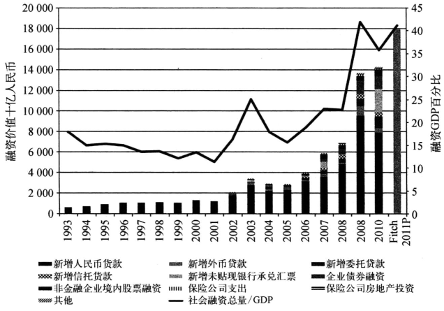

资料来源：Wind资讯；中国人民银行，《金融稳定报告》；惠誉评级

国际评级机构惠誉研究了中国的信贷增长，他们认为中国人民银行的
数字仍然有所遗漏，并且得出结论，中国的信贷增长远超过GDP的增长速
度。惠誉估计[^3-13]，2011年中国的融资总规模达到18万亿元，高出人民银行提
供的数据3.5万亿元，达到了GDP的42%。如果这个数据是准确的，那么
这个数据是2009年纯粹信贷数据的两倍。这个融资规模的数字可谓是“大
而无当”，引起了很多问题。这样看来，资产管理公司还会像原先计划的那
样逐渐完成其使命并寿终正寝吗？如果它们的作用是如此之重要，那么它
们怎么还能够被允许赴香港IPO上市呢？而财政部还能再打多少“欠
条”呢？

[^3-12]: 《中国银监会声称：关于地下钱庄的报告并不属实》，彭博资讯，2011年8月12日。
[^3-13]: 惠誉评级，《中国银行业杠杆率涨幅持续超过GDP增长》，2011年7月13日。

鉴于这些背景，人们开始怀疑，当中国政府对于中国金融市场的管理一
旦失控的时候，中国人民银行还能为此写出多少支票。但是有趣的是，在
2007年，中国人民银行公布了自己的资产负债表，而与此同时有关重组的各
种传言也开始蔓延开来（见表3－7)[^3-14]。这可以很好地解释，至少能够部分地
解释，为什么要使用财政部的“欠条”来帮助中国农业银行和中国工商银行
重组了。中国人民银行所公布的资产负债表能够体现中国经济30年来的发
展战略。在资产那一部分，我们可以看到国家的巨额外汇储备，而另外一端
的负债部分则是廉价且在资本项目下不能自由兑换的人民币资产负债，这
些都源于国家的出口。换言之，中国政府正在通过中国人民银行向中国人
民借出廉价的人民币，并同时积累巨额的外汇储备。这种现象的基础是中
国的出口外向型经济战略，并且出口外向型经济也为中国提供了大量的
就业。

[^3-14]:［美」基思·布拉德舍（Keith Bradsher）：《中国主要银行缺乏资金》，《纽约时报》，2008年9月5日。

表3－7中国人民银行的资产负债表，2007一2010年

人民币（亿元）          2007年     2008年   2009年   2010年   按美元(亿美元)
-------------       ---------  --------- -------- --------  -------
国外资产                124825    162544   185333   215419          33141
对政府债权：中央政府      16318     16196    15662    15421           2372
对其他存款性公司债权       7863      8433     7162     9486           1459
对其他金融性公司债权      12972     11853    11530    11326           1742
对非金融公司债权            64        44       44       25              4
其他资产                  7098      8028     7799     7598           1169
总资产                  169139    207098   227530   259275          39888
储备货币：货币发行       32972     37116    41556     48646           7484
金融机构存款             68416     92107   102429   136665           21025
其他非金融类企业存款       158         0        0        0               0
不计入储备货币的             0       591       625      657            101
金融性公司存款
债券发行                 34469     45780    42063    40497          6230
国外负债                   947       733      762      720           111
政府存款                 17121     16964    21226    24277          373.5
其他负债                 14837     18649    13587     7593           1168
总负债                  168920    206878   227310   259055          39855
自有资本                   219       219      219      219             34
总负债与自有资本合计     169139    207098   227530   259275          39888

资料来源：中国人民银行，《金融稳定报告》，2011年。

当然这一部分画面只是与整个经济体系中体制外的部分相关。为了
维护中国体制内的利益，利率一定要低。当然中国也需要将本国货币的汇
率保持在一个较低的水平，但这并不是维持低利率的主要原因。在整个中
国的金融体系中，银行的借款成本一直保持在较低水平。这源于两个原
因：一是为了支持银行的盈利水平，二是降低中国国有经济成分的资金成
本。这是对体制内经济的一种人为的补贴，中国政府藉此大举进行基础
设施建设，并且提供了就业岗位，成为中国稳定发展的一个支柱。在过
去的三年内，这种依赖廉价资金成本进行投资从而推动经济发展的举措
为中国贡献了超过50%的GDP，而到了2011年，这个趋势还在持续（见
表3-8)。

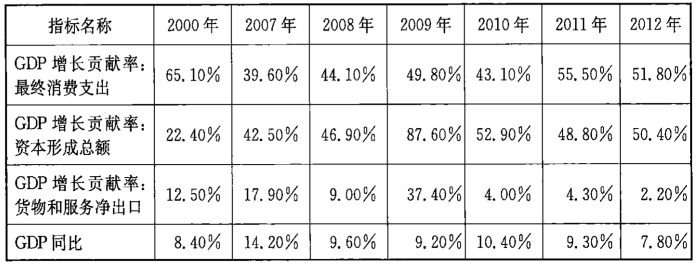

数据来源：Wind资讯

注：此表部分内容经译者增补。

这种金融模式已经支撑中国走过了数十载春秋，在金融资源极不平衡的
形势之下，它仍然帮助相当一部分中国人从贫困中摆脱出来，并逐渐开始了新
时期的发展战略，这究竟是如何做到的呢？很多人看到中国的外汇储备，都相
信中国现在是十分富裕的。但事实上这是一个错误的看法。当人民银行收购
这些外汇储备的时候，它就已经在国内创造了人民币资产。在这种情形之下，
这些外汇储备在中国境内使用的时候，又怎能不造成更大的货币压力呢？3.2
万亿美元该怎么花？现在这些巨额外汇储备全部都以低收益的债券资产为
主，并且注定了会逐渐贬值。事实上，一直有人质疑中国央行将如何管理自己
的账户，当美元贬值、人民币升值的时候，市场损失将会很大。

但是中国外汇管理局，作为中国人民银行的一个部门，似乎并没有重视
这个问题。外管局认为，美元兑人民币汇率的变动改变了外汇储备以人民
币计价的价值，但是这并没有从实质上影响到外汇储备的海外购买力[^3-15]。事
实上这只是在国内的宣传手段而已。中国外管局的意思是，中国外汇储备
的美元价值，这个“数字”实际上并没有损失，100万美元仍然是100万美元。
当中国的本币升值的同时，整个资产并没有损失。但是货币资产价值是相
对的，不是绝对的。美元的价值在过去几年里的确在不断下降。这意味着
在过去的几年里，美元价值相对一篮子货币，包括人民币的价值都在下降。
因此现在用1美元能够买到的东西比以前要少的多了。如此说来，境外真实
购买力的确下降了。但是，如果央行承认了这一点，那么它们将要受到关于
其如何管理资产负债表及其资产负债表本身质量的质疑。

[^3-15]: 参见彭博资讯，《中国释放出更多的人民币升值信号》，2011年7月20日。

在当前制度的框架之下，想要让中国中央政府国际化地使用其外汇储
备还十分困难。国内大量的垄断机构缺乏相应的管理经验，这将不利于对
资本的管理。更重要的是，更多实质上的“自由化”将会影响到这个体制的
核心，影响到国家的现实利益。所以，中国政府缺乏这方面改革的动力也是
可以理解的。

## 中国最新的银行经营模式

按照陈元的想法，中国不应该照搬照抄美国的东西，应该建立有中国特
色的银行体系。经过多年来的修修补补，整个陈旧的金融体系被这些资产
管理公司重新组装了起来。在最后清理中国农业银行的不良贷款和2009年
的信贷激增之前，国务院和四大商业银行已经针对资产管理公司的命运展
开了激烈的讨论。曾经有一位资产管理公司的高级管理者曾对尚未发生但
即将发生的事情做出了如下描述：[^3-16]

    “第一次政策性不良资产处置中的损失是由国家承担（约1120亿
    美元）；第二次剥离的商业化收购的盈亏（约640亿美元）是资产管理公
    司以自己的经营利润归还央行再贷款来承担。如果定价不准，意味着
    最后再贷款的损失将用资本金去弥补。最有可能的结果，就是资产管
    理公司和国家扯皮。"

[^3-16]:《资产管理公司转型歧路》，《财经》2008年第10期。

这位资产管理公司的官员清楚地知道，如果资产管理公司采取减记，他
们会破产，迫使财政部向中国人民银行偿付未经偿还的债券和贷款。如果
财政部不这么做，那么中国的银行将蒙受损失，而他们本身的资本金是无法
承担这么多损失的。

但是2008年9月雷曼兄弟（Lehman Brothers）的倒闭，使整个情况发生
了转变。当整个国际金融体系已经在崩塌的边缘摇摇欲坠的时候，中国政
府仿佛才恍然大悟，它眼前的面纱被一下子掀开了。至少从1994年开始，当
然更确切的是1998年以来，中国银行业的改革和监管所依据的是美国的金
融经验。花旗银行，摩根士丹利，高盛和美国银行被视为金融实践和智慧的
缩影。这些曾经引导着中国银行业发展的具有先进经营模式和监管制度的
美国模式，在一场金融危机到来之时变得名誉扫地。但此时也没有任何其
他模式可以取代它的位置。这时中国的银行突然没有了任何限制，它们不
仅开始了所谓的信贷盛宴，还试图拿到更多新的金融许可证。就像一位资
深的银行家曾经说过：“没有人知道新的银行模式会是什么样子的，所以在
此期间，我们最好能够抓住所有能够拿到的牌照。”对于资产管理公司来说，
它们可以很容易拿到更多的经营许可证，但是它们是怎么拿到的呢？

除了从商业银行那里接手不良贷款之外，资产管理公司持有破产券商、
租赁公司、财务公司、保险公司以及商品经纪人的相关债务。世界对于五年
前中国这部分金融体系的崩溃并无所知。在很多情况下，资产管理公司主
要负责资产重组，将债权重组变为股权，再将其出售给第三方，包括外资银
行和企业。如果价格商谈成功，那么打包销售的收入将可能足够用来全额
偿付债务。但在绝大多数情况下，这些僵尸公司从来没有被卖出过，但他们
也没有被关闭。最终，他们摇身一变，聘用新的员工，成为了资产管理公司
的子公司。例如，东方资产管理公司，自豪地拥有着11家成员单位，业务涵
盖证券公司、资产评估、金融租赁、信用评级、酒店管理、资产管理、私募股权
投资和房地产开发等多个领域。信达作为最大也是最激进的资产管理公
司，有12家成员单位（汇达可以当做第13家），包括证券、保险、信托和基金
管理公司等（见图3一11）。通过收购母公司资产管理公司，中国的银行将可
以一举持有全套牌照，表面上使他们身全能银行的行列。

当然，资产管理公司一直为此而怂恿商业银行，因为它们不想被关闭。
其实还有一部分“平凡”的意味在里面，因为资产管理公司一直被银行看作
将不必要的人员剥离出来的一个安置点。双方都开始以剥离不良资产为目
标，与政府开始博弈。到2009年年中出现了传言，中国工商银行和中国建设
银行均向国务院提出了约合20亿美元的具体投资计划，试图收购关联资产
管理公司49%的股份。这种想法是惊人的：是收购什么实体的49%的股
份？但稍后这些就不是传言了。2009年《财经》杂志报道，国务院已经批准
了中国建设银行针对信达资产管理公司49%股份的收购申请。交易额约为
237亿元人民币，约合35亿美元。这部分股份一直由财政部持有[^3-17]。据报
道，信达的总注册资本包括财政部原来的人民币10亿元，总计人民币33.7
亿元。这是难以置信的，因为这就意味着信达在过往十年的经营中没有一
分钱的损失，无论是经营或是信贷方面。这简直是不可能的，即使信达是四
家资产管理公司中经营最好的一家。或者，也许是无数的新增附属公司的
经营收入抵消了这种损失。谁知道呢？

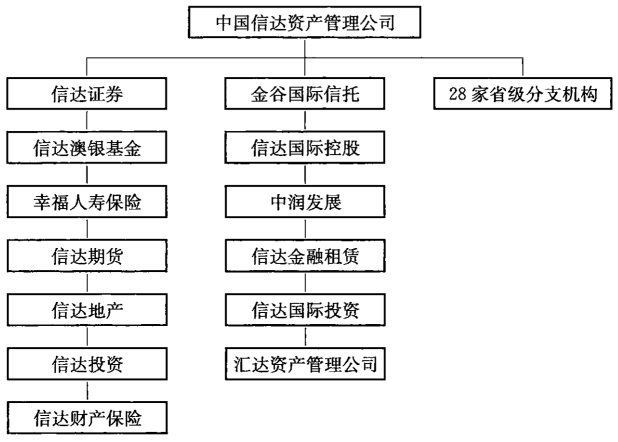

资料来源：基于信达资产管理公司网站进行整理

[^3-17]: 财经网网站：www.caijing.com.cn/2009-09-23/110258742.html。

即使信达没有破产，人们对于信达资产的估值报告也表示十分惊讶。
除此之外还有更多的别的安排。就在同一天，信达提出了另一项交易，财政
部宣布将信达向建行的价值2470亿人民币的债务再延长十年。毫无疑问，
这个举动代表着延长其他三家资产管理公司生命的第一步[^3-18]。

最后，信达公司可能无法以其建议的形式完成这项交易。然而，到了
2010年年中，一个新的结构已经为信达准备好了。经国务院批准，由财政部
独家发起，中国信达资产管理公司整体变更为中国信达资产管理股份有限
公司。中国信达资产管理股份有限公司于2010年6月29日在北京成立。
其毫无价值的资产，包括它欠人民银行的贷款，现在被拆分到了越来越多的
无处不在的“共同管理账户”，被更多的财政部欠条所取代。这样使得信达
成为了一家拥有各种金融许可证的公司，并开始寻找战略投资者，而中国建
设银行则有望成为其中之一。从这一笔笔不断循环滚动的债务来看，中国
的中央政府，特别是财政部，虽然拥有着梦幻般的财富，但似乎缺乏勇气和
智慧来完成那始于1998年的银行体系改革。

[^3-18]: 东方资产公司所欠中国银行的债务在2010年被展期，与此同时中国工商银行所持有华融公司债务在2010年被展期。

## 资产管理公司的估值

资产管理公司自身的能力并不能使其更好地完成应尽的职责，于是这
些公司在自己的网站上或者利用媒体宣传等手段努力地维护自己的形象。
当然不仅是他们自身的形象受到来自各方面的质疑，他们自己本身不透明
的财务状况也受到了各方面对于其管理资产的价值的猜想，有些猜想甚至
十分夸张。在这些资产管理公司成立后的十年里，他们仿佛已经企及了一
个梦幻般的世界，这里的资金是零成本的，并且其数量可以远远超过整个经
济上或者国家层面的度量范围。

每一个资产管理公司的网站上都公布有其工作的相关新闻和数据。但
是没有一家公司会公布甚至最粗略的资产负债表或者收入报表。比如，华
融公司公布了长达96页的报表，留给读者的并不是答案却是更多的疑问。
华融资产声称，自己通过将53亿元人民币的收入商业化，实现了20亿元人
民币的利润。这就意味着，33亿元人民币的成本包括其对工商银行和人民
银行债券的利息支付，但这似乎不可能，因为如果是这样的话，那数字也太
小了。华融同时声称国有资本融资159%。华融初始资本仅有100亿元人
民币，但却支持其购买了名义价值7200亿元人民币的坏账，并且同时还要
支付利息。在这种情况下，公司能够完成盈利，那么华融一定是全球管理不
良资产最好的公司。华融公开的这些信息究竟应该如何解释呢？正如当时
中国建设银行的领导理解的那样，尽管中国建设银行已经表现出对于投资
信达资产管理公司的兴趣，但是信达的价值将如何评估，是一件十分困难的
事情。[^3-19]

[^3-19]:《经济观察报》，2010年6月12日。

如果我们仔细研究一下现有的资料，那么或许可以给予我们一些信息。
这些资产管理公司所持有的上市公司信息将为我们提供一些事实依据。但
是持股的清单似乎并不详细，总的来说看上去还算乐观。信达、华融、东方
和长城在2011年中期，其持有的85家上市公司股票的合计价值为69亿美
元，其中有40亿美元的价值都集中在六只股票上面（见表3－9）。这个清单
并不是最全面的，因为这些资产管理公司肯定会卖出一些持仓用来归还其
负债的利息。毋庸置疑的是，在牛市时，资产管理公司是活跃的交易者。即
便这样，这些投资也难以标明其实际上所保有的巨大财富。

表3-9资产管理公司持股选摘，2011年7月31日        单位：百万美元

交易代码             控  股                资产管理公司      价值评估
---------    -------------------------   -------------   ---------
601600       中国铝业公司                 信达                 1288
600657       信达地产                     信达                  776
601989       中国船舶重工集团公司          华融、东方            614
601268       中国第二重型机械集团公司      信达、华融            519
002430       杭州制氧机集团有限公司        华融                  428
601398       工商银行                     华融                  317
                                          合计                 3942

数据来源：彭博资讯，Wind资讯

在其持有的85家上市公司中,有约15%都被监管机构视作 ST股票。
这些被冠以ST的股票不是亏损企业，就是在财务方面有一定问题。但这意
味着这些失败的公司成为了资产管理公司的受托人。这些公司看上去并没
有什么市场价值。最著名的两个例子就是德隆系和中国新技术创业投资公
司。这两家中国著名的机构在过去20年里轰然倒塌。

在名单中我们看到了诸如中国船舶重工和工商银行这样的大公司，就
像我们将要在第七章详细介绍的那样，中国政府在这些企业IPO的过程中
无疑主动邀请了资产管理公司来参与。而在IPO之后，资产管理公司可以
在二级市场抛售股票获得收益，来支付利息。这就是中国体制内的运转方
式。没有中国政府对于其投资的支持，这些资产管理公司哪里来的资金？
这些投资中没有一项是源于其对于原有不良资产组合的运作，当然上述清
单中的中国第二重型机械集团公司和杭州制氧机集团有限公司也不是。

一个普遍的看法是，资产管理公司坐拥着价值连城的资产。当然由于
没有相关的细节，我们很难对这种看法提出质疑。从直接财产运营的角度
来看，只有信达地产才能视作资产管理公司用自有资本进行运营。这家公
司拥有大量A级资产的可能性并不大。但是从争论的角度来看，如果这些
资产的确存在，那么其价值又会是多少呢？当然，这些资产管理公司，包括
信达都拥有着以房地产进行抵押的巨额坏账组合。但是到2005年，这些不
良资产组合已经被逐渐运营完了，而最好的资产也被以20%的折扣卖给了
第三方。而现在，六年后，这些不良资产组合任何价值提升的受益者将是那
些早期的购买者而不是资产管理公司。这些资产管理公司现在只能持有那
些最没有价值的资产。

资产管理公司的角色还要再持续十年。它们在今后会逐渐开始担负起
重组地方政府债务和其他坏账的责任。在未来，或许这些资产管理公司会
发行股票，但只有当财政部支持它们的时候，它们才会这样做。就像当初财
政部支持了信达资产，为其不良资产建立特别管理账户，帮助其进行再融资
一样。

## 意义与影响

一个经常被人们提到的问题是，中央政府对于失败的金融交易的管理
机制是没有问题的吗？中国毕竟有资金实力来吸收这种规模的损失，如果
它确定要这样做的话。所以这个问题的答案必须是肯定的。每一天，新闻
媒体都报道着中国的“国家队”和新的主权财富基金在国际市场上寻找投资
机会的故事。人民币国际化已成为头条新闻，中国人民币试图挑战美元作
为国际贸易货币的主导地位，也许有一天，人民币也会成为国际储备货币。
但很少听到中国银行业的动作，为什么呢？

在2008年，西方的金融局势一片动荡，全世界都在赞赏着中国的经济刺
激计划，美林证券和摩根士丹利也都在唱着赞歌。在那时中国的银行又在
什么地方呢？在南非的小收购以及收购加利福尼亚州的一个社区银行就是
我们这些中国金融巨头所干的杰作了。可以想象，如果中国工商银行在那
段华尔街的黑暗时期向美国财政部提出现金收购花旗集团、美联银行、华盛
顿互惠银行、美林证券的时候，美国政府会是一副什么窘迫反应。对于中国
来说，这整个购物篮里都是便宜货。但是机会稍纵即逝，这样的机会不会再
出现第二次了。与此相反，中国的企业客户、中国国家开发银行、中国的主
权财富基金一直在积极寻求国际投资，为什么不找中国的银行昵？

换句话说：如果中国银行业的市场估值是真实的，而银行的规模已经如
此之巨大，为什么中国的银行业务模式不能出口呢？由于美国和欧洲的监
管机构和政府寻找办法，以防止下一次金融危机，为什么中国的金融模式，
即资产管理公司和国家所有权的模式，没有被欧美国家所引用呢？有人预
测，如果中国试图在不久的将来取代美国成为全球经济的中心，那么人们所
期望中国能够输出的不仅仅是资本，也有知识产权。但我们似乎看不出有
这些迹象，更不要说什么期望了。

在过去十年里的故事表明，中国的银行，尽管他们进入了“财富500强”
排名，但是并不具有国际竞争力。他们的经营方式让人看来，似乎他们并不
十分了解发达经济体的银行系统。中国的银行生长在与外界隔离的体制内
部，经营完全依赖于政府的指导和支持。就连中国各大商业银行的CEO们
都需要党中央的组织部来任命，除了长期坚持努力改革银行的公司治理机
制之外，有谁会相信一家中国的银行董事长能够更多的代表股东利益，而不
是中央政府的利益？中国的银行规模之大是无可否认的，但它们既没有创
造性，也没有创新性。它们的市值并不代表其潜在的价值创造的估值方法，
而是巧妙地操纵的结果。2010年，当一家又一家的中国银行陆续公布数十
亿美元的资本融资计划时，人们不禁要问，它们在短短三四年前刚刚募集的
巨额资金到底去哪儿了？中国的银行有着很强的盈利能力，但是并没有很
快的资本增长速度。我们还没有考虑到它们所持有的资产管理公司债权的
市场价值以及其在国内债券市场上巨大的风险敞口。事实是，它们现在，即
便是在刚刚IPO之后，所拥有的资本金也不够抵御其资产负债表上的风险，
但这似乎能够用来解释其ROE(股本回报率)为什么会那么好。

中国的银行在国家经济中的角色也十分被动。正如有人指出的那样，
中国的银行经营理念十分传统，它们仍然被看作一种公共事业。毫无疑问，
在2010年，他们再次成为了巨大的存贷款机构，按照中央政府的指示发放贷
款。不管在过去的十年间，银行的董事长或是高级管理层对银行的经营有
多大的作用，从2009年开始，他们的影响力都逐渐减弱，就像当年备受推崇
的银行业监管机构一样。如果说银行才刚刚开始学着去测量和评估风险，
那么它们就已经开始迅速地把这些遗忘了。

有种观点说，由于中国的银行主要信贷客户都是中国的国有企业，因此
它们就没有必要去学习所谓美国的那一套东西。这种观点明显似是而非，
因为国有企业通常都会拖欠贷款。而中国的银行高管们心里清楚，那些国
有企业是否会按期还款其实并不重要。对于中国的银行家们而言，听从党
的号令才是最重要的。事实上，中国的资本分配过程是由中央政府来运作
管理的，而不是市场。

在公众监督缺失的情况下，很少有人会质疑银行的资产负债表和其收
益的质量。国际股票市场及其大部分的年轻金融分析师们都持有一种观
点，那就是并不能把中国的银行当作一个个独立的机构来看待，它们实际上
是国家经济实力的代表，这使其拥有了相应的价值以及信誉。但问题是，它
们事实上只是体制内经济的代表。在这样一个经济体制下，当局可以按照
自己的意愿做出组织安排，一个典型的例子就是让银行反向收购未重组的
资产管理公司。一家大型美资银行的分析师曾公开支持过类似的想法：“这
些资产管理公司背后站着的是世界上规模最大的一些银行，这些银行对资
产管理公司的一些业务都很感兴趣。所以从商业的层面来看，这种情况（商
业银行持股资产管理公司）的发生就是情理之中的。其他主要机构的外国
分析师纷纷积极地回应了这种观点。

这种不假思索的评论对于中国确实没有帮助。但如果中国政府放松警
惕，认为四大银行其实是世界一流的，以鼓励他们拓展国际市场，这将是非
常危险的。随之而来，西方监管机构和媒体的审查有什么样的影响呢？我
们已经看到了媒体对于美国2008年次贷危机和资产证券化方面的关注，但
是没有一个人对此的看法是乐观的。我们应该记住的是，贝尔斯登（Bear
Stearns)和雷曼兄弟（Lehman Brothers），在一个周末就消失了。中国的政
治精英们肯定已经学到了这方面的经验教训，就像从其他国际金融危机学
到的一样。

在中国，对于政治的过分强调使得其难以出现国际化的大型银行。诚
然，中国的银行的确貌似国际化，它们公开上市，进行广告宣传并且开展消
费贷款业务。但是正如2009年我们看到的那样，这种看似国际化的改变实
际上是表面的：它们的商业模式改革已经变成了一个更加难以达到的目标。
这些银行将始终是受到中央政府严密保护和直接控制的国内机构。最近几
年国际上一些大银行的高官都曾表达要建立“堡垒一般的资产负债表”的观
点，以应对明显的经济压力。在中国，事实上也有一种建立类似“堡垒”的驱
动力，但这只是旨在将其银行体系封闭在国门之内，使其绝缘于外部国际上
的各种风险和变化，让整个银行体系在中央政府的控制之下运行。

2009年和2010年，中国的银行发放贷款超过20万亿元人民币（具体数
目是多少其实很少有人能够说清楚）。如果在未来的几年内，这些贷款没有
演变为不良资产，并且仍然以全部面值体现在银行的资产负债表上的话，那
么中国的银行体系将必定继续保持封闭的状态。另一方面，如果对于风险
的分类和管控仍旧依照国际标准进行，那么我们可以预见的是20世纪90年
代发生的事情可能重演。将会有巨额的贷款到期无法偿付，而银行也会需
要更多的资本需求进行资产重组。目前，贷款和高派息已经超出了银行的
资本充足率，这迫使银行需要更多的资金，而这些资金主要来自国家本身。
但是具有讽刺意味的是，对资金的需求也是可以得到缓解的，比如通过降低
贷款资产，确保资产管理公司将继续发挥核心作用等方法。

在过去的几年中，中国的银行纷纷进入消费业务：信用卡和借记卡，汽
车贷款和抵押贷款在本国广大的沿海地区已十分常见。从2008年开始，出
口的崩溃揭示了中国的出口依赖型经济模式的巨大弱点，来自各方面的专
家呼吁政府制定一个类似美国的刺激国内的消费模式（又是美国的模式！）。
而推动这项议题的另一种力量，是中国的老龄化问题。如果政府决心将出
口外向型经济转变为消费拉动型经济，那么这就意味着中国的国内储蓄率
会下降，例如家庭存款。那么这样一来银行会发生什么情况呢？中国庞大
的金融体系能够有今天，几乎完全依赖于英勇的中国人民而造就的高储蓄
率，他们是唯一的非国有资金来源。人民银行和资产管理公司的模式之所
以现在仍然能够奏效，是因为中国的储蓄偏好，以及流动性的活跃。如果中
国人开始像美国那样，对借贷和消费充满热情的话，会对中国的银行资本产
生什么样的影响呢？从这个角度来看，产生丰富的新型投资和消费信贷产
品似乎不太可能。同样，将充分的资金投入到社会保障中去，这样的改革似
乎还不会到来。

最后，有外资银行的存在。外资银行对于中国加人WTO一直表现得特
别活跃,并且一直希望中国能够开放国内市场，使其进入中国。中国基本上
遵守了协议，在过去的八年中，外资银行纷纷斥巨资开发网络和新的银行产
品。对于一个主要侧重于国内消费者的金融服务群体来说，这些美国和欧
洲的主要银行的分行网络和品牌广告在中国的主要城市和媒体中也变得越
来越普遍。外资银行在当地货币的风险管理产品这块市场发展得也很快。
这些银行明白，中国的金融体系正处在转型的时期。它们都坚定地期
望，在不太遥远的未来，中国的市场将被完全打开。这是在2008年之前普遍
持有的观点。但是，从中国中央政府给这次全球金融危机所下的结论看来，
想让中国继续按照原来西方式的金融模式继续改革下去似乎已经不太可
能。但是除了维持现状以外，也没有其他的金融模式，而这就是现在事态的
发展方向。那么，外资银行在中国的未来将会怎样呢？

总之，中国的银行业长期在中央政府为其创造的柔软且舒适的保护革
中运行着，长期为其创造着可观的财富与价值。正如中国2008年奥运会和
国庆60周年大阅兵一样，对于管理运作这些象征着经济改革和现代化建设
的重大活动与工程，中国的中央政府一直十分在行。然而，具有讽刺意味的
是，如果1997年的亚洲金融危机让中国领导人看到了金融体系改革的迫切
需要，那么 2008年的全球金融危机则产生了相反的作用。他们提出的基于
大规模银行信贷支持的经济刺激计划可能会冲走过去10多年改革的良好成
果。更具有讽刺意味的是，当“好银行”被削弱的时候，原先以改革为目的而
建立起来的“坏银行”则被加强了，这或许是为了未来下一次的改革而做准
备。运行于新兴经济市场中的机构总是对改革浅尝辄止，而市场总会被政
治需求所绑架。中国经济新一轮改革可能取决于下一次金融危机什么时候
发生，或是当局者真正明白，经济表象并不能代表经济深层的真实现状，中
国的经济改革需求还远未得到满足。

