# 第四章 受管制的中国债券市场

    “与我国发展较快的其他金融工具相比，尤其是在我国储
    蓄率较高、广义货币（M2）占GDP比例较大的背景下，我国公
    司债发展较慢，使其在国民经济中发挥的作用确实相当有限。
    同时，公司债市场发展滞后，还使我国金融市场融资结构很不
    合理，整个金融体系隐含了相当大的风险，很可能给社会经济
    发展带来比较严重的后果。”
      
                        一一周小川2005年10月20日
                        在中国债券市场发展高峰会上的讲话

发达国家的债券市场诞生的背景是，当公司或者其他资金短缺的实体
想获得成本较为低廉的融资方式的时候，发现作为传统渠道的银行却不愿
意或者没有能力为之提供如此廉价的资本。同时，这些实体也发现，在市场
中并不是只有银行才有能力对自己的风险进行解释和评估，其他规模较大
的机构投资者，如保险公司、养老基金等，也具备独立判断投资风险的能力。
那么问题就来了：如果有资金需求的一方可以从其他投资者（资金提供方）
那里获得更廉价的融资的话，为什么非要依赖银行呢？为什么他们不利用
这些和银行在资本供给地位上存在潜在竞争关系的“其他投资者”，来迫使
银行降低贷款的成本呢？而且，从中国过去数年的发展历程来看，融资渠道
的多样化的确已经是进行时。首先，中国的债券在发行数量上创下纪录；其
次，债券发行已经进入标准化和规范化操作的时代；再次，中国在资金供给
方面已经开始允许一定程度的外资参与。那么，基于这些事实，我们是不是
就可以说，在不远的将来，这些非银行的投资者们能够形成和银行竞争的局
面，为存在资金需求的一方提供他们所需要的资金，同时也可以大大降低银
行体系目前所承担的大量的信贷和市场风险呢？我们不要忘记，后者也是
人民银行金融改革所希望达到的众多目标中的一个。

在中国，对问题的认识不能停留在表面，如果仅仅因为一个词在其他国
家表示某种含义，就认为这个词在中国也表示同样的含义是行不通的。在
中国，缔造债券市场和主张银行改革的是同一群人。2005年，在银行间政府
债券市场濒临绝境的时候，他们为了减少银行体系高度集中的风险，开始在
银行间市场引入参照国际市场规则所设计的公司金融产品。表面上，他们
的努力取得了一定成效。但事实上，尽管发行数量大大增加，市场参与者的
数目也达到相当大的规模，市场上的产品种类也层出不穷，市场参与者却不
得不承认，中国的债券市场仍然停留在比较原始的阶段，这个观点，也可以
从前面引述的周小川的那段话得到验证。所谓中国的债券市场受管制，一
方面是指利率结构受管制，另一方面是指债券市场的投资者基本上局限于
各大银行。想要理解为何当时的债券市场濒临绝境，我们需要寻求一些技
术层面的诠释。但是，要想理解政府是如何管理中国金融体系的，关键要认
识清楚市场是如何被控制的：虽然有了现代资本市场的形式，其真实内涵却
并不具备。

通常，“原始”这个词是指缺乏必要的市场“基础设施”，但是中国并不缺
乏这些“基础设施”。这些“基础设施”当初之所以能够建立，是因为债券市
场被视作经济现代化的一个必不可少的标志，就好像代表经济现代化的其
他标志那样，比如：高速公路、新机场航站楼，或者坐落在北京的极具现代风
格的中央电视台办公大楼等。这些债券市场的“基础设施”包括了：五个信
用评级机构、不少于七个的监管机构、两个以上的行业协会。这些机构之间
虽然存在权力的重合，但是相互之间并没有太多的协调沟通。在较为发达
的资本市场上能够看到的金融产品，很多也可以在中国市场上看到，包括政
府债券，商业票据，中期票据，公司债券，银行从属债和直接负债，还有一些
资产抵押证券等等。这些金融产品的交易方式大致包括了出售套现，回购
协议[^4-1]中用作抵押或者远期出售等，其包含的利率风险可以通过利率掉期得
到规避。这些也都是西方市场常见的交易方式。

中国债券市场还停留在“原始”阶段，指的并非交易方式的问题，而是指
中国债券市场缺乏其他主要国际资本市场拥有的必要的市场要素。这个市
场要素就是由市场对风险进行衡量，并且将评估出的风险量化融入资产价
格计算的能力。从市场的角度来说，风险就意味着价格；资本和其他东西一
样，都存在相应的价格。然而，在中国，只有政府领导者而不是市场力量通
过收益曲线来确定无风险融资成本[^4-2]究竟为几何，而政府决定的依据是基于
银行融资的成本，也就是一年期银行存款的利率，这显然是有别于基于市场
的收益曲线的决策依据的。最后，在公司债发行的初级市场上，承销费用和
债券价格也往往以银行贷款为参照，而非市场真正的需求。正由于此，发行
企业在新发行债券时因为发行价被人为压低[^4-3]所造成的损失，需要通过市场
以外的其他手段来进行额外弥补，比如获准进行一定量的外汇交易。换句
话说，债券价格的设定机制还掺杂了债券市场以外的其他因素，承销商也往
往在获得债券后并不将其出售给其他投资者而是一直持有到债券到期日。
为什么会这样呢？因为二级市场和初级市场有异，其不同之处在于二级市
场中，资产定价是根据投资者的市场需求来确定的，如果承销商将在初级市
场以被人为压低了价格购入的债券在二级市场出售，很有可能会出现亏损。
正因为这个原因，每天在债券市场上交易的中国国债和其他类型的债券最
多也不会过百。如果承销商坚持要出售债券，那么他们在出售价格上反而
必须要贴补买方差价才可以使交易成功。交易如此不活跃，市场定价自然
也不会客观准确，因此这个差价也可以被看成是“流动性溢价”。

[^4-1]: 回购，或者叫重新持有协议，是一种融资手段。交易的一方拥有证券，通常情况下是政府
债券，然后将其作为抵押，抵押给另外一方以借得资金。对于一个庞大的债券投资组合来说，通过这样的融资方式来获得投资需要的资金是一种低成本的融资方式。

[^4-2]: 无风险融资成本通常是所在国家所发行国债的利率，这里所说的无风险其实是指的无信用风险，因为国家的信用通常因为其货币发行的能力和相对稳定和安全的财政税收支持而高于其国内的其他企业或者实体。国债仍然带有市场风险，比如受利率浮动而导致的资产价格的变化。——译者注

[^4-3]: 这里所说的发行价是指债券的发行利率，债券的价格通常和利率成反比，即利率越高，债券价格越低。在中国债券市场，因为参照银行贷款利率，债券在初级市场的发行利率被设置过低（因为对风险的评估过低），因此初级市场的债券价格则过高，而二级市场因为依据市场需求，对风险的评估相对高，就导致二级市场的债券价格反而低一些，这样一来就造成了承销商不愿意在二级市场出售债券了。——译者注

另外，在解释中国债券市场的问题时，也有一些其他的历史背景需要了
解。中国的传统体制是政府拥有一切，财产私有向来是禁止的。因此，债券
市场可能在当初被寄予厚望，能够成为最发达的融资市场。毕竟债券和股
票不同，并不直接触及敏感的所有制问题。可是，任何人都可以发现，在中
国，从寻常百姓到省部级官员到党的高级领导层都不约而同地对股市更加
情有独钟。这个现象从1980年代早期股票的概念被众人所熟悉开始就一直
存在至今，也正是这个现象让很多观察家认为中国其实是在走发达经济体
过去的老路。

为什么他们对债券提不起兴趣呢？原因很简单：政府和央企的这些领
导们认为股票市场为央企提供了大量的“免费”资本，这里“免费”指的是通
过股票筹集的资本是不用偿还的。相比之下，债券的本金类似贷款，必须在
指定的某个时间归还，并且这一点在过去显得并不那么“有利”。股票市场
更有利的一点是，通过上市，这些央企获得了“现代”企业的一个表面形象
（更不用提海外上市后高管薪水待遇的水涨船高），而举债则无法带来这样
的好处。只能说，股票具有更伟大的象征意义。发行股票改变了整个游戏
的规则，而发行更多的债务则仅仅是满足业务层面的需要而已。任何一家
金融媒体都不会因为一家中国企业的首席执行官因为向银行成功借得贷款
而为之歌功颂德。

中国“美轮美免”的市场“基础设施”的确必要，但是还不足以使债券市
场脱离“原始”阶段。由于价格的人为操纵，对于发行债务的公司说，选择
哪种形式的债务并没有太大差别，债券和贷款对公司来说其实是一回事。
更重要的是，债券市场对承销商和投资者来说也没有什么差别，因为别指望
从两者都赚到钱。这一章会解释为什么如此。沿袭苏联计划经济体制下的
原则，利率并不反映市场中的资金供需，债券的定价也因此并不反映真实市
场的价格。这也正是“体制”所中意的，领导人认为他们在衡量风险和定价
的问题上要比任何市场更有效。2008年国际金融体系的几近崩溃的事实更
是坚定了他们的这一信念。

那么在这样一个对风险定价缺乏充分理解的债券市场中，到底债券市
场所获得的“发展”是指的什么？风险的内涵之一就是变化（的不确定性）。
但是中国的债券市场在建立伊始，无论是发行企业的本身质素的变化或者
发达市场所理解的市场供需互动,都被赋予“不变”的基调。因此，上面引用
周小川的那段在公众场合发表的略显罕见的讲话体现了，在高级官员中至
少还是有一些人意识到了风险被掩盖后所带来的潜在系统性危机。就其个
人经验来说，他对债券市场滞后给社会经济发展可能带来的后果的判断一
点也不让人吃惊。如果这些判断都是正确的，即市场的确存在潜在的危险，
那么为什么中国还需要债券市场，或者说，为什么需要当前这样一个“原始”
状态的债券市场呢？

## 中国为什么需要债券市场？

当你了解了这样一个事实，即中国70%的债券都被银行持有，那么为什
么提出这个问题的重要性就不言而喻了。对于以朱镕基和周小川为代表的
市场改革派来说，1998年开始的银行改革中就包含了债券市场的发展这一
内容。一个良好的债券市场的存在可以促使其他非银行机构持有公司债
券，而不是仅仅由银行持有，这对于分散银行系统的风险是有益的。可是如
果那些没有国家背景的投资者不能够全心全意参与债券市场的话，风险还
是得不到分散。事实上，在过去的30年间，国家财政预算需要资金的支持，
而国家税收能力却又相对薄弱的现状使得中国债券市场已经获得了长足的
发展。公司投资者尚可依赖银行贷款这个途径，可一个国家的财政部，至少
按照目前世界各国财政的运营模式，却无法照搬。试想，如果一国的财政部
长连政府债券都发行不了，他还可以叫财政部长么？如果这个国家没有政
府债券，就不会有基于政府债券利率的收益率曲线，也就无法为其他证券提
供风险衡量的基础，那么这还算是经济现代化吗？20世纪80年代初，财政
部对资金的需求促成了这个狭小市场的诞生，20年以后，到了改革派试图进
一步扩大这个市场的时候了。

20世纪80年代初，中国国内还没有任何形式的证券市场。距离最近的
上一次债券发行要追溯到1959年，而关于那次债券发行的细节在经历了“文
革”之后早就被人遗忘了。但是1980年代初雄心勃勃的国家预算里开始首
次出现小规模的赤字（见图4－1）。针对如何应付出现的财政赤字，财政部
里有人非常大胆地提出发行债券的想法。可是问题也随之而来：谁来买这
些债券，以什么价格来购买？刚开始的时候，只有国有企业才有资金来购买
（当然，这些资金也都是来自银行贷款），因此很自然的，这些企业有政治义
务来购买政府债券，帮助承担政府的预算任务。至于债券购买价格，债券的
利率设定在人民银行设置的一年期银行存款利率基础之上加一个小的差
额。如表4-1所示，个人投资者比国有企业获得更高的利率回报，这一现象
不仅体现了财政部当时有从国有企业以外的第三方手中获得资金的需要，
也体现了个人投资者对收益的要求。这是当时真实市场的写照，财政部还
没有找到可以降低其融资成本的方法。此时，债券交易的二级市场尚未存
在。国有企业作为债券投资者，被严禁出售债券，因为这关乎财政部的面子
问题：出售政府债券就等于让公众对政府的信用失去信心。

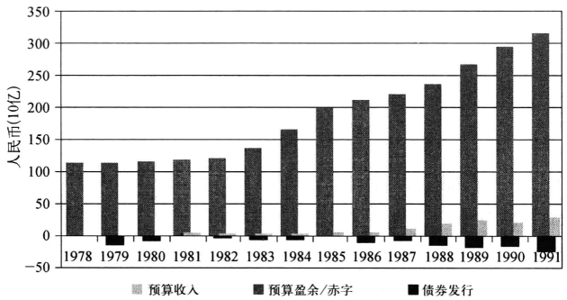

资料来源：《中国统计年鉴》

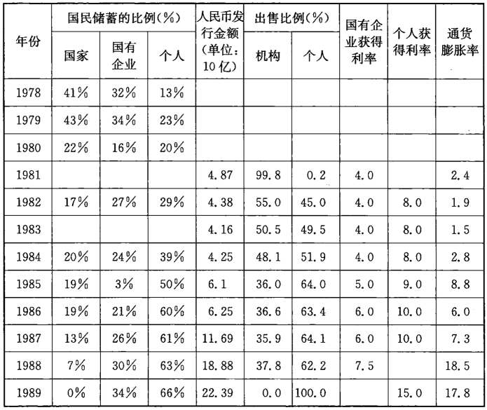

注：所有的债券利息来自到期时间为5年及5年以上的债券。

资料来源：《中国统计年鉴》，高坚：《中国国债》，第47一49页。

随着贯穿整个80年代的农业改革和城市小企业的蓬勃发展，社会财富
也急剧增加。到1988年为止，近2/3的政府债券被直接出售给了普通家庭中
的个人投资者。从1987年开始，市场形势开始发生变化，通货膨胀上升到很
高的水平，银行也被勒令停止发放贷款。于是，国有企业和个人都开始捉襟
见肘，同时发现他们手中的政府债券也变成了负收益，在这种情况下，国有
企业和个人投资者意识到他们可以将手中的政府债券以较低的折扣价格出售
给一些“投机者”。突然间，一个完全没有任何政府监管的“柜台上交易”[^4-4]债券
的二级市场突然出现在人们的视野中，也就在这个时候，大众对股票的狂热追
捧也在1989年和1990年到达了顶点。这也是中国第一个（迄今为止也是唯一
的)股票和债券的真正市场，可是他们很快就被关闭了。

[^4-4]: 柜台上交易市场英文为OVER THE COUNTER,简单来说就是场外交易，是相对于在证券交易所内进行的交易来说的,其最主要的优势是在交易成本要低于交易所。——译者注

1991年，中国的债券和股票市场也开始被置于监管之下，但是他们从空
间上被“安全”地限制在新成立的坐落于上海和深圳的交易所之内。这个新
的市场结构，表面上体现了市场改革者的胜利，实际上却是市场改革者不得
不做出妥协的结果，这个妥协的实质就是放弃市场的核心精神。这两个交
易所提供的交易场所都受到控制，能够让交易的价格和由谁来投资完全符
合政府的利益需要。到这个时候，财政部也意识到其融资成本的居高不下
其实也部分包含了投资者对其资金投资债券期间的低流动性的担忧。为了
扩大自身融资的需要，财政部从1990年代初开始在交易所里发展二级市场。
债券的定价问题依然存在，这个问题的解决一直要到1994年。这一年，
一个很偶然的机会让财政部发现了一个可以增加政府债券发行（见图4－2）
的可行方案，可以让承销结构和在人民银行利率框架内的市场化招标发行
相互配合。作为财政部发起这一创新的高坚，至今在谈起他当年是如何利
用红塔山香烟盒作为投标盒，完成了在承销商中举行的首次荷兰式国债拍
卖的经历[^4-5]还是饶有兴趣。带有幽默意味的是，这次的成功得益于某人的吸
烟习惯加上承销国债中分配公平的方式，大为减轻了财政部融资中的困难，
同时也为十年以后债券市场的发展打下了市场基础。

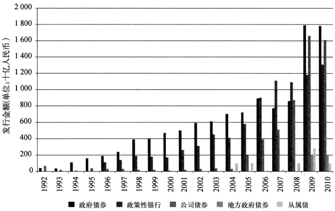

注：2007年政府债券数字不包含用于中投再资本化所发行的15万亿人民币的特殊国债。

资料来源：中国人民银行，《金融稳定报告》；《中国债券》

[^4-5]: 对于中国政府债券市场最为权威的描述，请参考高坚《中国债券资本市场》，新加坡：John Wiley & Sons出版社，2007年版。

## 风险管理

尽管有高坚创造性使用烟盒和随后的荷兰式拍卖的成功，从一开始，无
论是发行政府债券，还是发行公司债、银行债，其实都带有政治任务的色彩。
这可以从一个简单的事实看到，即市场交易仍然不存在。一个没有交易的
市场还能称为市场吗？缺乏流动性的原因是显而易见的：初级市场对债券
的定价并不反映实际的市场需求。尽管表面看来，发行量巨大，承销流程也
大大改善，发行人的信息披露也透明多了，甚至在某些方面允许外资参与的
开放程度都前所未有，但是与其说这是一个以市场价格获得新融资的市场，
不如说是“乔装”后的贷款市场而已。很能体现这个市场实质的一个事实
是，在参与初级市场的24家交易商中，只有两家不是银行[^4-6]。除了国家发改
委旗下的企业债[^4-7]是由证券公司来承销之外，其他的债券都由银行一手包办
了，这些债券包括了政府债券，人民银行发行的票据，政策性银行发行的债
券及从属债等。银行将承销获得的债券放在他们自己的投资账户里，直到
到期日，就好像贷款那样。因为初级市场被扭曲的价格体系，银行和证券公
司都没有形成如何对资本风险进行评估的能力。或者可以说，他们也没有
必要去了解，因为人民银行通过固定政府债券交易的市场价格以及固定更
为重要的一年期银行存款利率已经替他们完成了对风险的评估。

[^4-6]: 这个群体和财政部批准的可以开展国债发行的初级市场券商并不同。两家非银行的券商为中信证券和中国国际资本有限公司。2009年年底，一些已经获得许可可以开展金融债券发行的外资银行被告知条件还没有成熟”因此还不能开展业务。

[^4-7]: 书中特别提到企业债有别于通常意义下的公司债，凡是本书中提到的企业债都是指国家发展改革委员会所属央企所发行的债券。——译者注

## 人民银行打造的完美的收益曲线

想要了解为什么中国的债券市场并非真正的市场，就必须要了解债券
常识里的“收益曲线”是什么含义，如何在实际中得到运用。收益曲线体现
了相似债券由于到期期限不同所造成的不同利率，对于债券来说，利息成本
就是指债券投资者愿意为相应的风险所支付的价格。在所有的发达市场里，
由国家或者主权部门发行的债券的利率通常被用于决定发行其他债券的基
础。之所以采用国家发行的债券利率作为基础是因为这么一个基本观点，即
国家不会违约（显然这个假设值得商榷），因此这些债券在本国债券市场上代
表了“无信用风险”的标准。在中国，财政部担任着这个拥有最高信用评级的
国家发行者的角色，中国的评级机构给财政部的信用评级是高于AAA级的另
外单独的一级，高于以中石油为代表的公司所获得的AAA级。听上去，四个
A的级别要比三个A的级别响亮得多，有个中国评级机构就大胆地给了美国
财政部三个A的评级。图4－3展示了人民银行规定的不同企业债因为信用
级别和“财政部”级别之间的差别所分别对应的最小利率差。然而，这些曲线
所展示的却只是一个理想中的状况,现实里并不存在，这又是为什么呢？

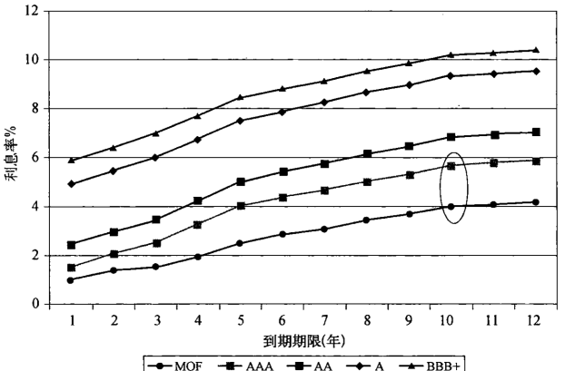[^4-8]

来源：《中国债券》2009年10月20日

和其他国际市场类似，这些曲线也是建立在财政部收益曲线的基础之
上的；比如，图中被画圈的就是千年期AAA级债券和财政部债券之间的最
小利率差[^4-9]。可问题是，在中国，人们并不使用财政部债券的收益曲线作为
参考标准，而是使用人民银行的贷款利率。之所以不使用财政部债券的收
益曲线，是因为其并不真实，这点我们后面会解释。图4一4展示了人民银行
规定的银行一年期贷款利率和存款利率。

[^4-8]: 图里最下方曲线的MOF就是财政部所代表的信用等级。——译者注

[^4-9]: 当然，如果这些承销商获得其发行人客户的允许，他们是可以把企业债的利息设置得高一些的。

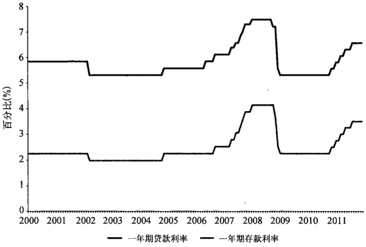[^4-10]

来源：《中国债券》

[^4-10]: 此处的图是由译者根据中国人民银行所公布的历年银行存贷款利率表（更新至2012年7月16日)所绘制的，在局部处有别于原作者的图，但是从形状和曲线拐点来说基本一致，也表达了原作者的意图：即说明固定的利率差。——译者注

[^4-11]: 从2004年1月开始，对贷款最高利率的限制被取消了，但是银行仍然要遵守最低利率的限制，这个最小利率应该按照人民银行根据相应到期时间设置的利率的90%。

规定的存款利率和最小贷款利率之间的利率差被人为地设置为3%，这
样一来确保了资金出借人至少3%的利润空间[^4-11]。当银行承销并购买债券的
时候，很自然的，将会把投资债券的潜在收益和发放相似的银行贷款作比
较。发行企业也会有类似的考量。承销购买决定中所参考的是银行贷款利
率的因素，而不是财政部债券的收益曲线。在实际操作中，由于财政部债券
利率往往不被作为定价的基础，导致企业和金融部门发行的债券在利率上
相对较低。这是因为银行可以从发行人那里获得其他的业务作为他们为之
支付的过高价格（此处指过低利率）的补偿。但是不管怎么样，他们都知道，
如前所述，财政部债券收益曲线只是虚构的。

## 由假想交易产生的假想曲线

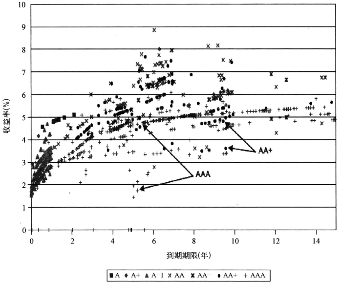

来源：Wind资讯，2009年12月7日；不包含财政部，国开行和金融债券

图4－5展示了2009年12月8日这一天公司债券的交易实际状况。这
些收益曲线看上去就像是用机关枪随意向墙面散射之后留下的弹坑形成的。
我们通过了解图中标识出的两个信用评级同为AAA，到期期限同为大约五年
的债券就可以了解这幅图所传递的信息了。这两个债券的交易价格极为迥
异，一个是95%的面值，一个是98%的面值。这并非个别现象，整个图里类似
的例子比比皆是。为什么这两个看上去极为相似的证券定价却如此不同？

必要的市场交易匮乏是导致这一奇怪现象的一个原因。举例来说，
2009年12月8日，整个中国的银行间公司债交易只发生了1550次，而这个
市场的成员总数却有9000多个，债券总值也达到1.3万亿元人民币（约合
1900亿美元）。相比之下，美国国债市场平均日交易次数就达到60万次，而
交易金额也达到了5650亿美元。如果没有市场参与者的积极参与，很难想
象如何来确定债券价格以及市值。

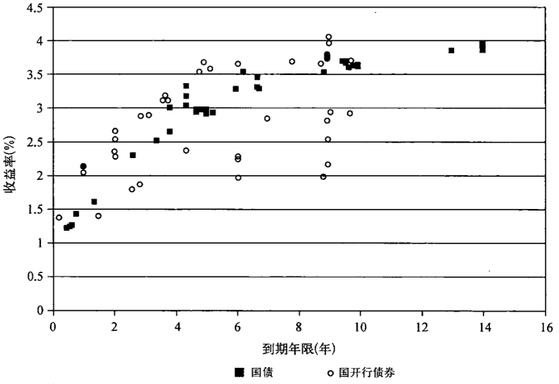

资料来源：Wind资讯，2009年12月8日

当我们把目光集中在财政部和国开行债券交易上的时候，中国债券市场
的特点就可以看得更加透彻（见图4－6）。2009年12月7日当天，财政部债券
被交易了52次，国开行债券被交易了108次。真正交易的次数更有可能仅有
一半，因为这些造市者根据规定必须确保交易次数，于是他们采取的对策是在
交易日的早晨将债券卖给另一交易方，然后到了下午再把债券买回来。由于
交易的次数实在太少，所体现的收益曲线也只能是主观的而非市场力量促成
的。在这样的情况下，别说是那些发行公司债的公司财务主管了，就算是我们
自己又何必把财政部债券的收益曲线作为对公司债定价的基础呢？

## 固化收益曲线

图4－3中的数据对中国国债（财政部）收益曲线的基本属性提出了质
疑。而中国则采用了金融业内所称的“每日价格固定”的手段来稳定其债券
价格。这也意味着由官方进行对包括外汇、证券在内的交易性金融产品的
价格设定。通常，价格的出台主要是由央行或者市场监管者与几个主要的
市场参与者进行磋商的结果。这个机制显然十分有必要，因为涉及的金融
产品由于市场交易的次数太少或者根本没有而导致无法建立合理的价格。

由官方来确立价格的机制并非罕见：不仅交易频繁的日元如此，就是在
非完全自由兑换性货币的印度卢比和人民币的价格确定上都可以找到类似
的例子。在中国，从2007年10月开始，官方确定债券价格的工作由中国证
券登记结算有限责任公司负责完成，这个机构名义上是独立机构，实际上却
隶属于央行，为所有在银行间市场上交易的债券进行登记。彭博每天都会
发布中国国债和国开行债券每日债券固定价格的数据（见表4一2）。表中同
时也列出了发生交易的债券的实际交易价格。

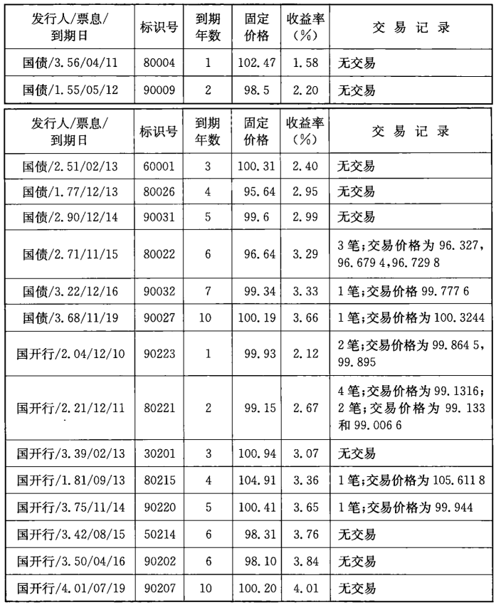

资料来源：彭博资讯，中国债券和Wind资讯。所有固定利率债券

交易数据表明，在2010年1月4日这一天，国债被交易了32次，交易金
额为55.7亿元人民币，国开行债券被交易了55次，金额为295.3亿人民币。
这份每日固定价格的表格就是从这些众多的交易中截取出来的，它很好地
解释了为什么中国国债的收益曲线不是实际存在而是假想出来的。从国债
的交易情况来看，位于收益曲线一年期到五年期的债券并没有市场交易。
五年期以下的收益曲线，虽然完全是建立在假想的基础之上，却仍然和到期
期限为六年、七年和十年的曲线部分形成连续光滑的曲线，不过，即使是存
在真实市场交易的六、七和十年这三个到期期限的债券也只是总共被交易
了五次！

图4－7将表4－2中的数据以曲线的形式呈现在我们眼前。这是一条
看上去平滑的，略向上倾斜的收益曲线。在了解了前面这些情况之后，我们
再来看市场参与者到底应该在多大程度上信赖这条国债债券收益曲线，或
者说，就国开行债券为例，投资者到底是否应该认为它们和国债之间的名义
利率差是可信的？因此，我们可以毫不惊讶地说，这个市场的特点就是，理
论上应该具有高度流通性的金融产品在现实中却并不是那么一回事。

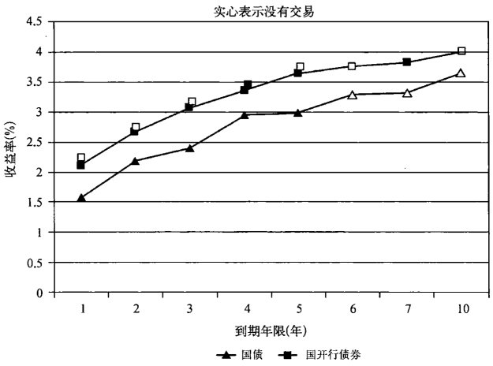

资料来源：Wind资讯，2010年1月4日

另外，在1月4日这天，整个银行间交易市场总共只进行了615笔交易
（见表4－3），其中让人感到惊的是，国债交易量竟然最少，只占了整个交
易金额的3.3%。和中国这一天债券成交的250亿美元的总交易金额相比，
美国债券市场平均日交易金额为5650亿美元，美国的这一金额也大大超过
了全球平均每天股票交易总金额的4200亿美元[^4-12]。这些美债交易也使得债
券每天在美联储电子结算系统中在账户间转手的总价值达到了日均1万亿
美元。

表4－3　银行间债券交易概况，2010年1月4日

&nbsp;        交易额（单位：百万人民币）    交易次数       交易额占比(%)
-----------   -----------------------   -----------   ---------------
中期票据                        31050           149             18.3
企业债                          10909           978              6.4
政府债券                         5570            32              3.3
人民银行票据                    31550            74             18.6
商业票据                        15220           144              9.0
金融债券                        75390           119             44.4
总计                           169689           615             100%

资料来源：Wind资讯

[^4-12]: 数字来自美国财政部债务管理办公室，2008年6月。

图4－5和图4－6里的价格点也并非一点意义都没有，至少它们反映出
投资者在这样一个看似饱和的市场中出售他们所持有的债券所必须支付的流
动性溢价。这些价格点在图上围绕着收益曲线散乱分布。图4－8很好地概括
了这些事实，揭示了中国政府债、公司债和金融债的非流动性。2010年全年，
国债交易涉及金额为7.9万亿元人民币，相当于一年内所有国债都易手了一
次。流动性最高的是那些到期期限较短的证券，比如中期票据，商业票据以及
人民银行票据，其中中期票据的流动性最高，换手率达到了一年九次。

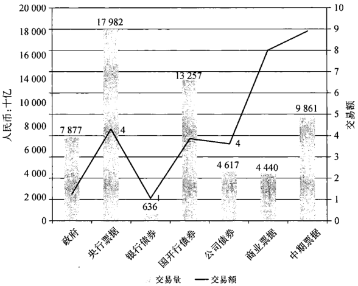

要发展中国固定收益市场，就必须增加债券交易量。债券交易量相对
于债券存量，还是相当有限。更值得思考的是（见图4－9），涌入中国金融市
场的资金的确促进了整体资本市场交易的增长，这并不让人感到惊讶，但是
交易数据也说明了债券市场真实的情况。2011年7月的数据显示，当月有
超过44%的债券没有被交易过，每日平均交易次数依然维持在1500次左
右。这里所揭示的事实是，即便是在巨额流动性注入的情况下，债券市场交
易却依然零星，交易金额也有限。

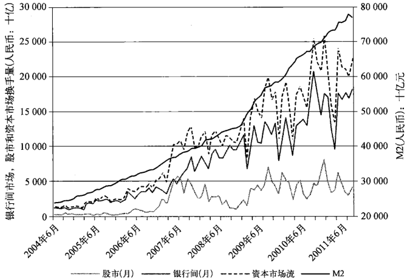

资料来源：Wind资讯

综上所述，由于缺乏大规模的市场交易，中国的债券市场并不具备“价
格发现”的功能。接下来的问题是，不准确的价格意味着市场参与者无法准
确地评估风险的状况。哪怕提的问题很简单，回答却着实不简单，例如：一
个信用级别为AA的债券发行人需要向投资者支付多少的利率才能让投资
者有兴趣购买其发行的十年期债券？而另一方面，中国的市场投资者其实
对这个问题也并不关心，尤其是目前，大多数债券的无（信用)风险利率都高
于一年期银行存款利率，在二级市场上也无法轻易出售出去[^4-13]。因此，只要
通货膨胀在控制范围之内，银行自然很乐意将大部分债券持有到到期日，就
好像他们发放出去的贷款那样。

[^4-13]: 这里市场投资者主要指的是银行，他们是债券初级市场承销包销的主要力量。——译者注

## 现金和回购市场

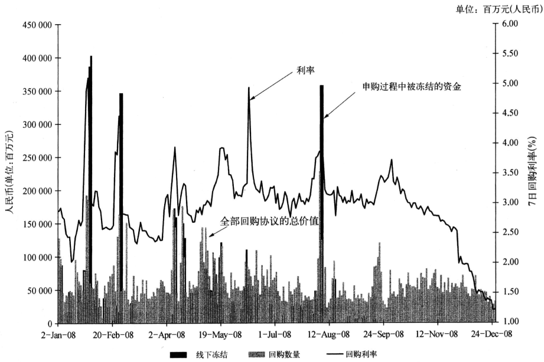

注：“线下冻结”是指制度性“线下”认购新上市股票所占用的资金。

资料来源：Wind资讯

中国的回购市场恰恰更好地解释了债券市场流动性的问题。图4－10
所展现的是2008年的"7日回购利率”情况。我们来将图里基于市场交易形
成的利率水平和在图4－6里的国债和国开行债券基于固定价格所形成的收
益曲线做个比较。很明显，交易成本受供给和需求关系所决定。这样的交
易说明了什么问题？上交所内对新上市股票带有投机性质的公开申购使得
股票投资者不得不集中资金以确保在股票申购中可以有所斩获。在新上市
股票的申购过程中，经常是数以亿计的资金因为要确保想要购买的股票能
够被顺利获得而被冻结。这些资金中的很大一部分是来自回购交易。这个
市场更近似于银行间的短期贷款市场而不是促进长期资本配置的债券市
场。但是我们这里要说的是，需求在这个市场里成为决定价格的因素，可是
在债券市场里却不是。

即便是那些对中国经济并不熟稔的人，他们也明白投机的存在是必然
的。造成这个事实的一个主要原因是存在人为设定的银行存款利率，贷款
利率和债券利率，而这些，对于投资者来说是除了房地产，股票和奢侈品以
外唯一的投资选择了。对这些投资的利率管制，使得利率并不体现对资金
的真实需求，也导致了固定收益市场的“流产”，而迫使投资者趋向投机。资
本升水获利，由于没有税收要求，成为了中国投资者的基本追求目标，这就
使得不管是个人投资者还是机构投资者，在债券资本市场上都不会太踊跃。

## “3.27”国债期货事件

为什么政府对市场进行如此严加管制？有这么一起较为有代表性的事
件可以帮助我们深入了解，这就是发生在1995年的国债期货事件。这个事
件距离现在已经有相当长的一段时间了，可是却解释了为什么在中国的资
本市场上迄今为止都没有一个金融期货产品。简单来说，这起事件起因可
以归结为，上海的一家主要券商和财政部之间的矛盾。上海的万国证券获
得一条内部消息称，1995年财政部计划在前一年债券发行数量上增发50%。
万国的交易员认为，庞大的发行规模将抵消由于低通货膨胀带来的债券获
利，因此债券价格将继续保持低迷，而当时市场的普遍预期是价格将上升。
在1995年年初，万国逐步在国债期货上筑成了规模较大的做空地位（这其实
属于违法），其中主要是3月27日到期的国债期货合约（这也是为什么这起
风波以此命名的来由）。关于万国做空的消息不径而走（任何消息在中国都
不会被掩盖很久），其他市场参与力量开始构筑做多的地位，期望价格可以
上升。这股趋势后来得到进一步增强，其原因是其他券商获悉财政部已经
决定大规模削减债券的计划发行规模。不知道是什么原因，万国却依然故
我，继续保持其做空的地位期待市场局面的扭转。

财政部独资的中国经济开发信托投资公司（中国发展信托，简称中经
开)采取做多。由于中经开时任总经理朱扶林有过曾任职财政部国债部门
主管的背景，这场角逐从一开始就并非公平的较量。当财政部最后宣布大
规模削减计划发行的国债数量，同时国债价格趋高的形势下，万国并不采取
补仓以应付交割，却是在交易日最后的八分钟抛售1100万份卖出合约，这
个举措的目的可能是为了避免交付大量的保证金。市场交易量到了前所未
有的水平。交易日结束前，万国最后八分钟的卖空虽然导致了市场价格的
下降，却最终也导致了市场崩溃，很多经纪公司濒临破产的境地。当晚，上
交所做出了“最后十分钟内交易无效”以及“随后三天市场停市以处理各交
易方之间谈判平仓事宜”的决定。在这期间，对外公布的债券最终价格大大
超过了预期的价格，这也意味着万国已经出局了。

随后，对该事件展开调查之后，万国的董事长，这位上交所的元老被逮
捕，并最后被判处17年的徒刑。万国也和当时上海排名第二的券商申银合
并，成为现在的申银万国。身为改革派的中国证监会主席刘鸿儒虽然在这
个时候尚不具备直接干涉交易所的权力，但是还是负起了责任，叫停了国债
期货市场，这个市场一直到现在仍然处于关闭的状态。不久以后，北京就将
两大交易所纳入证监会管辖范围之中。

[^4-14]: 胡翠萍：《中国经济口碑最佳的经纪》，彭博社，1996年1月13日。

在这场零和游戏中，必定有赢家。中经开在1995年被上交所因其“庞大
的国债期货交易量占全年交易换手量的6.8%”评为顶尖的券商[^4-14]。政治上
保持高度敏感的中经开并没有把庞大的利润留给自己，而是留给了其客户，
当然财政部也是客户之一。

具有讽刺意味的是，就在"3.27”事件之前的一个月，当时负责管理金融
行业的副总理朱镕基，就已经对国债期货市场充斥的投机现象提出过尖锐
的批评，他指出：“这个市场的投机由一些大的利益集团推动，利用国家和当
地政府以及企业的资金来牟取暴利。”朱镕基已经意识到了这个问题正在逐
步扩大，他能够做的，就是彻底取缔期货产品。鉴于此次事件的政治影响，
还是让人可以看出：债券市场的有序性和可控性，处于政府首先关注的地
位。市场中投机力量的增长，其原因在于市场的不健全、不完善，如果不进
行彻底的改革，这种投机力量可能随着中国经济的繁荣越来越强大。

## “金字塔”的基础：对居民储蓄的保护

真正为中国的债券和贷款市场奠定基础的是居民的储蓄。现在，银行
所持有的各式各样的债券价值超过了总存量的70%，可是过去却不是这个
情况。在20世纪80年代早期，个人投资者才是这个市场的主要力量，他们
每年竞相征购的债券占了购买总数的62%。到2009年，这个主要力量却几
乎从市场上消失了，个人投资者购买的债券仅仅相当于发行债券价值的1%
（见图4－11）。外资银行占了7%，这也就意味着由国家控制的实体占了剩
下的92%。更有甚者，这些国家实体很多也都是市场上唯一的债券发
行者[^4-15]。

[^4-15]: 亚洲开发银行和世界银行集团下的国际金融公司是迄今为止唯一可以中国国内债券市场发行债券的外国发行人。

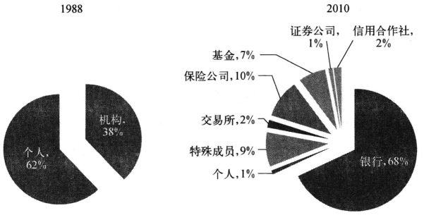

资料来源：1988年，高坚：《中国国债》，第48页；2010年，《中国债券》

这个现状对中国的金融体系有着深远的影响。如果说今天的市场仅仅
是充当一个结算的角色，把钱从国家的一个口袋转移到另一个口袋，那么可
以说，和80年代初期市场所具备的分散化功能相比，今天的市场偏离了当初
的分散化，而是转变成为了一个金字塔形态。这正是周小川所说的“被扭
曲”了的市场，充斥了“看不见的风险”。为什么至关重要的非国有投资者变
得这么微不足道了呢？

在1991年和1992年，财政部为了促进市场的进一步发展，开始试行不
同的承销办法。财政部过去的教训已经很清楚地表明，债券大规模发行将
受到制约。首先，定价上存在问题。其次，过于依赖个人投资者也产生了明
显的困难。这是因为个人投资购买债券的量很小，简单物流过程限制了债
券发行的总数，从发行到结束经常需要长达六个月的时间。况且为了得到
这些投资者的投资，财政部还要以近于市场价格支付他们。零售市场也有
着购买并持有到到期日的习惯，结果导致二级市场的“难产”。最后，因为考
虑到通货膨胀和零售市场的需求偏好，债券期限相对较短。小规模的发行
量、高成本、较短的期限和缺乏二级市场都阻碍了基准利率和最终可靠的收
益曲线的形成。这些都是最终寻求发展机构投资者的合理原因。

财政部在早些时候就试图从银行和非银行金融机构中寻求帮助来发展
机构投资者。可是80年代初期，银行自身流动性不足，并没有宽裕的资金来
投资。即使是国务院允许财政部发展市场化定价的机制，以零售投资者为
投资者基础本身就抑制了财政部的发行愿望。股市和债市到了这个时候面
临同一个问题。政府在建立了股票交易所来约束场外交易带来的社会动荡
之后，现在把债券也引入了交易所里面，尤其是引入了上交所。

交易所使得来自个人和机构投资者的需求都可以满足；这些都是新市
场里的成员。银行也开始掌握很多资金，特别是当零售存款额在飞速增加
的同时（见表4－4）。不久之后，政府开始倾向于向银行来求助，因为他们发
现了一个有趣的事实。

表4－4 1978—2005年四大银行存款组成

人民币(单位：十亿)       总计        政府        企业        零售        其他
-----------------  ---------  ----------  ----------  ---------  -----------
1978年                 113.5      40.3%        32.4%      27.2%         0.0%
1983年                 276.4      32.6         31.3       34.9          1.2
1988年                 744.9       9.2         39.4       44.7          6.7
1993年                2324.5       5.2         33.0       55.7          6.1
1998年                6978.2       4.9         36.2       57.1          1.8
2003年               13465         7.9         30.9       56.7          4.5
2004年               15355.7       8.3         31.6       56.6          3.5
2005年               18112.1       9.9         29.5       55.8          4.8

资料来源：《中国金融年鉴》1949—2005年

从银行拿钱有助于降低财政部的利息成本。政府的“一声令下”可以让
银行以仅仅略高于一年期存款的利率来购买债券，而零售投资者在使用相
同的银行存款来购买债券的时候则会要求高得多的收益率。换句话说，银
行为政府提供了按照政府规定的利率，不用经过居民储户的许可就可以直
接获得居民存款这一资金来源了：银行做的仅仅是间接化了这种融资。和
无法加以约束的个人投资者相比，银行因为其领导层同时也都是党员干部，
因此比较容易妥协。党的领导可以在其需要的时候轻而易举地调动任何数
目的资金，而不必通过花费大量的精力和人力来劝说购买或者支付市场利
率。同时，党也相信，这么做之所以正确也还在于可以保护居民储户不用面
对过度的信用风险。

起初，利益冲突并不存在，个人投资者为之疯狂的是股票不是债券，银
行却不能购买股票。但是当中国在90年代中期开始走出通货膨胀的阴影的
时候，债券和几近崩盘的股票比较起来忽然间表现得更为出色。问题是，个
人投资者并没有能力购买债券。于是很快，中国的这些银行开始在上交所
内垄断了债券方面的交易。有这么一则故事：一个怒气冲冲的上海家庭主
妇抱怨国债交易的垄断性，被朱镕基得悉了。朱镕基开始决心采取行动，
1997年6月，他将银行和绝大部分的政府债的发行和交易赶出了交易所，只
允许在当时规模较小而且不活跃的银行间市场上开展发行和交易[^4-16]。从那
以后，个人投资者只能通过零售渠道购买储蓄债券，而机构投资者们则要在
很大程度上局限于银行间市场[^4-17]。

[^4-16]: 中国的银行间市场是在1986年建立的，它被当作是为银行提供的一种融资手段，那些拥有过剩的资金的银行可以将资金出借给那些有资金需要的银行以平衡他们的资产负债。

[^4-17]: 仍然有一小部分债券仍然在上海证券交易所挂牌交易，其目的主要是为了帮助证券公司可以通过回购协议来进行融资的需要。银行直到最近才失去了参与这个市场的能力。这一小部分债券的存在是来自将两个相对独立的市场结合在一起的努力，这两个市场是：场内交易和银行间市场。

这个显著的结构化调整意味着，虽然债券市场在很大程度上仍然要依
赖国有银行，但是其他国有实体单位只要成为这个市场的成员，也可以参与
这个银行间市场（见表4－5）。

表4－52011年6月30日，银行间市场投资者的数量

成员类型                                        数量
------------------------------------     -----------
特殊成员（人民银行和其他政府机构）                 14
商业银行                                         462
信用合作社                                       894
非银行金融机构                                   182
证券公司                                         125
保险公司                                         140
基金                                            2499
非金融组织                                      6392
银行间市场成员总计                              10933
个人（非银行间市场成员）                      9552494

注：如果是机构，成员包括这些机构的分支机构。

资料来源：《中国债券》

简单来说，债券又回到了最初的状态，国家又成为其唯一的投资者。但
是最根本的区别在于银行和其他非银行金融机构取代了国有企业，使得政
府可以更直接地获得居民储蓄这一融资途径。这也解释了银行是如何持有
中国固定收益证券市场上70%的证券，其中包括了国债和政策性银行债券
中的80%以及商业票据和中期债券中的66%（见图4－12）。仅仅对隶属于
发改委下的企业债和银行从属债来说，主要的投资人才是保险公司而不是
银行。这其中的原委，部分原因也在于这些企业债享有银行提供的担保，因
此实际上，这些债务仍旧停留可以追溯到银行（见第五章信用提升的细节）。

在国际市场上，银行虽然也是承销和交易的主体，但是投资人和他们的
受益人则十分分散，很多都是由共同基金和养老金或者保险公司所代表。
在中国，类似的分散化不存在，因为这些机构投资者，不管是银行还是非银
行，都是国有的。在这样的情况下，信贷风险和市场风险无法得到分散。这
就是为什么说中国的市场依然停留在原始的程度，也可以解释为什么周小
川要说“潜在的风险”了。

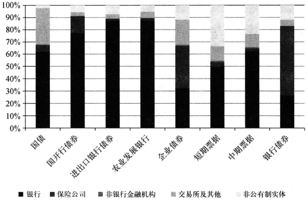[^4-18]

[^4-18]: 本图是由译者根据原作者所提供的信息来源获得数据进行绘制的，和原图或有出入，但是其揭示的基本信息和作者文中所叙述一致。——译者注

注：非公有制实体包括了外资银行、基金和个人投资者。

资料来源：中国债券

2009年年底，银监会突然意识到这个必然的事实，立刻终止了所有银行
从属债务的发行。为什么一开始没意识到，要过这么久呢？如果国家拥有
中国的这些大银行（正如现实里的那样），中国银行向作为投资者的其他国
有银行发行从属类债券有什么意义吗？如果是那样，国家仅仅是和自己“玩
捉迷藏”，将自己的一个资本从属于自己的另一个资本。系统内的风险并没
有因为有新的金融产品的出现而发生丝毫改变。

所有这些都提出一个问题，为什么外资银行和其他金融机构这么难以
进入这个市场？在过去的15年间，中国的领导人目赌了1994年墨西哥债务
危机，1999年阿根廷比索危机和时下正在发生的欧洲国家债务危机。他们
也亲历过2007年本国股市指数的猛涨和随后2008年的狂跌。坊间的报纸
和媒体报道充斥着对冲基金，热钱和道德沦丧的银行家等话题。一个内在
保守，天生控制欲望强烈的政治阶层，自然不会轻易听任那些不容易受其摆
布的人积极介入国内债券市场。但是，出于对表象的维护，市场开放还是会
有一些进展，只是绝对没有真正意义上的开放。

那些持有国债或其他公司、金融债券的银行和保险公司在通货膨胀环
境下将如何应对？正如前所说，中国央行对利率的管制就是为了防止变化，
因为变化本身就是风险。无论这些国有机构持有这些固定收益债券作为长
期投资的目的是否是为了避免对这些证券进行“以市值计价”，但是在通货
膨胀环境下，由于融资成本的上升导致债券的价值下降是无法避免的。这
个无法避免的结果是，即使以市值计算而不动用估价准备金，还是会造成了
对银行收入的拖累。这可以清楚地从银行的财务报表上得到反映。例如，
工商银行的会计报表审计师们时常会将银行贷款的利息，投资债券的利率
和重组债券组合的利率单独列出（见表4一6）。

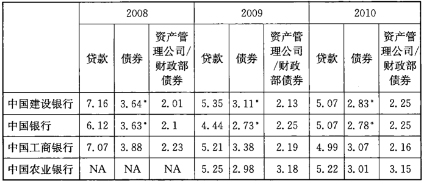

注：*中国建设银行和中国银行债券利率的计算包含了重组证券；因此收益要低于实际。工商银行的利率是单独计算的。

资料来源：经审计的银行H股财务报表

重组债券的利率和一年期银行存款利率相近，这些利率都是固定利率。
在低通货膨胀环境下，他们可以变得相同。到2011年，这种情况就改变了，
一年期存款利率达到了3.8%并且继续上升。类似的，银行持有债券组合的
平均收益在通货膨胀恶化的情况下呈现下降的趋势。这就产生了一个问
题：当贷款有能力在短期内可以带来高得多的回报率的情况下，为什么银行
还要长期持有数量巨大的债券投资组合？银行持有这些债券的原因有部分
是为了流动性考虑，但是更大程度上是因为政府对这些银行的要求使然。
如果银行管理层的最终目标只是利润最大化，这样的低收益债券应该只占
到银行总资产的25%一30%（见图4-13）。

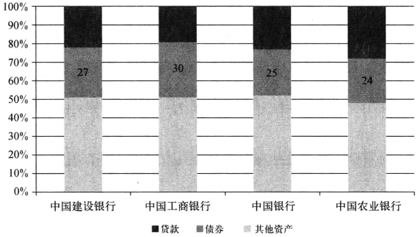

资料来源：银行H股2010年年报

对所有债券来说，利率风险都存在，但是对公司和地方政府债券来说
还存在信用风险问题。在他们无法支付利息的时候，银行收入会下降并且
迟早要更新其对他们的内部信用评级，并且当债券成为问题贷款的时候给
予坏账拨备。即使银行可以在这种情况下将债券在市场中出售，仍将被迫
承担所有损失。中国的主要金融机构，银行和保险公司都在海外上市，要接
受国际审计师事务所的审计。在前面所述的场合，提供拨备是不可逃避的。
中国到现在为止没有，也不会受到特别的对待。

简短概括，中国的银行在三个方面都面临严重的挑战。除了必须面临
从90年代形成的结构性不良贷款之外，他们还将面临从2009年以来由于经
济刺激所发放的贷款中造成的新不良贷款。第三方面就是银行持有的固定
收益证券完全可能遭受来自利率和信用风险所造成的价值损失。虽然中国
最近发展起步的人民币利率掉期市场可以为这些债券的利率风险提供一定
的风险回避，但是就国家的层面来说，并没有任何影响：中国银行可能十分
有效地回避了风险，可是参与掉期的交易对方几乎不可避免的是另外一家
国有银行。市场价值的损失，信贷的损失甚至是银行资本的负收益都可能
很显著。从发行人的角度来看，似乎并没有什么差别。在国际市场上，企业
往往可以从其他类别的投资者那里获得更为廉价的资金，但是在中国，银行
就是投资者，对于发行人来说全部发行成本就和一般贷款无异。因此回到
我们最初的那个问题：为什么中国要发展固定收益资本市场？

