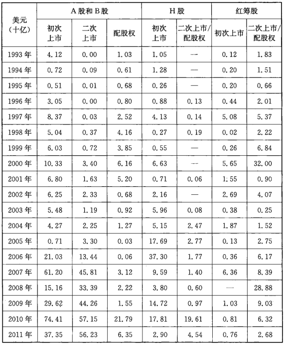
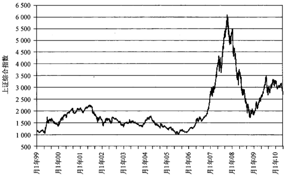
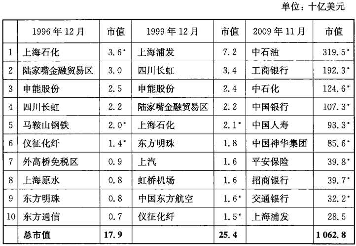
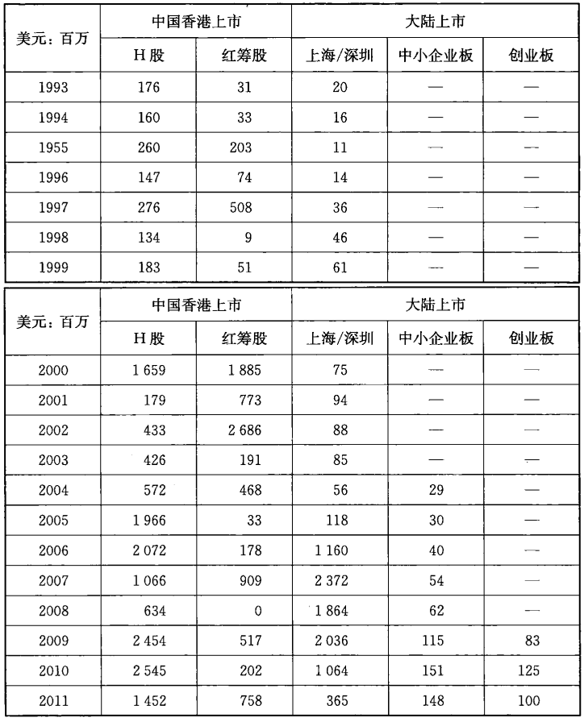
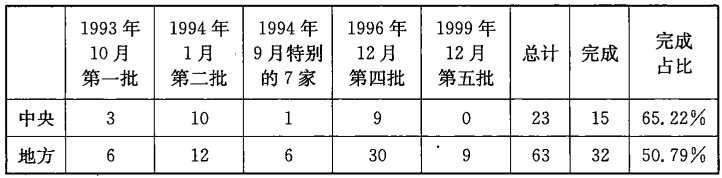
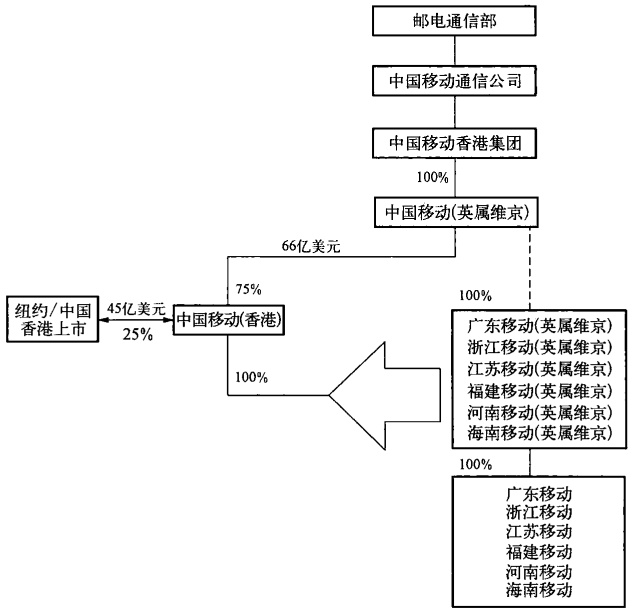
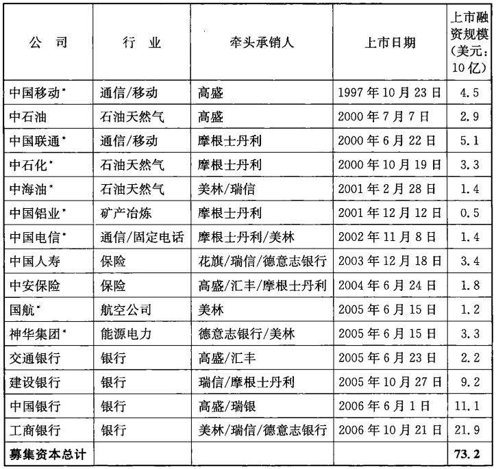

# 第六章 西方金融、国企改革和中国股市

        “A股首日价格已在预料之中，但是还不够满意。”
                    ——陈必亭，中国神华集团董事长
                    2007年10月10日

  在融资的话题上，中国的股市比起银行贷款和债券市场来，有点小巫
见大巫，但是它对中国的一批公司的建立有着不可磨灭的作用，同时，它
也使得中国有了形式上的现代化的资本市场。要不是股市，中国可能需
要等待更久的时间才能看到一个真正的国家范围内的资本市场。更重
要的是，如果没有股市，中国的相关部委或许就没有机会从高盛和摩根
土丹利那里学到如何运用国际公司法和复杂的股权转移的模式来打造
自己的“国家队”，一支在中国前所未有的、拥有庞大经济规模的国有企
业的团队。2006年和2007年，当这些公司开始陆续返回上海股市二次
市的时候，他们已经能够利用积累的财富回报投资他们的企业和机
构，这些企业和机构作为投资者也充分利用这些“国家队”在国内的上市
而获利。

  这也解释了神华董事长的话中深意：他的公司上市的业绩对帮助过神华的
那些公司和个人来说可能是低于了期望值。在这样的上市过程中，公司的价值
被人为压低，申购中签分配过程中的不公平[^6-1]，以及国家权力实体之间资金的流
动,在任何人看来都是一目了然的。问题来了，到底现在执掌中国经济的是政府
还是这些“国家队”？表面上看，显然是前者。可是眼下的中国“无处不商”，很大
程度上，国家队和政府的利益关系也互相交织,恐怕很难分出彼此了。中国股市
的实质其实也早已经不是金钱这么简单了，何况这些钱也是来自党领导下的银行。

## 今天的中国股市

  1992年10月7日，一家生产面包车的小公司在纽约证券交易所正式挂
牌上市，成功融资8000万美元。如果这个企业不是一家来自中国的公司而
且不是第一家在中国以外上市的中国企业，同时也不是在纽约证券交易所
上市的话[^6-2]，这根本就不会成为标志性的事件。面对疯狂的超额认购，华晨
汽车公司单凭一己之力将中国置于世界金融的中心。从那时候起，中国股
市的喧嚣使纽约和伦敦作为世界上最重要的股票市场而黯然失色。

  表面上，中国股市在亚洲规模是最大的，拥有很多世界上最大的公司，
有近1800家公司的股票在超过1.2亿个独立账户之间进行交易。中国股
市融资的能力也可以书写成传奇（见表6－1）。根据彭博社的数据，从2006
年1月开始，世界最大的十个上市项目中有一半涉及中国公司，融资金额达
到了450亿美元。在上海，新发行的股票获得500倍的超额认购并非什么稀
奇的事情，在这样的认购里，有超过4000亿美元的资金被锁定仅仅就为了
一次的发行。中国公司的规模从1990年开始也呈几何级数增长。1996年
上海上市企业中最大的10家总市值为179亿美元；到1999年年底，达到了
253亿美元，10年以后，1.063万亿美元！与中国的很多其他事物一样，发行
的数量和他们所呈现的以几何级数增长的速度都十分惊人。

[^6-1]: 公开上市中对投资者的股份分配是按照抽签的过程。
[^6-2]: 当然作者很清楚，汇丰和美国友邦人寿都有着深厚的中国渊源，但是他们并非是中国的公司。

注：美元汇率按照当时市场；不包括中国香港联交所创业板；2000年以来就没有再发行过B股；二次上市指的是在上海证券交易所的二次上市公募；2011年数据到9月30日止。

资料来源：Wind资讯和中国香港联交所

  当然，利润的规模也十分巨大。2009年，中国公司一共融资1000亿美
元，其中75%是从上海和深圳两个国内证券交易所募集所得的。承销费用
在中国大约为2%，这就意味着中国的投资银行（其中最多只有顶尖的10%
的投资银行才可以参与利润如此高的商业活动）赚了15亿美元的承销费。
这个承销费用虽然巨大，但是和经纪费用比起来又算不了什么了。举个例子，
单就2009年11月27日这天来说，上海和深圳证券交易所的A股交易创造了
历史上的最高纪录，交易金额达到了4850亿人民币（合700亿美元）。对一个
不允许T+0的市场来说，这样的转手率已经让人印象很深刻——这个转手率
已经超过亚洲其他市场包括日本在内的两倍多了。那一天的经纪佣金就达到
2.1亿美元，由103家证券公司瓜分。由于效益的可观（很明显对中国公司来
说，国内的券商要比国外的吃香得多），无疑地，中国股市充满看喧器，世界上
所有的投资银行家都不是低调的，在中国也不例外。

  观察家们对市场的基础设施也印象深刻。和银行间市场类似，股市的
运行机制也是最先进的，拥有完全电子化交易的平台，最有效的结算和清算
系统，同时还拥有最直观的指标，比如指数，信息披露和实时价格公布以及
公司公告等。在交易所网站公布的信息内容之广也很能给人留有印象，信
息也很准确，但是所有这一切只是一个方面。中国股市建立的基础并非私
人公司或者私有产权，股市是建立在政府的利益之上。最终，无论基础设
施，数据的质量和筹集到的资金有多少，中国股市的形式大于内涵。股市给
了中国经济一个现代化的假象，但是和债券市场一样，事实是，股市并没有
发展成一个为公司所有权服务的真正意义上的市场。

  债券市场的核心是对风险的评估，可是在中国这并不存在，因为政府控
制着利率。类似地，股市的核心是对公司价值的衡量，这在中国也不存在，
因为政府也控制着这些上市公司的所有权。指导中国经济的核心理念不是
私有产权，而是党的领导和全民所有制为主体。在这样的思想基础上，市场
不是分配稀缺资源和促进经济发展的唯一手段。分配资源的任务通常由国
家来承担，而国家出于利益的需要，对债券和股票市场采取了积极干预和控
制的方法。如同前两章所讲的那样，债券市场的周期是体现在由政府对资
本分配的控制所带来的对利率的管制和被低估了的风险。股票市场，相比
之下具有更大的波动性，但是证券交易并不涉及公司的所有权的变化。这
些证券究竟代表了什么并不清楚，我们只知道这些证券带有投机的特点，在
交易和上市的过程中可以带来收益或者损失。

  在中国，股票和房地产市场演变为给富余资本寻求回报的一个可被掌
控的途径，很大程度上，这些富余资本本身就来自国家机构。股票和房地产
市场虽然也频繁地受到行政干预，却还是中国仅有的两个可以提供高于通
货膨胀的回报的场所。2007年上证指数一路冲高就是很好的一个例子（见
图6一1）：人民币大幅度地升值带来大量热钱的涌入，这些热钱涌入股市，
进一步推高股市。和发达国家现有的市场一样，中国股市在运作上也是有
条不紊的，只是这样的运作必须要在国家所规定的框架范围内，而这个框
架从建立伊始就被人为设定了很多不合理的条件。只要这些最初的条件不
变，股市的性质就不会变。要改变这些条件，则需要完全、公开地承认私有
制——而这无论是现在或可预见的将来都是不可能的。

资料来源：Wind资讯

## 中国为什么要建立股市？

  那么为什么中国政府要在20世纪90年代初的时候决定建立股票市场
呢？开设上海证券交易所的决定是在1990年6月做出的，同年年底就投入
运营了，当时国内还在就80年代的改革到底是“姓资还是姓社”的问题进行
着争论。从资本配置的角度看，当时并不需要市场。那个时候和现在一样，
四大银行为国有部门提供所需要的资金。建立股市并不是为了政治上的私
利或者国有企业的资本要求。促使北京在1990年决定建立股市的一个更为
重要的原因是为了通过深化改革打破发展的瓶颈，部分也因为国有企业低
效率运营和缺乏竞争力。利用股市来解决这两个难题纯粹是带有偶然性质
的。如果没有当时绘制的股市蓝图，今天的中国可能还是另外一个样子。

## 炒股热和社会动荡

  20世纪80年代，中国股市的兴起和西方私有制经济下的股市兴起都源
于同一个原因：无论是小型，私有和国有企业都缺乏资本，而资金规模较小的
个体投资者却在积极寻求回报。在中国的很多地区，依靠股票来进行筹措资
金几乎是在同一时间兴起，加上当时宽松的政治环境，这一趋势很快就成型
了[^6-3]。尽管上海大声宣布自己是全国的金融中心，毫无疑问深圳却是率先启动
这一趋势的。深圳在地缘和文化上接近香港是一个主要的原因。1987年是关
键性的一年，这一年五家位于深圳的国有企业面向社会公开发行股票。深圳
发展银行成为第一家上市的金融机构，随后是万科，它现在成了房地产开发商
中的领头羊。他们的上市并没有引起公众很大的兴趣，认购不仅不足而且偏少。
面对个体公众投资者对深圳发展银行上市兴趣不大的情况，深圳党组织开始发
动党员购买股票。即便如此，深圳发展银行的股票也只是被认购了50%。

[^6-3]: 更多信息关于对资本的需求是如何带动中国股市在20世纪80年代自发性扩张，参见卡尔·沃尔特和弗雷泽·豪伊的《私有化的中国：中国股票市场内幕（第二版）》,John Wiley ＆ Sons出版社,2006年版。

  事实是，经历了近30年的中央计划经济体制，近乎内乱的斗争和国家所
有制的确立，股票的概念早已经消失得无影无踪了。在有股票存在的地方，
人们认为股票之所以有价值是因为股票能够支付红利；购买股票就是为了
获得现金流。人们并没有意识到股票可以升值（或者贬值）而带来资本所得
(或者损失）。因此市场对银行的上市不热心是可以理解的，另外，市场对
1989年年初第一次分红支付完之后所发生的事件也没有充分的准备。

1989年年初深圳发展银行宣布分红，这在中国经济史上应该被看作是
一件扭转乾坤的大事。银行当时对待股东投资者十分慷慨，给予其股票投
资者——大部分是国家和党的系统内的投资者——现金红利每股10元，另
外还有二比一的股票红利。那些1988年花了20元一股购买银行股票的人
眼间就赚了数倍于其投资的收益。尽管如此，仍然有一小部分投资者没
有兑现股票红利，银行遵循相关步骤在市场上公开拍卖这部分股票。有这
样一个故事：一个人突然出现在拍卖现场，以每股120元的价格买下了一整
批股票，人们这才意识到：股票的价值其实不在其票面。正当消息在深圳传
开的时候，一股热潮也开始酝酿。当时市面上的银行股和其他一些股票在
场外交易中价格开始迅速上升。深发展的股票在1988年年底是每股40元，
1989年6月上升到120元，当年年底价格还维持在90元。

  当中国的散户们意识到这样一个好机会的时候，他们也开始把股市炒
热，中心为深圳，后来逐渐蔓延到上海和其他城市，比如成都、武汉和沈阳这
些股票有交易的地方。最后，中央政府出面要求地方政府将市场冷却下来。
对市场的限制力量最后占据了上风，导致了1990年年末股市的崩溃。即便
如此,投资者还是上了一课,学到了股票可以升值。但是北京也学到了一个
教训：股票交易可以引发社会动荡。开设正规股票交易所的决定就是在
1990年6月股市尚在热炒之中的时候作出的，深圳和上海的交易所在同一
年后期都陆续开张。

## 国有企业公司化改革

  当然中央大可以一声令下禁止任何股票交易和相关活动，但是它并没
有这么做，之所以没这么做的理由可以在对国企糟糕表现的相关政策讨论
中找到。尽管1980年代，政府对于国有企业在资源上和政策方面都有十分
慷慨的支持，但是新兴的民营经济让这些国有经济部门相形见绌。

  私有行业的年增长率超过了16%，国有部门则只有7%（见表6－2）。
最终，经过十年的时间，私有部门将其对工业产出中的比重从22%增加到超
过43%。对于政府来说，当时无法接受，实际上，即使到了今天仍然有人无
法接受。政府基于希望国有经济仍然占据主导地位的愿望，在1980年代后
期，极其渴望找到有效的方法来加强国有经济部门；至少改善国有企业经营
状况。

表6-2 工业产值所有制结构占比

&nbsp;      国有企业    非国有经济合计     集体制      个体      其他
--------  ---------  ----------------  ---------  --------  -------
1978          77.6%             22.4%      22.4%     0.0%      0.0%
1980          76.0              24.0       23.5      0.0       0.5
1985          64.9              35.1       32.1      1.8       1.2
1990          54.6              45.4       35.6      5.4       4.4
1991          56.2              43.8       33.0      4.8       6.0

资料来源：《中国统计年鉴》

  从1985年开始，国家经济体制改革委员会的工作人员和一群研究生，开
始针对工业领域涉及国家计划和国有产权方面的问题提出专家建议。他们
中包括：曾经担任建设银行行长的现任证监会主席郭树清，现任中投董事长
的楼继伟，现任人民银行行长的周小川，现任中国国际金融有限公司董事长
的李剑阁，经济学家吴敬琏，这些人现在仍然继续为中国的市场化改革做着
贡献。在这些人工作的基础上，再加上从纽约回来的高西庆（现在中投的总
经理），王波明（《财经》杂志的创始人和总编辑）和其他一些人带来的意见，
到1988年年底，国务院和国家体改委开始着手一个项目，最终成为了1980
年代北京为了国有企业的利益而开始的股份制试点。

  1988年12月，在具有历史意义的西直门酒店会议中心里，关于中国未来
股市的框架被大体设定。讨论紧紧围绕了如何改善国有企业的经营表现，而
会议的提议也都只和国有企业有关。会议报告中，提出开展所谓“股份制试
点的前提条件有：（1）避免私有化；（2）防止国有资产流失；（3）确保国有制经
济的基础地位。在这些目标都可以实现的前提下，会议作出的结论是，有限股份
形式的新型公可之所以有吸引力有两个原因：第一，有限股份的公司结构可以解
决政府在企业管理中的干涉过度问题；第二，如果管理适当，将少数股份出售可
以为公司筹集到国家预算和人民银行通过发行货币以外的其他资本来源。

  由国家体改委准备的会议提案并没有在1989年获得国务院的批准，可
是一年以后，向往富裕生活的人们引发的社会动荡使得改革者的建议被重
新列入了议程。北京将股票交易所看成是把场外的市场关闭之后搬到四面
有墙限制的场所里面这么一种方式。1990年5月，国务院批准了体改委起
草并经过修改的提议，这份提议包括了：（1）不允许个人股东；投资其他企
业的资本必须仍然是企业资本；（2）不能将企业的股票出售给企业的员工：
（3）柜台交易的发展仅仅限于上海和深圳；（4）暂停新股上市。6月2日，仅
仅一个月以后，国务院同意了正式建立两大证券交易所。

  因此1990年12月成立的上海股票交易所和1991年7月成立的深圳股
票交易所是具有象征意义的历史事件——不过并非因为通常所说的原因。
外部的观察家们往往将其视为中国摆脱阴影、拾起改革的火把，开始勇敢地
向着一个新的目标前进，而实际上，交易所的建立只是给免费的私有资本市
场关上了大门而已。取代这个市场的交易所以及整个试点都只是为了一个
目的——支持国有企业的发展。中国从中收获的确实具有历史意义，但并
非当初所预期的那样。

## 股市给了中国什么？

  如果不是1992年的两个事件，这个以国家为中心的股票市场可能不会
最终形成，中国也可能朝着另外一个方向发展。首先，邓小平在1992年初肯
定了股票市场的价值，这给全国带来了第一个股票市场的繁荣。邓小平给
了支持这项试验的人们一道政治庇护，可以说是这个非常关键的政治决定
促使中国成为今天我们所看到的样子。然而朱镕基，作为当时分管银行和
金融的副总理，也对中国未来的发展做出了重大的贡献，这体现在他主张为
中国的国有企业开放国际市场和获得充足的资本。第一个决定促成了中国
第一个真正意义上的国家资本市场；第二个决定则引进了新的概念和金融
技术帮助打造“国家队”。这些决定结合在一起，赋予了北京前所未有的金
融权力大集中，改变了旧的政府体制。

## 全国性金融市场和地方

  1979年的中央政府到底拥有什么？答案有两个：拥有一切；一切都没
有。某种意义上说，它拥有全部的经济总量，官方估计的当年国民生产总值
为4062亿人民币（约合2610亿美元）。但是综观中国的工业布局，很难找
出几家拥有规模经济的企业，当时可以用来投资的金融资源也十分有限。
贯穿整个1980年代，无论是国家预算还是银行系统都无法为国家计划内被
列为关键性投资的22个主要工业项目提供充足的资金支持。由国家供给的
资本出现短缺，自然别的供给渠道就涌现出来了。

  除了国家财政预算之外，银行是资本的主要提供者，可是银行的能力很
有限。以北京为中心的线性行政阶层为组织框架，省级分行在体系中的地
位十分关键，各省分行之间相对独立。由于局限在一省，省分行的存款基础
受到地域的限制，除了依赖从1986年以来发展十分缓慢的银行间市场和中
央预算的补助，就只有依靠省内的各级政府、零售商和国有企业的荐款。在
中央政府一级，税收渠道也很有限，更缺乏金融技术来帮助其通过债券的方
式筹措大量的资金。运转正常的债券市场并不存在，也不允许存在。

  我们这里要说的就是这22个关键工业项目中的一个，江苏省的仪征化
纤项目。这个项目在1980年非常出名，当时这个项目的支持者纺织工业部
向中信集团要求贷款，因为当时无论是银行还是财政部都无法提供这笔资
金。荣毅仁领导下的中信集团建议通过在日本发行国际债券来筹措100亿
日圆的资金（约合5000万美元）。这个主张被很多人认为是荒谬的，在项目
融资上依靠资本主义国家是可耻的，更别提这个资本主义国家是曾经侵略
过中国的日本了，由此引起的一场风波在整整一年之后才平息下来，因为人
们都发现在中国实在找不到别的资金来源，国务院批准了债券的发行，最后
在1981年得以成功实施。这次事件中，问题的核心其实在于这么一个关键
性的项目，而且金额要求并不是很大，国内尚且无法满足需求。仪征化纤后
来成为1993年朱镕基指定的在海外上市的9个候选公司之一。

  数年之后，财政部才有能力出售数量有限的“特殊”债券来给类似的工
业项目提供融资。比如说，1987年，财政部为5个从事提炼项目的央企提供
了15亿美元的资金，1988年，又为7家钢铁企业提供了约合10亿美元的资
金。当然，对于这些资本密集型的行业来说，所提供的资金相当有限。在革
命胜利后的30年，中央政府依然缺乏足够的能力来筹措如此庞大的资金，对
当代中国来说并不稀奇。鉴于此，一位学者提出了一个让人信服的观点，他
认为：历史上中国没有能够将小规模的制造业发展壮大成规模经济，主要原
因之一是缺乏一个国内的资本市场，以及缺乏调动大笔资金的能力[^6-4]。

[^6-4]:［英] 科大卫（David Faure)：《中国和资本主义：现代中国商业企业的历史》，香港大学出版社，2006年版。

  了解了资本匮乏的背景，我们就很容易理解，尽管在意识形态上存在不
同认识，1980年代早期的地方政府对股市的概念还是很感兴趣的。朱镕基
在1988年就任上海市市长的时候，对财政的枯竭所采取的举措是意义深远
的，他迅速成为推动正规股票交易所的政治领袖。但是如同银行体系一样，
上海和深圳交易所在建立初期还是受到地区性的限制，只接受当地的公司
上市，投资者也只是当地的散户。但这一状况很快得到改变，到1994年，两
大交易所都面向全国的企业和投资者，这使得地方政府在银行和税收之外
多了新的渠道可以获得更多的资本。尽管按照国际标准来看，1996年在上
海上市排名前十的企业的规模还算很小，可是比起他们各自的前身来看，都
要大很多，三年后，规模更大（见表6－3）。值得注意的是（本章后面还会讨
论），2009年排在前十的公司都是金融和石油企业。

注：市值计算采用国内市场的惯例，即包括所有的国内公司的股票，却不包括海外上市的股份；

*表示存在海外：中国香港或者纽约上市的情况。

资料来源：上海证券交易所和Wind资讯

  以上提到的这些公司算是比较例外，国内交易所上市的企业绝大多数
的规模都很小，市值通常在5亿美元以下。在初级市场上也是如此，A股上
市的规模在整个1990年代都很小。由于交易所直到1992年才正式开始运
行，要指望中国的市场一夜间甚至是十年内就达到饱和并不现实。尽管如
此，要不是朱镕基最后允许中国公司在海外上市，中国的国内市场还将保持
如此的小打小闹更长时间。

  朱镕基的这个决定使得中国香港交易所从1993年一个地区性的小交易
所陡然间成为21世纪全球性的巨人。从1993年自豪地为本土企业成功筹
措到1亿美元开始，十年间，在朱镕基的决定推动下，中国香港交易所为中国
的国有企业融资数十亿美元。朱镕基通过批准九家H股企业的上市，彻底
改变了中国香港的地位。他所倡导的国际化也造就了2009年排名前十的公
司的巨额融资和市值。在这些公司里，有九家在中国香港或者纽约上市。
在1993年到2009年间，中国的国有企业从国际市场上一共融得资金2620
亿美元，使2000年成为具有重要转折意义的一年（见表6一4）。中国和其公
司有史以来第一次可以通过金融技术和市场来获取可观的资金。他们把这
些技术最后都带回了上海。

注：（1）价值以当年年底汇率折算成美元；（2）不包括中国香港创业板；（3）2011年数据到9月30日为止。

资料来源：Wind资讯和中国香港交易所

## 中国电信：高盛完成的“上帝的杰作”

  中国是如何在短短的十年里，将这些连银行也不愿意多看一眼的众多
小型公司，发展成在纽约能够成功募集数十亿美元的公司的呢？如果说这
其中有个简单的原因的话，那么这个原因就是国际上这些基金经理们对中
国经济所保持的那份热情，他们也愿意为之投下巨资。他们无论是在对待
1992年小规模（当时濒临破产的）的8000万美元的华晨上市，还是对待
1997年中国电信45亿美元的上市，响应都是同样的狂热，但是两个公司的
规模和所涉及的金额不可同日而语。国际市场将中国公司推到世界级的投
资银行家、律师和会计师面前，然后利用他们的法律和金融特长，把公司金
融、法律和会计概念以及处理手段等这些构成国际金融市场的基本要素统
统拿来为中国的国有企业改革服务。至于这些野心勃勃、充满激情的投资
银行家和律师们，在同各层次的政府官员打交道的时候是如何改变了中国
的经济和政治的行进轨迹，已经超出了本书的范畴。

  这样的技术转移极大地增强了中央政府对融资过程的掌控能力，但是
奇怪的是，公司强大之后却反而削弱了政府的力量。1993年，在中国上市热
开始之际，中央政府只是众多拥有可以获得海外上市资格的公司的政府实
体中的一个。这个过程需要新成立的证券监督委员会的行政审批。这个面
对各种关系的机构，审查所有地方政府和中央部委关于上市的申请，然后生
成一张候选名单，再由国外投资银行进行上市竞标（见表6一5）。

资料来源：证券监督委员会和原书作者的笔记

  早期的一批公司包括了中国当时最好的企业（举例来说，一汽、青岛啤
酒和鲁能）。除了青岛啤酒之外，其他公司在国际上都没什么名气。真相
是，在中国国门以外并没有人听说这些公司，了解这些公司都生产什么或者
他们都坐落在哪里：中国的国有企业对于世界范围内的投资银行来说还是
块未开垦的处女地。有谁听过北人印刷、东风汽车或者攀枝花钢铁呢？除
了这些公司并不为大家熟悉之外，他们的数量也不多。等到第四批、第五批
的时候，省政府手里已经没有可以申请的企业了，能够符合国际资本市场融
资标准所必须达到的经济规模和效益水平的企业少之又少。第四批公司里
包括了很多高速公路和其他所谓的基础建设公司，而第五批企业里则加入
了农田。即便是华尔街的银行家们也很难找到什么方法可以让根本就没有
产出的农田上市。

  背后的真相是，好的上市候选企业太少。中央政府控制的企业从1979
年以来获得了最好的金融和政策的支持，因此在上市的完成率方面表现较
好。即便如此，1993年至1999年，他们只占全部86家候选公可的三分之
一而已。即便有最好的金融规划和最热情的国际基金经理，能够符合条件
的公司也是少之又少，仅仅有51%的候选公司最后得以在海外上市。到
1996年为止，中国试图利用股票市场上市来推动国企改革似乎走到了尽头。
恰恰在这个节骨眼上，中国电信开始酝酿上市了（现在称为中国移动）。
1997年10月，尽管正处于亚洲金融危机，中国移动（香港）还是完成了
其在纽约和香港的同时上市，共融资45亿美元，这个数字相当于之前在海外
上市的47家公司的平均规模的25倍。如此庞大的资金让每个人都加以关
注：仅仅就承销佣金一项就达2亿美元。如果中国真的和前面讲的海外和
国内上市所表现出来遍地是小公司的话，那么中国电信这么大的公司是从
哪里来的呢？答案很简单，却有复杂的成分：中国移动是将各省拥有和运营
的行业资产相对集中到所谓的“国家级选手”手里。这次的集中让北京意识
到工业部门的地域性分割是可以被改变的，依靠在国际市场上融得的大笔
资金，北京可以打造拥有全国性市场的强大公司。

  要把传统国有企业中比较强的部分整合出一个新的公司，必须有法律
理念和国际金融中的金融框架，而公司法则是所有现代公司和资本主义体
制的基础。事实上，虽然融资获得的资本可以帮助建设一个现代化的中国，
其实最重要的还是可以把所有权和控制权都集中到中央政府手里的组织
理念。

  在缺乏新的上市候选企业和美国持续进行的技术革命的背景下，高盛
非常积极地说服北京采取一种非常简单但是却很有效的手段来打造真正意
义上的全国性的通信公司。高盛认为这样的一个公司可以筹措到足够的资
本将其自身发展成为全球性的通信技术公司。这样的建议其实早在1997年
年初就被投资银行家们广泛地用在红筹公司身上。与其发展单一城市政府
拥有的控股公司来拥有啤酒厂、冰激凌生产厂、汽车公司，或者像北京中国
长城八达岭段企业。

  为什么不将省级通信实体收购整合成一个由中央政府拥有的单一公司
呢？由于在中国，中央和地方之间存在明显的矛盾，这个收购整合行为需要当
时任邮政通信部部长的吴基传以很强的政治意愿和权力作为保障。这还需要
中央政府的支持，政府要能够意识到经济的规模效应是增强其国际竞争力的
重要组成部分，政府也需要适应在西方的法律体系下股东利益（至少自己的利
益)所应该受到保障。中国移动非常成功地上市也催生了一连串其他轰动一
时的交易，这些都把北京置于世界资本市场的中心。如果只有一个原因可以
解释为什么世界为中国的经济奇迹而感到惊讶的话，那么这个原因就是投资
银行的功劳造就了这样的表象，可以使得少数的股票卖出高价，国家则从中获
利颇丰。中国移动的这一单交易只是朝着这个方向所迈开的第一大步。

  这个历史性的45亿美元的上市是如何完成的，图6－2可得到展示。简
单地说，由邮电部成立了一批壳公司，其中最重要的就是中国移动香港。正
是中国移动香港这个公司将股票出售给国际投资者，在中国香港和纽约上
市，并且用筹措的资本和银行贷款从其母公司手中收购中国移动（英属维京
群岛）有限公司，这个在六个省拥有业务的电信公司。

这桩交易的关键点在于由附属企业进行融资从其母公司手中购买某些
资产，这个融资的假设是附属企业已经获得母公司的资产，俨然像一个已经
存在的公司那样以未来整体的现金流为融资的基础。这就是奇妙的地方。
这些省政府手中的资产，从上市的角度来说，其价值是建立在这样的假设基
础之上的，首先建立一个名义上的全国性的公司，以世界范围内其他已经存
在的全国性电信公司的财务指标作为参照，然后将这些各省的电信资产作
为名义上的统一的公司的一部分来预测其未来的盈利能力。换句话说，对
其价值的预测是建立在一个假设基础之上，这个假设就是建立在中国移动
香港公司已经是可以和其他国际电信公司相比较的单一公司的基础之上。
这个假设在中国真的只是假设，因为事实上，在上市之前，中国移动香港仅
仅是在高盛的计算表格上存在的一个空壳的控股公司。是因为上市融得的
资本才使这个空壳公司有了能力购买那六个各自独立运行的省级电信公
司，这个时候他们既还没有被收购，更不是附属企业。因此即便在这个时
候，可以说中国移动仍然仅仅是个拥有真实银行账户的“账面”公司。

  这样的一个上市过程和通常的情况有所不同，通常的情况下，这个公司
已经存在，拥有实际的管理团队，并且拥有一个以扩张为目的的战略计划。
与其说这是中国移动在上市，不如说是电信部在上市更为贴切。但是国际
投资者们不在乎，两年后，中国移动再次用相似的手法以换股和发行新股的
方式再度融资328亿美元，其中换股102亿美元，新股发行226亿美元。这
次的融资是为了从电信部手里继续收购另外七个省份的电信资产。经过这
两次的交易，中国移动重组了电信部在中国13个人口稠密大省的电信业务，
以公司的形式代替了原来的政府机构。至于这370亿美元资金在支付给中
国移动英属维京群岛有限公司之后去向里就不得而知了，因为这个公司
成为了所谓的私人股权公司，并不需要公开其财务报表。

  这次交易的意义一直延续到十年后的今天。首先，如同最初的86家H
股公司那样，政府完全可以将每个省的电信部门组成公司，然后将每一个单
独上市。这很显然可以带来很可观的地方利益，而且最后会有大量的地方
性公司的存在。然而，每家这样的公司所能募集到的资金加在一起和中国
移动募集到的相比之下要少很多，而且也不是每一家地方性电信公司都可
以发展出覆盖全国的网络。更重要的是，新的结构在概念上也使得全行业
可以得以整合，更有可能打造出具有规模效应，可以适应全球竞争需要的公
司。今天，中国移动是世界上最大的移动电话运营商，拥有3亿以上的用户，
所拥有的网络也是发达国家运营商所羡慕不已的。

  其次，同样重要的是，通过这次交易所获得的资金是系统外的资金，并
非通过国家财政预算，银行或者国内股票市场的再周转来的。

  再次，这个结构的出现也使得今后可以再通过注入更多省级电信资产
来获得更多的融资。对这些资产的估值在中国纯粹是靠谈判技能、投资银
行灵活变通的估值方式和国际资本市场的需求来决定的。就以2000年的收
购为例，外国投资者基于对中国移动香港未来收益和现金流的预测而支付
了40到101倍的溢价。这实际就是空手套白狼！

  第四，新获得的资本毫无疑问的，最终被支付给了中国移动的中方母公
司，中国移动通信公司，给予了后者除了预算和银行贷款外的大笔新资金。
更为重要的是，对资产的重组，将之前各省利用中央和地方财政对各省通信
系统的投入经过上市货币化了，而且所获得的回报超过原来投入的数倍。
拥有立刻使用这么一大笔资金的能力，也使中国移动成为一股在政治和经
济上都很强大的力量。

  为什么在外国投资给中国带来更多财富而中国也显得越来越无所不能
的时候，北京却并不是很积极地接受这些西方的金融技术呢？在接下来的
几年里，中国的国家队被迅速地创造出来（见表6－6）。同样的手段被用来
重组和再资本化中国的主要银行，如前所述。不用说，这份名单仅仅包括了
那些中央政府直接控制的企业：北京永远把好的留给自己。

注：*代表总公司的董事长是国管干部。

资料来源：Wind资讯

  如果没有国际尤其是美国的投资银行家，这一切几乎不可能发生。从
1997年至2006年，一小部分国际上的法律和会计方面的银行家和专业人士
在打造这些新公司的过程中发挥了主要的作用。这些公司所处的行业要么
存在地区性分割，缺乏经济规模，要么对于属于这些公司里一员的银行来
说，甚至公开承认破产。投资银行用他们的声誉做担保，将这些公司推向全
球资本市场，将其介绍给基金经理，养老金和无数机构投资者。在遍布全球
的销售商、行业分析师、股票分析师和经济学家的帮助下，这些投资银行成
功地帮中国推销这些公司。很多时候，投资者也异常踊跃：因为这些国际投
资者第一次有了机会可以参与投资中国国家经济增长奇迹所依赖的真正引
擎了。

  简单来说，国际金融、法律和会计方面的制度推动并缔造了中国风光十
足的“国家队”。甚至更重要的是，他们的专业和技能将北京第一次放在了
驾驶员的座位上，所掌控的则是中国经济中的一块战略要地：中央政府所拥
有的“国家队”。

