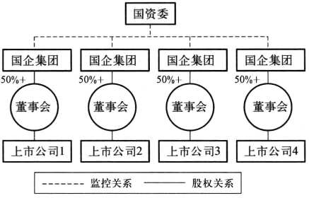
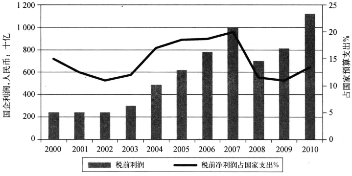
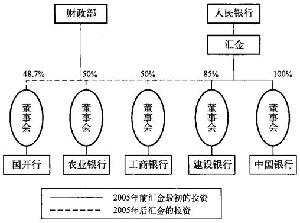
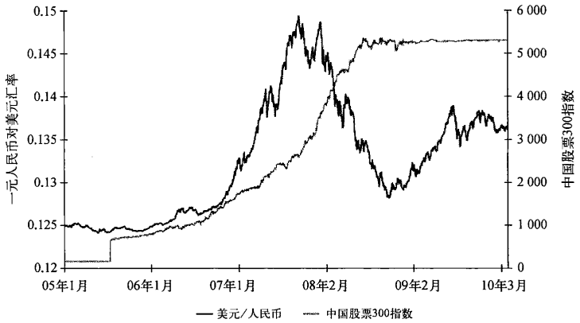
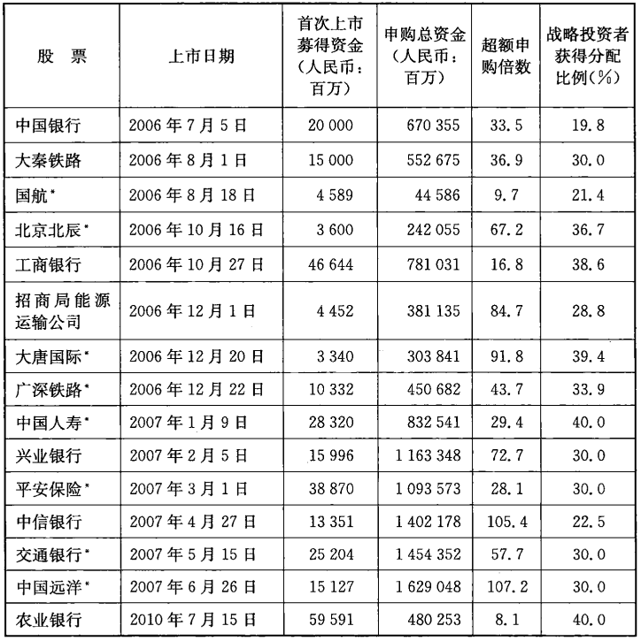
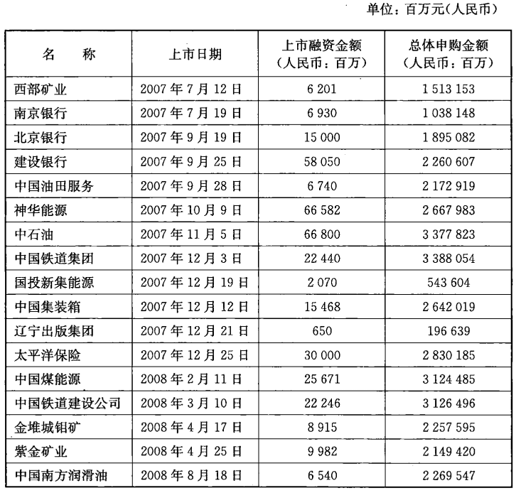
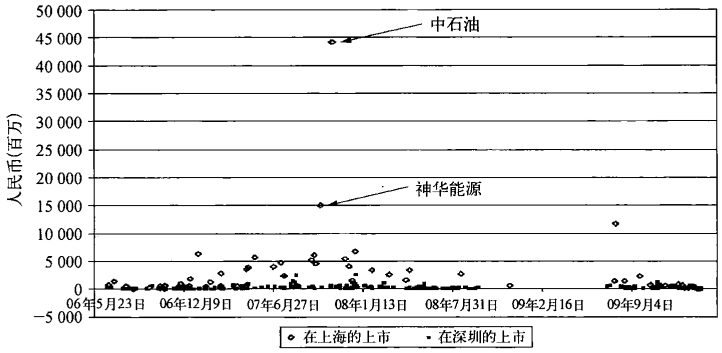
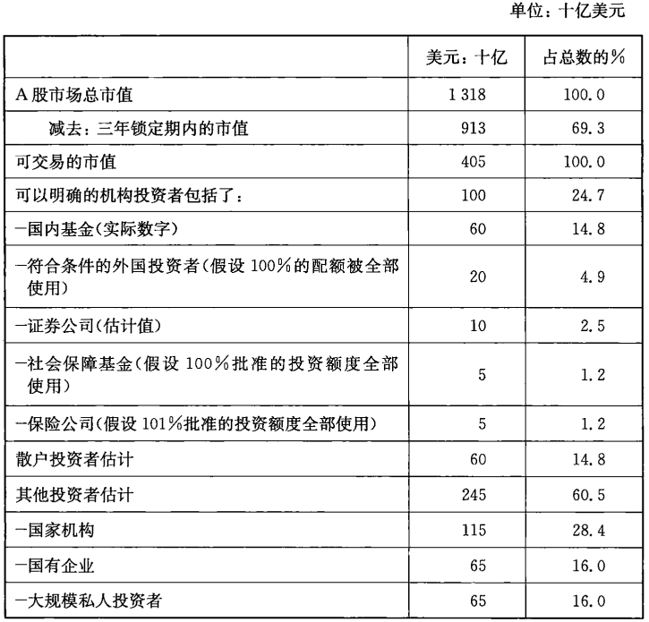

# 第七章 “国家队”与中国政府

    我国社会中目前存在的种种权贵资本主义现象，究其根
    源，就在于不受约束的权力对于经济活动的干预和对于经济
    资源的支配，旧路线和旧体制的支持者要求加强国有企业的
    垄断地位，加强政府及其官员不受约束的“专政”权力。

                    —— 吴敬琏2009年9月28日《财经》

  毫无疑问，中国政府最初的政策目标是打造出一支可以在全球范围内
参与竞争的顶尖级企业“国家队”。然而，这支依靠国家政策而被打造出来
的“国家队”，从一出生就带有明显的政治优势而不仅仅是经济优势，最终也
导致这些带有垄断优势的企业得以影响政府的政策制定。与此同时，在中
国的这些银行的协助下，一个又一个“国手级企业”被缔造出来，一度让人以
为这些“巨头”大有取代政府影响的可能。1998年，中央政府各部、委实行机
构改革，不仅缩减了超过50%的人员编制，也撤销了带有明显计划经济痕迹
的各工业部委。这些部委包括了：煤炭工业部，机械工业部，治金工业部，石
油工业部，化工部和电力工业部。在这些部被撤销之后，中央又相应地成立
了国家局，仍然监管在各自管辖范围内新组建的企业。这些新的国家局以
及他们管辖范围的新企业都由国家经济贸易委员会（国家经贸委）这个机构
进行管理[^7-1]，而该机构在不久的将来也被撤销，其部分职能则被并入另一个
新的机构。

  部委被撤销之后，国家经贸委也重新组建，但是那些新组建的企业则得
以保留。紧接着，在2004年，国有资产监督管理委员会成立，以明确国有企
业的所有权。国有资产监督管理委员会是国务院直属机构，代表国家履行
出资人责任。但是这个委员会并没有发挥其预想中的作用，很大程度上是
因为这个机构的建立是依据前苏联模式，根据自上而下的组织原则进行管
理。而21世纪的中国企业因为股票市场的长足发展，早已经将西方市场概
念下的企业所有权概念发展得更为深入人心，几乎达到取代国家所有权的
地步了。为了更好地阐述这一点，我们将会把这个委员会与其管理的下属
央企之间的关系和中央汇金对中国主要金融机构的投资方式做个比较。

[^7-1]: 国家发改委的前身是国家计委，于1952年成立。国家计委在1998年更名为国家发展计划委员会。在2003年和国务院经济体制改革办公室和国家经贸委的部分职能合并之后，更名为国家发展和改革委员会（国家发改委）。

## 1998年机构改革

  经历机构改革之后诞生的新的国家局，较之以前的部、委人员大幅度减
少，并且这些局的领导失去了部长的级别，而其管辖范围内的企业，很多董
事长或者总经理在加入这些新组建企业之前原来都是在同一部委工作，还
大多曾担任现在这些局领导的上级，因此要指望这些局领导对管辖范围内
的企业问责并不可能，因为他们并不具备这种资历。换句话说，通过撤销各
工业部委而同时打造这些国家级顶尖企业的努力，最终只是让这些大部委
摇身一变成了西方概念下的企业组织，而企业里的人员也只是从原部委里
的人员摇身一变。因此，并没有改变这种企业的实质，也许那时不具备条件
推动改变。

  不过这里有一个例外值得注意，那就是四大国有商业银行，虽然经历了
各种各样的变革，这四家银行却仍然是副部级单位。一个机构在国家组织
架构中的地位是由该机构最高领导人的地位所决定的，而这些银行的最高
领导人的行政级别都是副部级，出现这个例外显然是有原因的：多少包含了
“银行不仅隶属国务院，同时也服务于其他央企”的意味。银行在前苏联式
的计划经济时代对经济只是起一个金融推动的作用，而经济发展的主要动
力来自其他非金融企业。从这一点来说，四大银行改革前和改革后并无太
大差别。

  虽然工作地点从部委变成了央企，但是这些前部委的官员们依然保留
着他们在党内的职位。有关材料表明，在这些划归国有资产监督管理委员
会管辖的100多家央企中，有54家企业的董事长和总经理享受部长级待遇，
并由中央组织部直接任命[^7-2]。这些企业领导的级别和省长及国务院下属的
其他中央各部的部长相当，有很多甚至还在中国共产党中央委员会中担任
委员或者候补委员（见表7一1）。试想一下，当中石油的总经理向一家中国
的大银行要求发放贷款的时候，这家银行的总经理会怎么做？他恐怕只能
说：“承蒙您的关照，您只管说想借多少，借多长时间就是了。”

[^7-2]: 柏思德(Kjeld Erik Brodsgaard)：未发表手稿，2010年4月。

表7-1 国家队：其在中共中央委员会中的代表

所属公司                    领导人名            候补委员        委员
----------------------     ---------------   -----------     --------
中国核工业集团              康日新                                x
中国航天科技集团            马兴瑞                 x
中国航天科工集团            刘石泉                 x
中国航空工业集团            林左鸣                 x
中国船舶重工集团公司        李长印                 x
中国北方工业集团            张国清                 x
中石油                      蒋洁敏                x
中石化                      苏树林                x
国家电网                    刘振亚                x
中国电信                    王晓初                x
鞍钢集团                    张晓刚                x
宝钢集团                    徐乐江                x
中国铝业                    肖亚庆                x
中国商用飞机有限责任公司     张庆伟                               x
中国铁道建设总公司          石大华                 x
中投                        楼继伟                x
中石油大庆油田              王玉普                x
太原钢铁集团有限公司         陈川平                x
海尔集团                    张瑞敏                x
合计                                             17             2

资料来源：柏思德（Kjeld Erik Brodsgaard)，，未发表手稿，2010年4月（原书使用的是中共十八大以前的资料——译者注)

  那么这种由党来任命企业领导的制度，对这些央企的管理上级国有资
产监督管理委员会又会产生什么影响呢？国有资产监督管理委员会是在
2003年由国务院批准建立的，其前身是国家经贸委，是由在此之前其他负责
监管这些央企的委员会和国家局整合而成的。这个机构的性质只是事业单
位，而不是一个政府机构，因为要建立一个拥有如此大权力的政府机构，必
须通过人民代表大会这个国家最高权力机关的审议和批准。当时有很多观
点认为只有人民代表大会才是这些国有资产的合法拥有人，这些观点声称：
人民代表大会，根据宪法的规定，是可以代表全体人民的唯一合法代表，因
此人民代表大会比国务院更适合负责组建这个委员会。但是，成立国有资
产监督管理委员会这一行动被加快实施，最后在人民代表大会2003年3月
召开之前，这个委员会就已经成立了。

  委员会成立时，关于新委员会的规格是经过慎重考虑的。一度，这个新
委员会被设想成拥有与大企工委相当的规格。大企工委是国有资产监督管
理委员会的两大组成部分之一，是由副总理级别的党员干部担任领导。另
个可以借鉴的规格是国家经贸委，由部长级别的干部担任领导。最终后
一种方案被采纳了，而正是这个选择，使新委员会的监督管理权力从诞生之
初就已经大大削弱了。理由很简单，为什么一个中央直属的企业要接受一
个类似于非政府组织的机构管理监督呢，更何况这个非政府组织的机构的
领导还只是个部长级别？如果是副总理，情况可能就大不一样。

  尽管如此，国有资产监督管理委员会还是被国务院赋予了几项极其关
键的任务：一，代表国家履行出资人职责，监管这些被称为“社会主义支柱”
的央企；二，开展央企高层领导的人事工作；三，决定如何把央企上交的红利
进行投资。在这三项主要任务中的具体执行过程中，这个委员会都遇到了
不小的麻烦，不仅仅是因为其本身非政府机构的性质，还在于其规格和其承
担的责任并不相符。

  首先，国有资产监督管理委员会并非这些央企的“合法”的出资人（见图
7－1）。之前的那些各工业部委可以这么说，是因为他们是政府部门中的一
员，因此监督其下属企业的投资活动完全合理。而在这些企业的战略资产
被剥离原企业上市成为“国手级企业”后，原企业没剥离的部分便成了事实
上的对这些“国手级企业”的实际出资人。相比之下，国有资产监督管理委
员会只不过是在部委被撤销之后所“添加”的一个监管机构而已。其次，虽
然这个委员会拥有任免央企副总经理和首席财务官等职务的权力，企业的
最高领导人却仍然由中组部任命。在这样的情况下，即便这个委员会是政
府部门，也无法对由中组部任命的企业高层采取任何措施。要知道，这些企
业的最高领导人们并不向任何政府的部长按照政府的架构负责，而是按照
党的组织结构进行层层负责。

资料来源：《21世纪经济报道》，2010年8月9日，11；2011年《中国统计年鉴》

  最后，一个可以证明该委员会相对脆弱的地位的例子是，虽然该委员会
竭力争取，被该委员会——这个所谓的“出资人”——监管的央企们，从来没
有向该委员会或者财政部上交大量的企业红利。即使是度过了三年“红利
豁免”的试运行期，2007年以后，红利的金额也只是在税后收入的5%至
10%之间，并且这些上交的红利也全部被再投入到与这些央企相关的项目
中去。这些央企的利润相当庞大，尤其是最近几年，几乎占到了中国年度预
算开支的20%（见图7－2）。这些资金完全可以被更好地运用到其他方面，
比如填补财政赤字。可是，因为这些企业的特殊政治和经济地位，加上有一
些“幼稚”的观点认为这些企业继续承担着国家社会福利的义务负担，这些
“国手级企业”依然可以保留他们绝大部分的利润不用上交。

  国有资产监督管理委员会的整体权责规划都明显带有前苏联时代部委
系统的特征，而这一系统在1998年被丢弃了。在那个系统中，国有企业直接
对其相应的上级部委负责，被部委归口管理；贯穿其中的党组织架构就类似
于人的神经中枢。部委对企业是全面管理的，涵盖了从投资决策，人事决
策，到资本和资产的处置决策等。当部委被撤销之后，这个关系链就断了。
虽然很多人设想，有了国有资产监督管理委员会之后，运行机制应该和过去
有部委的时候类似，可是国有资产监督管理委员会还是不能取代这些部委
的功能。这个委员会最多也就相当于国务院下的一个执行状况检查部门。
前苏联的模式在21世纪的中国恐怕再也行不通了。

## 国资委模式和汇金模式的比较：谁拥有谁？

  人民银行在创建中央汇金公司的模式的时候，是故意采取了有别于国
有资产监督管理委员会的模式，并且充分吸取了国际上通行的企业模式，汇
金是个有限责任制的投资公司，而不是任何形式的政府机构。汇金成立的
初衷是为了方便中央银行在重组四大国有商业银行的过程中，可以直接向
银行注入资本。事实上，汇金向四大银行以外的很多银行也都注入了资本
（见表7－2）。2003年年末，汇金向中国建设银行和中国银行总共注入了
450亿美元的现金资本，获得了这两家银行近100%的股份。2005年，汇金
对中国工商银行注资150亿美元，并获得其50%的股份。

  这种直接持股之所以成为可能，离不开之前在第二章中提到的针对“好
银行”和“坏银行”的区别对待。对于银行重组来说，资产被剥离下的银行
实质上既成了“环银行”，也同时成了“好银行”的出资人。结果，从“好银行”
支付的红利收入无一例外地流入了同一银行。把不良资产从一个机构转移
到第三方机构可以避免政府直接持有这些银行的股份。到2005年为止，汇
金已经凭借其拥有中国建设银行和中国银行的多数股份代表国家控制两家
银行的所有权，并且与财政部一起参与持有工商银行、国家开发银行和农业
银行以及其他一些金融机构的股份。

表7－2 “金融国资委汇金的投资，2009财年

机构           投资日期           金额    上市前持股%      上市后持股%
---------- ---------------  ----------  -------------   -------------
中国银行    2003年12月30日    225亿美元            100          67.55
建设银行    2003年12月30日    225亿美元            95*          67.97*
建银投资    2004年4月4日      25亿美元             100             NA
中 金       2004年9月17日    3.5亿人民币          43.35           --
工商银行    2005年4月22日     150亿美元             50           35.43
银河证券    2005年7月14日     55亿人民币           100           78.57
申银万国    2005年9月21日     40亿人民币           100           37.23
国泰证券    2005年10月14日    25亿人民币           100           21.28
中国证券    2005年11月2日     11亿人民币            40             NA
中国再保险  2007年4月11日     309亿人民币         84.81            NA
光大银行    2007年11月30日   195.9亿人民币        48.37            NA
国开行      2007年12月31日    1461亿人民币        48.7             NA
中信建设    2009年8月31日      13亿人民币           70             NA
农业银行    2008年10月29日     191亿美元            50          40.03
新华人寿    2009年11月19日   4.46亿人民币         38.82            NA
光大工业    2010年5月7日       44亿人民币          100             NA

注：*包括了建银投资；中国建银成立的目的是为了将那些不包括在上市资产中的资产集中起来。这些资产包括了中金。从2004年起，人民银行开始收购倒闭的证券公司，建银手上的一批中小实体后来都被出售给了人民银行；汇金只直接投资于规模较大的。更多信息请参考本书作者的《私有化的中国》，2006年，第9章。

  简单来说，即使是在2007年之后汇金被中投收购，在2010年面临将被
如何处置的不确定性，汇金依然拥有合法地位来直接影响被控股银行的决
策，这个合法地位就是通过其占绝大多数的股份而获得的股东投票权来体
现的。银行的最高领导人仅仅依靠副部级在大股东面前显然并没有什么借
口可以推托责任（见图7一3）。当然，这一切都建立在一个前提的基础上，汇
金的合法地位需要获得中央的认可。不过从这些年汇金能够持续运营来
看，中央对这种结构和安排还是认可的。

## 超大规模投资者和超大上市规模

  2001年年中到2005年年中这段时间，中国股市在政府进行股市改革的
同时经历了一个“大熊市”。到2005年为止，一个可以帮助股市中最主要的
利益相关者——国家持股企业能够从大熊市开始前的水平上再度腾飞的解
决方案被找到了[^7-3]。在接下来的18个月，上证股票指数奇迹般地从1000点
以下攀升到2006年年底的3000点。其攀升的直接原因就是中国在此期间
“入世”的消息以及中外投资者对中国坚持开放的信心。但深层的原因其实
是，国内投资者肯定的判断，认为那些大规模的非流通股不会在2008年北京
奥运会召开之前进入股票流通市场。没有了这个顾虑，更多的争议在于央
企尤其是银行的“境外返回境内上市”现象，即在中国香港上市之后再返回
上海证券交易所上市。在这期间，人民币慢慢开始出现升值迹象也是导致
股市大涨的另一个原因。

  这种种原因，都造就了一个“英雄式的人物”——尚福林，中国证监会主
席。尚福林是在2002年走马上任的，在此之前，他曾经担任过中国农业银行
行长，是个坚定的保护主义者，在其上任证监会伊始，曾坚定主张不允许这
些在境外上市的企业回境内上市。他的目标很明确，就是监督和挽救国内
的股票市场和处于崩溃边缘的中国证券行业。他竭尽全力，几乎动用了所
有可能的政治和经济手段来振兴市场，可是都没有奏效。2004年后期，周小
川的改革团队给他提供了一条行得通的方案。尚福林在这一方案得到肯定
之后，立即开始着手实施，这个时候，正是人民币开始对美元升值的时候（见
图7－4）。2006年和2007年的牛市加强了上海的政治地位，也掀起了对部
分符合条件的外国投资者开放中国股票市场的序幕。

[^7-3]: 参阅本书作者所著的《私有化的中国：中国股票市场内幕（第二版）》，新加坡：John Wiley & Sons出版社，2006年版，第9章和第10章。

注：中国股票指数是流通股加权平均指数，覆盖了在上海和深圳上市的A股企业中前300家。

资料来源：Wind信息

  与此同时，三大国有商业银行的重组业已完成，期待已久的上市行动也
在中国香港开始紧锣密鼓地展开。建设银行在2005年年底大张旗鼓地发行
了H股，而中国银行则在2006年6月在中国香港和上海完成了同步上市，
从而重启了国内资本市场的大门，工商银行则在同年的10月在香港和上
海完成了同步上市。这一阶段的上市特征可以概括为上市规模巨大。中
国银行在上海的上市规模为200亿元人民币，而工商银行则是史无前例的
466亿元人民币。在经历如此低迷的熊市之后，政府为何敢于展开如此规
模空前的首次公开募股（IPO)呢？因为有这些“国家队”成员的“亲友团”
参与帮忙。

  在这些超大规模的募股过程中所涌现的战略投资者是个很重要的现
象，可以用来解释市场是如何吸纳如此庞大的股份的。在1999年股票市场
出现类似几乎停滞的情况下，通常意义下的两类投资者，散户和机构投资者
面对新股发行，都裹足不前，于是当时的证监会组织了第三类投资者，即战
略投资者[^7-4]。战略投资者为什么有兴趣投资呢？1999年前，所有有意向参与
新股发行申购的投资者，无论是散户还是机构投资者，都得递交申请，然后
参加全国范围内的抽签。与香港的申购抽签不同的是，内地的抽签不确保
投资者一定可以获得其申购的股份。在中国，申购者的数量越大，申购者中
签的成功率越低。

[^7-4]: 当前主要有两类投资者：1）战略投资者，他们在交易正式对外公布之前参与并且获得了
全额的分配比例，但是他们往往有一年的锁定期；2）在交易对外公布之后再参与的投资者
又可以分为两类：A）一般法人投资者，通常要面临3个月的锁定期；B）线上投资者，包括
散户和其他想参加的投资者，这些投资者的资金没有锁定期。对于最后的这类投资者，他
们参与的方式是抽签，获得股份的多少要视分配的结果。

  举例来说，如果一只股票同时有 1000个申购者，那么每个申购者能够
中签的概率就只有0.1%。不过，申购者可以增加他的中签率，他需要做的
就是在其资金能力范围内递交尽可能多的独立申购，然后按每份申购交给
经纪人全额的订金。由于这个途径的存在，导致了股市疯狂的过度认购。
有的申购者为了确保一个小额的申购可以成功中签，不得不动用相当于整
个股票发行规模的资金作为订金。这样的申购体系对资金不多的申购者
来说是极为不利的，反之，对那些拥有庞大资金规模的大机构申购者却相
当有利，而这些大机构的庞大资金既可以来自自有资金也可以通过银行
贷款。

  这种申购制度在1990年代末经济增长出现停滞和通货膨胀并存的情况
下并不是很有效，因此证监会才组织了这样的战略投资者，这些投资者包括
了一般意义上中国经济体系中的主要参与者，尤其是上市的央企及其控股
集团公司。这些战略投资者在股票正式发行之前就承诺以发行价格购买一
部分股票。虽然他们往往在购得股票后要面临通常一年的锁定期，即在一
年内对股票不能做任何处置，但是他们提出认购的股票数量却是得到优先
保证的。相比之下，一个一般的申购者，不管是通过线上还是线下申购，不
管递交多少份申请，他们能否获得所申购的数量哪怕是一小部分，都是不确
定的。

  2006年，股市复苏，沉寂了一年多的新股发行市场面临着来自央企的一
波波上市热潮，这些战略投资者又再次被推向浪尖。在2006年6月至2007
年6月之间上海证券交易所完成的24家企业上市中，尽管实际发行股票总
量远远小于市场申购需求，战略投资者依然还是成功注资于其中的14家（见
表7－3）。譬如，在工商银行巨大规模的新股发行中，23家战略投资者总共
申购并获得了180亿人民币的新股（见表7－4）以确保上市的成功，这23家
里就有四大资产管理公司中的两家。所有的这些战略投资者无一例外都是
央企。他们的申股要求全部得到了满足，而他们所获得的股份占到了发行
总额的38%。其他投资者，虽然申购的总额为7810亿元人民币，而且这一
金额达到了发行总额的17倍之多，却在发行首日仅使股价上涨了约5%，这
也显示了初级市场的疲软和这些战略投资者存在的必要性。

注：*代表从海外返回内地上市。

资料来源：Wind资讯和原书作者的计算

表7-4 工商银行A股上市中的战略投资者

单位：十亿元（人民币）

名  称                                    获得分配的股票价值（人民币：10亿）
---------------------------------   -------------------------------------
1 中国人寿集团公司                                                     2.0
2 中国人寿有限责任公司                                                 2.0
3 太平洋保险公司                                                       2.0
4 华融资产管理公司                                                     1.5 
5 平安保险                                                            1.1
6 华能集团                                                            1.0
7 广东核电集团                                                        0.9
8 中粮集团                                                            0.8
9 宝钢集团                                                            0.5
10 东风汽车                                                           0.5
11 国家开发投资公司                                                   0.5 
12 首都机场                                                           0.5
13 泰康人寿                                                           0.5
14 太平洋人寿                                                         0.5
15 五矿集团                                                           0.5
16 新华人寿                                                           0.5
17 东方资产管理公司                                                   0.5
18 中海油                                                             0.5 
19 中国再保险                                                         0.5
20 长江电力股份                                                       0.4
21 机械工业集团公司                                                   0.4
22 中国核工业总公司                                                   0.3
23 华泰财产保险                                                       0.2
合计                                                                18.0

资料来源：工商银行2006年10月17日公告

  随着市场的顺利启动，战略投资者也暂时退出了舞台。一直到2010年
7月另一个巨型央企中国农业银行上市的时候，这些战略投资者再度浮
出水面，当时政府试图让农业银行上市得以造就出“世界第一”。虽然农业
银行上市在市场投资者中的反响并不强烈（超额申购总额只是略微高于发
行额的8倍），但是凭借27个战略投资者和他们40%的申购份额还是完成
了最初设定的在上海募集90亿美元资金的任务。在这次战略投资者获得的
股份中，有50%需要有长达18个月之久的锁定期，这也再次证明了市场对
待农业银行上市反应是何等的不踊跃。对比中国建设银行上市来看，建设
银行虽然新股发行募集到的资金比农行的少了10亿美元，但是却吸引了
17000亿元人民币资金的申购总额，还有中铁集团，申购总额更是达到了
4000亿美元（见表7－6）。

  这样的上市模式可以同时满足上市央企和战略投资者们的利益需求。
在如此规模巨大的股票发行之前，已经有大约1/3的股票被提前认购，大大
减少了发行风险。更重要的是，这些战略投资者可以轻松获得在其他战略
性企业的股票，如果不是通过这种模式，战略投资者可能无法获得如此多的
股份。同时，他们也通过线上开展大规模公开申购，这样一来，他们既可以
申购那些没有锁定期约束的股票，也可以确保他们在初级市场所支付的较
低的申购价格能够产生巨大利润，这一点我们将在下一节中提到。这些“亲
友团”在央企的新股发行中以巨大赢利为目的的介入确保了一旦别的央企
需要帮助，这些战略投资者就会挺身而出；同样的，这也暗示了如果将来这
些战略投资者也需要类似的帮助，被帮助过的国企也会“投之以桃，报之
以李”。

  表7一5列举了在农业银行上市过程中的这些所谓的“亲友团”。最大的
投资者包括中国主要的保险公司和其他央企的附属金融企业。在这往下的
173个投资者几乎都是来自国有资产监督管理委员会管辖下的央企，比如资产
管理公司和军工企业。这173个线下认购的“亲友团”占了总发行额的20%。
总而言之，农业银行上市募集资金中的大约60%是由政府旗下的央企一手包
办的。这些投资者，虽然由于政策的关系而参与申购，却并不代表就看好农业
银行不令人满意的经营表现。上市后的第一天，股价仅仅上升了1%，这和股
市即使在相对疲软的2010年还达到平均溢价69%构成了鲜明的对比。

表7-5 农业银行A股上市里排名最前的20位线下投资者

单位：百万元（人民币）

名 称                                      分配获得的股票价值(人民币：百万)
-----------------------------           ---------------------------------
1 平安人寿指定账户                                                 1668.6
2 中海油专有账户                                                   1195.4
2 生命人寿指定账户                                                 1195.4
3 人民保险管理账户                                                  929.3
4 平安保险专有账户                                                  896.6
5 太平洋保险管理账户                                                650.5
6 泰康人寿管理账户                                                  525.3
7 中国电力财务公司专有账户                                          448.3
8 新华人寿指定账户                                                  366.1
8 全国社保指定账户                                                  335.9
9 中信信托指定账户                                                  278.8
10 中国航空工业集团所属金融公司专有账户                              149.4
10 德意志银行符合条件外国投资者账户                                  149.4
11 嘉实300指数基金                                                   97.6
12 大亚湾核能金融公司专有账户                                         92.2
12 红塔证券专有账户                                                  92.2
13 博时稳健基金                                                      83.4
14 易方达50基金                                                      72.2
15 富国天益价值基金                                                  55.8
15 景顺成长型股票基金                                                55.3

资料来源：2010年7月8日农业银行公告

  农业银行的新股发行是在2007年“上海股市泡沫”破灭之后登场的。那
年六月以后，市场的泡沫达到了最高潮，四个月指数上升了50%，达到了
6100点。很多人在当时的一片看好声中，都坚信指数在年底会突破10000
点。就是在这一时期，有另外17家公司在上海证券交易所上市，他们是：中
石油、中国神华能源和建设银行。这三次上市都没有战略投资者的参与（见
表7－6）。不需要的理由很简单，市场流动性很高，上市的成功几乎可以得
到保证，不需要战略投资者的推波助澜。

资料来源：Wind资讯和原书作者自己的计算

  散户对这些新股发行并不是没有兴趣。可是，在任何市场条件下，要确
保能够获得中签而需要支付的平均申购订金实在是让散户“心有余而力不
足”。2006年年中至2007年年中这段时间内，线上“散户”的平均申购订金
额是70万元人民币，而到了2007年下半年，当战略投资者暂时从市场销声
匿迹的时候，这一金额已经达到了120万元人民币。在这个时期，每个新股
发行，都有超过100万的散户在线上参加申购。中石油则吸引了超过400万
个线上申购。因此当这些散户涌向市场推高申购数量的时候，他们在申购
的订金上却只占了很小的一部分，占大头的还是机构。

  线下申购所涉及的资金是让人膛目结舌的。比如，在中石油上海上市
的过程中，484个机构投资者成功地在线下申购了大约是总发行额25%的股
份，其中获股份最小的是电器制造商海尔集团，获得了2089股，同时获得了
164万元订金的返还。获股份最大的则是中国平安保险，共获得1.19亿股，
并获得932亿元人民币的订金返还。在平安之后就是中国人寿，获得1亿股
和785亿元人民币的订金返还。如果你有幸可以看到这份展现了中国金融
和工业界翘楚的机构投资者名单，你会从中发现，中国人民解放军兵武公司
也赫然在列。

  如果当初成立证券交易所的初衷是为了确保党领导社会主义经济的基
调，那么中国在股市方面的历程则已经大大超越了初衷。

## 初级市场表现：让每个人都满意

  除了抽签制度催生的认股热潮，由证监会设立的股票定价机制也可以
说明为什么人们对新股发行抱以极大的热情。简而言之，股票发行价格在
市场需求高涨的情况下，却被人为设定在较低的水平，因此在发行日当天儿
乎可以肯定的是，股价将大幅度上涨（见表7一7）。这个方法也减少了证券
公司因为承销包销费用过低而承担的风险。但是这一切都有个潜在的负面
效应，那就是这种人为扭曲了的定价机制降低了投资者为了寻求股票的真
实价格而了解上市企业和其所处行业的需要。

表7-7 A股上市首日价格表现                     单位：%

年 份       上市的数量         首日股价平均上扬(%)         首日股票平均换手率*(%)
--------  ------------  -------------------------   --------------------------
2010              127                         47                            69
2009               99                         74                            79
2008               77                        115                            80
2007              126                        193                            65
2006               66                         84                            70
2005               14                         48                            58
2004              100                         70                            55
2003               67                         72                            52
2002               68                        134                            62
2001               77                        138                            64
2000              135                        152                            59
1999               93                        113                            60
1998               92                        149                            62

注：＊代表实际出售股票的金额占上市首日允许出售股票金额的百分比。

资料来源：Wind信息；原书作者的计算；2010的数据截止至3月31日

  由于定价机制最后简化为一个数量化公式，承销包销商不需要去理解
如何判断一个公司的运营风险和其股票的价格风险。更糟糕的是，广大投
资者，无论是机构还是散户，也从来没有接受过正确的教育和引导，比如如
何对不同公司股票的定价判断，如何判断其未来发展的走向和如何识别投
资风险等。长此以往，一个可以预见的结果就是企业本身变成了一个商品，
而能够获得股票——任何公司的股票则成为了最终的目的，超额申购成了
普遍现象。从另一个角度来看，这些央企的股票价格并不反映这些企业里
管理者的能力，企业的技术开发和进步，企业家的天赋或者单纯的公司业绩
的增长。反之，股票价格反映的是政府操纵股票市场指数的一种能力，一旦
有需要，政府可以操纵股市指数上升，从而使得这些央企持有的股票价值也
跟着上升。中国投资者将他们的股票市场称为“政策市”就是这个原因：市
场随着对政府政策的预期而改变，而不是随着企业经营状况。也就是说，在
中国，能够为企业创造附加值的是政府而不是企业本身。

  尽管如此，价格虽然不是衡量企业经营前景的指标，还是发挥着显著的
作用。正如之前提到的，证监会的定价公式把股票发行价格人为压制在市
场需求水平的价格以下，而造就了在发行日股票价格成两位数甚至三位数
的增长。换句话说，监管者要求企业和他们的承销包销商对股票定价采取
完全和西方市场背道而驰的原则。中国的上市企业受其监管者的规定，必
须将他们值两元钱一股的股票以一元钱卖出去。

  从国际的眼光看，由于这种强制定价模式带来的对企业的损失是巨大
的。以中石油这个极端的例子来说，中石油在上市新股发行中募集了670亿
的资金，而市场的申购订金总额为34000亿元人民币，其实际股票价格和市
场清算价格的差别见图7－5。中石油的廉价股票意味着企业将大约450亿
元的价值白白扔掉了。丝毫不让人惊讶，在上市之后，中石油的股票价格
升了近200%，也使中石油的市值达到了1万亿美元。从发达国家市场经验
看，这是一种触犯法律的行为。从国有资产监督管理委员会的角度来看程
度则应该更为严重，因为这就等于是把国有资产贱卖。而从企业的角度看，
一位精明的企业总经理应该扪心自问为什么要把占其企业10%的资产，以
二级市场认可的价格的一半在一级市场给卖出去？换句话说，他把价值94
亿美元的股票以35亿美元给卖了出去。如果按照国际的通行惯例，这位总
经理应该把助其上市的投资银行马上解雇，然后企业董事会立刻也将其自
己解雇。

  但是这些价值，其实对国家来说并没有流失：这些价值只是被转移到其
他央企——那些帮助其完成上市计划的“亲友团”。从这个角度看，央企上
市只是进行一次国有资本在各央企单位之间的重新分配，当然也不排除有
一小部分价值流入到散户和共同基金投资者囊中。

注：图里的点所代表的计算为：将首日股票出售成交的价格减去初级市场分配时所确定的
价格得到差价，然后用差价乘以首日在二级市场上售出的股票数量。

资料来源：Wind信息和原书作者的计算

  中国神华能源的前董事长陈必亭曾经郑重其事地说过，“（神华）的发行
价格在我们预料的范围内，但是我还是有一些失望。”[^7-5]他所谓的失望，是因
为神华上市首日的价格仅仅上浮了87%，只给帮助神华的那些“亲友团”馈
赠了大约150亿人民币的价值。正是这样的“慷慨解囊”成为了2007年股市
泡沫的一个标志，而陈必亭显然希望公司的股价至少可以翻一番。如果他
是中石油的董事长，他一定会开心得多。相比之下，当中石油的董事长蒋洁
敏面对其“亲友团”的时候，他可以完全信心十足，因为他知道他已经给这些
“亲友团”留下了极其可观的利益，完成了党交给的任务。更重要的是，他也
知道，将来在他需要这些“亲友团”帮助的时候，他们也一定会继续做出类似
的帮助。

[^7-5]: 陈必亭：《神华上涨87%但是主席仍不满意》，《南华早报》，2007年10月10日。

对于这些由党任命企业最高领导人的企业来说，并没有独立性，有的只
是党的组织性，因此属于哪个工业部门，并不重要。另一方面，试想一下在
工商银行上海新股上市中属于战略投资者的两家资产管理公司，当他们知
道他们有足够的快钱可以向人民银行和商业银行支付债券利息的时候，他
们会是何等的想法呢？

## 谁的热钱：二级交易市场

  股票市场这台赚钱机器，在初级市场价格被人为压低而二级市场流通
性却很高的情况下，运转得最为出色。这种利好的环境也会使得那些掌握
在战略投资者手中，却依然在锁定期内的战略投资升值。和初级市场相似，
二级市场里的资金的来源并不如政府希望我们相信的那样来自散户。可以
说从1995年迄今为止，中国的二级市场主要是被机构投资者把持，这些机构
交易者包括，央企和其他国家机构，他们的投资决策可以直接影响市场指
数。虽然没有确凿的证据，但是据估计，2007年企业利润中有高达20%来自
股票交易。本书的作者们也曾经接到过一家刚刚上市的企业打来电话，咨
询如何为企业管理层手上的一些流动资金开辟一个股票交易专柜。由于可
以从时下红火的股票交易中获得远超银行存款利率的回报，以及“炒股”易
于被掩盖的财务隐蔽性，不难想象一个企业的首席财务官会多么想跃跃欲
试，赚些既容易来，又来得“快”的现金流。

  虽然关于股票交易投资者的信息并不公开，表7－8还是提供了2006年
年末,股市即将大涨之前的一个大致的中国A股市场的投资者的分类。由
于在2005年市场改革之后，原来央企投资者控制的股票仍然被限制为非流
通，因此流通股市场的市值是我们知道的数目，即2006年年底达到了4050
亿美元。国内共同基金的规模每季度都有公布。而对散户投资规模的估计
是建立在一个假设之上：一半散户通过共同基金投资；一半则直接投资。如
果确切的话，这就意味着散户占到了整个二级交易市场30%的份额，不过这
个估计可能超出实际情况。虽然符合条件的境外投资者（QFII)投资的具体
证券种类无法得知，但是他们获得的投资最大额度是公众知道的，而社保基
金和保险公司能够投资股票最大额度也都是已知的。表中的假设是，这三
类投资者都将其允许投资的最大额度100%用完，这三个总共可以投资于股
票市场的最大资金额是300亿美元。把上面所述已知或者可以推测的投资
者的资金规模汇总，我们可以发现，在2006年年末的A股市场里大概至少
有剩下的60%，金额为2450亿美元的资金，我们无法判断这些资金的来源
或者投资者是谁。

资料来源：《中国经济季刊》，2007年第1季度，第11页

  谁最有可能成为A股市场中主要的未知投资者呢？几乎可以肯定的
是，这些投资者中一定包括了很多境外华商持有的大资金，他们通过适当手
段有可能避开禁止外国人对A股直接投资的限制条例而直接投资中国的A
股。有意思的是，在2006年市场还在积蓄能量的时候，很多中国国内的金融
记者相信一则流言，说是仅某一方面所属的机构就从海外转回国内1200亿
美元的资金并且全面投入股票市场。尽管这个金额未必真实，但是可以想
象，有那么一小部分资金从境外被转回境内，然后在2006年股市即将上行的
时候被投入股市是完全有可能发生的。但是应该可以确定的是，央企和其
他国家机构除了持有那些尚在锁定期内的非流通股，一定还持有另外大约
1800亿美元的流通股。

## 赌场还是成功，还是两者皆是？

  上海和深圳证券交易所成立已经近20年了。如果我们还视之为赌场的
话，那么它们为什么可以如此成功呢？它们又是如何被外界视为中国经济
改革的风向标，在中国的经济模式中扮演着如此重要的角色呢？答案很简
单：这两个交易所都在创造财富。市场被流动性和投机力量所推动，公司所
作出的武断的商业决策更多是受到政策的影响而非以本身的利润作为考虑
问题的出发点。但是从另一个角度说，这么做也无可厚非，毕竟这些公司资
产都是体制内的资产。

  这样的市场可能会让发达国家的投资者望而生畏，但是中国人早就习
惯了这样的政治影响和自相矛盾的讯息。他们依然乐此不疲，利用市场来
赚钱或者被市场所利用。如果你花10块钱买股票，以15块的价格卖出去，
你就赚了5块。把钱存在银行或者投入债券市场是赚不到这个回报的，利率
永远是有利于作为贷款人的国有企业，不是借出资金的人，因此这些金融产
品并不能提供一个高于通货膨胀率的实际回报。

  在中国，只有两个市场可以带给你高于通货膨胀的实际回报，房地产和
股票市场。在两者之间，股票要更受青睐，因为股票市场比房地产市场更灵
活一些（那些有能力的人两者都可以操作）。股票市场的投资规模要小一
些，但是流动性却比房地产市场要高很多。和利率比起来，作为股票市场上
的类似指标的市盈率更依赖市场，因此只要市场上有人要买，市盈率要多高
就有多高。在2006一2007年“大牛市”的那段光辉岁月里，上海市场的整体
市盈率从15倍升到50倍。由此带来的价格的上升空间可见一斑。

  中国的股市并不存在股票投资者，身在其中的每个人都是投机者。中
国的历史和过去苦难的经历提醒人们行情的反复无常，因此采取长期的投
资态度是不足取的。这造成了股市里短线的交易占了主流，股民们都梦想
着能够迅速获得回报。唯一的那个长线投资者就是国家自己，它已经拥有
并且控制了“国家队”。相比之下，在发达国家，公司的所有权则要分散得更
为广泛，对大公司来讲,没有一个单一的股东可以持有超过其总流通股50%
的所有权。比如说，瑞士最大的银行集团，瑞银的最大股东是新加坡政府投
资公司，只有不到7%的持股比例。和中国银行相比：即使在上市之后，银
行的最大股东汇金仍然控制着67.5%的股权。

  由于包括香港在内的中国股市，并非决定企业控制权的场所，因此股票
价格所体现的很少关系到整个公司，因为永远不会发生公司整个被出售这
样的事情。这也就是为什么在中国并没有真正意义上的兼并和收购，肯定
不会发生的是非公有企业收购上市的国有企业。相反，市场的整合往往是
由政府的一纸命令推动的，整合的过程也是通过将上市和非上市的资产通
过主观的估值混合在一起。这让股票价格仅仅反映在某个时简间点的市场流
动性和需求。市场里的高交易量是最误导人的一个特点，因为这给了场外
观察家们一个假象，即市场是真实有效的。高交易量让人误认为价格体现
了人们对经济或者公司前景的判断。事实上，在中国，高交易量所体现出来
的是过度的流动性。

  所有的市场都为多种因素所驱动，包括流动性（体系里有多少钱在流
动）、投机行为（认为可以通过市场的波动来赚钱）和经济的基本面（基本的
商业前景和上市公司的表现）。中国的市场经常被发现脱离国家的现实经
济基本状况。粗略地比较一下国民生产总值的增长幅度和市场的表现，你
就一定可以发现在二者之间并没有太大关联度。只要中国的A股市场和经
济基本面关系不大，市场就总像个赌场，对投资者来说蕴含着极大的风险。
然而中国的投资者却出于本能地知道他们该买的股票是什么，因为他们认
为股票价格还会继续上涨，这个判断并非因为发行股票的公司上季度的财
务数据不错，也不是经济上一年运行是多么光彩夺目。

  贯穿1990年代，政策制定者的目标中很大部分是培育或者引进更多长
线的机构投资者，和发达国家那样来完善市场的基本构成。基于此目的，证
监会在1990年代后期缔造了整个国内共同基金市场。在2002年通过合格
的境外机构投资者（QFII)计划引入境外投资者是在这个方向上所迈的另一
步。与本土和境外的经纪公司建立业务往来的公司数量增长以及这些经纪
公司所发布的经济研究报告都基于一个信心，即中国市场正在成为或者将
来会成为更依赖基本面，并且自下而上的驱动机制。

  但是整个努力却偏离了正确的方向。市场之所以像赌场并不是因为缺
乏股票研究。市场缺乏的是以市场和股东利益为已任的负责任的公司。如
果这些中国主要公司的董事长或者总经理根本不在乎国资委，那么他们更
加不在乎上交所或者国内股票分析师。总经理完全知道他的公司所掌握的
资源足以确保其自己股票的表现。“国家队”无论是在市值、交易额还是融
资额上都主宰着中国的股市。

  令人鼓舞的事实是，越来越多的非公有制企业在深圳的中小企业板和
创业板上市，但是这当中大部分公司，除了个别之外，对于整个市场来说都
微不足道。对这些企业，投资者或许可以运用国际上通行的估值方法进行投
资分析，可是对于中石油这样的由国家控股85%的企业（而且只要党的领导不
变，这个比例将持续下去），想要将其和美孚石油来做比较，谈何容易？这在中
国移动或者中国联通也都一样，真能把他们和VODAFONE（英国的一家电
信公司），T-MOBILE（美国的一家电信公司)或者BHARTIAIRTEL（印度
的一家电信公司)来进行比较吗？中国国内通讯市场不允许境外运营商涉
入，这确保了中国移动和中国联通可以很舒服地享受市场双寡头断的地
位。他们在行业和市场监管方面所给予的特别待遇是他们的国际同行所不
具备的。

  这些“国家队”成员都开始一起对陡然间出现资本不足的银行展开投
资，这样个事实肯定会让人产生这样一个疑问，究竟“国家队”是真正意义
上的企业还只是中国政府的延伸？除了这个看法（后者），我不知道还可以
怎么来看待中国移动以58亿美元的代价收购上海浦东发展银行20%的战
略股权或者中国联通以类似的方式收购交通银行的股权等事件？

## 启示

  一直俯视和关注着这些交易的是证券监督委员会和政府。政府在市场
的每个环节都有参与，从监管者、政策制定者、投资者、母公司、上市公司，到
经纪人、银行和银行家。一句话概括，政府是为中国主要国有企业服务的一
名“员工”。伴随着“国家队”的成立，其高级管理人员同时也担任作为权力
中心的党的内部职务，公司治理机制能否有根本性的改观呢？要让他们能
够接受一个拥有实权凌驾于市场和他们自己行为之上的“超级监管者”的角
色的存在，这样的可能性大吗？现有的监管者已经是站在他们一边，为他们
的利益服务，为什么他们需要外国人来告诉他们市场应该怎么运行呢？因
此，对境外投资者的开放并不会意味着会带来根本的改观。事实上，来自境
外的影响只会越来越小，因为中国的证券公司，律师事务所和审计师们都只
会维护他们自己的利益，而且中国式的监管也从上海被带到了香港。

  2009年年末，在这个方向上的第一个实质性的步骤开始实施，当时香港
股票交易所宣布接受在中国香港上市的中国公司经过财政部或者证监会批
准，可以使用中国的审计师事务所。这从表面上看是想让香港和上海同样
有竞争力，毕竞中国的审计师事务所比那几大国际事务所要便宜很多。也
正是由于审计关系到信息的质量和可信程度，国际投资者是否可以信赖这
些本土的公司只用1/3的价格而完成的财务报告呢，尤其是日趋复杂的国内
公司？至于需要财政部和证监会的批准，你可以洞悉如果这么一批公司得
到了批准，这些公司一定是受到国家队和其管理层所瞩目的。如果外资投
资银行和其他机构正在试图打开中国国内市场的大门的话，那是因为他们
知道他们在中国香港可以日进斗金的日子快要到头了。

  因为2003年中国人寿在纽约证券交易所的上市遭到可能违反美国萨班
奥克斯利（SARBANES-OXLEY）法案的调查（最后证明没有违反），“国家
队”中就再也没有一个成员在那里上市过。香港成了“国家队”选择境外上
市的理想地区。现在海外公司正在回归上海，用一位国有企业的董事长的
话说，“在上海，更方便一些”。这样的一种趋势其实发人深省，尤其是在了
解当初中国为什么对海外上市打开大门的背景之后。朱镕基在1993年批准
中国公司在海外上市的时候，一个主要原因是希望通过中国香港监管者的
更为专业和严格的标准，以及国际法律和会计的标准，帮助中国企业提升自
已的管理能力。如果现在有机会可以问朱镕基的话，不知道在经历了这20
年不到的时间，他对当初中国企业和其管理者的目标实现与否有什么想
法呢？

