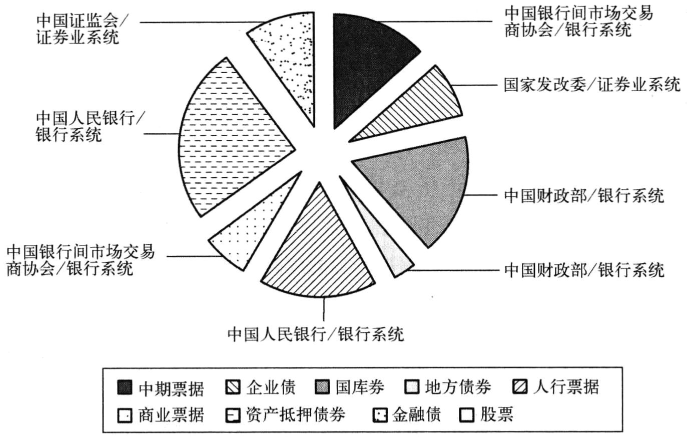
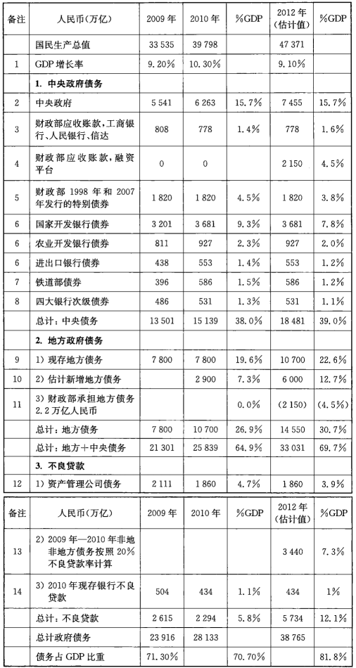
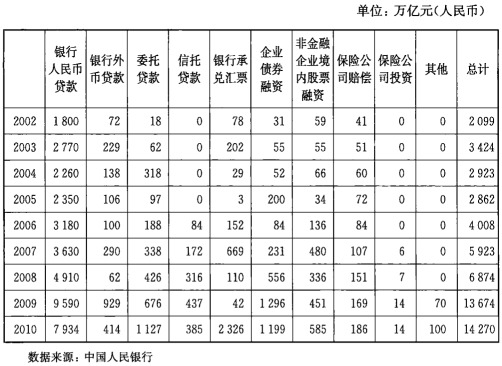
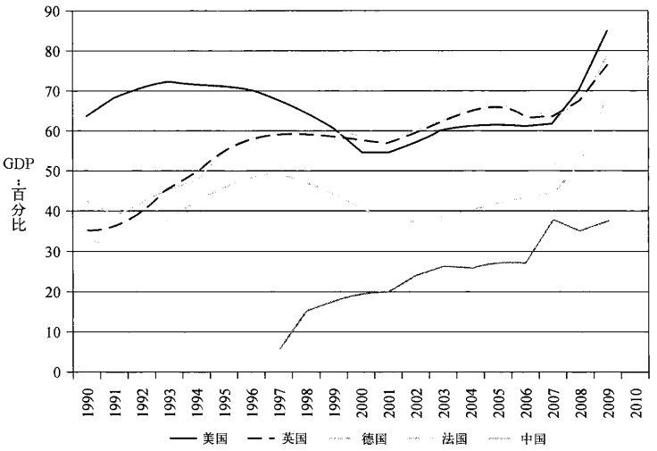
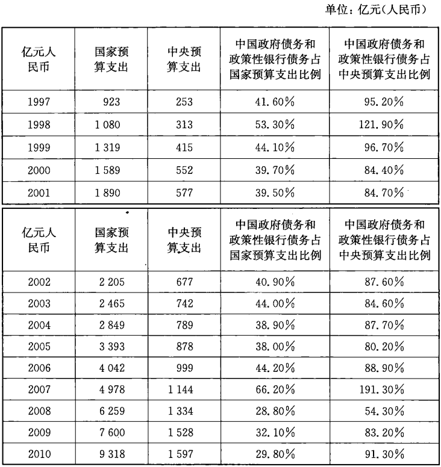
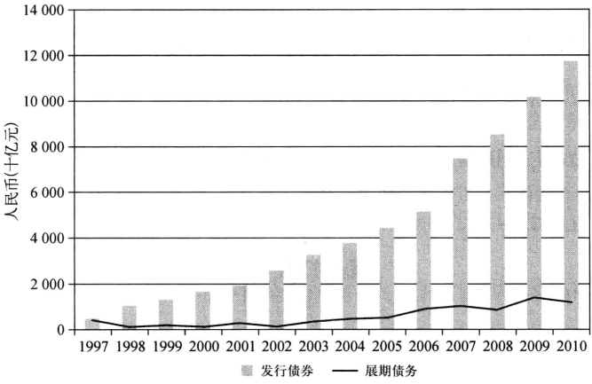
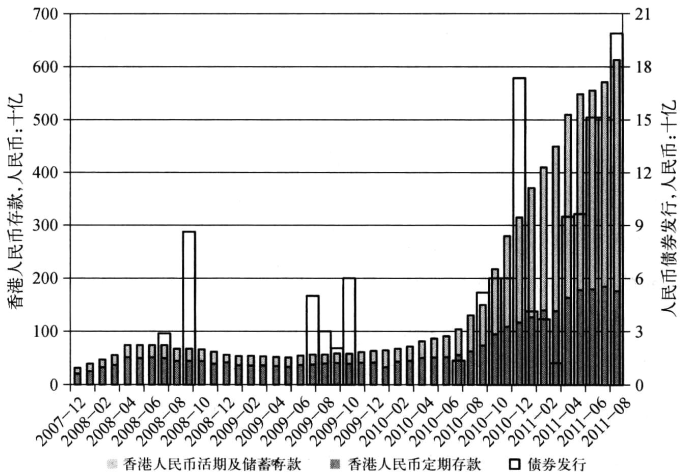
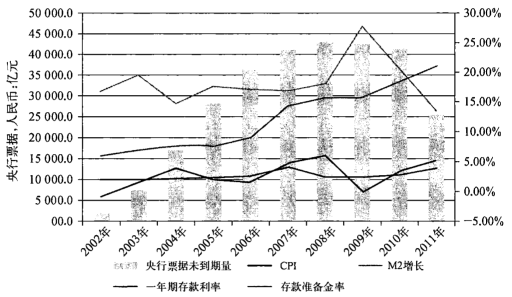
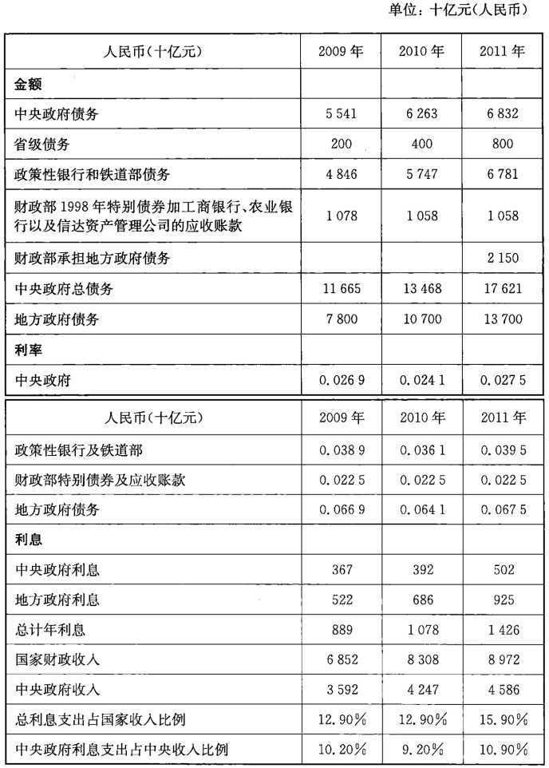

# 第八章 紫禁城

  高耸的朱红色城墙包围着巨大金色屋顶的宫殿，护城河在宫墙外四周
环绕，墙内有隐秘的后花园和精雕细琢的龙纹，这就是位于中国首都心腹之
地的紫禁城。这个杰出的建筑属于中国也属于世界，迄今为止世界上大约
有一半的人参观过这个地方。它的结构布局的深邃含义，或许比元、明、清
历代遗留下来的财宝更重要，并深深地渗入中国社会文化之中。

穿过午门进入整个宫殿，眼前呈现出一个广阔的空间，远处可以隐隐约
约看见环绕四周的宫墙。穿过这些巨大的宫门，参观者走过汉白玉石桥，跨
过金水河,走向太和门。那里是一片更加广阔的空间，,拥有足以压倒一切的
威严，宫墙一直延伸到远方。庭院的整体设计令人惊叹，它把乾坤精华浓缩
一处。然而，当人们进入深宫之后却发现，空间会变得越来越小，狭长的走
廊纵横穿插,而出入口也不大。巨大的墙间隔紧密，阻断了人们的视线。

  游客沿着走廊可以走到皇帝的御花园。那里有亭台楼阁、假山怪石、花
草树木。这些花园美景也是经过精心设计的。在宫殿进口处的宽阔空间，
只是给人一种幻象而已，当人们面对四周高墙的时候必须抬头仰视。只有
皇帝才能在他的宫墙之上俯视大大小小的亭台楼阁。身处下位的人只能在
限定的空间内行事。宫殿的每个区域都被宫墙所分隔，宫墙内的人们只能
在划定的区域内完成分配给自己的任务。

  从古老的紫禁城可以看到中国社会运行的传统模式。北京是中国的政
治中心，那里就像一个由许多权力机构组成的复杂的宫殿一般。每一个权
力机构都向国家的最高领导负责。各个权力机构都只能在自己的权限范围
内，小心翼翼地守护着庭院。

  国家开发银行曾试图取代财政部在中国债券市场上的地位，而中国人
民银行也曾经在对中国主要银行的控制权方面和财政部角力。这都说明在
高大的宫墙内有分工也有矛盾。类似的例子还有很多。中国证券监督管理
委员会（CSRC）的权限范围在证券公司和证券市场，中国银行业监督管理委
员会（简称银监会）有自己的投资银行业务平台信托公司，并可涉足债务市
场。国资委也仿照中投公司，建立了自己的主权投资基金，而中央汇金的成
立和运营模式则仿照了中国外汇管理局的外汇储备投资。当然，很多国有
企业事实上也加入到了这些特殊实体的行列中。当中国石油代表中国政府
到海外并购企业的时候，难道就不是一种主权投资吗？所有这些投资行为
都最终归结为一个问题，那就是：在中国，哪些才不是主权投资基金呢？

  只有一个强大的中央总书记和总理才可以协调这样的工作，以确保按
照党的总体目标前进。只有他们才能把党和政府的领导人团结在一起，并
最大限度地降低工作的成本。在中国这样的体制之下，如果缺乏一个强有
力的领导者，特殊利益集团就会趁机得利。掌管金融大权的副总理是很有
实权的，但如果没有中央的支持，那么他也难以树立起自己的权威。一个央
行行长可能清楚地知道整个金融迷局的关键所在，但除非他能够得到更高
权威的支持，否则最后也将一步步走向妥协。而另一方面，对于“国家队”
（企业）来说，则是各种行政审查审批越少越好。

## 金融王国

中国的证券市场，无论其本身有多少缺陷，它的建立是一个非常伟大的
成就，这一点是确定无疑的。从1992年开始，中国拥有了自己有史以来的第
一个全国性的资本市场。从那时开始，资本可以在国内无障碍地流动，不用
像过去那样受到各种来自政府的管辖与约束。不仅如此，在这些市场的头
顶开始有一个至高无上的“皇帝”监督着他们，这就是中国人民银行。在20
世纪80年代，中国人民银行，或者更准确地说是人民银行的各个省级分支机
构以及当地政府，一直是推动资本市场发展的背后力量。刘鸿儒，曾任中国
人民银行副行长，他被所有中国资本市场的参与者公认为是中国股票市场
的“教父”级人物。自1988年，中国央行开始负责监管中国最初设立的34家
证券公司。事实上从1985年开始，人民银行深圳分行就开始在发展市场基
础设施和规则方面发挥了关键作用，与此同时，中国人民银行总行在协调政
府和市场利益相关者之间的关系方面也发挥了关键的作用。如果没有人民
银行的积极支持，中国股票和股票市场的实践可能已经胎死腹中。此外，更
是在中国人民银行的支持之下，中国走向了国际资本市场。1992年10月，
华晨中国在美国纽约成功上市，这是中国内地第一家在美国上市的公司。
在当时，如果没有与高层领导达成共识，这种大胆的举动绝不可能出现。

  从20世纪90年代开始，一个相对分散的监管环境开始形成。1997年，
朱镕基将政府债券市场从证券交易所和中国证监会的监管之下转移至银行
间市场，由人民银行直接监管。而这仅仅是个开始。2003年，有7个监管机
构负责4大类债券产品，并且股票和商品市场也被逐一切分。每一个监管机
构都有自己的权限范围。人民银行管理着债券市场；中国证监会和国家发
改委管理着证券公司和商品经纪公司；财政部控制着银行；银监会可以管理
信托公司；中国保监会管理保险公司和私募股权投资基金。现在就连国家
发展和改革委员会都要开始尝试建立自己的“特殊目的公司”（SPV），以便其
进入金融市场（见图8－1）。

资料来源：Wind资讯

  当然，这并不是说中国的资本市场一定需要一个单一的超级监管机构
来进行统一的管理和协调。由不同的机构对不同的资本市场门类进行管理
也是有其合理性的，例如股票经纪业务和银行业务就完全不同，反之亦然。
但麻烦的是，在中国过去的几年中，不同的监管机构形成了所谓的“山头”。
如果没有一个强有力的核心领导，那么在这些“山头”之间协调工作就会十
分困难。

  在20世纪90年代，缺乏一个统一的市场监管机构可能并不是一件重要
的事情，在那时银行几乎是唯一的资金来源。但是，亚洲金融危机后，朱镕
基总理从根本上重组四大银行的计划，需要一个更加综合的方法。而重组
商业银行也只不过是当时降低系统性风险的整个大计划中的一小部分而
已。一个综合的解决方案需要各种各样的政府机构参与，包括财政部、国家
发改委、中国证监会和中国人民银行等各方面的协调和积极支持。涉及这
么多部委，由谁来牵头领导呢？直到朱镕基2003年任期结束之前，他都一直
有意愿并有能力领导金融体系改革。而改革的势头也的确从1998年开始一
直延续到了2005年。但是，在2005年当中国人民银行开始着手将金融改革
制度化，把自己建立成为一个超级监管机构的时候，希望维持现状的一方竭
尽全力出手阻止了统一的金融监管体系的建立。

  在前面的章节中我们已经提到，当财政部重新从中国人民银行手中拿
回银行的控制权的时候，这意味着中国的金融体系实际上有很高的内耗成
本。外资投资方通过参与中国银行业的IPO，向中国银行业注入了资金。但
这笔资金事实上可以被视为现金股利的预付款，用来支付财政部发行的特殊
债券的利息。对于他们来说，中国的银行变成了利息支付的管道，同样也可以
用来偿付当初财政部为了重组中国工商银行和中国农业银行而发行的特殊
“应收账款”。这样看来，由于银行成了财政部支付利息的管道，国家预算似乎
就没有必要承担这些支出了。或许这可以解释为什么这个特殊债券不再被记
录在中国人民银行的中央存管机构。2007年12月31日后，这些债券就这么
消失了。此外，从2009年起，各大银行就开始计划融资700亿美元，以填补他
们因为要支付相应的股息所产生的资本缺口。而看上去更别扭的是，中国主
权财富基金突然发现自己原来已经成为了整个银行系统的核心。

  在一个没有所谓“金融皇帝”的时代，管理这样繁杂的金融系统是成本
巨大的。自 2005年以来，已经有一些关于建立一个统一的金融监管机构的
讨论，但很少有任何实质性的结果出现。也许，为了建立一个“超级协调委
员会”，就必须把所有利益相关集团都包括进来。然而，在20世纪80年代末
这样的机构其实已经出现过，但已被证明是不成功的。当过去的一次次监
管机构间协调会议由于“调度困难”而宣告失败之后，谁又会去领导一个类
似这样的委员会呢？

## 红墙背后

因此，如果没有一个强大的力量来推动变革，那么就会更有可能保持现
状。在这个体制中的每一个既得利益集团都牢牢地固守着自己的地盘儿，
追求自己的利益，特别是从银行系统那里拿来更多的钞票。否则怎么去解
释铁道部在这几年里的各种激进的行为呢？这种对于资金的过度追求，使
得中国的公共债务显著增长。表8－1显示了各有关方面在中国公共部门债
务中所占的份额。为了简便起见，在2012年的数据变化中只对地方政府债
务和不良贷款进行了估计，因为这两个部分隐含的不确定性最大。这些估
计是相对保守的，并且仅仅是用来表明已经建立起来的债务规模。

注：（1）原书作者估计2012年GDP增长率9.1%；（2）中央政府、中国国债加GDP增长；（3）财政部应收账款的计算基于银行审计报告和信达的相关报告，《财经》杂志；（4）作者估计；（5）财政部特别债券本金留存为财政部债务；（6）政策性银行债券数据来源自《中国债券》；（7）铁道部负债为本身直接债务，不是下属机构债务，数据来源：Wind资讯；（8）银行次级债，中国银监会；（9）2009年地方政府债务，华尔街日报，2010年5月4日；2010年地方债务，国家统计局；（10）4万亿地方政府债券增量，见经济观察报，2010年5月10日第3页；作者估计为3万亿美元；（11）北京方面透露预计有2万～3万亿的地方坏账，见经济观察报，2011年6月2日；而作者估计数字可能会稍微低点；（12）表3-4数据减去信达2010年向建设银行支付的金额；（13）未来的不良贷款的计算基于净非地方政府债务20%的不良贷款率。2009年和2010年的27.9万亿社会融资规模减去10.7万亿的地方债务，等于17.2万亿；（14）中国银监会。

  这些数字代表着债务。但这并不意味着，通过这些债务进行融资而获
得的资产、服务或者其他什么东西都是没有价值的。但是，这些负债的成
本，已经越过了一个临界值，给经济体造成了沉重负担，并开始抑制经济增
长。这种观点已经逐渐受到越来越多的人的认同。债务在经济中的比例是
一个负面的指标，因为这意味着政府将花费更多的成本来管理这些债务或
者帮银行体系救火，而不是投资创造经济增长。日本是一个最好的例子，当
然还有其他诸如韩国、英国、美国等。关于这个比例有两个红线：一个是债
务占GDP比例的60%，这个是由《马斯特里赫特条约》在1992年所拟定的，
另一个则是80%，这个比例源于对于近期金融危机的研究。

  表8一1显示，如果只把中国财政部的负债（代表中国主权）看作中央政
府负债的话，那么中国2010年的负债比例是16%，远远低于国际的红线。
尽管这是一个普遍的观点，但是这忽略了北京在过去十年里建立起的财务
结构。财政部为国家预算提供资金，主要投资基础设施及其他固定资产。
自从中国在1979年开始改革开放以来，中国的国家预算就长期围绕着基础
设施建设和国企的各种大项目而进行。而今，这些项目都在国家预算以外，
由铁道部、政策性银行、国企本身来负担，而2008年之后，这一责任最终落到
了商业银行的肩头。

  这些近乎于主权机构的负债也应该被列入中国的公共债务里面。这些
类似主权机构包括中国铁道部、政策性银行、主要国有银行的次级债，以及
财政部自身债务。这些部分也应该视作公共债务或者说是国家预算的一部
分，即使其债务不是直接通过国家预算来支付的，但如果事态严重的话，中
国政府将出面承担这部分债务。当我们把这些东西加进去之后，中国的公
共部门负债在2010年则达到了38%。

  中国地方政府的负债也应该被考虑进去，毫无疑问这应该是中国主权
债务的一部分。中国的中央政府历史上一直对这笔债务十分清楚，并意识
到了它的庞大。然而，中央政府对待地方政府负债的态度很矛盾：它是否真
的想知道这笔债务确切的情况呢？最成功的领导人必须在自己的职业生涯
的某个时间在地方政府任职以彰显政绩。由于地方财政预算受到了严重制
约，所以创造性的地方融资方案——其中许多并不受到外界的监管，就成为
了当地雄心勃勃的领导唯一的选择。因此，最好的选择是不引起外界的审
查。地方政府包括4个不同的行政级别中的8000多个实体。正如我们在
第五章讲到的，在2008年年底的经济刺激计划公布后，地方债务大大增加。

  在2010年年初，中央政府公开承认地方债务的总额为人民币7.8万亿
元，相当于国内生产总值的23%。由于需要额外的资金来完成现有的项目，在
未来的几年中地方政府的负债仍然可能会增加。而额外的资金需求估计为4
万亿元人民币。国家统计局在2011年的报告中指出，2010年年末地方债务总
额达到了10.7万亿，相当于GDP的27%，以及2009年和2010年社会融资总
额的1/3，如图3－10。在地方政府、银行、信托公司、抵押融资公司以及国有企
业富有创意的金融互动之下，这个信贷融资的总数无疑将会发生改变。在
2010年，国家统计局的统计口径涵盖了6000家实体，这个数字比实际要少得
多，但这是一个官方的数字。如果把这些数学加上的话，整个债务比例将达到
65%。展望将来，估计到2012年，每年将会持续产生3万亿的新增贷款。

  这些新增贷款将会有多少成为坏账呢，地方政府将会承受其中的多少呢？
在中国，地方政府能够宣告破产吗？答案一定是否定的。在2011年早期，曾有
传言说中央政府要承担两万亿到三万亿的地方债务。现在有两个渠道的数据
可以用来评定北京的估计——中国人民银行的数据和国家审计署的数据[^8-1]。

  为了讨论这个问题，我们需要做两个假设：首先，最没有实力的借款方
将违约；其次，透明度最低、投资回收期最长的贷款将违约。最没有实力的
借款方是地方乡镇政府，这是最底层的行政单位，也是中国最为贫穷的地区。
中国人民银行的报告中提到，在中国有一万多个地方融资平台，其中有7000
多个集中在乡镇一级。从地理的角度来说，国家审计署的数字表明，在这些乡
镇一级的融资平台中有超过半数集中在西部地区，这是中国最贫困的地区。
这里的地方信贷总额为2.9万亿元人民币，大约相当于4500亿美元[^8-2]。而其
中超过半数的1.5万亿元人民币（约合2250亿美元）或超过30%的政府直接
承担的债务（见表5－2）集中在那些经济实力最为薄弱的区域。

[^8-1]: 《地方政府融资平台贷款情况分析》，中国人民银行《2010年中国区域金融运行报告》，专栏2。

[^8-2]: 中华人民共和国审计结果公告2011年第35号，又见中华人民共和国审计署网站：www.audit. gov.cn

  而对于最不透明的贷款来说，国家审计署将地方政府债务划分为三个
类型：政府直接融资、政府担保以及其他。国家审计署还给出了债务的到期
时间表（见表8一2）。这份表格并没有说明所谓的“其他类”贷款是什么，但
是期限越长的贷款项目违约风险越大。在2015年和2016年之后到期的“其
他类”贷款占总额的41%，总计约6900亿元人民币（约合1060亿美元），加
上别的乡镇级别贷款，总计2.2万亿元人民币（约合3300亿美元），占所有
银行信贷的21%。这似乎是一个相对保守的数字，但刚好达到关于中央政
府承担地方债务传闻的数字的下限。由于很多与此相关的银行并不是上市
公司，所以北京方面是否真的这样做了，大家并不知情。

表8－2 地方政府债务偿付计划表            单位：百万元（人民币）

人民币(百万元)   政府直接负债    百分比    政府担保     其他      总计
--------------  ------------  -------  ----------  -------  --------
2011                 1868.4       28%       364.6    391.6    2624.9
2012                 1298.3       19%       297.2    244.8    1840.5
2013                  799.1       12%       226.6    193.8    1219.6
2014                  617.7        9%       227.3    149.1     994.2
2015                  493.5        7%       178.1    129.7     801.4
2016年以后           1634.0       24%      1043.2    560.6    3238.0
总计                 6711.0      100%      2337.0   1669.6   10718.6

数据来源：国家审计署

  但是有一点是很清楚的，从各种自相矛盾的数据和报告中我们可以看
出，实际上在中国没有人能准确地知道地方政府真正的融资金额，或许政府
本身也不希望人们知道。如果我们用海南信贷泡沫和广东国际信托投资公
司的经验来做个参照的话，那么现在这个信贷的数字真的会相当的惊人。

  国有企业银行贷款坏账应该是较为传统的坏账种类，但这个信贷方面
的数字统计口径也是很难把握的：比如说，是按照银行贷款总额和企业债发
行来进行估计呢，还是基于中国人民银行的社会融资总额（见表8－3）？如
果是按照前者计算，在除去地方政府债务之后，总的国有企业借款规模是
8.9万亿元；如果按照后者计算的话，则是17.3万亿元的规模。在这里我们
还是使用中国人民银行社会融资规模的这个数字，因为这个包含的范围更
广泛，包括公司债和证券化的信贷资产。减去10.7万亿元的地方贷款，国有
企业贷款的数字是17.2万亿元。其中大约有20%是自2011年来增长起来
的。这个数字应该还会更大一些，但是坦白讲,在这一点上，这些数字都很庞
大，但都欠妥当。在这里，如果我们用3.4万亿这个数字,那还是相对保守的。

  最后，我们不要忘记了所有的不良贷款，包括现有的和那些自1990年以
来已经被资产管理公司处理的。如果我们看看中国主要大型银行的审计报
告，那里面的数字将会更加的可靠。为了简单起见，资产管理公司的债务和
当下银行问题资产的估计数字在2010年年末到2012年并不改变。这些现
存的原有问题贷款和预估的问题贷款在2012年总计将达到约5.7万亿元人
民币，或约2012年GDP的12%。

  如果我们把这些全部加在一起，截至2010年年底，中国囤积的公共债务
为GDP的近71%。按照2012年的计划,这个数字可能会继续扩大，而且很
多数字会被藏到幕后。重要的是，在过去几年，由于中国的刺激经济计划和
政府有限的债务管理能力，中国的债务正在持续地提高。

## 另一个王国

  中国债务的迅速累积其原因何在？我们或许可以这样分析：这些债务的累
积是由于政府有意加大中国资产负债表的杠杆比率，以实现其GDP高速增长的
政策目标。从经济学的角度来看是简单和易于理解的：现在的人民币还算值钱，
但未来的通货膨胀将使得其逐渐贬值。因此政府可以通过大肆举债的方式建
设国家的重要项目，并在遥远的未来，当人民币逐渐贬值后还上这笔债务。

注：中国的公共债务，包括财政部，三家政策性银行和铁道部。特别是财政部发行的1998年
和2007年的可转换公司债券。

资料来源：中国债券信息网和国际货币基金

  图8一2显示了中国、美国、英国、德国、法国中央政府的债务增长。在这
里中国统计的政府债务仅是财政部加上三家政策性银行和铁道部的相关债
务。事实上这些发达经济体已经发行了一个多世纪的债务了。在某些时
间，例如20世纪40年代的英国，政府债务是GDP的200%以上。有时这些
发达国家的政府债务甚至会违约，如第二次世界大战结束后的德国。但是
这些发达经济体在管理公共债务方面有各种丰富的经验，包括正面和负面
的。但有趣的是，从这张图上我们可以看出，中国狭义上的公共债务已经正
在迅速赶超这些发达国家，这些国家的GDP规模比中国大得多。

  国家债务量的画面也为我们呈现了每年国家通过新增信贷来支持国家
财政的景象（见图8－4）。这些新增债务意味着新的资金以及财政预算的融
资。当然，这些数字将会最终堆积到国家债务的头上。例如，2010年，由财
政部和政策性银行新发行的债券支持了全国财政支出的30%，而新发行的
中国政府债券本身几乎支持了所有中央政府的支出[^8-3]。和其他亚洲国家相
似，中国的国家预算似乎越来越多地依赖于债务的扩张。自1997年以来，中
国的债务由3000亿元人民币暴增至近12万亿元（见图8－3）。

注：2007年可以看作是一个异常情况因为财政部发行了1.55万亿特别债券。

资料来源：《中国统计年鉴》，中国债券信息网，作者的计算

[^8-3]: 债券发行收入被纳人中国财政预算。从2000年开始，债务的利息支出成为了预算的一部分，但是债务到期偿付本金并不包括在内。

  从逐渐到期的中央银行以及政策性银行急剧增加的债务，我们也可以
看出国家财政预算对于债务的依赖。在2003一2009年期间，财政部和国家
的政策性银行债券的到期价值以每年26.5%的复合增长率增长。这些债券
都是再融资的，也就是说在未来这笔债务到期的时候将会继续展期。新增
债务加上已发行到期需偿付但继续展期的债务，等于中国每年发行的债务
总额。这些增量都需要加到中国市面已发行债务总量上。

注：到期债务数量通过年末存款余额和年度新债发行估算。

资料来源：中国债券信息网

也许中国的高层领导并不能完全理解这台债务机器到底是如何运作的，
或者他们仅仅从媒体报道那里了解一些相关的信息。通常，中国的公共债务
的数量仅包含财政部的债务，这是最狭窄的定义。在中国只有1%的国内债务
由最终投资者持有，即储蓄债券，这绝对不是一个巧合。从银行到基金管理公
司，他们除了有少量股份被外资银行和QFII资金持有，其他一切都要么由国
有体制控股，要么国有体制直接参与管理。正如工商银行的CEO解释所说：
中国依靠“间接”融资，以实现经济增长目标。这意味着，银行代表存款人决定
怎么样、向谁、以什么样的条件贷款。但在资本市场模式下，这样的金融中介
却并不多。最终投资者相对于债务或股票发行人是独立的，因此最终投资人能
够在不考虑发行人或借款人利益的同时进行独立的投资决策。但在中国，情况
并不是这样的：中央政府控制着银行和银行贷款，并指示其贷款给国有企业。

  这就是为什么中国和1994年的墨西哥、1999年的阿根廷，以及今天的
希腊和西班牙不同。除了贸易融资，中国人不会向海外借钱。并且因为人
民币是不可自由兑换的，离岸市场的投资者和中国境内市场几乎是完全隔
绝的。由于外资银行追求足够的资本回报率，所以它们在中国境内信贷和
债券市场并没有什么竞争力。其结果是，外资银行在中国金融资产总额中
的贡献很少能超过两成；在中国2009年的信贷狂潮之后，外资银行的占比仅
有1.7%。而另一个唯一主要进入这个体制的机制QFII，则是证监会专门
为了股票市场——而非债券市场——开放的产品。在目前的总配额是171
亿美元，数额相对较小。即使这些钱全部投资到债券市场，这与1.87万亿美
元的债务相比也是九牛一毛。境外的投资者、投机者、对冲基金或者其他人
想要进入到中国债券市场并且挑战中国中央政府对于这些债务价值的评
估,绝对是不可能的。简而言之，中国的金融市场是封闭的。国际上的债务
危机使得中国政府对于中国金融市场的战略规划变得更加地小心翼翼。中
国的金融体系是世界之外的另一个独立帝国。

## 壁垒打破了吗？

  如今，中国的金融城墙已经被攻破了吗？在2010年中期，人民币的使用
开始在中国香港迅速扩张，这虽然是很小的一个举动，但人们仿佛已经看到
人民币在未来将成为国际化货币，甚至是储备货币。2010年夏季至2011年
夏季，中国香港的人民币存款从3150亿元人民币增长至超过5000亿元人
民币，约合770亿美元（见图8－4）。这似乎是很多钱，但事实上，它仍然只
是在城墙上的一个小缝隙：中国香港市场的流动性是有限的，其人民币各项
存款余额还不到大陆的1%。

  由于中国政府偏爱小型的且可以控制的实验，香港是一个最适于尝试
开展人民币国际化业务的地方。香港一直试图保持中国门户的地位，因此
任何中国相关资产的扩张都受到了香港特区政府的欢迎，尤其是为了保持
相对于中国大陆城市，特别是上海的相对繁荣优势。香港是离岸市场，但总体
上又是中国的一部分。虽然台北和伦敦也在积极争取成为人民币离岸中心，
而新加坡也早占有先机，但中国香港由于其特殊的政治地位，则保持着各种优
势。曾经有一位不愿意透露姓名的中国人民银行官员在北京向欧洲商会透
露，北京有意在2015年宣布人民币可自由兑换。这个消息立刻成为全球各大
新闻的头条，但是周小川和相关机构立刻出面否认了这件事情。所以中国为
我们呈现出的画面往往是旁观者乐于见到的。

数据来源：Wind资讯；香港金融管理局

  在中国，了解一个问题最初产生的原因和运作方式比探索其发展方向
要简单得多。2008年9月，雷曼兄弟倒台，中国的领导层对此十分震撼。在
中国人眼中的优质金融企业一夜之间轰然倒塌，美国这样的发达国家也陷
入了金融危机。这时中国最直观的感觉仿佛是被欺骗了感情，在此之前中
国已经积累了大笔的美元资产。谁负责管理这些外汇储备呢？是周小川领
导的中国人民银行。经过了非常困难的几个月后，在2009年年初，周小川开
始准备反击那些关于央行对于经济金融管理不善的指责。面对美元的储备
货币的失败，他提出了创建“超级储备货币”，由一个未指定的全球性机构管
理。他建议，用这样的安排取代目前以美元为中心的国际货币体系[^8-4]。这是
一个巧妙的政治举措，可以转移人民币的国际压力。更重要的是，周小川清
楚并且指出了，中国的民族自豪感可以在这里为复杂的金融市场服务。在
2009年7月，中国人民银行正式向国务院提出了人民币国际化的议案并获
得通过，将在中国香港、澳门和东南亚地区先行先试。

[^8-4]: ［美」鲍勃·戴维斯（BobDavis）：《周小川为人民币改革巧施木马计？》（Were China’s Leaders Conned？）《华尔街日报》网络版，2011年6月2日。文章援引北京知情人士的话报道说，2009年，周小川成功说服中国领导人批准了他的人民币国际化构想，他之所以能够成功，一个重要的原因是，他运用了一种特洛伊木马策略，利用经济民族主义的说辞来推行自己的议事日程，通过使人民币更依赖市场力量而不是行政命令，最终实现国家放松对经济的控制。而事实上人民币国际化这个故事本身正确与否并不重要。

  这一举措是否预示着中国经济的进一步开放呢？鉴于中国国内的诸多
限制，人民币国际化的这一小步还是有很大意义的。如果中国要逐步摆脱
对美元的依赖，人民币需要得到更多的国际认可，并成为贸易结算货币和储
备货币。以中国香港作为其试验田也在情理之中。为了保持离岸和境内市
场的平衡发展，北京一定要保证中国银行业的强大实力。但长期来看，人民
币国际化的结果就是人民币的价格将逐渐由市场决定，而不是由中国政府
管控，但是这个必然的结局却很少有人提及。

  在香港的人民币离岸市场究竟是什么呢？从2010年开始，中国人民银
行开始积极推动中国的外贸企业在与香港有关的贸易中积极用人民币进行
结算。为了推动这项工作，企业被允许使用内地的银行账号向中国香港汇
出人民币。但是有个很大的问题，那就是购买中国商品的大多数企业希望
支付美元。这将导致中国出口商继续接受美元并将其出售给央行以获得人
民币。外汇储备持续攀升。但是另一方面，做转口贸易的中国进口商发现
自己在香港、东南亚的贸易对象更希望接受人民币。这种情况的结果就是，
境外人民币不断攀升，但是中国的外汇储备也在持续走高。其结果与中国
人民银行公布的政策目标相反[^8-5]。

[^8-5]: 《跨境贸易人民币结算为外汇储备上升施加了压力》，《人民日报》网络版，2011年7月29日。

  所有这一切都受到市场的欢迎，但是由于境外的储蓄者和投资者的不
断加入，人民币开始重新回到升值的轨道。在此时，由于港币汇率是盯住美
元的，那么香港人为什么还要持有港币存款呢？这样的热情促使香港金管
局在2011年5月底开始保卫港币，这也是在那时首次披露了香港人民币存
款的持有情况：公司客户持有了2/3，而地方居民储户持有其余的部分。

  这些存款用来做什么？简单地说，它们不能由银行借出，也不能轻易地
返回到中国内地。中国人民银行允许香港金管局推动以人民币计价的本地
债券市场。香港“点心债券”的发行受到了强劲的需求推动，因为很少有其
他的人民币投资选择。当然，还有一个问题：离岸人民币在中国香港不断地
增加，但最终需要国家外汇管理局的批准才可以返回中国境内。即便是这
样，就连麦当劳这样的公司也会赶着在香港发行人民币债券融资，因为这里
的人民币融资成本比中国内地低得多。那么对于在中国内地市场极难融到
资的地产开发商和中小企业来说，香港本地的“点心债”市场和美元贷款市
场就更加有吸引力了（见表8－5）。

表8-5 中国香港点心债发行统计                单位：十亿元（人民币）

发行机构        发行数量       发行金额（十亿人民币）      发行比例
----------  -----------  -------------------------  -------------
企业                 66                      70.54          45.4%
商业银行             15                      25.60          16.5%
政策性银行           10                      23.00          14.8%
中国财政部           12                      34.00          21.9%
国际机构              6                       2.27           1.5%
合计                109                     155.41           100%

数据来源：Wind资讯，截止至2011年9月30日

  最重要的是，中资银行甚至发现，中国香港的“点心债”市场的融资成本
甚至要比一些中国内地的家庭储蓄资金成本还要低。有报告表明，一些中
国内地的银行正计划在香港市场融资1600亿美元，这包括中国建设银行的
800亿美元融资计划[^8-6]。如果这个交易完成了，那么全市场将会充满流动性。
这是极具讽刺的，因为那些中资银行在中国大陆长期以廉价的资金成本融
资了好多年，带来了极大的资金浪费和通货膨胀，但最终却可以在自家门口
的中国香港用更低的成本进行融资，并且不存在股权稀释的问题。

[^8-6]: 《点心销售250亿美元》，彭博社，2011年9月5日。

  长此以往，对利率以及汇率的市场化有什么意义呢？就现在来看，境外
市场的离岸人民币和境内人民币以及中国经济本身并没有多大的关系。离
岸人民市债券的融资成本比中国境内的资金成本还要低，其原因就在于境
外日益增长的人民币存款对于投资收益的需求。境外的定价主要是依据市
场供需关系，而不像在中国境内那样需要考虑更多国家宏观经济和长期发
展等因素。这一点同A股市场与H股市场的运行方式很相似，但是有一个
十分重要的不同点，那就是有越来越多的机构在境外发行离岸人民币债券，
尤其是银行。这意味着中国可以使自己变得逐渐依赖于境外信贷支持，以
及最终的境外债券持有人，就如当年的广东国际信托投资有限公司一样。
这似乎与许多中国的领导层从以前的国际金融危机的教训中学到的经验背
道而驰。

  现在看来，关于人民币国际化的实践并没有减少中国的外汇储备，却使
得中国的银行越来越多地投身于境外的债权人。这个特征似乎也说明，这
场试验也许就仅止于此了。但是，如果人民币在未来的几年内能够逐渐提
升国际接受程度并能够实现自由兑换，那么改革者们也就会成功改变这个
现有的体制。但是，那时所有的境外离岸人民币需要像其他任何货币一样，
能够在境内外自由地流通使用。在此之前，人民币国际化只是另一种形式
的易货贸易而已。

## 城墙的裂隙

  虽然中国的金融市场与国际金融市场是隔绝的，但这并不意味着中国
能够完全避免发生金融危机。中国金融体制也可能被内部的因素所干扰，
就像其过去曾发生过的那样。比如，居民储蓄，政府的养老金债务，以及利
率风险敞口等因素。家庭储蓄是中国国有银行贷款能力的基础。在这场金
融游戏中，勇敢的中国人民的储蓄几乎是唯一的非国有资金来源。自 2004
年以来，中国的银行纷纷扩大他们的消费业务，包括抵押贷款、信用卡、借记
卡和汽车贷款。如果有一天中国人突然对贷款和消费充满热情，就像美国
消费者一样，那么中国的银行系统会怎么样呢？从长远来看，这对于经济，
甚至对于银行，都可能是好的。但在短期至中期，政府似乎不大可能会在中
国富足的东部沿海城市之外积极鼓励美国式的消费主义。这本身可能是一
个巨大的社会不稳定因素，因为越来越多生活在内地的人们会羡慕这种杠
杆式的生活方式。

  但现在整体的人口在向相同的方向运动，中国社会正在老龄化。据
新华社的报道，到2050年，中国1/4人口将超过65岁，而实际退休人口将
远远超过这个数字（见表8－6）。随着人口的老龄化，储蓄将被用到养老
和保健领域。如果中国政府试图继续通过负债来驱动经济增长，那么政
府通过刺激消费拉动增长的可能性就会较小，预计仍将以出口拉动经济
为主。

表8-6　中国人口老龄化

          人口(十亿)        0—14岁(百万)       15—64岁(百万)     65岁以上(百万)
------  ------------   -----------------   -----------------   -----------------
1995            1.21                327                 808                   76
2000            1.26                328                 845                   87
2010            1.35                293                 956                  104
2020            1.43                287                 989                  153
2030            1.48                278                 989                  214
2040            1.49                287                 950                  252
2050            1.47                211                 962                  300

数据来源：世界银行，《华尔街日报》亚洲版，2001年6月15日至17日
  
  这似乎也表明，任何国家如果想要以充足的资金全面推行社会保障计
划都是不可能的。尽管在1997年，政府开始面对一切困难建立自己标准的
社会保障体系，而在另一方面，当时政府的确有足够的资金来推行这个项
目。此外，政府管理下的社会保障资金缺乏合适的投资机会，能够在可接受
的风险下，提供高于通胀率的回报收益。其实这又可以回溯到中国资本市
场发展不成熟的问题。随着劳动力年龄不断老化，中国政府需要通过负债
来为社会保障体系融资，以填补这个缺口[^8-7]。劳动和社会保障部估计的或然
负债只有2.5万亿元，而在2005年，世界银行的估计达到人民币13.6万亿
元。这大约相当于中国国内生产总值的10%至40%，这是一笔相当大的
负债。

  中国脆弱的债务战略也使得其不能轻易加息。在某些时候，越来越多
的债务而产生的沉重的利息负担将限制政府投资新项目的能力并阻碍经济
增长（见表8－7）。通过非常粗略的估计，我们可以看到，截至2009财年，中
央和地方政府债务的利息总支出占国家预算收入的13%，并可能在未来两
年会增长到16%（见表8－7）。通货膨胀也构成了威胁，因为它会增加政府
的借贷成本，并对银行账户中作为长期投资持有的债券的估值形成压力，
因此不得不就估值做出相关的规定。这就是为什么人民银行发现它难以
再提高利率，从而也限制了其为了应对通胀所使用的金融工具。提高银行
贷款利率会影响企业的业绩，并在债券市场引起一系列连锁反应。这也引
起了货币升值的预期，因此也鼓励了热钱流入。中国人民银行在2008年
时曾一度持续下调利率水平，但在那之后的几年，市场的流动性压力和持
续的顺差迫使政府不得不提高利率（见图8－5）。由于在较早以前中国央
行较少使用存款准备金率，因此在后来逐渐提高了存款准备金率的使用
频率。

[^8-7]: 从2008年开始，中国政府开始继续执行2001年的老政策，由支付10%的上市公司股票给社保基金。即便是这样，社保基金仍然处于资金不足的状态。

数据来源：中国人民银行，《金融稳定报告》，Wind咨讯

注：债务数据见表8～1;数据基于Wind数据库和作者统计；国家和中央财政的预算收入见2011年3月中国财政部向全国人大做出的报告。

  存款准备金工具于1985年出现，到2003年之前只使用了4次，但之后
它已用了30余次。它相当于“冻结”了一部分的银行存款，从而限制了银行
的贷款能力：没有资金就没有贷款。在2011年中期的时候，主要商业银行
的存款准备金率已达21.5%，在当时已经达到了历史高位。即21.5%的所
有银行存款需要存储在中国人民银行的账户中。存款准备金工具和庞大的
银行间短期票据是中国人民银行能够控制中国货币供应量的唯一办法。这
并不奇怪，因为中国的央行过去很容易受到那些推崇苏联式行政干预的人
们的政治责难。

  尽管中国日益增长的债务负担和坏账可能将拖累经济的增长，但这并
不意味着中国陷入了债务违约的危机之中。如果管理得当的话，中国的负
债式增长将有可能持续很长一段时间。看看目前在欧洲的债务危机，这个
隐患已埋下了有十年之久的时间。而希腊问题的出现，主要是从其加入欧
共体时开始，其财务账目管理要满足进入欧洲经济共同体的要求。然而直
到十多年后的今天，问题才出现在公众的视野。

  由于中国地大物博，人口众多，所以要想让中国如20世纪80年代的日
本一样，在高速发展之后遭遇长期的经济衰退几乎是不太可能的。和日本
的银行不一样，中国的银行并没有如此的开放，也没有急于“走出去”，即使
中央政府支持它们这么做。而且中国政府已经从日本政府那里学到了一些
教训：一定要严格控制货币升值。中国知道，当日本允许日元升值并放松金
融市场管制之后，日本就进入了其资产泡沫肆意发展的最后阶段。

  总之，中国越来越依赖于负债来推动GDP增长，这意味着在利率、汇率
或重大外资参与国内金融市场等方面，在可预见的未来不会有突破意义的
改革。尽管未来的资本重组将不可避免地发生，但中国的主要银行也不会
有任何进一步重大的改革或者“国际化”。2008年秋季发生的事情又一次为
中国的金融体系改革打下了封条。“不要再告诉我任何失败的模式了”，这
是中国官员在这些日子一直持有的观点。但是中国本身的金融模式值得全
世界去学习吗？在这样一个金融体系之下，中国能够称之为，或在未来能够
成为，一个超级经济体吗？

## 中国特色

  在此背景下，我们不禁要问一个问题：为什么要那么繁琐地建立债券市
场和股票市场，而要把银行摆在后面？为什么银行不干脆直接放贷给财政
部或国家开发银行，就像他们融资给当地政府以及其项目一样？建立这样
一个复杂和难以管理的金融系统的优点是什么？

  这些问题的答案是复杂的，并且有许多方面。整个中国的金融体系可
以从以下几个角度来看：一是企业转型的一个重要催化剂；二是一种能够使
资金在不同群体间流动的机制；三是能够为地方企业和政府吸引外资而装
点门面。首先，在20世纪80年代后期，因为中央政府要推行国有企业和其
他经济领域的改革，需要利用最先进的经济实践。西方国家的金融模式，涉
及股权和资本市场，似乎能够满足政府的要求。在邓小平的大力支持下，以
西方的法律、会计和监管体制为借鉴，积极推动建立中国的资本市场并引导
中国国有企业上市，逐渐成为一个共识。在短短的几年中，中国企业开始在
国际资本市场上市，中国“国家队”开始形成。

  这只能被视为中国共产党的伟大成功，但是从很多方面来看，中国“国
家队”却是中国政治和经济游戏规则的改变者。这些大型国有企业拥有巨
大的政治和经济力量，它们怎么会希望国内（或国际）的监管机构抑或任何
其他政府机构对他们的业务有显著的影响呢？这样的企业会希望中国内地
的股票市场或中国香港的股票市场，向着国际先进资本市场的模式发展吗？
这些问题的答案很明显是“不”。如果市场的发展进步不符合这些“国家队”
的利益，那么它们就可能试图阻止其发展的脚步。这就是为什么中国的问
题在其他国家看来是那么的纠结。市场上的所有“行头”都是来自于西方的
金融模式：B股，H股，本地银行的附属公司，本币衍生工具，QFII，QDII,证
券，共同基金和商品合资企业，这些东西都尝试了，并且有些很成功。但这
些只是在紫禁城广阔领域内的小小扩展罢了。

  近期人们一直在谈论在上海证券交易所推出国际板的事情，但至少在
1996年，梅赛德斯-奔驰就已经开始寻求在上海上市。在债权市场，只有亚
洲开发银行和国际金融公司（IFC）被获准发行债券，但被要求在现有的利益
和投资者的框架内，只能为经国家批准的项目提供资金。自2004年以来，中
国重要的非国有企业已经允许在深圳市场上市，但在400多家上市公司中，
只有4家成为中国企业100强，他们所占总市值只有2.2%。此外，非国有
企业在消费、食品、高科技领域，医药及其他轻工行业占有很大比重。在历
史上，国有企业在这些领域占有的份额较小。总之，非国有企业，无论对于
中国的出口和就业多么的重要，也不会有机会在中国得到很大的发展，更不
要说和国家队“分庭抗礼”了。
  
  回答这个问题的第二个方面是，它适合中国现有的利益结构。在这种
复杂而又原始的金融体系中，资金的换手率很高。多种金融产品，监管机
构，市场和规则都掩盖了中国庞大的现金流的来源和去向。在这种商业环
境下，中国的“国家队”在中国的国内市场堆积了庞大的财富，并积累了丰厚
的利润。这些企业集团不希望有什么变化，他们认为外资的参与没有任何
必要。外商的参与将有可能为中国经济带来新的价值，但是也会让整个事
情变得更为复杂。这些国有资本为什么要与外商分享自己的财富呢？如果
说当初中国加人WTO是为了向国际开放并推动经济改革，那么在2008年
之后，这个目标就逐渐淡出了人们的视线。

就当前中国金融部门的发展情况而言，2008年金融危机和雷曼兄弟的
倒闭已经削弱了中国中央政府对于金融业寻求更大开放性和国际参与的意
向。这次的全球金融危机几乎颠覆了自1992年以来中国政府学习借鉴的西
方金融模式。这使得一些改革开放前，基于平均主义的社会主义计划经济
发展的思想开始重新出现。在党内原本就有一些人，自打一开始就并不支
持走市场经济的道路，正如我们在第一章提到的话：“辛辛苦苦几十年，一夜
回到解放前。”这些人对于改革开放无法理解，他们一直怀疑，如果就这样
“回到解放前”，那么他们曾经辛苦革命究竟为了什么？而今天，这种思潮又
重新出现，一些人希望中国能够回到过去的体制。但是，这些人错了，因为
如果中国不走金融改革的道路并且开放市场，那么中国就无法取得像今天
这样让他们引为自豪的辉煌成就。

  中国中央政府支撑整个“国家队”的成本是巨大的。但我们应当认识
到，当时中国“国家队”的形成是在20世纪90年代后期这个产业全球化的大
背景之下开始的[^8-8]。在几乎每一个产业领域中，中国都要开始面对国际竞争
对手的规模、专业知识和经济影响力，而这些中国自己的公司本身并不具
备。1997年中国移动45亿美元IPO的成功显示了前进的道路。朱镕基总
理要将中国的企业推入世界500强行列的目标堪比美国的阿波罗登月计划。
而今，这些公司逐渐变得十分庞大、富足而不可撼动，它们组成了中国的国
内市场的主体，并且具有强大的社会影响力，它们理所当然要得到金融体系
毋庸置疑的支持和配合。

[^8-8]: Nolan在2001年曾深入探讨了在全球产业整合背景之下的国有企业改革。

  这就是看待中国复杂金融问题的第三个方面。当旁观者一旦将中国市
场看作一个新兴市场的时候，不管从政治角度、商业角度或是学术角度，一
切问题都变得不难理解了。从这方面来看，做好中国金融市场的“基础设施
建设”是十分重要的。在过去的18年里，中国已经逐渐对外资开放，并发展
了自己的股票和债务市场，发展了自己的共同基金行业，拥有了养老基金和
主权财富基金，中国也发展了自己的货币市场，拥有了国际化的央行，发展
了住房贷款和信用卡，现在中国也拥有一个新兴的汽车行业以及一些辉煌
的城市。因为中国表面上看上去和西方世界很像，因此国际投资者很容易
接受这一切，他们很高兴，因为这一切看上去是那么地熟悉并且让人感到意
外。这给人一种感觉,那就是中国的一切都可以按照他们的方式被理解、衡
量和估值。如果中国明确要继续坚持苏联模式的金融体系，那么这些国际
投资者就不会有以上的感觉。但事实上，中国体制内仍有一部分苏联金融
模式的残余。

  中国人通常习惯于声称他们的系统具有复杂性，很多人认为，中国的经
济体制是不同于西方的，所以中国的市场运作方式与西方也不一样。事实
证明，这只是对于事实简单的陈述而已。从表面看，中国这个经济体似乎拥
有一个巨大的成长故事，在过去的十年，它经历了十分繁荣的增长。但这仅
仅是表面而已。在高速成长的背后，中国已经经历了一次次的繁荣和萧条。
中国的成长故事值得每一个中国人，当然也包括西方社会，去仔细地思考和
研究。我们不能简单地认为，诸如“股票”、“债券”、“资本”或“收益率曲线”
或“市场”等词汇在中国的经济和政治领域分别具有相同的含义。如果对于
中国经济和社会没有一个严肃认真的研究态度和好奇心，那么会导致各种
误解，并且丧失机遇。而这种损失对于中国或是外国的伙伴们来讲可是极
为奢侈的。中国共产党和政府长期以来对于将西方资本市场融入中国国有
体制的努力,在短期内见效并使中国的社会和经济发生了巨大的变化。但
这样的变化掩盖了一个现实，那就是在这样一个从来未曾实践过的社会体
系之下，所有中国有能力的机构都在拼命从事“资本的原始积累”。如果马
克思今天还活着，他会毫无疑问地在中国发现大量新的素材，而他的杰作也
很可能会有一个新的版本，叫做《具有中国特色的资本论》。

