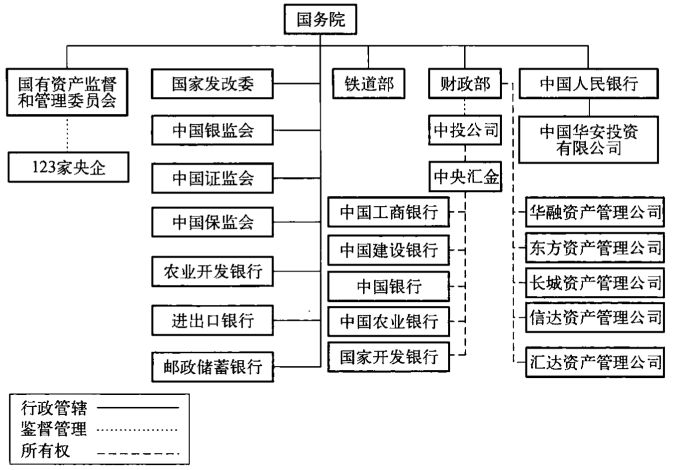
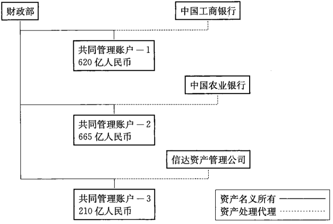
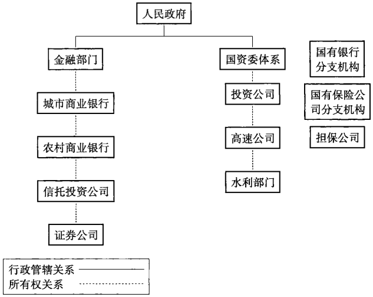

# 附录

## 参考书目

**报纸及期刊**

    《21世纪经济报道》
    《财经》
    《中国经济季刊》
    《金融时报》
    《经济观察报》
    《华尔街日报》

**网站及信息系统**

    彭博财经 Bloomberg
    财新 www.caixin.com.cn
    中国债券网 www.chinabond.com.cn
    中国银行间市场交易商协会 www.nafmi.org.cn
    中国人民银行 www.pbc.gov.cn
    美中商会 www.uschina.org
    Wind 资讯 www.wind.com.cn

**书籍及相关出版物**

**年鉴或年报**

    中国农业银行年报，2007-—2009年
    中国农业银行H股招股说明书，2010年
    中国银行年报，2003一2010年
    国家开发银行招股说明书，2014年到期的6亿美元票据
    中国建设银行年报，2003一2010年
    中国工商银行年报，2003一2010年
    中国统计局《中国统计年鉴》，中国统计出版社
    《金融稳定报告》，中国人民银行，www.pbc.gov.cn
    《中国金融统计1948--2005》，主编：苏宁，中国金融出版社2007年出版

**书籍，论文及专著**

    Brodsgaard,Kjeld Erik，《中国的政治与商业集团的产生》,未发表手稿，2010年4月
    Curry，Timothy和 Shibut，Lynn，《储蓄贷款危机的真实代价：真相与后果》，美国联邦存款保险公司银行评论，2000年12月
    Demirguc-Kunt，Asli 和 Levine，Ross，《金融结构与经济增长》,剑桥：MIT出版社，2004年出版
    Faure，David，《中国和资本主义：现代中国商业企业的历史》,中国香港：中国香港大学出版社，2006年出版
    高坚，《中国债券资本市场》，新加坡：John Wiley &Sons 出版社，2007年出版
    高坚，《中国国债》，北京：经济科学出版社，1995年出版
    Nolan，Peter，《中国和全球经济》，帕尔格雷夫：MacMillan 出版社，2001年出版
    Shih，Victor，《大冰糖山(Big Rock Candy Mountain)》，中国经济季刊,2010年6月
    Walter，Carl E和 Howie，Fraser J．T.，《私有化的中国：中国股票市场内幕（第二版）》，新加坡：John Wiley &.Sons 出版社，2006 年出版
    王年咏，《复苏与起步：1980一1991年中国证券市场简史》，中国财政经济出版社，2004年出版
    吴敬琏，《中国经济60年》，发表于《财经》杂志，2009年9月28日
    杨凯生，《稳定我国商业银行资本充足的几点思考》，发表于《21世纪经济报道》，2010年4月13日
    周小川，《吸取教训以利再战》，人民银行行长周小川在2005年10月20日中国债券市场发展高峰会上的讲话http：//www.pbc.gov.cn/publish/hanglingdao/2950/1151/11519/11519_.html

## 译者后记

  本书的英文版第一版面世之后，国内的网站上有一些网友自发的讨论，
引起我们的注意。不久，本书又在美国出版了经过修订和增补的第二版。一
部由西方学者撰写、旨在向西方读者介绍中国金融体制变革、发展及其现状的
专业性很强的图书，短期内一版再版，并在国外和国内都产生了一定的影响，
这件事本身颇有意味：中国改革开放30多年取得的辉煌成就举世公认，令人
眩目。在经济全球化的大势之下，外国人迫切需要了解中国，中国也需要了解
外国对中国的各种看法和议论。诚然，西方人总是用他们的习惯来看中国，固
有的局限和偏见是不可避免的，但这并不妨碍我们“兼听则明，偏信则暗”。

  现在呈现在读者面前的这个中文版，是根据英文第二版翻译的。祝捷
翻译了本书的两篇序言和第一章、第二章、第三章、第八章，刘骏翻译了本书
的第四章、第五章、第六章和第七章。祝捷对译稿的文学体例进行了统改，
江南村镇银行董事王海先生对书稿作了审校。出版社按照与授权方的约
定，要求译者对原书个别文字作了删节和技术性处理。由于译者学识水平
所限，译文简陋错讹之处在所难免，诚望识者指教，以期补正。

  感谢责任编辑鲁培康、胡曦露的辛勤工作！感谢东方出版中心各位为
本书付出劳动的工作人员！

译者

2013年 5月

